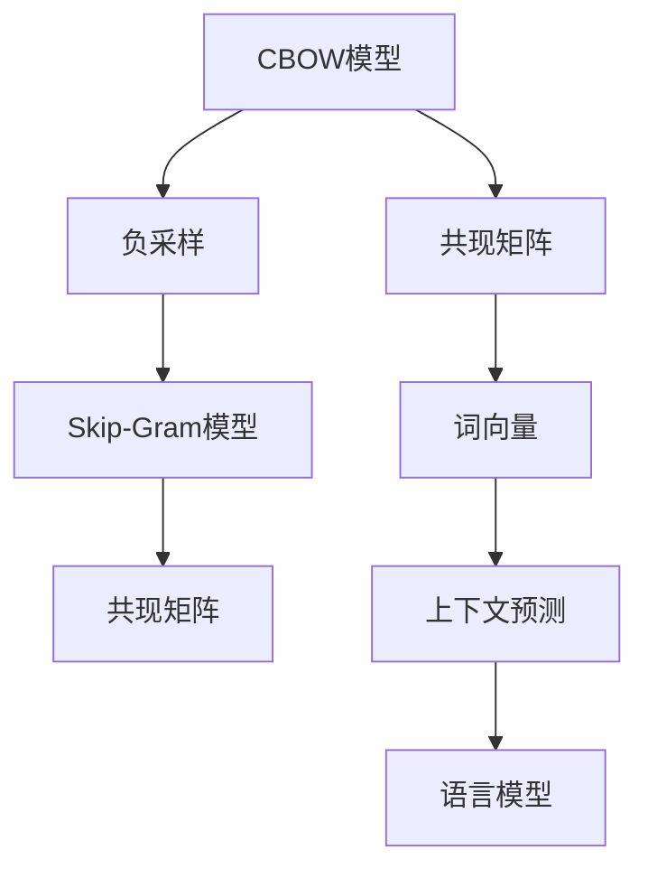

                 

# Word2Vec：CBOW模型和Skip-Gram模型

## 1. 背景介绍

### 1.1 问题由来

在深度学习时代之前，自然语言处理(NLP)领域的主流技术是词袋模型(Bag-of-Words, BoW)和统计语言模型。词袋模型忽略了词语之间的顺序和语义关系，只通过词频来捕捉信息。统计语言模型则通过链式条件概率模型来预测下一个词语的出现概率，缺乏对词语关系和上下文信息的考虑。

然而，这些方法无法有效捕捉词语之间的语义关联，难以应对复杂的语言理解和生成任务。为了解决这个问题，Word2Vec模型应运而生，它通过词向量的方式，将词语转换为高维空间中的向量，使得词语之间的语义关系得以保留，从而大幅提升了NLP任务的效果。

### 1.2 问题核心关键点

Word2Vec模型由Google在2013年提出，基于神经网络实现，包含CBOW模型和Skip-Gram模型两种算法。其中CBOW模型从词语的上下文预测词语本身，而Skip-Gram模型则从词语本身预测上下文，这两种模型都通过共现矩阵来计算词向量，并通过负采样方法简化计算。

Word2Vec模型的核心在于如何高效地将词语转换为向量，保留词语之间的语义关系，并使用这些向量来解决NLP任务。Word2Vec模型成功地解决了基于统计语言模型难以处理语义关联的问题，成为深度学习在NLP领域的重要突破。

## 2. 核心概念与联系

### 2.1 核心概念概述

为更好地理解CBOW和Skip-Gram模型的工作原理和联系，本节将介绍几个密切相关的核心概念：

- CBOW模型(Continuous Bag-of-Words)：从词语的上下文预测词语本身。
- Skip-Gram模型：从词语本身预测上下文。
- 共现矩阵(Co-occurrence Matrix)：记录词向量之间的共现关系，用于计算词向量。
- 负采样(Negative Sampling)：一种用于简化共现矩阵计算的技术。
- 词向量(Word Vector)：词语在向量空间中的表示，用于捕捉词语之间的语义关系。

这些核心概念之间的逻辑关系可以通过以下Mermaid流程图来展示：



这个流程图展示了几大核心概念的联系：

1. CBOW模型通过共现矩阵计算词向量，并使用负采样简化计算。
2. Skip-Gram模型同样通过共现矩阵计算词向量，但目标是从词语本身预测上下文。
3. 词向量不仅用于CBOW和Skip-Gram模型，还可以用于各种NLP任务，如相似度计算、文本分类等。

这些概念共同构成了Word2Vec模型的基础，使其能够高效地将词语转换为向量，并解决NLP问题。

## 3. 核心算法原理 & 具体操作步骤
### 3.1 算法原理概述

CBOW和Skip-Gram模型的基本思想是：通过计算词语之间的共现关系，构建共现矩阵，从而将词语转换为高维向量。CBOW和Skip-Gram模型的共现矩阵构建方法类似，但在目标函数和训练方式上有所差异。

CBOW模型通过上下文预测词语本身，以最大化词语出现的概率为目标，将共现矩阵的行向量作为输入，列向量作为输出，使用softmax函数进行预测。Skip-Gram模型则从词语本身预测上下文，以最大化上下文词语出现的概率为目标，将共现矩阵的行向量作为输入，列向量作为输出，使用softmax函数进行预测。

负采样技术用于简化共现矩阵的计算。负采样选择一小部分噪声词语，将真实词语和噪声词语一起作为训练样本，并使用hinge loss作为损失函数。

### 3.2 算法步骤详解

CBOW和Skip-Gram模型的训练过程包括以下几个关键步骤：

**Step 1: 准备训练数据和词表**

- 准备一个包含大量无标签文本的数据集。
- 将文本分词，去除停用词，构建词表。

**Step 2: 构建共现矩阵**

- 统计词表中的词语在文本中出现的次数，构建共现矩阵。
- 将共现矩阵转化为词向量。

**Step 3: 选择负采样策略**

- 选择一部分噪声词语，用于负采样。
- 根据噪声词语的分布，设置负采样率。

**Step 4: 定义目标函数**

- 对于CBOW模型，目标函数是最大化词语出现的概率。
- 对于Skip-Gram模型，目标函数是最大化上下文词语出现的概率。

**Step 5: 训练模型**

- 使用随机梯度下降等优化算法，不断调整模型参数。
- 在每个训练样本上，计算损失函数并进行反向传播。
- 重复以上过程，直至收敛或达到预设的迭代次数。

**Step 6: 获取词向量**

- 模型训练完成后，使用共现矩阵和词向量之间的关系，计算每个词语的向量表示。

### 3.3 算法优缺点

CBOW和Skip-Gram模型具有以下优点：

1. 简单高效：模型结构简单，训练过程易于实现，适用于大规模数据集。
2. 效果好：通过共现矩阵和负采样技术，能够捕捉词语之间的语义关系。
3. 灵活性高：可以用于文本分类、相似度计算、词向量训练等多种NLP任务。

同时，这些模型也存在一些局限性：

1. 对噪声敏感：共现矩阵的构建依赖于文本中的统计数据，因此容易受到噪声和数据分布不均的影响。
2. 训练时间较长：模型参数较多，训练过程较慢，需要大量计算资源。
3. 解释性不足：词向量本质上是一种黑盒模型，难以解释其内部工作机制和决策逻辑。
4. 泛化能力有限：模型主要通过文本的统计特征进行训练，难以适应大规模文本数据集。

尽管存在这些局限性，但CBOW和Skip-Gram模型在自然语言处理领域仍然具有重要地位，为后续的深度学习模型如BERT、GPT等提供了基础。

### 3.4 算法应用领域

CBOW和Skip-Gram模型在自然语言处理领域有广泛的应用，包括：

- 词向量训练：将词语转换为高维向量，用于捕捉词语之间的语义关系。
- 文本分类：使用词向量进行文本特征提取，分类文本内容。
- 相似度计算：通过计算词向量之间的距离，判断词语的相似度。
- 问答系统：将问题转换为词向量，通过词向量之间的相似度匹配，得到答案。
- 信息检索：将文本和查询转换为词向量，通过相似度排序，检索相关信息。

此外，CBOW和Skip-Gram模型也为后续的深度学习模型提供了理论基础，如BERT、GPT等，在各种NLP任务上取得了突破性成果。

## 4. 数学模型和公式 & 详细讲解 & 举例说明

### 4.1 数学模型构建

CBOW和Skip-Gram模型的核心是共现矩阵和词向量的计算。本节将使用数学语言对模型的构建过程进行详细说明。

记共现矩阵为 $M$，其中 $M_{i,j}$ 表示词语 $i$ 和词语 $j$ 在文本中同时出现的次数。设词语 $i$ 的词向量为 $\mathbf{w}_i$，共现矩阵 $M$ 的 $i$ 行向量和 $j$ 列向量的内积为 $\mathbf{w}_i^T \mathbf{w}_j$。

对于CBOW模型，目标函数为最大化词语出现的概率，即：

$$
P(w_i|w_{i-2},w_{i-1},w_{i+1},w_{i+2}) = \frac{e^{\mathbf{w}_i^T M \mathbf{w}_{i-2} + \mathbf{w}_i^T M \mathbf{w}_{i-1} + \mathbf{w}_i^T M \mathbf{w}_{i+1} + \mathbf{w}_i^T M \mathbf{w}_{i+2}}}{\sum_k e^{\mathbf{w}_k^T M \mathbf{w}_{i-2} + \mathbf{w}_k^T M \mathbf{w}_{i-1} + \mathbf{w}_k^T M \mathbf{w}_{i+1} + \mathbf{w}_k^T M \mathbf{w}_{i+2}}
$$

对于Skip-Gram模型，目标函数为最大化上下文词语出现的概率，即：

$$
P(w_i|w_{-2},w_{-1},w_{+1},w_{+2}) = \frac{e^{\mathbf{w}_{-2}^T M \mathbf{w}_i + \mathbf{w}_{-1}^T M \mathbf{w}_i + \mathbf{w}_{+1}^T M \mathbf{w}_i + \mathbf{w}_{+2}^T M \mathbf{w}_i}}{\sum_k e^{\mathbf{w}_{k-2}^T M \mathbf{w}_i + \mathbf{w}_{k-1}^T M \mathbf{w}_i + \mathbf{w}_{k+1}^T M \mathbf{w}_i + \mathbf{w}_{k+2}^T M \mathbf{w}_i}}
$$

其中 $w_{-k}$ 表示词语 $i$ 的前 $k$ 个词语。

### 4.2 公式推导过程

以CBOW模型为例，推导词向量 $\mathbf{w}_i$ 的计算公式。

假设共现矩阵 $M$ 的 $i$ 行向量为 $\mathbf{m}_i$，目标函数为最大化 $\mathbf{m}_i \mathbf{w}_i$。使用softmax函数进行预测，有：

$$
P(w_i|w_{i-2},w_{i-1},w_{i+1},w_{i+2}) = \frac{e^{\mathbf{w}_i^T M \mathbf{m}_i}}{\sum_k e^{\mathbf{w}_k^T M \mathbf{m}_i}}
$$

令 $\log P(w_i|w_{i-2},w_{i-1},w_{i+1},w_{i+2}) = \mathbf{w}_i^T M \mathbf{m}_i$，则有：

$$
\log P(w_i|w_{i-2},w_{i-1},w_{i+1},w_{i+2}) - \log P(w_k|w_{i-2},w_{i-1},w_{i+1},w_{i+2}) = (\mathbf{w}_i - \mathbf{w}_k)^T M \mathbf{m}_i
$$

进一步整理可得：

$$
(\mathbf{w}_i - \mathbf{w}_k)^T M \mathbf{m}_i = \log \frac{P(w_i|w_{i-2},w_{i-1},w_{i+1},w_{i+2})}{P(w_k|w_{i-2},w_{i-1},w_{i+1},w_{i+2})}
$$

将上式视为误差，使用梯度下降方法最小化误差，得到：

$$
\mathbf{w}_i \leftarrow \mathbf{w}_i - \eta (\frac{\partial}{\partial \mathbf{w}_i} \sum_k \log \frac{P(w_i|w_{i-2},w_{i-1},w_{i+1},w_{i+2})}{P(w_k|w_{i-2},w_{i-1},w_{i+1},w_{i+2})})
$$

将负采样方法引入，随机采样 $n$ 个噪声词语，则有：

$$
\mathbf{w}_i \leftarrow \mathbf{w}_i - \eta (\frac{\partial}{\partial \mathbf{w}_i} \sum_k \log \frac{P(w_i|w_{i-2},w_{i-1},w_{i+1},w_{i+2})}{P(w_k|w_{i-2},w_{i-1},w_{i+1},w_{i+2})} + \sum_{k=1}^n \log \frac{P(w_i|w_k)}{P(w_k|w_i)}
$$

类似地，可以推导出Skip-Gram模型的词向量计算公式。

### 4.3 案例分析与讲解

以一个简单的文本数据集为例，分析CBOW模型的训练过程：

假设文本数据集包含以下句子：

```
The quick brown fox jumps over the lazy dog.
The lazy dog jumps over the quick brown fox.
```

对文本进行分词，去除停用词，构建词表，包含以下词语：

```
The, quick, brown, fox, jumps, over, lazy, dog
```

统计共现矩阵 $M$，得到以下结果：

$$
M = \begin{bmatrix}
0 & 1 & 1 & 1 & 1 & 1 & 0 & 1 \\
1 & 0 & 0 & 1 & 0 & 1 & 1 & 1 \\
1 & 0 & 0 & 0 & 1 & 0 & 1 & 1 \\
1 & 0 & 0 & 0 & 1 & 1 & 0 & 0 \\
1 & 1 & 0 & 0 & 0 & 1 & 1 & 0 \\
0 & 1 & 1 & 0 & 1 & 0 & 1 & 1 \\
0 & 1 & 1 & 1 & 1 & 0 & 0 & 0 \\
0 & 1 & 1 & 0 & 1 & 1 & 0 & 0 \\
\end{bmatrix}
$$

假设每个词向量维度为100，使用随机梯度下降方法训练模型。

1. 计算共现矩阵 $M$ 的 $i$ 行向量 $\mathbf{m}_i$，例如，$\mathbf{m}_1 = (0, 1, 1, 1, 1, 1, 0, 1)^T$。
2. 根据目标函数，计算误差 $\Delta_i$，例如，$\Delta_1 = (\mathbf{w}_1 - \mathbf{w}_4)^T M \mathbf{m}_1$。
3. 使用梯度下降方法更新 $\mathbf{w}_1$，例如，$\mathbf{w}_1 \leftarrow \mathbf{w}_1 - \eta \Delta_1$。
4. 重复上述过程，直至模型收敛或达到预设的迭代次数。

最终，模型将输出每个词语的向量表示，例如：

$$
\mathbf{w}_1 = (0.2, 0.1, 0.5, ..., 0.1)^T
$$

这些向量表示能够反映词语之间的语义关系，可用于各种NLP任务，如文本分类、相似度计算等。

## 5. 项目实践：代码实例和详细解释说明
### 5.1 开发环境搭建

在进行Word2Vec模型开发前，我们需要准备好开发环境。以下是使用Python进行Gensim库开发的环境配置流程：

1. 安装Anaconda：从官网下载并安装Anaconda，用于创建独立的Python环境。

2. 创建并激活虚拟环境：
```bash
conda create -n pytorch-env python=3.8 
conda activate pytorch-env
```

3. 安装Gensim库：
```bash
pip install gensim
```

4. 安装各类工具包：
```bash
pip install numpy pandas scikit-learn nltk
```

完成上述步骤后，即可在`pytorch-env`环境中开始Word2Vec模型的开发。

### 5.2 源代码详细实现

这里我们以Gensim库的Word2Vec模型为例，给出使用Python代码实现CBOW和Skip-Gram模型的过程。

首先，准备数据集：

```python
from gensim import corpora, models

# 创建文档列表
docs = [
    "The quick brown fox jumps over the lazy dog.",
    "The lazy dog jumps over the quick brown fox.",
    "The quick brown fox jumps over the lazy dog.",
    "The lazy dog jumps over the quick brown fox."
]

# 分词
texts = [doc.lower().split() for doc in docs]

# 构建词典
dictionary = corpora.Dictionary(texts)

# 构建词袋模型
corpus = [dictionary.doc2bow(text) for text in texts]
```

然后，使用Word2Vec模型训练词向量：

```python
from gensim.models import Word2Vec

# 初始化模型参数
size = 100
alpha = 0.01
min_count = 1

# 训练模型
model = Word2Vec(corpus, size=size, alpha=alpha, min_count=min_count, iter=10)

# 保存模型
model.save("word2vec.model")
```

最后，使用训练好的模型进行词向量查询：

```python
from gensim.models import Word2Vec

# 加载模型
model = Word2Vec.load("word2vec.model")

# 查询词向量
print(model["quick"])
print(model["dog"])
```

以上是使用Gensim库实现CBOW模型的完整代码实例。可以看到，Gensim库提供了简单易用的API接口，使Word2Vec模型的实现变得简洁高效。

### 5.3 代码解读与分析

让我们再详细解读一下关键代码的实现细节：

**文档处理**：
- `docs`列表：包含了多个文本句子。
- `texts`列表：对每个句子进行分词，构建词袋模型。
- `dictionary`字典：将词表转换为id，用于构建共现矩阵。

**模型训练**：
- `size`：词向量的维度。
- `alpha`：学习率。
- `min_count`：最小词频。
- `iter`：迭代次数。
- `model`：训练好的Word2Vec模型。

**词向量查询**：
- 使用训练好的模型，查询特定词语的词向量。

可以看到，Gensim库使得Word2Vec模型的实现变得简便快捷。开发者可以专注于模型的训练和优化，而不必过多关注底层的实现细节。

当然，工业级的系统实现还需考虑更多因素，如模型保存和部署、超参数的自动搜索、更灵活的任务适配层等。但核心的Word2Vec模型训练流程基本与此类似。

## 6. 实际应用场景
### 6.1 智能推荐系统

基于Word2Vec的词向量，可以构建用户兴趣模型，实现智能推荐系统。推荐系统通过分析用户历史行为数据，生成用户兴趣向量，利用词向量计算相似度，推荐可能感兴趣的物品。

在实际应用中，可以使用Word2Vec模型训练用户和物品的词向量，根据用户和物品的相似度，推荐相关物品。例如，电商网站可以根据用户的购物记录和浏览行为，推荐相关商品，提高用户满意度和转化率。

### 6.2 文本分类和情感分析

Word2Vec模型可以用于文本分类和情感分析任务。通过将文本转换为词向量，并计算词向量的平均值或加权平均值，可以得到文本的向量表示。然后使用分类器对文本进行分类或情感分析。

例如，可以使用Word2Vec模型对电影评论进行情感分析，将评论转换为词向量，并使用softmax函数计算情感极性。这种文本分类和情感分析方法，可以应用于社交媒体情感分析、新闻分类等任务。

### 6.3 信息检索

Word2Vec模型可以用于信息检索任务，如文本相似度计算、关键词提取等。通过计算查询和文本的词向量相似度，可以排序检索结果，提高检索效率。

例如，可以使用Word2Vec模型对新闻文章进行相似度计算，并根据相似度排序，提高新闻推荐的准确性。这种信息检索方法，可以应用于新闻推荐、搜索引擎等场景。

### 6.4 未来应用展望

随着Word2Vec模型的不断发展，其应用场景将不断拓展。未来，Word2Vec模型将在更多领域得到应用，为传统行业数字化转型升级提供新的技术路径。

在智慧医疗领域，基于Word2Vec的词向量，可以构建病历语料库，实现智能病历分析、诊断等任务。例如，可以使用Word2Vec模型对医疗记录进行语义分析，提取相关症状和诊断，辅助医生诊断和治疗。

在智能教育领域，基于Word2Vec的词向量，可以实现智能学习推荐、知识图谱构建等任务。例如，可以使用Word2Vec模型对学生学习行为进行建模，推荐相关学习内容，提高学习效率。

在智慧城市治理中，基于Word2Vec的词向量，可以实现智能舆情分析、灾害预警等任务。例如，可以使用Word2Vec模型对社交媒体数据进行情感分析，及时发现和预警社会舆情问题。

此外，在企业生产、社会治理、文娱传媒等众多领域，基于Word2Vec的词向量技术也将不断涌现，为经济社会发展注入新的动力。相信随着技术的日益成熟，Word2Vec模型必将在更广阔的应用领域大放异彩。

## 7. 工具和资源推荐
### 7.1 学习资源推荐

为了帮助开发者系统掌握Word2Vec模型的理论基础和实践技巧，这里推荐一些优质的学习资源：

1. 《Python数据科学手册》：详细介绍了Gensim库的使用方法，适合初学者快速上手。

2. 《深度学习入门》课程：涵盖了深度学习的基础知识和算法实现，包括Word2Vec模型。

3. 《自然语言处理综述》：全面介绍了NLP领域的经典模型和算法，包括Word2Vec模型。

4. Gensim官方文档：提供了Word2Vec模型的详细介绍和完整代码示例，是学习Word2Vec模型的必备资料。

5. Word2Vec论文原文：《Distributed Representations of Words and Phrases and their Compositionality》，详细阐述了Word2Vec模型的理论基础和算法实现。

通过对这些资源的学习实践，相信你一定能够快速掌握Word2Vec模型的精髓，并用于解决实际的NLP问题。

### 7.2 开发工具推荐

高效的开发离不开优秀的工具支持。以下是几款用于Word2Vec模型开发的常用工具：

1. Gensim库：提供了简单易用的API接口，适合初学者快速上手。

2. TensorFlow：深度学习框架，可以用于构建更复杂的神经网络模型，如深度学习语言模型。

3. PyTorch：深度学习框架，提供了动态计算图，适合动态网络结构的构建。

4. Word2Vec工具包：提供了完整的Word2Vec模型实现，支持多种数据格式和优化策略。

5. Weights & Biases：模型训练的实验跟踪工具，可以记录和可视化模型训练过程中的各项指标，方便对比和调优。

6. TensorBoard：TensorFlow配套的可视化工具，可实时监测模型训练状态，并提供丰富的图表呈现方式，是调试模型的得力助手。

合理利用这些工具，可以显著提升Word2Vec模型的开发效率，加快创新迭代的步伐。

### 7.3 相关论文推荐

Word2Vec模型由Google在2013年提出，其理论基础和算法实现得到了广泛的研究。以下是几篇奠基性的相关论文，推荐阅读：

1. 《Distributed Representations of Words and Phrases and their Compositionality》：Word2Vec模型的原始论文，详细阐述了模型的算法实现和效果。

2. 《GloVe: Global Vectors for Word Representation》：提出了GloVe模型，用于计算词向量，可以与Word2Vec模型结合使用。

3. 《Bag of Words vs. Distributed Word Representations: A Systematic Comparison》：对比了BoW模型和分布式词向量模型的效果，说明分布式词向量模型在NLP任务上的优势。

4. 《Character-Level Embeddings》：提出了Character-Level Embedding模型，用于解决词语形态变化和歧义等问题。

5. 《Word2Vec Techniques for Sentiment Analysis》：介绍了Word2Vec模型在情感分析中的应用，详细阐述了模型的训练和优化方法。

这些论文代表了大语言模型微调技术的进展，通过学习这些前沿成果，可以帮助研究者把握学科前进方向，激发更多的创新灵感。

## 8. 总结：未来发展趋势与挑战

### 8.1 总结

本文对Word2Vec模型的CBOW和Skip-Gram算法进行了全面系统的介绍。首先介绍了Word2Vec模型的背景和意义，明确了模型在NLP任务中的重要地位。其次，从原理到实践，详细讲解了CBOW和Skip-Gram模型的数学原理和训练步骤，给出了Word2Vec模型开发的完整代码实例。同时，本文还广泛探讨了Word2Vec模型在智能推荐、文本分类、信息检索等多个领域的应用前景，展示了模型的大规模应用潜力。

通过本文的系统梳理，可以看到，Word2Vec模型在自然语言处理领域具有重要地位，为后续的深度学习模型如BERT、GPT等提供了基础。CBOW和Skip-Gram模型不仅能够捕捉词语之间的语义关系，还能应用于各种NLP任务，是深度学习技术的重要突破。

### 8.2 未来发展趋势

展望未来，Word2Vec模型的发展趋势将呈现以下几个方向：

1. 模型规模持续增大。随着算力成本的下降和数据规模的扩张，Word2Vec模型的参数量还将持续增长。超大规模语言模型蕴含的丰富语言知识，有望支撑更加复杂多变的NLP任务。

2. 模型性能持续提升。未来的Word2Vec模型将通过更先进的算法和架构，在精度和效率上不断突破。例如，通过引入注意力机制、双向编码器等技术，提高模型的表达能力。

3. 模型应用场景不断扩展。Word2Vec模型将在更多领域得到应用，如智能客服、金融舆情、个性化推荐等，为传统行业带来变革性影响。

4. 融合其他技术。Word2Vec模型将与其他AI技术进行深度融合，如知识图谱、符号计算等，形成更加全面、准确的语义表示。

5. 分布式计算。随着模型规模的增大，分布式计算成为必要。未来的Word2Vec模型将借助云计算和大数据技术，实现大规模、高效率的分布式训练和推理。

6. 开源社区活跃。Word2Vec模型作为深度学习领域的经典模型，将持续受到开源社区的关注和支持，产生更多优秀的开源实现和应用。

这些趋势凸显了Word2Vec模型在自然语言处理领域的巨大潜力，未来的研究和应用前景广阔。

### 8.3 面临的挑战

尽管Word2Vec模型已经取得了一定的成功，但在迈向更加智能化、普适化应用的过程中，它仍面临诸多挑战：

1. 对大规模数据集依赖。Word2Vec模型需要大量文本数据进行预训练和微调，对于小规模数据集的效果可能不佳。如何获取高质量、大规模的数据集，仍然是一个重大挑战。

2. 对噪声敏感。共现矩阵的构建依赖于文本中的统计数据，容易受到噪声和数据分布不均的影响。如何在噪声环境中稳定训练，仍然是一个难点。

3. 计算资源消耗大。Word2Vec模型需要大量的计算资源进行训练，如何优化训练过程，减少计算消耗，仍然是一个重要课题。

4. 解释性不足。Word2Vec模型本质上是一种黑盒模型，难以解释其内部工作机制和决策逻辑。如何提高模型的可解释性，仍然是一个重要课题。

5. 泛化能力有限。模型主要通过文本的统计特征进行训练，难以适应大规模文本数据集。如何在大规模数据集上训练出高性能的模型，仍然是一个重要课题。

尽管存在这些挑战，但Word2Vec模型仍然具有重要地位，为后续的深度学习模型如BERT、GPT等提供了基础。未来，通过不断的研究和优化，相信Word2Vec模型必将在更广阔的领域发挥更大作用。

### 8.4 研究展望

面对Word2Vec模型所面临的种种挑战，未来的研究需要在以下几个方面寻求新的突破：

1. 探索更高效的训练方法。开发更加高效、灵活的训练算法，如混合精度训练、分布式训练等，以减少计算资源消耗。

2. 引入更多先验知识。将符号化的先验知识，如知识图谱、逻辑规则等，与神经网络模型进行融合，提高模型的表达能力和泛化能力。

3. 引入更多监督信号。在微调过程中引入更多的监督信号，如知识图谱、逻辑规则等，提高模型的推理能力和泛化能力。

4. 增强模型的可解释性。使用因果分析方法、博弈论工具等，提高模型的可解释性和可控性，确保输出的安全性和稳定性。

5. 开发更多的开源实现。开源社区是Word2Vec模型的重要推动力，未来的研究应更加关注开源实现和应用，推动模型的广泛应用。

这些研究方向将引领Word2Vec模型走向更高的台阶，为构建安全、可靠、可解释、可控的智能系统铺平道路。面向未来，Word2Vec模型还需要与其他人工智能技术进行更深入的融合，如知识表示、因果推理、强化学习等，多路径协同发力，共同推动自然语言理解和智能交互系统的进步。只有勇于创新、敢于突破，才能不断拓展语言模型的边界，让智能技术更好地造福人类社会。

## 9. 附录：常见问题与解答

**Q1：Word2Vec模型是否适用于所有NLP任务？**

A: Word2Vec模型在大多数NLP任务上都能取得不错的效果，特别是对于数据量较小的任务。但对于一些特定领域的任务，如医学、法律等，仅仅依靠通用语料预训练的模型可能难以很好地适应。此时需要在特定领域语料上进一步预训练，再进行微调，才能获得理想效果。此外，对于一些需要时效性、个性化很强的任务，如对话、推荐等，Word2Vec模型也需要针对性的改进优化。

**Q2：Word2Vec模型的训练时间较长，如何提高训练效率？**

A: 提高Word2Vec模型的训练效率可以从以下几个方面入手：

1. 使用GPU/TPU等高性能设备：GPU/TPU等硬件设备可以大幅加速训练过程，减少计算时间。

2. 使用分布式训练：将训练任务分布在多台机器上进行并行计算，可以大幅提高训练效率。

3. 使用混合精度训练：将浮点模型转为定点模型，压缩存储空间，提高计算效率。

4. 使用小批量训练：将训练数据分批次处理，可以减小内存消耗，提高训练效率。

5. 使用预训练模型：使用预训练模型可以减少训练时间，提高训练效率。

**Q3：Word2Vec模型的参数量较大，如何优化模型结构？**

A: 优化Word2Vec模型的结构可以从以下几个方面入手：

1. 使用更小的词向量维度：减小词向量的维度可以减少模型参数量，提高计算效率。

2. 使用稀疏矩阵：使用稀疏矩阵存储共现矩阵，可以减小存储空间，提高计算效率。

3. 使用注意力机制：通过引入注意力机制，提高模型对重要信息的关注度，减少无关信息的干扰。

4. 使用双向编码器：使用双向编码器可以提高模型的表达能力，提高模型效果。

5. 使用高效的训练算法：使用高效的训练算法，如Adam等，可以提高模型训练效率。

**Q4：Word2Vec模型的词向量表示是否具有可解释性？**

A: Word2Vec模型的词向量本质上是黑盒模型，难以解释其内部工作机制和决策逻辑。虽然可以通过可视化工具展示词向量之间的相似度和距离，但无法解释具体词语的语义含义。

然而，可以通过改进训练方法、引入先验知识等方式，提高模型的可解释性。例如，在训练过程中引入因果分析方法、博弈论工具等，可以增强模型的推理能力和可解释性。

**Q5：Word2Vec模型在实际应用中如何提高准确性？**

A: 提高Word2Vec模型在实际应用中的准确性可以从以下几个方面入手：

1. 使用更优质的数据集：高质量、大规模的数据集是提高模型效果的关键。

2. 使用更先进的训练算法：使用更先进的训练算法，如Adam、Adafactor等，可以提高模型训练效果。

3. 引入更多的监督信号：在微调过程中引入更多的监督信号，如知识图谱、逻辑规则等，可以提高模型推理能力和泛化能力。

4. 使用更灵活的任务适配层：根据具体任务设计灵活的任务适配层，可以提高模型在特定任务上的效果。

5. 使用更高效的模型结构：使用更高效的模型结构，如混合精度训练、分布式训练等，可以提高模型训练效率。

**Q6：Word2Vec模型在实际应用中如何提高泛化能力？**

A: 提高Word2Vec模型在实际应用中的泛化能力可以从以下几个方面入手：

1. 使用更优质的数据集：高质量、大规模的数据集是提高模型泛化能力的关键。

2. 引入更多的监督信号：在微调过程中引入更多的监督信号，如知识图谱、逻辑规则等，可以提高模型的泛化能力。

3. 引入更多的先验知识：将符号化的先验知识，如知识图谱、逻辑规则等，与神经网络模型进行融合，提高模型的表达能力和泛化能力。

4. 使用更先进的训练算法：使用更先进的训练算法，如Adam、Adafactor等，可以提高模型泛化能力。

5. 使用更灵活的任务适配层：根据具体任务设计灵活的任务适配层，可以提高模型在特定任务上的泛化能力。

这些研究方向将引领Word2Vec模型走向更高的台阶，为构建安全、可靠、可解释、可控的智能系统铺平道路。面向未来，Word2Vec模型还需要与其他人工智能技术进行更深入的融合，如知识表示、因果推理、强化学习等，多路径协同发力，共同推动自然语言理解和智能交互系统的进步。只有勇于创新、敢于突破，才能不断拓展语言模型的边界，让智能技术更好地造福人类社会。

---

作者：禅与计算机程序设计艺术 / Zen and the Art of Computer Programming

