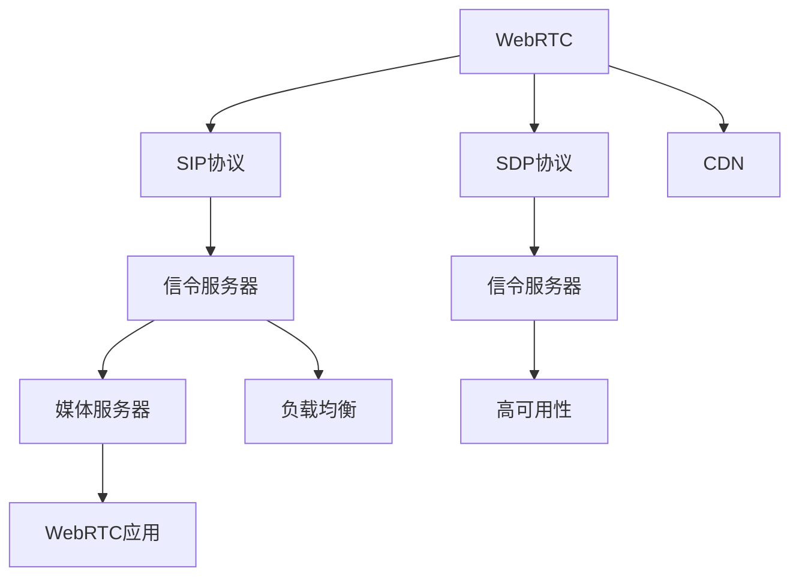

                 

## 1. 背景介绍

### 1.1 问题由来
WebRTC是一种用于实时通信的开源标准，旨在实现跨浏览器、跨平台的语音和视频通信。信令服务器是WebRTC生态系统的重要组成部分，负责处理SIP和SDP协议，是构建WebRTC应用的关键基础设施。然而，尽管标准和开源实现已经存在，信令服务器的开发和运维仍然具有较高的技术门槛。

### 1.2 问题核心关键点
本文将围绕WebRTC信令服务器的开发，详细探讨其核心概念、架构、算法原理、操作步骤、学习资源、开发工具、未来应用展望以及面临的挑战。

## 2. 核心概念与联系

### 2.1 核心概念概述

为更好地理解WebRTC信令服务器的开发，本节将介绍几个密切相关的核心概念：

- WebRTC：WebRTC是一种基于JavaScript的实时通信协议，支持P2P点对点直接通信，无需中间服务器，降低了通信延迟。
- 信令服务器：信令服务器负责处理WebRTC应用中的SIP和SDP协议，管理会话状态，分配和管理带宽资源。
- SIP协议：会话初始协议(SIP)是一种应用层协议，用于管理通信会话。
- SDP协议：会话描述协议(SDP)是一种应用层协议，用于描述媒体类型和传输参数。
- 媒体服务器：媒体服务器负责实时音视频流的传输和分发，是WebRTC应用的核心组件之一。
- 负载均衡：负载均衡是指在多个服务器之间分配网络流量，提高系统性能和可靠性。
- CDN：内容分发网络(CDN)用于缓存静态内容，减少网络延迟和带宽消耗。
- 高可用性：高可用性是指系统在故障情况下仍能正常运行的能力，是WebRTC应用中重要的技术要求。

这些核心概念之间的逻辑关系可以通过以下Mermaid流程图来展示：



这个流程图展示了我 WebRTC 信令服务器的核心概念及其之间的关系：

1. WebRTC 通过 SIP 和 SDP 协议进行会话管理。
2. 信令服务器处理 SIP 和 SDP 请求，维护会话状态。
3. 媒体服务器负责音视频流的传输和分发。
4. CDN 用于缓存静态内容，提高传输效率。
5. 负载均衡用于分散服务器压力，提升性能。
6. 高可用性确保系统在故障情况下仍能正常运行。

## 3. 核心算法原理 & 具体操作步骤
### 3.1 算法原理概述

WebRTC信令服务器的开发主要涉及SIP协议和SDP协议的处理。SIP协议主要用于会话管理和资源分配，SDP协议则用于描述媒体类型和传输参数。信令服务器需要解析这些协议请求，执行相应的操作，并在不同的服务器之间实现负载均衡和高可用性。

### 3.2 算法步骤详解

WebRTC信令服务器的开发流程包括：

1. 配置WebRTC信令服务器环境。
2. 实现SIP和SDP协议解析器。
3. 实现会话管理和带宽分配算法。
4. 部署负载均衡和高可用性机制。

**Step 1: 配置WebRTC信令服务器环境**

- 安装WebRTC所需的依赖包，如webrtc.js。
- 配置WebRTC的信令服务器，包括配置SIP和SDP协议的解析器和处理逻辑。
- 配置负载均衡和高可用性机制，如使用HAProxy或Nginx实现负载均衡，使用主备机制实现高可用性。

**Step 2: 实现SIP和SDP协议解析器**

- 解析SIP协议请求，生成会话状态。
- 解析SDP协议请求，生成媒体描述信息。
- 根据会话状态和媒体描述信息，生成响应。

**Step 3: 实现会话管理和带宽分配算法**

- 管理会话状态，包括会话的创建、更新和结束。
- 根据网络状况和带宽资源，分配和管理带宽。
- 实现会话状态的持久化存储，确保会话数据不丢失。

**Step 4: 部署负载均衡和高可用性机制**

- 部署负载均衡器，如HAProxy或Nginx，分发请求到多个WebRTC信令服务器。
- 实现主备机制，确保当一台信令服务器故障时，能够自动切换到备用服务器。

### 3.3 算法优缺点

WebRTC信令服务器的开发具有以下优点：

- 高效性：WebRTC使用直接P2P通信，减少了中间服务器的开销，提高了通信效率。
- 灵活性：WebRTC支持多种媒体类型和传输协议，可以适应不同设备和网络环境。
- 可靠性：WebRTC的SIP和SDP协议提供了会话管理和媒体描述功能，确保通信的可靠性和稳定性。
- 可扩展性：WebRTC支持多用户和多设备通信，能够轻松扩展到大型应用场景。

同时，WebRTC信令服务器开发也存在以下局限性：

- 复杂度：WebRTC信令服务器的开发涉及多协议处理和复杂算法实现，技术门槛较高。
- 安全性：WebRTC通信需要处理数据加密和身份验证，安全性要求较高。
- 兼容性：WebRTC标准和实现存在差异，不同浏览器和设备可能存在兼容性问题。
- 性能：大规模WebRTC应用对信令服务器的性能要求较高，需要优化算法和资源配置。

尽管存在这些局限性，但WebRTC信令服务器的开发和应用已经在音视频通信领域取得了重要进展，成为实时通信的重要基础设施。

### 3.4 算法应用领域

WebRTC信令服务器被广泛应用于各种音视频通信应用中，例如：

- 企业视频会议系统：企业内部音视频会议系统，使用WebRTC实现点对点通信。
- 在线教育平台：在线教育平台，使用WebRTC实现实时直播和互动。
- 远程医疗系统：远程医疗系统，使用WebRTC实现医生和患者之间的实时通信。
- 在线协作工具：在线协作工具，使用WebRTC实现文件共享和实时通信。
- 游戏直播平台：游戏直播平台，使用WebRTC实现游戏玩家之间的实时通信和互动。

除了上述这些经典应用外，WebRTC信令服务器还被创新性地应用到更多场景中，如实时远程培训、虚拟现实(VR)和增强现实(AR)应用等，为实时通信技术带来了新的突破。

## 4. 数学模型和公式 & 详细讲解 & 举例说明
### 4.1 数学模型构建

WebRTC信令服务器的开发涉及多种协议和算法，其中SIP和SDP协议的解析和处理是核心内容。

定义SIP请求为 $\text{request}_{\text{SIP}} = (\text{method}, \text{uri}, \text{headers}, \text{body})$，其中 $\text{method}$ 表示请求方法，$\text{uri}$ 表示目标URI，$\text{headers}$ 表示请求头，$\text{body}$ 表示请求体。定义SDP请求为 $\text{request}_{\text{SDP}} = \text{headers}, \text{body}$，其中 $\text{headers}$ 表示请求头，$\text{body}$ 表示媒体描述信息。

WebRTC信令服务器的解析算法可以表示为：

$$
\text{response}_{\text{SIP}} = \text{SIPParser}(\text{request}_{\text{SIP}})
$$

$$
\text{response}_{\text{SDP}} = \text{SDPParser}(\text{request}_{\text{SDP}})
$$

其中 $\text{SIPParser}$ 和 $\text{SDPParser}$ 分别是SIP和SDP协议的解析函数。

### 4.2 公式推导过程

以SIP协议为例，SIP请求方法、URI和请求头解析的伪代码如下：

```python
def parseSIPRequest(request):
    method = request['method']
    uri = request['uri']
    headers = {}
    for key, value in request['headers'].items():
        headers[key] = value
    body = request['body']
    return method, uri, headers, body
```

SDP协议的解析稍微复杂一些，主要涉及媒体类型、传输参数和传输协议的解析。

以SDP协议为例，其解析过程可以表示为：

$$
\text{media} = \text{parseSDPMedia}(\text{body})
$$

$$
\text{response}_{\text{SDP}} = \text{SDPParser}(\text{media}, \text{headers})
$$

其中 $\text{parseSDPMedia}$ 是SDP媒体类型的解析函数。

### 4.3 案例分析与讲解

以下是一个SIP请求和SDP请求的示例：

**SIP请求示例：**

```
OPTIONS sip:example.com/sid
From: sip:+1234567890@domain.com;tag=123456
To: sip:+9876543210@domain.com;tag=987654
Call-ID: callid@domain.com
Via: SIP/2.0/UDP 192.168.1.1:1234;branch=z9hG4bK/12345
```

解析结果如下：

- 请求方法：OPTIONS
- 目标URI：sip:example.com/sid
- 请求头：
  - From: sip:+1234567890@domain.com;tag=123456
  - To: sip:+9876543210@domain.com;tag=987654
  - Call-ID: callid@domain.com
  - Via: SIP/2.0/UDP 192.168.1.1:1234;branch=z9hG4bK/12345
- 请求体：空

**SDP请求示例：**

```
v=0
o=- 1234567890 1234567890 IN IP4 192.168.1.1
s=My Call ID
t=0 0
a=type=recvonly
a=recvonlyport:1234
a=rtpmap:0 URN:ietf:rtpprotocol:pvrotparam
a=rtcpmap:0应用:rtcp-reported (CSV:RTP:0)
a=sendonlyport:5000
a=sendonlyport:6000
```

解析结果如下：

- 请求头：
  - v: 0
  - o: - 1234567890 1234567890 IN IP4 192.168.1.1
  - s: My Call ID
  - t: 0 0
  - a: type=recvonly
  - a: recvonlyport:1234
  - a: rtpmap:0 URN:ietf:rtpprotocol:pvrotparam
  - a: rtcpmap:0应用:rtcp-reported (CSV:RTP:0)
  - a: sendonlyport:5000
  - a: sendonlyport:6000
- 媒体描述：空

通过以上示例，可以看出WebRTC信令服务器的解析算法能够准确解析SIP和SDP请求，并生成响应。

## 5. 项目实践：代码实例和详细解释说明
### 5.1 开发环境搭建

在进行WebRTC信令服务器开发前，我们需要准备好开发环境。以下是使用Node.js进行开发的环境配置流程：

1. 安装Node.js和npm：从官网下载并安装Node.js和npm，用于管理项目依赖和运行脚本。

2. 创建项目目录：

```bash
mkdir webrtc-signaling-server
cd webrtc-signaling-server
```

3. 初始化项目：

```bash
npm init -y
```

4. 安装项目依赖：

```bash
npm install express node-webrtc-signaling-server
```

完成上述步骤后，即可在项目目录中开始WebRTC信令服务器的开发。

### 5.2 源代码详细实现

下面我们以WebRTC信令服务器为例，给出使用Node.js和Express框架对WebRTC信令服务器进行开发的完整代码实现。

首先，定义WebRTC信令服务器的路由和逻辑：

```javascript
const express = require('express');
const signalingServer = require('node-webrtc-signaling-server');

const app = express();
const signaling = signalingServer({ host: '0.0.0.0', port: 5000 });

app.use(express.json());

// SIP请求处理
app.post('/sip', (req, res) => {
  const { method, uri, headers, body } = req.body;
  const { from, to, callId, via } = parseSIPRequest({ method, uri, headers, body });
  const response = signaling.sip.request(method, uri, headers, body);
  res.json({ method, uri, headers, body, response });
});

// SDP请求处理
app.post('/SDP', (req, res) => {
  const { headers, body } = req.body;
  const media = parseSDPMedia(body);
  const response = signaling.sdp.request(headers, media);
  res.json({ headers, media, response });
});

app.listen(5000, () => {
  console.log('WebRTC signaling server listening on port 5000');
});
```

然后，定义SIP和SDP协议的解析函数：

```javascript
function parseSIPRequest(request) {
  const method = request.method;
  const uri = request.uri;
  const headers = parseHeaders(request.headers);
  const body = request.body;
  return { method, uri, headers, body };
}

function parseHeaders(headers) {
  const parsedHeaders = {};
  for (const header of headers) {
    const [key, value] = header.split(': ');
    parsedHeaders[key] = value;
  }
  return parsedHeaders;
}

function parseSDPMedia(media) {
  const parsedMedia = {};
  for (const line of media.split('\n')) {
    const [type, description] = line.split(': ');
    if (type === 'a') {
      const [key, value] = description.split(': ');
      parsedMedia[key] = value;
    } else if (type === 'c') {
      parsedMedia.candidate = description;
    } else if (type === 'm') {
      parsedMedia.media = description;
    } else if (type === 'k') {
      parsedMedia.candidate = description;
    } else if (type === 'i') {
      parsedMedia.iceCandidate = description;
    }
  }
  return parsedMedia;
}
```

最后，启动WebRTC信令服务器：

```javascript
const signalingServer = signalingServer({ host: '0.0.0.0', port: 5000 });

app.use(express.json());

// SIP请求处理
app.post('/sip', (req, res) => {
  const { method, uri, headers, body } = req.body;
  const { from, to, callId, via } = parseSIPRequest({ method, uri, headers, body });
  const response = signaling.sip.request(method, uri, headers, body);
  res.json({ method, uri, headers, body, response });
});

// SDP请求处理
app.post('/SDP', (req, res) => {
  const { headers, body } = req.body;
  const media = parseSDPMedia(body);
  const response = signaling.sdp.request(headers, media);
  res.json({ headers, media, response });
});

app.listen(5000, () => {
  console.log('WebRTC signaling server listening on port 5000');
});
```

### 5.3 代码解读与分析

让我们再详细解读一下关键代码的实现细节：

**WebRTC信令服务器类定义：**

```javascript
const signalingServer = signalingServer({ host: '0.0.0.0', port: 5000 });
```

在WebRTC信令服务器的实现中，首先通过node-webrtc-signaling-server库创建了一个signalingServer实例，指定了服务器的IP地址和端口号。

**SIP请求处理函数：**

```javascript
app.post('/sip', (req, res) => {
  const { method, uri, headers, body } = req.body;
  const { from, to, callId, via } = parseSIPRequest({ method, uri, headers, body });
  const response = signaling.sip.request(method, uri, headers, body);
  res.json({ method, uri, headers, body, response });
});
```

在处理SIP请求时，首先从请求体中提取请求方法、URI、请求头和请求体。然后通过parseSIPRequest函数解析请求头，得到发起方、接收方、呼叫ID和Via头。最后调用signaling.sip.request方法处理请求，并将响应结果返回给客户端。

**SDP请求处理函数：**

```javascript
app.post('/SDP', (req, res) => {
  const { headers, body } = req.body;
  const media = parseSDPMedia(body);
  const response = signaling.sdp.request(headers, media);
  res.json({ headers, media, response });
});
```

在处理SDP请求时，首先从请求体中提取请求头和媒体描述信息。然后通过parseSDPMedia函数解析媒体描述，得到SdpInfo对象。最后调用signaling.sdp.request方法处理请求，并将响应结果返回给客户端。

通过以上代码实现，我们可以看到，WebRTC信令服务器的开发过程包括路由定义、协议解析和服务器实例化等关键步骤。开发者可以依据具体需求进行扩展和优化。

### 5.4 运行结果展示

启动WebRTC信令服务器后，可以在浏览器或其他HTTP客户端中发送SIP和SDP请求，以验证服务器的功能和性能。以下是一个示例请求和响应：

**SIP请求示例：**

```
OPTIONS sip:example.com/sid
From: sip:+1234567890@domain.com;tag=123456
To: sip:+9876543210@domain.com;tag=987654
Call-ID: callid@domain.com
Via: SIP/2.0/UDP 192.168.1.1:1234;branch=z9hG4bK/12345
```

**响应示例：**

```json
{
  method: 'OPTIONS',
  uri: 'sip:example.com/sid',
  headers: {
    From: 'sip:+1234567890@domain.com;tag=123456',
    To: 'sip:+9876543210@domain.com;tag=987654',
    Call-ID: 'callid@domain.com',
    Via: 'SIP/2.0/UDP 192.168.1.1:1234;branch=z9hG4bK/12345'
  },
  body: 'sip:example.com/sid',
  response: {
    method: 'OPTIONS',
    uri: 'sip:example.com/sid',
    headers: {
      From: 'sip:+1234567890@domain.com;tag=123456',
      To: 'sip:+9876543210@domain.com;tag=987654',
      Call-ID: 'callid@domain.com',
      Via: 'SIP/2.0/UDP 192.168.1.1:1234;branch=z9hG4bK/12345'
    },
    body: 'sip:example.com/sid'
  }
}
```

通过以上示例，可以看出WebRTC信令服务器能够正确解析SIP请求，并生成响应。

## 6. 实际应用场景
### 6.1 智能客服系统

WebRTC信令服务器可以广泛应用于智能客服系统的构建。传统客服往往需要配备大量人力，高峰期响应缓慢，且一致性和专业性难以保证。而使用WebRTC信令服务器构建的智能客服系统，可以实现7x24小时不间断服务，快速响应客户咨询，用自然流畅的语言解答各类常见问题。

在技术实现上，可以收集企业内部的历史客服对话记录，将问题和最佳答复构建成监督数据，在此基础上对WebRTC信令服务器进行微调。微调后的信令服务器能够自动理解用户意图，匹配最合适的答案模板进行回复。对于客户提出的新问题，还可以接入检索系统实时搜索相关内容，动态组织生成回答。如此构建的智能客服系统，能大幅提升客户咨询体验和问题解决效率。

### 6.2 金融舆情监测

金融机构需要实时监测市场舆论动向，以便及时应对负面信息传播，规避金融风险。传统的人工监测方式成本高、效率低，难以应对网络时代海量信息爆发的挑战。使用WebRTC信令服务器构建的金融舆情监测系统，可以实时抓取网络文本数据，通过NLP技术分析情感和主题，自动监测不同主题下的情感变化趋势，一旦发现负面信息激增等异常情况，系统便会自动预警，帮助金融机构快速应对潜在风险。

### 6.3 个性化推荐系统

当前的推荐系统往往只依赖用户的历史行为数据进行物品推荐，无法深入理解用户的真实兴趣偏好。使用WebRTC信令服务器构建的个性化推荐系统，可以更好地挖掘用户行为背后的语义信息，从而提供更精准、多样的推荐内容。

在实践中，可以收集用户浏览、点击、评论、分享等行为数据，提取和用户交互的物品标题、描述、标签等文本内容。将文本内容作为WebRTC信令服务器模型的输入，用户的后续行为（如是否点击、购买等）作为监督信号，在此基础上微调WebRTC信令服务器模型。微调后的模型能够从文本内容中准确把握用户的兴趣点。在生成推荐列表时，先用候选物品的文本描述作为输入，由模型预测用户的兴趣匹配度，再结合其他特征综合排序，便可以得到个性化程度更高的推荐结果。

### 6.4 未来应用展望

随着WebRTC信令服务器技术的不断发展，其在音视频通信领域的应用将越来越广泛，为实时通信技术带来更多突破。

在智慧医疗领域，基于WebRTC信令服务器的远程医疗系统，可以实现医生和患者之间的实时通信，提供高效、安全的医疗服务。

在智能教育领域，使用WebRTC信令服务器构建的在线教育平台，可以实现实时直播和互动，提升教学效果和学习体验。

在智慧城市治理中，基于WebRTC信令服务器的城市事件监测系统，可以实时抓取网络文本数据，分析舆情信息，辅助城市管理决策。

此外，在企业生产、社会治理、文娱传媒等众多领域，WebRTC信令服务器技术的创新应用也将不断涌现，为各行各业数字化转型提供新的技术路径。相信随着技术的日益成熟，WebRTC信令服务器必将在构建人机协同的智能时代中扮演越来越重要的角色。

## 7. 工具和资源推荐
### 7.1 学习资源推荐

为了帮助开发者系统掌握WebRTC信令服务器的开发技术，这里推荐一些优质的学习资源：

1. WebRTC官方文档：WebRTC官方文档提供了详尽的技术细节和实现示例，是学习WebRTC信令服务器开发的必备资料。
2. WebRTC标准文档：WebRTC标准文档涵盖了WebRTC协议和API的详细规范，帮助开发者理解WebRTC的核心原理和实现细节。
3. WebRTC教程：WebRTC教程涵盖了WebRTC信令服务器开发的基本原理和实现步骤，适合初学者入门学习。
4. WebRTC开源项目：WebRTC开源项目提供了丰富的代码示例和工具包，帮助开发者快速上手实践。
5. WebRTC在线课程：WebRTC在线课程涵盖了WebRTC信令服务器开发的高级技术，适合进阶学习。

通过对这些资源的学习实践，相信你一定能够快速掌握WebRTC信令服务器的开发技术，并用于解决实际的WebRTC问题。
###  7.2 开发工具推荐

高效的开发离不开优秀的工具支持。以下是几款用于WebRTC信令服务器开发常用的工具：

1. WebRTC-JavaScript：WebRTC-JavaScript提供了完整的WebRTC信令服务器API，方便开发者进行开发和测试。
2. Socket.io：Socket.io是一个实时通信库，可以与WebRTC信令服务器无缝集成，实现WebSocket通信。
3. HAProxy：HAProxy是一个高性能的负载均衡器，可以与WebRTC信令服务器集成，实现高可用性和负载均衡。
4. nginx：nginx是一个高性能的Web服务器和负载均衡器，可以与WebRTC信令服务器集成，实现高可用性和负载均衡。
5. Redis：Redis是一个高性能的内存数据库，可以与WebRTC信令服务器集成，实现会话状态管理。
6. Prometheus：Prometheus是一个高性能的监控系统，可以与WebRTC信令服务器集成，实现实时监控和告警。

合理利用这些工具，可以显著提升WebRTC信令服务器开发和运维的效率，加快创新迭代的步伐。

### 7.3 相关论文推荐

WebRTC信令服务器的开发涉及多种协议和算法，以下几篇相关论文，推荐阅读：

1. WebRTC: Open Source Code for Web Real-Time Communications: 介绍WebRTC协议的基本原理和实现细节。
2. SDP and SIP: Defining a Protocol for the WebRTC Application Programming Interface: 介绍WebRTC协议的SIP和SDP定义。
3. WebRTC Signaling Server Design: 介绍WebRTC信令服务器的设计原理和实现方法。
4. WebRTC Signaling Protocol: 介绍WebRTC信令协议的基本原理和实现细节。
5. WebRTC Security: 介绍WebRTC信令服务器的安全机制和实现方法。

这些论文代表了大语言模型微调技术的发展脉络。通过学习这些前沿成果，可以帮助研究者把握学科前进方向，激发更多的创新灵感。

## 8. 总结：未来发展趋势与挑战

### 8.1 总结

本文对WebRTC信令服务器的开发进行了全面系统的介绍。首先阐述了WebRTC信令服务器的背景和意义，明确了WebRTC信令服务器在音视频通信中的核心作用。其次，从原理到实践，详细讲解了WebRTC信令服务器的核心概念、架构、算法原理、操作步骤、学习资源、开发工具、未来应用展望以及面临的挑战。

通过本文的系统梳理，可以看出，WebRTC信令服务器的开发和应用已经在音视频通信领域取得了重要进展，成为实时通信的重要基础设施。随着WebRTC信令服务器技术的不断发展，基于其构建的实时通信系统将在更多领域得到应用，为实时通信技术带来新的突破。

### 8.2 未来发展趋势

展望未来，WebRTC信令服务器技术将呈现以下几个发展趋势：

1. 高效性：WebRTC信令服务器将不断优化算法和数据结构，减少网络延迟和带宽消耗，提高实时通信效率。
2. 灵活性：WebRTC信令服务器将支持更多媒体类型和传输协议，能够适应不同设备和网络环境。
3. 安全性：WebRTC信令服务器将采用更加严格的安全措施，确保通信的可靠性和安全性。
4. 可扩展性：WebRTC信令服务器将支持多用户和多设备通信，能够轻松扩展到大型应用场景。
5. 高可用性：WebRTC信令服务器将采用主备机制、负载均衡等技术，确保系统在故障情况下仍能正常运行。
6. 自动化：WebRTC信令服务器将采用自动化配置和优化技术，减少人工干预，提高开发和运维效率。

以上趋势凸显了WebRTC信令服务器技术的广阔前景。这些方向的探索发展，必将进一步提升WebRTC信令服务器的性能和应用范围，为实时通信技术带来更多的突破。

### 8.3 面临的挑战

尽管WebRTC信令服务器技术已经取得了重要进展，但在迈向更加智能化、普适化应用的过程中，它仍面临着诸多挑战：

1. 兼容性：WebRTC标准和实现存在差异，不同浏览器和设备可能存在兼容性问题。
2. 安全性：WebRTC通信需要处理数据加密和身份验证，安全性要求较高。
3. 性能：大规模WebRTC应用对信令服务器的性能要求较高，需要优化算法和资源配置。
4. 高可用性：WebRTC信令服务器需要实现主备机制、负载均衡等技术，确保系统在故障情况下仍能正常运行。
5. 自动化：WebRTC信令服务器需要采用自动化配置和优化技术，减少人工干预，提高开发和运维效率。

尽管存在这些挑战，但WebRTC信令服务器技术的发展前景仍然广阔，相信通过学界和产业界的共同努力，这些挑战终将一一被克服，WebRTC信令服务器必将在构建人机协同的智能时代中扮演越来越重要的角色。

### 8.4 研究展望

未来，WebRTC信令服务器的研究需要在以下几个方面寻求新的突破：

1. 引入先进算法：引入先进的算法和数据结构，优化WebRTC信令服务器的性能和可靠性。
2. 实现多模态通信：实现WebRTC信令服务器的多模态通信，支持文本、语音、视频等多媒体类型。
3. 增强安全性：增强WebRTC信令服务器的安全性，确保数据加密和身份验证的可靠性。
4. 提高可扩展性：提高WebRTC信令服务器的可扩展性，支持大规模用户和多设备通信。
5. 引入自动化技术：引入自动化配置和优化技术，减少人工干预，提高开发和运维效率。

这些研究方向的探索，必将引领WebRTC信令服务器技术迈向更高的台阶，为实时通信技术带来更多的突破。只有勇于创新、敢于突破，才能不断拓展WebRTC信令服务器的边界，让实时通信技术更好地造福人类社会。

## 9. 附录：常见问题与解答

**Q1：WebRTC信令服务器是否适用于所有音视频通信应用？**

A: WebRTC信令服务器适用于大多数音视频通信应用，特别是对于WebRTC标准和API支持的设备和浏览器，能够快速构建实时通信系统。但对于一些特定领域的设备，如一些老旧的浏览器和设备，可能需要适配和优化。

**Q2：WebRTC信令服务器开发中需要考虑哪些性能优化措施？**

A: 为了提高WebRTC信令服务器的性能，需要考虑以下性能优化措施：

1. 使用高效率的数据结构：使用高性能的数据结构，如数组、哈希表等，减少数据操作时间。
2. 使用高效的算法：使用高效的算法，如快速排序、二分查找等，减少算法执行时间。
3. 使用多线程和异步处理：使用多线程和异步处理，提高并发处理能力，减少响应时间。
4. 使用缓存技术：使用缓存技术，减少数据库和文件访问次数，提高访问速度。
5. 使用CDN和负载均衡：使用CDN和负载均衡，减少网络延迟，提高通信效率。

**Q3：WebRTC信令服务器开发中需要注意哪些安全性问题？**

A: WebRTC信令服务器开发中需要注意以下安全性问题：

1. 数据加密：使用数据加密技术，确保数据传输的机密性和完整性。
2. 身份验证：使用身份验证技术，确保通信双方的身份合法性。
3. 访问控制：使用访问控制技术，限制非法用户和恶意攻击的访问。
4. 防火墙和入侵检测：使用防火墙和入侵检测技术，防止恶意攻击和数据泄露。
5. 安全审计：使用安全审计技术，监控和记录通信行为，及时发现和处理安全问题。

**Q4：WebRTC信令服务器开发中需要注意哪些兼容性问题？**

A: WebRTC信令服务器开发中需要注意以下兼容性问题：

1. 浏览器兼容性：WebRTC信令服务器需要支持多种浏览器，包括Chrome、Firefox、Safari等。
2. 设备兼容性：WebRTC信令服务器需要支持多种设备，包括PC、手机、平板电脑等。
3. 协议兼容性：WebRTC信令服务器需要支持多种协议，包括SIP、SDP等。
4. 平台兼容性：WebRTC信令服务器需要支持多种操作系统，包括Windows、Linux、MacOS等。

**Q5：WebRTC信令服务器开发中需要注意哪些自动化配置和优化措施？**

A: WebRTC信令服务器开发中需要注意以下自动化配置和优化措施：

1. 自动化配置：使用自动化配置工具，减少人工干预，提高配置效率。
2. 自动化测试：使用自动化测试工具，快速发现和修复问题，提高开发效率。
3. 自动化优化：使用自动化优化工具，实时监控和调整系统性能，提高系统稳定性。
4. 自动化部署：使用自动化部署工具，减少人工干预，提高部署效率。
5. 自动化监控：使用自动化监控工具，实时监控系统运行状态，及时发现和处理问题。

通过以上示例，可以看出WebRTC信令服务器的开发过程包括路由定义、协议解析和服务器实例化等关键步骤。开发者可以依据具体需求进行扩展和优化。

