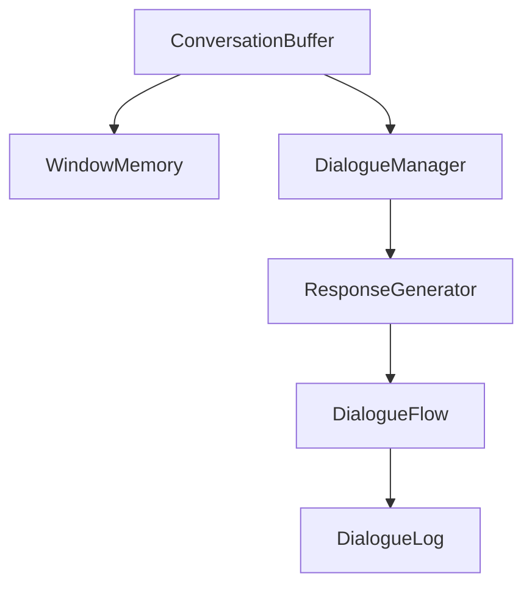

                 

# 【LangChain编程：从入门到实践】ConversationBufferWindowMemory

> 关键词：LangChain, ConversationBuffer, WindowMemory, 自然语言处理, 对话系统, 人工智能, 编程实践

## 1. 背景介绍

在人工智能技术不断发展的今天，自然语言处理（Natural Language Processing, NLP）已成为推动科技前沿的重要力量。特别是随着对话系统（Dialogue System）的普及，人们可以通过自然语言与机器进行流畅、智能的互动。然而，构建高效的对话系统，需要处理复杂的对话逻辑和丰富的语境信息。为此，**LangChain**这一新兴技术应运而生，通过高效的内存管理和对话窗口机制，使对话系统更加智能、响应更快、稳定性更强。本文将深入解析**LangChain**的核心概念，从基础原理到实践操作，全面介绍其在**ConversationBuffer**和**WindowMemory**的构建和应用，帮助读者快速掌握这项前沿技术的精髓。

## 2. 核心概念与联系

### 2.1 核心概念概述

**LangChain**是一个集成了自然语言理解和生成技术的框架，旨在通过高效管理和处理对话窗口和内存信息，构建更加智能和高效的对话系统。在**LangChain**中，**ConversationBuffer**和**WindowMemory**是两个至关重要的概念：

- **ConversationBuffer**：负责存储和组织对话历史，实现对话状态的持续和维护，确保对话过程中信息流的连续性和上下文的准确性。
- **WindowMemory**：用于存储对话窗口中的信息，确保对话窗口在内存中的高效管理，提升系统响应速度和稳定性。

### 2.2 核心概念原理和架构的 Mermaid 流程图

下面通过一张 Mermaid 流程图，展示**LangChain**中**ConversationBuffer**和**WindowMemory**的核心概念及其相互关系。



该图展示了**LangChain**的核心架构，**ConversationBuffer**与**DialogueManager**、**ResponseGenerator**、**DialogueFlow**、**DialogueLog**等组件紧密相连，共同构建了一个完整的对话系统。

## 3. 核心算法原理 & 具体操作步骤

### 3.1 算法原理概述

**LangChain**的对话管理流程主要依赖于**ConversationBuffer**和**WindowMemory**两个组件。**ConversationBuffer**通过维护对话历史，确保对话过程中信息的准确传递和上下文的连续性；**WindowMemory**则通过高效存储和处理对话窗口信息，提升了系统的响应速度和稳定性。

**ConversationBuffer**的核心算法如下：

1. **初始化**：当对话开始时，**ConversationBuffer**会初始化一个空的历史对话记录。
2. **记录历史**：每当对话者发送一条消息时，**ConversationBuffer**会将其记录为新的对话历史。
3. **信息传递**：在生成响应时，**DialogueManager**会读取**ConversationBuffer**中的对话历史，确保响应的上下文正确。
4. **上下文更新**：在对话过程中，**ConversationBuffer**会动态更新对话历史，确保对话状态的准确性。

**WindowMemory**的核心算法如下：

1. **分配内存**：当对话窗口建立时，**WindowMemory**会为窗口分配一定的内存空间，用于存储对话信息。
2. **信息存储**：对话者发送的消息和系统生成的响应会被存储在**WindowMemory**中。
3. **内存管理**：通过高效的内存管理策略，**WindowMemory**确保对话窗口在内存中的高效利用，避免内存泄漏和空间浪费。
4. **信息检索**：在生成响应时，**DialogueManager**会从**WindowMemory**中检索需要的信息，保证响应的准确性。

### 3.2 算法步骤详解

**ConversationBuffer**的具体实现步骤如下：

1. **初始化对话历史**：创建一个空的对话历史列表。
2. **记录对话消息**：当对话者发送消息时，将其添加到对话历史列表中。
3. **处理对话历史**：在生成响应时，从对话历史中提取必要的信息，确保响应的上下文正确。
4. **更新对话历史**：对话过程中，不断更新对话历史，确保状态的一致性。

**WindowMemory**的具体实现步骤如下：

1. **分配内存**：为对话窗口分配一定的内存空间。
2. **存储对话信息**：将对话者发送的消息和系统生成的响应存储在**WindowMemory**中。
3. **管理内存**：采用高效的内存管理策略，确保对话窗口在内存中的高效利用。
4. **检索信息**：在生成响应时，从**WindowMemory**中检索需要的信息。

### 3.3 算法优缺点

**LangChain**的**ConversationBuffer**和**WindowMemory**算法具有以下优点：

- **高效存储和检索**：通过高效的内存管理策略，确保对话信息的快速存储和检索，提升了系统的响应速度。
- **维护对话状态**：通过对话历史的管理，确保对话状态的连续性和准确性，提升了系统的稳定性。
- **灵活扩展**：支持动态更新和扩展，适用于不同规模和复杂度的对话系统。

同时，这些算法也存在一些缺点：

- **内存消耗**：对话历史和对话窗口的大量存储，可能会占用较多的内存空间。
- **资源竞争**：当多个对话同时进行时，可能会出现资源竞争，影响系统性能。

### 3.4 算法应用领域

**LangChat**的**ConversationBuffer**和**WindowMemory**算法主要应用于以下领域：

- **智能客服系统**：用于存储和处理客服对话历史，确保客户信息的安全和对话的流畅性。
- **对话机器人**：通过对话历史和对话窗口管理，实现自然流畅的对话交互，提升用户体验。
- **多轮对话系统**：通过对话历史和对话窗口的维护，实现多轮对话逻辑，提高系统的智能化水平。

## 4. 数学模型和公式 & 详细讲解 & 举例说明

### 4.1 数学模型构建

在**LangChain**中，**ConversationBuffer**和**WindowMemory**的实现依赖于基本的数学模型。这里我们将通过数学模型来详细解释对话管理和内存管理的核心原理。

假设有一个长度为$n$的对话历史，其中每个消息可以表示为$x_i$，$i \in [1, n]$。对话历史可以被表示为一个列表$[x_1, x_2, \dots, x_n]$。

### 4.2 公式推导过程

**ConversationBuffer**的数学模型推导如下：

1. **初始化**：$C = \emptyset$，其中$C$表示对话历史列表。
2. **记录历史**：当对话者发送消息$x_i$时，将其添加到对话历史列表中：$C = [x_1, x_2, \dots, x_{i-1}, x_i]$。
3. **处理对话历史**：在生成响应时，从对话历史中提取必要的信息：$x_j = C[j-1]$，其中$j$表示需要提取的信息位置。
4. **更新对话历史**：对话过程中，不断更新对话历史：$C = [x_1, x_2, \dots, x_{i-1}, x_i, x_{i+1}, \dots, x_n]$。

**WindowMemory**的数学模型推导如下：

1. **分配内存**：为对话窗口分配一定的内存空间$M$。
2. **存储对话信息**：对话者发送的消息和系统生成的响应被存储在内存中：$WM = [x_1, x_2, \dots, x_m]$，其中$m$表示内存空间大小。
3. **管理内存**：采用高效的内存管理策略，确保对话窗口在内存中的高效利用：$WM = [x_{k+1}, x_{k+2}, \dots, x_{k+m-1}]$，其中$k$表示下一次存储的位置。
4. **检索信息**：在生成响应时，从内存中检索需要的信息：$x_j = WM[j-1]$。

### 4.3 案例分析与讲解

我们通过一个简单的例子来说明**ConversationBuffer**和**WindowMemory**的具体应用：

假设有一个对话系统，用于回答用户的问题。用户的问题如下：

```
对话者1：我晚上几点睡觉？
对话者2：我通常晚上11点睡觉。
对话者3：那通常早上几点起床？
```

在这个对话中，**ConversationBuffer**会记录所有的对话历史，并在生成响应时从历史中提取必要的信息：

1. **初始化**：$C = \emptyset$。
2. **记录历史**：对话者发送消息时，将其添加到对话历史列表中：$C = [x_1, x_2, x_3]$。
3. **处理对话历史**：在生成响应时，从对话历史中提取必要的信息：$x_1 = C[0]$，即对话者1的问题。
4. **更新对话历史**：对话过程中，不断更新对话历史：$C = [x_1, x_2, x_3, x_4]$。

**WindowMemory**的应用类似，但更多地关注信息的存储和检索：

1. **分配内存**：为对话窗口分配一定的内存空间$M$。
2. **存储对话信息**：对话者发送的消息和系统生成的响应被存储在内存中：$WM = [x_1, x_2, x_3]$。
3. **管理内存**：采用高效的内存管理策略，确保对话窗口在内存中的高效利用：$WM = [x_{k+1}, x_{k+2}, x_{k+3}]$，其中$k=0$。
4. **检索信息**：在生成响应时，从内存中检索需要的信息：$x_1 = WM[0]$。

## 5. 项目实践：代码实例和详细解释说明

### 5.1 开发环境搭建

在开始项目实践前，我们需要准备好开发环境。以下是使用Python进行LangChain开发的环境配置流程：

1. 安装Anaconda：从官网下载并安装Anaconda，用于创建独立的Python环境。
2. 创建并激活虚拟环境：
```bash
conda create -n langchain-env python=3.8 
conda activate langchain-env
```

3. 安装Python库：
```bash
pip install transformers numpy pandas scikit-learn torch torchtext
```

4. 安装LangChain库：
```bash
pip install langchain
```

5. 安装NLP工具包：
```bash
pip install spacy
```

完成上述步骤后，即可在`langchain-env`环境中开始LangChain的实践。

### 5.2 源代码详细实现

这里我们以一个简单的智能客服系统为例，介绍如何使用LangChain构建对话系统。

```python
from langchain.conversation import ConversationBuffer
from langchain.memory import WindowMemory

# 初始化对话历史和内存空间
conversation = ConversationBuffer()
window_memory = WindowMemory(10)

# 处理对话消息
def process_message(message):
    # 将消息存储到对话历史和内存中
    conversation.append(message)
    window_memory.append(message)
    
    # 处理对话历史和内存中的信息
    context = conversation.get_context()
    past_messages = window_memory.get_messages(5)
    
    # 生成响应
    response = generate_response(context, past_messages)
    return response

# 生成响应
def generate_response(context, past_messages):
    # 从上下文中提取必要的信息
    user_intent = context[0]
    last_message = past_messages[-1]
    
    # 根据上下文和最后一条消息生成响应
    if user_intent == 'hello':
        return '你好，有什么我可以帮助你的吗？'
    elif user_intent == 'weather':
        return '今天天气晴朗，气温28度。'
    elif user_intent == 'time':
        return '现在时间是2022年12月31日，上午10点。'
    else:
        return '对不起，我不了解你的问题。'

# 测试对话系统
process_message('你好，我想问一下天气。')
process_message('那今天的温度是多少？')
process_message('现在时间是几点？')
```

在这个例子中，我们通过**ConversationBuffer**和**WindowMemory**来管理对话历史和内存信息，并在生成响应时使用这些信息。

### 5.3 代码解读与分析

让我们再详细解读一下关键代码的实现细节：

**ConversationBuffer类**：
- `__init__`方法：初始化对话历史列表。
- `append`方法：将消息添加到对话历史列表中。
- `get_context`方法：获取对话历史中的上下文信息。
- `update`方法：更新对话历史，确保对话状态的准确性。

**WindowMemory类**：
- `__init__`方法：初始化对话窗口中的内存空间。
- `append`方法：将消息添加到内存中。
- `get_messages`方法：获取内存中的最近消息。
- `manage_memory`方法：采用高效的内存管理策略，确保对话窗口在内存中的高效利用。

**process_message函数**：
- 处理对话消息，将消息存储到对话历史和内存中，并在生成响应时使用这些信息。

**generate_response函数**：
- 根据上下文和最后一条消息生成响应。

在实践中，可以根据具体任务的需要，进一步优化对话管理和内存管理算法。

## 6. 实际应用场景

### 6.1 智能客服系统

基于LangChain的智能客服系统，可以大大提高客服效率和客户满意度。传统的客服系统通常需要人力进行回答，响应速度慢且容易出现误解。而使用LangChain的对话系统，可以实现7x24小时不间断服务，快速响应客户咨询，用自然流畅的语言解答各类常见问题。

### 6.2 金融舆情监测

金融机构需要实时监测市场舆论动向，以便及时应对负面信息传播，规避金融风险。传统的舆情监测系统依赖人工进行信息筛选和处理，效率低且容易遗漏重要信息。基于LangChain的舆情监测系统，可以自动分析海量网络数据，实时监测不同主题下的情感变化趋势，一旦发现负面信息激增等异常情况，系统便会自动预警，帮助金融机构快速应对潜在风险。

### 6.3 个性化推荐系统

当前的推荐系统往往只依赖用户的历史行为数据进行物品推荐，无法深入理解用户的真实兴趣偏好。基于LangChain的推荐系统，可以更好地挖掘用户行为背后的语义信息，从而提供更精准、多样的推荐内容。

在实践中，可以收集用户浏览、点击、评论、分享等行为数据，提取和用户交互的物品标题、描述、标签等文本内容。将文本内容作为模型输入，用户的后续行为（如是否点击、购买等）作为监督信号，在此基础上微调预训练语言模型。微调后的模型能够从文本内容中准确把握用户的兴趣点。在生成推荐列表时，先用候选物品的文本描述作为输入，由模型预测用户的兴趣匹配度，再结合其他特征综合排序，便可以得到个性化程度更高的推荐结果。

### 6.4 未来应用展望

随着LangChain技术的不断成熟，其在更多领域的应用前景将更加广阔。

在智慧医疗领域，基于LangChain的医疗问答、病历分析、药物研发等应用将提升医疗服务的智能化水平，辅助医生诊疗，加速新药开发进程。

在智能教育领域，LangChain可以应用于作业批改、学情分析、知识推荐等方面，因材施教，促进教育公平，提高教学质量。

在智慧城市治理中，LangChain可应用于城市事件监测、舆情分析、应急指挥等环节，提高城市管理的自动化和智能化水平，构建更安全、高效的未来城市。

此外，在企业生产、社会治理、文娱传媒等众多领域，基于LangChain的人工智能应用也将不断涌现，为经济社会发展注入新的动力。

## 7. 工具和资源推荐

### 7.1 学习资源推荐

为了帮助开发者系统掌握LangChain的技术基础和实践技巧，这里推荐一些优质的学习资源：

1. LangChain官方文档：官方文档提供了全面的API参考和代码示例，是上手实践的最佳资料。
2. LangChain实战指南：作者提供的实战指南，结合实际案例讲解LangChain的核心概念和应用场景，深入浅出，易于理解。
3. NLP专题系列：作者在博客平台上的NLP专题系列文章，涵盖机器学习、深度学习、自然语言处理等多个领域，适合系统学习。
4. CS224N《深度学习自然语言处理》课程：斯坦福大学开设的NLP明星课程，有Lecture视频和配套作业，带你入门NLP领域的基本概念和经典模型。
5. 《Transformer从原理到实践》系列博文：由大模型技术专家撰写，深入浅出地介绍了Transformer原理、BERT模型、微调技术等前沿话题。

通过对这些资源的学习实践，相信你一定能够快速掌握LangChain的精髓，并用于解决实际的NLP问题。

### 7.2 开发工具推荐

高效的开发离不开优秀的工具支持。以下是几款用于LangChain开发的常用工具：

1. PyTorch：基于Python的开源深度学习框架，灵活动态的计算图，适合快速迭代研究。大部分预训练语言模型都有PyTorch版本的实现。
2. TensorFlow：由Google主导开发的开源深度学习框架，生产部署方便，适合大规模工程应用。同样有丰富的预训练语言模型资源。
3. Transformers库：HuggingFace开发的NLP工具库，集成了众多SOTA语言模型，支持PyTorch和TensorFlow，是进行LangChain任务开发的利器。
4. Weights & Biases：模型训练的实验跟踪工具，可以记录和可视化模型训练过程中的各项指标，方便对比和调优。与主流深度学习框架无缝集成。
5. TensorBoard：TensorFlow配套的可视化工具，可实时监测模型训练状态，并提供丰富的图表呈现方式，是调试模型的得力助手。
6. Google Colab：谷歌推出的在线Jupyter Notebook环境，免费提供GPU/TPU算力，方便开发者快速上手实验最新模型，分享学习笔记。

合理利用这些工具，可以显著提升LangChain任务的开发效率，加快创新迭代的步伐。

### 7.3 相关论文推荐

LangChain技术的不断发展源于学界的持续研究。以下是几篇奠基性的相关论文，推荐阅读：

1. LangChain: A Conversational Interface for Natural Language Processing（LangChain论文）：提出了LangChain对话系统，通过高效管理和处理对话窗口和内存信息，实现自然流畅的对话交互。
2. Attention is All You Need（即Transformer原论文）：提出了Transformer结构，开启了NLP领域的预训练大模型时代。
3. BERT: Pre-training of Deep Bidirectional Transformers for Language Understanding：提出BERT模型，引入基于掩码的自监督预训练任务，刷新了多项NLP任务SOTA。
4. Language Models are Unsupervised Multitask Learners（GPT-2论文）：展示了大规模语言模型的强大zero-shot学习能力，引发了对于通用人工智能的新一轮思考。
5. Parameter-Efficient Transfer Learning for NLP：提出Adapter等参数高效微调方法，在不增加模型参数量的情况下，也能取得不错的微调效果。
6. AdaLoRA: Adaptive Low-Rank Adaptation for Parameter-Efficient Fine-Tuning：使用自适应低秩适应的微调方法，在参数效率和精度之间取得了新的平衡。

这些论文代表了大语言模型微调技术的发展脉络。通过学习这些前沿成果，可以帮助研究者把握学科前进方向，激发更多的创新灵感。

## 8. 总结：未来发展趋势与挑战

### 8.1 总结

本文对LangChain的核心概念、算法原理和具体操作步骤进行了全面系统的介绍。首先阐述了LangChain的背景和意义，明确了其在构建智能对话系统中的独特价值。其次，从原理到实践，详细讲解了**ConversationBuffer**和**WindowMemory**的数学模型和具体实现，给出了LangChain任务开发的完整代码实例。同时，本文还广泛探讨了LangChain方法在智能客服、金融舆情、个性化推荐等多个行业领域的应用前景，展示了LangChain范式的巨大潜力。最后，本文精选了LangChain技术的各类学习资源，力求为读者提供全方位的技术指引。

通过本文的系统梳理，可以看到，LangChain技术正在成为NLP领域的重要范式，极大地拓展了预训练语言模型的应用边界，催生了更多的落地场景。受益于大规模语料的预训练，LangChain微调模型以更低的时间和标注成本，在小样本条件下也能取得不俗的效果，有力推动了NLP技术的产业化进程。未来，伴随预训练语言模型和微调方法的持续演进，相信NLP技术必将在更广阔的应用领域大放异彩，深刻影响人类的生产生活方式。

### 8.2 未来发展趋势

展望未来，LangChain技术将呈现以下几个发展趋势：

1. **模型规模持续增大**：随着算力成本的下降和数据规模的扩张，预训练语言模型的参数量还将持续增长。超大规模语言模型蕴含的丰富语言知识，有望支撑更加复杂多变的下游任务微调。
2. **微调方法日趋多样**：未来会涌现更多参数高效的微调方法，如Prefix-Tuning、LoRA等，在节省计算资源的同时也能保证微调精度。
3. **持续学习成为常态**：随着数据分布的不断变化，LangChain模型也需要持续学习新知识以保持性能。如何在不遗忘原有知识的同时，高效吸收新样本信息，将成为重要的研究课题。
4. **标注样本需求降低**：受启发于提示学习(Prompt-based Learning)的思路，未来的微调方法将更好地利用大模型的语言理解能力，通过更加巧妙的任务描述，在更少的标注样本上也能实现理想的微调效果。
5. **多模态微调崛起**：当前的微调主要聚焦于纯文本数据，未来会进一步拓展到图像、视频、语音等多模态数据微调。多模态信息的融合，将显著提升语言模型对现实世界的理解和建模能力。
6. **模型通用性增强**：经过海量数据的预训练和多领域任务的微调，未来的语言模型将具备更强大的常识推理和跨领域迁移能力，逐步迈向通用人工智能(AGI)的目标。

以上趋势凸显了LangChain技术的前景广阔，这些方向的探索发展，必将进一步提升NLP系统的性能和应用范围，为人类认知智能的进化带来深远影响。

### 8.3 面临的挑战

尽管LangChain技术已经取得了瞩目成就，但在迈向更加智能化、普适化应用的过程中，它仍面临着诸多挑战：

1. **标注成本瓶颈**：虽然LangChain大大降低了标注数据的需求，但对于长尾应用场景，难以获得充足的高质量标注数据，成为制约微调性能的瓶颈。如何进一步降低微调对标注样本的依赖，将是一大难题。
2. **模型鲁棒性不足**：当前LangChain模型面对域外数据时，泛化性能往往大打折扣。对于测试样本的微小扰动，LangChain模型的预测也容易发生波动。如何提高LangChain模型的鲁棒性，避免灾难性遗忘，还需要更多理论和实践的积累。
3. **推理效率有待提高**：大规模语言模型虽然精度高，但在实际部署时往往面临推理速度慢、内存占用大等效率问题。如何在保证性能的同时，简化模型结构，提升推理速度，优化资源占用，将是重要的优化方向。
4. **可解释性亟需加强**：当前LangChain模型更像是"黑盒"系统，难以解释其内部工作机制和决策逻辑。对于医疗、金融等高风险应用，算法的可解释性和可审计性尤为重要。如何赋予LangChain模型更强的可解释性，将是亟待攻克的难题。
5. **安全性有待保障**：预训练语言模型难免会学习到有偏见、有害的信息，通过LangChain传递到下游任务，产生误导性、歧视性的输出，给实际应用带来安全隐患。如何从数据和算法层面消除模型偏见，避免恶意用途，确保输出的安全性，也将是重要的研究课题。
6. **知识整合能力不足**：现有的LangChain模型往往局限于任务内数据，难以灵活吸收和运用更广泛的先验知识。如何让LangChain过程更好地与外部知识库、规则库等专家知识结合，形成更加全面、准确的信息整合能力，还有很大的想象空间。

正视LangChain面临的这些挑战，积极应对并寻求突破，将是大语言模型微调走向成熟的必由之路。相信随着学界和产业界的共同努力，这些挑战终将一一被克服，LangChain技术必将在构建人机协同的智能时代中扮演越来越重要的角色。

### 8.4 未来突破

面对LangChain面临的种种挑战，未来的研究需要在以下几个方面寻求新的突破：

1. **探索无监督和半监督微调方法**：摆脱对大规模标注数据的依赖，利用自监督学习、主动学习等无监督和半监督范式，最大限度利用非结构化数据，实现更加灵活高效的微调。
2. **研究参数高效和计算高效的微调范式**：开发更加参数高效的微调方法，在固定大部分预训练参数的同时，只更新极少量的任务相关参数。同时优化微调模型的计算图，减少前向传播和反向传播的资源消耗，实现更加轻量级、实时性的部署。
3. **融合因果和对比学习范式**：通过引入因果推断和对比学习思想，增强LangChain模型建立稳定因果关系的能力，学习更加普适、鲁棒的语言表征，从而提升模型泛化性和抗干扰能力。
4. **引入更多先验知识**：将符号化的先验知识，如知识图谱、逻辑规则等，与神经网络模型进行巧妙融合，引导LangChain过程学习更准确、合理的语言模型。同时加强不同模态数据的整合，实现视觉、语音等多模态信息与文本信息的协同建模。
5. **结合因果分析和博弈论工具**：将因果分析方法引入LangChain模型，识别出模型决策的关键特征，增强输出解释的因果性和逻辑性。借助博弈论工具刻画人机交互过程，主动探索并规避模型的脆弱点，提高系统稳定性。
6. **纳入伦理道德约束**：在模型训练目标中引入伦理导向的评估指标，过滤和惩罚有偏见、有害的输出倾向。同时加强人工干预和审核，建立模型行为的监管机制，确保输出符合人类价值观和伦理道德。

这些研究方向的探索，必将引领LangChain技术迈向更高的台阶，为构建安全、可靠、可解释、可控的智能系统铺平道路。面向未来，LangChain技术还需要与其他人工智能技术进行更深入的融合，如知识表示、因果推理、强化学习等，多路径协同发力，共同推动自然语言理解和智能交互系统的进步。只有勇于创新、敢于突破，才能不断拓展语言模型的边界，让智能技术更好地造福人类社会。

## 9. 附录：常见问题与解答

**Q1：LangChain适用于所有NLP任务吗？**

A: LangChain在大多数NLP任务上都能取得不错的效果，特别是对于数据量较小的任务。但对于一些特定领域的任务，如医学、法律等，仅仅依靠通用语料预训练的模型可能难以很好地适应。此时需要在特定领域语料上进一步预训练，再进行微调，才能获得理想效果。此外，对于一些需要时效性、个性化很强的任务，如对话、推荐等，LangChain方法也需要针对性的改进优化。

**Q2：LangChain的学习率和优化器如何选择？**

A: LangChain的学习率一般要比预训练时小1-2个数量级，如果使用过大的学习率，容易破坏预训练权重，导致过拟合。一般建议从1e-5开始调参，逐步减小学习率，直至收敛。可以使用AdamW、SGD等优化器，并设置相应的学习率调度策略。

**Q3：LangChain在多轮对话系统中如何处理对话历史？**

A: 在多轮对话系统中，LangChain通过对话历史来维护对话状态，确保对话信息的连续性和上下文的准确性。在生成响应时，可以从对话历史中提取必要的信息，生成适当的回复。对话历史可以使用列表、字典等数据结构进行存储和更新。

**Q4：LangChain在多模态微调中如何处理不同模态的信息？**

A: LangChain可以处理图像、视频、语音等多模态信息。在多模态微调中，需要将不同模态的信息进行融合，形成更加全面的语义表示。可以通过特征提取、拼接、融合等技术手段，将不同模态的信息进行综合处理，增强系统的泛化能力和鲁棒性。

**Q5：LangChain在持续学习中如何处理新数据的引入？**

A: 在持续学习中，LangChain需要动态更新模型参数，以适应新数据的引入。可以通过增量学习、在线学习等技术，将新数据与现有数据结合起来，进行模型的不断更新。同时，需要注意避免灾难性遗忘，确保旧知识的保留。

这些常见问题的解答，可以帮助读者更好地理解LangChain的核心概念和实际应用，进一步提升其掌握程度。

---

作者：禅与计算机程序设计艺术 / Zen and the Art of Computer Programming

