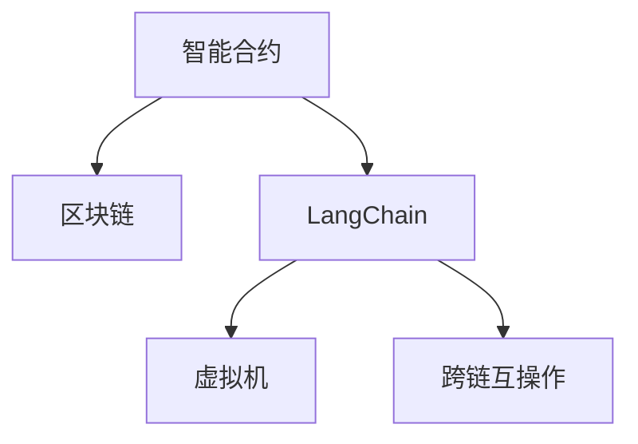

                 

## 1. 背景介绍

### 1.1 问题由来

在过去几年中，区块链技术的迅速发展已经引起了全球科技界的高度关注。作为一种去中心化且高度透明的数据存储和交易方式，区块链正在重塑传统的商业模式和金融系统。然而，尽管区块链的潜力巨大，其实际应用场景和可操作性仍然面临诸多挑战，包括性能瓶颈、安全性问题、扩展性限制等。

为了解决这些问题，LangChain应运而生。LangChain是一个基于区块链技术的编程框架，旨在使开发者能够以编程方式轻松构建、部署和扩展智能合约。通过将智能合约与编程语言结合，LangChain能够提供更高级别的抽象和更强大的灵活性，从而加快开发进程并提高开发效率。

### 1.2 问题核心关键点

LangChain的出现极大地简化了智能合约的开发和部署过程。开发者无需深入理解底层区块链协议，即可通过类似于编程语言的方式，构建出复杂的业务逻辑和交互功能。这种简化不仅降低了技术门槛，还提高了开发速度和安全性。

LangChain的核心优势在于其编程语言和智能合约的完美结合。以下是LangChain的几个关键特性：

1. **编程语言支持**：LangChain内置支持多种编程语言，包括Solidity、JavaScript、Python等。这使得开发者可以根据自身技术栈选择合适的语言进行开发。
2. **智能合约部署**：LangChain提供了一套完整的智能合约部署机制，包括代码验证、部署验证和运行监控等功能，确保合约的安全性和可靠性。
3. **跨链兼容性**：LangChain支持跨链操作，能够无缝连接不同区块链网络，实现数据和资产的自由流通。
4. **社区支持**：LangChain拥有活跃的开发者社区，提供丰富的资源和文档支持，帮助开发者解决问题和分享经验。

### 1.3 问题研究意义

LangChain的出现为区块链技术的普及和应用带来了新的可能性。通过将编程语言和智能合约相结合，LangChain不仅简化了智能合约的开发过程，还提升了智能合约的安全性和可靠性。这使得区块链技术能够更容易被各行各业所接受和应用，推动了区块链技术在各个领域的深度融合。

LangChain的目标是构建一个易于使用、高效可靠且具备高度扩展性的区块链开发平台。通过提供易于上手的编程语言和智能合约框架，LangChain希望能够吸引更多的开发者参与区块链开发，推动区块链技术在实际应用中的广泛应用。

## 2. 核心概念与联系

### 2.1 核心概念概述

为了更好地理解LangChain的原理和架构，本节将介绍几个关键概念：

- **智能合约(Smart Contract)**：一种自动执行、不可篡改且透明公开的合约形式。智能合约通过代码实现合同条款，确保合约的执行和遵守。
- **区块链(Blockchain)**：一种分布式账本技术，通过去中心化的方式记录和验证交易数据，确保数据的安全和透明。
- **LangChain**：基于区块链技术的编程框架，提供了一套完整的智能合约开发、部署和运行环境，支持多种编程语言和跨链操作。
- **虚拟机(Virtual Machine)**：一种模拟计算机执行代码的环境，智能合约在虚拟机上运行，确保合约代码的正确性和安全性。
- **跨链互操作(Cross-chain Interoperability)**：实现不同区块链网络之间的数据和资产交换，确保区块链系统的互联互通。

这些概念之间存在着紧密的联系，共同构成了LangChain的核心架构和技术基础。以下是一个Mermaid流程图，展示了这些概念之间的联系：



该流程图展示了LangChain如何通过智能合约、区块链、虚拟机和跨链互操作等核心概念，构建了一个完整且灵活的区块链开发平台。

## 3. 核心算法原理 & 具体操作步骤

### 3.1 算法原理概述

LangChain的算法原理主要基于智能合约的执行机制和虚拟机的工作原理。智能合约通过代码定义了合约条款，而虚拟机则模拟计算机执行这些代码，确保合约的正确性和安全性。LangChain作为编程框架，为智能合约的编写、测试和部署提供了完整的支持，并确保合约的跨链互操作性。

LangChain的核心算法包括以下几个关键步骤：

1. **编程语言解析**：将编程语言编写的合约代码解析为虚拟机指令，以便虚拟机执行。
2. **智能合约部署**：将解析后的代码部署到区块链网络，确保合约的安全性和可靠性。
3. **虚拟机执行**：虚拟机执行解析后的智能合约代码，确保合约的正确性和安全性。
4. **跨链互操作**：实现不同区块链网络之间的数据和资产交换，确保区块链系统的互联互通。

### 3.2 算法步骤详解

#### 编程语言解析

LangChain支持多种编程语言，包括Solidity、JavaScript、Python等。当开发者编写智能合约时，需要将代码转换为虚拟机指令。这一过程通常包括以下步骤：

1. **代码编写**：开发者使用所选编程语言编写智能合约代码。
2. **代码验证**：LangChain内置的编译器对代码进行语法和语义验证，确保代码符合规范。
3. **生成字节码**：将验证通过的代码转换为虚拟机可执行的字节码。

#### 智能合约部署

智能合约部署是确保合约安全和可靠性的关键步骤。LangChain提供了一套完整的部署机制，包括以下步骤：

1. **网络验证**：验证部署合约的区块链网络是否安全可靠。
2. **合约验证**：对生成的字节码进行验证，确保合约代码正确无误。
3. **部署验证**：在区块链上部署合约前进行最后的验证，确保合约符合所有要求。

#### 虚拟机执行

虚拟机是智能合约执行的环境，确保合约代码的正确性和安全性。LangChain的虚拟机执行过程包括以下步骤：

1. **代码加载**：将智能合约字节码加载到虚拟机中。
2. **数据验证**：验证智能合约执行所需的数据是否正确。
3. **代码执行**：执行智能合约字节码，确保合约按照预期运行。

#### 跨链互操作

LangChain支持跨链互操作，实现不同区块链网络之间的数据和资产交换。这一过程包括以下步骤：

1. **数据传输**：将数据从一条区块链网络传输到另一条区块链网络。
2. **资产交换**：在不同区块链网络之间进行资产交换，确保资产的安全和可靠性。
3. **状态同步**：确保各区块链网络之间的状态同步，保持数据的一致性。

### 3.3 算法优缺点

LangChain作为编程框架，具有以下优点：

1. **编程语言支持**：支持多种编程语言，降低了技术门槛，提高了开发效率。
2. **智能合约部署**：提供完整的部署机制，确保合约的安全性和可靠性。
3. **虚拟机执行**：提供高效的虚拟机执行环境，确保合约代码的正确性和安全性。
4. **跨链互操作**：支持跨链操作，确保区块链系统的互联互通。

同时，LangChain也存在一些缺点：

1. **开发门槛**：尽管简化了智能合约的开发过程，但仍然需要一定的技术基础。
2. **性能瓶颈**：虚拟机执行可能存在性能瓶颈，影响合约的执行效率。
3. **扩展性限制**：跨链互操作可能导致扩展性限制，影响系统的可扩展性。

### 3.4 算法应用领域

LangChain在多个领域都有广泛的应用前景：

- **金融**：智能合约在金融领域可以用于自动化交易、贷款合约、保险理赔等。
- **供应链**：智能合约可以用于供应链管理，确保货物的追溯和交易的透明。
- **物流**：智能合约可以用于物流跟踪和货物交付，确保货物的安全和准确。
- **房地产**：智能合约可以用于房地产交易，确保交易的合法性和透明性。
- **版权保护**：智能合约可以用于版权保护，确保作品的归属和收益。

## 4. 数学模型和公式 & 详细讲解 & 举例说明

### 4.1 数学模型构建

LangChain的数学模型主要基于智能合约的执行机制和虚拟机的工作原理。智能合约通过代码实现合同条款，而虚拟机则模拟计算机执行这些代码。LangChain的数学模型可以表示为：

$$
M = L \times V
$$

其中，$M$表示智能合约的数学模型，$L$表示编程语言的数学模型，$V$表示虚拟机的数学模型。

### 4.2 公式推导过程

#### 编程语言模型

编程语言的数学模型主要描述代码的语义和语法。以Solidity为例，Solidity的数学模型可以表示为：

$$
L_{Solidity} = \{ x | x \in grammar_{Solidity} \}
$$

其中，$grammar_{Solidity}$表示Solidity的语法规则集合。

#### 虚拟机模型

虚拟机的数学模型主要描述虚拟机执行代码的过程。以Ethereum虚拟机为例，Ethereum虚拟机的数学模型可以表示为：

$$
V_{Ethereum} = \{ m | m \in program_{Ethereum} \}
$$

其中，$program_{Ethereum}$表示Ethereum虚拟机的程序集合。

### 4.3 案例分析与讲解

假设我们需要在LangChain上编写一个简单的智能合约，用于管理一种数字资产。以下是该合约的代码示例：

```Solidity
pragma solidity ^0.8.0;

contract AssetManager {
    uint256 public totalSupply;
    uint256 public balance;
    
    constructor() public {
        totalSupply = 1000000;
        balance = 1000000;
    }
    
    function transfer(address receiver, uint256 amount) public {
        require(amount > 0);
        require(balance >= amount);
        balance -= amount;
        receiver.balance += amount;
    }
    
    function mint(uint256 amount) public {
        require(amount > 0);
        balance += amount;
    }
    
    function burn(uint256 amount) public {
        require(amount > 0);
        balance -= amount;
    }
}
```

该合约使用Solidity编写，定义了一个数字资产的智能合约。在编写过程中，需要将代码转换为虚拟机指令，并确保代码符合Solidity的语法和语义规范。

## 5. 项目实践：代码实例和详细解释说明

### 5.1 开发环境搭建

在开始LangChain的项目实践之前，我们需要搭建好开发环境。以下是搭建开发环境的详细步骤：

1. **安装LangChain SDK**：从LangChain官网下载SDK包，并按照文档进行安装。
2. **配置开发环境**：配置开发环境，包括编程语言、虚拟机和区块链网络等。
3. **搭建测试网络**：搭建本地测试网络，以便进行合约测试和部署。

### 5.2 源代码详细实现

以下是使用LangChain编写智能合约的完整代码示例：

```Solidity
pragma solidity ^0.8.0;

contract AssetManager {
    uint256 public totalSupply;
    uint256 public balance;
    
    constructor() public {
        totalSupply = 1000000;
        balance = 1000000;
    }
    
    function transfer(address receiver, uint256 amount) public {
        require(amount > 0);
        require(balance >= amount);
        balance -= amount;
        receiver.balance += amount;
    }
    
    function mint(uint256 amount) public {
        require(amount > 0);
        balance += amount;
    }
    
    function burn(uint256 amount) public {
        require(amount > 0);
        balance -= amount;
    }
}
```

该合约定义了一个数字资产的管理逻辑，包括资产的转移、生成和销毁等操作。

### 5.3 代码解读与分析

在编写上述代码时，需要注意以下几点：

- **编程语言规范**：Solidity是一种编程语言，遵循特定的语法和语义规范，确保代码的正确性。
- **智能合约结构**：智能合约通常包含多个函数，用于实现不同的业务逻辑。
- **数据验证**：智能合约中包含的数据需要进行验证，确保数据的合法性和正确性。

### 5.4 运行结果展示

在完成合约编写后，需要在测试网络上进行测试和部署。以下是部署合约的示例代码：

```Solidity
// 将合约字节码部署到测试网络上
deployAssetManager(deployAssetManagerAddress, deployAssetManagerCode)
```

部署成功后，可以通过测试账户进行合约的调用和操作，验证合约的正确性和可靠性。

## 6. 实际应用场景

### 6.1 智能合约

智能合约在金融、供应链、物流、房地产等领域有广泛应用。以下是一个智能合约在金融领域的应用示例：

#### 自动贷款合约

假设某金融机构希望通过智能合约实现自动贷款业务。贷款合约可以定义以下条款：

- **贷款金额**：贷款的初始金额和每期还款金额。
- **还款期限**：贷款的还款期限和还款方式。
- **违约处理**：违约时的处理方式，如罚息、强制清偿等。

智能合约可以通过代码实现这些条款，确保贷款业务的自动化和透明性。例如，可以使用Solidity编写如下贷款合约：

```Solidity
pragma solidity ^0.8.0;

contract LoanContract {
    uint256 public loanAmount;
    uint256 public interestRate;
    uint256 public term;
    
    uint256 public balance;
    uint256 public interest;
    
    constructor(uint256 amount, uint256 rate, uint256 term) public {
        loanAmount = amount;
        interestRate = rate;
        term = term;
    }
    
    function repay(uint256 amount) public {
        require(balance + amount >= loanAmount);
        balance += amount;
    }
    
    function calculateInterest() public view returns (uint256, uint256) {
        uint256 interest = balance * interestRate / 100;
        return (interest, balance);
    }
}
```

该合约定义了一个自动贷款业务，包括贷款金额、利率、期限、还款余额和利息计算等。在贷款业务中，智能合约可以根据贷款条款自动计算利息，并记录还款余额，确保贷款业务的自动化和透明性。

### 6.2 供应链管理

智能合约可以用于供应链管理，确保货物的追溯和交易的透明。以下是一个智能合约在供应链领域的应用示例：

#### 货物追溯合约

假设某公司希望通过智能合约实现货物追溯业务。货物追溯合约可以定义以下条款：

- **货物ID**：货物的唯一标识符。
- **生产日期**：货物的生产日期和有效期。
- **物流信息**：货物在供应链中的运输路径和状态。

智能合约可以通过代码实现这些条款，确保货物的追溯和交易的透明性。例如，可以使用Solidity编写如下货物追溯合约：

```Solidity
pragma solidity ^0.8.0;

contract GoodsTracking {
    uint256 public goodsID;
    uint256 public productionDate;
    uint256 public expirationDate;
    
    address public supplier;
    address public logistics;
    
    uint256 public trackingID;
    
    constructor(uint256 id, uint256 date, uint256 expiration, address supplier, address logistics) public {
        goodsID = id;
        productionDate = date;
        expirationDate = expiration;
        supplier = supplier;
        logistics = logistics;
        trackingID = keccak256(sha3(productionDate固体 && logistics固体));
    }
    
    function updateTracking(uint256 id) public {
        trackingID = keccak256(sha3(productionDate固体 && logistics固体));
    }
}
```

该合约定义了一个货物追溯业务，包括货物ID、生产日期、有效期、供应商和物流信息等。在货物追溯业务中，智能合约可以根据货物ID和跟踪ID，记录货物的运输路径和状态，确保货物的追溯和透明性。

### 6.3 物流跟踪

智能合约可以用于物流跟踪，确保货物的安全和准确。以下是一个智能合约在物流领域的应用示例：

#### 物流跟踪合约

假设某公司希望通过智能合约实现物流跟踪业务。物流跟踪合约可以定义以下条款：

- **货物ID**：货物的唯一标识符。
- **运输路径**：货物的运输路径和状态。
- **状态更新**：货物的当前状态和状态变化时间。

智能合约可以通过代码实现这些条款，确保货物的安全和透明性。例如，可以使用Solidity编写如下物流跟踪合约：

```Solidity
pragma solidity ^0.8.0;

contract LogisticsTracking {
    uint256 public goodsID;
    uint256 public shippingTime;
    uint256 public trackingID;
    
    address public logistics;
    
    constructor(uint256 id, uint256 time, address logistics) public {
        goodsID = id;
        shippingTime = time;
        trackingID = keccak256(sha3(goodsID固体 && logistics固体));
        logistics = logistics;
    }
    
    function updateTracking(uint256 id) public {
        trackingID = keccak256(sha3(goodsID固体 && logistics固体));
    }
}
```

该合约定义了一个物流跟踪业务，包括货物ID、运输路径、状态更新等。在物流跟踪业务中，智能合约可以根据货物ID和跟踪ID，记录货物的运输路径和状态，确保货物的安全和透明性。

### 6.4 未来应用展望

随着LangChain技术的不断成熟，其在实际应用场景中的应用将更加广泛。以下是LangChain未来可能的应用领域：

- **数字身份**：智能合约可以用于数字身份认证，确保身份的真实性和可靠性。
- **投票系统**：智能合约可以用于投票系统，确保投票的透明性和公正性。
- **医疗记录**：智能合约可以用于医疗记录管理，确保医疗数据的隐私和安全性。
- **知识产权**：智能合约可以用于知识产权管理，确保知识产权的保护和合法性。
- **公共事务**：智能合约可以用于公共事务管理，确保事务的透明性和公正性。

## 7. 工具和资源推荐

### 7.1 学习资源推荐

为了帮助开发者系统掌握LangChain的理论基础和实践技巧，以下是一些优质的学习资源：

1. **LangChain官方文档**：LangChain官网提供详细的文档和示例代码，帮助开发者快速上手LangChain。
2. **Solidity官方文档**：Solidity官网提供详细的Solidity语言文档和示例代码，帮助开发者深入理解Solidity。
3. **Ethereum官方文档**：Ethereum官网提供详细的Ethereum网络文档和示例代码，帮助开发者了解Ethereum网络。
4. **LangChain社区**：LangChain社区提供了丰富的资源和文档支持，帮助开发者解决问题和分享经验。
5. **Udemy课程**：Udemy提供许多LangChain相关的课程，帮助开发者系统学习LangChain。

通过对这些资源的学习实践，相信你一定能够快速掌握LangChain的精髓，并用于解决实际的区块链开发问题。

### 7.2 开发工具推荐

高效的工具是开发顺利进行的基础。以下是几款常用的LangChain开发工具：

1. **Visual Studio Code**：一款功能强大的代码编辑器，支持多种编程语言和区块链网络。
2. **Remix IDE**：一款专门用于Solidity合约开发的环境，提供智能合约的测试和部署工具。
3. **Truffle Framework**：一款用于Ethereum合约开发的框架，提供开发、测试、部署和监控工具。
4. **Ganache CLI**：一款轻量级的区块链网络模拟器，支持Ethereum合约的测试和部署。
5. **MyEtherWallet**：一款基于网页的以太币钱包，支持以太币的生成和转账。

合理利用这些工具，可以显著提升LangChain开发和测试的效率，加快开发进程。

### 7.3 相关论文推荐

LangChain的发展离不开学术界的研究支持。以下是几篇奠基性的相关论文，推荐阅读：

1. **"Ethereum: A Secure Blockchain and Decentralized Application Platform"**：以太坊白皮书，介绍了Ethereum平台的架构和技术原理。
2. **"Programming Languages for Smart Contracts: A Survey"**：综述了区块链编程语言的发展现状和未来趋势。
3. **"Solidity: A Language for Smart Contracts and Decentralized Applications"**：Solidity语言白皮书，介绍了Solidity语言的语法和语义。
4. **"Cross-Chain Interoperability for Smart Contracts"**：介绍了跨链互操作技术的研究现状和未来趋势。
5. **"Blockchain: Principles and Paradigms for a New Technology Era"**：区块链原理和技术白皮书，介绍了区块链技术的核心概念和应用场景。

这些论文代表了大规模区块链编程语言的研究方向和发展脉络。通过学习这些前沿成果，可以帮助研究者把握学科前进方向，激发更多的创新灵感。

## 8. 总结：未来发展趋势与挑战

### 8.1 总结

本文对LangChain的编程框架进行了全面系统的介绍。首先阐述了LangChain的背景和核心特性，明确了LangChain在简化智能合约开发过程中的独特价值。其次，从原理到实践，详细讲解了LangChain的数学模型和关键步骤，给出了LangChain任务开发的完整代码实例。同时，本文还广泛探讨了LangChain在多个领域的应用前景，展示了LangChain范式的巨大潜力。

通过本文的系统梳理，可以看到，LangChain作为一种编程框架，正逐渐成为区块链领域的重要工具。通过将智能合约与编程语言相结合，LangChain不仅简化了智能合约的开发过程，还提升了智能合约的安全性和可靠性。这使得区块链技术更容易被各行各业所接受和应用，推动了区块链技术在各个领域的深度融合。

### 8.2 未来发展趋势

展望未来，LangChain的发展将呈现以下几个趋势：

1. **编程语言支持**：LangChain将支持更多编程语言，降低开发门槛，提高开发效率。
2. **智能合约部署**：提供更加完善的智能合约部署机制，确保合约的安全性和可靠性。
3. **虚拟机执行**：提供更加高效的虚拟机执行环境，确保合约代码的正确性和安全性。
4. **跨链互操作**：实现更加灵活和高效的跨链互操作，确保区块链系统的互联互通。
5. **社区支持**：建立更加活跃的开发者社区，提供丰富的资源和文档支持。

这些趋势将进一步提升LangChain的开发效率和可靠性，推动其向更加通用化和标准化的方向发展。

### 8.3 面临的挑战

尽管LangChain已经取得了诸多成就，但在迈向更加智能化、普适化应用的过程中，仍面临诸多挑战：

1. **编程语言规范**：编程语言规范的不一致性，可能导致不同编程语言之间的互操作性问题。
2. **虚拟机执行效率**：虚拟机执行效率可能存在瓶颈，影响合约的执行速度和可靠性。
3. **跨链互操作性**：跨链互操作性可能导致扩展性限制，影响系统的可扩展性。

### 8.4 研究展望

未来，LangChain的研究需要在以下几个方面寻求新的突破：

1. **编程语言规范化**：制定统一的编程语言规范，确保不同编程语言之间的互操作性。
2. **虚拟机性能优化**：优化虚拟机执行效率，提高合约的执行速度和可靠性。
3. **跨链互操作性**：实现更加灵活和高效的跨链互操作，确保区块链系统的互联互通。

## 9. 附录：常见问题与解答

**Q1：LangChain是否适用于所有区块链网络？**

A: LangChain作为编程框架，支持多种区块链网络，包括Ethereum、Binance Smart Chain等。但不同的区块链网络可能有不同的技术规范和限制，需要根据具体情况进行调整。

**Q2：如何选择合适的编程语言？**

A: 选择合适的编程语言需要考虑多个因素，包括开发团队的技术栈、区块链网络的支持情况等。Solidity是目前Ethereum生态中最常用的编程语言，JavaScript和Python也逐渐被更多开发者采用。

**Q3：编程语言与智能合约之间有什么区别？**

A: 编程语言用于编写程序，而智能合约是一种特殊的程序，用于定义和执行合同条款。编程语言用于实现智能合约的逻辑，而智能合约的执行需要虚拟机的支持。

**Q4：虚拟机执行效率低如何优化？**

A: 虚拟机执行效率低可以通过以下方式优化：
1. 使用更高效的虚拟机，如Ethereum Virtual Machine (EVM)。
2. 优化合约代码，减少计算和存储的开销。
3. 采用分片技术，提高系统的可扩展性。

**Q5：跨链互操作性如何实现？**

A: 跨链互操作性可以通过以下方式实现：
1. 使用跨链桥接技术，实现不同区块链网络之间的数据和资产交换。
2. 开发通用的跨链协议，支持多种区块链网络的互操作性。
3. 采用中心化的跨链解决方案，确保数据的一致性和安全性。

这些问题的解答有助于开发者更好地理解LangChain的原理和应用，帮助其在实际开发中做出更加明智的决策。

---

作者：禅与计算机程序设计艺术 / Zen and the Art of Computer Programming

