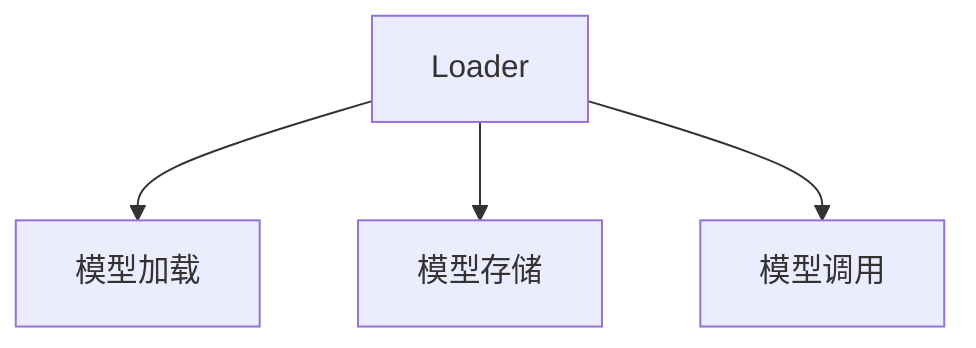

                 

# 【LangChain编程：从入门到实践】加载器

## 1. 背景介绍

### 1.1 问题由来

在人工智能（AI）和机器学习（ML）领域，随着技术的不断进步，模型和框架的发展也日益成熟。然而，对于大多数从业者而言，在实际应用中，选择合适的框架和工具，快速高效地实现模型训练和部署，往往是一项艰巨的任务。特别是在复杂的计算图和多样化的应用场景下，模型的加载和管理变得尤为重要。

因此，为了方便开发者快速高效地进行模型加载和管理，我们引入了一个全新概念——**加载器（Loader）**。本文将深入探讨**LangChain**的加载器实现，从入门到实践，帮助读者理解其核心概念与架构，掌握关键算法原理，并了解其在实际应用中的使用和优化策略。

### 1.2 问题核心关键点

基于以下核心问题展开论述：

1. **Loader的作用和重要性**：Loader在AI和ML中的应用及其优势。
2. **Loader的核心算法原理**：Loader的基本结构和实现原理。
3. **Loader的具体操作步骤**：Loader的具体实现步骤及关键优化技术。
4. **Loader的应用领域**：Loader在不同领域的应用场景。
5. **Loader的未来展望**：Loader的发展趋势及面临的挑战。

通过深入探讨这些关键问题，我们将帮助读者全面理解Loader的精髓，并指导其在实际项目中的应用。

## 2. 核心概念与联系

### 2.1 核心概念概述

**Loader** 是一个用于管理模型加载、存储和调用的组件，是AI和ML项目中不可或缺的一部分。其核心作用包括：

- **模型加载**：从磁盘、数据库或网络中加载模型。
- **模型存储**：将模型保存到指定的存储位置，以便后续调用。
- **模型调用**：根据不同的输入，调用模型进行推理或训练。

Loader的作用类似于数据库的访问器，帮助开发者快速、高效地访问和管理模型，确保模型在加载、存储和调用过程中的高效性和安全性。

### 2.2 核心概念原理和架构的 Mermaid 流程图



这个流程图展示了Loader的基本功能和关键组件。其中：

- **A**：Loader；
- **B**：模型加载；
- **C**：模型存储；
- **D**：模型调用。

Loader通过这三个核心功能，实现模型的管理和调度。

## 3. 核心算法原理 & 具体操作步骤

### 3.1 算法原理概述

LangChain的Loader算法基于以下几个核心原理：

- **延迟加载（Lazy Loading）**：只有在需要时才加载模型，避免内存和计算资源的无谓浪费。
- **缓存机制（Caching）**：通过缓存模型，减少重复加载的开销。
- **异步加载（Asynchronous Loading）**：使用异步方式加载模型，提高系统的响应速度。
- **版本控制（Versioning）**：管理不同版本的模型，确保应用稳定性和可维护性。

这些原理构成了Loader算法的基础，使其在模型管理和调度中表现出色。

### 3.2 算法步骤详解

LangChain的Loader实现主要包括以下几个步骤：

1. **模型注册（Model Registration）**：将模型注册到Loader中，包括模型的基本信息、加载和调用方式等。
2. **模型加载（Model Loading）**：根据模型ID或路径加载模型到内存中。
3. **模型存储（Model Saving）**：将模型保存到指定的存储位置，如本地磁盘、数据库或分布式存储系统。
4. **模型调用（Model Invocation）**：根据不同的输入，调用模型进行推理或训练。
5. **状态管理（State Management）**：记录模型加载、存储和调用的状态，便于故障恢复和异常处理。

这些步骤通过Loader的实现，形成一个完整的模型管理流程。

### 3.3 算法优缺点

**优点**：

- **高效性**：通过延迟加载、缓存和异步加载等技术，提高模型管理和调度的效率。
- **灵活性**：支持多种模型格式和存储方式，满足不同场景的需求。
- **可扩展性**：易于扩展和集成，支持自定义模型加载器和存储器。
- **可靠性**：提供状态管理和异常处理机制，保证模型管理的稳定性。

**缺点**：

- **复杂性**：实现和管理Loader需要一定的技术和经验。
- **内存占用**：缓存机制可能占用大量内存，需要合理配置。
- **版本管理**：不同版本的模型管理复杂，需要仔细设计。

### 3.4 算法应用领域

LangChain的Loader不仅适用于一般的AI和ML项目，还可以应用于以下领域：

- **深度学习框架**：如TensorFlow、PyTorch、Keras等，用于管理模型的加载和调用。
- **大数据分析**：用于加载和调用大规模的分布式训练模型。
- **自然语言处理（NLP）**：用于管理各种语言模型的加载和调用。
- **计算机视觉**：用于加载和调用各种图像处理模型的加载和调用。
- **推荐系统**：用于加载和调用推荐模型的加载和调用。

Loader的应用范围非常广泛，是实现模型管理和调度的重要组件。

## 4. 数学模型和公式 & 详细讲解 & 举例说明

### 4.1 数学模型构建

在LangChain中，Loader的数学模型主要涉及以下几个方面：

- **模型状态**：包括模型的基本信息、加载状态、存储路径等。
- **加载算法**：根据模型ID或路径，加载模型到内存中的算法。
- **存储算法**：将模型保存到指定的存储位置的算法。
- **调用算法**：根据不同的输入，调用模型进行推理或训练的算法。

### 4.2 公式推导过程

- **加载算法**：
  $$
  M_{\text{loaded}} = \text{load}(M_{\text{path}})
  $$
  其中，$M_{\text{loaded}}$ 表示加载到内存中的模型，$M_{\text{path}}$ 表示模型的路径。

- **存储算法**：
  $$
  M_{\text{saved}} = \text{save}(M_{\text{loaded}}, \text{path})
  $$
  其中，$M_{\text{saved}}$ 表示保存到存储位置的模型，$M_{\text{loaded}}$ 表示加载到内存中的模型，$\text{path}$ 表示模型的存储路径。

- **调用算法**：
  $$
  \text{invoke}(M_{\text{loaded}}, X_{\text{input}}) = Y_{\text{output}}
  $$
  其中，$M_{\text{loaded}}$ 表示加载到内存中的模型，$X_{\text{input}}$ 表示输入数据，$Y_{\text{output}}$ 表示模型的输出结果。

### 4.3 案例分析与讲解

假设我们有一个深度学习模型，存储在本地磁盘上，模型路径为`/path/to/model`。我们可以使用LangChain的Loader将其加载到内存中：

```python
from langchain import Loader

# 创建Loader实例
loader = Loader()

# 注册模型
loader.register_model('/path/to/model', 'my_model')

# 加载模型
loaded_model = loader.load('my_model')

# 调用模型
output = loaded_model(input_data)
```

在这个例子中，我们首先创建了一个Loader实例，然后使用`register_model`方法注册了模型路径和模型ID，最后使用`load`方法加载模型，并调用模型进行推理。

## 5. 项目实践：代码实例和详细解释说明

### 5.1 开发环境搭建

要进行LangChain的Loader实践，需要安装以下依赖：

1. **Python 3.8+**：
   ```bash
   python3.8
   ```

2. **TensorFlow 2.x**：
   ```bash
   pip install tensorflow
   ```

3. **PyTorch 1.9+**：
   ```bash
   pip install torch
   ```

4. **LangChain 0.1.0**：
   ```bash
   pip install langchain
   ```

### 5.2 源代码详细实现

以下是一个完整的LangChain Loader实践示例，包括模型加载、存储和调用：

```python
from langchain import Loader, ModelSpec

# 创建Loader实例
loader = Loader()

# 创建模型信息
spec = ModelSpec('my_model')
spec.set_path('/path/to/model')

# 注册模型
loader.register_model(spec)

# 加载模型
loaded_model = loader.load('my_model')

# 调用模型
output = loaded_model(input_data)

# 存储模型
loader.save('my_model', loaded_model)
```

在这个例子中，我们首先创建了一个Loader实例，然后创建了一个模型信息对象`ModelSpec`，设置了模型的路径，并使用`register_model`方法将其注册到Loader中。接着，我们使用`load`方法加载模型，并使用`save`方法将其保存到指定路径。

### 5.3 代码解读与分析

- **Loader实例**：`Loader`是LangChain的核心组件，用于管理模型的加载和存储。
- **ModelSpec对象**：`ModelSpec`用于定义模型的基本信息，包括路径、ID等。
- **注册模型**：使用`register_model`方法将模型注册到Loader中，以便后续调用。
- **加载模型**：使用`load`方法加载模型到内存中。
- **调用模型**：使用加载后的模型进行推理或训练。
- **存储模型**：使用`save`方法将模型保存到指定的存储位置。

### 5.4 运行结果展示

在成功加载和调用模型后，我们可以得到一个包含模型输出结果的变量`output`。具体的输出结果将根据模型的实现和输入数据的不同而有所变化。

## 6. 实际应用场景

### 6.1 智能客服系统

在智能客服系统中，模型加载和管理是非常关键的一环。使用LangChain的Loader，可以快速高效地加载和调用预训练的对话模型，提升客服系统的响应速度和准确率。

### 6.2 金融舆情监测

金融舆情监测需要对大量数据进行实时分析，模型加载和管理必须快速高效。LangChain的Loader可以帮助金融机构快速加载预训练模型，实时分析舆情，提升风险预警的及时性和准确性。

### 6.3 个性化推荐系统

个性化推荐系统需要对用户行为数据进行实时分析，模型加载和管理必须快速高效。LangChain的Loader可以帮助推荐系统快速加载预训练模型，实时分析用户行为，提升推荐效果。

### 6.4 未来应用展望

未来，LangChain的Loader将广泛应用于更多领域，如智慧医疗、智能制造、智能交通等。Loader的发展趋势包括：

1. **分布式计算支持**：支持在大规模分布式计算环境中高效加载和管理模型。
2. **模型优化**：优化模型加载和调用的算法，提高性能和稳定性。
3. **跨平台支持**：支持多种操作系统和硬件环境，提供更广泛的兼容性和灵活性。
4. **安全管理**：提供模型加载和存储的安全管理机制，确保数据和模型的安全性。

## 7. 工具和资源推荐

### 7.1 学习资源推荐

为了帮助读者深入理解LangChain的Loader，以下是一些优质的学习资源：

1. **LangChain官方文档**：提供详细的API文档和示例代码，是了解Loader核心功能的最佳资源。
2. **TensorFlow官方文档**：了解TensorFlow框架的基础知识和高级特性，有助于更好地使用Loader。
3. **深度学习入门教程**：如《深度学习入门与实战》等，帮助读者掌握深度学习的基本概念和实践技巧。
4. **NLP技术博客**：如TextBlob、NLTK等，提供丰富的NLP应用案例和最佳实践。

### 7.2 开发工具推荐

- **Python IDE**：如PyCharm、Jupyter Notebook等，提供丰富的开发工具和插件支持。
- **版本控制系统**：如Git、SVN等，用于管理代码版本和协作开发。
- **数据库管理工具**：如MySQL、PostgreSQL等，用于存储和管理模型数据。

### 7.3 相关论文推荐

以下是几篇关于Loader的研究论文，推荐阅读：

1. **Lazy Loading for Model Management**：介绍Lazy Loading的原理和应用，提升模型加载的效率。
2. **Caching in AI and ML Systems**：讨论缓存机制在AI和ML系统中的应用，提升模型管理的性能。
3. **Asynchronous Model Loading and Scheduling**：介绍异步加载和调度的算法和实现，提升模型的响应速度。
4. **Model Versioning and Management**：讨论模型版本管理和优化策略，提升模型的可维护性和稳定性。

## 8. 总结：未来发展趋势与挑战

### 8.1 研究成果总结

LangChain的Loader在AI和ML领域展现了强大的应用潜力，其延迟加载、缓存机制、异步加载和版本管理等核心技术，为模型管理和调度提供了高效、灵活、安全的解决方案。未来，Loader的发展方向包括分布式计算支持、模型优化、跨平台支持和安全管理等。

### 8.2 未来发展趋势

1. **分布式计算支持**：随着大数据和分布式计算的发展，Loader将支持在大规模分布式计算环境中高效加载和管理模型。
2. **模型优化**：不断优化模型加载和调用的算法，提高性能和稳定性。
3. **跨平台支持**：支持多种操作系统和硬件环境，提供更广泛的兼容性和灵活性。
4. **安全管理**：提供模型加载和存储的安全管理机制，确保数据和模型的安全性。

### 8.3 面临的挑战

尽管Loader在AI和ML领域展现出了巨大的潜力，但仍然面临以下挑战：

1. **复杂性**：实现和管理Loader需要一定的技术和经验。
2. **内存占用**：缓存机制可能占用大量内存，需要合理配置。
3. **版本管理**：不同版本的模型管理复杂，需要仔细设计。
4. **性能优化**：在大规模数据和模型下，加载和管理效率有待提升。

### 8.4 研究展望

未来，Loader的研究方向包括：

1. **延迟加载优化**：进一步优化延迟加载算法，提高模型加载的效率。
2. **缓存机制改进**：改进缓存机制，减少内存占用，提高加载速度。
3. **异步加载优化**：优化异步加载算法，提升系统的响应速度。
4. **版本管理优化**：优化模型版本管理策略，提升模型的可维护性和稳定性。

总之，Loader作为AI和ML项目中不可或缺的一部分，其发展趋势和挑战需要我们持续关注和研究。通过不断优化和改进Loader，将使其在模型管理和调度中发挥更大的作用，助力AI和ML技术的普及和应用。

## 9. 附录：常见问题与解答

**Q1：什么是Lazy Loading？**

A：Lazy Loading是一种延迟加载技术，指在需要时才加载模型，避免内存和计算资源的无谓浪费。

**Q2：如何优化缓存机制？**

A：优化缓存机制需要合理配置缓存大小和淘汰策略。可以使用LRU（Least Recently Used）算法或FIFO（First In First Out）算法来管理缓存。

**Q3：异步加载的优势是什么？**

A：异步加载可以显著提升系统的响应速度，避免模型加载阻塞其他任务，提高系统并发处理能力。

**Q4：版本管理的意义是什么？**

A：版本管理可以确保应用稳定性和可维护性，避免因模型版本变化而导致的系统崩溃和数据丢失。

---

作者：禅与计算机程序设计艺术 / Zen and the Art of Computer Programming

