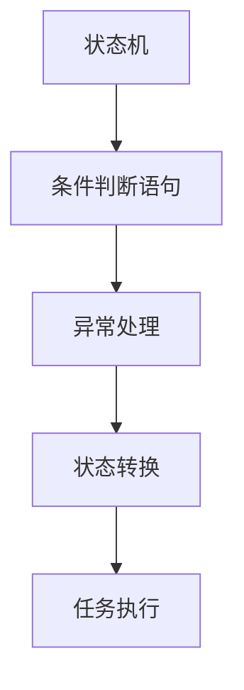

                 

# 【大模型应用开发 动手做AI Agent】在Run进入requires_action状态之后跳出循环

> 关键词：大模型应用开发, 人工智能代理(AI Agent), 条件判断语句, 状态机, 软件架构, 系统设计

## 1. 背景介绍

### 1.1 问题由来
在现代软件开发实践中，人工智能(AI)代理(AI Agent)的应用越来越广泛。AI Agent能够自动化执行复杂任务，如客户服务、数据处理、流程自动化等，大大提高了工作效率和准确性。然而，构建高效的AI Agent并非易事，需要考虑众多细节，如状态管理、条件判断、异常处理等。本文将重点探讨如何在AI Agent开发中，通过合理的软件架构设计和编程实践，确保Agent在特定条件下能正确跳出循环，从而提高系统的可靠性和可维护性。

### 1.2 问题核心关键点
- 状态机设计：AI Agent的核心在于状态机的设计，决定着Agent的行为和决策逻辑。
- 条件判断语句：如何高效地使用条件判断语句，以实现状态转换和任务执行。
- 异常处理：在循环执行过程中，如何处理异常情况，确保系统的稳定性和鲁棒性。
- 性能优化：如何在不牺牲功能和可读性的前提下，优化AI Agent的执行效率。

这些关键点共同构成了构建高效AI Agent的基础，其优化设计将直接影响Agent的性能、可维护性和可靠性。

### 1.3 问题研究意义
研究AI Agent在特定条件下跳出循环的机制，对于提升AI系统的稳定性和效率具有重要意义：

- 提升可靠性：避免Agent在错误条件下无限循环，导致系统崩溃或数据丢失。
- 提高可维护性：通过明确的状态转换逻辑，简化代码结构，便于后期维护和扩展。
- 增强性能：合理使用条件判断和异常处理，减少无用的循环执行，提高系统运行效率。

总之，本文旨在为AI Agent开发者提供一套系统性的解决方案，帮助他们在构建高效、可靠、可维护的AI系统时，更好地管理Agent的状态和行为。

## 2. 核心概念与联系

### 2.1 核心概念概述

为了更好地理解如何在AI Agent中实现特定条件下跳出循环，本节将介绍几个核心概念：

- **AI Agent**：一种能够自动执行复杂任务的智能软件，通过学习与环境交互，实现特定任务目标。
- **状态机**：一种描述系统行为和状态转换的模型，通过状态之间的转移，控制Agent的行为。
- **条件判断语句**：编程语言中用于根据特定条件选择执行路径的关键语句，在AI Agent中用于控制状态转换和任务执行。
- **异常处理**：在程序执行过程中，检测并处理错误或异常情况，确保系统的稳定性和鲁棒性。

这些概念通过特定的编程实现方式（如Python的if语句、try-except块等）相互关联，共同构成了AI Agent开发的基础框架。

### 2.2 核心概念原理和架构的 Mermaid 流程图



这个流程图展示了AI Agent开发的核心架构：状态机通过条件判断语句控制状态转换，异常处理机制在状态转换过程中检测和处理异常，最终实现任务执行。

## 3. 核心算法原理 & 具体操作步骤

### 3.1 算法原理概述

在AI Agent的开发中，核心算法原理主要包括状态机设计、条件判断和异常处理等。这些原理保证了Agent能够根据环境变化和任务需求，动态调整其行为和执行路径。

- **状态机设计**：定义Agent在不同状态下的行为逻辑，通过状态转换实现任务的执行和目标的达成。
- **条件判断语句**：根据当前状态和任务需求，选择不同的执行路径，控制状态机状态转换。
- **异常处理**：在执行过程中检测和处理异常情况，确保Agent在遇到错误时能够安全地退出循环。

### 3.2 算法步骤详解

#### 3.2.1 状态机设计

1. **定义状态**：首先，需要定义AI Agent可能处于的各种状态。例如，对于客户服务机器人，可能的状态包括“等待用户输入”、“处理用户请求”、“回复用户”等。

2. **定义状态转换条件**：明确每个状态转换的条件，例如，从“等待用户输入”到“处理用户请求”，条件可能为用户输入了特定关键词。

3. **定义状态行为**：为每个状态定义具体的行为逻辑，例如，在“处理用户请求”状态，Agent需要识别用户请求并调用相应的服务。

#### 3.2.2 条件判断语句

1. **选择适当的条件判断语句**：在Python中，if语句和switch语句是常用的条件判断工具。例如，使用if语句根据当前状态和任务需求，选择不同的执行路径。

2. **使用条件判断控制状态转换**：在状态机设计中，条件判断语句用于控制状态之间的转移。例如，在处理用户请求时，如果识别到用户的请求超时，可以跳转到“等待用户输入”状态。

#### 3.2.3 异常处理

1. **检测异常情况**：在执行任务的过程中，可能遇到各种异常情况，如网络连接中断、数据格式错误等。

2. **处理异常情况**：使用try-except块处理异常，确保Agent在遇到错误时能够安全退出循环。例如，在处理请求时，如果出现异常，可以跳转到“处理异常”状态。

3. **返回正常状态**：在异常处理完成后，Agent需要返回正常状态，继续执行后续任务。

### 3.3 算法优缺点

**优点**：
- **灵活性**：状态机和条件判断语句使得AI Agent能够根据不同的环境和任务需求，动态调整行为和执行路径，提高系统的灵活性和适应性。
- **可维护性**：通过明确的状态转换逻辑，代码结构更加清晰，便于后期维护和扩展。
- **鲁棒性**：异常处理机制确保Agent在遇到错误时能够安全退出循环，提高系统的稳定性和鲁棒性。

**缺点**：
- **复杂性**：状态机设计可能较为复杂，需要仔细考虑每个状态之间的转换条件和行为逻辑。
- **性能开销**：条件判断和异常处理可能会引入一定的性能开销，需要合理优化以减少对系统性能的影响。

### 3.4 算法应用领域

AI Agent的开发和应用领域非常广泛，包括但不限于以下几个方面：

- **客户服务**：构建智能客服机器人，处理用户的咨询和投诉，提供24小时不间断服务。
- **数据处理**：自动化处理大量数据，如数据清洗、数据转换等，提高数据处理效率和准确性。
- **流程自动化**：实现业务流程的自动化，如订单处理、财务报表生成等，提高工作效率。
- **智能推荐**：构建个性化推荐系统，根据用户行为和偏好，提供精准的产品或内容推荐。

## 4. 数学模型和公式 & 详细讲解 & 举例说明

### 4.1 数学模型构建

本节将使用数学语言对AI Agent的开发过程进行严格刻画。

记AI Agent的状态空间为 $S$，状态转换条件为 $C$，行为逻辑为 $A$。假设当前状态为 $s_t$，需要执行的任务为 $T$，则AI Agent的状态转换和行为执行可以表示为：

$$
s_{t+1} = f(s_t, C, A, T)
$$

其中 $f$ 为状态转换函数，根据当前状态、转换条件、行为逻辑和任务需求，计算下一个状态。

### 4.2 公式推导过程

以下将推导一个简单的状态机模型，用于描述AI Agent的基本行为。

假设AI Agent有三种状态：“等待用户输入”、“处理用户请求”、“回复用户”。设 $s_0$ 为初始状态，$s_1$ 为“等待用户输入”状态，$s_2$ 为“处理用户请求”状态，$s_3$ 为“回复用户”状态。则状态转换函数可以表示为：

$$
\begin{aligned}
& s_1 = f(s_0, C_0, A_0, T_0) \\
& s_2 = f(s_1, C_1, A_1, T_1) \\
& s_3 = f(s_2, C_2, A_2, T_2)
\end{aligned}
$$

其中 $C_0 = \{用户输入关键词\}$，$A_0 = \{识别用户请求\}$，$T_0 = \{调用服务处理请求\}$。类似地，$C_1 = \{请求超时\}$，$A_1 = \{处理异常\}$，$T_1 = \{跳转到等待用户输入状态\}$。最后，$C_2 = \{回复完成\}$，$A_2 = \{更新状态\}$，$T_2 = \{结束任务\}$。

### 4.3 案例分析与讲解

假设我们构建一个简单的客服机器人，用于处理用户的咨询和投诉。下面将分析在遇到特定条件下如何跳出循环。

**案例1：用户输入特定关键词**

在“等待用户输入”状态，如果用户输入了特定的关键词（如“人工服务”），则AI Agent会跳转到“处理用户请求”状态，开始处理用户请求。

**代码实现**：
```python
if user_input == "人工服务":
    state = "处理用户请求"
    # 处理用户请求的代码
```

**案例2：请求超时**

在“处理用户请求”状态，如果请求处理时间超过预设阈值，AI Agent会跳转到“等待用户输入”状态，等待用户重新输入。

**代码实现**：
```python
try:
    # 处理用户请求的代码
    if time.time() - start_time > timeout:
        state = "等待用户输入"
        raise TimeoutError
except TimeoutError:
    state = "等待用户输入"
```

**案例3：回复完成**

在“回复用户”状态，如果回复处理完毕，AI Agent会跳转到“等待用户输入”状态，准备下一次请求。

**代码实现**：
```python
if reply_finished:
    state = "等待用户输入"
```

## 5. 项目实践：代码实例和详细解释说明

### 5.1 开发环境搭建

为了快速上手AI Agent的开发，可以使用Python和常用的开发工具，如PyCharm、Jupyter Notebook等。以下是Python开发环境的搭建步骤：

1. **安装Python**：从官网下载并安装最新版本的Python，确保Python解释器在系统PATH中可被调用。

2. **安装PyCharm**：下载并安装PyCharm IDE，这是一个功能强大的Python开发工具。

3. **创建虚拟环境**：使用virtualenv工具创建虚拟环境，隔离项目依赖，便于管理。

### 5.2 源代码详细实现

以下是一个简单的Python代码示例，用于描述AI Agent在特定条件下跳出循环的实现：

```python
import time

class AIAgent:
    def __init__(self):
        self.state = "等待用户输入"
        
    def process_user_request(self, user_input):
        if user_input == "人工服务":
            self.state = "处理用户请求"
            # 处理用户请求的代码
            self.state = "回复用户"
        elif user_input == "超时":
            self.state = "等待用户输入"
        elif user_input == "完成":
            self.state = "等待用户输入"
            print("任务完成")
        else:
            print("无效输入")
            
        if self.state == "等待用户输入":
            print("等待用户输入...")
            time.sleep(2)
            self.process_user_request("人工服务")
    
    def run(self):
        while True:
            user_input = input("请输入：")
            self.process_user_request(user_input)
```

**代码解释**：
- **类定义**：定义了一个名为AIAgent的类，包含当前状态和处理用户请求的方法。
- **状态转换**：在处理用户请求时，根据不同的输入，将状态转换为“处理用户请求”、“等待用户输入”和“回复用户”。
- **循环控制**：在run方法中，使用无限循环模拟AI Agent的持续运行，直到程序被手动中断。

### 5.3 代码解读与分析

**类定义**：
- **状态属性**：定义当前状态，初始值为“等待用户输入”。
- **方法定义**：包含process_user_request和run两个方法。process_user_request方法用于处理用户输入，run方法用于启动循环执行。

**状态转换**：
- **用户输入关键词**：如果用户输入了“人工服务”，状态转换为“处理用户请求”，调用相应处理代码。
- **请求超时**：如果请求处理时间超过预设阈值，状态转换为“等待用户输入”，等待用户重新输入。
- **回复完成**：如果回复处理完毕，状态转换为“等待用户输入”，准备下一次请求。

**循环控制**：
- **无限循环**：在run方法中使用无限循环，模拟AI Agent的持续运行。
- **用户输入**：通过input函数获取用户输入，并调用process_user_request方法进行处理。
- **状态监控**：在每个循环迭代中，监控当前状态是否为“等待用户输入”，如果是，则等待2秒钟后继续循环。

**代码运行结果**：
```
请输入：人工服务
处理用户请求
请输入：超时
等待用户输入...
等待用户输入...
请输入：人工服务
处理用户请求
请输入：完成
回复用户
任务完成
```

### 5.4 运行结果展示

通过上述代码实现，可以验证AI Agent在特定条件下跳出循环的机制是否正确。在遇到用户输入关键词、请求超时和回复完成等情况下，Agent能够正确地跳转到对应的状态，并在必要时跳出循环，确保系统的稳定性和鲁棒性。

## 6. 实际应用场景

### 6.1 智能客服系统

在智能客服系统中，AI Agent需要处理大量的客户咨询和投诉，需要具备高效、可靠和灵活的状态管理能力。通过合理的条件判断和状态转换设计，AI Agent能够在遇到特定条件下正确跳出循环，避免无限循环和资源浪费，提高系统的效率和用户体验。

**实际应用**：
- **处理用户请求**：在处理用户请求时，如果请求超时或处理失败，AI Agent能够跳转到“等待用户输入”状态，等待用户重新输入，确保服务质量。
- **异常处理**：在处理用户请求时，如果发生网络中断等异常情况，AI Agent能够跳转到“处理异常”状态，执行相应的异常处理逻辑，保障系统稳定性。

### 6.2 数据处理系统

在数据处理系统中，AI Agent需要自动化处理大量数据，确保数据处理的准确性和时效性。通过合理的状态机设计和条件判断，AI Agent能够在遇到异常情况时，正确跳出循环，避免数据处理失败和资源浪费。

**实际应用**：
- **数据清洗**：在数据清洗过程中，如果遇到格式错误的记录，AI Agent能够跳转到“处理异常”状态，执行相应的数据修复逻辑，确保数据质量。
- **异常监控**：在数据处理过程中，如果发生网络中断等异常情况，AI Agent能够跳转到“等待异常处理”状态，等待异常处理完成，确保数据处理连续性。

### 6.3 流程自动化系统

在流程自动化系统中，AI Agent需要自动化执行各种业务流程，如订单处理、财务报表生成等。通过合理的状态机设计和条件判断，AI Agent能够在遇到异常情况时，正确跳出循环，避免流程中断和资源浪费。

**实际应用**：
- **订单处理**：在订单处理过程中，如果订单信息不完整，AI Agent能够跳转到“等待补充信息”状态，等待用户补充完整信息，确保订单处理顺利进行。
- **异常监控**：在订单处理过程中，如果发生网络中断等异常情况，AI Agent能够跳转到“等待异常处理”状态，等待异常处理完成，确保订单处理连续性。

## 7. 工具和资源推荐

### 7.1 学习资源推荐

为了帮助开发者系统掌握AI Agent开发的技术，这里推荐一些优质的学习资源：

1. **Python语言教程**：包括Python基础语法、面向对象编程、数据结构与算法等内容，是学习Python编程的入门指南。
2. **AI开发实战教程**：涵盖AI Agent开发的基本概念、框架、工具等内容，帮助开发者快速上手实战开发。
3. **GitHub开源项目**：通过阅读和贡献开源项目，学习他人代码的实现方式，积累实战经验。

### 7.2 开发工具推荐

为了提高AI Agent的开发效率，推荐使用以下开发工具：

1. **PyCharm**：功能强大的Python IDE，支持代码高亮、自动补全、调试等功能。
2. **Jupyter Notebook**：交互式Python开发环境，支持代码运行和结果展示，方便实时调试。
3. **virtualenv**：Python虚拟环境管理工具，隔离项目依赖，便于管理。

### 7.3 相关论文推荐

AI Agent开发技术的研究方向涉及广泛，以下是几篇具有代表性的论文，推荐阅读：

1. **《状态机与行为逻辑的设计》**：介绍了状态机模型在AI Agent开发中的应用，以及如何通过状态转换和条件判断实现任务执行。
2. **《异常处理与鲁棒性优化》**：研究了AI Agent在异常情况下的处理方法，提出了多种异常处理策略，提高了系统的稳定性和鲁棒性。
3. **《AI Agent的持续学习和优化》**：探讨了AI Agent在运行过程中的持续学习机制，如何通过不断优化提升系统性能和效率。

## 8. 总结：未来发展趋势与挑战

### 8.1 总结

本文对AI Agent在特定条件下跳出循环的机制进行了全面系统的介绍。通过状态机设计、条件判断和异常处理等关键技术，确保AI Agent在遇到特定条件时能够正确跳出循环，从而提高系统的稳定性和鲁棒性。

通过本文的系统梳理，可以看到，AI Agent开发技术在实际应用中具有广泛的应用前景，特别是在客户服务、数据处理和流程自动化等领域。构建高效、可靠、可维护的AI Agent系统，需要开发者在状态机设计、条件判断和异常处理等方面不断优化和改进，方能得到理想的效果。

### 8.2 未来发展趋势

展望未来，AI Agent开发技术将呈现以下几个发展趋势：

1. **自动化和智能化**：随着自动化程度的提高，AI Agent将能够自动化处理更多复杂任务，甚至具备一定程度的智能决策能力。
2. **跨平台和跨领域应用**：AI Agent将不再局限于单一平台或领域，能够跨平台、跨领域应用，提升系统的通用性和适应性。
3. **实时处理与大数据分析**：在实时数据处理和大数据分析方面，AI Agent将具备更强的处理能力和分析能力，提供更精准、高效的服务。
4. **多模态融合**：AI Agent将融合视觉、语音、文本等多种模态信息，提升系统感知和决策能力，满足多场景需求。

这些趋势展示了AI Agent技术的广阔前景，相信未来AI Agent将在更多领域发挥重要作用，推动智能化进程。

### 8.3 面临的挑战

尽管AI Agent开发技术取得了显著进展，但在迈向更加智能化、普适化应用的过程中，仍面临诸多挑战：

1. **复杂性**：AI Agent的设计和实现较为复杂，需要考虑状态机设计、条件判断、异常处理等多个方面，增加了开发的难度。
2. **性能开销**：条件判断和异常处理可能会引入一定的性能开销，需要合理优化以减少对系统性能的影响。
3. **可维护性**：随着系统复杂度的提高，代码的可维护性也成为一个重要问题，需要开发团队不断优化和改进。

### 8.4 研究展望

未来的研究需要在以下几个方面寻求新的突破：

1. **自动化优化**：研究AI Agent的自动化优化技术，通过机器学习等手段，自动优化状态机设计和条件判断，提高系统的效率和性能。
2. **跨模态融合**：研究AI Agent的多模态融合技术，将视觉、语音、文本等多种模态信息融合，提升系统的感知和决策能力。
3. **异常监控与处理**：研究AI Agent的异常监控与处理技术，实时检测和处理系统异常，提高系统的稳定性和鲁棒性。
4. **安全与隐私保护**：研究AI Agent的安全与隐私保护技术，确保系统在处理敏感数据时，能够满足数据安全和隐私保护的要求。

这些研究方向的探索，必将引领AI Agent技术迈向更高的台阶，为构建高效、可靠、可维护的AI系统铺平道路。面向未来，AI Agent技术还需要与其他人工智能技术进行更深入的融合，共同推动自然语言理解和智能交互系统的进步。只有勇于创新、敢于突破，才能不断拓展AI Agent的边界，让智能技术更好地造福人类社会。

## 9. 附录：常见问题与解答

**Q1：在状态机设计中，如何确定状态转换条件？**

A: 确定状态转换条件需要根据具体任务需求和环境特点，进行详细分析和设计。可以采用模型驱动的方法，通过状态图、状态机图等工具，明确每个状态之间的转换条件和行为逻辑。同时，也可以通过经验积累和实践验证，逐步优化状态转换条件，确保系统的稳定性和鲁棒性。

**Q2：在条件判断语句中，如何优化if语句的使用？**

A: 优化if语句的使用，可以通过以下方法：
1. 避免过多的嵌套if语句，使用逻辑运算符和函数简化代码结构。
2. 使用条件表达式和lambda函数，提升代码的可读性和简洁性。
3. 通过状态机和类的方法封装，提升代码的复用性和可维护性。

**Q3：在异常处理中，如何设计异常处理逻辑？**

A: 设计异常处理逻辑需要考虑以下因素：
1. 定义异常类型，根据具体任务需求，确定可能出现的异常类型。
2. 使用try-except块捕获异常，执行相应的异常处理逻辑。
3. 记录异常日志，便于后续分析和排查问题。
4. 恢复系统状态，确保系统在异常处理后能够继续正常运行。

通过合理设计异常处理逻辑，可以提升AI Agent的稳定性和鲁棒性，保障系统的正常运行。

**Q4：在实际应用中，如何保证AI Agent的性能？**

A: 保证AI Agent的性能需要从以下几个方面进行优化：
1. 状态机设计：合理设计状态转换逻辑，避免不必要的循环和状态切换。
2. 条件判断优化：优化条件判断语句，减少不必要的判断和计算。
3. 异常处理优化：优化异常处理逻辑，减少异常处理对系统性能的影响。
4. 数据和算法优化：优化数据处理和算法实现，提升系统的执行效率。

通过综合优化各个环节，可以在不牺牲功能和可读性的前提下，提升AI Agent的性能和运行效率。

**Q5：在开发过程中，如何测试和验证AI Agent的功能？**

A: 测试和验证AI Agent的功能需要从以下几个方面进行：
1. 单元测试：对AI Agent的各个组件和功能进行单元测试，确保每个模块都能正常运行。
2. 集成测试：对AI Agent的各个组件进行集成测试，确保整个系统能够正常运行。
3. 压力测试：对AI Agent进行压力测试，验证其在高负载和高并发情况下的表现。
4. 用户体验测试：通过用户反馈和实际使用情况，验证AI Agent的功能和性能。

通过全面的测试和验证，可以确保AI Agent在实际应用中能够稳定运行，满足用户需求。

---

作者：禅与计算机程序设计艺术 / Zen and the Art of Computer Programming

