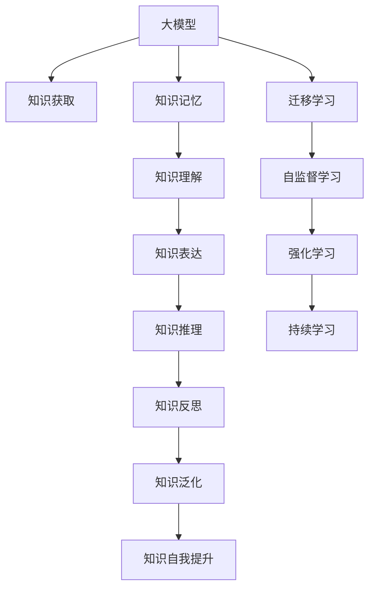

                 

# 【大模型应用开发 动手做AI Agent】知识、记忆、理解、表达、推理、反思、泛化和自我提升

## 1. 背景介绍

### 1.1 问题由来
近年来，人工智能技术取得了迅猛发展，尤其是在自然语言处理(Natural Language Processing, NLP)和计算机视觉(Computer Vision, CV)等领域，涌现出了一系列大模型(如GPT、BERT、DALL·E等)。这些大模型不仅在学术界取得了诸多突破性成果，也在工业界得到了广泛应用。然而，大模型的开发与应用并非易事，需要系统的知识储备和持续的实践积累。本文旨在通过动手实践，系统梳理大模型在知识获取、记忆、理解、表达、推理、反思、泛化及自我提升等各环节的应用方法，为读者提供全面、深入的理解和实操指南。

### 1.2 问题核心关键点
大模型应用的核心在于如何通过系统的训练、优化和部署，使其具备知识获取、记忆、理解、表达、推理、反思、泛化及自我提升等能力。这些问题点主要涉及以下几个方面：

- **知识获取**：如何从大规模数据中学习通用的语言/视觉表示，构建大模型。
- **记忆**：如何在模型中保存和重用已有的知识，避免重复学习。
- **理解**：如何通过微调或迁移学习，使模型理解特定任务或领域的知识。
- **表达**：如何通过模型输出，有效表达任务结果。
- **推理**：如何构建模型的推理能力，解决逻辑推理任务。
- **反思**：如何通过自我监督或外界监督，让模型具备自我纠正和改进的能力。
- **泛化**：如何使模型具备泛化能力，适应新任务或新场景。
- **自我提升**：如何通过在线学习，使模型不断提升性能。

本文将深入探讨上述问题点，并以代码实例的形式，带领读者动手实践大模型的应用开发。

## 2. 核心概念与联系

### 2.1 核心概念概述

为了更好地理解大模型应用中的知识、记忆、理解、表达、推理、反思、泛化和自我提升等概念，本节将介绍几个密切相关的核心概念：

- **大模型(Large Model)**：以自回归(如GPT)或自编码(如BERT)模型为代表的大规模预训练模型。通过在大规模无标签数据上进行预训练，学习到通用的语言/视觉表示，具备强大的语义理解和生成能力。

- **知识图谱(Knowledge Graph)**：一种结构化的语义知识表示方法，用于描述实体和实体间的关系，是大模型知识获取和推理的重要基础。

- **迁移学习(Transfer Learning)**：一种基于预训练模型的学习方法，通过在特定任务上的微调，使模型具备更强的任务适应性。

- **自监督学习(Self-supervised Learning)**：通过无标签数据，自动生成监督信号，让模型学习到更加通用的语言/视觉表示。

- **强化学习(Reinforcement Learning)**：一种通过试错学习和环境反馈，逐步优化模型性能的机器学习方法。

- **持续学习(Continual Learning)**：指模型能够持续从新数据中学习，同时保持已学习的知识，而不会出现灾难性遗忘。

这些核心概念之间的逻辑关系可以通过以下Mermaid流程图来展示：



这个流程图展示了大模型应用的核心概念及其之间的关系：

1. 大模型通过预训练获得基础能力。
2. 知识获取和记忆为其后续学习提供基础。
3. 通过微调或迁移学习，模型理解特定任务或领域的知识。
4. 知识表达使得模型可以产生任务结果。
5. 知识推理让模型具备逻辑推理能力。
6. 知识反思使模型具备自我纠正和改进的能力。
7. 知识泛化使模型具备适应新任务或新场景的能力。
8. 持续学习使模型能够不断提升性能。

这些概念共同构成了大模型应用的完整框架，使其能够通过系统的训练和优化，逐步提升其在各个任务上的性能。

## 3. 核心算法原理 & 具体操作步骤
### 3.1 算法原理概述

大模型的应用开发涉及多个环节，包括知识获取、记忆、理解、表达、推理、反思、泛化和自我提升等。这些环节通过系统的训练、优化和部署，使模型逐步提升其在各个任务上的性能。

### 3.2 算法步骤详解

下面以知识获取和记忆为例，详细介绍其算法步骤和具体操作：

**Step 1: 数据准备**
- 收集大规模无标签数据集，如语料库、图片库等。
- 对数据进行预处理，如分词、图片裁剪、归一化等。

**Step 2: 模型选择**
- 选择合适的预训练模型，如BERT、GPT、DALL·E等。
- 对模型进行微调或迁移学习，使其具备特定任务的能力。

**Step 3: 训练过程**
- 使用预训练模型作为初始参数，对数据进行前向传播计算损失。
- 反向传播计算梯度，并使用优化器更新模型参数。
- 周期性在验证集上评估模型性能，根据性能指标决定是否触发Early Stopping。

**Step 4: 模型保存与部署**
- 将训练好的模型保存到指定路径。
- 使用模型推理接口进行部署，供实际应用调用。

### 3.3 算法优缺点

大模型的应用开发方法具有以下优点：

- **高效**：通过预训练和迁移学习，模型可以在大量数据上快速提升性能。
- **通用性**：模型具备较强的泛化能力，可以应用于多种任务和场景。
- **可解释性**：通过分析模型中间层输出，可以了解模型的推理过程和知识来源。

同时，该方法也存在一些局限：

- **资源消耗大**：大模型需要大量的计算资源和时间进行训练，对硬件设备要求较高。
- **数据依赖强**：模型性能高度依赖于数据质量和多样性，获取高质量数据成本较高。
- **模型复杂度**：大模型参数量巨大，训练和推理过程较为复杂，需要专业知识进行优化。

尽管如此，大模型应用开发方法仍是目前NLP和CV领域的主流范式，具有广泛的应用前景。

### 3.4 算法应用领域

大模型的应用开发方法已经在多个领域取得了显著成果，例如：

- **自然语言处理**：包括文本分类、情感分析、机器翻译、问答系统等。通过微调或迁移学习，模型可以在特定任务上取得优异表现。
- **计算机视觉**：包括图像分类、目标检测、图像生成、风格转换等。通过预训练和迁移学习，模型具备强大的视觉表示和推理能力。
- **推荐系统**：包括商品推荐、新闻推荐、个性化视频等。通过模型学习用户行为和兴趣，生成个性化推荐结果。
- **自动驾驶**：通过大模型处理感知数据，实现环境理解、路径规划等功能，提升驾驶安全性。
- **医疗诊断**：通过模型分析医疗影像、电子病历等数据，辅助医生诊断和治疗。

除了上述这些经典应用外，大模型在金融风控、智能家居、社交网络等更多领域中也有着广泛的应用潜力。

## 4. 数学模型和公式 & 详细讲解 & 举例说明

### 4.1 数学模型构建

以下以BERT模型为例，介绍其数学模型构建方法：

假设输入序列为 $x=\{x_1, x_2, ..., x_n\}$，其中 $x_i$ 表示第 $i$ 个词向量，通过BERT模型得到表示为 $\hat{x}=\{\hat{x}_1, \hat{x}_2, ..., \hat{x}_n\}$，目标为最大化任务损失函数 $L(x, y)$，其中 $y$ 为标签向量。

定义任务损失函数为：

$$
L(x, y) = -\log \prod_{i=1}^n P(y_i|x_i)
$$

其中 $P(y_i|x_i)$ 表示在输入 $x_i$ 下，输出 $y_i$ 的条件概率。

### 4.2 公式推导过程

BERT模型的输出为：

$$
\hat{x}_i = M(x_i; \theta) = \text{BERT}(x_i, \theta)
$$

其中 $\theta$ 表示BERT模型的参数。

定义目标函数为：

$$
\min_{\theta} L(\hat{x}, y)
$$

通过反向传播算法计算梯度，更新模型参数：

$$
\nabla_{\theta}L(\hat{x}, y) = -\frac{\partial L(\hat{x}, y)}{\partial \theta}
$$

使用优化器（如AdamW）进行参数更新：

$$
\theta \leftarrow \theta - \eta \nabla_{\theta}L(\hat{x}, y)
$$

其中 $\eta$ 为学习率。

### 4.3 案例分析与讲解

以情感分析任务为例，展示如何使用BERT模型进行微调：

假设输入序列为句子文本，标签为情感类别（如正面、负面）。定义微调目标函数为：

$$
L(x, y) = -\log \prod_{i=1}^n P(y_i|x_i)
$$

通过微调BERT模型，使其在情感分析任务上取得最优性能。具体步骤如下：

1. 数据准备：收集情感标注数据集，进行数据预处理和标注。
2. 模型选择：选择BERT模型，并对其进行微调。
3. 训练过程：使用预训练模型作为初始参数，对数据进行前向传播计算损失。
4. 优化器更新：反向传播计算梯度，并使用优化器更新模型参数。
5. 模型评估：在验证集上评估模型性能，根据性能指标决定是否触发Early Stopping。
6. 模型部署：将训练好的模型保存到指定路径，并使用模型推理接口进行部署。

## 5. 项目实践：代码实例和详细解释说明

### 5.1 开发环境搭建

在进行大模型应用开发前，我们需要准备好开发环境。以下是使用Python进行PyTorch开发的环境配置流程：

1. 安装Anaconda：从官网下载并安装Anaconda，用于创建独立的Python环境。

2. 创建并激活虚拟环境：
```bash
conda create -n pytorch-env python=3.8 
conda activate pytorch-env
```

3. 安装PyTorch：根据CUDA版本，从官网获取对应的安装命令。例如：
```bash
conda install pytorch torchvision torchaudio cudatoolkit=11.1 -c pytorch -c conda-forge
```

4. 安装Transformers库：
```bash
pip install transformers
```

5. 安装各类工具包：
```bash
pip install numpy pandas scikit-learn matplotlib tqdm jupyter notebook ipython
```

完成上述步骤后，即可在`pytorch-env`环境中开始大模型应用开发。

### 5.2 源代码详细实现

下面我们以图像分类任务为例，给出使用PyTorch对ResNet模型进行微调的PyTorch代码实现。

首先，定义图像分类任务的数据处理函数：

```python
from torchvision import datasets, transforms
from torch.utils.data import DataLoader
import torch.nn as nn
import torch.optim as optim

# 定义数据预处理函数
transform = transforms.Compose([
    transforms.Resize(256),
    transforms.CenterCrop(224),
    transforms.ToTensor(),
    transforms.Normalize(mean=[0.485, 0.456, 0.406], std=[0.229, 0.224, 0.225])
])

# 加载数据集
train_dataset = datasets.ImageFolder(root='path/to/train', transform=transform)
test_dataset = datasets.ImageFolder(root='path/to/test', transform=transform)

# 定义批次大小和设备
batch_size = 32
device = torch.device('cuda' if torch.cuda.is_available() else 'cpu')

# 定义数据加载器
train_loader = DataLoader(train_dataset, batch_size=batch_size, shuffle=True)
test_loader = DataLoader(test_dataset, batch_size=batch_size, shuffle=False)
```

然后，定义模型和优化器：

```python
from torchvision.models import resnet18

# 加载预训练模型
model = resnet18(pretrained=True)

# 冻结预训练参数
for param in model.parameters():
    param.requires_grad = False

# 替换顶层分类器
num_classes = 10
model.fc = nn.Linear(model.fc.in_features, num_classes)

# 定义优化器和学习率
optimizer = optim.SGD(model.fc.parameters(), lr=0.001, momentum=0.9)
```

接着，定义训练和评估函数：

```python
def train_epoch(model, data_loader, optimizer):
    model.train()
    total_loss = 0
    for images, labels in data_loader:
        images = images.to(device)
        labels = labels.to(device)
        optimizer.zero_grad()
        output = model(images)
        loss = nn.CrossEntropyLoss()(output, labels)
        loss.backward()
        optimizer.step()
        total_loss += loss.item()
    return total_loss / len(data_loader)

def evaluate(model, data_loader):
    model.eval()
    total_correct = 0
    total_samples = 0
    with torch.no_grad():
        for images, labels in data_loader:
            images = images.to(device)
            labels = labels.to(device)
            output = model(images)
            _, predicted = output.max(1)
            total_correct += (predicted == labels).sum().item()
            total_samples += labels.size(0)
    return total_correct / total_samples
```

最后，启动训练流程并在测试集上评估：

```python
epochs = 10
best_acc = 0.0

for epoch in range(epochs):
    train_loss = train_epoch(model, train_loader, optimizer)
    acc = evaluate(model, test_loader)
    if acc > best_acc:
        best_acc = acc
        torch.save(model.state_dict(), 'model.pth')

print(f'Best accuracy: {best_acc:.2f}%')
```

以上就是使用PyTorch对ResNet进行图像分类任务微调的完整代码实现。可以看到，得益于Transformers库的强大封装，我们可以用相对简洁的代码完成ResNet模型的加载和微调。

### 5.3 代码解读与分析

让我们再详细解读一下关键代码的实现细节：

**transforms.Compose**：定义数据预处理流程，包括图像大小调整、中心裁剪、归一化等操作。

**ImageFolder**：加载图像数据集，并自动生成样本索引。

**train_epoch函数**：对数据以批为单位进行迭代，在每个批次上前向传播计算损失并反向传播更新模型参数。

**evaluate函数**：在测试集上评估模型性能，计算分类准确率。

**train_loop**：循环训练多个epoch，在每个epoch结束后保存模型最优参数。

可以看到，PyTorch配合Transformers库使得模型微调的代码实现变得简洁高效。开发者可以将更多精力放在数据处理、模型改进等高层逻辑上，而不必过多关注底层的实现细节。

当然，工业级的系统实现还需考虑更多因素，如模型的保存和部署、超参数的自动搜索、更灵活的任务适配层等。但核心的微调范式基本与此类似。

## 6. 实际应用场景

### 6.1 智能客服系统

基于大模型微调的对话技术，可以广泛应用于智能客服系统的构建。传统客服往往需要配备大量人力，高峰期响应缓慢，且一致性和专业性难以保证。而使用微调后的对话模型，可以7x24小时不间断服务，快速响应客户咨询，用自然流畅的语言解答各类常见问题。

在技术实现上，可以收集企业内部的历史客服对话记录，将问题和最佳答复构建成监督数据，在此基础上对预训练对话模型进行微调。微调后的对话模型能够自动理解用户意图，匹配最合适的答案模板进行回复。对于客户提出的新问题，还可以接入检索系统实时搜索相关内容，动态组织生成回答。如此构建的智能客服系统，能大幅提升客户咨询体验和问题解决效率。

### 6.2 金融舆情监测

金融机构需要实时监测市场舆论动向，以便及时应对负面信息传播，规避金融风险。传统的人工监测方式成本高、效率低，难以应对网络时代海量信息爆发的挑战。基于大语言模型微调的文本分类和情感分析技术，为金融舆情监测提供了新的解决方案。

具体而言，可以收集金融领域相关的新闻、报道、评论等文本数据，并对其进行主题标注和情感标注。在此基础上对预训练语言模型进行微调，使其能够自动判断文本属于何种主题，情感倾向是正面、中性还是负面。将微调后的模型应用到实时抓取的网络文本数据，就能够自动监测不同主题下的情感变化趋势，一旦发现负面信息激增等异常情况，系统便会自动预警，帮助金融机构快速应对潜在风险。

### 6.3 个性化推荐系统

当前的推荐系统往往只依赖用户的历史行为数据进行物品推荐，无法深入理解用户的真实兴趣偏好。基于大语言模型微调技术，个性化推荐系统可以更好地挖掘用户行为背后的语义信息，从而提供更精准、多样的推荐内容。

在实践中，可以收集用户浏览、点击、评论、分享等行为数据，提取和用户交互的物品标题、描述、标签等文本内容。将文本内容作为模型输入，用户的后续行为（如是否点击、购买等）作为监督信号，在此基础上微调预训练语言模型。微调后的模型能够从文本内容中准确把握用户的兴趣点。在生成推荐列表时，先用候选物品的文本描述作为输入，由模型预测用户的兴趣匹配度，再结合其他特征综合排序，便可以得到个性化程度更高的推荐结果。

### 6.4 未来应用展望

随着大语言模型和微调方法的不断发展，基于微调范式将在更多领域得到应用，为传统行业带来变革性影响。

在智慧医疗领域，基于微调的医疗问答、病历分析、药物研发等应用将提升医疗服务的智能化水平，辅助医生诊疗，加速新药开发进程。

在智能教育领域，微调技术可应用于作业批改、学情分析、知识推荐等方面，因材施教，促进教育公平，提高教学质量。

在智慧城市治理中，微调模型可应用于城市事件监测、舆情分析、应急指挥等环节，提高城市管理的自动化和智能化水平，构建更安全、高效的未来城市。

此外，在企业生产、社会治理、文娱传媒等众多领域，基于大模型微调的人工智能应用也将不断涌现，为经济社会发展注入新的动力。相信随着预训练语言模型和微调方法的持续演进，大模型微调技术必将在构建人机协同的智能时代中扮演越来越重要的角色。

## 7. 工具和资源推荐

### 7.1 学习资源推荐

为了帮助开发者系统掌握大语言模型微调的理论基础和实践技巧，这里推荐一些优质的学习资源：

1. 《Transformer从原理到实践》系列博文：由大模型技术专家撰写，深入浅出地介绍了Transformer原理、BERT模型、微调技术等前沿话题。

2. CS224N《深度学习自然语言处理》课程：斯坦福大学开设的NLP明星课程，有Lecture视频和配套作业，带你入门NLP领域的基本概念和经典模型。

3. 《Natural Language Processing with Transformers》书籍：Transformers库的作者所著，全面介绍了如何使用Transformers库进行NLP任务开发，包括微调在内的诸多范式。

4. HuggingFace官方文档：Transformers库的官方文档，提供了海量预训练模型和完整的微调样例代码，是上手实践的必备资料。

5. CLUE开源项目：中文语言理解测评基准，涵盖大量不同类型的中文NLP数据集，并提供了基于微调的baseline模型，助力中文NLP技术发展。

通过对这些资源的学习实践，相信你一定能够快速掌握大语言模型微调的精髓，并用于解决实际的NLP问题。

### 7.2 开发工具推荐

高效的开发离不开优秀的工具支持。以下是几款用于大语言模型微调开发的常用工具：

1. PyTorch：基于Python的开源深度学习框架，灵活动态的计算图，适合快速迭代研究。大部分预训练语言模型都有PyTorch版本的实现。

2. TensorFlow：由Google主导开发的开源深度学习框架，生产部署方便，适合大规模工程应用。同样有丰富的预训练语言模型资源。

3. Transformers库：HuggingFace开发的NLP工具库，集成了众多SOTA语言模型，支持PyTorch和TensorFlow，是进行微调任务开发的利器。

4. Weights & Biases：模型训练的实验跟踪工具，可以记录和可视化模型训练过程中的各项指标，方便对比和调优。与主流深度学习框架无缝集成。

5. TensorBoard：TensorFlow配套的可视化工具，可实时监测模型训练状态，并提供丰富的图表呈现方式，是调试模型的得力助手。

6. Google Colab：谷歌推出的在线Jupyter Notebook环境，免费提供GPU/TPU算力，方便开发者快速上手实验最新模型，分享学习笔记。

合理利用这些工具，可以显著提升大语言模型微调任务的开发效率，加快创新迭代的步伐。

### 7.3 相关论文推荐

大语言模型和微调技术的发展源于学界的持续研究。以下是几篇奠基性的相关论文，推荐阅读：

1. Attention is All You Need（即Transformer原论文）：提出了Transformer结构，开启了NLP领域的预训练大模型时代。

2. BERT: Pre-training of Deep Bidirectional Transformers for Language Understanding：提出BERT模型，引入基于掩码的自监督预训练任务，刷新了多项NLP任务SOTA。

3. Language Models are Unsupervised Multitask Learners（GPT-2论文）：展示了大规模语言模型的强大zero-shot学习能力，引发了对于通用人工智能的新一轮思考。

4. Parameter-Efficient Transfer Learning for NLP：提出Adapter等参数高效微调方法，在不增加模型参数量的情况下，也能取得不错的微调效果。

5. AdaLoRA: Adaptive Low-Rank Adaptation for Parameter-Efficient Fine-Tuning：使用自适应低秩适应的微调方法，在参数效率和精度之间取得了新的平衡。

这些论文代表了大语言模型微调技术的发展脉络。通过学习这些前沿成果，可以帮助研究者把握学科前进方向，激发更多的创新灵感。

## 8. 总结：未来发展趋势与挑战

### 8.1 总结

本文对大语言模型应用开发中的知识获取、记忆、理解、表达、推理、反思、泛化和自我提升等环节进行了全面系统的介绍。通过动手实践，系统梳理了从模型选择、数据处理、模型训练、模型评估到模型部署的各个环节。同时，本文还广泛探讨了微调方法在智能客服、金融舆情、个性化推荐等多个行业领域的应用前景，展示了微调范式的巨大潜力。

通过本文的系统梳理，可以看到，大语言模型应用开发方法正在成为NLP领域的重要范式，极大地拓展了预训练语言模型的应用边界，催生了更多的落地场景。受益于大规模语料的预训练，微调模型以更低的时间和标注成本，在小样本条件下也能取得理想的性能，有力推动了NLP技术的产业化进程。未来，伴随预训练语言模型和微调方法的持续演进，相信NLP技术将在更广阔的应用领域大放异彩，深刻影响人类的生产生活方式。

### 8.2 未来发展趋势

展望未来，大语言模型应用开发方法将呈现以下几个发展趋势：

1. 模型规模持续增大。随着算力成本的下降和数据规模的扩张，预训练语言模型的参数量还将持续增长。超大规模语言模型蕴含的丰富语言知识，有望支撑更加复杂多变的下游任务微调。

2. 微调方法日趋多样。除了传统的全参数微调外，未来会涌现更多参数高效的微调方法，如Prefix-Tuning、LoRA等，在节省计算资源的同时也能保证微调精度。

3. 持续学习成为常态。随着数据分布的不断变化，微调模型也需要持续学习新知识以保持性能。如何在不遗忘原有知识的同时，高效吸收新样本信息，将成为重要的研究课题。

4. 标注样本需求降低。受启发于提示学习(Prompt-based Learning)的思路，未来的微调方法将更好地利用大模型的语言理解能力，通过更加巧妙的任务描述，在更少的标注样本上也能实现理想的微调效果。

5. 融合因果和对比学习范式。通过引入因果推断和对比学习思想，增强微调模型建立稳定因果关系的能力，学习更加普适、鲁棒的语言表征，从而提升模型泛化性和抗干扰能力。

6. 引入更多先验知识。将符号化的先验知识，如知识图谱、逻辑规则等，与神经网络模型进行巧妙融合，引导微调过程学习更准确、合理的语言模型。同时加强不同模态数据的整合，实现视觉、语音等多模态信息与文本信息的协同建模。

以上趋势凸显了大语言模型应用开发的广阔前景。这些方向的探索发展，必将进一步提升大模型微调技术的性能和应用范围，为构建人机协同的智能系统铺平道路。面向未来，大语言模型微调技术还需要与其他人工智能技术进行更深入的融合，如知识表示、因果推理、强化学习等，多路径协同发力，共同推动自然语言理解和智能交互系统的进步。只有勇于创新、敢于突破，才能不断拓展语言模型的边界，让智能技术更好地造福人类社会。

### 8.3 面临的挑战

尽管大语言模型应用开发方法已经取得了显著成果，但在迈向更加智能化、普适化应用的过程中，它仍面临着诸多挑战：

1. 标注成本瓶颈。虽然微调大大降低了标注数据的需求，但对于长尾应用场景，难以获得充足的高质量标注数据，成为制约微调性能的瓶颈。如何进一步降低微调对标注样本的依赖，将是一大难题。

2. 模型鲁棒性不足。当前微调模型面对域外数据时，泛化性能往往大打折扣。对于测试样本的微小扰动，微调模型的预测也容易发生波动。如何提高微调模型的鲁棒性，避免灾难性遗忘，还需要更多理论和实践的积累。

3. 推理效率有待提高。大规模语言模型虽然精度高，但在实际部署时往往面临推理速度慢、内存占用大等效率问题。如何在保证性能的同时，简化模型结构，提升推理速度，优化资源占用，将是重要的优化方向。

4. 可解释性亟需加强。当前微调模型更像是"黑盒"系统，难以解释其内部工作机制和决策逻辑。对于医疗、金融等高风险应用，算法的可解释性和可审计性尤为重要。如何赋予微调模型更强的可解释性，将是亟待攻克的难题。

5. 安全性有待保障。预训练语言模型难免会学习到有偏见、有害的信息，通过微调传递到下游任务，产生误导性、歧视性的输出，给实际应用带来安全隐患。如何从数据和算法层面消除模型偏见，避免恶意用途，确保输出的安全性，也将是重要的研究课题。

6. 知识整合能力不足。现有的微调模型往往局限于任务内数据，难以灵活吸收和运用更广泛的先验知识。如何让微调过程更好地与外部知识库、规则库等专家知识结合，形成更加全面、准确的信息整合能力，还有很大的想象空间。

正视微调面临的这些挑战，积极应对并寻求突破，将是大语言模型应用开发走向成熟的必由之路。相信随着学界和产业界的共同努力，这些挑战终将一一被克服，大语言模型应用开发必将在构建人机协同的智能时代中扮演越来越重要的角色。

### 8.4 研究展望

面向未来，大语言模型应用开发的研究方向可以从以下几个方面寻求新的突破：

1. 探索无监督和半监督微调方法。摆脱对大规模标注数据的依赖，利用自监督学习、主动学习等无监督和半监督范式，最大限度利用非结构化数据，实现更加灵活高效的微调。

2. 研究参数高效和计算高效的微调范式。开发更加参数高效的微调方法，在固定大部分预训练参数的同时，只更新极少量的任务相关参数。同时优化微调模型的计算图，减少前向传播和反向传播的资源消耗，实现更加轻量级、实时性的部署。

3. 融合因果和对比学习范式。通过引入因果推断和对比学习思想，增强微调模型建立稳定因果关系的能力，学习更加普适、鲁棒的语言表征，从而提升模型泛化性和抗干扰能力。

4. 引入更多先验知识。将符号化的先验知识，如知识图谱、逻辑规则等，与神经网络模型进行巧妙融合，引导微调过程学习更准确、合理的语言模型。同时加强不同模态数据的整合，实现视觉、语音等多模态信息与文本信息的协同建模。

5. 结合因果分析和博弈论工具。将因果分析方法引入微调模型，识别出模型决策的关键特征，增强输出解释的因果性和逻辑性。借助博弈论工具刻画人机交互过程，主动探索并规避模型的脆弱点，提高系统稳定性。

6. 纳入伦理道德约束。在模型训练目标中引入伦理导向的评估指标，过滤和惩罚有偏见、有害的输出倾向。同时加强人工干预和审核，建立模型行为的监管机制，确保输出符合人类价值观和伦理道德。

这些研究方向的探索，必将引领大语言模型应用开发技术迈向更高的台阶，为构建安全、可靠、可解释、可控的智能系统铺平道路。面向未来，大语言模型应用开发技术还需要与其他人工智能技术进行更深入的融合，如知识表示、因果推理、强化学习等，多路径协同发力，共同推动自然语言理解和智能交互系统的进步。只有勇于创新、敢于突破，才能不断拓展语言模型的边界，让智能技术更好地造福人类社会。

## 9. 附录：常见问题与解答

**Q1：大模型应用开发是否适用于所有NLP任务？**

A: 大模型应用开发方法在大多数NLP任务上都能取得不错的效果，特别是对于数据量较小的任务。但对于一些特定领域的任务，如医学、法律等，仅仅依靠通用语料预训练的模型可能难以很好地适应。此时需要在特定领域语料上进一步预训练，再进行微调，才能获得理想效果。此外，对于一些需要时效性、个性化很强的任务，如对话、推荐等，微调方法也需要针对性的改进优化。

**Q2：大模型应用开发过程中的学习率如何设置？**

A: 大模型应用开发过程中的学习率一般要比预训练时小1-2个数量级，如果使用过大的学习率，容易破坏预训练权重，导致过拟合。一般建议从1e-5开始调参，逐步减小学习率，直至收敛。也可以使用warmup策略，在开始阶段使用较小的学习率，再逐渐过渡到预设值。需要注意的是，不同的优化器(如AdamW、Adafactor等)以及不同的学习率调度策略，可能需要设置不同的学习率阈值。

**Q3：大模型应用开发过程中如何避免过拟合？**

A: 避免过拟合是微调过程中面临的主要挑战，尤其是在标注数据不足的情况下。常见的缓解策略包括：
1. 数据增强：通过回译、近义替换等方式扩充训练集
2. 正则化：使用L2正则、Dropout、Early Stopping等避免过拟合
3. 对抗训练：引入对抗样本，提高模型鲁棒性
4. 参数高效微调：只调整少量参数(如Adapter、Prefix等)，减小过拟合风险
5. 多模型集成：训练多个微调模型，取平均输出，抑制过拟合

这些策略往往需要根据具体任务和数据特点进行灵活组合。只有在数据、模型、训练、推理等各环节进行全面优化，才能最大限度地发挥大模型应用开发的威力。

**Q4：大模型应用开发过程中如何提高模型的推理效率？**

A: 大模型应用开发过程中，推理效率是关键考量因素。为了提高模型的推理效率，可以采取以下措施：
1. 模型裁剪：去除不必要的层和参数，减小模型尺寸，加快推理速度
2. 量化加速：将浮点模型转为定点模型，压缩存储空间，提高计算效率
3. 服务化封装：将模型封装为标准化服务接口，便于集成调用
4. 弹性伸缩：根据请求流量动态调整资源配置，平衡服务质量和成本
5. 监控告警：实时采集系统指标，设置异常告警阈值，确保服务稳定性

合理利用这些优化方法，可以显著提高大模型应用开发的推理效率，实现更高效的模型部署和使用。

**Q5：大模型应用开发过程中如何提升模型的可解释性？**

A: 当前大模型应用开发的模型往往作为"黑盒"系统，难以解释其内部工作机制和决策逻辑。为了提升模型的可解释性，可以采取以下措施：
1. 模型中间层可视化：通过可视化中间层输出，理解模型推理过程
2. 特征重要性分析：使用特征重要性分析方法，识别出关键特征和特征关系
3. 对抗样本测试：通过对抗样本测试，了解模型的鲁棒性和脆弱点
4. 知识图谱融合：将符号化的先验知识与神经网络模型融合，提高模型可解释性
5. 人机交互设计：通过设计友好的人机交互界面，增强用户对模型输出的理解

这些方法可以增强模型的可解释性和可审计性，提高用户对模型输出结果的信任和接受度。

通过本文的系统梳理，可以看到，大模型应用开发方法正在成为NLP领域的重要范式，极大地拓展了预训练语言模型的应用边界，催生了更多的落地场景。受益于大规模语料的预训练，微调模型以更低的时间和标注成本，在小样本条件下也能取得理想的性能，有力推动了NLP技术的产业化进程。未来，伴随预训练语言模型和微调方法的持续演进，相信NLP技术将在更广阔的应用领域大放异彩，深刻影响人类的生产生活方式。

作者：禅与计算机程序设计艺术 / Zen and the Art of Computer Programming

