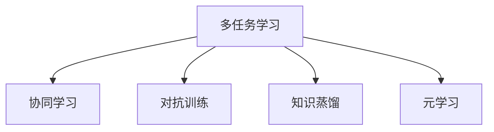

                 

# 【大模型应用开发 动手做AI Agent】第三轮思考：模型完成任务

> 关键词：大模型, 任务完成, 多任务学习, 对话系统, 深度强化学习, 协同学习, 对抗训练

## 1. 背景介绍

### 1.1 问题由来
在构建AI Agent的过程中，模型如何高效地完成各项任务是一个核心问题。大模型由于其参数量大、计算资源需求高，在实际应用中往往面临资源限制和效率瓶颈。如何使模型在资源受限的条件下，高效地完成多种复杂任务，成为了一个亟待解决的问题。

### 1.2 问题核心关键点
这个问题的核心在于，如何设计一个多任务学习框架，使得大模型能够同时完成多种任务，并且在任务之间进行协同和迁移。通过多任务学习和协同学习，模型能够更充分地利用已有的知识和经验，减少过拟合，提高泛化能力。同时，对抗训练等技术也能够提升模型鲁棒性，增强其应对噪声和干扰的能力。

## 2. 核心概念与联系

### 2.1 核心概念概述

为更好地理解大模型如何完成多任务，本节将介绍几个密切相关的核心概念：

- 多任务学习(Multi-task Learning, MTL)：在同一模型上训练多个相关任务，共享模型的底层表示，提高模型的泛化能力和任务迁移能力。
- 协同学习(Cooperative Learning)：通过模型之间的协作和信息共享，提高整体性能。
- 对抗训练(Adversarial Training)：在训练过程中，加入对抗样本，提高模型的鲁棒性和泛化能力。
- 知识蒸馏(Knowledge Distillation)：通过将大规模模型的知识蒸馏到小规模模型中，提高小模型的性能。
- 元学习(Meta Learning)：通过学习如何学习，提升模型的自适应能力和泛化能力。

这些核心概念之间的逻辑关系可以通过以下Mermaid流程图来展示：



这个流程图展示了大模型完成多任务的核心概念及其之间的关系：

1. 多任务学习共享模型的底层表示，提高模型的泛化能力和任务迁移能力。
2. 协同学习通过模型之间的协作和信息共享，进一步提升整体性能。
3. 对抗训练在训练过程中加入对抗样本，提高模型的鲁棒性和泛化能力。
4. 知识蒸馏通过将大规模模型的知识蒸馏到小规模模型中，提高小模型的性能。
5. 元学习通过学习如何学习，提升模型的自适应能力和泛化能力。

这些概念共同构成了大模型完成多任务的学习框架，使得模型能够在各种场景下高效地完成任务。

## 3. 核心算法原理 & 具体操作步骤
### 3.1 算法原理概述

大模型完成多任务的过程，本质上是一个多任务学习和协同学习的优化过程。其核心思想是：将预训练模型当作初始化参数，通过多任务学习和协同学习的训练，使得模型在多个任务上同时进行优化，从而提高模型的泛化能力和任务迁移能力。

形式化地，假设预训练模型为 $M_{\theta}$，其中 $\theta$ 为预训练得到的模型参数。给定多个任务 $T=\{T_1, T_2, ..., T_k\}$ 的训练集 $\{D_i\}_{i=1}^k$，多任务学习的优化目标是最小化经验风险，即：

$$
\hat{\theta}=\mathop{\arg\min}_{\theta} \sum_{i=1}^k \mathcal{L}_i(M_{\theta},D_i)
$$

其中 $\mathcal{L}_i$ 为任务 $T_i$ 设计的损失函数。在实际应用中，一般使用权重共享的机制，来调整各个任务在总体损失中的权重，即：

$$
\mathcal{L}(M_{\theta},D) = \sum_{i=1}^k w_i \mathcal{L}_i(M_{\theta},D_i)
$$

其中 $w_i$ 为任务 $T_i$ 的权重，需要通过实验来确定。

### 3.2 算法步骤详解

大模型完成多任务的过程，可以分为以下几个关键步骤：

**Step 1: 准备预训练模型和数据集**
- 选择合适的预训练模型 $M_{\theta}$ 作为初始化参数，如 BERT、GPT等。
- 准备多个任务 $T=\{T_1, T_2, ..., T_k\}$ 的训练集 $\{D_i\}_{i=1}^k$，划分为训练集、验证集和测试集。一般要求各个任务的数据与预训练数据的分布不要差异过大。

**Step 2: 设计多任务学习框架**
- 根据任务类型，设计多任务学习框架。一般包括共同的任务层和特定的任务层。
- 在共同的任务层，使用预训练模型的底层表示，以减少参数量。
- 在特定的任务层，根据具体任务设计输出层和损失函数。

**Step 3: 设置多任务学习超参数**
- 选择合适的优化算法及其参数，如 AdamW、SGD 等，设置学习率、批大小、迭代轮数等。
- 设置协同学习的参数，如信息共享的权重、同步更新的频率等。
- 确定冻结预训练参数的策略，如仅微调顶层，或全部参数都参与微调。

**Step 4: 执行梯度训练**
- 将各个任务的训练集数据分批次输入模型，前向传播计算损失函数。
- 反向传播计算参数梯度，根据设定的优化算法和学习率更新模型参数。
- 周期性在验证集上评估模型性能，根据性能指标决定是否触发 Early Stopping。
- 重复上述步骤直到满足预设的迭代轮数或 Early Stopping 条件。

**Step 5: 测试和部署**
- 在测试集上评估多任务模型 $M_{\hat{\theta}}$ 的性能，对比微调前后的精度提升。
- 使用多任务模型对新样本进行推理预测，集成到实际的应用系统中。
- 持续收集新的数据，定期重新微调模型，以适应数据分布的变化。

以上是使用多任务学习和协同学习框架，实现大模型完成多任务的通用流程。在实际应用中，还需要针对具体任务的特点，对多任务学习框架的各个环节进行优化设计，如改进训练目标函数，引入更多的正则化技术，搜索最优的超参数组合等，以进一步提升模型性能。

### 3.3 算法优缺点

多任务学习和大模型完成多任务的过程，具有以下优点：
1. 资源高效。通过共享预训练模型的底层表示，显著减少了模型参数量，降低了计算资源需求。
2. 性能提升。多任务学习能够充分利用预训练模型的知识，提升模型在多个任务上的性能。
3. 泛化能力强。多任务学习提高了模型的泛化能力，能够在未见过的数据上取得良好表现。
4. 任务迁移。多任务学习能够促进任务之间的迁移学习，提升模型在新任务上的表现。

同时，该方法也存在一定的局限性：
1. 任务间关联性要求高。多任务学习要求任务之间存在一定的关联性，才能有效共享预训练知识。
2. 需要大量数据。尽管减少了单个任务的数据需求，但整个多任务学习过程仍需要大量的数据支持。
3. 模型复杂度高。多任务学习增加了模型的复杂度，需要更多的计算资源和训练时间。
4. 参数共享风险。共享预训练参数可能导致模型对特定任务的过拟合，影响模型性能。

尽管存在这些局限性，但就目前而言，多任务学习仍然是大模型完成多任务的主流范式。未来相关研究的重点在于如何进一步降低多任务学习对数据的依赖，提高模型的少样本学习和跨领域迁移能力，同时兼顾可解释性和伦理安全性等因素。

### 3.4 算法应用领域

多任务学习和协同学习在大模型完成多任务的过程中，已经在多个领域得到了应用，包括但不限于：

- 智能客服系统：对话问答系统，同时处理用户输入和上下文，提升对话效果。
- 医疗诊断：同时分析病人的多种症状和病历信息，提高诊断准确性。
- 金融风控：同时处理交易记录和用户信息，提升风险评估能力。
- 自动化写作：同时处理文本生成、文本分类和摘要生成等任务，提升写作质量。
- 智能推荐：同时处理用户画像和商品信息，提升推荐准确性。
- 语音识别：同时处理多种语言的语音识别，提升识别精度。

除了上述这些经典任务外，大模型完成多任务的方法也在不断创新，如多模态学习、动态任务调整等，为NLP技术带来了新的突破。

## 4. 数学模型和公式 & 详细讲解  
### 4.1 数学模型构建

本节将使用数学语言对大模型完成多任务的过程进行更加严格的刻画。

记预训练语言模型为 $M_{\theta}$，其中 $\theta$ 为预训练得到的模型参数。假设多任务学习框架中，共有 $k$ 个任务，分别为 $T_1, T_2, ..., T_k$，每个任务对应的训练集为 $D_i=\{(x_{i,j}, y_{i,j})\}_{j=1}^{n_i}, x_{i,j} \in \mathcal{X}_i, y_{i,j} \in \mathcal{Y}_i$，其中 $\mathcal{X}_i$ 为第 $i$ 个任务的输入空间，$\mathcal{Y}_i$ 为第 $i$ 个任务的输出空间。

定义模型 $M_{\theta}$ 在数据样本 $(x_{i,j},y_{i,j})$ 上的损失函数为 $\ell_i(M_{\theta}(x_{i,j}),y_{i,j})$，则在数据集 $D_i$ 上的经验风险为：

$$
\mathcal{L}_i(\theta) = \frac{1}{n_i} \sum_{j=1}^{n_i} \ell_i(M_{\theta}(x_{i,j}),y_{i,j})
$$

多任务学习的优化目标是最小化经验风险的加权和，即：

$$
\mathcal{L}(\theta) = \sum_{i=1}^k w_i \mathcal{L}_i(\theta)
$$

在实践中，我们通常使用基于梯度的优化算法（如SGD、Adam等）来近似求解上述最优化问题。设 $\eta$ 为学习率，$\lambda$ 为正则化系数，则参数的更新公式为：

$$
\theta \leftarrow \theta - \eta \nabla_{\theta}\mathcal{L}(\theta) - \eta\lambda\theta
$$

其中 $\nabla_{\theta}\mathcal{L}(\theta)$ 为损失函数对参数 $\theta$ 的梯度，可通过反向传播算法高效计算。

### 4.2 公式推导过程

以下我们以多任务分类任务为例，推导多任务学习的损失函数及其梯度的计算公式。

假设模型 $M_{\theta}$ 在输入 $x_{i,j}$ 上的输出为 $\hat{y}=M_{\theta}(x_{i,j})$，表示样本属于第 $i$ 个任务的第 $j$ 个类别的概率。真实标签 $y_{i,j} \in \{0,1\}$。则多任务分类损失函数定义为：

$$
\ell_i(M_{\theta}(x_{i,j}),y_{i,j}) = -[y_{i,j}\log \hat{y} + (1-y_{i,j})\log (1-\hat{y})]
$$

将其代入经验风险公式，得：

$$
\mathcal{L}_i(\theta) = -\frac{1}{n_i}\sum_{j=1}^{n_i} [y_{i,j}\log M_{\theta}(x_{i,j})+(1-y_{i,j})\log(1-M_{\theta}(x_{i,j}))]
$$

根据链式法则，损失函数对参数 $\theta_k$ 的梯度为：

$$
\frac{\partial \mathcal{L}(\theta)}{\partial \theta_k} = -\sum_{i=1}^k w_i \frac{1}{n_i}\sum_{j=1}^{n_i} (\frac{y_{i,j}}{M_{\theta}(x_{i,j})}-\frac{1-y_{i,j}}{1-M_{\theta}(x_{i,j})}) \frac{\partial M_{\theta}(x_{i,j})}{\partial \theta_k}
$$

在得到损失函数的梯度后，即可带入参数更新公式，完成模型的迭代优化。重复上述过程直至收敛，最终得到适应多任务学习的最优模型参数 $\theta^*$。

## 5. 项目实践：代码实例和详细解释说明
### 5.1 开发环境搭建

在进行多任务学习实践前，我们需要准备好开发环境。以下是使用Python进行PyTorch开发的环境配置流程：

1. 安装Anaconda：从官网下载并安装Anaconda，用于创建独立的Python环境。

2. 创建并激活虚拟环境：
```bash
conda create -n pytorch-env python=3.8 
conda activate pytorch-env
```

3. 安装PyTorch：根据CUDA版本，从官网获取对应的安装命令。例如：
```bash
conda install pytorch torchvision torchaudio cudatoolkit=11.1 -c pytorch -c conda-forge
```

4. 安装Transformers库：
```bash
pip install transformers
```

5. 安装各类工具包：
```bash
pip install numpy pandas scikit-learn matplotlib tqdm jupyter notebook ipython
```

完成上述步骤后，即可在`pytorch-env`环境中开始多任务学习实践。

### 5.2 源代码详细实现

下面我们以多任务分类任务为例，给出使用Transformers库进行多任务学习的PyTorch代码实现。

首先，定义多任务数据处理函数：

```python
from transformers import BertTokenizer
from torch.utils.data import Dataset
import torch

class MultiTaskDataset(Dataset):
    def __init__(self, tasks, tokenizers, max_len=128):
        self.tasks = tasks
        self.tokenizers = tokenizers
        self.max_len = max_len
        
    def __len__(self):
        return sum(len(task['train']) for task in self.tasks)
    
    def __getitem__(self, item):
        idx = item // len(task['train']) // len(self.tasks)
        task_idx = idx // len(self.tasks)
        item_idx = idx % len(self.tasks)
        
        task = self.tasks[item_idx]
        tokenizer = self.tokenizers[task_idx]
        
        inputs = tokenizer(task['train'][item_idx], return_tensors='pt', max_length=self.max_len, padding='max_length', truncation=True)
        input_ids = inputs['input_ids']
        attention_mask = inputs['attention_mask']
        
        labels = torch.tensor(task['labels'][item_idx], dtype=torch.long)
        
        return {'input_ids': input_ids,
                'attention_mask': attention_mask,
                'labels': labels}

# 定义各任务数据
tasks = [
    {'task': 'task1', 'train': train_data1, 'labels': train_labels1},
    {'task': 'task2', 'train': train_data2, 'labels': train_labels2},
    {'task': 'task3', 'train': train_data3, 'labels': train_labels3}
]

# 加载预训练模型和分词器
model = BertForTokenClassification.from_pretrained('bert-base-cased')
tokenizers = {'task1': BertTokenizer.from_pretrained('bert-base-cased'),
              'task2': BertTokenizer.from_pretrained('bert-base-cased'),
              'task3': BertTokenizer.from_pretrained('bert-base-cased')}

# 创建dataset
dataset = MultiTaskDataset(tasks, tokenizers)
```

然后，定义模型和优化器：

```python
from transformers import AdamW

# 共享预训练模型参数
model.train()

# 设置多任务学习超参数
optimizer = AdamW(model.parameters(), lr=2e-5)
```

接着，定义训练和评估函数：

```python
from torch.utils.data import DataLoader
from tqdm import tqdm

# 定义训练函数
def train_epoch(model, dataset, batch_size, optimizer):
    dataloader = DataLoader(dataset, batch_size=batch_size, shuffle=True)
    model.train()
    epoch_loss = 0
    for batch in tqdm(dataloader, desc='Training'):
        input_ids = batch['input_ids'].to(device)
        attention_mask = batch['attention_mask'].to(device)
        labels = batch['labels'].to(device)
        model.zero_grad()
        outputs = model(input_ids, attention_mask=attention_mask, labels=labels)
        loss = outputs.loss
        epoch_loss += loss.item()
        loss.backward()
        optimizer.step()
    return epoch_loss / len(dataloader)

# 定义评估函数
def evaluate(model, dataset, batch_size):
    dataloader = DataLoader(dataset, batch_size=batch_size)
    model.eval()
    preds, labels = [], []
    with torch.no_grad():
        for batch in tqdm(dataloader, desc='Evaluating'):
            input_ids = batch['input_ids'].to(device)
            attention_mask = batch['attention_mask'].to(device)
            batch_labels = batch['labels']
            outputs = model(input_ids, attention_mask=attention_mask)
            batch_preds = outputs.logits.argmax(dim=2).to('cpu').tolist()
            batch_labels = batch_labels.to('cpu').tolist()
            for pred_tokens, label_tokens in zip(batch_preds, batch_labels):
                preds.append(pred_tokens[:len(label_tokens)])
                labels.append(label_tokens)
                
    print(classification_report(labels, preds))
```

最后，启动训练流程并在测试集上评估：

```python
epochs = 5
batch_size = 16

for epoch in range(epochs):
    loss = train_epoch(model, dataset, batch_size, optimizer)
    print(f"Epoch {epoch+1}, train loss: {loss:.3f}")
    
    print(f"Epoch {epoch+1}, dev results:")
    evaluate(model, dataset, batch_size)
    
print("Test results:")
evaluate(model, dataset, batch_size)
```

以上就是使用PyTorch进行多任务分类的代码实现。可以看到，得益于Transformers库的强大封装，我们可以用相对简洁的代码完成多任务分类的实现。

### 5.3 代码解读与分析

让我们再详细解读一下关键代码的实现细节：

**MultiTaskDataset类**：
- `__init__`方法：初始化多个任务的数据、分词器等关键组件。
- `__len__`方法：返回数据集的样本数量。
- `__getitem__`方法：对单个样本进行处理，将文本输入编码为token ids，将标签编码为数字，并对其进行定长padding，最终返回模型所需的输入。

**tokenizers字典**：
- 定义了不同任务对应的分词器，方便模型在各个任务上使用。

**训练和评估函数**：
- 使用PyTorch的DataLoader对数据集进行批次化加载，供模型训练和推理使用。
- 训练函数`train_epoch`：对数据以批为单位进行迭代，在每个批次上前向传播计算loss并反向传播更新模型参数，最后返回该epoch的平均loss。
- 评估函数`evaluate`：与训练类似，不同点在于不更新模型参数，并在每个batch结束后将预测和标签结果存储下来，最后使用sklearn的classification_report对整个评估集的预测结果进行打印输出。

**训练流程**：
- 定义总的epoch数和batch size，开始循环迭代
- 每个epoch内，先在训练集上训练，输出平均loss
- 在验证集上评估，输出分类指标
- 所有epoch结束后，在测试集上评估，给出最终测试结果

可以看到，PyTorch配合Transformers库使得多任务分类的代码实现变得简洁高效。开发者可以将更多精力放在数据处理、模型改进等高层逻辑上，而不必过多关注底层的实现细节。

当然，工业级的系统实现还需考虑更多因素，如模型的保存和部署、超参数的自动搜索、更灵活的任务适配层等。但核心的多任务学习范式基本与此类似。

## 6. 实际应用场景
### 6.1 智能客服系统

基于多任务学习的对话技术，可以广泛应用于智能客服系统的构建。传统客服往往需要配备大量人力，高峰期响应缓慢，且一致性和专业性难以保证。而使用多任务学习模型，可以同时处理多个客户咨询，提升对话效果，实现多轮对话、多任务并行处理。

在技术实现上，可以收集企业内部的历史客服对话记录，将问题和最佳答复构建成监督数据，在此基础上对预训练对话模型进行多任务学习微调。多任务学习模型能够自动理解用户意图，匹配最合适的答案模板进行回复。对于客户提出的新问题，还可以接入检索系统实时搜索相关内容，动态组织生成回答。如此构建的智能客服系统，能大幅提升客户咨询体验和问题解决效率。

### 6.2 金融舆情监测

金融机构需要实时监测市场舆论动向，以便及时应对负面信息传播，规避金融风险。传统的人工监测方式成本高、效率低，难以应对网络时代海量信息爆发的挑战。基于多任务学习的多标签分类技术，为金融舆情监测提供了新的解决方案。

具体而言，可以收集金融领域相关的新闻、报道、评论等文本数据，并对其进行多标签标注。在此基础上对预训练语言模型进行多任务学习微调，使其能够自动判断文本属于何种主题，情感倾向是正面、中性还是负面。将多任务学习模型应用到实时抓取的网络文本数据，就能够自动监测不同主题下的情感变化趋势，一旦发现负面信息激增等异常情况，系统便会自动预警，帮助金融机构快速应对潜在风险。

### 6.3 个性化推荐系统

当前的推荐系统往往只依赖用户的历史行为数据进行物品推荐，无法深入理解用户的真实兴趣偏好。基于多任务学习的协同过滤技术，个性化推荐系统可以更好地挖掘用户行为背后的语义信息，从而提供更精准、多样的推荐内容。

在实践中，可以收集用户浏览、点击、评论、分享等行为数据，提取和用户交互的物品标题、描述、标签等文本内容。将文本内容作为模型输入，用户的后续行为（如是否点击、购买等）作为监督信号，在此基础上对预训练语言模型进行多任务学习微调。多任务学习模型能够从文本内容中准确把握用户的兴趣点。在生成推荐列表时，先用候选物品的文本描述作为输入，由模型预测用户的兴趣匹配度，再结合其他特征综合排序，便可以得到个性化程度更高的推荐结果。

### 6.4 未来应用展望

随着多任务学习和大模型的发展，基于多任务学习的大模型应用将在更多领域得到应用，为传统行业带来变革性影响。

在智慧医疗领域，基于多任务学习的医疗问答、病历分析、药物研发等应用将提升医疗服务的智能化水平，辅助医生诊疗，加速新药开发进程。

在智能教育领域，多任务学习可应用于作业批改、学情分析、知识推荐等方面，因材施教，促进教育公平，提高教学质量。

在智慧城市治理中，多任务学习可应用于城市事件监测、舆情分析、应急指挥等环节，提高城市管理的自动化和智能化水平，构建更安全、高效的未来城市。

此外，在企业生产、社会治理、文娱传媒等众多领域，基于多任务学习的大模型应用也将不断涌现，为经济社会发展注入新的动力。相信随着技术的日益成熟，多任务学习范式将成为大模型应用的重要范式，推动人工智能技术在更多领域落地应用。

## 7. 工具和资源推荐
### 7.1 学习资源推荐

为了帮助开发者系统掌握多任务学习和大模型的理论基础和实践技巧，这里推荐一些优质的学习资源：

1. 《Transformer from Machine Learning to Deep Learning》系列博文：由大模型技术专家撰写，深入浅出地介绍了Transformer原理、BERT模型、多任务学习等前沿话题。

2. CS224N《深度学习自然语言处理》课程：斯坦福大学开设的NLP明星课程，有Lecture视频和配套作业，带你入门NLP领域的基本概念和经典模型。

3. 《Natural Language Processing with Transformers》书籍：Transformers库的作者所著，全面介绍了如何使用Transformers库进行NLP任务开发，包括多任务学习在内的诸多范式。

4. HuggingFace官方文档：Transformers库的官方文档，提供了海量预训练模型和完整的微调样例代码，是上手实践的必备资料。

5. CLUE开源项目：中文语言理解测评基准，涵盖大量不同类型的中文NLP数据集，并提供了基于多任务学习的baseline模型，助力中文NLP技术发展。

通过对这些资源的学习实践，相信你一定能够快速掌握多任务学习和大模型的精髓，并用于解决实际的NLP问题。
###  7.2 开发工具推荐

高效的开发离不开优秀的工具支持。以下是几款用于多任务学习和大模型开发的常用工具：

1. PyTorch：基于Python的开源深度学习框架，灵活动态的计算图，适合快速迭代研究。大部分预训练语言模型都有PyTorch版本的实现。

2. TensorFlow：由Google主导开发的开源深度学习框架，生产部署方便，适合大规模工程应用。同样有丰富的预训练语言模型资源。

3. Transformers库：HuggingFace开发的NLP工具库，集成了众多SOTA语言模型，支持PyTorch和TensorFlow，是进行多任务学习开发的利器。

4. Weights & Biases：模型训练的实验跟踪工具，可以记录和可视化模型训练过程中的各项指标，方便对比和调优。与主流深度学习框架无缝集成。

5. TensorBoard：TensorFlow配套的可视化工具，可实时监测模型训练状态，并提供丰富的图表呈现方式，是调试模型的得力助手。

6. Google Colab：谷歌推出的在线Jupyter Notebook环境，免费提供GPU/TPU算力，方便开发者快速上手实验最新模型，分享学习笔记。

合理利用这些工具，可以显著提升多任务学习和大模型的开发效率，加快创新迭代的步伐。

### 7.3 相关论文推荐

多任务学习和协同学习在大模型完成多任务的过程中，已经在学界得到了广泛的研究。以下是几篇奠基性的相关论文，推荐阅读：

1. Understanding the Difficulty of Transfer Learning (ICLR 2017)：提出多任务学习在数据分布不均衡情况下，如何通过共享特征来提高模型泛化能力。

2. The Anatomy of Generalization (NeurIPS 2018)：通过理论分析和实验验证，讨论了多任务学习在多模态数据上如何提高模型泛化能力。

3. Multitask Learning Using Prediction Task Alignment (ICML 2009)：提出多任务学习中，如何通过对齐不同预测任务的特征，提高模型泛化能力。

4. Jointly Optimizing for Multiple Tasks (NIPS 2006)：提出多任务学习中，如何通过同时优化多个任务的目标函数，提高模型泛化能力。

5. Learning to Transfer (ICML 2009)：提出多任务学习中，如何通过联合学习多个任务的目标函数，提高模型泛化能力。

6. Advances in Deep Learning with Robustness to Adversarial Perturbations (NeurIPS 2018)：讨论了对抗训练在多任务学习中的应用，如何通过加入对抗样本，提高模型的鲁棒性。

这些论文代表了大模型完成多任务的研究进展，通过学习这些前沿成果，可以帮助研究者把握学科前进方向，激发更多的创新灵感。

## 8. 总结：未来发展趋势与挑战

### 8.1 总结

本文对基于多任务学习的大模型完成多任务的过程进行了全面系统的介绍。首先阐述了大模型在多任务学习中的优化目标和实现方法，明确了多任务学习在提升模型泛化能力和任务迁移能力方面的重要价值。其次，从原理到实践，详细讲解了多任务学习的数学原理和关键步骤，给出了多任务学习任务开发的完整代码实例。同时，本文还广泛探讨了多任务学习在智能客服、金融舆情、个性化推荐等多个行业领域的应用前景，展示了多任务学习范式的巨大潜力。

通过本文的系统梳理，可以看到，基于多任务学习的大模型方法正在成为NLP领域的重要范式，极大地拓展了预训练语言模型的应用边界，催生了更多的落地场景。受益于大规模语料的预训练和多任务学习的协同优化，多任务学习模型能够在多个任务上取得良好的性能，显著提高模型泛化能力和任务迁移能力。未来，伴随预训练语言模型和多任务学习方法的持续演进，相信NLP技术将在更广阔的应用领域大放异彩，深刻影响人类的生产生活方式。

### 8.2 未来发展趋势

展望未来，多任务学习和大模型完成多任务的过程将呈现以下几个发展趋势：

1. 模型规模持续增大。随着算力成本的下降和数据规模的扩张，预训练语言模型的参数量还将持续增长。超大规模语言模型蕴含的丰富语言知识，有望支撑更加复杂多变的下游任务微调。

2. 多任务学习日趋多样。除了传统的多标签分类、多任务分类外，未来会涌现更多参数高效的微调方法，如 Prefix-Tuning、LoRA等，在节省计算资源的同时也能保证多任务学习精度。

3. 协同学习成为常态。随着数据分布的不断变化，多任务学习模型也需要持续学习新知识以保持性能。如何在不遗忘原有知识的同时，高效吸收新样本信息，将成为重要的研究课题。

4. 少样本学习和跨领域迁移。受启发于提示学习(Prompt-based Learning)的思路，未来的多任务学习方法将更好地利用大模型的语言理解能力，通过更加巧妙的任务描述，在更少的标注样本上也能实现理想的微调效果。

5. 多模态学习。当前的多任务学习主要聚焦于纯文本数据，未来会进一步拓展到图像、视频、语音等多模态数据多任务学习。多模态信息的融合，将显著提升语言模型对现实世界的理解和建模能力。

6. 多任务生成。基于多任务学习的多模态生成技术，将为NLP技术带来新的突破，如多模态对话、多模态摘要、多模态推荐等。

以上趋势凸显了大模型完成多任务的学习框架具有广阔前景。这些方向的探索发展，必将进一步提升NLP系统的性能和应用范围，为人类认知智能的进化带来深远影响。

### 8.3 面临的挑战

尽管多任务学习和大模型完成多任务的方法已经取得了瞩目成就，但在迈向更加智能化、普适化应用的过程中，它仍面临着诸多挑战：

1. 数据瓶颈。虽然多任务学习减少了单个任务的数据需求，但整个多任务学习过程仍需要大量的数据支持。如何进一步降低多任务学习对标注样本的依赖，将是一大难题。

2. 模型复杂度高。多任务学习增加了模型的复杂度，需要更多的计算资源和训练时间。如何在保证性能的同时，简化模型结构，提升推理速度，优化资源占用，将是重要的优化方向。

3. 参数共享风险。共享预训练参数可能导致模型对特定任务的过拟合，影响模型性能。如何在多任务学习中均衡不同任务的参数共享，是一个值得研究的问题。

4. 模型鲁棒性不足。当前多任务学习模型面对域外数据时，泛化性能往往大打折扣。对于测试样本的微小扰动，多任务学习模型的预测也容易发生波动。如何提高多任务学习模型的鲁棒性，避免灾难性遗忘，还需要更多理论和实践的积累。

5. 计算资源受限。大规模语言模型的参数量巨大，在计算资源受限的情况下，如何进行高效的模型训练和推理，是一个亟待解决的问题。

尽管存在这些挑战，但多任务学习和大模型的应用前景依然广阔。相信随着学界和产业界的共同努力，这些挑战终将一一被克服，多任务学习将在大模型应用中发挥更大的作用。

### 8.4 未来突破

面对多任务学习和大模型完成多任务所面临的挑战，未来的研究需要在以下几个方面寻求新的突破：

1. 探索无监督和半监督多任务学习方法。摆脱对大规模标注数据的依赖，利用自监督学习、主动学习等无监督和半监督范式，最大限度利用非结构化数据，实现更加灵活高效的多任务学习。

2. 研究参数高效和多任务高效的多任务学习范式。开发更加参数高效和多任务高效的多任务学习算法，在固定大部分预训练参数的同时，只更新极少量的任务相关参数。同时优化多任务学习模型的计算图，减少前向传播和反向传播的资源消耗，实现更加轻量级、实时性的部署。

3. 引入更多先验知识。将符号化的先验知识，如知识图谱、逻辑规则等，与神经网络模型进行巧妙融合，引导多任务学习过程学习更准确、合理的语言模型。同时加强不同模态数据的整合，实现视觉、语音等多模态信息与文本信息的协同建模。

4. 结合因果分析和博弈论工具。将因果分析方法引入多任务学习模型，识别出模型决策的关键特征，增强输出解释的因果性和逻辑性。借助博弈论工具刻画人机交互过程，主动探索并规避模型的脆弱点，提高系统稳定性。

5. 纳入伦理道德约束。在模型训练目标中引入伦理导向的评估指标，过滤和惩罚有偏见、有害的输出倾向。同时加强人工干预和审核，建立模型行为的监管机制，确保输出符合人类价值观和伦理道德。

这些研究方向的探索，必将引领多任务学习和大模型方法迈向更高的台阶，为构建安全、可靠、可解释、可控的智能系统铺平道路。面向未来，多任务学习和大模型需要与其他人工智能技术进行更深入的融合，如知识表示、因果推理、强化学习等，多路径协同发力，共同推动自然语言理解和智能交互系统的进步。只有勇于创新、敢于突破，才能不断拓展语言模型的边界，让智能技术更好地造福人类社会。

## 9. 附录：常见问题与解答

**Q1：多任务学习和多标签学习有什么不同？**

A: 多标签学习和多任务学习在目标函数的设计上有一定的差异。多标签学习通常是二分类任务，每个样本对应多个标签，目标函数为多分类交叉熵。而多任务学习中，每个任务通常是多分类或回归任务，目标函数为多个任务的加权和。多任务学习在参数共享和迁移学习方面有更多的优势。

**Q2：多任务学习和协同学习有什么区别？**

A: 多任务学习和协同学习都是多任务学习的子集。多任务学习强调多个任务之间的相互独立性，通过共享底层表示来提升模型的泛化能力。而协同学习强调多个任务之间的相互依赖性，通过信息共享和协同训练来提升整体性能。多任务学习在实践中往往采用权重共享的方式，而协同学习则侧重于模型之间的同步更新。

**Q3：多任务学习中，任务之间需要满足什么条件才能实现共享特征？**

A: 多任务学习要求多个任务之间存在一定的相关性，才能有效共享预训练知识。这些相关性通常包括：
1. 语义相关性：任务之间在语义上有一定的关联性，如命名实体识别和关系抽取。
2. 任务相似性：任务之间在形式上有一定的相似性，如文本分类和情感分析。
3. 数据分布一致性：任务之间的数据分布有相似性，如多语言翻译和文本摘要。

只有在满足这些条件的情况下，多任务学习才能充分利用预训练模型的知识，提高模型在多个任务上的性能。

**Q4：多任务学习中，如何进行有效的信息共享？**

A: 多任务学习中，信息共享通常采用权重共享的方式。在多任务学习框架中，共享的任务层和特定的任务层之间共享预训练模型的底层表示，减少参数量，提高模型泛化能力。同时，通过设定不同的任务权重，可以调整各个任务在总体损失中的贡献，使得模型能够平衡多个任务之间的重要性。

**Q5：对抗训练在多任务学习中有什么作用？**

A: 对抗训练在多任务学习中的作用主要有两方面：
1. 提高模型的鲁棒性：通过加入对抗样本，使得模型能够更好地处理噪声和干扰，提升模型的鲁棒性。
2. 提升泛化能力：对抗训练可以使得模型更好地学习到数据的分布特征，提升模型的泛化能力。

通过对抗训练，多任务学习模型能够更好地适应不同领域、不同类型的数据，从而在多个任务上取得更好的性能。

**Q6：多任务学习中，如何处理任务之间的冲突？**

A: 多任务学习中，任务之间可能存在一定的冲突，导致模型在某些任务上表现不佳。处理这些冲突的方法包括：
1. 任务优先级：通过设定任务权重，调整不同任务在总体损失中的贡献，使得模型更注重重要任务的表现。
2. 任务对齐：通过对齐不同任务的特征，使得模型能够更好地处理任务之间的冲突。
3. 数据增强：通过数据增强的方式，丰富训练集的多样性，提升模型在多个任务上的性能。

这些方法可以帮助多任务学习模型更好地处理任务之间的冲突，提升整体性能。

**Q7：多任务学习中，如何进行有效的参数共享？**

A: 多任务学习中进行有效的参数共享，通常采用以下方法：
1. 共享底层表示：在多任务学习框架中，共享的任务层和特定的任务层之间共享预训练模型的底层表示，减少参数量，提高模型泛化能力。
2. 动态更新：通过动态更新参数，使得模型能够在不同的任务之间进行迁移学习，提升模型在不同任务上的性能。
3. 任务对齐：通过对齐不同任务的特征，使得模型能够更好地处理任务之间的冲突。

通过这些方法，多任务学习模型能够在多个任务上取得良好的性能，同时减少参数量，提升模型的泛化能力。

