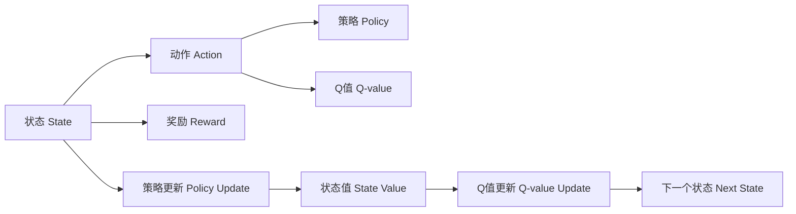

                 

## 1. 背景介绍

在人工智能飞速发展的当下，强化学习（Reinforcement Learning, RL）作为一个重要的研究方向，正逐渐展露出其在多个领域中的巨大潜力。AI Q-learning作为强化学习的一个分支，其研究成果不仅在理论层面得到了丰富的拓展，也在实际应用中得到了广泛的应用，包括游戏AI、机器人控制、金融交易等领域。本文旨在深入浅出地介绍AI Q-learning的核心概念、算法原理、实施步骤、应用领域以及最新研究动态，并结合具体案例进行讲解，旨在为读者提供更为全面、深入的理解。

## 2. 核心概念与联系

### 2.1 核心概念概述

**Q-learning**是强化学习中的一种基于值估计的策略学习算法，其基本思想是通过与环境的交互，学习一个策略使得代理能够在特定环境中获得最优奖励。Q-learning的核心概念包括：
- **状态**(State)：描述环境状态的变量，可以是物理状态、游戏规则等。
- **动作**(Action)：代理在当前状态下可能采取的行动，通常为离散或连续动作。
- **奖励**(Reward)：代理在执行某个动作后从环境中获得反馈，通常为正数或负数。
- **策略**(Policy)：代理在给定状态下采取动作的规则。
- **Q值**(Q-value)：动作-状态对预期的长期奖励，是Q-learning算法中的关键概念。

### 2.2 核心概念原理和架构的 Mermaid 流程图



**Q值**的计算公式为：
$$
Q(s,a) = r + \gamma \max_a Q(s',a')
$$
其中，$r$ 为即时奖励，$\gamma$ 为折扣因子，$s'$ 为下一个状态，$a'$ 为在$s'$状态下选择的最优动作。

Q-learning通过不断迭代更新Q值，以寻找最优策略。具体流程如下：
1. 初始化Q值。
2. 在当前状态下选择动作，并执行。
3. 根据即时奖励和下一个状态的Q值计算当前状态的Q值。
4. 更新策略，即以Q值为指导，调整策略，使其尽可能接近最优策略。

## 3. 核心算法原理 & 具体操作步骤

### 3.1 算法原理概述

Q-learning算法的核心在于通过不断估计和更新Q值，学习一个最优的策略。其基本思想是：在给定状态下，选择动作使得未来的奖励最大。算法通过与环境的交互，逐步学习最优策略，并通过值迭代法更新Q值。

### 3.2 算法步骤详解

1. **初始化**：设定状态数目 $n$、动作数目 $m$、学习率 $\alpha$、折扣因子 $\gamma$。
2. **状态值初始化**：随机初始化每个状态 $s$ 对应的Q值，即 $Q(s,a) = 0$。
3. **迭代更新**：对于每个状态 $s$，计算下一个状态 $s'$ 的最优动作 $a'$ 的Q值，并通过即时奖励和折扣因子更新当前状态 $s$ 的Q值。
4. **策略更新**：根据当前状态 $s$ 的Q值，选择动作 $a$，更新策略。
5. **终止条件**：当所有状态-动作对的Q值收敛或达到预设迭代次数，算法终止。

### 3.3 算法优缺点

**优点**：
- 算法简单，易于实现。
- 收敛性好，能够在有限的时间内收敛到最优策略。
- 能够处理大型状态空间和连续动作空间。

**缺点**：
- 可能陷入局部最优解，因为Q值估计可能不准确。
- 计算量大，特别是在高维状态空间中。
- 对初值敏感，初始值的不同可能导致不同的收敛结果。

### 3.4 算法应用领域

Q-learning算法在以下几个领域有广泛的应用：
- 游戏AI：如《星际争霸》《阿肯拉德》等。
- 机器人控制：如自动驾驶、无人机控制等。
- 金融交易：如股票交易、高频交易等。
- 工业自动化：如机床控制、机器人路径规划等。

## 4. 数学模型和公式 & 详细讲解 & 举例说明

### 4.1 数学模型构建

Q-learning的数学模型基于Markov决策过程（Markov Decision Process, MDP）。MDP由状态集合 $S$、动作集合 $A$、状态转移概率 $P(s'|s,a)$、奖励函数 $R(s,a)$ 和折扣因子 $\gamma$ 组成。MDP的表示为 $(S, A, P, R, \gamma)$。

### 4.2 公式推导过程

Q-learning的核心公式为Q值的更新公式：
$$
Q(s,a) \leftarrow Q(s,a) + \alpha [R + \gamma \max_a Q(s',a') - Q(s,a)]
$$
其中 $\alpha$ 为学习率，$R$ 为即时奖励。

### 4.3 案例分析与讲解

以《星际争霸》为例，假设当前状态为游戏地图的状态，动作为单位移动的方向。当执行某个动作后，游戏地图会变化，同时获得即时奖励。Q-learning通过不断估计和更新Q值，学习最优的单位移动策略，以最大化游戏胜利的奖励。

## 5. 项目实践：代码实例和详细解释说明

### 5.1 开发环境搭建

使用Python的Reinforcement Learning库（如Gym），在Anaconda环境中搭建开发环境。

```bash
conda create -n reinforcement-env python=3.8
conda activate reinforcement-env
pip install gym numpy matplotlib
```

### 5.2 源代码详细实现

以下是一个简单的Q-learning示例，用于控制机器人在网格世界中移动：

```python
import gym
import numpy as np

env = gym.make('Gridworld-v0')
state_dim = env.observation_space.shape[0]
action_dim = env.action_space.n

# 初始化Q值
Q = np.zeros((state_dim, action_dim))

# 设置参数
alpha = 0.1  # 学习率
gamma = 0.9  # 折扣因子
epsilon = 0.1  # 探索率

# 迭代更新
for episode in range(1000):
    state = env.reset()
    done = False
    
    while not done:
        # 探索和利用
        if np.random.rand() < epsilon:
            action = env.action_space.sample()
        else:
            action = np.argmax(Q[state, :])
        
        next_state, reward, done, _ = env.step(action)
        
        # 更新Q值
        Q[state, action] += alpha * (reward + gamma * np.max(Q[next_state, :]) - Q[state, action])
        
        state = next_state

print(Q)
```

### 5.3 代码解读与分析

该代码实现了一个简单的Q-learning算法，用于控制机器人在Gridworld环境中移动。具体流程如下：
1. 创建Gridworld环境，并获取状态维度和动作维度。
2. 初始化Q值，设定学习率、折扣因子和探索率。
3. 对于每个状态，根据探索策略选择动作，执行并更新Q值。
4. 当某一状态不可行时，跳出循环。

该代码展示了Q-learning算法的核心流程：
- 状态值的估计和更新。
- 动作的选择（探索与利用）。
- 参数的设定。

## 6. 实际应用场景

### 6.1 游戏AI

在《星际争霸》等游戏中，Q-learning算法被广泛应用于玩家控制。通过不断的学习和训练，玩家可以在游戏中实现自动化的最优策略，从而在比赛中取得更好的成绩。

### 6.2 机器人控制

在机器人路径规划和自动驾驶中，Q-learning算法可以用于优化机器人的行为策略。通过不断试错和优化，机器人可以在复杂的环境中实现自主导航。

### 6.3 金融交易

在金融市场中，Q-learning算法可以用于股票交易策略的优化。通过学习最优的交易策略，能够在市场波动中实现稳定的盈利。

### 6.4 未来应用展望

Q-learning算法在未来的发展方向包括：
- 多智能体学习：将多个智能体进行协作或竞争，优化集体决策。
- 分布式Q-learning：在分布式环境中进行Q值估计和策略更新，提升计算效率。
- 深度Q网络（DQN）：结合深度神经网络，处理高维状态空间和连续动作空间。

## 7. 工具和资源推荐

### 7.1 学习资源推荐

- **《强化学习：理论、算法与应用》**：提供了强化学习的基本理论、算法和应用，适合初学者。
- **《深度强化学习》**：深入探讨了深度学习与强化学习的结合，适合进阶学习。
- **Reinforcement Learning on Coursera**：斯坦福大学开设的强化学习课程，涵盖强化学习的核心概念和算法。

### 7.2 开发工具推荐

- **Gym**：一个简单易用的Reinforcement Learning库，提供了大量的环境模拟和测试工具。
- **TensorFlow**：谷歌开源的深度学习框架，支持分布式计算，适合处理大规模数据。
- **PyTorch**：Facebook开源的深度学习框架，支持动态图和静态图，适合快速迭代研究。

### 7.3 相关论文推荐

- **Human-level Control through Deep Reinforcement Learning**：提出DQN算法，结合深度神经网络进行状态值估计。
- **Playing Atari with Deep Reinforcement Learning**：提出DQN算法，实现Atari游戏的自动玩法。
- **Q-learning for Resource Allocation in Cloud Computing**：提出基于Q-learning的云资源分配算法，优化资源利用率。

## 8. 总结：未来发展趋势与挑战

### 8.1 研究成果总结

Q-learning算法在强化学习领域取得了丰硕的成果，广泛应用于多个领域，并通过不断优化和改进，取得了新的突破。

### 8.2 未来发展趋势

- 多智能体学习和分布式Q-learning：增强合作和竞争能力的模型，进一步提升复杂环境中的决策能力。
- 深度Q网络和神经网络结合：处理高维状态空间和连续动作空间，提升模型的泛化能力。
- 强化学习的理论研究：进一步深化对强化学习基本原理的理解，提出新的算法和模型。

### 8.3 面临的挑战

- 算法复杂性：多智能体学习和深度Q网络等复杂模型增加了计算量和资源消耗。
- 训练稳定性：大规模数据和复杂模型可能导致训练过程的不稳定性。
- 环境变化：环境中的随机性和不确定性增加了模型的鲁棒性挑战。

### 8.4 研究展望

- 提升学习效率：通过优化算法和模型结构，提升学习和训练的效率。
- 提高模型泛化能力：增强模型的泛化能力，使其能够适应更多复杂和多样化的环境。
- 提升模型的可解释性：通过引入因果分析和博弈论等工具，提升模型的可解释性和可控性。

## 9. 附录：常见问题与解答

**Q1: 如何选择合适的学习率？**

A: 学习率的选择需要考虑多个因素，如环境复杂度、动作空间大小、探索策略等。通常采用学习率衰减策略，从大到小逐步减小，以避免过拟合。

**Q2: 如何缓解Q-learning算法中的探索与利用矛盾？**

A: 可以使用ε-贪心策略，在一定概率下随机探索，其他概率下选择当前Q值最大的动作。同时，可以通过增加学习率或调整折扣因子来平衡探索与利用。

**Q3: 如何在多智能体系统中应用Q-learning？**

A: 可以使用分布式Q-learning或Q值共享的方法，将多智能体的状态值估计和策略更新分布式执行，提升计算效率。

**Q4: 如何在连续动作空间中使用Q-learning？**

A: 可以使用深度Q网络（DQN），结合深度神经网络处理连续动作空间，提升模型的表现力。

本文通过深入浅出的讲解，对AI Q-learning的核心概念、算法原理、实施步骤、应用领域以及最新研究动态进行了全面阐述，并通过具体案例和代码实例进行了讲解。相信读者通过本文的学习，能够更好地理解Q-learning算法，并将其应用于实际问题中，推动人工智能技术的发展。

---

作者：禅与计算机程序设计艺术 / Zen and the Art of Computer Programming

