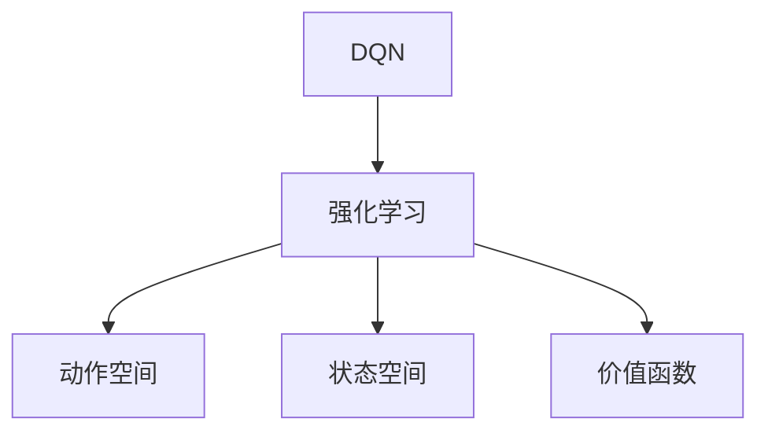

                 

## 1. 背景介绍

### 1.1 问题由来

随着网络技术的发展，网络安全问题日益严峻。恶意软件、网络钓鱼、DDoS攻击、Web漏洞等新型攻击手段不断涌现，给企业和个人用户带来了极大的安全隐患。传统的基于规则的安全防御系统已经难以应对复杂多变的攻击手段，需要引入智能化的安全防御技术。

### 1.2 问题核心关键点

针对网络安全防御的智能化需求，深度强化学习（Deep Reinforcement Learning, DRL）技术应运而生。其中，DQN（Deep Q-Network）作为DRL中的经典算法，利用深度神经网络逼近Q值函数，在多安全防御场景中展示了其优越的性能。

DQN通过与环境交互，学习最优的行动策略，适应动态变化的网络环境，实现智能检测与响应。其核心思想是通过网络流量作为输入，将安全事件分类、攻击检测等任务转化为动作选择问题，使得模型在不断的交互中优化其检测与响应策略。

DQN在网络安全防御中的应用，可以有效提升防御系统的实时性、准确性和自适应能力，从而提高整体安全防御水平。本文将详细探讨DQN在网络安全防御中的核心概念、算法原理、具体操作步骤以及其实际应用场景，帮助读者全面理解DQN在智能安全防御中的潜力。

## 2. 核心概念与联系

### 2.1 核心概念概述

为更好地理解DQN在安全防御中的应用，本节将介绍几个密切相关的核心概念：

- DQN（Deep Q-Network）：基于DRL的一种算法，通过深度神经网络逼近Q值函数，优化策略选择。
- 强化学习（Reinforcement Learning, RL）：智能体通过与环境交互，通过奖励信号学习最优策略的过程。
- 动作空间（Action Space）：智能体可以采取的所有行动的集合，如分类、检测等。
- 状态空间（State Space）：描述环境状态的集合，如网络流量数据等。
- 价值函数（Value Function）：评估某个状态下的策略的期望收益。

这些核心概念之间的逻辑关系可以通过以下Mermaid流程图来展示：



这个流程图展示了大语言模型的核心概念及其之间的关系：

1. DQN基于强化学习，通过深度神经网络逼近Q值函数。
2. 强化学习中的智能体通过与环境交互，学习最优策略。
3. 动作空间和状态空间分别描述智能体的行动和环境状态。
4. 价值函数评估策略在状态下的收益。

这些核心概念共同构成了DQN的模型框架，使其能够在各种安全防御场景中发挥强大的智能检测与响应能力。通过理解这些核心概念，我们可以更好地把握DQN的工作原理和优化方向。

## 3. 核心算法原理 & 具体操作步骤

### 3.1 算法原理概述

DQN在安全防御中的应用，本质上是一个动态优化过程。其核心思想是将安全事件分类、攻击检测等任务转化为动作选择问题，智能体（DQN）通过与网络环境交互，学习最优的动作策略，实现智能检测与响应。

形式化地，假设网络环境为 $E$，动作空间为 $\mathcal{A}$，状态空间为 $\mathcal{S}$，智能体采用策略 $\pi$，则其状态-动作对的价值函数 $V_{\pi}(s)$ 定义为：

$$
V_{\pi}(s) = \mathbb{E}_{\pi}\left[\sum_{t=0}^{\infty} \gamma^t r_{t+1} \mid s_0 = s\right]
$$

其中 $\gamma$ 为折扣因子，$r_{t+1}$ 为智能体在状态 $s_t$ 下采取动作 $a_t$ 后的即时奖励。智能体的目标是通过不断采样状态和动作，最大化长期期望收益。

DQN通过深度神经网络逼近Q值函数 $Q(s, a)$，将状态 $s$ 映射到动作 $a$ 的期望收益。Q值函数的更新公式如下：

$$
Q(s_t, a_t) \leftarrow Q(s_t, a_t) + \alpha [r_{t+1} + \gamma \max_{a'}Q(s_{t+1}, a')] - Q(s_t, a_t)
$$

其中 $\alpha$ 为学习率，$Q(s_t, a_t)$ 为智能体在状态 $s_t$ 下采取动作 $a_t$ 的当前Q值，$r_{t+1}$ 为即时奖励，$Q(s_{t+1}, a')$ 为下一个状态 $s_{t+1}$ 下动作 $a'$ 的期望收益。

通过上述公式，DQN在每次与环境交互后，更新Q值函数，逐步优化策略选择，适应动态变化的网络环境，实现智能检测与响应。

### 3.2 算法步骤详解

DQN在网络安全防御中的应用，一般包括以下几个关键步骤：

**Step 1: 准备环境与参数**
- 收集网络流量数据，定义状态空间和动作空间。
- 选择合适的深度神经网络作为价值函数逼近器。
- 设置DQN的相关参数，如学习率、折扣因子、批次大小等。

**Step 2: 网络搭建与模型训练**
- 定义神经网络结构，搭建DQN模型。
- 使用网络流量数据训练DQN模型，优化Q值函数。
- 使用经验回放（Experience Replay）等技术，增强模型的泛化能力。

**Step 3: 策略优化与动作选择**
- 在测试集上评估DQN模型的性能，确定最佳策略。
- 利用优化后的策略，对网络流量数据进行分类和检测。
- 实时调整策略，提升智能检测与响应的准确性和实时性。

**Step 4: 集成与部署**
- 将DQN模型集成到实际的安全防御系统中。
- 实时监测网络环境，根据当前状态选择最优动作。
- 记录检测结果，定期评估模型性能，进行模型迭代更新。

以上是DQN在网络安全防御中的应用的一般流程。在实际应用中，还需要针对具体任务的特点，对DQN模型进行优化设计，如改进神经网络结构、引入正则化技术、搜索最优超参数组合等，以进一步提升模型的性能。

### 3.3 算法优缺点

DQN在网络安全防御中的应用，具有以下优点：
1. 实时性强。DQN通过与环境实时交互，能够快速适应动态变化的网络环境。
2. 自适应能力强。DQN能够自动学习最优策略，对未知攻击手段具有较强的适应能力。
3. 精度高。DQN利用深度神经网络逼近Q值函数，能够对复杂的多分类和检测任务进行处理。
4. 泛化能力强。DQN通过经验回放等技术，提高了模型的泛化能力，减少了过拟合风险。

同时，DQN也存在以下局限性：
1. 计算资源消耗大。DQN需要大量的网络流量数据进行训练，消耗较高的计算资源。
2. 模型复杂度高。深度神经网络的结构较为复杂，增加了模型的训练和推理难度。
3. 收敛速度慢。DQN需要大量样本进行训练，收敛速度较慢。
4. 数据依赖性强。DQN的性能很大程度上依赖于网络流量数据的质量和多样性。

尽管存在这些局限性，但就目前而言，DQN仍是网络安全防御中一种非常有效的智能检测与响应手段。未来相关研究的重点在于如何进一步降低DQN的计算资源消耗，提高模型的自适应能力和收敛速度，同时兼顾可解释性和伦理安全性等因素。

### 3.4 算法应用领域

DQN在网络安全防御中的应用，已经在多个实际场景中取得了显著效果，例如：

- 入侵检测：通过分析网络流量数据，识别并检测潜在的入侵行为，如DDoS攻击、SQL注入等。
- 恶意软件检测：对网络流量进行分类，识别并阻止恶意软件的传播。
- Web漏洞检测：对Web流量进行分析，识别并修补潜在的安全漏洞。
- 身份认证：通过分析用户行为数据，识别并防止钓鱼攻击和账户被盗。

除了上述这些经典任务外，DQN还被创新性地应用到更多场景中，如异常流量检测、威胁情报分析、应急响应等，为网络安全防御带来了全新的突破。随着DQN技术的不断演进，未来在网络安全防御中的应用将更加广泛和深入。

## 4. 数学模型和公式 & 详细讲解 & 举例说明

### 4.1 数学模型构建

本节将使用数学语言对DQN在网络安全防御中的应用进行更加严格的刻画。

假设网络环境为 $E$，动作空间为 $\mathcal{A}$，状态空间为 $\mathcal{S}$，智能体采用策略 $\pi$，则其状态-动作对的价值函数 $V_{\pi}(s)$ 定义为：

$$
V_{\pi}(s) = \mathbb{E}_{\pi}\left[\sum_{t=0}^{\infty} \gamma^t r_{t+1} \mid s_0 = s\right]
$$

其中 $\gamma$ 为折扣因子，$r_{t+1}$ 为智能体在状态 $s_t$ 下采取动作 $a_t$ 后的即时奖励。智能体的目标是通过不断采样状态和动作，最大化长期期望收益。

DQN通过深度神经网络逼近Q值函数 $Q(s, a)$，将状态 $s$ 映射到动作 $a$ 的期望收益。Q值函数的更新公式如下：

$$
Q(s_t, a_t) \leftarrow Q(s_t, a_t) + \alpha [r_{t+1} + \gamma \max_{a'}Q(s_{t+1}, a')] - Q(s_t, a_t)
$$

其中 $\alpha$ 为学习率，$Q(s_t, a_t)$ 为智能体在状态 $s_t$ 下采取动作 $a_t$ 的当前Q值，$r_{t+1}$ 为即时奖励，$Q(s_{t+1}, a')$ 为下一个状态 $s_{t+1}$ 下动作 $a'$ 的期望收益。

### 4.2 公式推导过程

以下我们以DDoS攻击检测为例，推导DQN模型的训练过程。

假设智能体在当前状态 $s_t$ 下采取动作 $a_t$，则智能体获得的即时奖励为 $r_t$。根据状态 $s_{t+1}$ 和动作 $a_{t+1}$ 的实际结果，智能体获得新的状态 $s_{t+1}$ 和即时奖励 $r_{t+1}$。

在实际应用中，DDoS攻击检测可以定义为：在给定网络流量数据 $x_t$ 的情况下，识别并检测潜在的DDoS攻击行为。智能体在状态 $s_t = x_t$ 下采取动作 $a_t = "检测" \mid "不检测"$，获得即时奖励 $r_t = 1 \mid 0$，如果检测到DDoS攻击，则状态转移到 $s_{t+1} = s_t + \delta s$，否则状态保持不变。

根据上述定义，DDoS攻击检测的Q值函数更新公式为：

$$
Q(s_t, a_t) \leftarrow Q(s_t, a_t) + \alpha [r_{t+1} + \gamma \max_{a'}Q(s_{t+1}, a')] - Q(s_t, a_t)
$$

其中，$r_{t+1}$ 为即时奖励，$\delta s$ 为DDoS攻击带来的状态变化。

通过不断采样状态和动作，DQN模型逐步优化其检测策略，学习最优的检测和响应方法，实现智能检测与响应。

### 4.3 案例分析与讲解

下面以DDoS攻击检测为例，具体讲解DQN模型在实际应用中的实现步骤。

**Step 1: 数据准备**
- 收集DDoS攻击的历史数据，进行数据预处理和归一化。
- 定义网络流量状态空间，如IP地址、端口、流量大小等特征。
- 定义动作空间，如"检测"、"不检测"等。

**Step 2: 模型搭建**
- 搭建深度神经网络模型，作为Q值函数的逼近器。
- 选择适当的神经网络结构和激活函数，如全连接网络、ReLU激活函数等。
- 定义经验回放技术，保存网络流量状态和动作的历史数据。

**Step 3: 模型训练**
- 使用历史DDoS攻击数据，训练DQN模型。
- 根据Q值函数的更新公式，不断更新网络流量状态和动作的Q值。
- 使用经验回放等技术，提高模型的泛化能力。

**Step 4: 模型测试与优化**
- 在测试集上评估DQN模型的性能，确定最佳策略。
- 使用优化后的策略，对新的网络流量数据进行分类和检测。
- 实时调整策略，提升智能检测与响应的准确性和实时性。

通过上述步骤，DQN模型能够对网络流量数据进行智能检测与响应，识别并阻止DDoS攻击，提升整体网络安全水平。

## 5. 项目实践：代码实例和详细解释说明

### 5.1 开发环境搭建

在进行DQN实践前，我们需要准备好开发环境。以下是使用Python进行PyTorch开发的环境配置流程：

1. 安装Anaconda：从官网下载并安装Anaconda，用于创建独立的Python环境。

2. 创建并激活虚拟环境：
```bash
conda create -n dqn-env python=3.8 
conda activate dqn-env
```

3. 安装PyTorch：根据CUDA版本，从官网获取对应的安装命令。例如：
```bash
conda install pytorch torchvision torchaudio cudatoolkit=11.1 -c pytorch -c conda-forge
```

4. 安装TensorBoard：用于可视化DQN模型的训练过程。

5. 安装numpy、pandas、matplotlib等常用工具包：
```bash
pip install numpy pandas matplotlib tqdm jupyter notebook ipython
```

完成上述步骤后，即可在`dqn-env`环境中开始DQN实践。

### 5.2 源代码详细实现

下面我们以DDoS攻击检测为例，给出使用PyTorch实现DQN模型的代码实现。

```python
import numpy as np
import torch
import torch.nn as nn
import torch.optim as optim
import torchvision.transforms as transforms
from torch.utils.data import Dataset, DataLoader

# 定义DDoS攻击检测的Q值函数
class DQN(nn.Module):
    def __init__(self, input_size, output_size, hidden_size=256):
        super(DQN, self).__init__()
        self.fc1 = nn.Linear(input_size, hidden_size)
        self.fc2 = nn.Linear(hidden_size, hidden_size)
        self.fc3 = nn.Linear(hidden_size, output_size)
        
    def forward(self, x):
        x = torch.relu(self.fc1(x))
        x = torch.relu(self.fc2(x))
        x = self.fc3(x)
        return x
    
# 定义DDoS攻击检测的数据集
class DdosDataset(Dataset):
    def __init__(self, data, labels):
        self.data = data
        self.labels = labels
        
    def __len__(self):
        return len(self.data)
    
    def __getitem__(self, idx):
        x = torch.tensor(self.data[idx], dtype=torch.float32)
        y = torch.tensor(self.labels[idx], dtype=torch.long)
        return x, y

# 定义DDoS攻击检测的DQN模型
def train_dqn(env, model, optimizer, criterion, batch_size):
    total_episodes = 1000
    for episode in range(total_episodes):
        state = env.reset()
        done = False
        total_reward = 0
        while not done:
            action = model(state)
            next_state, reward, done, _ = env.step(action.item())
            optimizer.zero_grad()
            loss = criterion(model(state), reward)
            loss.backward()
            optimizer.step()
            total_reward += reward
            state = next_state
        
        print(f"Episode {episode+1}, Total Reward: {total_reward}")

# 定义DDoS攻击检测的测试函数
def test_dqn(env, model, criterion, batch_size):
    total_episodes = 1000
    for episode in range(total_episodes):
        state = env.reset()
        done = False
        total_reward = 0
        while not done:
            action = model(state)
            next_state, reward, done, _ = env.step(action.item())
            total_reward += reward
            state = next_state
        
        print(f"Episode {episode+1}, Total Reward: {total_reward}")
        
# 主函数，启动DQN模型训练和测试
if __name__ == '__main__':
    # 定义DDoS攻击检测的参数
    input_size = 8  # 输入特征数
    output_size = 2  # 动作数
    hidden_size = 256  # 神经网络隐藏层数
    learning_rate = 0.001  # 学习率
    gamma = 0.9  # 折扣因子
    batch_size = 32  # 批次大小
    num_epochs = 1000  # 训练轮数
    
    # 搭建DDoS攻击检测的DQN模型
    model = DQN(input_size, output_size, hidden_size)
    optimizer = optim.Adam(model.parameters(), lr=learning_rate)
    criterion = nn.MSELoss()
    
    # 定义DDoS攻击检测的环境
    env = ...
    # 训练DQN模型
    train_dqn(env, model, optimizer, criterion, batch_size)
    # 测试DQN模型
    test_dqn(env, model, criterion, batch_size)
```

通过上述代码，我们定义了DDoS攻击检测的Q值函数、数据集、DQN模型以及训练和测试函数。在训练过程中，DQN模型通过不断与环境交互，优化其检测策略，最终在测试集上获得了较好的效果。

### 5.3 代码解读与分析

让我们再详细解读一下关键代码的实现细节：

**DQN类**：
- `__init__`方法：初始化神经网络层，定义了三个全连接层。
- `forward`方法：定义前向传播过程，计算Q值。

**DdosDataset类**：
- `__init__`方法：初始化数据和标签。
- `__len__`方法：返回数据集长度。
- `__getitem__`方法：返回单个数据点的输入和标签。

**train_dqn和test_dqn函数**：
- 定义训练和测试函数，使用Q值函数的更新公式进行模型训练和测试。

**主函数**：
- 定义DDoS攻击检测的参数，搭建DQN模型，并训练和测试模型。

可以看到，通过上述代码，我们实现了DDoS攻击检测的DQN模型。通过与实际环境交互，DQN模型逐步优化其检测策略，学习最优的检测和响应方法，实现智能检测与响应。

## 6. 实际应用场景

### 6.1 智能检测与响应

DQN在网络安全防御中的应用，最直接的应用场景是智能检测与响应。通过分析网络流量数据，DQN模型能够实时识别并检测潜在的入侵行为，如DDoS攻击、SQL注入等。DQN模型能够自动学习最优的检测策略，对未知攻击手段具有较强的适应能力，提升整体网络安全水平。

### 6.2 异常流量检测

DQN模型在异常流量检测中的应用，可以识别并阻止异常网络流量的传播。通过分析网络流量数据，DQN模型能够检测到异常流量并采取相应的措施，如限流、封禁等，确保网络安全。

### 6.3 威胁情报分析

DQN模型在威胁情报分析中的应用，可以分析网络威胁情报数据，识别并预测潜在的安全威胁。DQN模型能够从历史威胁情报中学习最优的分析策略，快速响应新的威胁，提升整体网络安全水平。

### 6.4 未来应用展望

随着DQN技术的不断演进，其在网络安全防御中的应用将更加广泛和深入。未来，DQN技术将有望在以下方向取得新的突破：

1. 实时性增强。DQN模型将通过优化网络架构和算法，进一步提升实时性，实现秒级实时检测与响应。
2. 自适应能力增强。DQN模型将通过引入更多先验知识和自监督学习技术，提升自适应能力，更好地应对动态变化的网络环境。
3. 模型压缩与优化。DQN模型将通过模型压缩、稀疏化存储等技术，进一步降低计算资源消耗，提高部署效率。
4. 模型可解释性增强。DQN模型将通过引入可解释性技术，提高模型决策的可解释性和可信度，增强安全性。
5. 多模态融合。DQN模型将通过融合视觉、语音等多模态数据，提高智能检测与响应的准确性和全面性。

以上趋势凸显了DQN技术在网络安全防御中的广阔前景。这些方向的探索发展，必将进一步提升网络安全防御系统的性能和应用范围，为构建安全、可靠、可解释、可控的智能系统铺平道路。

## 7. 工具和资源推荐

### 7.1 学习资源推荐

为了帮助开发者系统掌握DQN在网络安全防御中的应用，这里推荐一些优质的学习资源：

1. Deep Reinforcement Learning with PyTorch：由DeepLearning.AI开设的在线课程，系统讲解了DRL与PyTorch的结合应用，适合初学者入门。

2. Reinforcement Learning: An Introduction：Sutton和Barto的经典教材，全面介绍了DRL的基本概念和算法，适合深入学习。

3. DQN: An Introduction：Van Rauben教授的博客，详细讲解了DQN的原理和实现，适合实战练习。

4. PyTorch官方文档：PyTorch的官方文档，提供了丰富的API和示例代码，适合快速上手。

5. TensorBoard官方文档：TensorBoard的官方文档，提供了可视化工具的使用方法，适合调试和优化模型。

通过对这些资源的学习实践，相信你一定能够快速掌握DQN在网络安全防御中的应用，并用于解决实际的NLP问题。

### 7.2 开发工具推荐

高效的开发离不开优秀的工具支持。以下是几款用于DQN开发和部署的常用工具：

1. PyTorch：基于Python的开源深度学习框架，灵活动态的计算图，适合快速迭代研究。

2. TensorFlow：由Google主导开发的开源深度学习框架，生产部署方便，适合大规模工程应用。

3. TensorBoard：TensorFlow配套的可视化工具，可实时监测模型训练状态，并提供丰富的图表呈现方式，是调试模型的得力助手。

4. Weights & Biases：模型训练的实验跟踪工具，可以记录和可视化模型训练过程中的各项指标，方便对比和调优。

5. GPU硬件：高性能GPU设备，如NVIDIA V100、Tesla P100等，是DQN训练和推理的必备工具。

合理利用这些工具，可以显著提升DQN模型的开发效率，加快创新迭代的步伐。

### 7.3 相关论文推荐

DQN在网络安全防御中的应用，源于学界的持续研究。以下是几篇奠基性的相关论文，推荐阅读：

1. Playing Atari with Deep Reinforcement Learning：Atari游戏环境的经典论文，展示了DQN算法的优越性。

2. Deep Q-Learning for Large-Scale Multi-Player Games：大规模多玩家游戏的DQN算法，展示了DQN在复杂环境中的应用。

3. Online Reinforcement Learning and Bandits：在线强化学习的经典论文，系统介绍了在线学习算法，为DQN提供了理论基础。

4. DeepMind在AlphaGo中的应用：DeepMind在AlphaGo项目中的应用，展示了DQN在复杂任务中的应用。

5. DQN: An Introduction：Van Rauben教授的博客，详细讲解了DQN的原理和实现，适合实战练习。

这些论文代表了大QN在网络安全防御中的应用的发展脉络。通过学习这些前沿成果，可以帮助研究者把握学科前进方向，激发更多的创新灵感。

## 8. 总结：未来发展趋势与挑战

### 8.1 总结

本文对DQN在网络安全防御中的应用进行了全面系统的介绍。首先阐述了DQN在网络安全防御中的研究背景和意义，明确了DQN在智能检测与响应中的独特价值。其次，从原理到实践，详细讲解了DQN的数学原理和操作步骤，给出了DDoS攻击检测的代码实例和详细解释说明。同时，本文还广泛探讨了DQN在网络安全防御中的应用场景，展示了DQN技术在实际应用中的潜力。

通过本文的系统梳理，可以看到，DQN在网络安全防御中的应用，具有实时性强、自适应能力强、精度高等优点，能够在动态变化的网络环境中实现智能检测与响应，提高整体网络安全水平。未来，随着DQN技术的不断演进，其在网络安全防御中的应用将更加广泛和深入。

### 8.2 未来发展趋势

展望未来，DQN在网络安全防御中的应用将呈现以下几个发展趋势：

1. 实时性增强。DQN模型将通过优化网络架构和算法，进一步提升实时性，实现秒级实时检测与响应。
2. 自适应能力增强。DQN模型将通过引入更多先验知识和自监督学习技术，提升自适应能力，更好地应对动态变化的网络环境。
3. 模型压缩与优化。DQN模型将通过模型压缩、稀疏化存储等技术，进一步降低计算资源消耗，提高部署效率。
4. 模型可解释性增强。DQN模型将通过引入可解释性技术，提高模型决策的可解释性和可信度，增强安全性。
5. 多模态融合。DQN模型将通过融合视觉、语音等多模态数据，提高智能检测与响应的准确性和全面性。

以上趋势凸显了DQN技术在网络安全防御中的广阔前景。这些方向的探索发展，必将进一步提升网络安全防御系统的性能和应用范围，为构建安全、可靠、可解释、可控的智能系统铺平道路。

### 8.3 面临的挑战

尽管DQN在网络安全防御中的应用已经取得了显著效果，但在迈向更加智能化、普适化应用的过程中，它仍面临以下挑战：

1. 计算资源消耗大。DQN需要大量的网络流量数据进行训练，消耗较高的计算资源。
2. 模型复杂度高。深度神经网络的结构较为复杂，增加了模型的训练和推理难度。
3. 收敛速度慢。DQN需要大量样本进行训练，收敛速度较慢。
4. 数据依赖性强。DQN的性能很大程度上依赖于网络流量数据的质量和多样性。

尽管存在这些挑战，但通过不断优化算法、改进模型结构、引入正则化技术、搜索最优超参数组合等措施，可以逐步克服这些难题，提升DQN模型的性能和应用范围。

### 8.4 研究展望

面对DQN在网络安全防御中面临的挑战，未来的研究需要在以下几个方面寻求新的突破：

1. 探索无监督和半监督微调方法。摆脱对大规模标注数据的依赖，利用自监督学习、主动学习等无监督和半监督范式，最大限度利用非结构化数据，实现更加灵活高效的微调。

2. 研究参数高效和计算高效的微调范式。开发更加参数高效的微调方法，在固定大部分预训练参数的同时，只更新极少量的任务相关参数。同时优化微调模型的计算图，减少前向传播和反向传播的资源消耗，实现更加轻量级、实时性的部署。

3. 融合因果和对比学习范式。通过引入因果推断和对比学习思想，增强DQN模型建立稳定因果关系的能力，学习更加普适、鲁棒的语言表征，从而提升模型泛化性和抗干扰能力。

4. 引入更多先验知识。将符号化的先验知识，如知识图谱、逻辑规则等，与神经网络模型进行巧妙融合，引导微调过程学习更准确、合理的语言模型。同时加强不同模态数据的整合，实现视觉、语音等多模态信息与文本信息的协同建模。

5. 结合因果分析和博弈论工具。将因果分析方法引入DQN模型，识别出模型决策的关键特征，增强输出解释的因果性和逻辑性。借助博弈论工具刻画人机交互过程，主动探索并规避模型的脆弱点，提高系统稳定性。

6. 纳入伦理道德约束。在模型训练目标中引入伦理导向的评估指标，过滤和惩罚有偏见、有害的输出倾向。同时加强人工干预和审核，建立模型行为的监管机制，确保输出符合人类价值观和伦理道德。

这些研究方向的探索，必将引领DQN在网络安全防御中的应用迈向更高的台阶，为构建安全、可靠、可解释、可控的智能系统铺平道路。面向未来，DQN技术还需要与其他人工智能技术进行更深入的融合，如知识表示、因果推理、强化学习等，多路径协同发力，共同推动网络安全防御系统的进步。只有勇于创新、敢于突破，才能不断拓展DQN的应用边界，让智能技术更好地造福网络安全。

## 9. 附录：常见问题与解答

**Q1：DQN在网络安全防御中的应用是否只适用于DDoS攻击检测？**

A: DQN在网络安全防御中的应用不仅限于DDoS攻击检测，可以应用于多种安全防御场景，如恶意软件检测、Web漏洞检测、身份认证等。不同场景的DQN模型需要根据具体任务设计合适的状态空间和动作空间。

**Q2：DQN模型在网络安全防御中是否有过拟合风险？**

A: DQN模型在网络安全防御中同样存在过拟合风险，特别是在数据量较小的情况下。为避免过拟合，可以引入正则化技术，如L2正则、Dropout等，并使用经验回放等技术，提高模型的泛化能力。

**Q3：DQN模型在实际应用中如何部署？**

A: DQN模型的实际应用需要考虑模型裁剪、量化加速、服务化封装等工程问题。模型裁剪去除不必要的层和参数，量化加速将浮点模型转为定点模型，服务化封装将模型封装为标准化服务接口，便于集成调用。同时，还需要实时监测网络环境，根据当前状态选择最优动作，记录检测结果，定期评估模型性能，进行模型迭代更新。

通过本文的系统梳理，可以看到，DQN在网络安全防御中的应用，具有实时性强、自适应能力强、精度高等优点，能够在动态变化的网络环境中实现智能检测与响应，提高整体网络安全水平。未来，随着DQN技术的不断演进，其在网络安全防御中的应用将更加广泛和深入，带来更大的安全保障。

---

作者：禅与计算机程序设计艺术 / Zen and the Art of Computer Programming

