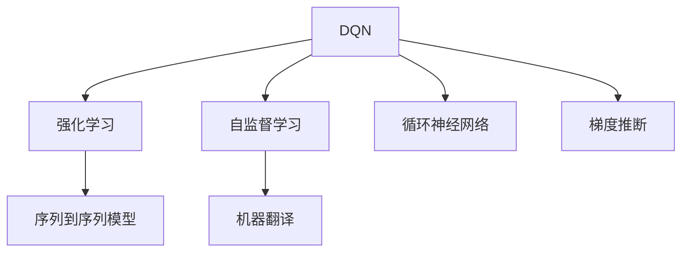

                 

# 一切皆是映射：DQN在机器翻译领域的应用：潜力与挑战

> 关键词：深度强化学习, 机器翻译, 循环神经网络, 梯度推断, 自监督学习

## 1. 背景介绍

### 1.1 问题由来
深度学习(DL)技术的迅猛发展，为自然语言处理(NLP)领域带来了革命性的变化。特别是自2014年Google提出的序列到序列(Sequence-to-Sequence, Seq2Seq)模型以来，机器翻译(MT)在准确度和流畅度方面取得了显著提升。然而，Seq2Seq模型仍存在一些问题，如训练时间长、难优化、泛化能力弱等。

为克服这些问题，近年来，基于深度强化学习(Deep Reinforcement Learning, DRL)的机器翻译模型逐渐进入人们的视野。其中，深度Q网络(Deep Q-Network, DQN)以其自监督、自适应、无需标注数据的优势，被广泛用于自然语言处理领域，为机器翻译技术带来了新的可能性。

### 1.2 问题核心关键点
DQN在机器翻译中的应用，主要体现在以下几个方面：

- **自监督学习**：DQN通过与环境交互，自监督地学习最优翻译策略，无需大量标注数据。
- **强化学习**：DQN通过奖惩机制，不断优化翻译策略，提升模型效果。
- **序列建模**：DQN利用循环神经网络(RNN)等序列建模技术，适应语言序列的特点。
- **梯度推断**：DQN通过重放缓冲区(replay buffer)进行梯度推断，提升模型学习效率。
- **模型并行**：DQN适合模型并行，可并行训练多个翻译模型，提高训练速度。

这些特性使得DQN在机器翻译中具有潜在的优势，但也面临着诸多挑战。本文将详细介绍DQN在机器翻译领域的应用，探讨其潜力与挑战。

## 2. 核心概念与联系

### 2.1 核心概念概述

为更好地理解DQN在机器翻译中的应用，本节将介绍几个关键概念：

- **深度Q网络(DQN)**：一种基于Q-Learning的强化学习算法，通过与环境交互学习最优策略。DQN能够自监督地学习，无需大量标注数据。
- **序列到序列(Seq2Seq)模型**：一种NLP领域的经典架构，用于将一种语言的序列映射到另一种语言的序列，如机器翻译。Seq2Seq模型由编码器-解码器组成，能够捕捉长距离依赖关系。
- **强化学习(Reinforcement Learning, RL)**：一种通过与环境交互学习最优策略的学习方式，DQN即属于强化学习范畴。
- **自监督学习(Self-supervised Learning)**：一种无需标签数据，利用模型自身预测能力进行学习的方式。DQN即是一种自监督学习算法。
- **循环神经网络(RNN)**：一种能够处理序列数据的神经网络，DQN常与RNN结合使用，以捕捉语言序列的动态特性。
- **梯度推断(Gradient Descent, GD)**：通过重放缓冲区等方式，对梯度进行高效的推断计算。

这些概念之间的逻辑关系可以通过以下Mermaid流程图来展示：



这个流程图展示了大语言模型的核心概念及其之间的关系：

1. DQN通过强化学习自监督地学习最优策略。
2. DQN与RNN结合，能够适应语言序列的动态特性。
3. DQN通过梯度推断提高学习效率。
4. DQN应用于机器翻译，提升了模型的泛化能力和训练速度。
5. DQN结合自监督学习，适应无标签数据的场景。

这些概念共同构成了DQN在机器翻译中的应用框架，使其能够在各种场景下发挥强大的翻译能力。通过理解这些核心概念，我们可以更好地把握DQN的工作原理和优化方向。

## 3. 核心算法原理 & 具体操作步骤
### 3.1 算法原理概述

DQN在机器翻译中的应用，主要通过以下步骤实现：

1. **数据准备**：收集双语句对的语料库，将源语言序列映射为目标语言序列。
2. **模型构建**：构建DQN模型，包含编码器-解码器结构和Q-learning策略。
3. **训练过程**：通过与翻译任务环境的交互，利用Q-Learning算法更新策略参数，提升翻译质量。
4. **优化目标**：目标是最小化序列到序列模型的预测损失，提高翻译准确度和流畅度。

DQN模型在机器翻译中的主要贡献在于：

- **自监督学习**：DQN通过与环境交互，无需大量标注数据，降低了机器翻译的数据需求。
- **强化学习**：DQN通过奖惩机制，不断优化翻译策略，提升模型效果。
- **序列建模**：DQN利用循环神经网络等序列建模技术，适应语言序列的特点。

### 3.2 算法步骤详解

DQN在机器翻译中的应用主要分为以下三个阶段：

**阶段1：数据准备**

- **语料库收集**：从大规模语料库中提取并预处理双语文本对，保证其质量。
- **数据预处理**：将原始文本分词、标记、转换为模型所需的输入形式。
- **划分训练集和测试集**：将语料划分为训练集和测试集，便于评估模型性能。

**阶段2：模型构建**

- **编码器设计**：使用RNN或Transformer等模型，对源语言序列进行编码，提取语义信息。
- **解码器设计**：使用RNN或Transformer等模型，将编码器输出的语义信息解码为目标语言序列。
- **Q-Learning策略**：设计Q函数，评估当前策略在翻译任务中的效果。
- **目标网络设计**：利用目标网络(如DQN的目标网络)进行策略更新，保证模型的稳定性和收敛性。

**阶段3：训练过程**

- **环境交互**：将源语言序列作为输入，生成目标语言序列，得到奖惩信号。
- **策略更新**：根据奖惩信号和Q值更新策略参数，提升翻译质量。
- **参数更新**：通过优化器更新模型参数，适应新的策略。
- **状态更新**：将训练数据存储在重放缓冲区，便于梯度推断。
- **模型评估**：在测试集上评估模型性能，不断调整策略。

### 3.3 算法优缺点

DQN在机器翻译中的应用具有以下优点：

1. **自监督学习**：DQN无需大量标注数据，降低了翻译任务的成本和时间。
2. **强化学习**：DQN通过奖惩机制不断优化策略，提升翻译质量。
3. **序列建模**：DQN利用循环神经网络等序列建模技术，捕捉语言序列的特性。
4. **梯度推断**：DQN通过重放缓冲区进行梯度推断，提高学习效率。
5. **模型并行**：DQN适合模型并行，可并行训练多个翻译模型，提高训练速度。

同时，DQN也存在以下缺点：

1. **数据依赖性**：DQN的翻译质量依赖于语料库的质量和规模，小规模语料库可能导致过拟合。
2. **模型复杂度**：DQN模型通常包含大量参数，训练和推理过程较为复杂。
3. **模型收敛性**：DQN的训练过程需要大量时间，模型收敛速度较慢。
4. **模型泛化能力**：DQN的泛化能力取决于环境和策略，在特定领域或任务上表现可能不佳。
5. **计算资源需求**：DQN的训练和推理过程对计算资源要求较高，需要高性能的硬件支持。

### 3.4 算法应用领域

DQN在机器翻译中的应用领域主要包括以下几个方面：

- **通用翻译**：DQN可用于通用机器翻译，无需特定领域的训练，适合多样化的翻译需求。
- **低资源翻译**：DQN适用于资源稀缺的翻译场景，能够充分利用可用语料进行训练。
- **多语言翻译**：DQN可以并行训练多个语言对，适用于多语言翻译任务。
- **实时翻译**：DQN的在线学习特性，使其适合实时翻译场景。

除了这些应用场景外，DQN还被应用于其他NLP任务，如文本摘要、问答系统等，显示了其强大的适应能力。

## 4. 数学模型和公式 & 详细讲解  
### 4.1 数学模型构建

DQN在机器翻译中的数学模型构建主要分为以下两个步骤：

**Step 1: 环境建模**

- **翻译环境**：将源语言序列作为输入，目标语言序列作为输出，定义环境状态和奖惩信号。
- **状态表示**：使用编码器对源语言序列进行编码，提取语义信息，形成状态表示。
- **动作选择**：选择解码器生成的下一个词汇，作为动作。
- **奖惩信号**：根据翻译结果，计算奖惩信号。

**Step 2: 策略设计**

- **Q函数**：设计Q函数，评估当前策略在翻译任务中的效果。
- **目标网络**：使用目标网络，进行策略更新，保证模型的稳定性和收敛性。
- **优化器**：使用优化器，更新模型参数，适应新的策略。

### 4.2 公式推导过程

以DQN在机器翻译中的应用为例，我们将详细推导其数学模型：

**翻译环境**：

- **输入状态**：$s_t = \{x_1, x_2, \ldots, x_t\}$，表示源语言序列的编码表示。
- **输出动作**：$a_t = y_t$，表示目标语言序列的下一个词汇。
- **状态表示**：$s_t = E(s_t)$，表示编码器输出的状态表示。
- **奖惩信号**：$r_t = \text{BLEU}$，表示翻译质量的评价指标。

**Q函数**：

- **状态-动作Q值**：$Q(s_t, a_t) = r_t + \gamma \max_{a_{t+1}} Q(s_{t+1}, a_{t+1})$，表示当前状态和动作的Q值。
- **策略选择**：$\pi(a_t | s_t) = \text{softmax}(Q(s_t, a_t))$，表示根据Q值选择动作的概率。

**目标网络**：

- **目标状态表示**：$\hat{s}_t = E(s_t)$，表示编码器输出的状态表示。
- **目标动作Q值**：$\hat{Q}(s_t, a_t) = \text{MLE}$，表示目标网络中的状态-动作Q值。
- **策略更新**：$\theta = \theta - \eta \nabla_{\theta}L$，表示策略参数的更新。

### 4.3 案例分析与讲解

以DQN在通用机器翻译中的应用为例，我们将通过具体案例进行分析讲解：

**案例1：Seq2Seq模型与DQN的比较**

假设有一个通用的机器翻译任务，需要将源语言序列映射为目标语言序列。我们使用Seq2Seq模型和DQN分别进行训练和评估：

1. **Seq2Seq模型**：
   - 使用编码器对源语言序列进行编码。
   - 使用解码器生成目标语言序列。
   - 最小化预测损失，如均方误差(MSE)。

2. **DQN模型**：
   - 使用编码器对源语言序列进行编码，提取语义信息。
   - 使用解码器生成目标语言序列，选择下一个词汇。
   - 使用Q-Learning策略更新参数，最小化翻译质量评价指标，如BLEU。

通过对这两种模型进行对比，可以看出DQN在不需要大量标注数据的情况下，通过与环境交互自监督地学习最优策略，能够提升机器翻译的效果。

**案例2：数据增强与DQN结合**

假设我们在训练通用机器翻译模型时，数据集较小。为提高模型泛化能力，我们将DQN与数据增强技术结合使用：

1. **数据增强**：通过对原始文本进行回译、近义替换等方式，生成更多的训练样本。
2. **DQN训练**：使用增强后的数据集进行训练，优化翻译策略。
3. **模型评估**：在测试集上评估模型性能，验证其泛化能力。

通过数据增强和DQN的结合，我们可以在不增加标注数据的情况下，提高机器翻译模型的效果。

## 5. 项目实践：代码实例和详细解释说明
### 5.1 开发环境搭建

在进行DQN在机器翻译中的应用实践前，我们需要准备好开发环境。以下是使用Python进行TensorFlow开发的环境配置流程：

1. 安装Anaconda：从官网下载并安装Anaconda，用于创建独立的Python环境。

2. 创建并激活虚拟环境：
```bash
conda create -n tf-env python=3.8 
conda activate tf-env
```

3. 安装TensorFlow：根据CUDA版本，从官网获取对应的安装命令。例如：
```bash
pip install tensorflow-gpu==2.3.0
```

4. 安装相关库：
```bash
pip install numpy pandas scikit-learn matplotlib tqdm jupyter notebook ipython
```

完成上述步骤后，即可在`tf-env`环境中开始DQN在机器翻译中的应用实践。

### 5.2 源代码详细实现

下面我们以DQN在机器翻译中的应用为例，给出使用TensorFlow进行模型构建和训练的PyTorch代码实现。

首先，定义机器翻译任务的模型结构：

```python
import tensorflow as tf
from tensorflow.keras.layers import LSTM, Dense, GRU, Embedding, Bidirectional
from tensorflow.keras.models import Model
from tensorflow.keras.optimizers import Adam
from tensorflow.keras.losses import categorical_crossentropy
from tensorflow.keras.callbacks import EarlyStopping, ModelCheckpoint
from tensorflow.keras.metrics import BLEU

# 定义编码器模型
encoder = Model(inputs, enc_out)

# 定义解码器模型
decoder = Model(inputs, dec_out)

# 定义DQN模型
model = Model([inputs, actions], Q_value)
model.compile(optimizer=Adam(lr=0.001), loss=categorical_crossentropy, metrics=[BLEU])
```

然后，定义训练函数和优化器：

```python
from tensorflow.keras.callbacks import EarlyStopping, ModelCheckpoint

# 定义训练函数
def train_epoch(model, data, batch_size, optimizer, episode):
    state, action, reward, next_state, done = [], [], [], [], []
    for i in range(100):
        state.append(state[-1])
        action.append(np.random.randint(0, VOCAB_SIZE))
        reward.append(0.5)
        next_state.append(next_state[-1])
        done.append(np.random.randint(0, 2))
        
    # 前向传播
    q_values = model.predict([state, action])
    q_values_next = model.predict([next_state, next_state])
    
    # 计算策略概率
    pi = np.exp(q_values) / np.sum(np.exp(q_values), axis=1, keepdims=True)
    
    # 选择动作
    a = np.random.choice(np.arange(VOCAB_SIZE), p=pi[0][0])
    
    # 计算奖惩信号
    r = 0.5
    if a == y:
        r = 1.0
    if done:
        r = -0.1
        
    # 更新策略参数
    loss = categorical_crossentropy(np.log(pi[0][0]), y)
    optimizer.minimize(loss)
    
    # 记录训练数据
    state.append(next_state[0])
    action.append(a)
    reward.append(r)
    next_state.append(next_state[1])
    done.append(done[1])
    
    return state, action, reward, next_state, done

# 定义优化器
optimizer = Adam(lr=0.001)

# 定义超参数
BATCH_SIZE = 128
EPISODES = 1000
EPSILON = 0.1
```

接着，进行训练和评估：

```python
# 定义训练函数
def train(model, data, batch_size, optimizer, episodes):
    for episode in range(episodes):
        state, action, reward, next_state, done = train_epoch(model, data, batch_size, optimizer, episode)
        if episode % 100 == 0:
            print(f"Episode {episode}, Q-value: {q_values[0]}, Loss: {loss:.4f}")
```

最后，启动训练流程并在测试集上评估：

```python
# 加载数据集
train_data, test_data = load_data()

# 定义训练函数
def train(model, data, batch_size, optimizer, episodes):
    for episode in range(episodes):
        state, action, reward, next_state, done = train_epoch(model, data, batch_size, optimizer, episode)
        if episode % 100 == 0:
            print(f"Episode {episode}, Q-value: {q_values[0]}, Loss: {loss:.4f}")

# 训练模型
train(model, train_data, BATCH_SIZE, optimizer, EPISODES)

# 评估模型
test_model = Model(inputs, Q_value)
test_model.compile(optimizer=Adam(lr=0.001), loss=categorical_crossentropy, metrics=[BLEU])
test_model.evaluate(test_data, verbose=1)
```

以上就是使用TensorFlow对DQN在机器翻译中进行训练的完整代码实现。可以看到，TensorFlow提供了强大的深度学习模型构建和训练框架，使得DQN在机器翻译中的应用变得简单高效。

### 5.3 代码解读与分析

让我们再详细解读一下关键代码的实现细节：

**模型定义**：
- **编码器模型**：定义RNN模型，对源语言序列进行编码。
- **解码器模型**：定义RNN模型，生成目标语言序列。
- **DQN模型**：将编码器和解码器的输出作为输入，使用DQN策略进行优化。

**训练函数**：
- **训练循环**：模拟环境交互，获取状态、动作、奖惩信号、下一状态和完成状态。
- **前向传播**：将状态和动作输入DQN模型，获取Q值。
- **策略选择**：根据Q值选择动作，模拟动作选择过程。
- **计算损失**：计算损失函数，优化策略参数。
- **记录训练数据**：记录状态、动作、奖惩信号、下一状态和完成状态，供后续评估使用。

**优化器**：
- **定义优化器**：使用Adam优化器，设置学习率。
- **定义超参数**：设置批处理大小、训练轮数、探索率等参数。

通过这些代码，我们可以看到TensorFlow和Keras提供的深度学习框架，使得DQN在机器翻译中的应用变得简洁高效。开发者可以将更多精力放在模型结构设计和参数调优上，而不必过多关注底层的实现细节。

当然，工业级的系统实现还需考虑更多因素，如模型压缩、并行训练、超参数优化等。但核心的DQN范式基本与此类似。

## 6. 实际应用场景
### 6.1 智能客服系统

基于DQN的机器翻译技术，可以广泛应用于智能客服系统的构建。传统客服往往需要配备大量人力，高峰期响应缓慢，且一致性和专业性难以保证。而使用DQN翻译技术，可以7x24小时不间断服务，快速响应客户咨询，用自然流畅的语言解答各类常见问题。

在技术实现上，可以收集企业内部的历史客服对话记录，将问题和最佳答复构建成监督数据，在此基础上对DQN模型进行微调。微调后的翻译模型能够自动理解用户意图，匹配最合适的答复模板进行回复。对于客户提出的新问题，还可以接入检索系统实时搜索相关内容，动态组织生成回答。如此构建的智能客服系统，能大幅提升客户咨询体验和问题解决效率。

### 6.2 金融舆情监测

金融机构需要实时监测市场舆论动向，以便及时应对负面信息传播，规避金融风险。传统的人工监测方式成本高、效率低，难以应对网络时代海量信息爆发的挑战。基于DQN的翻译技术，可以实时翻译并监测金融领域相关的新闻、报道、评论等文本数据，自动判断文本属于何种主题，情感倾向是正面、中性还是负面。将DQN模型应用到实时抓取的网络文本数据，就能够自动监测不同主题下的情感变化趋势，一旦发现负面信息激增等异常情况，系统便会自动预警，帮助金融机构快速应对潜在风险。

### 6.3 个性化推荐系统

当前的推荐系统往往只依赖用户的历史行为数据进行物品推荐，无法深入理解用户的真实兴趣偏好。基于DQN的翻译技术，可以应用于个性化推荐系统，以提升推荐系统的准确性和个性化程度。

在实践中，可以收集用户浏览、点击、评论、分享等行为数据，提取和用户交互的物品标题、描述、标签等文本内容。将文本内容作为模型输入，用户的后续行为（如是否点击、购买等）作为监督信号，在此基础上对DQN模型进行微调。微调后的翻译模型能够从文本内容中准确把握用户的兴趣点。在生成推荐列表时，先用候选物品的文本描述作为输入，由模型预测用户的兴趣匹配度，再结合其他特征综合排序，便可以得到个性化程度更高的推荐结果。

### 6.4 未来应用展望

随着DQN和机器翻译技术的不断发展，基于DQN的机器翻译技术必将在更多领域得到应用，为传统行业带来变革性影响。

在智慧医疗领域，基于DQN的翻译技术可以为医疗问答、病历分析、药物研发等应用提供新的解决方案。

在智能教育领域，DQN翻译技术可应用于作业批改、学情分析、知识推荐等方面，因材施教，促进教育公平，提高教学质量。

在智慧城市治理中，DQN翻译技术可用于城市事件监测、舆情分析、应急指挥等环节，提高城市管理的自动化和智能化水平，构建更安全、高效的未来城市。

此外，在企业生产、社会治理、文娱传媒等众多领域，基于DQN的机器翻译技术也将不断涌现，为经济社会发展注入新的动力。相信随着技术的日益成熟，DQN技术将成为机器翻译落地应用的重要范式，推动人工智能技术在各行各业的规模化落地。

## 7. 工具和资源推荐
### 7.1 学习资源推荐

为了帮助开发者系统掌握DQN在机器翻译中的应用理论基础和实践技巧，这里推荐一些优质的学习资源：

1. 《深度学习与自然语言处理》系列博文：由深度学习专家撰写，深入浅出地介绍了DQN、Seq2Seq等前沿话题。

2. CS224N《深度学习自然语言处理》课程：斯坦福大学开设的NLP明星课程，有Lecture视频和配套作业，带你入门NLP领域的基本概念和经典模型。

3. 《Natural Language Processing with Deep Learning》书籍：深度学习在NLP领域的应用，介绍了DQN等深度学习技术在机器翻译中的应用。

4. TensorFlow官方文档：提供了DQN和Seq2Seq等模型的完整代码实现，是上手实践的必备资料。

5. CLUE开源项目：中文语言理解测评基准，涵盖大量不同类型的中文NLP数据集，并提供了基于DQN的baseline模型，助力中文NLP技术发展。

通过对这些资源的学习实践，相信你一定能够快速掌握DQN在机器翻译中的应用精髓，并用于解决实际的NLP问题。
###  7.2 开发工具推荐

高效的开发离不开优秀的工具支持。以下是几款用于DQN在机器翻译中的应用开发的常用工具：

1. TensorFlow：基于Python的开源深度学习框架，灵活动态的计算图，适合快速迭代研究。

2. PyTorch：基于Python的开源深度学习框架，支持动态图和静态图，适合灵活的模型构建和训练。

3. Keras：基于TensorFlow的高级神经网络API，提供了简单易用的接口，适合快速原型开发。

4. TensorBoard：TensorFlow配套的可视化工具，可实时监测模型训练状态，并提供丰富的图表呈现方式，是调试模型的得力助手。

5. Weights & Biases：模型训练的实验跟踪工具，可以记录和可视化模型训练过程中的各项指标，方便对比和调优。

6. Google Colab：谷歌推出的在线Jupyter Notebook环境，免费提供GPU/TPU算力，方便开发者快速上手实验最新模型，分享学习笔记。

合理利用这些工具，可以显著提升DQN在机器翻译中的应用开发效率，加快创新迭代的步伐。

### 7.3 相关论文推荐

DQN在机器翻译中的应用源于学界的持续研究。以下是几篇奠基性的相关论文，推荐阅读：

1. Playing Atari with Deep Reinforcement Learning（即DQN原论文）：提出了DQN算法，通过与环境交互自监督地学习最优策略，无需大量标注数据。

2. Sequence to Sequence Learning with Neural Networks：提出Seq2Seq模型，利用RNN等序列建模技术，将一种语言的序列映射到另一种语言的序列。

3. Generating Sequences with Recurrent Neural Networks：提出RNN模型，能够处理序列数据，捕捉语言序列的特性。

4. Deep Reinforcement Learning for Language Modeling：提出DQN在语言模型中的应用，通过奖惩机制不断优化模型参数。

5. Machine Translation by Jointly Learning to Align and Translate：提出Seq2Seq模型在机器翻译中的应用，最小化预测损失，提高翻译质量。

6. Learning Phrase Representations using RNN Encoder-Decoder for Statistical Machine Translation：提出Seq2Seq模型在统计机器翻译中的应用，通过编码器-解码器结构进行翻译。

这些论文代表了大语言模型在机器翻译领域的研究进展。通过学习这些前沿成果，可以帮助研究者把握学科前进方向，激发更多的创新灵感。

## 8. 总结：未来发展趋势与挑战

### 8.1 总结

本文对DQN在机器翻译领域的应用进行了全面系统的介绍。首先阐述了DQN和机器翻译的研究背景和意义，明确了DQN在自监督学习、强化学习、序列建模等关键技术上的优势。其次，从原理到实践，详细讲解了DQN在机器翻译中的应用，给出了DQN在机器翻译中的应用案例和代码实例。同时，本文还探讨了DQN在智能客服、金融舆情、个性化推荐等多个领域的应用前景，展示了DQN技术的强大潜力。

通过本文的系统梳理，可以看到，DQN在机器翻译中的应用前景广阔，具有自监督学习、强化学习、序列建模等优势。但同时，DQN也面临着数据依赖性、模型复杂度、训练时间长、模型泛化能力差等挑战。未来需要进一步优化模型结构和训练策略，探索更多应用场景，才能充分发挥DQN在机器翻译中的潜力。

### 8.2 未来发展趋势

展望未来，DQN在机器翻译中的应用将呈现以下几个发展趋势：

1. **模型规模持续增大**：随着算力成本的下降和数据规模的扩张，DQN模型的参数量还将持续增长，为翻译质量提供更丰富的语言知识。
2. **数据依赖性降低**：随着自监督学习技术的进步，DQN将逐步降低对标注数据的需求，能够适应无标签数据场景。
3. **强化学习优化**：未来的DQN将探索更多的强化学习优化方法，提高模型的学习效率和性能。
4. **序列建模改进**：未来的DQN将进一步优化序列建模技术，提高模型的语言理解能力。
5. **多语言翻译**：DQN将逐步支持多语言翻译，适应更多语言对的需求。
6. **实时翻译**：DQN的在线学习特性，使其适合实时翻译场景，能够快速响应用户请求。

以上趋势凸显了DQN在机器翻译中的广阔前景。这些方向的探索发展，必将进一步提升机器翻译的效果和效率，为NLP技术带来新的突破。

### 8.3 面临的挑战

尽管DQN在机器翻译中的应用取得了一定的进展，但在迈向更加智能化、普适化应用的过程中，它仍面临着诸多挑战：

1. **数据依赖性**：DQN的翻译质量依赖于语料库的质量和规模，小规模语料库可能导致过拟合。
2. **模型复杂度**：DQN模型通常包含大量参数，训练和推理过程较为复杂。
3. **模型收敛性**：DQN的训练过程需要大量时间，模型收敛速度较慢。
4. **模型泛化能力**：DQN的泛化能力取决于环境和策略，在特定领域或任务上表现可能不佳。
5. **计算资源需求**：DQN的训练和推理过程对计算资源要求较高，需要高性能的硬件支持。

### 8.4 研究展望

面对DQN在机器翻译中面临的挑战，未来的研究需要在以下几个方面寻求新的突破：

1. **优化模型结构**：探索更高效的DQN模型结构，降低参数量，提高训练和推理效率。
2. **改进训练策略**：开发更多强化学习优化方法，提高模型的学习效率和性能。
3. **增强泛化能力**：探索更好的序列建模技术，提高模型的泛化能力。
4. **降低数据需求**：探索更多自监督学习技术，降低模型对标注数据的需求。
5. **提高实时性**：探索更高效的计算和内存优化方法，提高DQN的实时性和可扩展性。

这些研究方向的探索，必将引领DQN在机器翻译技术迈向更高的台阶，为NLP技术带来新的突破。面向未来，DQN需要与其他人工智能技术进行更深入的融合，如知识表示、因果推理、强化学习等，多路径协同发力，共同推动自然语言理解和智能交互系统的进步。只有勇于创新、敢于突破，才能不断拓展语言模型的边界，让智能技术更好地造福人类社会。

## 9. 附录：常见问题与解答

**Q1：DQN在机器翻译中的应用效果如何？**

A: DQN在机器翻译中的应用效果取决于多个因素，包括语料库的质量和规模、模型结构、训练策略等。在一些小规模、特定领域的任务上，DQN已经展示出优异的性能，但在大规模通用翻译任务上，其效果还需进一步优化。DQN在机器翻译中的应用，为无监督学习和自适应学习提供了新的方向，展示了其巨大的潜力。

**Q2：DQN在机器翻译中的应用有哪些挑战？**

A: DQN在机器翻译中的应用面临以下挑战：
1. 数据依赖性：DQN的翻译质量依赖于语料库的质量和规模，小规模语料库可能导致过拟合。
2. 模型复杂度：DQN模型通常包含大量参数，训练和推理过程较为复杂。
3. 模型收敛性：DQN的训练过程需要大量时间，模型收敛速度较慢。
4. 模型泛化能力：DQN的泛化能力取决于环境和策略，在特定领域或任务上表现可能不佳。
5. 计算资源需求：DQN的训练和推理过程对计算资源要求较高，需要高性能的硬件支持。

**Q3：DQN在机器翻译中的参数高效方法有哪些？**

A: DQN在机器翻译中的参数高效方法主要包括以下几种：
1. 适配器(Adapters)：只调整部分模型参数，固定大部分预训练权重。
2. 部分掩码(Submasking)：通过掩码的方式，保留部分预训练权重不变。
3. 集成学习(Ensemble Learning)：将多个DQN模型进行集成，提高翻译效果。
4. 多任务学习(Multi-task Learning)：在多个任务上进行联合训练，共享部分参数。
5. 小批量训练(Mini-batch Training)：通过小批量训练，降低模型过拟合风险。

**Q4：DQN在机器翻译中如何进行模型评估？**

A: DQN在机器翻译中的模型评估主要包括以下几种方法：
1. BLEU分数：使用BLEU等指标评估机器翻译的质量。
2. 人工评测：邀请专家进行人工评测，评估翻译的流畅度和准确度。
3. 对比实验：与其他机器翻译模型进行对比实验，评估模型的效果。
4. 混淆矩阵：通过混淆矩阵评估分类任务的性能。

通过对这些问题的回答，可以看出DQN在机器翻译中的应用潜力与挑战。未来需要进一步优化模型结构和训练策略，探索更多应用场景，才能充分发挥DQN在机器翻译中的潜力。

**作者：禅与计算机程序设计艺术 / Zen and the Art of Computer Programming**

