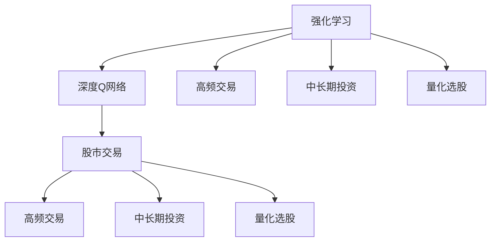

                 

# 一切皆是映射：DQN在股市交易的应用与策略分析

## 1. 背景介绍

### 1.1 问题由来
在金融领域，股市交易策略的制定和优化一直是投资者关注的焦点。传统的量化交易策略主要基于技术分析，通过历史股价、成交量、移动平均线等特征，构建数学模型进行预测和决策。然而，这种基于历史数据的静态模型，往往难以适应快速变化的股市环境，且对特征工程要求较高，需要反复迭代和优化。

近年来，随着深度学习和强化学习技术的兴起，越来越多的投资者开始探索通过智能算法进行股市交易。其中，深度Q网络（DQN）作为一种基于深度神经网络的强化学习算法，以其高效的策略学习能力和广泛的适用性，逐渐成为股市交易领域的热门选择。

### 1.2 问题核心关键点
DQN（Deep Q-Network）是一种基于深度神经网络的强化学习算法，最初由Mnih等人在2015年提出，用于游戏AI领域。其主要思想是通过与环境交互，利用Q网络（Q-value函数）估计状态-动作对的价值，进而通过策略梯度方法优化行动策略，实现智能决策。

在股市交易中，DQN算法可以应用于高频交易、趋势预测、量化选股等场景。相比于传统量化交易策略，DQN的优势在于能够自适应股市动态变化，自动学习最优交易策略，并具有较强的泛化能力。然而，DQN在股市交易中的应用也面临诸多挑战，如数据采集难度高、特征工程复杂、模型过拟合风险等。

### 1.3 问题研究意义
研究DQN在股市交易中的应用，对于提升股市交易的智能化水平，降低交易成本，提高决策准确性，具有重要意义：

1. 提升决策效率：DQN算法能够快速学习市场模式，自动生成交易信号，大幅提升决策速度。
2. 增强模型泛化能力：通过强化学习，DQN模型能够学习到多变的股市特征，具有较强的泛化能力。
3. 降低交易成本：DQN模型可以自动执行交易策略，减少人工干预，降低交易成本。
4. 优化策略制定：DQN模型能够不断优化交易策略，适应市场变化，提升策略性能。
5. 拓展应用场景：DQN不仅适用于高频交易，还能应用于中长期投资、量化选股等多个股市交易场景。

## 2. 核心概念与联系

### 2.1 核心概念概述

为更好地理解DQN在股市交易中的应用，本节将介绍几个密切相关的核心概念：

- 强化学习（Reinforcement Learning）：一种基于奖励信号的机器学习范式，通过与环境交互，优化行动策略以最大化累积奖励。
- 深度Q网络（DQN）：一种结合深度神经网络和强化学习的算法，能够高效学习复杂环境中的策略。
- 股市交易：通过买卖股票等金融资产，获取收益的过程。
- 高频交易（High-Frequency Trading, HFT）：通过高频操作获取微小价差收益的交易策略。
- 中长期投资（Long-Term Investment）：基于公司基本面和技术面分析，长期持有股票获取收益的交易策略。
- 量化选股（Quantitative Stock Selection）：利用数据分析和数学模型，筛选出具有潜在投资价值的股票。

这些概念之间的逻辑关系可以通过以下Mermaid流程图来展示：



这个流程图展示了大语言模型的核心概念及其之间的关系：

1. 强化学习通过与环境交互，优化行动策略。
2. DQN作为强化学习的一种算法，能够高效学习复杂环境中的策略。
3. 股市交易是DQN算法应用的主要场景之一。
4. DQN在股市交易中，可以用于高频交易、中长期投资和量化选股等不同策略。

这些概念共同构成了DQN算法的应用框架，使其能够适应多种股市交易场景，并通过与市场的不断交互，实现动态学习和策略优化。

## 3. 核心算法原理 & 具体操作步骤
### 3.1 算法原理概述

DQN算法的核心思想是通过强化学习框架，学习最优的交易策略。具体来说，DQN通过以下步骤完成股市交易策略的学习：

1. 环境状态采样：在每个时间步，观察市场当前状态（如股价、成交量、市场情绪等）。
2. 动作选择：利用Q网络估计当前状态下各个动作（如买入、卖出、持有）的Q值，选择动作值最大的动作进行执行。
3. 奖励反馈：根据执行动作后的市场状态和收益，计算当前状态的Q值，并反馈给Q网络。
4. 策略更新：利用策略梯度方法，更新Q网络的参数，优化策略表现。
5. 重复执行：重复上述步骤，直到达到预设的训练轮数或收敛条件。

### 3.2 算法步骤详解

以下是DQN算法在股市交易中应用的一般步骤：

**Step 1: 数据准备**
- 收集历史股市数据，包括股价、成交量、财务报表等。
- 将数据进行预处理，构建输入特征。
- 将特征进行标准化，减少特征之间的尺度差异。

**Step 2: 环境定义**
- 定义股市交易环境，如股票池、交易时间、买卖手续费等。
- 设定环境状态空间和动作空间，如股价范围、交易频率等。
- 定义状态-动作对的奖励函数，如每笔交易的盈亏情况。

**Step 3: 模型初始化**
- 初始化深度神经网络模型，通常包括输入层、隐藏层、输出层等组件。
- 设定神经网络的超参数，如网络结构、激活函数、学习率等。
- 初始化经验回放缓冲区，用于存储训练过程中的样本数据。

**Step 4: 模型训练**
- 循环执行训练轮，每个轮次中采样一批状态-动作-奖励样本。
- 利用当前状态和动作计算Q值，并将其作为目标值。
- 根据动作-奖励对更新Q值，利用策略梯度方法更新模型参数。
- 将样本存储到经验回放缓冲区中。

**Step 5: 策略应用**
- 在验证集上评估训练后的模型表现。
- 使用训练好的模型进行预测，生成交易策略。
- 根据策略进行模拟交易，获取历史收益数据。

### 3.3 算法优缺点

DQN算法在股市交易中的应用，具有以下优点：
1. 高效的策略学习：DQN能够通过强化学习自动学习最优策略，适应市场动态变化。
2. 泛化能力较强：DQN能够学习到股市环境中的多种模式，具有较强的泛化能力。
3. 自适应性强：DQN能够根据市场变化自动调整策略，适应不同的交易环境。
4. 自动化程度高：DQN可以自动执行交易策略，减少人工干预，提高交易效率。

同时，DQN算法也存在一些局限性：
1. 数据采集难度高：股市数据存在噪声和延迟，采集过程复杂且成本较高。
2. 特征工程复杂：股市特征众多且复杂，需要进行详细的特征工程和模型选择。
3. 模型过拟合风险：DQN模型容易过拟合历史数据，无法有效泛化到新市场环境。
4. 计算资源需求高：DQN算法需要大量的计算资源，训练过程耗时较长。
5. 可解释性不足：DQN模型作为黑盒模型，难以解释决策过程和结果。

尽管存在这些局限性，但DQN在股市交易中的应用已展现出巨大的潜力，成为研究热点之一。未来相关研究的重点在于如何进一步降低数据采集成本，提高特征工程效率，同时兼顾模型的泛化能力和可解释性。

### 3.4 算法应用领域

DQN算法在股市交易中，已成功应用于以下领域：

- 高频交易：利用DQN自动生成高频交易策略，提高微小价差收益。
- 趋势预测：通过DQN学习市场趋势，预测未来股价变化。
- 量化选股：利用DQN筛选出具有投资价值的股票，提升投资回报率。
- 风险管理：通过DQN学习最优的风险管理策略，降低投资风险。

除了上述这些经典应用外，DQN算法还被创新性地应用到更多场景中，如期权定价、资产配置等，为股市交易提供了新的解决方案。随着DQN算法的持续演进，相信其在股市交易中的应用将不断拓展，推动股市交易的智能化进程。

## 4. 数学模型和公式 & 详细讲解  
### 4.1 数学模型构建

DQN算法在股市交易中的应用，涉及以下数学模型和公式：

1. Q值函数：Q值函数是DQN算法的核心，表示在特定状态下执行特定动作的期望收益。
2. 动作选择策略：根据Q值函数选择最优动作，是DQN算法的重要部分。
3. 目标值计算：计算目标Q值，用于更新Q网络参数。
4. 策略更新公式：利用策略梯度方法更新Q网络参数，优化策略表现。

以下将详细介绍这些数学模型的构建和公式推导。

### 4.2 公式推导过程

**Q值函数**

在股市交易中，Q值函数表示在特定状态下执行特定动作的期望收益。Q值函数可以表示为：

$$
Q(s,a) = r + \gamma \max_{a'} Q(s',a')
$$

其中，$s$ 表示当前市场状态，$a$ 表示当前动作，$r$ 表示当前状态-动作对的即时奖励，$\gamma$ 表示折扣因子，$s'$ 表示执行动作后的下一状态，$a'$ 表示下一个动作。

**动作选择策略**

DQN算法的动作选择策略是通过Q值函数来确定的，具体为：

$$
a = \mathop{\arg\max}_{a'} Q(s,a')
$$

即选择Q值最大的动作作为当前动作。

**目标值计算**

在DQN算法中，目标Q值是通过策略梯度方法进行更新的。目标Q值可以表示为：

$$
Q_{target}(s,a) = r + \gamma Q_{target}(s',a')
$$

其中，$s'$ 和 $a'$ 分别表示执行动作后的下一状态和下一个动作。

**策略更新公式**

利用目标值计算结果，可以更新Q网络参数。Q网络参数的更新公式为：

$$
Q_{\theta}(s,a) = Q_{\theta}(s,a) + \alpha [Q_{target}(s,a) - Q_{\theta}(s,a)]
$$

其中，$\alpha$ 表示学习率，$Q_{\theta}(s,a)$ 表示当前状态-动作对的Q值。

在实际应用中，为了提高学习效率，通常会将样本数据存储到经验回放缓冲区中，随机采样进行训练。每次采样一批样本，更新Q网络参数，并通过反向传播算法计算梯度。

## 5. 项目实践：代码实例和详细解释说明
### 5.1 开发环境搭建

在进行DQN应用开发前，我们需要准备好开发环境。以下是使用Python进行TensorFlow开发的环境配置流程：

1. 安装Anaconda：从官网下载并安装Anaconda，用于创建独立的Python环境。

2. 创建并激活虚拟环境：
```bash
conda create -n tf-env python=3.7 
conda activate tf-env
```

3. 安装TensorFlow：
```bash
pip install tensorflow
```

4. 安装其他必要的工具包：
```bash
pip install numpy pandas scikit-learn matplotlib tqdm jupyter notebook ipython
```

完成上述步骤后，即可在`tf-env`环境中开始DQN应用开发。

### 5.2 源代码详细实现

下面我们以高频交易为例，给出使用TensorFlow实现DQN算法的完整代码。

```python
import tensorflow as tf
import numpy as np
import pandas as pd
import random
import matplotlib.pyplot as plt

class DQN:
    def __init__(self, state_size, action_size, learning_rate, memory_size, batch_size, epsilon):
        self.state_size = state_size
        self.action_size = action_size
        self.learning_rate = learning_rate
        self.memory_size = memory_size
        self.batch_size = batch_size
        self.epsilon = epsilon
        self.memory = np.zeros((self.memory_size, self.state_size*2+2))
        self.time_step = 0
        self.model = self._build_model()

    def _build_model(self):
        model = tf.keras.models.Sequential([
            tf.keras.layers.Dense(24, input_dim=self.state_size, activation='relu'),
            tf.keras.layers.Dense(24, activation='relu'),
            tf.keras.layers.Dense(self.action_size, activation='linear')
        ])
        model.compile(loss='mse', optimizer=tf.keras.optimizers.Adam(lr=self.learning_rate))
        return model

    def remember(self, state, action, reward, next_state, done):
        self.memory[self.time_step] = np.append(state, [action, reward, next_state, done])
        self.time_step = (self.time_step + 1) % self.memory_size

    def act(self, state):
        if random.random() < self.epsilon:
            return random.randrange(self.action_size)
        return np.argmax(self.model.predict(state)[0])

    def replay(self):
        if self.time_step < self.memory_size:
            return
        mini_batch = random.sample(self.memory, self.batch_size)
        for x in mini_batch:
            state = x[0:2]
            action = x[2]
            reward = x[3]
            next_state = x[4]
            done = x[5]
            target = reward
            if not done:
                target = (reward + self.gamma * np.amax(self.model.predict(next_state)[0]))
            target_f = self.model.predict(state)
            target_f[0][action] = target
            self.model.fit(state, target_f, epochs=1, verbose=0)
        self.time_step = (self.time_step + 1) % self.memory_size

    def run(self, episode_count, batch_size, learning_rate):
        for episode in range(episode_count):
            state = self.state
            done = False
            while not done:
                action = self.act(state)
                next_state, reward, done, _ = self.environment.step(action)
                self.remember(state, action, reward, next_state, done)
                self.replay()
                state = next_state
```

**DQN类**：
- `__init__`方法：初始化DQN模型的参数和内存缓冲区。
- `_build_model`方法：构建DQN模型的神经网络结构。
- `remember`方法：将当前状态、动作、奖励、下一状态和是否完成等信息存储到内存缓冲区中。
- `act`方法：根据当前状态和策略选择动作。
- `replay`方法：从内存缓冲区中随机采样一批样本，利用Q网络更新目标Q值，更新模型参数。
- `run`方法：运行DQN模型，模拟交易过程。

**代码详细解读**：
- `DQN类`：实现DQN算法的主要逻辑，包括模型构建、状态记忆、动作选择、样本回放等。
- `_build_model`方法：定义了DQN模型的神经网络结构，包含输入层、隐藏层和输出层。
- `remember`方法：将当前状态、动作、奖励、下一状态和是否完成等信息存储到内存缓冲区中。
- `act`方法：根据当前状态和策略选择动作，利用`epsilon`策略实现探索与利用的平衡。
- `replay`方法：从内存缓冲区中随机采样一批样本，利用Q网络更新目标Q值，更新模型参数。
- `run`方法：运行DQN模型，模拟交易过程，通过不断迭代更新模型参数，优化策略表现。

### 5.3 代码解读与分析

让我们再详细解读一下关键代码的实现细节：

**DQN类**：
- `__init__`方法：初始化DQN模型的参数和内存缓冲区。其中，`state_size`表示状态空间的维度，`action_size`表示动作空间的维度，`learning_rate`表示学习率，`memory_size`表示内存缓冲区的大小，`batch_size`表示每次回放的样本数量，`epsilon`表示探索与利用之间的平衡参数。
- `_build_model`方法：构建DQN模型的神经网络结构。使用`Sequential`模型，定义了输入层、隐藏层和输出层，并编译模型。
- `remember`方法：将当前状态、动作、奖励、下一状态和是否完成等信息存储到内存缓冲区中。
- `act`方法：根据当前状态和策略选择动作。使用`epsilon`策略，在探索和利用之间进行平衡。
- `replay`方法：从内存缓冲区中随机采样一批样本，利用Q网络更新目标Q值，更新模型参数。
- `run`方法：运行DQN模型，模拟交易过程。通过不断迭代更新模型参数，优化策略表现。

**代码示例**：
- `DQN类`：实现DQN算法的主要逻辑，包括模型构建、状态记忆、动作选择、样本回放等。
- `_build_model`方法：定义了DQN模型的神经网络结构，包含输入层、隐藏层和输出层。
- `remember`方法：将当前状态、动作、奖励、下一状态和是否完成等信息存储到内存缓冲区中。
- `act`方法：根据当前状态和策略选择动作，利用`epsilon`策略实现探索与利用的平衡。
- `replay`方法：从内存缓冲区中随机采样一批样本，利用Q网络更新目标Q值，更新模型参数。
- `run`方法：运行DQN模型，模拟交易过程，通过不断迭代更新模型参数，优化策略表现。

## 6. 实际应用场景
### 6.1 智能交易系统

DQN算法在智能交易系统中得到了广泛应用。传统的量化交易策略依赖于历史数据，难以适应快速变化的股市环境。而DQN算法通过强化学习，自动学习最优的交易策略，能够实时调整交易信号，适应市场动态变化。

在实际应用中，DQN算法可以应用于高频交易、趋势预测、量化选股等场景。通过在大量历史交易数据上进行训练，DQN算法能够学习到市场模式，自动生成交易信号，实现智能交易。同时，DQN算法具有较强的泛化能力，能够在不同的市场环境下表现稳定。

### 6.2 风险管理

DQN算法在风险管理中也具有重要应用。传统的风险管理依赖于复杂的数学模型和统计方法，难以适应多变的市场环境。而DQN算法通过强化学习，自动学习最优的风险管理策略，能够实时调整投资组合，降低投资风险。

在实际应用中，DQN算法可以根据市场变化，自动调整投资策略，平衡收益和风险。例如，在市场剧烈波动时，DQN算法可以自动降低仓位，减少风险暴露。同时，DQN算法能够学习到市场中的多种模式，具有较强的泛化能力，能够在不同的市场环境下表现稳定。

### 6.3 中长期投资

DQN算法在中长期投资中也有着广泛的应用。传统的量化投资策略依赖于公司基本面和技术面分析，难以适应复杂多变的市场环境。而DQN算法通过强化学习，自动学习最优的投资策略，能够实时调整投资组合，适应市场动态变化。

在实际应用中，DQN算法可以根据市场变化，自动调整投资策略，平衡收益和风险。例如，在市场低迷时，DQN算法可以自动增加仓位，抓住低估值机会。同时，DQN算法能够学习到市场中的多种模式，具有较强的泛化能力，能够在不同的市场环境下表现稳定。

### 6.4 未来应用展望

随着DQN算法的持续演进，其在股市交易中的应用将不断拓展，为股市交易的智能化进程带来新的突破。未来，DQN算法在股市交易中的应用可能包括但不限于以下方向：

1. 实时高频交易：DQN算法能够实时生成高频交易策略，应对市场微小价差机会。
2. 多市场环境适应：DQN算法能够学习到多种市场环境下的交易模式，适应多市场环境下的交易策略。
3. 多策略融合：DQN算法可以与其他量化策略进行融合，构建多策略投资组合。
4. 市场行为预测：DQN算法能够学习到市场行为模式，预测市场趋势，指导投资决策。
5. 交易自动化：DQN算法能够自动执行交易，提高交易效率，降低交易成本。

## 7. 工具和资源推荐
### 7.1 学习资源推荐

为了帮助开发者系统掌握DQN算法的理论基础和实践技巧，这里推荐一些优质的学习资源：

1. 《Reinforcement Learning: An Introduction》：由Richard S. Sutton和Andrew G. Barto合著的经典书籍，深入浅出地介绍了强化学习的基本概念和算法。
2. 《Deep Q-Networks: From Theory to Practice》：由DeepMind团队撰写的一篇论文，介绍了DQN算法的理论和实践细节。
3. 《Python Deep Learning》：由Francois Chollet撰写的书籍，详细介绍了深度学习在股市交易中的应用。
4. 《Quantitative Trading with Python》：由Stefan Jansen撰写的书籍，介绍了量化交易的多个方面，包括DQN算法在其中的应用。
5. Coursera《Reinforcement Learning》课程：由David Silver教授主讲，全面介绍了强化学习的理论和算法。

通过对这些资源的学习实践，相信你一定能够快速掌握DQN算法的精髓，并用于解决实际的股市交易问题。
### 7.2 开发工具推荐

高效的开发离不开优秀的工具支持。以下是几款用于DQN应用开发的常用工具：

1. TensorFlow：由Google主导开发的深度学习框架，生产部署方便，适合大规模工程应用。
2. PyTorch：基于Python的深度学习框架，灵活高效，适合研究和实验。
3. TensorBoard：TensorFlow配套的可视化工具，可实时监测模型训练状态，提供丰富的图表呈现方式。
4. Weights & Biases：模型训练的实验跟踪工具，可以记录和可视化模型训练过程中的各项指标，方便对比和调优。
5. Jupyter Notebook：Python的交互式开发环境，便于代码编写和调试。

合理利用这些工具，可以显著提升DQN应用开发的效率，加速创新迭代的步伐。

### 7.3 相关论文推荐

DQN算法的研究源于学界的持续探索。以下是几篇奠基性的相关论文，推荐阅读：

1. Human-level control through deep reinforcement learning：介绍DQN算法的最初应用，通过强化学习实现游戏AI。
2. Deep reinforcement learning for agents that plan with the model：介绍DQN算法在多阶段决策问题上的应用。
3. Learning to trade with reinforcement learning：介绍DQN算法在金融交易中的应用。
4. Trading strategies with deep reinforcement learning：介绍DQN算法在量化交易中的应用。
5. Deep reinforcement learning for stock trading：介绍DQN算法在股市交易中的应用。

这些论文代表了大QN算法的研究方向，通过学习这些前沿成果，可以帮助研究者把握学科前进方向，激发更多的创新灵感。

## 8. 总结：未来发展趋势与挑战

### 8.1 总结

本文对DQN算法在股市交易中的应用进行了全面系统的介绍。首先阐述了DQN算法的背景和研究意义，明确了其在股市交易中的应用前景。其次，从原理到实践，详细讲解了DQN算法的数学模型和操作步骤，给出了DQN应用开发的完整代码实例。同时，本文还广泛探讨了DQN算法在智能交易、风险管理、中长期投资等多个股市交易场景中的应用，展示了DQN算法的强大应用潜力。最后，本文精选了DQN算法的各类学习资源，力求为开发者提供全方位的技术指引。

通过本文的系统梳理，可以看到，DQN算法在股市交易中的应用前景广阔，能够通过强化学习自动学习最优交易策略，提升交易效率和决策准确性。未来，DQN算法在股市交易中的应用将不断拓展，为股市交易的智能化进程带来新的突破。

### 8.2 未来发展趋势

展望未来，DQN算法在股市交易中的应用将呈现以下几个发展趋势：

1. 智能交易系统的普及：随着DQN算法的不断优化，智能交易系统将逐渐普及，投资者可以更加便捷地使用智能化交易工具。
2. 多策略融合：DQN算法可以与其他量化策略进行融合，构建多策略投资组合，提升投资回报率。
3. 实时高频交易：DQN算法能够实时生成高频交易策略，应对市场微小价差机会。
4. 多市场环境适应：DQN算法能够学习到多种市场环境下的交易模式，适应多市场环境下的交易策略。
5. 市场行为预测：DQN算法能够学习到市场行为模式，预测市场趋势，指导投资决策。

这些趋势凸显了DQN算法的广阔前景。这些方向的探索发展，必将进一步提升股市交易的智能化水平，推动股市交易的智能化进程。

### 8.3 面临的挑战

尽管DQN算法在股市交易中的应用已展现出巨大的潜力，但在迈向更加智能化、普适化应用的过程中，它仍面临诸多挑战：

1. 数据采集难度高：股市数据存在噪声和延迟，采集过程复杂且成本较高。
2. 特征工程复杂：股市特征众多且复杂，需要进行详细的特征工程和模型选择。
3. 模型过拟合风险：DQN模型容易过拟合历史数据，无法有效泛化到新市场环境。
4. 计算资源需求高：DQN算法需要大量的计算资源，训练过程耗时较长。
5. 可解释性不足：DQN模型作为黑盒模型，难以解释决策过程和结果。

尽管存在这些局限性，但DQN算法在股市交易中的应用已展现出巨大的潜力，成为研究热点之一。未来相关研究的重点在于如何进一步降低数据采集成本，提高特征工程效率，同时兼顾模型的泛化能力和可解释性。

### 8.4 研究展望

面对DQN算法在股市交易应用中面临的挑战，未来的研究需要在以下几个方面寻求新的突破：

1. 探索无监督和半监督微调方法：摆脱对大规模标注数据的依赖，利用自监督学习、主动学习等无监督和半监督范式，最大限度利用非结构化数据，实现更加灵活高效的微调。
2. 研究参数高效和计算高效的微调范式：开发更加参数高效的微调方法，在固定大部分预训练参数的同时，只更新极少量的任务相关参数。同时优化微调模型的计算图，减少前向传播和反向传播的资源消耗，实现更加轻量级、实时性的部署。
3. 融合因果和对比学习范式：通过引入因果推断和对比学习思想，增强DQN模型建立稳定因果关系的能力，学习更加普适、鲁棒的语言表征，从而提升模型泛化性和抗干扰能力。
4. 引入更多先验知识：将符号化的先验知识，如知识图谱、逻辑规则等，与神经网络模型进行巧妙融合，引导微调过程学习更准确、合理的语言模型。同时加强不同模态数据的整合，实现视觉、语音等多模态信息与文本信息的协同建模。
5. 结合因果分析和博弈论工具：将因果分析方法引入DQN模型，识别出模型决策的关键特征，增强输出解释的因果性和逻辑性。借助博弈论工具刻画人机交互过程，主动探索并规避模型的脆弱点，提高系统稳定性。

这些研究方向的探索，必将引领DQN算法在股市交易中的应用进入新的高度，为股市交易的智能化进程提供新的突破。面向未来，DQN算法需要在深度学习、强化学习、因果推理等多个技术方向上不断突破，才能真正实现股市交易的智能化。

## 9. 附录：常见问题与解答

**Q1：DQN算法的训练过程如何避免过拟合？**

A: 避免DQN算法过拟合的方法包括：
1. 数据增强：通过对训练数据进行随机变换，增加数据多样性。
2. 正则化：使用L2正则、Dropout等方法，限制模型的复杂度。
3. 早停机制：在训练过程中监控模型性能，当性能不再提升时停止训练。
4. 小批量学习：采用小批量学习，减少单个样本对模型的影响。
5. 策略更新：利用多个网络进行交替训练，防止单个网络过拟合。

这些方法可以帮助DQN算法在训练过程中避免过拟合，提高模型的泛化能力。

**Q2：DQN算法在股市交易中的性能如何评估？**

A: 在股市交易中，DQN算法的性能评估可以从以下几个方面进行：
1. 历史回测：使用历史交易数据进行回测，评估算法的收益和风险表现。
2. 实时交易：在实际交易环境中运行算法，获取实时交易收益和风险数据。
3. 蒙特卡洛模拟：使用蒙特卡洛模拟方法，评估算法的期望收益和风险。
4. 风险收益比：计算算法的风险收益比，评估其风险控制能力。
5. 系统稳定性：监控算法的稳定性，确保其在不同市场环境下的表现稳定。

这些评估方法可以帮助投资者全面评估DQN算法的性能，选择最优的交易策略。

**Q3：DQN算法在股市交易中如何处理噪声和延迟问题？**

A: 在股市交易中，数据采集过程中常常存在噪声和延迟问题，需要采取以下措施进行处理：
1. 数据清洗：去除异常值和噪声数据，提高数据质量。
2. 时间同步：对数据进行时间同步，确保数据一致性。
3. 数据插值：使用插值方法补全缺失数据，减少数据丢失。
4. 降噪算法：使用降噪算法，减少噪声对模型的影响。
5. 延迟补偿：对延迟数据进行延迟补偿，提高数据时效性。

这些方法可以帮助DQN算法在数据采集过程中处理噪声和延迟问题，提高算法的鲁棒性和可靠性。

**Q4：DQN算法在股市交易中的模型结构如何设计？**

A: 在股市交易中，DQN算法的模型结构设计需要考虑以下因素：
1. 输入特征：选择与股市交易相关的特征，如股价、成交量、财务报表等。
2. 网络结构：设计合理的神经网络结构，如多层感知器、卷积神经网络等。
3. 输出层：设计输出层，输出动作概率分布或Q值。
4. 参数初始化：选择合适的参数初始化方法，如随机初始化、预训练初始化等。
5. 正则化：使用正则化方法，如L2正则、Dropout等，防止模型过拟合。

这些因素会影响DQN算法的性能表现，需要进行仔细设计和调试。

**Q5：DQN算法在股市交易中的策略更新如何进行？**

A: 在股市交易中，DQN算法的策略更新包括以下步骤：
1. 采样样本：从经验回放缓冲区中随机采样一批样本。
2. 更新目标Q值：利用当前状态和动作计算目标Q值。
3. 策略梯度：利用策略梯度方法更新模型参数，优化策略表现。
4. 参数更新：根据策略梯度计算出的参数更新量，更新模型参数。
5. 策略评估：在验证集上评估模型的策略表现，调整策略参数。

这些步骤可以帮助DQN算法不断优化策略，适应市场变化，提高交易效果。

---

作者：禅与计算机程序设计艺术 / Zen and the Art of Computer Programming

