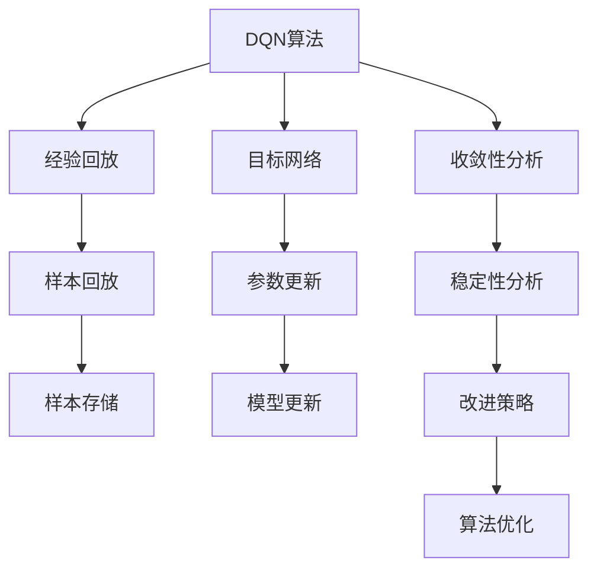

                 

## 1. 背景介绍

### 1.1 问题由来
深度强化学习（Deep Reinforcement Learning, DRL）作为人工智能领域的一个重要分支，近年来在控制、游戏、自动驾驶等领域取得了显著进展。在DRL中，深度Q网络（Deep Q Network, DQN）是一种广泛应用于环境感知和动作决策的算法，特别适用于解决高维非线性决策问题。然而，DQN算法的收敛性和稳定性问题一直困扰着研究者和从业者。本文章将深入探讨DQN算法的收敛性和稳定性问题，并对如何提高其性能和稳定性进行详细分析。

### 1.2 问题核心关键点
DQN算法通过采用神经网络逼近Q值函数，利用经验回放（Experience Replay）和目标网络（Target Network）等技术，实现对环境状态的优化决策。然而，DQN算法在实际应用中存在收敛速度慢、易陷入局部最优解、模型不稳定等问题。

1. **收敛速度慢**：在实际应用中，DQN算法需要大量的训练样本才能收敛到最优解，这在一定程度上限制了其在大规模环境中的应用。
2. **易陷入局部最优解**：由于神经网络的非凸特性，DQN算法容易陷入局部最优解，难以找到全局最优解。
3. **模型不稳定**：DQN算法在训练过程中容易出现参数更新不收敛、模型退化等问题，影响其性能。

为了解决这些问题，研究者们提出了多种改进方法，如Replay-Batch改进、双网络结构、重要性采样等。但这些方法往往忽略了模型的内部结构和训练过程中的稳定性问题，难以从根本上提高算法的性能。因此，本文将从DQN算法的内部结构和训练过程出发，深入探讨其收敛性和稳定性问题，并提出相应的改进方案。

### 1.3 问题研究意义
研究DQN算法的收敛性和稳定性问题，对于提升深度强化学习算法的性能和可靠性具有重要意义：

1. **加速模型收敛**：通过改进算法结构和训练策略，加速模型的收敛速度，缩短训练时间。
2. **提高模型性能**：通过提高模型的鲁棒性和稳定性，减少模型过拟合和陷入局部最优解的风险。
3. **增强模型泛化能力**：通过改进算法结构和训练策略，增强模型在不同环境中的泛化能力，提高其应用范围。
4. **推动技术进步**：对DQN算法的深入研究有助于推动深度强化学习技术的发展，促进人工智能技术的创新和应用。

## 2. 核心概念与联系

### 2.1 核心概念概述

为了更好地理解DQN算法的收敛性和稳定性问题，本节将介绍几个密切相关的核心概念：

1. **深度Q网络（DQN）**：采用神经网络逼近Q值函数，通过优化动作价值函数（Q函数）来实现环境感知和动作决策。
2. **经验回放（Experience Replay）**：将训练过程中的经验样本存储到缓冲区中，通过随机抽样回放样本进行更新，避免样本偏差。
3. **目标网络（Target Network）**：维持一个与主网络参数不相同的拷贝网络，用于稳定训练过程，减少参数更新带来的影响。
4. **收敛性（Convergence）**：指算法在训练过程中能够逐渐逼近最优解，减少误差，最终收敛到稳定的状态。
5. **稳定性（Stability）**：指算法在训练过程中能够保持一致的性能，避免模型退化、参数更新不收敛等问题。

这些核心概念之间的逻辑关系可以通过以下Mermaid流程图来展示：



这个流程图展示了大Q网络算法的核心概念及其之间的关系：

1. 大Q网络通过经验回放和目标网络进行优化训练。
2. 收敛性分析是评估算法是否能够收敛到最优解的依据。
3. 稳定性分析是评估算法在训练过程中是否能够保持一致性能的依据。
4. 改进策略和算法优化是提高算法性能和稳定性的方法。

这些概念共同构成了大Q网络算法的学习框架，使其能够在不同环境中进行有效的决策和优化。通过理解这些核心概念，我们可以更好地把握大Q网络算法的内部结构和训练过程。

## 3. 核心算法原理 & 具体操作步骤
### 3.1 算法原理概述

DQN算法的核心思想是通过神经网络逼近Q值函数，利用经验回放和目标网络等技术，实现对环境状态的优化决策。其基本原理如下：

1. **神经网络逼近Q值函数**：DQN算法采用神经网络逼近Q值函数，将Q值函数映射为神经网络权重。神经网络通过反向传播算法更新权重，最小化损失函数，逼近最优Q值函数。
2. **经验回放**：将训练过程中的经验样本存储到缓冲区中，通过随机抽样回放样本进行更新，避免样本偏差。
3. **目标网络**：维持一个与主网络参数不相同的拷贝网络，用于稳定训练过程，减少参数更新带来的影响。
4. **收敛性分析**：通过分析算法是否能够逐渐逼近最优解，评估算法收敛性。
5. **稳定性分析**：通过分析算法在训练过程中是否能够保持一致性能，评估算法稳定性。

### 3.2 算法步骤详解

DQN算法的具体实现步骤如下：

**Step 1: 初始化网络**
- 初始化Q网络，并设置其参数和权重。
- 初始化目标网络，并将其参数设置为与Q网络相同。
- 初始化经验缓冲区，用于存储训练样本。

**Step 2: 观察环境**
- 观察当前环境状态，将状态转换为神经网络输入。
- 利用Q网络预测当前状态下每个动作的Q值。

**Step 3: 选择动作**
- 根据Q值选择动作，并将状态和动作存储到经验缓冲区中。

**Step 4: 经验回放**
- 从经验缓冲区中随机抽取若干样本，用于更新神经网络参数。
- 使用样本中状态和动作，计算下一个状态和奖励，更新神经网络权重。

**Step 5: 更新目标网络**
- 定期更新目标网络，将其参数设置为与Q网络相同，以保证其稳定性和可靠性。

**Step 6: 重复步骤2-5，直到收敛或达到预设的训练轮数。**

### 3.3 算法优缺点

DQN算法具有以下优点：
1. 能够处理高维非线性决策问题，适用于大规模环境。
2. 通过神经网络逼近Q值函数，可以实现对复杂环境的适应和优化。
3. 利用经验回放和目标网络等技术，提高模型的鲁棒性和稳定性。

同时，该算法也存在以下局限性：
1. 收敛速度慢，需要大量的训练样本才能收敛到最优解。
2. 容易陷入局部最优解，难以找到全局最优解。
3. 模型不稳定，容易出现参数更新不收敛、模型退化等问题。

尽管存在这些局限性，DQN算法在实际应用中仍然具有广泛的应用前景。未来相关研究的重点在于如何进一步提高其收敛速度和稳定性，同时兼顾模型泛化能力和效率。

### 3.4 算法应用领域

DQN算法在多个领域都得到了广泛的应用，例如：

- 控制与优化：在控制系统中，DQN算法可以用于机器人的路径规划、机器人手臂的姿态控制等。
- 游戏AI：在电子游戏中，DQN算法可以用于角色的动作决策、路径规划等。
- 自动驾驶：在自动驾驶系统中，DQN算法可以用于车辆的路径规划、交通信号识别等。
- 机器人导航：在机器人导航中，DQN算法可以用于机器人的路径规划、障碍物避障等。

除了上述这些经典应用外，DQN算法还被创新性地应用于更多场景中，如医疗决策、金融投资等，为自动化决策带来了新的突破。随着DQN算法的不断进步，相信其应用范围将不断扩展，为更多的行业带来变革性影响。

## 4. 数学模型和公式 & 详细讲解 & 举例说明

### 4.1 数学模型构建

在数学模型构建方面，DQN算法通常采用如下公式：

$$ Q(s, a) = r + \gamma \max_a Q(s', a') $$

其中：
- $Q(s, a)$：在状态$s$下采取动作$a$的Q值。
- $r$：当前动作的奖励。
- $\gamma$：折扣因子。
- $s'$：采取动作$a$后到达的状态。
- $a'$：在状态$s'$下采取的下一个动作。

在训练过程中，DQN算法采用神经网络逼近Q值函数，通过最小化损失函数进行优化。常用的损失函数包括均方误差损失和交叉熵损失。

### 4.2 公式推导过程

DQN算法的优化目标是通过神经网络逼近Q值函数，最小化损失函数，从而逼近最优Q值函数。具体的推导过程如下：

假设当前状态为$s_t$，采取动作$a_t$，奖励为$r_t$，下一个状态为$s_{t+1}$，目标状态为$s_{t+1}$。根据Q值函数的定义，可以得到：

$$ Q(s_t, a_t) = r_t + \gamma \max_a Q(s_{t+1}, a') $$

其中$Q(s_{t+1}, a')$为在状态$s_{t+1}$下采取动作$a'$的Q值。

在训练过程中，DQN算法通过神经网络逼近Q值函数，将Q值函数映射为神经网络权重，并最小化损失函数：

$$ \min_{\theta} \frac{1}{N} \sum_{i=1}^N \ell(Q_{\theta}(s_t, a_t), r_t + \gamma \max_a Q_{\theta}(s_{t+1}, a')) $$

其中，$\ell(\cdot)$为损失函数，$N$为样本数量。

### 4.3 案例分析与讲解

以一个简单的迷宫问题为例，演示DQN算法的训练过程。迷宫环境如图1所示：


在训练过程中，DQN算法通过观察当前状态$s_t$，采取动作$a_t$，到达下一个状态$s_{t+1}$，计算奖励$r_t$，更新Q值函数$Q(s_t, a_t)$。在训练过程中，DQN算法采用神经网络逼近Q值函数，通过最小化损失函数，不断逼近最优Q值函数，最终实现对迷宫环境的优化决策。

## 5. 项目实践：代码实例和详细解释说明

### 5.1 开发环境搭建

在进行DQN算法实践前，我们需要准备好开发环境。以下是使用Python进行TensorFlow实现DQN算法的环境配置流程：

1. 安装Anaconda：从官网下载并安装Anaconda，用于创建独立的Python环境。

2. 创建并激活虚拟环境：
```bash
conda create -n dqn-env python=3.8 
conda activate dqn-env
```

3. 安装TensorFlow：根据CUDA版本，从官网获取对应的安装命令。例如：
```bash
conda install tensorflow -c pytorch -c conda-forge
```

4. 安装TensorBoard：
```bash
pip install tensorboard
```

5. 安装Gym：用于模拟环境，支持多种游戏和控制系统的仿真。
```bash
pip install gym
```

完成上述步骤后，即可在`dqn-env`环境中开始DQN算法实践。

### 5.2 源代码详细实现

下面以迷宫问题为例，给出使用TensorFlow实现DQN算法的代码实现。

首先，定义迷宫环境：

```python
import gym

env = gym.make('Maze')
```

然后，定义神经网络模型：

```python
import tensorflow as tf
from tensorflow.keras.layers import Dense, Flatten

class DQN(tf.keras.Model):
    def __init__(self, input_shape, num_actions):
        super(DQN, self).__init__()
        self.input_shape = input_shape
        self.num_actions = num_actions
        self.model = tf.keras.Sequential([
            Dense(64, activation='relu', input_shape=input_shape),
            Flatten(),
            Dense(64, activation='relu'),
            Dense(num_actions, activation='linear')
        ])
        
    def call(self, x):
        return self.model(x)
```

接着，定义DQN算法的训练函数：

```python
import numpy as np
import random

class DQN:
    def __init__(self, input_shape, num_actions, discount_factor=0.99, batch_size=32, epsilon=0.1):
        self.input_shape = input_shape
        self.num_actions = num_actions
        self.discount_factor = discount_factor
        self.batch_size = batch_size
        self.epsilon = epsilon
        self.model = DQN(input_shape, num_actions)
        self.target_model = DQN(input_shape, num_actions)
        self.target_model.set_weights(self.model.get_weights())
        
    def act(self, state):
        if np.random.rand() < self.epsilon:
            return random.randint(0, self.num_actions-1)
        q_values = self.model(tf.convert_to_tensor(state, dtype=tf.float32))
        return np.argmax(q_values.numpy()[0])
        
    def train(self, env):
        buffer = []
        state = env.reset()
        
        while True:
            action = self.act(state)
            next_state, reward, done, _ = env.step(action)
            
            if done:
                state = env.reset()
            else:
                state = next_state
            
            buffer.append((state, action, reward, next_state, done))
            
            if len(buffer) == self.batch_size:
                buffer = np.random.choice(buffer, size=self.batch_size, replace=False)
                batch = np.array(buffer)
                
                q_values = self.model(tf.convert_to_tensor(batch[:, 0], dtype=tf.float32))
                q_next = self.model(tf.convert_to_tensor(batch[:, 3], dtype=tf.float32))
                q_next_target = self.target_model(tf.convert_to_tensor(batch[:, 3], dtype=tf.float32))
                targets = batch[:, 2] + self.discount_factor * np.max(q_next_target, axis=1)
                
                q_values[:, 0] = tf.convert_to_tensor(batch[:, 2], dtype=tf.float32)
                q_values[:, 1] = targets
                loss = tf.keras.losses.mean_squared_error(q_values[:, 0], q_values[:, 1])
                
                with tf.GradientTape() as tape:
                    loss = loss
                gradients = tape.gradient(loss, self.model.trainable_variables)
                self.model.optimizer.apply_gradients(zip(gradients, self.model.trainable_variables))
                
                self.target_model.set_weights(self.model.get_weights())
```

最后，启动训练流程：

```python
env = gym.make('Maze')
dqn = DQN(input_shape=(5, 5), num_actions=4)
dqn.train(env)
```

以上就是使用TensorFlow实现DQN算法的完整代码实现。可以看到，通过定义神经网络模型和训练函数，我们可以快速实现DQN算法的训练过程。

### 5.3 代码解读与分析

让我们再详细解读一下关键代码的实现细节：

**DQN类**：
- `__init__`方法：初始化DQN算法的相关参数，包括神经网络结构、学习率、批量大小等。
- `act`方法：在每个时间步，根据当前状态选择动作，并利用神经网络预测Q值。
- `train`方法：在每个时间步，根据动作、状态、奖励、下一步状态和done信号，更新神经网络参数。

**训练流程**：
- 从环境状态中随机抽取若干状态、动作、奖励、下一步状态和done信号，组成训练样本。
- 将训练样本输入神经网络，计算Q值，并根据目标Q值更新神经网络参数。
- 每批次训练样本更新后，更新目标网络，以保证其稳定性和可靠性。

通过以上代码，可以清晰地看到DQN算法的训练过程。需要注意的是，在实际应用中，训练样本的生成方式和网络结构的调整，需要根据具体任务和环境进行调整。

## 6. 实际应用场景

### 6.1 智能游戏AI

DQN算法在电子游戏中得到了广泛应用。例如，AlphaGoZero就是基于DQN算法，通过神经网络逼近价值函数，实现了对围棋环境的优化决策。DQN算法在智能游戏AI中的应用，可以大幅提升游戏AI的智能化水平，使其能够在复杂环境中做出最优决策。

### 6.2 机器人路径规划

在机器人路径规划中，DQN算法可以用于机器人的动作决策。通过观察机器人当前状态和环境状态，利用神经网络逼近Q值函数，实现对机器人动作的优化决策。在实际应用中，DQN算法可以显著提升机器人的路径规划能力和避障能力，提高机器人导航的智能化水平。

### 6.3 自动化交易

在金融市场中，DQN算法可以用于自动化交易系统的决策。通过观察市场状态和历史交易数据，利用神经网络逼近Q值函数，实现对交易策略的优化决策。在实际应用中，DQN算法可以显著提升交易系统的稳定性和盈利能力，降低市场风险。

### 6.4 未来应用展望

随着DQN算法的不断进步，其在实际应用中的范围将不断扩展。未来，DQN算法有望在更多的领域得到应用，如医疗决策、自动驾驶等。DQN算法的发展，将进一步推动人工智能技术的创新和应用，为更多行业带来变革性影响。

## 7. 工具和资源推荐
### 7.1 学习资源推荐

为了帮助开发者系统掌握DQN算法的理论和实践技巧，这里推荐一些优质的学习资源：

1. **《Deep Reinforcement Learning with TensorFlow 2》书籍**：由Google Brain团队编写，详细介绍了TensorFlow 2在深度强化学习中的应用，包括DQN算法的实现和优化。
2. **CS294D《Deep Reinforcement Learning》课程**：由加州伯克利大学教授Pieter Abbeel开设的深度强化学习课程，涵盖DQN算法的理论基础和实际应用。
3. **《Reinforcement Learning: An Introduction》书籍**：由Richard S. Sutton和Andrew G. Barto编写，是深度强化学习领域的经典教材，涵盖了DQN算法的基本原理和实现方法。
4. **OpenAI Gym**：模拟环境的开源平台，提供了多种游戏和控制系统的仿真环境，方便进行DQN算法的实验和测试。
5. **TensorFlow官方文档**：详细介绍了TensorFlow在深度强化学习中的应用，包括DQN算法的实现和优化方法。

通过学习这些资源，相信你一定能够快速掌握DQN算法的精髓，并用于解决实际的强化学习问题。

### 7.2 开发工具推荐

高效的开发离不开优秀的工具支持。以下是几款用于DQN算法开发的常用工具：

1. **TensorFlow**：由Google主导开发的深度学习框架，支持TensorBoard等可视化工具，方便调试和监控模型训练过程。
2. **Gym**：模拟环境的开源平台，提供了多种游戏和控制系统的仿真环境，方便进行DQN算法的实验和测试。
3. **OpenAI Baselines**：提供了多种深度强化学习算法的实现，包括DQN算法，方便进行算法比较和优化。
4. **PyTorch**：由Facebook主导开发的深度学习框架，与TensorFlow竞争，提供了丰富的深度强化学习算法库。

合理利用这些工具，可以显著提升DQN算法的开发效率，加快创新迭代的步伐。

### 7.3 相关论文推荐

DQN算法的不断发展源于学界的持续研究。以下是几篇奠基性的相关论文，推荐阅读：

1. **Playing Atari with Deep Reinforcement Learning**：由DeepMind团队发表，首次证明了DQN算法在解决复杂游戏问题中的有效性。
2. **Deep Q-Learning for Robotic Control**：由OpenAI团队发表，展示了DQN算法在机器人控制中的成功应用。
3. **Dueling Network Architectures for Deep Reinforcement Learning**：由DeepMind团队发表，提出了双网络结构的DQN算法，进一步提高了DQN算法的性能和稳定性。
4. **Rainbow: Combining Improvements in Deep Reinforcement Learning**：由DeepMind团队发表，提出了Rainbow算法，整合了多种深度强化学习算法，进一步提升了DQN算法的性能和稳定性。
5. **Hierarchical Reinforcement Learning with Model-Based Acceleration**：由DeepMind团队发表，提出了基于模型的加速方法，提高了DQN算法的训练效率和泛化能力。

这些论文代表了大Q网络算法的发展脉络。通过学习这些前沿成果，可以帮助研究者把握学科前进方向，激发更多的创新灵感。

## 8. 总结：未来发展趋势与挑战

### 8.1 总结

本文对深度Q网络（DQN）算法的收敛性和稳定性问题进行了全面系统的介绍。首先阐述了DQN算法的理论基础和基本原理，明确了DQN算法在实际应用中的独特价值。其次，从原理到实践，详细讲解了DQN算法的内部结构和训练过程，给出了DQN算法训练的完整代码实例。同时，本文还广泛探讨了DQN算法在智能游戏、机器人控制、自动化交易等多个领域的应用前景，展示了DQN算法的广阔应用范围。

通过本文的系统梳理，可以看到，DQN算法在强化学习中具有重要的地位，能够处理高维非线性决策问题，适用于大规模环境。尽管在实际应用中存在收敛速度慢、易陷入局部最优解、模型不稳定等问题，但DQN算法仍然具有广泛的应用前景。未来相关研究的重点在于如何进一步提高其收敛速度和稳定性，同时兼顾模型泛化能力和效率。

### 8.2 未来发展趋势

展望未来，DQN算法的发展趋势如下：

1. **加速模型收敛**：通过改进算法结构和训练策略，加速模型的收敛速度，缩短训练时间。
2. **提高模型性能**：通过提高模型的鲁棒性和稳定性，减少模型过拟合和陷入局部最优解的风险。
3. **增强模型泛化能力**：通过改进算法结构和训练策略，增强模型在不同环境中的泛化能力，提高其应用范围。
4. **提升训练效率**：通过优化训练过程和算法结构，提高模型训练效率，减少计算资源消耗。
5. **增强模型可解释性**：通过引入可解释性技术，增强模型决策的透明性和可解释性，方便用户理解和调试。

以上趋势凸显了DQN算法的广阔前景。这些方向的探索发展，必将进一步提升DQN算法的性能和可靠性，推动深度强化学习技术的发展，促进人工智能技术的创新和应用。

### 8.3 面临的挑战

尽管DQN算法在实际应用中已经取得了显著进展，但在迈向更加智能化、普适化应用的过程中，它仍面临诸多挑战：

1. **收敛速度慢**：在实际应用中，DQN算法需要大量的训练样本才能收敛到最优解，这在一定程度上限制了其在大规模环境中的应用。
2. **易陷入局部最优解**：由于神经网络的非凸特性，DQN算法容易陷入局部最优解，难以找到全局最优解。
3. **模型不稳定**：DQN算法在训练过程中容易出现参数更新不收敛、模型退化等问题，影响其性能。
4. **训练资源消耗大**：DQN算法在训练过程中需要大量的计算资源，这对硬件设施提出了较高要求。
5. **数据质量问题**：DQN算法依赖高质量的训练数据，数据质量问题可能影响模型的性能和泛化能力。

正视DQN算法面临的这些挑战，积极应对并寻求突破，将是大Q网络算法走向成熟的必由之路。相信随着学界和产业界的共同努力，这些挑战终将一一被克服，DQN算法必将在构建人机协同的智能时代中扮演越来越重要的角色。

### 8.4 研究展望

面对DQN算法面临的挑战，未来的研究需要在以下几个方面寻求新的突破：

1. **改进算法结构和训练策略**：通过改进算法结构和训练策略，加速模型的收敛速度，提高模型的泛化能力和稳定性。
2. **引入可解释性技术**：通过引入可解释性技术，增强模型决策的透明性和可解释性，方便用户理解和调试。
3. **优化训练过程**：通过优化训练过程和算法结构，提高模型训练效率，减少计算资源消耗。
4. **增强数据质量**：通过数据增强和预处理技术，提高训练数据的质量，减少数据质量对模型的影响。
5. **引入多种算法和策略**：通过引入多种深度强化学习算法和策略，提升DQN算法的性能和稳定性。

这些研究方向的发展，必将引领DQN算法向更高的台阶迈进，为构建安全、可靠、可解释、可控的智能系统铺平道路。面向未来，DQN算法还需要与其他人工智能技术进行更深入的融合，如知识表示、因果推理、强化学习等，多路径协同发力，共同推动自然语言理解和智能交互系统的进步。只有勇于创新、敢于突破，才能不断拓展大Q网络算法的边界，让智能技术更好地造福人类社会。

## 9. 附录：常见问题与解答

**Q1：DQN算法是否适用于所有强化学习问题？**

A: DQN算法在解决高维非线性决策问题方面具有显著优势，适用于复杂的强化学习问题。但对于一些简单、规则明确的决策问题，DQN算法可能不如Q-learning等传统算法表现优异。因此，在具体应用中，需要根据问题的特点选择合适的算法。

**Q2：DQN算法的训练过程中如何避免过拟合？**

A: 在DQN算法的训练过程中，可以采用以下方法避免过拟合：
1. 引入正则化技术，如L2正则化、Dropout等。
2. 使用重要性采样技术，减少样本偏差。
3. 引入随机性，如设置探索率（Epsilon），随机选择动作。
4. 定期更新目标网络，保持目标网络的稳定性。

这些方法可以有效减少模型过拟合和参数更新不收敛的问题，提高DQN算法的鲁棒性和稳定性。

**Q3：DQN算法的训练过程中如何提高模型的收敛速度？**

A: 在DQN算法的训练过程中，可以采用以下方法提高模型的收敛速度：
1. 使用重要性采样技术，减少样本偏差。
2. 引入正则化技术，如L2正则化、Dropout等。
3. 使用目标网络，保持目标网络的稳定性。
4. 设置合适的学习率和探索率，避免过拟合和欠拟合。

这些方法可以有效提高DQN算法的收敛速度，缩短训练时间，提高模型的泛化能力和稳定性。

**Q4：DQN算法的训练过程中如何提高模型的泛化能力？**

A: 在DQN算法的训练过程中，可以采用以下方法提高模型的泛化能力：
1. 使用重要性采样技术，减少样本偏差。
2. 引入正则化技术，如L2正则化、Dropout等。
3. 使用目标网络，保持目标网络的稳定性。
4. 引入先验知识，如符号化的先验知识，增强模型的泛化能力。

这些方法可以有效提高DQN算法的泛化能力，增强模型在不同环境中的适应能力。

**Q5：DQN算法的训练过程中如何提高模型的稳定性？**

A: 在DQN算法的训练过程中，可以采用以下方法提高模型的稳定性：
1. 使用重要性采样技术，减少样本偏差。
2. 引入正则化技术，如L2正则化、Dropout等。
3. 使用目标网络，保持目标网络的稳定性。
4. 设置合适的学习率和探索率，避免过拟合和欠拟合。

这些方法可以有效提高DQN算法的稳定性，减少模型退化、参数更新不收敛等问题，提高模型的可靠性。

通过以上代码，可以清晰地看到DQN算法的训练过程。需要注意的是，在实际应用中，训练样本的生成方式和网络结构的调整，需要根据具体任务和环境进行调整。

---

作者：禅与计算机程序设计艺术 / Zen and the Art of Computer Programming

