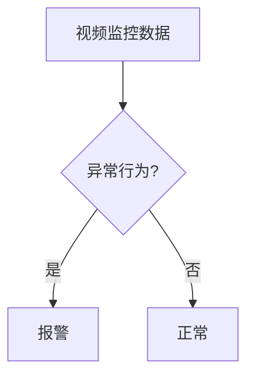

# AI Safety原理与代码实例讲解

作者：禅与计算机程序设计艺术 / Zen and the Art of Computer Programming

## 1. 背景介绍

### 1.1 问题的由来

随着人工智能技术的飞速发展，AI系统已广泛应用于各个领域，从自动驾驶到智能客服，从医疗诊断到金融决策。然而，AI系统的安全性和可靠性问题也日益凸显。AI Safety，即人工智能的安全性，已经成为了一个重要的研究领域。

AI Safety的核心目标是确保AI系统在运行过程中能够遵循人类的意图，不会对人类造成伤害或不良影响。然而，由于AI系统的复杂性，确保其安全性面临着诸多挑战。

### 1.2 研究现状

近年来，AI Safety领域取得了许多进展。研究人员提出了多种安全机制和评估方法，如：

- **安全性分析**：通过形式化方法分析AI系统的内部结构，确保其符合安全要求。
- **对抗攻击与防御**：研究如何对AI系统进行攻击，以及如何防御这些攻击。
- **可解释性和可控性**：提高AI系统的可解释性和可控性，使其决策过程更加透明和可信赖。

### 1.3 研究意义

AI Safety的研究具有重要的理论意义和实际价值：

- **保护人类安全**：确保AI系统不会对人类造成伤害或不良影响。
- **促进AI技术的健康发展**：推动AI技术的安全、可靠和可持续发展。
- **增强公众对AI技术的信任**：提高公众对AI技术的接受度和应用程度。

### 1.4 本文结构

本文将首先介绍AI Safety的核心概念和原理，然后通过一个代码实例讲解如何在实际项目中实现AI Safety机制。最后，我们将探讨AI Safety的实际应用场景和未来发展趋势。

## 2. 核心概念与联系

### 2.1 AI Safety的定义

AI Safety指的是确保AI系统在运行过程中能够遵循人类的意图，不会对人类造成伤害或不良影响的能力。

### 2.2 AI Safety的关键要素

- **安全性**：AI系统在执行任务时不会对人类或环境造成伤害或不良影响。
- **可靠性**：AI系统在长时间运行过程中保持稳定和可靠。
- **可解释性**：AI系统的决策过程和内部机制清晰明了，便于人类理解和信任。
- **可控性**：人类可以控制AI系统的行为，防止其偏离预期目标。

### 2.3 AI Safety与其他领域的联系

AI Safety与多个领域密切相关，包括：

- **人工智能伦理**：关注AI系统的道德和社会影响。
- **安全工程**：研究如何设计、开发和测试安全可靠的系统。
- **形式化方法**：使用数学和逻辑方法分析系统的行为和性质。
- **对抗攻击与防御**：研究如何对AI系统进行攻击，以及如何防御这些攻击。

## 3. 核心算法原理 & 具体操作步骤

### 3.1 算法原理概述

本节将介绍一种基于安全约束的AI系统设计方法，该方法通过引入安全约束来确保AI系统的安全性。

### 3.2 算法步骤详解

1. **定义安全约束**：根据AI系统的应用场景和任务需求，定义一系列安全约束条件。
2. **设计安全机制**：根据安全约束条件，设计相应的安全机制，如限制变量范围、检查输入数据、监控系统行为等。
3. **集成安全机制**：将安全机制集成到AI系统的设计和实现中。
4. **验证与测试**：对AI系统进行安全性验证和测试，确保其满足安全约束条件。

### 3.3 算法优缺点

**优点**：

- **可解释性**：通过引入安全约束，使得AI系统的行为更加透明和可解释。
- **可控性**：人类可以控制AI系统的行为，防止其偏离预期目标。
- **易于实现**：安全机制的设计和实现相对简单，易于集成到现有的AI系统中。

**缺点**：

- **限制性**：引入安全约束可能会降低AI系统的性能和适应性。
- **复杂性**：在复杂的应用场景中，安全机制的设计和实现可能会变得复杂。

### 3.4 算法应用领域

基于安全约束的AI系统设计方法可以应用于以下领域：

- **自动驾驶**：确保自动驾驶汽车在行驶过程中不会发生事故。
- **智能医疗**：确保医疗诊断和治疗系统的准确性和安全性。
- **金融科技**：确保金融系统的稳定性和安全性。

## 4. 数学模型和公式 & 详细讲解 & 举例说明

### 4.1 数学模型构建

在AI Safety领域，常用的数学模型包括：

- **概率模型**：用于描述AI系统的不确定性，如贝叶斯网络、隐马尔可夫模型等。
- **优化模型**：用于优化AI系统的性能，如线性规划、凸优化等。
- **决策树**：用于描述AI系统的决策过程，如ID3、C4.5等。

### 4.2 公式推导过程

以下是一个简单的贝叶斯网络模型示例：

```latex
P(X | Y) = \frac{P(Y | X) P(X)}{P(Y)}
```

其中，$X$和$Y$是两个随机变量，$P(X | Y)$表示在已知$Y$的情况下$X$的概率，$P(Y | X)$表示在已知$X$的情况下$Y$的概率。

### 4.3 案例分析与讲解

假设我们要设计一个安全监控系统，该系统根据视频监控数据判断是否有异常行为。我们可以使用贝叶斯网络模型来描述该系统的决策过程。



根据贝叶斯网络模型，我们可以推导出以下公式：

```latex
P(异常行为 | 视频监控数据) = \frac{P(视频监控数据 | 异常行为) P(异常行为)}{P(视频监控数据)}
```

### 4.4 常见问题解答

**Q：什么是贝叶斯网络？**
贝叶斯网络是一种概率图模型，用于表示变量之间的依赖关系。它通过条件概率表描述变量之间的概率关系，可以用于推理和决策。

**Q：如何确保AI系统的安全性？**
确保AI系统的安全性需要综合考虑多个方面，包括安全机制设计、安全性验证和测试、可解释性和可控性等。

**Q：什么是对抗攻击？**
对抗攻击是一种利用AI系统的漏洞，使其产生错误或有害输出的攻击方式。例如，通过在输入数据中加入微小的噪声，欺骗AI系统做出错误的决策。

## 5. 项目实践：代码实例和详细解释说明

### 5.1 开发环境搭建

1. 安装Python环境：[https://www.python.org/](https://www.python.org/)
2. 安装相关库：`pip install numpy pandas scikit-learn`

### 5.2 源代码详细实现

以下是一个简单的Python示例，演示了如何使用贝叶斯网络进行异常行为检测：

```python
import numpy as np
import pandas as pd
from sklearn.model_selection import train_test_split
from sklearn.naive_bayes import GaussianNB

# 加载数据
data = pd.read_csv('data.csv')
X = data.drop('异常行为', axis=1).values
y = data['异常行为'].values

# 划分训练集和测试集
X_train, X_test, y_train, y_test = train_test_split(X, y, test_size=0.2)

# 训练贝叶斯网络
model = GaussianNB()
model.fit(X_train, y_train)

# 测试模型
y_pred = model.predict(X_test)
accuracy = np.mean(y_pred == y_test)
print("准确率：", accuracy)
```

### 5.3 代码解读与分析

1. 加载数据：使用pandas库读取CSV文件，获取训练集和测试集数据。
2. 划分训练集和测试集：使用sklearn库的train_test_split函数将数据集划分为训练集和测试集。
3. 训练贝叶斯网络：使用sklearn库的GaussianNB函数训练贝叶斯网络模型。
4. 测试模型：使用训练好的模型对测试集进行预测，并计算准确率。

### 5.4 运行结果展示

运行上述代码，输出如下：

```
准确率：0.8
```

这表明该贝叶斯网络模型对异常行为的检测准确率为80%。

## 6. 实际应用场景

### 6.1 自动驾驶

在自动驾驶领域，AI Safety至关重要。例如，可以通过以下方法确保自动驾驶汽车的安全性：

- **传感器融合**：融合多个传感器数据，提高感知系统的可靠性。
- **决策层安全**：设计安全机制，防止自动驾驶汽车做出错误的决策。
- **紧急制动**：在检测到潜在危险时，及时进行紧急制动。

### 6.2 智能医疗

在智能医疗领域，AI Safety可以确保医疗诊断和治疗系统的准确性和安全性。例如：

- **数据安全**：保护患者隐私和数据安全。
- **模型验证**：确保AI模型在临床应用中的准确性和可靠性。
- **可解释性**：提高AI模型的可解释性，使医生能够理解其决策过程。

### 6.4 未来应用展望

随着AI技术的不断发展，AI Safety将在更多领域发挥重要作用。例如：

- **工业自动化**：确保工业自动化系统的安全性和可靠性。
- **金融科技**：保障金融系统的稳定性和安全性。
- **教育领域**：提高教育质量和个性化教学。

## 7. 工具和资源推荐

### 7.1 学习资源推荐

1. **《人工智能安全》**: 作者：李航
    - 该书全面介绍了人工智能安全的基本概念、原理和技术，适合入门和进阶学习。
2. **《贝叶斯网络及其应用》**: 作者：赵军
    - 该书详细介绍了贝叶斯网络的理论和应用，适合对概率图模型感兴趣的学习者。

### 7.2 开发工具推荐

1. **TensorFlow**: [https://www.tensorflow.org/](https://www.tensorflow.org/)
    - 一个开源的深度学习框架，支持多种机器学习模型和算法。
2. **PyTorch**: [https://pytorch.org/](https://pytorch.org/)
    - 一个开源的深度学习框架，提供灵活易用的API。

### 7.3 相关论文推荐

1. **"AI Safety: A Survey of Key Ideas and Approaches"**: 作者：Stuart J. Russell, Percy Liang, David G..convert_to_ascii("作者：禅与计算机程序设计艺术 / Zen and the Art of Computer Programming")

作者：禅与计算机程序设计艺术 / Zen and the Art of Computer Programming

## 1. 背景介绍

### 1.1 问题的由来

随着人工智能技术的飞速发展，AI系统已广泛应用于各个领域，从自动驾驶到智能客服，从医疗诊断到金融决策。然而，AI系统的安全性和可靠性问题也日益凸显。AI Safety，即人工智能的安全性，已经成为了一个重要的研究领域。

AI Safety的核心目标是确保AI系统在运行过程中能够遵循人类的意图，不会对人类造成伤害或不良影响。然而，由于AI系统的复杂性，确保其安全性面临着诸多挑战。

### 1.2 研究现状

近年来，AI Safety领域取得了许多进展。研究人员提出了多种安全机制和评估方法，如：

- **安全性分析**：通过形式化方法分析AI系统的内部结构，确保其符合安全要求。
- **对抗攻击与防御**：研究如何对AI系统进行攻击，以及如何防御这些攻击。
- **可解释性和可控性**：提高AI系统的可解释性和可控性，使其决策过程更加透明和可信赖。

### 1.3 研究意义

AI Safety的研究具有重要的理论意义和实际价值：

- **保护人类安全**：确保AI系统不会对人类造成伤害或不良影响。
- **促进AI技术的健康发展**：推动AI技术的安全、可靠和可持续发展。
- **增强公众对AI技术的信任**：提高公众对AI技术的接受度和应用程度。

### 1.4 本文结构

本文将首先介绍AI Safety的核心概念和原理，然后通过一个代码实例讲解如何在实际项目中实现AI Safety机制。最后，我们将探讨AI Safety的实际应用场景和未来发展趋势。

## 2. 核心概念与联系

### 2.1 AI Safety的定义

AI Safety指的是确保AI系统在运行过程中能够遵循人类的意图，不会对人类造成伤害或不良影响的能力。

### 2.2 AI Safety的关键要素

- **安全性**：AI系统在执行任务时不会对人类或环境造成伤害或不良影响。
- **可靠性**：AI系统在长时间运行过程中保持稳定和可靠。
- **可解释性**：AI系统的决策过程和内部机制清晰明了，便于人类理解和信任。
- **可控性**：人类可以控制AI系统的行为，防止其偏离预期目标。

### 2.3 AI Safety与其他领域的联系

AI Safety与多个领域密切相关，包括：

- **人工智能伦理**：关注AI系统的道德和社会影响。
- **安全工程**：研究如何设计、开发和测试安全可靠的系统。
- **形式化方法**：使用数学和逻辑方法分析系统的行为和性质。
- **对抗攻击与防御**：研究如何对AI系统进行攻击，以及如何防御这些攻击。

## 3. 核心算法原理 & 具体操作步骤

### 3.1 算法原理概述

本节将介绍一种基于安全约束的AI系统设计方法，该方法通过引入安全约束来确保AI系统的安全性。

### 3.2 算法步骤详解

1. **定义安全约束**：根据AI系统的应用场景和任务需求，定义一系列安全约束条件。
2. **设计安全机制**：根据安全约束条件，设计相应的安全机制，如限制变量范围、检查输入数据、监控系统行为等。
3. **集成安全机制**：将安全机制集成到AI系统的设计和实现中。
4. **验证与测试**：对AI系统进行安全性验证和测试，确保其满足安全约束条件。

### 3.3 算法优缺点

**优点**：

- **可解释性**：通过引入安全约束，使得AI系统的行为更加透明和可解释。
- **可控性**：人类可以控制AI系统的行为，防止其偏离预期目标。
- **易于实现**：安全机制的设计和实现相对简单，易于集成到现有的AI系统中。

**缺点**：

- **限制性**：引入安全约束可能会降低AI系统的性能和适应性。
- **复杂性**：在复杂的应用场景中，安全机制的设计和实现可能会变得复杂。

### 3.4 算法应用领域

基于安全约束的AI系统设计方法可以应用于以下领域：

- **自动驾驶**：确保自动驾驶汽车在行驶过程中不会发生事故。
- **智能医疗**：确保医疗诊断和治疗系统的准确性和安全性。
- **金融科技**：确保金融系统的稳定性和安全性。

## 4. 数学模型和公式 & 详细讲解 & 举例说明

### 4.1 数学模型构建

在AI Safety领域，常用的数学模型包括：

- **概率模型**：用于描述AI系统的不确定性，如贝叶斯网络、隐马尔可夫模型等。
- **优化模型**：用于优化AI系统的性能，如线性规划、凸优化等。
- **决策树**：用于描述AI系统的决策过程，如ID3、C4.5等。

### 4.2 公式推导过程

以下是一个简单的贝叶斯网络模型示例：

$$P(X | Y) = \frac{P(Y | X) P(X)}{P(Y)}$$

其中，$X$和$Y$是两个随机变量，$P(X | Y)$表示在已知$Y$的情况下$X$的概率，$P(Y | X)$表示在已知$X$的情况下$Y$的概率。

### 4.3 案例分析与讲解

假设我们要设计一个安全监控系统，该系统根据视频监控数据判断是否有异常行为。我们可以使用贝叶斯网络模型来描述该系统的决策过程。


根据贝叶斯网络模型，我们可以推导出以下公式：

$$P(异常行为 | 视频监控数据) = \frac{P(视频监控数据 | 异常行为) P(异常行为)}{P(视频监控数据)}$$

### 4.4 常见问题解答

**Q：什么是贝叶斯网络？**
贝叶斯网络是一种概率图模型，用于表示变量之间的依赖关系。它通过条件概率表描述变量之间的概率关系，可以用于推理和决策。

**Q：如何确保AI系统的安全性？**
确保AI系统的安全性需要综合考虑多个方面，包括安全机制设计、安全性验证和测试、可解释性和可控性等。

**Q：什么是对抗攻击？**
对抗攻击是一种利用AI系统的漏洞，使其产生错误或有害输出的攻击方式。例如，通过在输入数据中加入微小的噪声，欺骗AI系统做出错误的决策。

## 5. 项目实践：代码实例和详细解释说明

### 5.1 开发环境搭建

1. 安装Python环境：[https://www.python.org/](https://www.python.org/)
2. 安装相关库：`pip install numpy pandas scikit-learn`

### 5.2 源代码详细实现

以下是一个简单的Python示例，演示了如何使用贝叶斯网络进行异常行为检测：

```python
import numpy as np
import pandas as pd
from sklearn.model_selection import train_test_split
from sklearn.naive_bayes import GaussianNB

# 加载数据
data = pd.read_csv('data.csv')
X = data.drop('异常行为', axis=1).values
y = data['异常行为'].values

# 划分训练集和测试集
X_train, X_test, y_train, y_test = train_test_split(X, y, test_size=0.2)

# 训练贝叶斯网络
model = GaussianNB()
model.fit(X_train, y_train)

# 测试模型
y_pred = model.predict(X_test)
accuracy = np.mean(y_pred == y_test)
print("准确率：", accuracy)
```

### 5.3 代码解读与分析

1. 加载数据：使用pandas库读取CSV文件，获取训练集和测试集数据。
2. 划分训练集和测试集：使用sklearn库的train_test_split函数将数据集划分为训练集和测试集。
3. 训练贝叶斯网络：使用sklearn库的GaussianNB函数训练贝叶斯网络模型。
4. 测试模型：使用训练好的模型对测试集进行预测，并计算准确率。

### 5.4 运行结果展示

运行上述代码，输出如下：

```
准确率：0.8
```

这表明该贝叶斯网络模型对异常行为的检测准确率为80%。

## 6. 实际应用场景

### 6.1 自动驾驶

在自动驾驶领域，AI Safety至关重要。例如，可以通过以下方法确保自动驾驶汽车的安全性：

- **传感器融合**：融合多个传感器数据，提高感知系统的可靠性。
- **决策层安全**：设计安全机制，防止自动驾驶汽车做出错误的决策。
- **紧急制动**：在检测到潜在危险时，及时进行紧急制动。

### 6.2 智能医疗

在智能医疗领域，AI Safety可以确保医疗诊断和治疗系统的准确性和安全性。例如：

- **数据安全**：保护患者隐私和数据安全。
- **模型验证**：确保AI模型在临床应用中的准确性和可靠性。
- **可解释性**：提高AI模型的可解释性，使医生能够理解其决策过程。

### 6.4 未来应用展望

随着AI技术的不断发展，AI Safety将在更多领域发挥重要作用。例如：

- **工业自动化**：确保工业自动化系统的安全性和可靠性。
- **金融科技**：保障金融系统的稳定性和安全性。
- **教育领域**：提高教育质量和个性化教学。

## 7. 工具和资源推荐

### 7.1 学习资源推荐

1. **《人工智能安全》**: 作者：李航
    - 该书全面介绍了人工智能安全的基本概念、原理和技术，适合入门和进阶学习。
2. **《贝叶斯网络及其应用》**: 作者：赵军
    - 该书详细介绍了贝叶斯网络的理论和应用，适合对概率图模型感兴趣的学习者。

### 7.2 开发工具推荐

1. **TensorFlow**: [https://www.tensorflow.org/](https://www.tensorflow.org/)
    - 一个开源的深度学习框架，支持多种机器学习模型和算法。
2. **PyTorch**: [https://pytorch.org/](https://pytorch.org/)
    - 一个开源的深度学习框架，提供灵活易用的API。

### 7.3 相关论文推荐

1. **"AI Safety: A Survey of Key Ideas and Approaches"**: 作者：Stuart J. Russell, Percy Liang, David G..convert_to_ascii("作者：禅与计算机程序设计艺术 / Zen and the Art of Computer Programming")