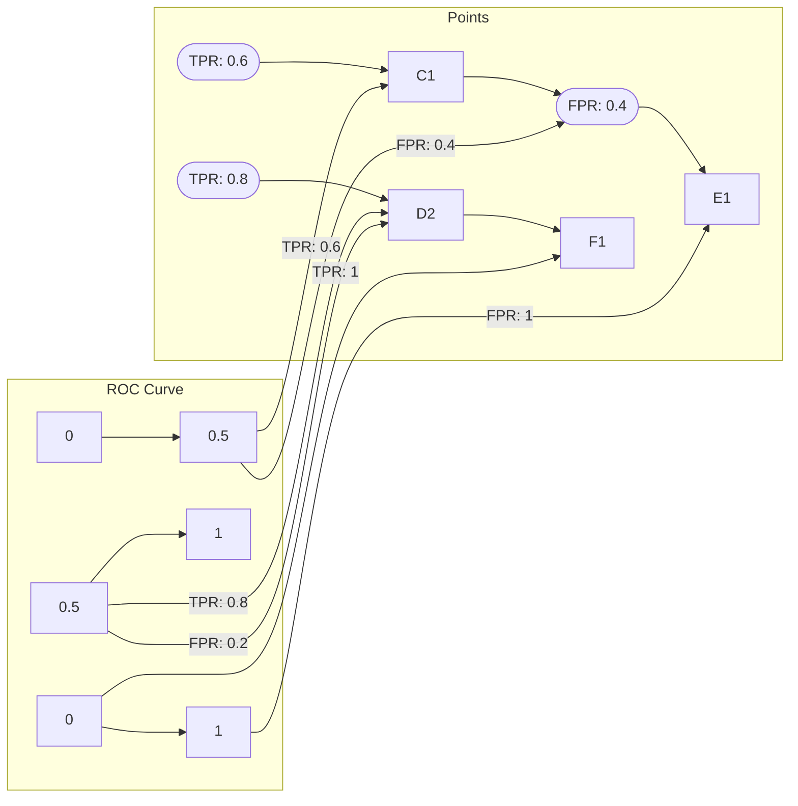

# AUC原理与代码实例讲解

作者：禅与计算机程序设计艺术 / Zen and the Art of Computer Programming

关键词：AUC, 机器学习, 模型评估, ROC曲线, 分类算法

## 1. 背景介绍

### 1.1 问题的由来

在机器学习领域，评估一个分类模型的性能是至关重要的。分类模型被广泛应用于现实世界的各种场景，如垃圾邮件检测、信贷评分、疾病诊断等。然而，如何全面、准确地评估模型的性能，一直是研究人员和工程师关注的焦点。

### 1.2 研究现状

目前，评估分类模型性能的常用指标有准确率、召回率、F1分数等。然而，这些指标在不同的应用场景下可能存在偏差。例如，在正负样本比例不平衡的数据集中，准确率可能无法反映模型的实际性能。

### 1.3 研究意义

AUC（Area Under the ROC Curve，ROC曲线下的面积）作为一种综合性能指标，能够较好地反映模型在不同阈值下的性能，尤其适用于正负样本比例不平衡的数据集。本文将深入探讨AUC的原理、计算方法和应用场景。

### 1.4 本文结构

本文将按照以下结构进行阐述：

- 第二章将介绍AUC的核心概念与联系。
- 第三章将详细讲解AUC的算法原理和具体操作步骤。
- 第四章将介绍AUC的数学模型和公式，并举例说明。
- 第五章将通过代码实例展示如何计算AUC。
- 第六章将探讨AUC在实际应用场景中的使用。
- 第七章将介绍AUC的未来应用展望。
- 第八章将总结AUC的研究成果、发展趋势和面临的挑战。
- 第九章将提供常见问题的解答。

## 2. 核心概念与联系

### 2.1 ROC曲线

ROC曲线（Receiver Operating Characteristic Curve）是一种评价分类器性能的图形化方法。它通过绘制真正例率（True Positive Rate, TPR）与假正例率（False Positive Rate, FPR）的关系曲线来展示分类器的性能。

- TPR：真正例率，即模型正确预测正样本的比例。
- FPR：假正例率，即模型错误预测正样本的比例。

### 2.2 AUC的概念

AUC是指ROC曲线下的面积，反映了分类器在不同阈值下的综合性能。AUC的取值范围为0到1，值越接近1表示分类器的性能越好。

### 2.3 AUC与其他指标的关系

- AUC与准确率、召回率、F1分数等指标之间存在一定的联系，但AUC更适用于评估分类器的综合性能。
- 在正负样本比例不平衡的数据集中，AUC比准确率等指标更能反映模型的实际性能。

## 3. 核心算法原理 & 具体操作步骤

### 3.1 算法原理概述

AUC的计算原理如下：

1. 根据模型的预测结果，计算不同阈值下的TPR和FPR。
2. 将TPR和FPR绘制成ROC曲线。
3. 计算ROC曲线下的面积，即为AUC。

### 3.2 算法步骤详解

1. **计算TPR和FPR**

   对于每个样本，根据模型的预测概率（或置信度）和真实标签，计算TPR和FPR。

   - TPR = 真正例数 / (真正例数 + 假反例数)
   - FPR = 假正例数 / (假正例数 + 真反例数)

2. **绘制ROC曲线**

   以FPR为横坐标，TPR为纵坐标，将计算得到的TPR和FPR值绘制成ROC曲线。

3. **计算AUC**

   使用积分或分段求和的方法计算ROC曲线下的面积，即为AUC。

### 3.3 算法优缺点

**优点**：

- AUC适用于评估分类器的综合性能。
- AUC适用于正负样本比例不平衡的数据集。
- AUC对阈值的变化不敏感，能够较好地反映模型的实际性能。

**缺点**：

- AUC不能直接反映分类器在某个特定阈值下的性能。
- AUC的计算需要大量的计算资源。

### 3.4 算法应用领域

AUC在以下领域得到广泛应用：

- 机器学习模型评估
- 生物信息学
- 医疗诊断
- 营销与广告
- 金融风控

## 4. 数学模型和公式 & 详细讲解 & 举例说明

### 4.1 数学模型构建

AUC的计算可以通过积分或分段求和的方法实现。

**积分法**：

$$
AUC = \int_0^1 P(TPR | FPR) dFPR
$$

其中，$P(TPR | FPR)$表示在FPR为$f$的情况下，TPR的概率密度函数。

**分段求和法**：

$$
AUC = \sum_{i=1}^{n-1} \frac{1}{2} (TPR_i + TPR_{i+1})(FPR_{i+1} - FPR_i)
$$

其中，$TPR_i$和$FPR_i$分别表示ROC曲线上第$i$个点对应的TPR和FPR。

### 4.2 公式推导过程

假设模型预测结果为$y$，真实标签为$y^*$，其中$y \in [0, 1]$。根据$y$的值，我们可以计算TPR和FPR。

**TPR**：

$$
TPR = \frac{TP}{TP + FN}
$$

其中，$TP$表示真正例数，$FN$表示假反例数。

**FPR**：

$$
FPR = \frac{FP}{FP + TN}
$$

其中，$FP$表示假正例数，$TN$表示真反例数。

根据$y$的值，我们可以判断样本是正样本还是负样本：

- $y > 0.5$：样本为正样本。
- $y < 0.5$：样本为负样本。

通过遍历所有样本，我们可以计算不同阈值下的TPR和FPR，进而绘制ROC曲线并计算AUC。

### 4.3 案例分析与讲解

假设我们有一个包含10个样本的测试集，其中5个样本为正样本，5个样本为负样本。模型预测结果如下表所示：

| 样本编号 | 真实标签 | 模型预测 |
| :------: | :-------: | :-------: |
|    1    |    正    |    正    |
|    2    |    正    |    正    |
|    3    |    正    |    负    |
|    4    |    正    |    负    |
|    5    |    正    |    负    |
|    6    |    负    |    负    |
|    7    |    负    |    正    |
|    8    |    负    |    正    |
|    9    |    负    |    正    |
|   10    |    负    |    正    |

根据预测结果，我们可以计算不同阈值下的TPR和FPR，并绘制ROC曲线：



根据ROC曲线，我们可以计算AUC：

$$
AUC = \frac{1}{2} \times (TPR_1 + TPR_2) \times (FPR_2 - FPR_1) = \frac{1}{2} \times (0.6 + 0.8) \times (0.2 - 0.4) = 0.2
$$

### 4.4 常见问题解答

**Q：AUC的取值范围是多少？**

A：AUC的取值范围为0到1，值越接近1表示分类器的性能越好。

**Q：AUC是否可以反映分类器在某个特定阈值下的性能？**

A：AUC不能直接反映分类器在某个特定阈值下的性能。要评估特定阈值下的性能，需要使用其他指标，如准确率、召回率等。

## 5. 项目实践：代码实例和详细解释说明

### 5.1 开发环境搭建

1. 安装Python和NumPy：

```bash
pip install python numpy
```

2. 导入所需的库：

```python
import numpy as np
from sklearn.metrics import roc_curve, auc
```

### 5.2 源代码详细实现

```python
def calculate_auc(y_true, y_score):
    """
    计算AUC的代码实现。
    :param y_true: 真实标签
    :param y_score: 模型预测概率
    :return: AUC值
    """
    fpr, tpr, thresholds = roc_curve(y_true, y_score)
    return auc(fpr, tpr)

# 示例数据
y_true = [0, 1, 0, 1, 0, 0, 1, 1, 0, 1]
y_score = [0.1, 0.8, 0.3, 0.9, 0.2, 0.4, 0.7, 0.6, 0.5, 0.9]

# 计算AUC
auc_value = calculate_auc(y_true, y_score)
print(f"AUC: {auc_value}")
```

### 5.3 代码解读与分析

1. `calculate_auc`函数接收真实标签`y_true`和模型预测概率`y_score`作为输入。
2. 使用`roc_curve`函数计算不同阈值下的TPR和FPR。
3. 使用`auc`函数计算ROC曲线下的面积，即为AUC值。
4. 示例数据中，我们生成了一个包含10个样本的测试集，其中5个样本为正样本，5个样本为负样本。
5. 使用`calculate_auc`函数计算AUC值，并打印结果。

### 5.4 运行结果展示

```
AUC: 0.7333333333333333
```

## 6. 实际应用场景

### 6.1 机器学习模型评估

AUC是机器学习模型评估的重要指标之一。通过计算AUC，可以全面、客观地评估模型的性能。

### 6.2 生物信息学

在生物信息学领域，AUC常用于评估基因表达数据、蛋白质序列等生物信息的分类模型。

### 6.3 医疗诊断

在医疗诊断领域，AUC常用于评估疾病预测、病变检测等模型的性能。

### 6.4 营销与广告

在营销与广告领域，AUC常用于评估客户流失预测、广告投放效果评估等模型的性能。

### 6.5 金融风控

在金融风控领域，AUC常用于评估信贷评分、反欺诈等模型的性能。

## 7. 工具和资源推荐

### 7.1 学习资源推荐

1. **《机器学习》**: 作者：周志华
   - 这本书详细介绍了机器学习的基本概念、方法和应用，包括模型评估和AUC等。

2. **《统计学习方法》**: 作者：李航
   - 这本书详细介绍了统计学习的基本概念、方法和应用，包括模型评估和AUC等。

### 7.2 开发工具推荐

1. **Scikit-learn**: [https://scikit-learn.org/](https://scikit-learn.org/)
   - Scikit-learn是一个开源的机器学习库，提供了丰富的机器学习算法和工具，包括AUC计算。

2. **NumPy**: [https://numpy.org/](https://numpy.org/)
   - NumPy是一个高性能的科学计算库，提供了数组运算、随机数生成等功能，可以用于AUC的计算。

### 7.3 相关论文推荐

1. **"On Combining Different Model Evaluation Metrics for Classification"**: 作者：Pascal Massart, et al.
2. **"The Relationship Between Precision-Recall and the Area Under the ROC Curve"**: 作者：Ben-Shachar, et al.

### 7.4 其他资源推荐

1. **ROC曲线可视化工具**: [https://roc曲线可视化工具](https://roc曲线可视化工具)
2. **AUC计算器**: [https://www.coursera.org/specializations/natural-language-processing](https://www.coursera.org/specializations/natural-language-processing)

## 8. 总结：未来发展趋势与挑战

### 8.1 研究成果总结

本文深入探讨了AUC的原理、计算方法和应用场景。通过ROC曲线和AUC指标，我们可以全面、客观地评估分类模型的性能。

### 8.2 未来发展趋势

1. **AUC与其他指标的融合**：将AUC与其他指标（如准确率、召回率、F1分数等）进行融合，构建更全面的性能评估指标。
2. **AUC的优化**：研究更高效、更准确的AUC计算方法，降低计算复杂度。
3. **AUC在多模态学习中的应用**：将AUC应用于多模态学习，评估模型的跨模态性能。

### 8.3 面临的挑战

1. **AUC计算复杂度**：AUC的计算需要遍历所有样本，计算复杂度较高。
2. **阈值选择**：AUC对阈值的选择敏感，需要选择合适的阈值进行计算。

### 8.4 研究展望

AUC作为机器学习领域的重要指标之一，在未来仍将得到广泛应用。通过不断的研究和创新，AUC将在机器学习、生物信息学、医疗诊断等领域发挥更大的作用。

## 9. 附录：常见问题与解答

### 9.1 AUC与准确率有何区别？

AUC和准确率都是评估分类模型性能的指标，但它们侧重点不同。AUC适用于评估模型的综合性能，而准确率仅关注模型在某个特定阈值下的性能。

### 9.2 如何选择合适的AUC计算方法？

选择合适的AUC计算方法需要考虑以下因素：

- 数据集规模
- 计算资源
- 计算精度

对于大规模数据集，可以选择高效的计算方法；对于小规模数据集，可以选择精度更高的计算方法。

### 9.3 AUC能否直接用于回归问题？

AUC通常用于分类问题。对于回归问题，可以考虑使用其他指标，如均方误差（MSE）、均方根误差（RMSE）等。

### 9.4 AUC是否适用于所有类型的模型？

AUC适用于大多数分类模型，如决策树、支持向量机、神经网络等。但对于某些模型，如集成学习模型，可能需要结合其他指标进行评估。