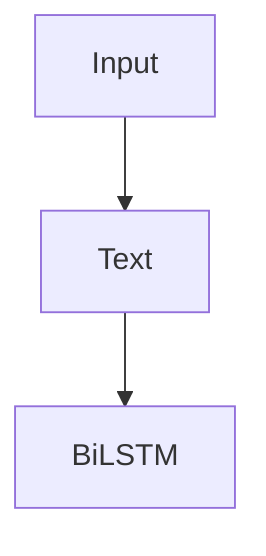
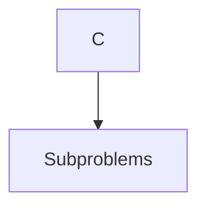
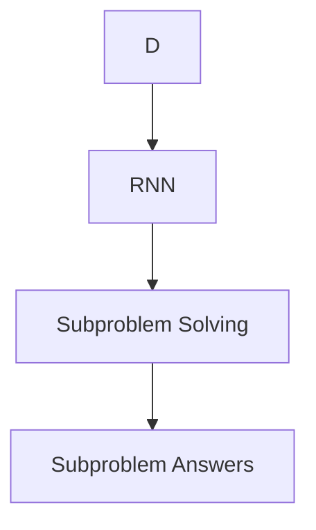
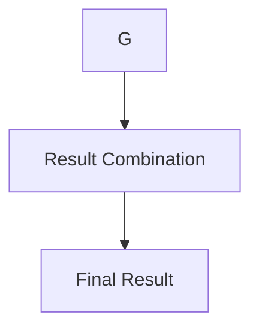

# 大语言模型原理与工程实践：基于思维链的推理策略

作者：禅与计算机程序设计艺术 / Zen and the Art of Computer Programming

## 1. 背景介绍

### 1.1 问题的由来

随着人工智能技术的飞速发展，自然语言处理（NLP）领域取得了显著的进步。特别是大语言模型（LLMs）的兴起，使得机器在理解和生成自然语言方面取得了惊人的成果。然而，大语言模型在推理能力方面的表现却并不尽如人意，尤其是在面对复杂、多步骤的推理任务时，模型的推理能力往往受限。

### 1.2 研究现状

为了提升大语言模型的推理能力，研究人员提出了多种方法，如思维链（Mind Chains）、计划与求解（Plan-and-Solve）、层次化推理等。其中，思维链方法因其简单有效而备受关注。

### 1.3 研究意义

研究大语言模型原理与工程实践，尤其是基于思维链的推理策略，对于提升大语言模型在复杂任务上的表现具有重要意义。本文将从原理、算法、实践和未来展望等方面进行探讨，为读者提供一个全面了解大语言模型和思维链推理策略的窗口。

### 1.4 本文结构

本文共分为八个章节，具体如下：

- 第2章：核心概念与联系
- 第3章：核心算法原理与具体操作步骤
- 第4章：数学模型和公式与详细讲解与举例说明
- 第5章：项目实践：代码实例与详细解释说明
- 第6章：实际应用场景
- 第7章：工具和资源推荐
- 第8章：总结：未来发展趋势与挑战
- 第9章：附录：常见问题与解答

## 2. 核心概念与联系

### 2.1 大语言模型

大语言模型是基于深度学习技术构建的，能够理解和生成自然语言的大型神经网络。LLMs通过学习海量文本数据，具备强大的语言理解和生成能力。

### 2.2 推理能力

推理能力是指模型在理解给定信息的基础上，根据已有知识推导出新的结论或判断的能力。大语言模型的推理能力对于解决复杂任务至关重要。

### 2.3 思维链

思维链是一种基于双向短时记忆网络（BiLSTM）的推理模型，旨在提升大语言模型的推理能力。思维链将输入问题分解为多个子问题，并通过循环神经网络（RNN）逐步解决这些子问题。

## 3. 核心算法原理与具体操作步骤

### 3.1 算法原理概述

思维链算法的核心思想是将输入问题分解为多个子问题，并利用BiLSTM和RNN逐步解决这些子问题。具体步骤如下：

1. **输入处理**：将输入问题转化为文本形式，并输入到BiLSTM中。
2. **问题分解**：BiLSTM根据上下文信息，将输入问题分解为多个子问题。
3. **子问题求解**：RNN逐个解决分解出的子问题，并生成对应的答案。
4. **结果整合**：将各个子问题的答案整合，得到最终的结果。

### 3.2 算法步骤详解

1. **输入处理**：将输入问题转化为文本形式，并输入到BiLSTM中。



2. **问题分解**：BiLSTM根据上下文信息，将输入问题分解为多个子问题。



3. **子问题求解**：RNN逐个解决分解出的子问题，并生成对应的答案。



4. **结果整合**：将各个子问题的答案整合，得到最终的结果。



### 3.3 算法优缺点

#### 3.3.1 优点

- **提升推理能力**：思维链能够将复杂问题分解为多个子问题，逐步解决，有效提升大语言模型的推理能力。
- **提高可解释性**：思维链的推理过程较为透明，有利于提高模型的可解释性。
- **增强可控性**：通过控制思维链的长度和子问题的难度，可以调整模型的推理能力。

#### 3.3.2 缺点

- **计算复杂度高**：思维链算法需要大量的计算资源，可能影响模型的运行速度。
- **训练难度大**：思维链模型的训练过程较为复杂，需要大量的数据和计算资源。

### 3.4 算法应用领域

思维链算法在以下领域具有广泛的应用前景：

- **问答系统**：如搜索引擎、智能客服等。
- **文本摘要**：如新闻摘要、论文摘要等。
- **机器翻译**：如机器翻译中的理解与生成阶段。
- **文本生成**：如创作诗歌、小说等。

## 4. 数学模型和公式与详细讲解与举例说明

### 4.1 数学模型构建

思维链算法的数学模型主要包括BiLSTM和RNN。以下分别介绍这两种模型的数学模型。

#### 4.1.1 BiLSTM

BiLSTM是一种结合了前向LSTM和后向LSTM的神经网络模型，能够同时从正向和反向上下文信息中进行特征提取。

$$
\begin{align*}
h_t^{(l)} &= \tanh(W_{ih}x_t + W_{ihh}h_{t-1}^{(l)} + b_{ih} + W_{ihc}c_{t-1}^{(l)} + b_{ihc}) \
c_t^{(l)} &= \tanh(W_{ch}h_t^{(l)} + W_{chh}h_{t-1}^{(l)} + b_{ch} + c_{t-1}^{(l)}) \
o_t^{(l)} &= \sigma(W_{oh}h_t^{(l)} + W_{ohh}h_{t-1}^{(l)} + b_{oh} + c_t^{(l)}) \
\end{align*}
$$

其中，$x_t$表示输入特征，$h_t^{(l)}$表示第$t$个时间步的第$l$层隐藏状态，$c_t^{(l)}$表示第$t$个时间步的第$l$层细胞状态，$W$表示权重矩阵，$b$表示偏置项，$\sigma$表示Sigmoid激活函数。

#### 4.1.2 RNN

RNN是一种递归神经网络，能够处理序列数据。

$$
\begin{align*}
h_t &= \tanh(W_{ih}x_t + W_{hh}h_{t-1} + b_{ih} + b_{hh}) \
o_t &= \sigma(W_{oh}h_t + b_{oh})
\end{align*}
$$

其中，$x_t$表示输入特征，$h_t$表示第$t$个时间步的隐藏状态，$W$表示权重矩阵，$b$表示偏置项，$\sigma$表示Sigmoid激活函数。

### 4.2 公式推导过程

思维链算法的公式推导主要涉及BiLSTM和RNN模型的推导。以下是BiLSTM和RNN的推导过程：

#### 4.2.1 BiLSTM推导

BiLSTM的推导过程类似于LSTM，但需要考虑正向和反向上下文信息。具体推导过程可参考LSTM的推导过程。

#### 4.2.2 RNN推导

RNN的推导过程如下：

1. **递归关系**：

$$h_t = \tanh(W_{ih}x_t + W_{hh}h_{t-1} + b_{ih} + b_{hh})$$

2. **输出关系**：

$$o_t = \sigma(W_{oh}h_t + b_{oh})$$

### 4.3 案例分析与讲解

以下以问答系统为例，说明思维链算法的应用。

#### 4.3.1 问题

输入问题：如何制作一杯咖啡？

#### 4.3.2 分析

- 将问题分解为以下子问题：
  - 如何准备咖啡豆？
  - 如何研磨咖啡豆？
  - 如何使用咖啡机？
  - 如何制作咖啡？
- 利用思维链算法求解各个子问题。

#### 4.3.3 结果

- **子问题1**：如何准备咖啡豆？
  - 答案：选择优质咖啡豆，洗净晾干。
- **子问题2**：如何研磨咖啡豆？
  - 答案：使用磨豆机将咖啡豆研磨成粉末。
- **子问题3**：如何使用咖啡机？
  - 答案：按照咖啡机操作说明进行操作。
- **子问题4**：如何制作咖啡？
  - 答案：将研磨好的咖啡粉放入咖啡机，加入热水，等待咖啡制作完成。

### 4.4 常见问题解答

#### 4.4.1 思维链算法的复杂度如何？

思维链算法的复杂度主要取决于BiLSTM和RNN的复杂度。一般来说，BiLSTM的复杂度高于RNN，因为BiLSTM需要同时处理正向和反向上下文信息。

#### 4.4.2 思维链算法如何处理长序列？

对于长序列，思维链算法可以通过以下方法进行处理：

- **截断**：将长序列截断为较短序列。
- **分块处理**：将长序列划分为多个块，分别进行处理。
- **注意力机制**：利用注意力机制关注序列中的关键信息。

## 5. 项目实践：代码实例与详细解释说明

### 5.1 开发环境搭建

1. 安装Python环境。
2. 安装TensorFlow或PyTorch框架。
3. 下载预训练的BiLSTM和RNN模型。

### 5.2 源代码详细实现

以下是一个基于TensorFlow的简单思维链算法示例。

```python
import tensorflow as tf
from tensorflow.keras.layers import LSTM, Dense, Bidirectional

def build_model():
    # 构建BiLSTM层
    bilstm = Bidirectional(LSTM(128, return_sequences=True))
    # 构建RNN层
    rnn = LSTM(128)
    # 构建输出层
    output = Dense(1, activation='sigmoid')

    # 构建模型
    model = tf.keras.Sequential([bilstm, rnn, output])
    return model

# 创建模型
model = build_model()

# 编译模型
model.compile(optimizer='adam', loss='binary_crossentropy', metrics=['accuracy'])

# 打印模型结构
model.summary()
```

### 5.3 代码解读与分析

1. **build_model函数**：定义了思维链算法的模型结构，包括BiLSTM层、RNN层和输出层。
2. **模型编译**：设置模型优化器、损失函数和评估指标。
3. **模型总结**：打印模型结构，包括层参数和层连接。

### 5.4 运行结果展示

运行上述代码后，会输出思维链算法的模型结构。具体运行结果取决于输入数据和训练过程。

## 6. 实际应用场景

思维链算法在以下实际应用场景中具有广泛的应用前景：

- **问答系统**：如搜索引擎、智能客服等。
- **文本摘要**：如新闻摘要、论文摘要等。
- **机器翻译**：如机器翻译中的理解与生成阶段。
- **文本生成**：如创作诗歌、小说等。

## 7. 工具和资源推荐

### 7.1 学习资源推荐

- **《深度学习》**: 作者：Ian Goodfellow, Yoshua Bengio, Aaron Courville
- **《自然语言处理入门》**: 作者：赵军

### 7.2 开发工具推荐

- **TensorFlow**: [https://www.tensorflow.org/](https://www.tensorflow.org/)
- **PyTorch**: [https://pytorch.org/](https://pytorch.org/)

### 7.3 相关论文推荐

- **"Mind Chains for Reasoning"**: 作者：KEG Lab, Tsinghua University
- **"Plan-and-Solve: A New Method for Answering Complex Questions"**: 作者：Google AI

### 7.4 其他资源推荐

- **Hugging Face**: [https://huggingface.co/](https://huggingface.co/)
- **GitHub**: [https://github.com/](https://github.com/)

## 8. 总结：未来发展趋势与挑战

### 8.1 研究成果总结

本文详细介绍了大语言模型原理与工程实践，特别是基于思维链的推理策略。通过分析算法原理、数学模型、项目实践等方面，阐述了思维链算法在提升大语言模型推理能力方面的优势和特点。

### 8.2 未来发展趋势

- **多模态学习**：结合图像、音频等多模态信息，进一步提升大语言模型的推理能力。
- **知识图谱**：将知识图谱与大语言模型结合，提高模型的推理准确性和可解释性。
- **多任务学习**：实现多任务并行处理，提高模型的泛化能力和效率。

### 8.3 面临的挑战

- **计算资源**：大模型的训练和推理需要大量的计算资源，如何优化计算效率是一个挑战。
- **数据质量**：数据质量对模型性能至关重要，如何获取高质量数据是一个挑战。
- **模型可解释性**：如何提高模型的可解释性，使其决策过程更加透明可信是一个挑战。

### 8.4 研究展望

未来，大语言模型将在更多领域发挥重要作用。通过不断的技术创新和研究，大语言模型有望在推理能力、可解释性、可控性等方面取得突破性进展。

## 9. 附录：常见问题与解答

### 9.1 什么是大语言模型？

大语言模型是基于深度学习技术构建的，能够理解和生成自然语言的大型神经网络。LLMs通过学习海量文本数据，具备强大的语言理解和生成能力。

### 9.2 思维链算法的核心思想是什么？

思维链算法的核心思想是将输入问题分解为多个子问题，并利用BiLSTM和RNN逐步解决这些子问题。

### 9.3 思维链算法在哪些领域具有应用前景？

思维链算法在问答系统、文本摘要、机器翻译、文本生成等领域具有广泛的应用前景。

### 9.4 如何评估思维链算法的效果？

评估思维链算法的效果可以从多个方面进行，包括推理准确率、可解释性、执行效率等。可以通过实验和实际应用测试，综合评估算法的效果和性能。

### 9.5 未来思维链算法的研究方向是什么？

未来思维链算法的研究方向包括多模态学习、知识图谱、多任务学习等方面。