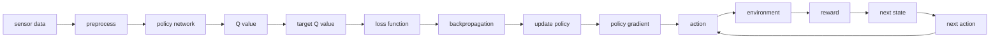

                 

# 一切皆是映射：从监督学习到DQN强化学习的思想转变

## 1. 背景介绍

人工智能(AI)的崛起离不开数据和算法的双轮驱动。而学习和训练，作为AI技术的核心要素，历来受到学者和工程师的广泛关注。特别是近年来，机器学习与强化学习的结合，为求解复杂任务提供了新的思路。

在这篇文章中，我们将从监督学习(monitored learning)的视角出发，逐步过渡到DQN(reinforcement learning, Q-learning, deep Q-learning)强化学习的思想转变，揭示两者的联系与区别。通过对比分析，探讨其各自的优势和适用场景，启发读者对AI技术的更深入理解。

## 2. 核心概念与联系

### 2.1 核心概念概述

在深入讨论监督学习和DQN强化学习之前，首先需要理解两者的核心概念和原理。

- **监督学习(monitored learning)**：通过有标签的数据集，训练模型学习输入(X)到输出(Y)的映射关系，即 $f(x) \rightarrow y$。模型通常以损失函数为优化目标，通过梯度下降等优化算法不断迭代，逼近理想映射。监督学习常用于分类、回归等任务。

- **DQN(deep Q-learning, 深度Q学习)**：通过无标签的数据集，训练智能体(代理)学习在环境中的最优决策策略，即 $Q(s,a) \rightarrow r$。智能体通过探索(Exploration)和利用(Exploitation)策略，逐步优化决策过程，以最大化预期累积奖励。DQN主要用于控制策略、游戏等问题。

- **强化学习(reinforcement learning)**：通过智能体与环境的交互，通过奖励反馈不断优化决策策略，即 $a \rightarrow R(s,a)$。强化学习强调智能体对环境的探索与适应，通过最大化长期累积奖励实现目标。

- **状态(state)、动作(action)、奖励(reward)、下一步状态(next state)和策略(policy)**：DQN强化学习中，智能体在每个时刻 $t$ 观察到状态 $s_t$，采取动作 $a_t$，接收环境奖励 $r_t$，观察到下一时刻状态 $s_{t+1}$，并根据当前状态和动作的Q值 $Q(s_t,a_t)$ 选择策略 $π(s_t,a_t)$。

### 2.2 核心概念原理和架构的 Mermaid 流程图



在这个流程图中，传感器数据经过预处理，输入策略网络得到动作值，并通过动作值计算Q值，与目标Q值比较得到损失，反向传播更新策略网络参数，形成循环迭代的过程。

### 2.3 核心概念的联系

虽然监督学习和DQN强化学习的目标略有不同，但本质上都是通过数据和模型构建输入到输出的映射关系，从而实现某一类目标。两者均强调通过优化算法不断逼近理想映射，只是具体的优化对象和目标不同。

监督学习关注输入(X)和输出(Y)的映射，而DQN强化学习关注状态(state)和动作(action)的映射。两者都需要通过优化算法逐步逼近最优解，并具有迭代和反馈的特性。

## 3. 核心算法原理 & 具体操作步骤

### 3.1 算法原理概述

从监督学习到DQN强化学习的思想转变，主要体现在以下几个方面：

- **优化目标的变化**：监督学习通过最小化损失函数，优化模型参数；而DQN强化学习通过最大化Q值，优化策略网络参数。

- **数据标签的变化**：监督学习使用有标签的数据集进行训练；而DQN强化学习使用无标签的数据集，通过智能体与环境的交互生成有奖惩的反馈信号。

- **模型的角色变化**：监督学习中模型相当于一个黑盒映射器，输入已知特征得到输出；而DQN强化学习中模型不仅负责映射，还负责策略优化，具有自适应和自学习的能力。

### 3.2 算法步骤详解

以下是监督学习和DQN强化学习的详细步骤详解：

#### 监督学习的详细步骤

1. **数据预处理**：对输入数据进行归一化、标准化等预处理，以便模型更好地进行学习。
2. **模型构建**：选择合适的模型结构，如线性回归、神经网络等，设置损失函数和优化器。
3. **模型训练**：使用训练集数据，通过梯度下降等优化算法，不断迭代模型参数。
4. **模型评估**：使用验证集和测试集数据，评估模型性能，如准确率、精度等。
5. **模型部署**：将训练好的模型应用到实际问题中，进行推理和预测。

#### DQN强化学习的详细步骤

1. **环境设定**：定义环境和状态空间，设定状态、动作、奖励等参数。
2. **策略网络构建**：设计策略网络，用于估计Q值。
3. **智能体训练**：使用深度Q网络，通过探索和利用策略，在环境中不断训练和优化。
4. **Q值更新**：根据当前状态和动作的Q值，更新目标Q值，计算损失函数。
5. **参数更新**：通过反向传播算法，更新策略网络参数，以最小化Q值与目标Q值的差。
6. **状态更新**：根据智能体的动作和环境反馈，更新状态和动作。
7. **循环迭代**：重复上述步骤，直到达到预设的训练轮数或停止条件。

### 3.3 算法优缺点

#### 监督学习的优缺点

**优点**：
1. **数据驱动**：有标签的数据可以直接用于训练，减少探索成本。
2. **简单易懂**：模型结构简单，易于理解和实现。
3. **效果显著**：在标注数据质量较高的情况下，能够快速提升模型性能。

**缺点**：
1. **数据依赖**：高度依赖标注数据，数据获取成本高。
2. **泛化能力有限**：模型容易过拟合训练数据，泛化性能较差。
3. **动态变化难以应对**：一旦数据分布发生变化，模型性能可能急剧下降。

#### DQN强化学习的优缺点

**优点**：
1. **无标签数据**：不需要标注数据，通过智能体与环境的交互生成有奖惩反馈。
2. **动态适应**：智能体能够根据环境变化自适应调整策略。
3. **探索能力**：通过探索策略，智能体可以在未知状态中找到最优解。

**缺点**：
1. **探索与利用平衡**：在初始阶段，智能体需要权衡探索和利用策略，找到最优平衡点。
2. **稳定性问题**：智能体在训练过程中可能出现不稳定现象，如Q值震荡、参数更新不稳定等。
3. **高维度状态空间**：在高维度状态空间中，智能体的训练和优化难度增加。

### 3.4 算法应用领域

#### 监督学习的应用领域

1. **图像分类**：通过大规模图像标注数据，训练分类模型识别图片中的物体。
2. **文本分类**：通过文本标注数据，训练模型对文本进行情感分析、主题分类等。
3. **回归问题**：通过标注数据，训练回归模型进行数值预测。
4. **推荐系统**：通过用户行为和物品标注数据，训练推荐模型预测用户偏好。
5. **自然语言处理**：通过标注数据，训练语言模型进行翻译、问答等任务。

#### DQN强化学习的应用领域

1. **游戏AI**：训练智能体在各种游戏中最大化得分。
2. **机器人控制**：通过控制动作和奖励反馈，训练智能体在特定任务中执行。
3. **资源管理**：优化资源分配策略，最大化系统收益。
4. **金融交易**：通过市场反馈，训练智能体进行股票、期权等交易。
5. **自动驾驶**：通过传感器数据和驾驶动作反馈，训练智能体安全驾驶。

## 4. 数学模型和公式 & 详细讲解 & 举例说明

### 4.1 数学模型构建

#### 监督学习的数学模型构建

设监督学习的数据集为 $D=\{(x_i,y_i)\}_{i=1}^N$，其中 $x_i \in \mathbb{R}^m$ 为输入特征，$y_i \in \mathbb{R}^k$ 为输出标签。监督学习的目标是找到最优模型参数 $\theta$，最小化损失函数 $\mathcal{L}$：

$$
\theta^* = \mathop{\arg\min}_{\theta} \mathcal{L}(\theta)
$$

其中 $\mathcal{L}$ 为模型在训练集上的平均损失：

$$
\mathcal{L}(\theta) = \frac{1}{N}\sum_{i=1}^N \ell(f_\theta(x_i),y_i)
$$

常见损失函数包括均方误差损失、交叉熵损失等。

#### DQN强化学习的数学模型构建

设智能体在状态 $s_t$ 下采取动作 $a_t$，接收环境奖励 $r_t$，观察到下一时刻状态 $s_{t+1}$。DQN强化学习的目标是找到最优策略 $\pi$，最大化长期累积奖励 $R$：

$$
\pi^* = \mathop{\arg\max}_{\pi} \mathbb{E}[R]
$$

其中 $R$ 为智能体在特定状态下的长期累积奖励，通过状态动作序列 $(s_0,a_0,r_0,...,s_T)$ 计算：

$$
R = \sum_{t=0}^T \gamma^t r_t
$$

其中 $\gamma$ 为折扣因子，通常在0.9至0.99之间。

DQN强化学习的核心是Q值函数 $Q(s,a)$，通过估计Q值函数，智能体能够选择最优动作。Q值函数的更新公式如下：

$$
Q(s_t,a_t) = Q_{old}(s_t,a_t) + \alpha(r_t + \gamma \max_{a'} Q_{old}(s_{t+1},a'))
$$

其中 $\alpha$ 为学习率，通常取0.01至0.1之间。

### 4.2 公式推导过程

#### 监督学习公式推导

监督学习通过最小化损失函数 $\mathcal{L}$ 优化模型参数 $\theta$：

$$
\frac{\partial \mathcal{L}}{\partial \theta} = \frac{1}{N}\sum_{i=1}^N -\frac{\partial \ell(f_\theta(x_i),y_i)}{\partial \theta}
$$

通过反向传播算法，计算梯度并更新模型参数：

$$
\theta \leftarrow \theta - \eta \frac{\partial \mathcal{L}}{\partial \theta}
$$

其中 $\eta$ 为学习率。

#### DQN强化学习公式推导

DQN强化学习通过最大化Q值函数 $Q(s,a)$ 优化策略网络参数 $\theta$：

$$
\frac{\partial \mathcal{L}}{\partial \theta} = \alpha \sum_{i=1}^N (r_i + \gamma \max_{a'} Q_{old}(s_{i+1},a')) - Q_{old}(s_i,a_i)
$$

通过反向传播算法，计算梯度并更新策略网络参数：

$$
\theta \leftarrow \theta - \eta \frac{\partial \mathcal{L}}{\partial \theta}
$$

其中 $\eta$ 为学习率，通常取0.01至0.1之间。

### 4.3 案例分析与讲解

#### 案例一：图像分类

在图像分类任务中，监督学习的常见模型为卷积神经网络(CNN)。设输入为图像像素向量 $x_i \in \mathbb{R}^{h \times w \times c}$，输出为类别向量 $y_i \in \{1,2,...,C\}$，其中 $C$ 为类别数。监督学习通过最小化交叉熵损失：

$$
\mathcal{L}(\theta) = -\frac{1}{N}\sum_{i=1}^N \sum_{c=1}^C y_{i,c} \log f_\theta(x_i,c)
$$

其中 $f_\theta(x_i,c)$ 为模型在输入 $x_i$ 下对类别 $c$ 的预测概率。

#### 案例二：游戏AI

在训练游戏AI时，DQN强化学习通过智能体与环境交互生成训练数据。设状态 $s_t$ 为游戏中的当前状态，动作 $a_t$ 为当前游戏操作，奖励 $r_t$ 为当前游戏得分，状态 $s_{t+1}$ 为下一个状态。智能体通过Q值函数的更新，选择最优动作：

$$
Q(s_t,a_t) = Q_{old}(s_t,a_t) + \alpha(r_t + \gamma \max_{a'} Q_{old}(s_{t+1},a'))
$$

其中 $\alpha$ 为学习率，通常取0.01至0.1之间。

## 5. 项目实践：代码实例和详细解释说明

### 5.1 开发环境搭建

#### 监督学习开发环境搭建

1. **安装Python**：从官网下载并安装最新版本的Python，建议安装3.8或以上版本。
2. **安装PyTorch**：通过pip安装PyTorch库，安装命令为：
```bash
pip install torch torchvision torchaudio
```

3. **安装TensorBoard**：用于可视化训练过程，安装命令为：
```bash
pip install tensorboard
```

4. **安装Pandas**：用于数据处理，安装命令为：
```bash
pip install pandas
```

5. **安装Keras**：用于构建和训练监督学习模型，安装命令为：
```bash
pip install keras
```

### 5.2 源代码详细实现

#### 监督学习的代码实现

以下是使用Keras实现简单线性回归模型的示例代码：

```python
import numpy as np
from keras.models import Sequential
from keras.layers import Dense
from keras.losses import MeanSquaredError

# 定义训练数据
X_train = np.array([[1, 2], [2, 4], [3, 6], [4, 8]])
y_train = np.array([1, 3, 5, 7])

# 构建模型
model = Sequential()
model.add(Dense(units=1, input_dim=2))
model.compile(loss=MeanSquaredError(), optimizer='adam')

# 训练模型
model.fit(X_train, y_train, epochs=50, batch_size=1)

# 评估模型
X_test = np.array([[5, 10], [6, 12]])
y_test = np.array([10, 12])
model.evaluate(X_test, y_test)
```

#### DQN强化学习的代码实现

以下是使用TensorFlow实现DQN强化学习的示例代码：

```python
import tensorflow as tf
import numpy as np

# 定义状态空间和动作空间
num_states = 10
num_actions = 2

# 定义智能体和环境
class Agent:
    def __init__(self):
        self.state = None
        self.epsilon = 0.1
        self.epsilon_min = 0.01
        self.epsilon_decay = 0.995

    def act(self):
        if np.random.rand() <= self.epsilon:
            return np.random.randint(0, num_actions)
        else:
            return np.argmax(self.q_table[self.state, :])

class Environment:
    def __init__(self):
        self.state = np.random.randint(0, num_states)
        self.reward = np.random.randint(-1, 1)
        self.done = False

    def step(self):
        self.state = np.random.randint(0, num_states)
        return self.state, self.reward, self.done

# 定义Q值函数和策略网络
def q_value(state, action, q_table):
    return q_table[state, action]

def build_policy_network(state_size, action_size):
    model = tf.keras.Sequential([
        tf.keras.layers.Dense(24, input_dim=state_size, activation='relu'),
        tf.keras.layers.Dense(24, activation='relu'),
        tf.keras.layers.Dense(action_size, activation='linear')
    ])
    return model

# 定义DQN训练过程
def train_agent(agent, environment, num_steps, learning_rate=0.1):
    q_table = np.zeros((num_states, num_actions))
    for step in range(num_steps):
        state, reward, done = environment.step()
        action = agent.act()
        q_target = reward + 0.9 * np.max(q_value(state, action, q_table))
        q_value_target = q_value(state, action, q_table)
        q_value_target[action] = q_target
        q_value[state, action] = q_value_target
        q_table = (1 - learning_rate) * q_table + learning_rate * q_value_target
        if done:
            agent.epsilon = max(agent.epsilon_min, agent.epsilon * agent.epsilon_decay)
    return q_table

# 训练智能体
agent = Agent()
environment = Environment()
q_table = train_agent(agent, environment, num_steps=1000)

# 评估智能体
for episode in range(100):
    state = np.random.randint(0, num_states)
    episode_reward = 0
    done = False
    while not done:
        action = agent.act()
        state, reward, done = environment.step()
        episode_reward += reward
    print('Episode reward:', episode_reward)
```

### 5.3 代码解读与分析

#### 监督学习代码解读

上述代码展示了使用Keras实现线性回归模型的过程。首先，定义训练数据 $X_train$ 和 $y_train$，然后使用Sequential模型构建线性回归网络，设置损失函数为均方误差损失，优化器为Adam。最后，使用训练集数据拟合模型，并使用测试集数据评估模型性能。

#### DQN强化学习代码解读

上述代码展示了使用TensorFlow实现DQN强化学习的过程。首先，定义状态空间 $num_states$ 和动作空间 $num_actions$，然后创建智能体和环境类。智能体类中的act方法定义了智能体的决策策略，如果随机数小于epsilon，则随机选择动作，否则选择Q值最大的动作。环境类中的step方法定义了环境的动态行为，每次操作后返回新的状态、奖励和done标记。接着，定义Q值函数和策略网络，其中Q值函数用于计算Q值，策略网络用于估计Q值。最后，定义DQN训练过程，通过多次迭代更新Q值函数和策略网络，直到训练完成。最后，使用智能体评估环境的奖励情况。

## 6. 实际应用场景

### 6.1 金融交易

在金融交易领域，DQN强化学习能够帮助投资者制定最优交易策略，最大化收益。通过历史交易数据和市场信号，智能体可以在不断探索和利用中逐步优化交易策略，从而提高投资回报率。

### 6.2 资源管理

在资源管理领域，DQN强化学习可以用于优化资源分配，提高系统效率。例如，在云计算中，智能体可以根据系统负载和用户需求，动态调整资源分配，实现负载均衡。

### 6.3 游戏AI

在游戏AI领域，DQN强化学习已经广泛应用于各种游戏中，训练智能体最大化得分。例如，在Atari 2600游戏中，DQN强化学习训练的智能体已经能够超越人类玩家。

## 7. 工具和资源推荐

### 7.1 学习资源推荐

1. **《深度学习》课程**：斯坦福大学李飞飞教授的深度学习课程，详细讲解了监督学习和强化学习的原理和应用。
2. **《强化学习》书籍**：Richard S. Sutton和Andrew G. Barto的经典著作，全面介绍了强化学习的基本概念和算法。
3. **TensorFlow官方文档**：TensorFlow的官方文档，提供了丰富的深度学习资源和示例代码。
4. **Keras官方文档**：Keras的官方文档，提供了简单易用的深度学习框架。
5. **Coursera深度学习专业课程**：由深度学习领域的专家讲授，涵盖深度学习各个方面。

### 7.2 开发工具推荐

1. **PyTorch**：Python深度学习框架，提供了灵活的动态计算图和丰富的预训练模型。
2. **TensorFlow**：由Google开发的深度学习框架，适合大规模工程应用。
3. **Keras**：高层次深度学习框架，提供了简洁易用的接口。
4. **TensorBoard**：可视化工具，用于监控和调试深度学习模型。
5. **Jupyter Notebook**：交互式编程环境，适合数据科学和机器学习应用。

### 7.3 相关论文推荐

1. **《On the importance of initialization and momentum in deep learning》**：探讨深度学习模型的初始化和动量问题，优化模型训练。
2. **《Playing Atari with deep reinforcement learning》**：提出深度强化学习算法，用于训练智能体玩游戏。
3. **《A Three-Player Stochastic Game with Quantum Supremacy》**：提出量子强化学习算法，解决复杂博弈问题。
4. **《Deep Q-Learning》**：提出深度Q学习算法，解决强化学习中的值函数逼近问题。
5. **《Human-Level Control through Deep Reinforcement Learning》**：提出深度强化学习算法，训练智能体进行复杂的控制任务。

## 8. 总结：未来发展趋势与挑战

### 8.1 研究成果总结

本文从监督学习和DQN强化学习的角度出发，对比了两者之间的联系和区别。通过案例分析，展示了两种学习范式在实际应用中的优点和缺点，探讨了各自的适用场景。本文还提供了监督学习和DQN强化学习的代码实现和详细解释，有助于读者更好地理解和应用这两种学习范式。

### 8.2 未来发展趋势

未来的监督学习和DQN强化学习将向着以下几个方向发展：

1. **多模态学习**：将文本、图像、语音等多种数据源结合，提升模型的泛化能力和表现。
2. **自适应学习**：根据环境变化和数据分布，动态调整模型参数，提高适应性和鲁棒性。
3. **深度融合**：将深度学习和强化学习结合起来，解决复杂的多任务学习和自适应问题。
4. **小样本学习**：在大数据的基础上，提升模型在少样本情况下的学习能力。
5. **可解释性**：通过模型解释和可解释性技术，增强模型的透明度和可信度。

### 8.3 面临的挑战

尽管监督学习和DQN强化学习在各自领域中表现出色，但仍然面临诸多挑战：

1. **数据依赖**：监督学习需要大量的标注数据，数据获取成本高；DQN强化学习需要大规模的训练数据和环境模拟，训练成本高。
2. **过拟合问题**：监督学习容易过拟合训练数据；DQN强化学习在训练初期容易出现探索与利用的平衡问题。
3. **模型复杂性**：监督学习模型结构复杂，难以调试；DQN强化学习模型训练复杂，需要高性能设备。
4. **应用场景限制**：监督学习适用于结构化数据；DQN强化学习适用于无结构化数据和动态环境。
5. **伦理和安全性**：监督学习模型可能存在偏见和歧视；DQN强化学习模型可能输出不稳定，存在安全隐患。

### 8.4 研究展望

未来的监督学习和DQN强化学习研究将集中在以下几个方向：

1. **弱监督学习**：通过弱标注数据进行训练，降低对标注数据的依赖。
2. **多任务学习**：解决多种任务的同时优化问题，提升模型的适应性和泛化能力。
3. **迁移学习**：将不同领域的知识进行迁移，增强模型的跨领域学习能力。
4. **自适应学习**：根据环境变化和数据分布，动态调整模型参数，提高适应性和鲁棒性。
5. **可解释性**：通过模型解释和可解释性技术，增强模型的透明度和可信度。

总之，监督学习和DQN强化学习将持续发展，为AI技术的发展提供新的思路和方法。未来，两种学习范式将更加紧密地结合，为解决复杂任务和提升模型性能提供新的突破。

## 9. 附录：常见问题与解答

**Q1：如何理解监督学习和DQN强化学习的本质区别？**

A: 监督学习和DQN强化学习本质上都是通过数据和模型构建输入到输出的映射关系，从而实现某一类目标。监督学习关注输入(X)和输出(Y)的映射，而DQN强化学习关注状态(state)和动作(action)的映射。两者的优化目标和数据形式不同，但核心思想一致。

**Q2：监督学习和DQN强化学习的学习效率如何？**

A: 监督学习的学习效率较高，因为数据集已标注，可以直接用于训练；而DQN强化学习的学习效率较低，需要智能体在环境中不断探索和利用，才能逐步逼近最优策略。但DQN强化学习在动态环境中的适应性和泛化能力更强，特别是在高维度状态空间和复杂决策问题中表现优异。

**Q3：监督学习和DQN强化学习在实际应用中有哪些场景？**

A: 监督学习适用于结构化数据和静态环境，常用于图像分类、文本分类、推荐系统等任务。DQN强化学习适用于无结构化数据和动态环境，常用于游戏AI、机器人控制、金融交易等任务。

**Q4：监督学习和DQN强化学习各自的优势和缺点是什么？**

A: 监督学习的优势在于数据驱动，模型结构简单，易于理解和实现；缺点在于高度依赖标注数据，泛化能力有限。DQN强化学习的优势在于动态适应和探索能力，适合复杂动态环境；缺点在于训练成本高，探索与利用的平衡问题，模型稳定性问题。

**Q5：如何在实际应用中结合监督学习和DQN强化学习？**

A: 在实际应用中，可以将监督学习和DQN强化学习结合起来，构建多模态学习系统。例如，在自然语言处理中，可以使用监督学习提取文本特征，再通过DQN强化学习优化模型参数，提升模型的性能和泛化能力。

---

作者：禅与计算机程序设计艺术 / Zen and the Art of Computer Programming

