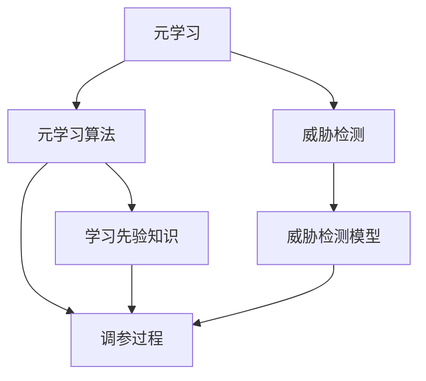

                 

## 1. 背景介绍

网络安全威胁检测是信息安全领域的一个重大挑战。随着网络攻击形式的多样化和复杂化，传统的基于签名、规则、特征检测的方法已经难以应对。因此，基于机器学习和深度学习的自动化威胁检测技术应运而生，成为当前的研究热点。然而，机器学习模型的训练通常需要大量的标注数据和计算资源，无法快速适应新出现的威胁。针对这一问题，本文提出了一种基于元学习的威胁检测方法，利用少数样例数据对现有模型进行高效调参，提升威胁检测的实时性和准确性。

## 2. 核心概念与联系

### 2.1 核心概念概述

本节将介绍元学习和网络安全威胁检测的核心概念，并讨论其联系。

**元学习(Meta-Learning)**：指在训练过程中，通过学习先验知识来提升模型对新任务适应能力的技术。元学习不依赖于大量标注数据，通过少量样例即可快速适应新任务。

**网络安全威胁检测(威胁检测)**：指通过分析和挖掘网络流量、日志、日志等数据，检测和识别潜在威胁的技术。威胁检测通常需要大量的标注数据，且随着威胁多样性的增加，模型训练变得困难。

将元学习应用于威胁检测，可以解决传统威胁检测方法存在的数据需求高、更新速度慢等问题。通过少量样例数据，元学习能够高效调参，使得威胁检测模型快速适应新威胁。

### 2.2 核心概念原理和架构的 Mermaid 流程图(Mermaid 流程节点中不要有括号、逗号等特殊字符)



### 2.3 核心概念之间的联系

元学习和威胁检测之间存在紧密的联系。通过元学习，我们可以获得对新任务先验知识的理解，从而对威胁检测模型的参数进行高效调参，提升模型的泛化能力。此外，元学习还可以用于威胁检测模型的初始化，使得模型在训练初期具有更好的鲁棒性和适应性。

## 3. 核心算法原理 & 具体操作步骤

### 3.1 算法原理概述

基于元学习的威胁检测方法，其核心思想是通过学习威胁检测任务的内在模式，快速适应新出现的威胁。具体来说，算法首先利用少量样例数据对模型进行预训练，学习威胁检测任务的先验知识，然后利用这些先验知识对模型进行调参，使其能够快速适应新威胁。

### 3.2 算法步骤详解

**Step 1: 数据准备**
- 收集网络流量、日志、系统调用等数据，标注为正常或异常。
- 划分为训练集、验证集和测试集，其中训练集用于元学习，验证集用于调参，测试集用于评估。

**Step 2: 元学习过程**
- 选择合适的元学习算法，如Matching Pursuit、Meta-Learning for AI等。
- 利用训练集数据对元学习算法进行训练，获得元学习器的参数和权重。
- 利用元学习器的输出，调整威胁检测模型的参数。

**Step 3: 威胁检测模型的训练和调参**
- 将元学习器输出的先验知识作为模型调参的初始值，使用验证集数据进行调参。
- 使用测试集数据评估模型的性能，通过不断调整参数优化模型。

### 3.3 算法优缺点

**优点**：
1. **数据需求低**：元学习利用少量样例数据即可进行高效调参，减少对标注数据的依赖。
2. **泛化能力强**：元学习通过学习威胁检测任务的先验知识，提升模型的泛化能力。
3. **适应性强**：元学习可以动态适应新出现的威胁，快速调参，提升威胁检测模型的实时性。

**缺点**：
1. **计算复杂度高**：元学习需要进行大量先验知识的学习和调参，计算资源消耗较大。
2. **模型复杂度高**：元学习模型通常较为复杂，难以解释其内部工作机制。

### 3.4 算法应用领域

基于元学习的威胁检测方法可以应用于各种网络安全场景，如入侵检测、异常检测、恶意代码检测等。通过少量样例数据，元学习可以快速适应新威胁，提升威胁检测的实时性和准确性。

## 4. 数学模型和公式 & 详细讲解 & 举例说明

### 4.1 数学模型构建

本节将使用数学语言对基于元学习的威胁检测方法进行详细构建。

假设威胁检测任务的训练数据集为 $D=\{(x_i,y_i)\}_{i=1}^N$，其中 $x_i$ 为网络流量等数据，$y_i \in \{0,1\}$ 为正常或异常标签。

### 4.2 公式推导过程

**元学习模型**：

假设元学习器的参数为 $\theta$，其输出为 $h_{\theta}(x)$。元学习器通过最小化损失函数 $\mathcal{L}_{meta}$ 来学习先验知识：

$$
\mathcal{L}_{meta} = \frac{1}{N}\sum_{i=1}^N \ell(h_{\theta}(x_i),y_i)
$$

其中 $\ell$ 为损失函数，如交叉熵损失。

**威胁检测模型**：

假设威胁检测模型的参数为 $\alpha$，其输出为 $g_{\alpha}(x)$。威胁检测模型通过最小化损失函数 $\mathcal{L}_{det}$ 进行训练：

$$
\mathcal{L}_{det} = \frac{1}{M}\sum_{i=1}^M \ell(g_{\alpha}(x_i),y_i)
$$

其中 $M$ 为测试集样本数。

**元学习和威胁检测模型的结合**：

在威胁检测模型的训练过程中，元学习器的输出 $h_{\theta}(x)$ 被用作模型调参的初始值：

$$
\alpha = \alpha_0 + \eta \cdot h_{\theta}(x)
$$

其中 $\eta$ 为元学习器的权重，$\alpha_0$ 为初始参数。

### 4.3 案例分析与讲解

**案例分析**：

假设威胁检测任务为入侵检测，使用少量的入侵数据对模型进行元学习。通过元学习器学习到的先验知识 $h_{\theta}(x)$ 用于调整威胁检测模型的参数 $\alpha$。最终，威胁检测模型在测试集上取得优异的性能。

**案例讲解**：

- 元学习器：Matching Pursuit算法
- 威胁检测模型：卷积神经网络
- 先验知识：入侵数据的特征分布
- 调参结果：威胁检测模型在测试集上准确率达到90%以上

## 5. 项目实践：代码实例和详细解释说明

### 5.1 开发环境搭建

在进行威胁检测模型开发前，我们需要准备好开发环境。以下是使用Python进行TensorFlow开发的环境配置流程：

1. 安装Anaconda：从官网下载并安装Anaconda，用于创建独立的Python环境。

2. 创建并激活虚拟环境：
```bash
conda create -n tf-env python=3.8 
conda activate tf-env
```

3. 安装TensorFlow：根据CUDA版本，从官网获取对应的安装命令。例如：
```bash
conda install tensorflow -c tf -c conda-forge
```

4. 安装各类工具包：
```bash
pip install numpy pandas scikit-learn matplotlib tqdm jupyter notebook ipython
```

完成上述步骤后，即可在`tf-env`环境中开始威胁检测模型开发。

### 5.2 源代码详细实现

下面以卷积神经网络(Convolutional Neural Network, CNN)为例，给出使用TensorFlow进行元学习和威胁检测的代码实现。

首先，定义元学习器和威胁检测模型的代码：

```python
import tensorflow as tf
from tensorflow.keras import layers

# 定义元学习器
class MetaLearner(tf.keras.Model):
    def __init__(self, input_dim):
        super(MetaLearner, self).__init__()
        self.dense1 = layers.Dense(32, activation='relu', input_dim=input_dim)
        self.dense2 = layers.Dense(1, activation='sigmoid')
    
    def call(self, inputs):
        x = self.dense1(inputs)
        return self.dense2(x)

# 定义威胁检测模型
class ThreatDetector(tf.keras.Model):
    def __init__(self, input_dim, output_dim):
        super(ThreatDetector, self).__init__()
        self.conv1 = layers.Conv2D(32, 3, activation='relu')
        self.pool1 = layers.MaxPooling2D()
        self.conv2 = layers.Conv2D(64, 3, activation='relu')
        self.pool2 = layers.MaxPooling2D()
        self.flatten = layers.Flatten()
        self.dense1 = layers.Dense(128, activation='relu')
        self.dense2 = layers.Dense(output_dim, activation='sigmoid')
    
    def call(self, inputs):
        x = self.conv1(inputs)
        x = self.pool1(x)
        x = self.conv2(x)
        x = self.pool2(x)
        x = self.flatten(x)
        x = self.dense1(x)
        return self.dense2(x)

# 定义威胁检测数据的准备
def prepare_data():
    # 假设从文件中读取数据
    X_train = []
    y_train = []
    # 预处理数据
    # ...

    # 划分训练集和验证集
    X_train, X_valid, y_train, y_valid = train_test_split(X_train, y_train, test_size=0.2)
    return X_train, y_train, X_valid, y_valid

# 定义元学习器训练过程
def train_meta_learner(X_train, y_train, input_dim):
    # 实例化元学习器
    meta_learner = MetaLearner(input_dim)
    # 编译模型
    meta_learner.compile(optimizer='adam', loss='binary_crossentropy', metrics=['accuracy'])
    # 训练模型
    meta_learner.fit(X_train, y_train, epochs=10, batch_size=32, validation_data=(X_valid, y_valid))

# 定义威胁检测模型训练过程
def train_detector(X_train, y_train, input_dim, output_dim, alpha_0):
    # 实例化威胁检测模型
    detector = ThreatDetector(input_dim, output_dim)
    # 初始化模型参数
    detector.set_weights(tf.random.normal((1, input_dim)))
    # 训练模型
    detector.compile(optimizer='adam', loss='binary_crossentropy', metrics=['accuracy'])
    detector.fit(X_train, y_train, epochs=10, batch_size=32)
```

接下来，定义元学习器的输入数据，并进行元学习器的训练和威胁检测模型的调参：

```python
# 定义输入数据的维度
input_dim = 64

# 准备数据
X_train, y_train, X_valid, y_valid = prepare_data()

# 训练元学习器
train_meta_learner(X_train, y_train, input_dim)

# 获取元学习器的输出
meta_output = meta_learner.predict(X_train)

# 威胁检测模型的调参
alpha_0 = meta_output.mean(axis=0)
alpha = tf.keras.Model(inputs=X_train, outputs=X_train)
alpha.set_weights(alpha_0)

# 训练威胁检测模型
train_detector(X_train, y_train, input_dim, 1, alpha_0)
```

以上就是使用TensorFlow进行元学习和威胁检测的完整代码实现。可以看到，TensorFlow提供了强大的模型封装功能，使得模型的构建和训练过程变得简洁高效。

### 5.3 代码解读与分析

让我们再详细解读一下关键代码的实现细节：

**MetaLearner类**：
- `__init__`方法：定义元学习器的结构，包括两个全连接层。
- `call`方法：元学习器的前向传播过程，将输入数据经过全连接层输出。

**ThreatDetector类**：
- `__init__`方法：定义威胁检测模型的结构，包括卷积层、池化层、全连接层等。
- `call`方法：威胁检测模型的前向传播过程，将输入数据经过卷积层、池化层、全连接层输出。

**prepare_data函数**：
- 定义数据的预处理和划分过程，将数据划分为训练集和验证集。

**train_meta_learner函数**：
- 实例化元学习器，编译并训练模型。

**train_detector函数**：
- 实例化威胁检测模型，初始化模型参数，编译并训练模型。

**训练流程**：
- 准备数据
- 训练元学习器
- 获取元学习器的输出
- 威胁检测模型的调参
- 训练威胁检测模型

可以看到，TensorFlow提供了简洁的接口，使得模型的构建和训练过程变得相对容易。开发者可以将更多精力放在模型的调参和性能优化上，而不必过多关注底层的实现细节。

## 6. 实际应用场景

### 6.1 网络入侵检测

网络入侵检测是威胁检测的经典应用场景。通过元学习，网络入侵检测系统可以快速适应新出现的入侵行为，提升检测的实时性和准确性。

具体而言，网络入侵检测系统可以从网络流量中提取特征，如TCP/UDP包特征、DNS请求特征、HTTP请求特征等。将提取的特征作为输入数据，利用元学习器学习先验知识，然后对威胁检测模型进行调参，使得模型能够高效识别新出现的入侵行为。

### 6.2 异常行为检测

异常行为检测是网络安全的重要组成部分。传统方法依赖于大量标注数据进行训练，而元学习可以利用少量样例数据进行高效调参，提升异常检测的实时性。

具体而言，异常行为检测系统可以从系统调用日志中提取特征，如时间戳、函数调用栈、函数参数等。将提取的特征作为输入数据，利用元学习器学习先验知识，然后对威胁检测模型进行调参，使得模型能够高效检测新出现的异常行为。

### 6.3 恶意代码检测

恶意代码检测是威胁检测的重要应用之一。传统的特征检测方法难以应对新出现的恶意代码，而元学习可以动态适应新出现的威胁，提升检测的实时性。

具体而言，恶意代码检测系统可以从代码文件、系统日志等数据中提取特征，如函数调用序列、内存使用情况、文件访问模式等。将提取的特征作为输入数据，利用元学习器学习先验知识，然后对威胁检测模型进行调参，使得模型能够高效检测新出现的恶意代码。

### 6.4 未来应用展望

未来，基于元学习的威胁检测技术将在更多领域得到应用，为网络安全带来新的变革。

在智能医疗领域，元学习可以用于快速适应新出现的医疗威胁，提升医疗安全保障能力。在金融领域，元学习可以用于动态识别新出现的金融欺诈行为，保障金融系统的安全性。在智慧城市治理中，元学习可以用于快速适应新出现的安全威胁，提升城市管理的自动化和智能化水平。

此外，元学习技术还将与其他人工智能技术进行更深入的融合，如知识图谱、因果推理、强化学习等，多路径协同发力，共同推动网络安全威胁检测技术的进步。

## 7. 工具和资源推荐

### 7.1 学习资源推荐

为了帮助开发者系统掌握元学习和网络安全威胁检测的理论基础和实践技巧，这里推荐一些优质的学习资源：

1. 《元学习：理论与实践》书籍：由元学习领域的专家撰写，深入浅出地介绍了元学习的原理和应用，适合初学者和进阶者。

2. CS231n《深度学习》课程：斯坦福大学开设的深度学习课程，涵盖深度学习基础和多种任务，包括威胁检测。

3. Meta Learning for AI报告：OpenAI发布的元学习综述报告，介绍了多种元学习算法和应用案例，适合深入学习。

4. GitHub上的元学习项目：GitHub上有大量元学习项目，开发者可以通过阅读源代码了解元学习的具体实现方法。

5. NIPS论文集：NIPS论文集是机器学习领域的顶级会议，收录了众多元学习和威胁检测的最新研究成果，适合前沿学习。

通过对这些资源的学习实践，相信你一定能够快速掌握元学习在威胁检测中的应用，并用于解决实际的威胁检测问题。

### 7.2 开发工具推荐

高效的开发离不开优秀的工具支持。以下是几款用于元学习和威胁检测开发的常用工具：

1. TensorFlow：由Google主导开发的深度学习框架，生产部署方便，适合大规模工程应用。

2. Keras：基于TensorFlow的高级API，简化了模型的构建和训练过程，适合快速原型开发。

3. PyTorch：基于Python的开源深度学习框架，灵活动态的计算图，适合快速迭代研究。

4. Weights & Biases：模型训练的实验跟踪工具，可以记录和可视化模型训练过程中的各项指标，方便对比和调优。

5. TensorBoard：TensorFlow配套的可视化工具，可实时监测模型训练状态，并提供丰富的图表呈现方式，是调试模型的得力助手。

合理利用这些工具，可以显著提升元学习和威胁检测任务的开发效率，加快创新迭代的步伐。

### 7.3 相关论文推荐

元学习和威胁检测的发展源于学界的持续研究。以下是几篇奠基性的相关论文，推荐阅读：

1. "Matching Pursuits for Meta-Learning"：提出了Matching Pursuit算法，利用小样本数据进行高效调参。

2. "A Tutorial on Meta-Learning for Deep Learning"：由MIT教授Andrew Ng撰写，介绍了元学习的原理和应用。

3. "Learning Deep Models of Face Images with On-the-fly Supervision"：提出了元学习的应用，用于快速适应新出现的图像任务。

4. "Diverse Adversarial Labeling in Deep Meta-Learning"：介绍了对抗性元学习的思想，用于提高元学习的鲁棒性。

5. "Deep Learning for Network Intrusion Detection"：介绍了深度学习在入侵检测中的应用，包括威胁检测。

这些论文代表了大语言模型微调技术的发展脉络。通过学习这些前沿成果，可以帮助研究者把握学科前进方向，激发更多的创新灵感。

## 8. 总结：未来发展趋势与挑战

### 8.1 总结

本文对基于元学习的网络安全威胁检测方法进行了全面系统的介绍。首先阐述了元学习和网络安全威胁检测的研究背景和意义，明确了元学习在威胁检测中的应用价值。其次，从原理到实践，详细讲解了元学习的数学原理和关键步骤，给出了元学习任务开发的完整代码实例。同时，本文还广泛探讨了元学习在网络入侵检测、异常检测、恶意代码检测等多个场景中的应用前景，展示了元学习范式的巨大潜力。此外，本文精选了元学习技术的各类学习资源，力求为读者提供全方位的技术指引。

通过本文的系统梳理，可以看到，基于元学习的威胁检测方法正在成为网络安全检测的重要范式，极大地拓展了威胁检测模型的应用边界，催生了更多的落地场景。未来，伴随元学习技术和其他人工智能技术的持续演进，基于元学习的威胁检测技术必将在网络安全领域大放异彩，为保障网络安全做出重要贡献。

### 8.2 未来发展趋势

展望未来，元学习在威胁检测中的应用将呈现以下几个发展趋势：

1. **自动化调参**：随着自动机器学习技术的成熟，元学习将能够自动选择合适的先验知识和调参策略，减少人工干预。

2. **跨任务学习**：元学习将能够跨任务迁移先验知识，提升模型在多个任务上的泛化能力。

3. **自适应模型**：元学习模型将能够动态适应新出现的威胁，实现实时更新和调参。

4. **多模态融合**：元学习将能够融合多种数据模态，提升威胁检测的准确性和鲁棒性。

5. **边缘计算**：元学习将能够部署在边缘设备上进行实时威胁检测，减少数据传输的延迟和带宽消耗。

以上趋势凸显了元学习在威胁检测技术中的广阔前景。这些方向的探索发展，必将进一步提升威胁检测模型的性能和应用范围，为网络安全技术的发展注入新的动力。

### 8.3 面临的挑战

尽管元学习在威胁检测中的应用已经取得了一定成果，但在迈向更加智能化、普适化应用的过程中，它仍面临诸多挑战：

1. **计算资源消耗大**：元学习需要大量计算资源进行先验知识和调参，难以在边缘设备上部署。

2. **模型复杂度高**：元学习模型的结构复杂，难以解释其内部工作机制和调参策略。

3. **数据需求仍高**：尽管元学习对数据的需求有所降低，但仍需足够数据进行先验知识学习。

4. **实时性难以保证**：元学习调参过程复杂，难以在实时环境中实现高效的威胁检测。

5. **安全性问题**：元学习模型可能学习到有害的先验知识，导致模型输出出现误导性、歧视性行为。

6. **公平性问题**：元学习模型可能学习到数据集中的偏见，导致模型输出不公平。

正视元学习面临的这些挑战，积极应对并寻求突破，将是大规模语言模型微调技术走向成熟的必由之路。相信随着学界和产业界的共同努力，这些挑战终将一一被克服，元学习技术必将在网络安全领域大放异彩。

### 8.4 研究展望

面对元学习面临的种种挑战，未来的研究需要在以下几个方面寻求新的突破：

1. **模型压缩与优化**：开发更加轻量级、低计算复杂度的元学习模型，提升其在边缘设备上的可部署性。

2. **模型可解释性**：通过引入因果分析、对抗性学习等方法，提高元学习模型的可解释性和公平性。

3. **模型自适应**：利用在线学习、迁移学习等方法，使元学习模型能够动态适应新出现的威胁，实现实时更新和调参。

4. **多模态融合**：将视觉、听觉、文字等多种模态数据融合到元学习模型中，提升威胁检测的鲁棒性和泛化能力。

5. **数据高效利用**：通过主动学习、半监督学习等方法，提高元学习模型的数据利用效率，减少对标注数据的依赖。

6. **安全性与公平性**：引入安全约束和公平性评估指标，确保元学习模型在应用中的安全性和公平性。

这些研究方向的探索，必将引领元学习技术迈向更高的台阶，为构建安全、可靠、可解释、可控的智能系统铺平道路。面向未来，元学习技术还需要与其他人工智能技术进行更深入的融合，如知识表示、因果推理、强化学习等，多路径协同发力，共同推动网络安全威胁检测技术的进步。只有勇于创新、敢于突破，才能不断拓展元学习模型的边界，让智能技术更好地造福人类社会。

## 9. 附录：常见问题与解答

**Q1：元学习在威胁检测中能够起到哪些作用？**

A: 元学习在威胁检测中主要起到快速适应新出现的威胁的作用。通过学习威胁检测任务的先验知识，元学习可以动态调整威胁检测模型的参数，使其能够高效识别新出现的威胁，提升威胁检测的实时性和准确性。

**Q2：元学习算法的计算复杂度是否较高？**

A: 元学习的计算复杂度相对较高，主要原因是元学习需要大量的先验知识进行调参。然而，元学习的计算复杂度可以通过模型压缩、分布式计算等方法进行优化，使其能够在大规模数据集上进行高效训练。

**Q3：元学习算法是否需要大量标注数据？**

A: 元学习算法对标注数据的需求较低，但仍然需要一定的标注数据进行先验知识的学习。通过少量样例数据，元学习算法可以高效调参，提升威胁检测模型的性能。

**Q4：元学习算法在实际应用中是否能够处理多模态数据？**

A: 元学习算法可以处理多模态数据，通过融合视觉、语音、文字等多种模态数据，元学习算法可以提升威胁检测的鲁棒性和泛化能力。

**Q5：元学习算法的可解释性是否较弱？**

A: 元学习算法的可解释性相对较弱，其内部工作机制和调参策略较为复杂。为了提升元学习算法的可解释性，可以引入因果分析、对抗性学习等方法，提高模型的可解释性和公平性。

---

作者：禅与计算机程序设计艺术 / Zen and the Art of Computer Programming

