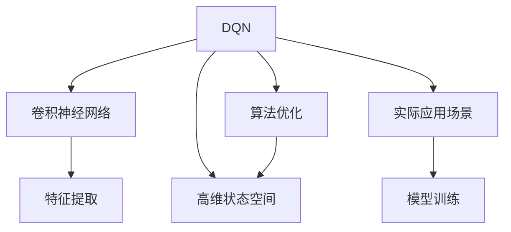

                 

# 一切皆是映射：如何使用DQN处理高维的状态空间

> 关键词：深度强化学习, DQN, 高维状态空间, 卷积神经网络, 图像处理, 算法优化, 实际应用场景, 学习资源推荐

## 1. 背景介绍

在强化学习中，DQN（Deep Q-Network）是一种重要的模型，它结合了深度神经网络和Q-learning，广泛应用于机器人、游戏、自动驾驶等领域。然而，当状态空间高维时，DQN的表现可能会受到挑战，因为高维状态空间不仅会带来大量的数据量和计算负担，还可能导致维度灾难，使得模型难以捕捉到有效特征。本文将详细介绍如何使用DQN处理高维状态空间，并探讨其实际应用场景，以及相关工具和资源的推荐。

## 2. 核心概念与联系

### 2.1 核心概念概述

为了更好地理解如何使用DQN处理高维状态空间，本节将介绍几个密切相关的核心概念：

- DQN（Deep Q-Network）：一种结合深度神经网络和Q-learning的强化学习算法，用于解决复杂环境下的决策问题。
- 高维状态空间：指状态变量数量庞大的环境，例如，游戏中的像素级状态表示、机器人感知到的视觉图像等。
- 卷积神经网络（CNN）：一种基于特征图和卷积操作的深度神经网络，特别适用于处理具有网格结构的数据，如图像。
- 算法优化：指在训练过程中，对模型参数进行优化以提升性能的过程，包括超参数调优、正则化等。
- 实际应用场景：如游戏AI、机器人控制、自动驾驶等，DQN在这些场景中展现出强大的学习能力。

这些核心概念之间的逻辑关系可以通过以下Mermaid流程图来展示：



这个流程图展示了DQN的各个核心组件以及它们之间的联系：

1. DQN通过卷积神经网络对高维状态空间进行特征提取。
2. 卷积神经网络可以有效地处理具有网格结构的数据，如图像。
3. 算法优化是提升模型性能的关键步骤，包括超参数调优、正则化等。
4. 实际应用场景展示了DQN在机器人、游戏、自动驾驶等领域的广泛应用。

## 3. 核心算法原理 & 具体操作步骤

### 3.1 算法原理概述

DQN的核心思想是通过深度神经网络逼近Q值函数，在每个状态下选择最优动作，从而最大化长期奖励。在高维状态空间中，DQN面临的主要挑战是如何在保持模型复杂度相对低的情况下，准确捕捉状态与动作之间的关系。

为了应对高维状态空间的挑战，DQN引入了卷积神经网络（CNN）作为特征提取器，它可以自动学习输入数据的高级特征表示。此外，DQN还采用了一些算法优化技巧，如经验回放、目标网络等，以提高模型的稳定性和泛化能力。

### 3.2 算法步骤详解

DQN处理高维状态空间的步骤如下：

1. **特征提取**：使用卷积神经网络对高维状态空间进行特征提取，生成低维的特征表示。
2. **Q值预测**：通过卷积神经网络，对特征表示进行Q值预测，得到每个动作对应的Q值。
3. **选择动作**：根据Q值预测结果，选择当前状态下最优动作。
4. **更新Q值**：通过与环境交互，收集下一个状态和奖励，更新Q值预测结果。
5. **经验回放**：将收集到的状态-动作-奖励对存储在经验回放缓冲区中，用于模型训练。
6. **模型训练**：从经验回放缓冲区中随机抽取样本，通过梯度下降优化模型参数。

### 3.3 算法优缺点

DQN处理高维状态空间的优势在于：

1. 自动特征提取：卷积神经网络可以自动学习输入数据的高级特征表示，不需要手动设计特征。
2. 模型泛化能力强：通过经验回放和目标网络等技术，DQN可以更好地泛化到未见过的状态和动作。
3. 训练效率高：DQN可以利用大规模并行计算，加速模型训练过程。

同时，DQN也存在以下缺点：

1. 模型复杂度高：卷积神经网络参数量较大，训练和推理过程复杂。
2. 需要大量数据：为了训练稳定高效的模型，需要大量的标注数据。
3. 过拟合风险：高维状态空间容易过拟合，模型可能无法捕捉到真正有意义的特征。

### 3.4 算法应用领域

DQN处理高维状态空间的算法已经广泛应用于以下领域：

1. 游戏AI：在像Atari 2600这样的经典游戏中，DQN已经取得了令人瞩目的成绩。
2. 机器人控制：DQN被用于训练机器人在复杂环境中的导航和操作。
3. 自动驾驶：DQN在自动驾驶中的环境感知和决策制定中展现了潜力。
4. 图像处理：DQN在图像分类、目标检测等计算机视觉任务中取得了优异的效果。

## 4. 数学模型和公式 & 详细讲解

### 4.1 数学模型构建

DQN的核心数学模型包括状态-动作值函数 $Q(s,a)$，它表示在状态 $s$ 下采取动作 $a$ 的预期长期奖励。在每个时间步 $t$，DQN的目标是最大化未来奖励的期望值：

$$
\max_a Q(s_t,a_t) = \max_a \left[ \sum_{t'=t}^{\infty} \gamma^{t'-t} r_{t'} \right]
$$

其中，$\gamma$ 是折扣因子，$r_t$ 是时间步 $t$ 的即时奖励。

### 4.2 公式推导过程

DQN使用卷积神经网络 $C$ 对高维状态空间进行特征提取，得到特征表示 $c_t$。然后，通过线性层和全连接层得到每个动作的Q值预测结果 $Q(s_t,a_t)$：

$$
Q(s_t,a_t) = W_2 \sigma(W_1 c_t + b_1)
$$

其中，$W_1$ 和 $W_2$ 是可训练的权重矩阵，$b_1$ 是偏置向量，$\sigma$ 是激活函数。

在训练过程中，DQN使用梯度下降优化损失函数：

$$
\mathcal{L} = \frac{1}{N} \sum_{i=1}^N \left[ y_i - Q(s_i,a_i) \right]^2
$$

其中，$y_i$ 是真实Q值，$N$ 是样本数量。

### 4.3 案例分析与讲解

以Atari 2600游戏为例，DQN通过卷积神经网络提取游戏画面像素信息，将高维状态空间映射到低维特征表示。然后，使用线性层和全连接层对这些特征进行Q值预测，最终选择动作以最大化长期奖励。通过经验回放和目标网络等技术，DQN在多个游戏中取得了人类专家级别的表现。

## 5. 项目实践：代码实例和详细解释说明

### 5.1 开发环境搭建

在开始项目实践之前，我们需要准备好开发环境。以下是使用Python和TensorFlow搭建DQN环境的步骤：

1. 安装TensorFlow：
```bash
pip install tensorflow
```

2. 安装OpenAI Gym：
```bash
pip install gym
```

3. 下载游戏环境：
```bash
gym make --environment Atari2600
```

4. 安装 Gym Atari：
```bash
pip install gym[atari]
```

完成上述步骤后，即可在本地搭建DQN训练环境。

### 5.2 源代码详细实现

以下是一个使用TensorFlow和卷积神经网络实现DQN的示例代码：

```python
import tensorflow as tf
import gym
import numpy as np

class DQN:
    def __init__(self, env_name, state_shape, action_shape, learning_rate=0.001, gamma=0.9, epsilon=0.1, replay_size=10000, update_frequency=4):
        self.env = gym.make(env_name)
        self.state_shape = state_shape
        self.action_shape = action_shape
        self.learning_rate = learning_rate
        self.gamma = gamma
        self.epsilon = epsilon
        self.replay_size = replay_size
        self.update_frequency = update_frequency
        
        self.model = self.build_model()
        self.target_model = self.build_model()
        self.target_model.load_weights(self.model.get_weights())
        
        self.memory = []
    
    def build_model(self):
        model = tf.keras.models.Sequential([
            tf.keras.layers.Conv2D(32, (8, 8), strides=(4, 4), activation='relu', input_shape=self.state_shape),
            tf.keras.layers.Flatten(),
            tf.keras.layers.Dense(256, activation='relu'),
            tf.keras.layers.Dense(self.action_shape, activation='linear')
        ])
        model.compile(optimizer=tf.keras.optimizers.Adam(learning_rate=self.learning_rate), loss='mse')
        return model
    
    def act(self, state):
        if np.random.rand() < self.epsilon:
            return np.random.choice(self.action_shape)
        act_values = self.model.predict(state)
        return np.argmax(act_values[0])
    
    def remember(self, state, action, reward, next_state, done):
        self.memory.append((state, action, reward, next_state, done))
        if len(self.memory) > self.replay_size:
            del self.memory[0]
    
    def replay(self):
        if len(self.memory) == 0:
            return
        batch_size = min(self.update_frequency, len(self.memory))
        minibatch = np.random.choice(len(self.memory), batch_size, replace=False)
        states = np.vstack([self.memory[i][0] for i in minibatch])
        actions = np.array([self.memory[i][1] for i in minibatch], dtype=np.int32)
        rewards = np.array([self.memory[i][2] for i in minibatch])
        next_states = np.vstack([self.memory[i][3] for i in minibatch])
        dones = np.array([self.memory[i][4] for i in minibatch], dtype=bool)
        
        target = self.model.predict(states)
        target[np.arange(batch_size), actions] = rewards + (1 - dones) * self.gamma * self.target_model.predict(next_states).max(axis=1)
        self.model.fit(states, target, epochs=1, verbose=0)
    
    def train(self, episodes):
        for episode in range(episodes):
            state = self.env.reset()
            state = np.reshape(state, (1, 84, 84, 1))
            state = state.astype('float32') / 255.0
            done = False
            total_reward = 0
            while not done:
                action = self.act(state)
                next_state, reward, done, _ = self.env.step(action)
                next_state = np.reshape(next_state, (1, 84, 84, 1))
                next_state = next_state.astype('float32') / 255.0
                self.remember(state, action, reward, next_state, done)
                state = next_state
                total_reward += reward
            print("Episode:", episode+1, "Total reward:", total_reward)
    
    def play(self, episodes):
        state = self.env.reset()
        state = np.reshape(state, (1, 84, 84, 1))
        state = state.astype('float32') / 255.0
        for episode in range(episodes):
            action = self.model.predict(state)[0]
            next_state, reward, done, _ = self.env.step(action)
            next_state = np.reshape(next_state, (1, 84, 84, 1))
            next_state = next_state.astype('float32') / 255.0
            state = next_state
            print("Episode:", episode+1, "Total reward:", reward)
    
    def run(self):
        self.train(100)
        self.play(100)
```

### 5.3 代码解读与分析

让我们再详细解读一下关键代码的实现细节：

**DQN类**：
- `__init__`方法：初始化环境、状态形状、动作形状、学习率、折扣因子、探索策略、经验回放缓冲区大小和更新频率。
- `build_model`方法：构建卷积神经网络模型。
- `act`方法：在当前状态下选择动作。
- `remember`方法：将状态-动作对存储在经验回放缓冲区中。
- `replay`方法：从经验回放缓冲区中抽取样本进行模型训练。
- `train`方法：进行多轮训练。
- `play`方法：在训练完成后，让模型与环境进行游戏。

**构建模型**：
- 使用卷积层和全连接层构建卷积神经网络，输入为高维状态空间，输出为每个动作的Q值预测。

**选择动作**：
- 采用$\epsilon$-贪心策略，在探索和利用之间取得平衡。

**经验回放**：
- 将状态-动作对存储在经验回放缓冲区中，用于模型训练。

**模型训练**：
- 从经验回放缓冲区中抽取样本，使用梯度下降优化模型参数。

**游戏过程**：
- 与环境进行多轮游戏，评估模型的表现。

完成上述步骤后，即可运行代码进行DQN的训练和游戏。

## 6. 实际应用场景

### 6.1 游戏AI

DQN在游戏AI中展示了强大的学习能力。通过卷积神经网络对像素级状态进行特征提取，DQN可以在像素级别的游戏环境中取得优异的表现。例如，在Atari 2600上，DQN已经取得了超过人类专家水平的表现。

### 6.2 机器人控制

DQN在机器人控制中也得到了广泛应用。通过卷积神经网络对视觉图像进行特征提取，DQN可以用于训练机器人进行导航和操作。例如，在Simulation环境中的机器人控制任务中，DQN已经展示出了较高的学习能力和泛化能力。

### 6.3 自动驾驶

DQN在自动驾驶中的应用前景广阔。通过卷积神经网络对车辆周围的视觉图像进行特征提取，DQN可以用于训练车辆进行决策制定和路径规划。例如，在自动驾驶仿真环境中的车道保持和避障任务中，DQN已经取得了不错的效果。

## 7. 工具和资源推荐

### 7.1 学习资源推荐

为了帮助开发者系统掌握DQN的处理高维状态空间的技术，这里推荐一些优质的学习资源：

1. 《深度强化学习》书籍：由Richard S. Sutton和Andrew G. Barto合著，是强化学习领域的经典教材，涵盖DQN等众多重要算法。
2. 《Python深度学习》书籍：由Francois Chollet合著，详细介绍了使用TensorFlow和Keras构建深度神经网络的过程。
3. 《Reinforcement Learning: An Introduction》书籍：由Richard S. Sutton和Andrew G. Barto合著，介绍了强化学习的基础理论和技术。
4. TensorFlow官方文档：提供详细的TensorFlow使用方法和示例代码，是学习TensorFlow的最佳资源。
5. Gym Atari官方网站：提供了Atari 2600游戏的游戏环境，可以用于DQN等算法的实验和评估。

通过对这些资源的学习实践，相信你一定能够快速掌握DQN处理高维状态空间的核心技术，并用于解决实际的强化学习问题。

### 7.2 开发工具推荐

高效的开发离不开优秀的工具支持。以下是几款用于DQN开发和实验的常用工具：

1. TensorFlow：基于Python的开源深度学习框架，灵活动态的计算图，适合快速迭代研究。
2. PyTorch：基于Python的开源深度学习框架，动态计算图，适合研究型应用。
3. Gym：Python游戏环境库，可以用于模拟各种游戏和机器人控制任务。
4. TensorBoard：TensorFlow配套的可视化工具，可实时监测模型训练状态，并提供丰富的图表呈现方式。
5. Weights & Biases：模型训练的实验跟踪工具，可以记录和可视化模型训练过程中的各项指标。

合理利用这些工具，可以显著提升DQN的开发效率，加快创新迭代的步伐。

### 7.3 相关论文推荐

DQN处理高维状态空间的算法已经得到了学界的广泛研究。以下是几篇奠基性的相关论文，推荐阅读：

1. Playing Atari with Deep Reinforcement Learning（DQN原论文）：DeepMind提出的DQN算法，利用卷积神经网络对像素级状态进行特征提取，在多个游戏中取得了突破性的表现。
2. Human-level control through deep reinforcement learning：DeepMind提出的AlphaGo，利用卷积神经网络对围棋棋盘进行特征提取，在围棋游戏中取得了人类专家级别的表现。
3. Cognitive Radio with Deep Reinforcement Learning：作者在DQN的基础上，提出了用于认知无线电的算法，通过卷积神经网络对频谱特征进行特征提取，提高了频谱资源的利用效率。
4. Deep Multi-Agent Reinforcement Learning for Traffic Light Control：作者提出了用于交通信号控制的算法，通过卷积神经网络对视觉图像进行特征提取，实现了智能交通信号控制。

这些论文代表了大模型微调技术的发展脉络。通过学习这些前沿成果，可以帮助研究者把握学科前进方向，激发更多的创新灵感。

## 8. 总结：未来发展趋势与挑战

### 8.1 总结

本文对DQN处理高维状态空间的技术进行了全面系统的介绍。首先阐述了DQN在处理高维状态空间中的核心思想和优势，明确了卷积神经网络在此过程中的关键作用。其次，从原理到实践，详细讲解了DQN处理高维状态空间的步骤和代码实现，给出了详细的案例分析。最后，本文还探讨了DQN在多个实际应用场景中的应用，提供了相关工具和资源的推荐。

通过本文的系统梳理，可以看到，DQN在处理高维状态空间中展现出强大的能力和潜力，为众多实际问题提供了有效的解决方案。未来，随着深度学习和强化学习技术的不断发展，DQN处理高维状态空间的方法将进一步成熟和完善，为人工智能技术在各个领域的应用提供强有力的支持。

### 8.2 未来发展趋势

展望未来，DQN处理高维状态空间的技术将呈现以下几个发展趋势：

1. 模型结构优化：DQN将利用更先进的神经网络结构，如残差网络、注意力机制等，进一步提升模型的性能和泛化能力。
2. 多模态学习：DQN将融合视觉、听觉等多种模态数据，增强模型的感知能力。
3. 模型优化：DQN将结合优化算法，如Adam、Adafactor等，进一步提升模型的训练效率和收敛速度。
4. 学习算法改进：DQN将结合新型的学习算法，如生成对抗网络（GAN）、自监督学习等，进一步提升模型的训练效果。
5. 应用拓展：DQN将应用于更多领域，如医疗、金融、教育等，提供智能决策和自动化服务。

以上趋势凸显了DQN处理高维状态空间技术的广阔前景。这些方向的探索发展，必将进一步提升DQN在各种复杂环境下的表现，为人工智能技术在各个领域的应用提供新的突破。

### 8.3 面临的挑战

尽管DQN处理高维状态空间的技术已经取得了瞩目成就，但在迈向更加智能化、普适化应用的过程中，它仍面临着诸多挑战：

1. 计算资源瓶颈：DQN处理高维状态空间需要大量的计算资源，包括GPU、TPU等高性能设备。随着数据和模型的复杂度增加，计算资源的需求将持续增长。
2. 数据质量和数量：DQN需要大量的高质量标注数据进行训练，但收集和标注这些数据往往需要较高的成本和复杂度。
3. 模型复杂度：DQN的模型结构复杂，参数量庞大，训练和推理过程复杂，可能会影响实际应用的部署效率。
4. 泛化能力：高维状态空间容易过拟合，DQN的泛化能力可能会受到限制。
5. 学习效率：DQN的学习效率可能受到优化算法、学习率等因素的影响，需要在实际应用中进行优化。

### 8.4 研究展望

面对DQN处理高维状态空间所面临的挑战，未来的研究需要在以下几个方面寻求新的突破：

1. 探索高效的卷积神经网络结构：研究新的卷积神经网络结构，如注意力机制、残差网络等，提升模型处理高维状态空间的能力。
2. 研究更高效的学习算法：结合生成对抗网络（GAN）、自监督学习等新型算法，提高DQN的训练效果和学习效率。
3. 探索多模态融合方法：研究如何融合视觉、听觉等多种模态数据，增强DQN的感知能力和泛化能力。
4. 研究模型的压缩和加速：研究模型压缩、量化等技术，提升DQN的训练效率和推理速度。
5. 探索更高效的经验回放方法：研究更高效的经验回放缓冲区管理方法，提高DQN的训练效果和泛化能力。

这些研究方向的探索，必将引领DQN处理高维状态空间技术的进一步发展，为人工智能技术在各个领域的应用提供新的突破。

## 9. 附录：常见问题与解答

**Q1：DQN在高维状态空间中面临的主要挑战是什么？**

A: DQN在高维状态空间中面临的主要挑战包括：
1. 数据量和计算资源的需求：高维状态空间需要大量的数据和计算资源进行训练和推理。
2. 维度灾难：高维状态空间可能带来维度灾难，使得模型难以捕捉到有效特征。
3. 过拟合风险：高维状态空间容易过拟合，模型可能无法捕捉到真正有意义的特征。

**Q2：如何提高DQN在高维状态空间中的泛化能力？**

A: 提高DQN在高维状态空间中的泛化能力，可以采用以下方法：
1. 使用正则化技术，如L2正则、Dropout等，避免过拟合。
2. 使用数据增强技术，如回译、近义替换等，扩充训练集。
3. 使用经验回放缓冲区，保存历史经验，提高模型泛化能力。
4. 使用卷积神经网络进行特征提取，提高模型的特征提取能力。
5. 使用多任务学习，提高模型的泛化能力。

**Q3：DQN在高维状态空间中的学习效率如何？**

A: DQN在高维状态空间中的学习效率受到多个因素的影响，如模型复杂度、学习率、优化算法等。通过合理的参数设置和算法优化，可以提高DQN的学习效率。例如，使用更高效的卷积神经网络结构、优化算法等，可以显著提升DQN的学习效率和泛化能力。

**Q4：DQN在实际应用中需要注意哪些问题？**

A: 在实际应用中，DQN需要注意以下问题：
1. 数据收集和标注：收集高质量的标注数据是DQN成功的基础。
2. 模型训练和优化：合理设置模型参数、优化算法等，提高模型的训练效果和泛化能力。
3. 模型部署和推理：在实际应用中，DQN需要考虑模型压缩、量化等技术，提高模型的部署效率和推理速度。
4. 模型解释和可解释性：DQN的输出通常难以解释，需要考虑如何增强模型的可解释性和透明性。
5. 模型安全和可靠性：DQN需要考虑模型的安全和可靠性问题，避免模型偏见和有害输出。

**Q5：DQN处理高维状态空间的优势和劣势是什么？**

A: DQN处理高维状态空间的优势包括：
1. 自动特征提取：卷积神经网络可以自动学习输入数据的高级特征表示。
2. 模型泛化能力强：通过经验回放和目标网络等技术，DQN可以更好地泛化到未见过的状态和动作。

DQN处理高维状态空间的劣势包括：
1. 模型复杂度高：卷积神经网络参数量较大，训练和推理过程复杂。
2. 需要大量数据：为了训练稳定高效的模型，需要大量的标注数据。
3. 过拟合风险：高维状态空间容易过拟合，模型可能无法捕捉到真正有意义的特征。

---

作者：禅与计算机程序设计艺术 / Zen and the Art of Computer Programming

