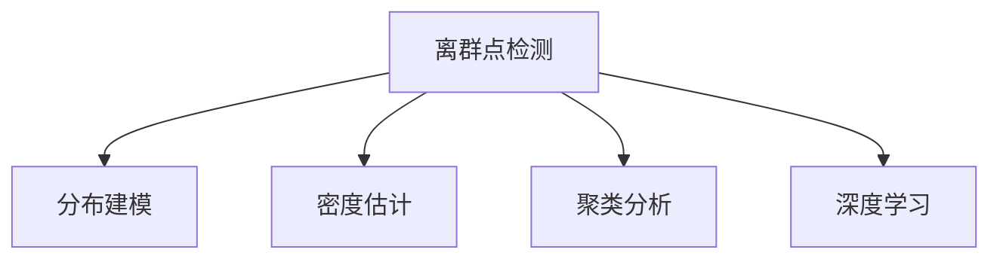

                 

# 一切皆是映射：异常检测：AI捕捉隐藏模式

异常检测，作为人工智能领域的一个经典问题，一直吸引着广大研究者的关注。它旨在识别数据中的离群点或异常值，从而预警潜在的安全风险、识别系统故障或优化业务决策。本文将从理论基础到实践应用，全面阐述异常检测的核心原理、算法框架及具体实现方法，并探索未来发展的方向。

## 1. 背景介绍

### 1.1 问题由来

在数据的海洋中，隐藏着众多异常值。这些异常值往往难以用传统统计方法捕捉，需要通过机器学习模型进行识别。例如，在网络安全领域，异常行为可能是网络攻击的预兆；在金融领域，异常交易可能是欺诈活动的标志；在工业领域，异常操作可能是设备故障的信号。

异常检测的难点在于：
1. 数据分布多样：不同领域的异常表现形式各异，难以采用统一的模型框架。
2. 标注数据稀缺：异常数据的获取往往比正常数据更困难，需要构建半监督或无监督的检测方法。
3. 模型复杂度高：异常检测模型需要平衡高精度和高效性，避免过度拟合。

### 1.2 问题核心关键点

异常检测的核心目标是通过训练模型，识别数据中的离群点。其关键点包括：
- 异常定义：如何定义异常？通常用统计学指标（如均值、方差）或机器学习模型（如密度函数）进行度量。
- 数据分布：如何描述数据分布？常用的方法包括正态分布、高斯混合模型等。
- 模型训练：如何选择和训练模型？常见的算法包括基于密度的、基于距离的、基于深度学习的等。
- 结果评估：如何衡量异常检测模型的效果？常用的指标包括精确度、召回率、F1值等。

## 2. 核心概念与联系

### 2.1 核心概念概述

异常检测涉及多个核心概念，主要包括：

- **离群点检测**：识别数据集中的异常数据点，即与正常数据点有显著差异的数据点。
- **分布建模**：用数学模型描述数据分布，建立数据正常点的集合。
- **密度估计**：估计数据点在分布中的密度，识别低密度区域。
- **聚类分析**：将数据点分为正常和异常两类，常用的算法包括K-means、DBSCAN等。
- **深度学习**：利用神经网络模型对异常进行识别，常用的框架包括Autoencoder、GAN等。

这些概念之间的逻辑关系可以通过以下Mermaid流程图来展示：



这个流程图展示了异常检测的核心概念及其之间的关系：

1. 离群点检测是异常检测的目标。
2. 分布建模是描述数据正常点的数学方法。
3. 密度估计是计算数据点在分布中密度的统计技术。
4. 聚类分析是通过数学手段将数据分为正常和异常类别的算法。
5. 深度学习是利用神经网络模型进行异常检测的技术。

这些概念共同构成了异常检测的基本框架，使得AI可以捕捉隐藏在数据中的异常模式。

## 3. 核心算法原理 & 具体操作步骤

### 3.1 算法原理概述

异常检测的核心理念是：正常数据点在分布中的密度远高于异常数据点。因此，通过估计数据点在分布中的密度，可以将密度低于阈值的点识别为异常。

具体来说，异常检测过程包括以下步骤：
1. **数据预处理**：清洗数据，去除噪声和缺失值，标准化数据。
2. **分布建模**：用数学模型（如正态分布、高斯混合模型）描述数据分布。
3. **密度估计**：计算数据点在分布中的密度。
4. **异常检测**：设定密度阈值，将密度低于阈值的点识别为异常。
5. **结果评估**：使用评估指标（如精确度、召回率、F1值）评估模型效果。

### 3.2 算法步骤详解

#### 步骤1：数据预处理

数据预处理是异常检测的第一步，主要包括：
1. **数据清洗**：去除缺失值、异常值、重复值。
2. **数据标准化**：将数据转化为标准正态分布，便于后续密度估计。

#### 步骤2：分布建模

数据分布建模是异常检测的核心环节，常用的方法包括：
1. **正态分布建模**：假设数据服从正态分布，计算均值和方差。
2. **高斯混合建模**：假设数据由多个高斯分布混合而成，通过EM算法计算参数。

#### 步骤3：密度估计

密度估计是通过数学模型计算数据点在分布中的密度。常用的方法包括：
1. **核密度估计**：通过核函数计算数据点在分布中的密度。
2. **局部线性嵌入**：利用局部线性关系，估计数据点在低维空间中的密度。

#### 步骤4：异常检测

异常检测是通过设定密度阈值，识别密度低于阈值的数据点。具体步骤包括：
1. **密度计算**：计算数据点在分布中的密度。
2. **阈值设定**：根据数据分布情况，设定合适的密度阈值。
3. **异常识别**：将密度低于阈值的数据点识别为异常。

#### 步骤5：结果评估

结果评估是衡量异常检测模型效果的关键步骤，常用的指标包括：
1. **精确度**：识别为异常的正常数据占总正常数据的比例。
2. **召回率**：识别为异常的异常数据占总异常数据的比例。
3. **F1值**：精确度和召回率的调和平均数。

### 3.3 算法优缺点

异常检测的优点在于：
1. **模型简单**：不需要大量的标注数据，可以处理多种类型的数据。
2. **结果解释性强**：通过密度估计，可以直观地理解异常点的位置和分布。
3. **适用性强**：适用于多种领域的数据集，如金融、网络安全、工业等。

异常检测的缺点在于：
1. **数据依赖**：异常检测模型的效果高度依赖数据分布的假设，假设错误会导致误判。
2. **参数敏感**：密度阈值的设定需要经验和专业知识，缺乏有效方法。
3. **计算复杂**：密度估计和聚类算法计算复杂度高，不适用于大规模数据集。

### 3.4 算法应用领域

异常检测广泛应用于多个领域，例如：
1. **网络安全**：检测异常网络流量，识别DDoS攻击、SQL注入等安全威胁。
2. **金融风控**：识别异常交易行为，预警欺诈和洗钱活动。
3. **工业监测**：检测设备故障，优化生产流程。
4. **医疗诊断**：识别异常病历，预警潜在疾病。

## 4. 数学模型和公式 & 详细讲解 & 举例说明

### 4.1 数学模型构建

假设数据集 $D = \{(x_1, y_1), (x_2, y_2), ..., (x_n, y_n)\}$，其中 $x$ 为特征向量，$y$ 为标签，$y=0$ 表示正常数据，$y=1$ 表示异常数据。

### 4.2 公式推导过程

异常检测的数学模型通常基于密度估计，假设数据服从正态分布，则密度函数为：

$$
f(x; \mu, \sigma) = \frac{1}{\sqrt{2\pi} \sigma} \exp\left(-\frac{(x-\mu)^2}{2\sigma^2}\right)
$$

其中，$\mu$ 和 $\sigma$ 分别为均值和方差。对于单变量数据，可以通过计算均值和方差来估计密度；对于多变量数据，则可以使用高斯混合模型。

### 4.3 案例分析与讲解

以信用卡交易异常检测为例，我们首先收集历史交易数据，计算均值和方差，构建正态分布模型。然后，计算每个交易的密度值，设定密度阈值，将密度低于阈值的交易识别为异常。最后，使用精确度、召回率等指标评估模型效果。

## 5. 项目实践：代码实例和详细解释说明

### 5.1 开发环境搭建

以下是使用Python进行异常检测项目开发的流程：

1. 安装Anaconda：
```bash
conda install anaconda
```

2. 创建并激活虚拟环境：
```bash
conda create --name anomaly_detection python=3.7
conda activate anomaly_detection
```

3. 安装必要的库：
```bash
conda install numpy pandas matplotlib scikit-learn
pip install tensorflow
```

### 5.2 源代码详细实现

以下是一个简单的异常检测代码实现，用于检测信用卡交易是否异常：

```python
import numpy as np
import pandas as pd
from sklearn.model_selection import train_test_split
from sklearn.preprocessing import StandardScaler
from sklearn.gaussian_process import GaussianProcessClassifier
from sklearn.metrics import precision_recall_fscore_support

# 加载数据
data = pd.read_csv('creditcard.csv')
X = data.drop('Class', axis=1)
y = data['Class']

# 数据标准化
scaler = StandardScaler()
X = scaler.fit_transform(X)

# 分割数据集
X_train, X_test, y_train, y_test = train_test_split(X, y, test_size=0.2, random_state=42)

# 构建高斯过程分类器
gpc = GaussianProcessClassifier(kernel='rbf', alpha=0.1, n_restarts_optimizer=10)

# 训练模型
gpc.fit(X_train, y_train)

# 预测测试集
y_pred = gpc.predict(X_test)

# 计算精确度、召回率、F1值
precision, recall, f1, _ = precision_recall_fscore_support(y_test, y_pred, average='binary')
print(f'Precision: {precision:.2f}, Recall: {recall:.2f}, F1-Score: {f1:.2f}')
```

### 5.3 代码解读与分析

- `train_test_split`函数用于分割数据集，将数据分为训练集和测试集。
- `StandardScaler`用于对数据进行标准化处理。
- `GaussianProcessClassifier`用于构建高斯过程分类器，用于异常检测。
- `precision_recall_fscore_support`用于计算精确度、召回率、F1值等评估指标。

### 5.4 运行结果展示

运行上述代码，可以输出模型的精确度、召回率、F1值等指标，用于评估模型的效果。

## 6. 实际应用场景

### 6.1 网络安全

异常检测在网络安全领域有广泛应用，通过检测异常流量和行为，可以预警DDoS攻击、SQL注入等安全威胁。例如，使用机器学习模型对网络流量进行实时分析，及时发现异常流量，并采取相应措施。

### 6.2 金融风控

金融行业常常面临欺诈和洗钱等风险，通过异常检测可以识别异常交易行为，及时预警风险事件。例如，使用机器学习模型对交易数据进行异常检测，及时发现异常交易并触发警报。

### 6.3 工业监测

工业领域常常需要监测设备运行状态，通过异常检测可以及时发现设备故障，优化生产流程。例如，使用机器学习模型对设备运行数据进行异常检测，及时发现异常数据点，并采取相应的维护措施。

### 6.4 医疗诊断

医疗领域需要及时发现异常病历，预警潜在疾病。例如，使用机器学习模型对病历数据进行异常检测，及时发现异常数据点，并进一步进行详细诊断。

## 7. 工具和资源推荐

### 7.1 学习资源推荐

1. **《异常检测：理论、算法与应用》**：介绍了异常检测的理论基础和常见算法，适合初学者和进阶者。
2. **Coursera《异常检测》课程**：由斯坦福大学开设，涵盖异常检测的基本概念和算法。
3. **arXiv上的相关论文**：深入了解最新研究进展和前沿算法。

### 7.2 开发工具推荐

1. **Python**：最常用的异常检测工具，易于编写和调试。
2. **TensorFlow**：谷歌开发的深度学习框架，适合大规模数据集和高性能计算。
3. **scikit-learn**：Python数据科学库，提供了多种异常检测算法。

### 7.3 相关论文推荐

1. **《Isolation Forests: Beyond Local Sensitivity Analysis to Isolation-based Anomaly Detection》**：提出基于随机森林的异常检测方法，适用于高维数据。
2. **《Anomaly Detection: A Survey》**：综述了异常检测的多种算法和应用场景。
3. **《Deep Learning-based Anomaly Detection》**：介绍了深度学习在异常检测中的应用，适用于大规模数据集。

## 8. 总结：未来发展趋势与挑战

### 8.1 研究成果总结

异常检测作为AI领域的重要问题，已经取得了一些显著进展。基于密度估计和聚类分析的算法在实际应用中表现出色，深度学习方法也逐渐被引入。未来，异常检测技术将在更多领域发挥重要作用。

### 8.2 未来发展趋势

未来异常检测技术将呈现以下几个发展趋势：
1. **自动化建模**：自动化的异常检测模型可以处理多种类型的数据，无需人工干预。
2. **跨领域应用**：异常检测技术将在更多领域得到应用，如医疗、工业、交通等。
3. **实时检测**：实时异常检测技术能够及时发现异常，提高数据处理效率。
4. **多模态融合**：结合多种数据模态进行异常检测，提高检测效果。
5. **自适应学习**：通过自适应学习机制，异常检测模型能够适应数据分布的变化。

### 8.3 面临的挑战

异常检测技术仍然面临一些挑战：
1. **数据分布假设**：异常检测模型的效果高度依赖数据分布的假设，假设错误会导致误判。
2. **参数选择**：异常检测模型的参数选择需要经验和专业知识，缺乏有效方法。
3. **计算复杂度**：异常检测模型的计算复杂度高，难以处理大规模数据集。
4. **解释性不足**：异常检测模型的决策过程缺乏可解释性，难以调试和优化。

### 8.4 研究展望

未来异常检测技术需要在以下几个方面进行改进：
1. **自动化建模**：通过自动化建模，降低对人工干预的依赖。
2. **自适应学习**：通过自适应学习机制，提高模型的泛化能力和适应性。
3. **多模态融合**：结合多种数据模态进行异常检测，提高检测效果。
4. **解释性增强**：增强模型的可解释性，提高模型的可信度和可操作性。
5. **实时检测**：开发实时异常检测算法，及时发现异常，提高数据处理效率。

## 9. 附录：常见问题与解答

**Q1：异常检测是否适用于所有数据集？**

A: 异常检测适用于各种类型的数据集，但需要根据数据特征选择合适的算法。例如，对于高维数据集，可以使用基于深度学习的算法；对于低维数据集，可以使用基于密度估计的算法。

**Q2：异常检测模型是否需要大量的标注数据？**

A: 异常检测模型一般不需要大量的标注数据，可以通过无监督或半监督学习方法进行训练。但需要大量的未标注数据进行训练，以学习数据分布。

**Q3：异常检测模型的效果如何评估？**

A: 异常检测模型的效果通常使用精确度、召回率、F1值等指标进行评估。具体评估方法根据任务需求进行选择。

**Q4：异常检测模型如何应对数据分布变化？**

A: 异常检测模型可以通过自适应学习机制，适应数据分布的变化。例如，使用在线学习算法，实时更新模型参数，以适应新的数据分布。

**Q5：异常检测模型是否存在模型过拟合问题？**

A: 异常检测模型容易出现过拟合问题，特别是在数据量较小的情况下。可以通过数据增强、正则化等方法，缓解过拟合问题。

---

作者：禅与计算机程序设计艺术 / Zen and the Art of Computer Programming

