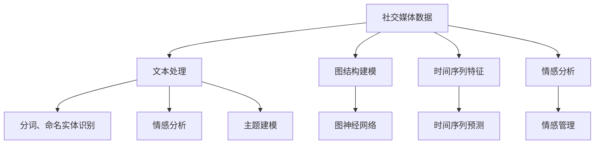

                 

# 一切皆是映射：深度学习在社交媒体数据分析中的应用

> 关键词：社交媒体,深度学习,自然语言处理,图神经网络,时间序列预测,情感分析

## 1. 背景介绍

### 1.1 问题由来
在当今数字化时代，社交媒体平台已成为人们获取信息、表达自我、社交互动的重要渠道。海量的用户数据背后，蕴含着巨大的信息价值和商业潜力。如何高效地分析和挖掘这些数据，成为了各大社交媒体公司和研究机构共同关注的热点问题。深度学习技术凭借其强大的非线性建模能力和自适应学习能力，正逐步成为解决社交媒体数据分析问题的利器。

近年来，深度学习在自然语言处理(NLP)和图神经网络(GNN)等领域的突破，使得社交媒体数据的自动分析成为可能。通过深度学习模型，可以自动识别用户情绪、追踪话题流行趋势、预测网络舆情动态，为品牌运营、市场洞察、政策制定等提供有力的支持。本文将深入探讨深度学习在社交媒体数据分析中的应用，从理论到实践，全面阐述如何利用深度学习技术提升社交媒体数据价值。

### 1.2 问题核心关键点
深度学习在社交媒体数据分析中的应用，涉及以下几个核心关键点：

- **数据预处理**：社交媒体数据具有海量、多样、噪声等特点，如何进行有效的数据清洗和预处理，是应用深度学习的第一步。
- **模型选择**：社交媒体数据分析涉及NLP、GNN等多种模型，如何根据具体任务选择合适的深度学习模型，是应用成功的关键。
- **特征工程**：社交媒体数据多为文本、图谱形式，如何进行高效的特征提取和表达，是模型效果提升的重要途径。
- **评估指标**：社交媒体数据分析任务繁多，如情感分析、主题建模、社区检测等，如何设计合理的评估指标，客观衡量模型性能，是应用效果的保障。
- **模型部署**：如何将深度学习模型高效部署到实际应用中，保障模型实时响应和稳定运行，是应用落地的关键。

以下将围绕这些关键点，详细介绍深度学习在社交媒体数据分析中的应用方法和实践经验。

## 2. 核心概念与联系

### 2.1 核心概念概述

社交媒体数据分析涉及多个核心概念，下面将逐一介绍并说明它们之间的联系。

- **社交媒体数据**：包括用户发布的文本、图片、视频、互动行为等，是数据分析的主要对象。
- **自然语言处理(NLP)**：利用深度学习模型对文本数据进行处理和分析，如分词、命名实体识别、情感分析等。
- **图神经网络(GNN)**：针对社交媒体中用户之间的互动关系进行建模，通过图结构传递信息，提升分析精度和效果。
- **时间序列预测**：针对社交媒体数据中的时间序列特征，如用户活跃时间、事件传播速度等，利用深度学习模型进行预测。
- **情感分析**：通过深度学习模型自动识别用户情感倾向，如积极、消极、中性等，辅助情感管理、用户行为分析等。

这些核心概念共同构成了深度学习在社交媒体数据分析的完整框架，使得我们可以从不同维度全面深入地分析和利用社交媒体数据。

### 2.2 核心概念原理和架构的 Mermaid 流程图



这个流程图展示了社交媒体数据分析的主要步骤和组件：

1. **文本处理**：通过NLP技术对社交媒体中的文本数据进行处理，提取有用信息。
2. **分词、命名实体识别**：对文本进行分词和实体标注，为后续分析打下基础。
3. **情感分析**：识别用户情感倾向，辅助情感管理。
4. **主题建模**：挖掘社交媒体中的主题，辅助内容推荐。
5. **图结构建模**：利用图神经网络对用户互动关系进行建模。
6. **时间序列预测**：对社交媒体数据中的时间序列特征进行预测，辅助活动策划和趋势预测。
7. **情感管理**：根据情感分析结果，进行负面情感的识别和干预。

## 3. 核心算法原理 & 具体操作步骤
### 3.1 算法原理概述

深度学习在社交媒体数据分析中的应用，主要基于NLP和GNN两大领域。NLP领域利用深度学习模型对文本数据进行处理和分析，而GNN领域则利用图结构对用户关系进行建模。

### 3.2 算法步骤详解

#### 3.2.1 数据预处理

数据预处理是深度学习应用的前提。社交媒体数据具有多样性和噪声等特点，需要进行清洗和预处理。以下是数据预处理的基本步骤：

1. **文本清洗**：去除无用信息，如HTML标签、特殊符号等。
2. **分词**：将文本分割成词汇单元，便于后续处理。
3. **停用词过滤**：去除常见的停用词，减少噪音。
4. **词干提取**：将单词还原到词干形式，便于模型处理。
5. **标签对齐**：对时间序列数据进行对齐，保证数据的一致性。

#### 3.2.2 模型选择

模型选择是深度学习应用的关键。根据具体任务和数据特点，选择合适的模型至关重要。以下是常见模型的选择：

1. **NLP任务**：
   - **文本分类**：使用卷积神经网络(CNN)或循环神经网络(RNN)进行文本分类，如BERT、GPT等。
   - **情感分析**：使用LSTM或GRU等RNN模型进行情感分析，或使用Transformer等模型进行序列到序列预测。
   - **主题建模**：使用Latent Dirichlet Allocation(LDA)等主题模型，或使用神经网络进行主题分类。

2. **GNN任务**：
   - **社区检测**：使用图卷积网络(GCN)或图注意力网络(GAT)进行社区检测，如Neighbor hood Aggregation(GNN)等。
   - **关系预测**：使用GNN进行用户关系预测，如Link Prediction Using Inductive Biases等。

#### 3.2.3 特征工程

特征工程是深度学习应用的灵魂。针对社交媒体数据，如何高效提取和表达特征，是提升模型效果的重要途径。以下是特征工程的基本步骤：

1. **文本特征提取**：
   - **词向量**：使用Word2Vec或GloVe等词向量模型，将单词映射到向量空间。
   - **TF-IDF**：计算单词的词频和逆文档频率，提取文本特征。
   - **BERT嵌入**：使用BERT等预训练模型，将文本映射到高维向量空间。

2. **图特征提取**：
   - **节点特征嵌入**：使用GNN模型，将用户节点映射到高维空间。
   - **图卷积特征**：使用GCN等图卷积网络，提取图谱特征。

#### 3.2.4 评估指标

评估指标是深度学习应用的重要保障。针对社交媒体数据分析任务，选择合适的评估指标，可以客观衡量模型性能。以下是常见评估指标：

1. **NLP任务**：
   - **准确率**：模型预测结果与真实标签的匹配度。
   - **精确率**：模型预测为正类的样本中，实际为正类的比例。
   - **召回率**：实际为正类的样本中，被模型预测为正类的比例。

2. **GNN任务**：
   - **F1分数**：综合精确率和召回率，衡量模型性能。
   - **AUC值**：衡量模型在不同阈值下的性能。
   - **ROC曲线**：绘制模型在不同阈值下的分类效果。

#### 3.2.5 模型部署

模型部署是深度学习应用的最终目标。如何高效部署深度学习模型，保障模型实时响应和稳定运行，是应用落地的关键。以下是模型部署的基本步骤：

1. **模型保存**：将训练好的模型保存为Pickle、TensorFlow SavedModel等格式。
2. **模型加载**：在实际应用中，通过加载模型进行推理预测。
3. **资源优化**：通过模型裁剪、量化等技术，优化模型的资源消耗。
4. **服务化封装**：将模型封装为API或微服务，便于集成调用。
5. **监控告警**：实时监测模型性能，设置异常告警阈值，确保系统稳定。

### 3.3 算法优缺点

深度学习在社交媒体数据分析中的应用，具有以下优点：

1. **强大的建模能力**：深度学习模型能够处理复杂非线性关系，准确捕捉数据中的潜在规律。
2. **自动特征提取**：深度学习模型能够自动学习数据中的有用特征，减少人工干预。
3. **实时响应**：深度学习模型能够在在线系统中实时处理和预测，支持实时应用。

但同时也存在一些缺点：

1. **数据依赖性**：深度学习模型需要大量高质量数据进行训练，数据稀缺可能影响模型性能。
2. **计算资源需求高**：深度学习模型通常需要高性能计算资源，部署和运行成本较高。
3. **模型解释性差**：深度学习模型往往被视为"黑盒"系统，难以解释其内部决策机制。
4. **泛化能力有限**：深度学习模型可能出现过拟合，泛化能力不足，影响在新数据上的表现。

## 4. 数学模型和公式 & 详细讲解

### 4.1 数学模型构建

社交媒体数据分析涉及多种模型，下面以情感分析为例，介绍模型的数学建模过程。

假设社交媒体数据为 $\mathcal{D}=\{(x_i, y_i)\}_{i=1}^N$，其中 $x_i$ 为输入文本，$y_i$ 为情感标签。模型的目标是最小化损失函数 $L$，即：

$$
\theta^* = \mathop{\arg\min}_{\theta} \sum_{i=1}^N \mathcal{L}(f_{\theta}(x_i), y_i)
$$

其中 $f_{\theta}$ 为深度学习模型，$\mathcal{L}$ 为损失函数。

假设使用BERT模型进行情感分析，将输入文本 $x_i$ 映射到高维向量空间 $h_i$，输出情感概率分布 $p(h_i)$，损失函数为交叉熵损失：

$$
\mathcal{L}(h_i, y_i) = -\log p(h_i)^{y_i} - \log(1-p(h_i))^{1-y_i}
$$

### 4.2 公式推导过程

以下以情感分析为例，详细推导BERT模型的损失函数及其梯度计算公式。

假设使用BERT模型对文本 $x_i$ 进行情感分析，输出情感概率分布为 $p(h_i)$。其中 $h_i = f_{\theta}(x_i)$，$f_{\theta}$ 为BERT模型。

根据交叉熵损失公式，损失函数 $\mathcal{L}(h_i, y_i)$ 可以表示为：

$$
\mathcal{L}(h_i, y_i) = -y_i\log p(h_i) - (1-y_i)\log(1-p(h_i))
$$

利用链式法则，对模型参数 $\theta$ 求导，得到梯度计算公式：

$$
\frac{\partial \mathcal{L}}{\partial \theta} = \sum_{i=1}^N \frac{\partial \mathcal{L}(h_i, y_i)}{\partial h_i} \frac{\partial h_i}{\partial \theta}
$$

其中 $\frac{\partial h_i}{\partial \theta}$ 可以通过反向传播算法高效计算。

### 4.3 案例分析与讲解

假设使用BERT模型对一段文本进行情感分析。首先，使用BERT模型对文本进行编码，得到向量 $h_i$。然后，通过softmax函数将 $h_i$ 映射到情感概率分布 $p(h_i)$。最后，根据交叉熵损失公式计算损失值 $\mathcal{L}(h_i, y_i)$，利用梯度下降等优化算法更新模型参数。

## 5. 项目实践：代码实例和详细解释说明

### 5.1 开发环境搭建

在开始深度学习应用前，需要进行环境搭建。以下是使用Python进行TensorFlow开发的环境配置流程：

1. 安装Anaconda：从官网下载并安装Anaconda，用于创建独立的Python环境。

2. 创建并激活虚拟环境：
```bash
conda create -n tensorflow-env python=3.7 
conda activate tensorflow-env
```

3. 安装TensorFlow：根据CUDA版本，从官网获取对应的安装命令。例如：
```bash
conda install tensorflow-gpu==2.8.0
```

4. 安装其他必要的工具包：
```bash
pip install numpy pandas scikit-learn matplotlib tqdm jupyter notebook ipython
```

完成上述步骤后，即可在`tensorflow-env`环境中开始深度学习应用。

### 5.2 源代码详细实现

这里我们以情感分析任务为例，给出使用TensorFlow进行BERT模型微调的代码实现。

```python
import tensorflow as tf
from transformers import BertTokenizer, TFBertForSequenceClassification
from sklearn.model_selection import train_test_split
from tensorflow.keras.optimizers import Adam
from tensorflow.keras.losses import SparseCategoricalCrossentropy

# 准备数据
tokenizer = BertTokenizer.from_pretrained('bert-base-uncased')
train_texts, dev_texts, train_tags, dev_tags = train_test_split(train_texts, train_tags, test_size=0.2, random_state=42)

# 加载BERT模型
model = TFBertForSequenceClassification.from_pretrained('bert-base-uncased', num_labels=num_labels)

# 构建训练数据集
train_dataset = tf.data.Dataset.from_tensor_slices((train_texts, train_tags)).shuffle(buffer_size=10000).batch(batch_size=32)

# 构建评估数据集
dev_dataset = tf.data.Dataset.from_tensor_slices((dev_texts, dev_tags)).batch(batch_size=32)

# 定义优化器
optimizer = Adam(learning_rate=learning_rate)

# 定义损失函数
loss = SparseCategoricalCrossentropy()

# 训练模型
model.compile(optimizer=optimizer, loss=loss)
model.fit(train_dataset, epochs=num_epochs, validation_data=dev_dataset)
```

以上就是使用TensorFlow进行BERT模型情感分析任务微调的完整代码实现。可以看到，TensorFlow提供了便捷的API接口，可以方便地进行模型训练和评估。

### 5.3 代码解读与分析

让我们再详细解读一下关键代码的实现细节：

**代码解读**：
1. 使用`BertTokenizer`对文本进行分词和编码，转换为BERT模型所需的格式。
2. 使用`TFBertForSequenceClassification`加载预训练的BERT模型，并设定标签数量。
3. 通过`tf.data.Dataset`构造训练和验证数据集，并进行批处理和随机化。
4. 使用`Adam`优化器定义模型优化器，设定学习率。
5. 定义损失函数为稀疏分类交叉熵。
6. 使用`compile`方法编译模型，设置优化器和损失函数。
7. 使用`fit`方法进行模型训练，指定训练轮数和验证集。

**分析**：
1. 使用`BertTokenizer`分词和编码，将文本转换为BERT模型所需的格式，便于模型处理。
2. 使用`TFBertForSequenceClassification`加载预训练模型，设定标签数量。模型结构为Transformer编码器+全连接层，便于对文本进行分类。
3. 通过`tf.data.Dataset`构造数据集，并进行批处理和随机化，保障训练数据的多样性。
4. 使用`Adam`优化器进行模型优化，Adam具有较好的收敛性和泛化能力。
5. 定义损失函数为稀疏分类交叉熵，适用于多分类任务。
6. 使用`compile`方法编译模型，设置优化器和损失函数。
7. 使用`fit`方法进行模型训练，指定训练轮数和验证集，监控模型性能。

## 6. 实际应用场景

### 6.1 智能客服

社交媒体数据分析在智能客服领域具有广泛的应用。通过分析用户对客服回复的反馈，可以实时优化客服系统，提高用户满意度。具体而言：

1. **情感分析**：分析用户对客服回复的情感倾向，识别用户情绪。
2. **用户分类**：根据用户历史反馈，进行用户分类和标签标注，辅助智能客服识别不同用户类型。
3. **主题建模**：提取常见用户问题，构建知识库，辅助智能客服快速找到解决方案。

通过这些分析结果，智能客服系统可以更精准地理解用户需求，提供更加个性化的服务，提升用户体验。

### 6.2 品牌舆情监测

社交媒体数据分析在品牌舆情监测方面具有重要价值。通过实时监测社交媒体上用户对品牌的讨论，品牌可以及时调整市场策略，提升品牌形象。具体而言：

1. **情感分析**：分析用户对品牌的情感倾向，识别品牌舆情动态。
2. **事件挖掘**：提取用户对品牌的讨论事件，了解品牌热点话题。
3. **社区检测**：识别品牌支持者和反对者社区，辅助品牌管理。

通过这些分析结果，品牌可以及时应对负面舆情，调整市场策略，提升品牌形象和用户满意度。

### 6.3 市场趋势预测

社交媒体数据分析在市场趋势预测方面具有重要作用。通过分析社交媒体上的用户讨论和趋势变化，可以提前预测市场走向，辅助决策。具体而言：

1. **事件预测**：分析用户对某一事件的讨论情况，预测事件的影响范围和程度。
2. **情感分析**：分析用户对市场的情感倾向，预测市场情绪变化。
3. **主题建模**：提取市场热门话题，了解市场发展趋势。

通过这些分析结果，品牌可以提前布局市场，抓住市场机遇，提升市场竞争力。

### 6.4 未来应用展望

随着深度学习技术的不断进步，社交媒体数据分析的应用场景将不断拓展，前景广阔：

1. **实时分析**：深度学习模型能够实时处理和分析社交媒体数据，支持实时应用。
2. **多模态融合**：社交媒体数据分析不仅局限于文本，还可以融合图像、视频等多模态数据，提供更丰富的分析结果。
3. **跨领域应用**：社交媒体数据分析不仅适用于品牌管理、市场趋势预测，还可以应用于公共安全、舆情监控等领域。

## 7. 工具和资源推荐

### 7.1 学习资源推荐

为了帮助开发者系统掌握深度学习在社交媒体数据分析中的应用，这里推荐一些优质的学习资源：

1. 《深度学习入门：基于TensorFlow的理论与实现》：由TensorFlow官方发布，全面介绍TensorFlow的理论和实现方法，涵盖深度学习的基础知识和高级应用。
2. 《自然语言处理综论》：由斯坦福大学开设的NLP课程，涵盖NLP领域的经典理论和最新进展，适合深度学习初学者。
3. 《图神经网络：深度学习与图模型》：由OpenAI发布，全面介绍图神经网络的理论和应用，适合GNN领域的研究者。
4. Kaggle平台：提供丰富的社交媒体数据分析竞赛和开源数据集，适合实战练习和经验积累。
5. GitHub：提供大量社交媒体数据分析的GitHub项目和代码库，适合学习借鉴和开源贡献。

通过对这些资源的学习实践，相信你一定能够快速掌握深度学习在社交媒体数据分析中的应用，并用于解决实际的NLP问题。

### 7.2 开发工具推荐

高效的开发离不开优秀的工具支持。以下是几款用于深度学习社交媒体数据分析开发的常用工具：

1. TensorFlow：由Google主导开发的开源深度学习框架，支持多种模型构建和训练，适合大规模工程应用。
2. PyTorch：由Facebook主导开发的开源深度学习框架，灵活动态的计算图，适合快速迭代研究。
3. Jupyter Notebook：免费的交互式编程环境，支持代码编辑、运行和展示，适合研究和实验。
4. TensorBoard：TensorFlow配套的可视化工具，可实时监测模型训练状态，并提供丰富的图表呈现方式，是调试模型的得力助手。
5. Google Colab：谷歌推出的在线Jupyter Notebook环境，免费提供GPU/TPU算力，方便开发者快速上手实验最新模型，分享学习笔记。

合理利用这些工具，可以显著提升深度学习在社交媒体数据分析的开发效率，加快创新迭代的步伐。

### 7.3 相关论文推荐

深度学习在社交媒体数据分析领域的研究正在不断进展，以下是几篇奠基性的相关论文，推荐阅读：

1. Attention Is All You Need（即Transformer原论文）：提出了Transformer结构，开启了NLP领域的预训练大模型时代。
2. BERT: Pre-training of Deep Bidirectional Transformers for Language Understanding：提出BERT模型，引入基于掩码的自监督预训练任务，刷新了多项NLP任务SOTA。
3. Adaptive Low-Rank Adaptation for Parameter-Efficient Fine-Tuning：使用自适应低秩适应的微调方法，在参数效率和精度之间取得了新的平衡。
4. Link Prediction Using Inductive Biases：利用图神经网络进行用户关系预测，取得了优秀的预测效果。
5. Text Understanding Using Stack-Augmented Transformers（TAI）：提出TAI模型，利用栈增强机制提升文本理解的准确性和泛化能力。

这些论文代表了大语言模型微调技术的发展脉络。通过学习这些前沿成果，可以帮助研究者把握学科前进方向，激发更多的创新灵感。

## 8. 总结：未来发展趋势与挑战

### 8.1 总结

本文对深度学习在社交媒体数据分析中的应用进行了全面系统的介绍。首先阐述了深度学习在社交媒体数据分析的研究背景和意义，明确了深度学习在提升社交媒体数据分析性能方面的独特价值。其次，从理论到实践，详细讲解了深度学习模型的构建和训练过程，给出了社交媒体数据分析的代码实现。同时，本文还广泛探讨了深度学习在智能客服、品牌舆情监测、市场趋势预测等多个行业领域的应用前景，展示了深度学习技术的广阔前景。

通过本文的系统梳理，可以看到，深度学习在社交媒体数据分析中的应用正在逐步成熟，为社交媒体数据的自动分析提供了新的方法和工具。未来，随着深度学习技术的不断进步和应用场景的拓展，社交媒体数据分析将带来更多创新和突破，为人类社会的数字化转型注入新的动力。

### 8.2 未来发展趋势

展望未来，深度学习在社交媒体数据分析中将呈现以下几个发展趋势：

1. **多模态融合**：社交媒体数据分析不仅局限于文本，还可以融合图像、视频等多模态数据，提供更丰富的分析结果。
2. **实时分析**：深度学习模型能够实时处理和分析社交媒体数据，支持实时应用。
3. **跨领域应用**：社交媒体数据分析不仅适用于品牌管理、市场趋势预测，还可以应用于公共安全、舆情监控等领域。
4. **参数高效微调**：开发更加参数高效的微调方法，在固定大部分预训练参数的同时，只更新极少量的任务相关参数。
5. **对抗训练**：引入对抗样本，提高模型鲁棒性，避免过拟合。

这些趋势凸显了深度学习在社交媒体数据分析的广阔前景。这些方向的探索发展，必将进一步提升深度学习模型的性能和应用范围，为社交媒体数据的自动化分析提供新的方法和工具。

### 8.3 面临的挑战

尽管深度学习在社交媒体数据分析中的应用已经取得了瞩目成就，但在迈向更加智能化、普适化应用的过程中，它仍面临着诸多挑战：

1. **数据隐私问题**：社交媒体数据涉及用户隐私，如何保障数据隐私和安全，避免数据滥用，是应用落地的重要前提。
2. **模型鲁棒性不足**：当前深度学习模型面对域外数据时，泛化性能往往大打折扣，需要进一步提升模型的鲁棒性。
3. **计算资源需求高**：深度学习模型通常需要高性能计算资源，部署和运行成本较高。
4. **模型解释性差**：深度学习模型往往被视为"黑盒"系统，难以解释其内部决策机制。
5. **数据标签成本高**：深度学习模型需要大量高质量标注数据进行训练，标注成本高。

正视这些挑战，积极应对并寻求突破，将是大语言模型微调走向成熟的必由之路。相信随着学界和产业界的共同努力，这些挑战终将一一被克服，深度学习技术必将在社交媒体数据分析中发挥更大的作用。

### 8.4 研究展望

面向未来，深度学习在社交媒体数据分析的研究方向主要包括以下几个方面：

1. **多模态数据融合**：融合文本、图像、视频等多模态数据，提升分析效果。
2. **实时分析系统**：构建实时分析系统，支持在线应用。
3. **对抗训练技术**：引入对抗训练技术，提升模型鲁棒性。
4. **解释性模型**：开发可解释性强的模型，便于用户理解和接受。
5. **无监督学习**：研究无监督学习算法，减少对标注数据的依赖。

这些研究方向将进一步推动深度学习在社交媒体数据分析中的创新和突破，为人类社会的数字化转型注入新的动力。总之，深度学习技术正在逐步改变人类社会的数字化进程，为我们带来了无限的可能性。相信在学界和产业界的共同努力下，深度学习在社交媒体数据分析中的应用将更加广泛和深入，为人类社会的进步贡献力量。

## 9. 附录：常见问题与解答

**Q1：深度学习模型是否适用于所有社交媒体数据分析任务？**

A: 深度学习模型适用于大多数社交媒体数据分析任务，如情感分析、社区检测、事件预测等。但对于一些特定领域的任务，如医学、法律等，仅仅依靠通用语料预训练的模型可能难以很好地适应。此时需要在特定领域语料上进一步预训练，再进行微调，才能获得理想效果。

**Q2：如何选择合适的深度学习模型？**

A: 选择深度学习模型需要考虑以下几个因素：
1. **任务类型**：不同的任务可能需要不同的模型，如文本分类、情感分析、社区检测等。
2. **数据特点**：数据量大小、分布情况、噪声水平等都会影响模型的选择。
3. **性能要求**：模型的精度、泛化能力、实时性等需要根据具体需求进行选择。
4. **资源限制**：计算资源、存储资源等限制也需要考虑。

**Q3：深度学习模型如何处理海量社交媒体数据？**

A: 处理海量社交媒体数据需要以下策略：
1. **数据采样**：通过随机采样等方式，缩小数据量。
2. **分布式训练**：利用分布式计算资源，加速模型训练。
3. **模型压缩**：通过剪枝、量化等技术，减小模型尺寸。
4. **增量学习**：利用增量学习技术，逐步更新模型。

这些策略需要根据具体任务和数据特点进行灵活组合，确保模型在资源限制下仍能获得良好性能。

**Q4：深度学习模型如何提升社交媒体数据分析的实时性？**

A: 提升深度学习模型的实时性需要以下策略：
1. **模型裁剪**：去除不必要的层和参数，减小模型尺寸。
2. **量化加速**：将浮点模型转为定点模型，压缩存储空间，提高计算效率。
3. **模型并行**：采用模型并行技术，加速模型推理。
4. **缓存技术**：利用缓存技术，减少数据加载时间。

这些策略需要根据具体任务和应用场景进行优化，确保模型能够实时响应和处理数据。

**Q5：深度学习模型如何保障社交媒体数据分析的安全性？**

A: 保障深度学习模型的安全性需要以下策略：
1. **数据匿名化**：对数据进行匿名化处理，保护用户隐私。
2. **访问控制**：设置严格的访问控制，防止数据滥用。
3. **模型监控**：实时监测模型性能，设置异常告警阈值，确保系统稳定。
4. **模型鲁棒性**：通过对抗训练等技术，提升模型鲁棒性。

这些策略需要根据具体任务和应用场景进行优化，确保模型能够安全可靠地运行。

---

作者：禅与计算机程序设计艺术 / Zen and the Art of Computer Programming

