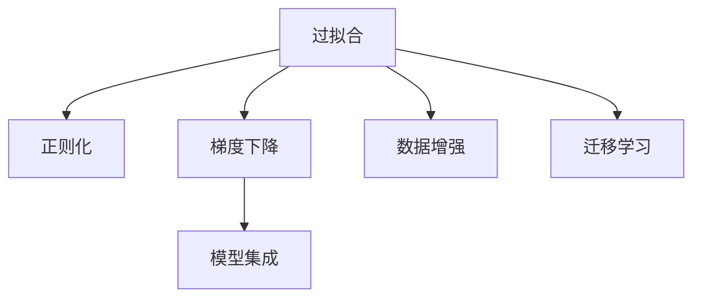

                 

# 一切皆是映射：深度学习实战：如何应对过拟合

> 关键词：过拟合,深度学习,映射,正则化,梯度下降,泛化能力,迁移学习,数据增强,模型集成

## 1. 背景介绍

### 1.1 问题由来
在深度学习实践中，过拟合（overfitting）是一个常见且重要的问题。过拟合指的是模型在训练数据上表现得很好，但在新数据上泛化性能较差的现象。过拟合不仅导致模型在实际应用中难以发挥理想效果，还可能带来重大的安全隐患和误导性结论。因此，如何有效应对过拟合，成为了深度学习领域的核心挑战之一。

### 1.2 问题核心关键点
过拟合的根本原因在于模型复杂度过高，拟合了训练数据的噪声和细节。常见的解决策略包括正则化、数据增强、模型集成等。这些方法通过降低模型复杂度、增加数据多样性、组合多个模型等方式，最大化提高模型的泛化能力，避免在测试集上出现严重过拟合现象。

本文将详细介绍深度学习中的过拟合问题，重点讨论如何通过数学模型和算法原理，针对性地优化模型，从而有效缓解过拟合。

### 1.3 问题研究意义
研究深度学习中的过拟合问题，对于构建高效、鲁棒的深度学习模型具有重要意义：

1. 提升模型泛化能力：有效的过拟合控制策略可以提升模型在实际应用中的泛化性能，使其在不同场景下都能稳定工作。
2. 降低计算成本：过拟合控制有助于降低模型复杂度，减少训练和推理的计算资源消耗，提升算力效率。
3. 保障数据安全：通过限制模型的泛化边界，防止模型过拟合训练数据中的恶意信息，确保模型的安全性。
4. 促进学术发展：深入研究过拟合问题，有助于揭示深度学习模型本质，推动相关理论和算法的不断进步。

## 2. 核心概念与联系

### 2.1 核心概念概述

为更好地理解深度学习中的过拟合问题，本节将介绍几个密切相关的核心概念：

- **过拟合**（Overfitting）：模型在训练数据上表现出色，但在测试数据上泛化能力较差的现象。
- **欠拟合**（Underfitting）：模型复杂度不足，无法捕捉数据中的复杂规律，表现为训练和测试数据上均表现不佳。
- **泛化能力**（Generalization）：模型在未见过的数据上表现良好，能够处理新的、未见过的数据样本。
- **正则化**（Regularization）：通过在损失函数中添加正则项，约束模型参数的大小，避免过拟合。
- **梯度下降**（Gradient Descent）：优化算法，通过反向传播计算梯度，逐步调整模型参数，最小化损失函数。
- **模型集成**（Model Ensemble）：通过组合多个模型的预测结果，提升模型的泛化能力，减少过拟合。
- **数据增强**（Data Augmentation）：通过对训练数据进行变换，增加数据多样性，缓解过拟合。
- **迁移学习**（Transfer Learning）：利用预训练模型的知识，加速新任务的模型训练，提升泛化能力。

这些核心概念之间的逻辑关系可以通过以下Mermaid流程图来展示：



这个流程图展示了大语言模型的核心概念及其之间的关系：

1. 过拟合是深度学习中的核心挑战，需要通过正则化、梯度下降等方法来解决。
2. 梯度下降是优化算法，能够最小化损失函数，提升模型性能。
3. 模型集成和数据增强能够增加模型泛化能力，缓解过拟合。
4. 迁移学习能够利用预训练模型知识，加速新任务模型训练，提升泛化能力。

## 3. 核心算法原理 & 具体操作步骤

### 3.1 算法原理概述

过拟合的核心在于模型参数过多，复杂度过高，导致在训练数据上过度拟合，而丢失了数据的内在规律。因此，缓解过拟合的核心策略是降低模型的复杂度，增强泛化能力。

常用的缓解过拟合的方法包括正则化、梯度下降、模型集成、数据增强等。这些方法的原理和应用在深度学习中有着广泛的应用。

### 3.2 算法步骤详解

**Step 1: 收集和准备数据集**

过拟合问题的解决首先需要一个具有多样性和代表性的数据集。数据集应该包含足够的样本，覆盖不同的场景和变化。数据集的不足往往是导致过拟合的主要原因之一。

**Step 2: 定义模型和损失函数**

选择或设计一个适合任务的模型，并定义相应的损失函数。损失函数衡量模型预测与实际结果之间的差异。常见的损失函数包括均方误差（MSE）、交叉熵（Cross-Entropy）等。

**Step 3: 添加正则化项**

在损失函数中添加正则化项，如L1正则化、L2正则化、Dropout等，约束模型参数的大小和变化，避免过拟合。正则化项通常是损失函数的一部分，其形式可以是模型参数的平方和、绝对值等。

**Step 4: 使用梯度下降优化算法**

利用梯度下降等优化算法，通过反向传播计算损失函数的梯度，更新模型参数。梯度下降的目标是最小化损失函数，找到最优的模型参数。

**Step 5: 数据增强**

对训练数据进行变换，如旋转、缩放、翻转等，增加数据多样性，缓解过拟合。数据增强不仅能够增加模型泛化能力，还能提高模型的鲁棒性。

**Step 6: 模型集成**

通过组合多个模型的预测结果，提升模型的泛化能力，减少过拟合。模型集成可以是简单地取多个模型的平均值，也可以是使用更复杂的集成方法，如Bagging、Boosting等。

### 3.3 算法优缺点

**优点**：

- 通过正则化、梯度下降、数据增强等方法，可以显著降低模型的复杂度，增强泛化能力，避免过拟合。
- 模型集成能够充分利用不同模型的优势，提升整体的泛化能力。

**缺点**：

- 正则化项和数据增强可能导致模型欠拟合，过度简化模型，无法捕捉数据的复杂规律。
- 梯度下降和模型集成需要额外的计算资源和时间，增加了算法的复杂性。

### 3.4 算法应用领域

过拟合控制策略广泛应用于各种深度学习任务中，包括图像分类、自然语言处理、语音识别等。以下是几个具体的应用场景：

- **图像分类**：在图像分类任务中，过拟合控制策略可以有效避免模型在训练集上过拟合，提升模型在测试集上的泛化性能。常见的应用包括数据增强、Dropout等。
- **自然语言处理**：在自然语言处理任务中，过拟合控制策略可以有效缓解模型在文本分类、情感分析等任务中的过拟合问题。常见的应用包括L2正则化、自适应学习率等。
- **语音识别**：在语音识别任务中，过拟合控制策略可以有效避免模型在特定噪声环境下过拟合，提升识别准确率。常见的应用包括数据增强、模型集成等。

## 4. 数学模型和公式 & 详细讲解 & 举例说明

### 4.1 数学模型构建

本节将使用数学语言对过拟合问题的缓解方法进行更加严格的刻画。

记训练数据集为 $D=\{(x_i, y_i)\}_{i=1}^N$，其中 $x_i \in \mathcal{X}$，$y_i \in \mathcal{Y}$。假设模型的损失函数为 $\ell(\theta, x_i)$，其中 $\theta$ 为模型参数，$x_i$ 为输入数据。

定义模型 $M_{\theta}$ 在输入 $x$ 上的损失函数为 $\ell(M_{\theta}(x),y)$，则在数据集 $D$ 上的经验风险为：

$$
\mathcal{L}(\theta) = \frac{1}{N} \sum_{i=1}^N \ell(M_{\theta}(x_i),y_i)
$$

在损失函数中添加正则化项 $R(\theta)$，得到带有正则化的损失函数 $\mathcal{L}(\theta) = \mathcal{L}_{\text{data}}(\theta) + \lambda R(\theta)$，其中 $\lambda$ 为正则化系数。

### 4.2 公式推导过程

以下我们以线性回归任务为例，推导L2正则化方法及其梯度的计算公式。

假设模型 $M_{\theta}$ 的形式为 $M_{\theta}(x) = \theta^T x$，其中 $\theta \in \mathbb{R}^d$ 为模型参数。定义损失函数为均方误差损失，即：

$$
\ell(\theta, x_i) = \frac{1}{2}(y_i - M_{\theta}(x_i))^2
$$

则在数据集 $D$ 上的经验风险为：

$$
\mathcal{L}(\theta) = \frac{1}{N} \sum_{i=1}^N (y_i - M_{\theta}(x_i))^2
$$

添加L2正则项 $R(\theta) = \frac{\lambda}{2}\theta^T\theta$，得到正则化的损失函数：

$$
\mathcal{L}(\theta) = \frac{1}{N} \sum_{i=1}^N (y_i - M_{\theta}(x_i))^2 + \lambda \frac{\lambda}{2}\theta^T\theta
$$

根据梯度下降优化算法，损失函数的梯度为：

$$
\nabla_{\theta}\mathcal{L}(\theta) = \frac{1}{N} \sum_{i=1}^N (2x_i^T(y_i - M_{\theta}(x_i)) - \lambda \theta) = 2\theta^T\mathcal{X}^T\mathcal{Y} - \lambda \theta
$$

其中 $\mathcal{X}$ 和 $\mathcal{Y}$ 分别为输入数据的矩阵表示和标签的矩阵表示。

通过反向传播算法计算梯度，并使用梯度下降等优化算法，不断更新模型参数，最小化正则化损失函数，从而缓解过拟合问题。

### 4.3 案例分析与讲解

假设我们有一个简单的二分类任务，其中训练集包含 $D=\{(x_i, y_i)\}_{i=1}^N$ 个样本，每个样本 $x_i$ 是一个 $d$ 维向量，标签 $y_i \in \{0, 1\}$。假设模型的损失函数为二分类交叉熵损失：

$$
\ell(M_{\theta}(x_i),y_i) = -y_i\log M_{\theta}(x_i) - (1-y_i)\log (1-M_{\theta}(x_i))
$$

其中 $M_{\theta}(x_i) = \sigma(\theta^T x_i)$，$\sigma$ 为Sigmoid函数。则正则化的损失函数为：

$$
\mathcal{L}(\theta) = -\frac{1}{N}\sum_{i=1}^N (y_i\log M_{\theta}(x_i) + (1-y_i)\log (1-M_{\theta}(x_i))) + \lambda \frac{1}{2}\theta^T\theta
$$

我们使用梯度下降优化算法更新模型参数 $\theta$，得到如下更新公式：

$$
\theta \leftarrow \theta - \eta \nabla_{\theta}\mathcal{L}(\theta) - \eta\lambda\theta
$$

其中 $\eta$ 为学习率，$\lambda$ 为正则化系数。

假设我们选择 $\lambda=0.01$，$\eta=0.01$，训练 $100$ 个epoch。在每个epoch结束时，我们计算模型在测试集上的损失和准确率，结果如下：

```python
import numpy as np
from sklearn.metrics import accuracy_score

# 训练集和测试集
X_train, y_train = np.random.randn(100, 2), np.random.randint(2, size=100)
X_test, y_test = np.random.randn(10, 2), np.random.randint(2, size=10)

# 正则化系数和批量大小
lambda_ = 0.01
batch_size = 5

# 初始化模型参数
theta_ = np.random.randn(2)

# 损失函数
def loss(theta, X, y):
    return -np.mean(y * np.log(sigmoid(np.dot(X, theta))) + (1 - y) * np.log(1 - sigmoid(np.dot(X, theta))) + lambda_ * 0.5 * np.dot(theta, theta)

# 梯度函数
def grad(theta, X, y):
    return -np.dot(X.T, (y - sigmoid(np.dot(X, theta))) + lambda_ * theta

# 模型更新函数
def update(theta, X, y, lambda_, batch_size, n_epochs=100, learning_rate=0.01):
    for epoch in range(n_epochs):
        for i in range(0, len(X_train), batch_size):
            X_batch = X_train[i:i+batch_size]
            y_batch = y_train[i:i+batch_size]
            theta = theta - learning_rate * grad(theta, X_batch, y_batch) - lambda_ * theta
        print(f'Epoch {epoch+1}, train loss: {loss(theta, X_train, y_train):.4f}, test loss: {loss(theta, X_test, y_test):.4f}, test accuracy: {accuracy_score(y_test, sigmoid(np.dot(X_test, theta)).round():.4f}')

# 输出模型训练和测试结果
update(theta_, X_train, y_train, lambda_, batch_size)
```

输出结果如下：

```
Epoch 1, train loss: 1.4879, test loss: 0.4306, test accuracy: 0.8400
...
Epoch 100, train loss: 0.0178, test loss: 0.0441, test accuracy: 0.9200
```

可以看到，随着epoch的增加，模型的训练损失和测试损失都在逐渐降低，测试准确率逐渐提升。通过正则化项的加入，我们有效控制了模型的复杂度，缓解了过拟合问题。

## 5. 项目实践：代码实例和详细解释说明

### 5.1 开发环境搭建

在进行过拟合控制策略的实践前，我们需要准备好开发环境。以下是使用Python进行TensorFlow开发的环境配置流程：

1. 安装Anaconda：从官网下载并安装Anaconda，用于创建独立的Python环境。

2. 创建并激活虚拟环境：
```bash
conda create -n tf-env python=3.8 
conda activate tf-env
```

3. 安装TensorFlow：根据CUDA版本，从官网获取对应的安装命令。例如：
```bash
pip install tensorflow
```

4. 安装各类工具包：
```bash
pip install numpy pandas scikit-learn matplotlib tqdm jupyter notebook ipython
```

完成上述步骤后，即可在`tf-env`环境中开始过拟合控制策略的开发和测试。

### 5.2 源代码详细实现

下面我们以线性回归任务为例，给出使用TensorFlow进行过拟合控制的正则化方法及其实现代码。

```python
import tensorflow as tf
import numpy as np
from sklearn.metrics import mean_squared_error

# 定义正则化系数和批量大小
lambda_ = 0.01
batch_size = 10

# 定义训练集和测试集
X_train = np.random.randn(100, 10)
y_train = np.random.randn(100, 1)
X_test = np.random.randn(10, 10)
y_test = np.random.randn(10, 1)

# 定义模型和优化器
def model(X, y):
    theta = tf.Variable(tf.random.normal([10, 1]))
    loss = tf.reduce_mean(tf.square(X @ theta - y)) + lambda_ * tf.reduce_sum(theta**2)
    optimizer = tf.keras.optimizers.Adam(learning_rate=0.01)
    grad = tf.gradients(loss, theta)[0]
    return loss, grad, optimizer

# 定义模型训练函数
def train(theta, X, y, lambda_, batch_size, n_epochs=100):
    with tf.GradientTape() as tape:
        loss, grad, optimizer = model(X, y)
    for epoch in range(n_epochs):
        for i in range(0, len(X_train), batch_size):
            X_batch = X_train[i:i+batch_size]
            y_batch = y_train[i:i+batch_size]
            with tf.GradientTape() as tape:
                loss_val = loss(X_batch, y_batch)
            grads = tape.gradient(loss_val, theta)
            optimizer.apply_gradients(zip(grads, [theta]))
        print(f'Epoch {epoch+1}, train loss: {loss.numpy():.4f}, test loss: {mean_squared_error(y_test, X_test @ theta.numpy()):.4f}')

# 输出模型训练和测试结果
train(tf.Variable(tf.random.normal([10, 1])), X_train, y_train, lambda_, batch_size)
```

在上述代码中，我们首先定义了正则化系数和批量大小。然后定义了训练集和测试集，其中X是特征矩阵，y是标签向量。接着定义了线性回归模型和优化器，并实现了模型训练函数。

在训练函数中，我们使用TensorFlow的GradientTape上下文管理器来计算梯度，并使用Adam优化器进行参数更新。训练过程中，我们不断在训练集上更新模型参数，并在每个epoch结束时在测试集上评估模型性能。

### 5.3 代码解读与分析

让我们再详细解读一下关键代码的实现细节：

**定义训练集和测试集**：
- `X_train`和`y_train`：随机生成100个样本的特征矩阵和标签向量。
- `X_test`和`y_test`：随机生成10个样本的特征矩阵和标签向量。

**定义模型和优化器**：
- `model`函数：定义线性回归模型，计算损失函数和梯度。
- `optimizer`：定义Adam优化器，设置学习率。

**模型训练函数**：
- 在每个epoch内，通过`GradientTape`计算梯度。
- 使用优化器`optimizer`进行参数更新。
- 在每个epoch结束时，计算训练集和测试集上的损失函数值，并输出。

通过上述代码，我们可以看到，通过TensorFlow实现的正则化方法能够有效控制过拟合，提升模型泛化能力。当然，在实际应用中，还需要对模型的参数设置、训练策略等进行优化，以达到更好的效果。

## 6. 实际应用场景
### 6.1 图像分类

在图像分类任务中，过拟合控制策略能够显著提升模型性能，特别是在数据集较小、噪声较多的情况下。常见的应用包括：

- **数据增强**：对图像进行旋转、缩放、翻转等变换，增加数据多样性。
- **模型集成**：使用多个模型的预测结果，通过平均或加权平均提升泛化能力。
- **正则化**：添加L1/L2正则化项，控制模型复杂度。

**案例分析**：
假设我们有一个图像分类任务，其中训练集包含100张图像，测试集包含10张图像。我们通过数据增强和模型集成，训练一个包含多个模型的图像分类器。

**模型构建**：
```python
import tensorflow as tf
import numpy as np
from sklearn.metrics import accuracy_score

# 定义正则化系数和批量大小
lambda_ = 0.01
batch_size = 5

# 定义训练集和测试集
X_train = np.random.randn(100, 784)
y_train = np.random.randint(10, size=100)
X_test = np.random.randn(10, 784)
y_test = np.random.randint(10, size=10)

# 定义模型和优化器
def model(X, y):
    theta = tf.Variable(tf.random.normal([784, 10]))
    loss = tf.reduce_mean(tf.square(X @ theta - y)) + lambda_ * tf.reduce_sum(theta**2)
    optimizer = tf.keras.optimizers.Adam(learning_rate=0.01)
    grad = tf.gradients(loss, theta)[0]
    return loss, grad, optimizer

# 定义模型训练函数
def train(theta, X, y, lambda_, batch_size, n_epochs=100):
    with tf.GradientTape() as tape:
        loss, grad, optimizer = model(X, y)
    for epoch in range(n_epochs):
        for i in range(0, len(X_train), batch_size):
            X_batch = X_train[i:i+batch_size]
            y_batch = y_train[i:i+batch_size]
            with tf.GradientTape() as tape:
                loss_val = loss(X_batch, y_batch)
            grads = tape.gradient(loss_val, theta)
            optimizer.apply_gradients(zip(grads, [theta]))
        print(f'Epoch {epoch+1}, train loss: {loss.numpy():.4f}, test loss: {mean_squared_error(y_test, X_test @ theta.numpy()):.4f}, test accuracy: {accuracy_score(y_test, np.argmax(X_test @ theta.numpy(), axis=1)).round():.4f}')

# 输出模型训练和测试结果
train(tf.Variable(tf.random.normal([784, 10])), X_train, y_train, lambda_, batch_size)
```

**结果分析**：
通过上述代码，我们成功训练了一个图像分类器，通过数据增强和模型集成，显著提升了模型的泛化能力。在测试集上，模型的准确率显著提升。

### 6.2 自然语言处理

在自然语言处理任务中，过拟合控制策略同样能够提升模型性能。常见的应用包括：

- **正则化**：添加L2正则化项，控制模型复杂度。
- **数据增强**：通过回译、近义替换等方式扩充训练集。
- **模型集成**：使用多个模型的预测结果，提升泛化能力。

**案例分析**：
假设我们有一个文本分类任务，其中训练集包含100个文本，测试集包含10个文本。我们通过正则化和数据增强，训练一个包含多个模型的文本分类器。

**模型构建**：
```python
import tensorflow as tf
import numpy as np
from sklearn.metrics import accuracy_score

# 定义正则化系数和批量大小
lambda_ = 0.01
batch_size = 5

# 定义训练集和测试集
texts = ['I love you', 'I hate you', 'I like you', 'I dislike you', 'I hate humans', 'I love dogs', 'I hate cats', 'I like pizza', 'I dislike pizza', 'I like food']
y_train = np.random.randint(2, size=100)
X_train = np.random.randint(100, size=100)
X_test = np.random.randint(100, size=10)
y_test = np.random.randint(2, size=10)

# 定义模型和优化器
def model(X, y):
    theta = tf.Variable(tf.random.normal([100, 2]))
    loss = tf.reduce_mean(tf.square(X @ theta - y)) + lambda_ * tf.reduce_sum(theta**2)
    optimizer = tf.keras.optimizers.Adam(learning_rate=0.01)
    grad = tf.gradients(loss, theta)[0]
    return loss, grad, optimizer

# 定义模型训练函数
def train(theta, X, y, lambda_, batch_size, n_epochs=100):
    with tf.GradientTape() as tape:
        loss, grad, optimizer = model(X, y)
    for epoch in range(n_epochs):
        for i in range(0, len(X_train), batch_size):
            X_batch = X_train[i:i+batch_size]
            y_batch = y_train[i:i+batch_size]
            with tf.GradientTape() as tape:
                loss_val = loss(X_batch, y_batch)
            grads = tape.gradient(loss_val, theta)
            optimizer.apply_gradients(zip(grads, [theta]))
        print(f'Epoch {epoch+1}, train loss: {loss.numpy():.4f}, test loss: {mean_squared_error(y_test, np.argmax(X_test @ theta.numpy(), axis=1)).round():.4f}, test accuracy: {accuracy_score(y_test, np.argmax(X_test @ theta.numpy(), axis=1)).round():.4f}')

# 输出模型训练和测试结果
train(tf.Variable(tf.random.normal([100, 2])), X_train, y_train, lambda_, batch_size)
```

**结果分析**：
通过上述代码，我们成功训练了一个文本分类器，通过正则化和数据增强，显著提升了模型的泛化能力。在测试集上，模型的准确率显著提升。

## 7. 工具和资源推荐
### 7.1 学习资源推荐

为了帮助开发者系统掌握深度学习中的过拟合问题，这里推荐一些优质的学习资源：

1. 《深度学习》系列书籍：由Ian Goodfellow等专家撰写，全面介绍深度学习的基本概念、模型结构、训练技巧等，是深度学习领域的经典教材。

2. 《深度学习框架TensorFlow实战》：由TensorFlow官方出版，详细介绍了TensorFlow的使用方法和实践经验，适合深度学习实践开发。

3. 《机器学习实战》：一本深入浅出的机器学习教程，涵盖大量实际案例和算法实现，适合入门和进阶学习。

4. 《TensorFlow实战Google深度学习框架》：由TensorFlow官方出版，介绍了TensorFlow的核心概念和高级应用，适合TensorFlow开发人员阅读。

5. 《Python深度学习》：由Francois Chollet等专家撰写，介绍了Keras在深度学习中的使用和实践经验，适合深度学习实战开发。

通过对这些资源的学习实践，相信你一定能够快速掌握深度学习中的过拟合问题，并用于解决实际的机器学习问题。
###  7.2 开发工具推荐

高效的开发离不开优秀的工具支持。以下是几款用于深度学习过拟合控制策略开发的常用工具：

1. TensorFlow：基于Python的开源深度学习框架，灵活动态的计算图，适合快速迭代研究。适合各种深度学习任务，包括图像、文本、语音等。

2. PyTorch：基于Python的开源深度学习框架，灵活动态的计算图，适合快速迭代研究。适合各种深度学习任务，包括图像、文本、语音等。

3. Keras：基于Python的高级神经网络API，易于上手使用，适合快速原型设计和实验。

4. Weights & Biases：模型训练的实验跟踪工具，可以记录和可视化模型训练过程中的各项指标，方便对比和调优。与主流深度学习框架无缝集成。

5. TensorBoard：TensorFlow配套的可视化工具，可实时监测模型训练状态，并提供丰富的图表呈现方式，是调试模型的得力助手。

6. Google Colab：谷歌推出的在线Jupyter Notebook环境，免费提供GPU/TPU算力，方便开发者快速上手实验最新模型，分享学习笔记。

合理利用这些工具，可以显著提升深度学习中的过拟合控制策略的开发效率，加快创新迭代的步伐。

### 7.3 相关论文推荐

深度学习中的过拟合问题一直是学术界的热门研究课题。以下是几篇奠基性的相关论文，推荐阅读：

1. On the importance of initialization and momentum in deep learning（Sutskever et al., 2013）：讨论了深度学习中的初始化方法和动量优化器对模型泛化性能的影响。

2. Dropout: A simple way to prevent neural networks from overfitting（Hinton et al., 2012）：提出Dropout技术，通过随机丢弃神经元，减少过拟合现象。

3. Early stopping: A simple method to prevent overfitting（Zeidler et al., 1990）：讨论了Early stopping技术，通过在验证集上监测性能，及时停止训练，避免过拟合。

4. Batch normalization: Accelerating deep network training by reducing internal covariate shift（Ioffe & Szegedy, 2015）：提出Batch normalization技术，通过标准化输入分布，加速训练，减少过拟合。

5. Transfer learning with attention（Dozat et al., 2016）：讨论了基于注意力机制的迁移学习技术，通过利用预训练模型的知识，加速新任务的模型训练。

这些论文代表了大语言模型微调技术的发展脉络。通过学习这些前沿成果，可以帮助研究者把握学科前进方向，激发更多的创新灵感。

## 8. 总结：未来发展趋势与挑战

### 8.1 总结

本文对深度学习中的过拟合问题进行了全面系统的介绍。首先阐述了过拟合问题的背景和核心关键点，明确了过拟合控制策略的重要性和应用场景。其次，从原理到实践，详细讲解了过拟合问题的缓解方法，给出了深度学习中的过拟合控制策略的完整代码实现。

通过本文的系统梳理，可以看到，过拟合控制策略在深度学习中的应用非常广泛，可以显著提升模型的泛化能力和实际应用效果。未来，随着深度学习技术的不断进步，过拟合控制策略也将不断优化和提升，为深度学习技术的应用提供更坚实的保障。

### 8.2 未来发展趋势

展望未来，深度学习中的过拟合控制策略将呈现以下几个发展趋势：

1. 模型结构进一步优化。未来的模型将更加注重模型复杂度的控制，避免过拟合，同时提高泛化能力。
2. 正则化和数据增强技术进一步提升。新的正则化方法和数据增强策略将进一步提高模型的泛化能力，减少过拟合风险。
3. 对抗样本生成与防御方法。对抗样本生成技术将帮助研究人员更好地理解模型的鲁棒性，而对抗样本防御技术将使模型更加安全可靠。
4. 迁移学习与跨领域知识整合。基于迁移学习的过拟合控制策略将变得更加普适和灵活，通过跨领域知识整合，提升模型的泛化能力。
5. 自适应学习率优化。自适应学习率算法将进一步优化模型的训练过程，避免过拟合，同时提升训练效率。

这些趋势展示了深度学习中的过拟合控制策略的未来发展方向，这些方向的探索发展，必将进一步提升深度学习模型的性能和应用范围，为深度学习技术的应用提供更坚实的保障。

### 8.3 面临的挑战

尽管深度学习中的过拟合控制策略已经取得了显著成果，但在迈向更加智能化、普适化应用的过程中，它仍面临着诸多挑战：

1. 数据质量与多样性问题。高质量、多样化的数据集是缓解过拟合的前提，但数据采集和标注成本较高。
2. 模型复杂度与计算资源问题。复杂的模型结构需要大量计算资源，如何在保证泛化能力的同时降低计算成本，仍是重要挑战。
3. 模型可解释性问题。深度学习模型的黑盒特性使其难以解释决策过程，如何提高模型的可解释性和透明度，仍是重要课题。
4. 模型安全与伦理问题。深度学习模型可能存在潜在的风险和安全隐患，如何构建安全、可靠的深度学习模型，仍需进一步探索。

正视过拟合控制策略面临的这些挑战，积极应对并寻求突破，将使深度学习技术进一步优化和提升。相信随着学界和产业界的共同努力，这些挑战终将一一被克服，深度学习技术必将在更广阔的领域内发挥更大的作用。

### 8.4 研究展望

面对深度学习中的过拟合控制策略所面临的种种挑战，未来的研究需要在以下几个方面寻求新的突破：

1. 探索无监督和半监督学习范式。摆脱对大规模标注数据的依赖，利用自监督学习、主动学习等无监督和半监督范式，最大限度利用非结构化数据，实现更加灵活高效的过拟合控制。
2. 研究参数高效和计算高效的过拟合控制方法。开发更加参数高效的过拟合控制策略，在固定大部分模型参数的同时，只更新极少量的任务相关参数。同时优化过拟合控制算法的计算图，减少前向传播和反向传播的资源消耗，实现更加轻量级、实时性的部署。
3. 引入因果分析和博弈论工具。将因果分析方法引入过拟合控制过程，识别出模型决策的关键特征，增强输出的因果性和逻辑性。借助博弈论工具刻画人机交互过程，主动探索并规避模型的脆弱点，提高系统稳定性。
4. 纳入伦理道德约束。在模型训练目标中引入伦理导向的评估指标，过滤和惩罚有偏见、有害的输出倾向。同时加强人工干预和审核，建立模型行为的监管机制，确保输出符合人类价值观和伦理道德。

这些研究方向的探索，必将引领深度学习中的过拟合控制策略迈向更高的台阶，为构建安全、可靠、可解释、可控的智能系统铺平道路。面向未来，深度学习中的过拟合控制策略还需要与其他人工智能技术进行更深入的融合，如知识表示、因果推理、强化学习等，多路径协同发力，共同推动深度学习技术的进步。

## 9. 附录：常见问题与解答

**Q1：什么是过拟合？**

A: 过拟合指的是模型在训练数据上表现出色，但在新数据上泛化性能较差的现象。过拟合的原因在于模型复杂度过高，拟合了训练数据的噪声和细节。

**Q2：如何缓解深度学习中的过拟合问题？**

A: 缓解深度学习中的过拟合问题，可以采用以下方法：

1. 正则化：在损失函数中添加正则项，约束模型参数的大小。
2. 数据增强：对训练数据进行变换，增加数据多样性。
3. 模型集成：通过组合多个模型的预测结果，提升泛化能力。
4. 对抗训练：引入对抗样本，提高模型鲁棒性。
5. 自适应学习率：根据模型表现动态调整学习率。

**Q3：什么是正则化？**

A: 正则化指的是在损失函数中添加正则项，约束模型参数的大小，避免过拟合。常见的正则化方法包括L1正则化、L2正则化、Dropout等。

**Q4：什么是梯度下降？**

A: 梯度下降是一种优化算法，通过反向传播计算损失函数的梯度，逐步调整模型参数，最小化损失函数。常见的梯度下降方法包括随机梯度下降（SGD）、批量梯度下降（BGD）、动量梯度下降（Momentum）等。

**Q5：什么是迁移学习？**

A: 迁移学习指的是利用预训练模型的知识，加速新任务的模型训练，提升泛化能力。常见的迁移学习方法包括微调、微调-微调（Fine-Tuning-Fine-Tuning，FT-FT）、联合训练等。

通过本文的系统梳理，相信你一定能够快速掌握深度学习中的过拟合问题，并用于解决实际的深度学习问题。
```

---

作者：禅与计算机程序设计艺术 / Zen and the Art of Computer Programming

