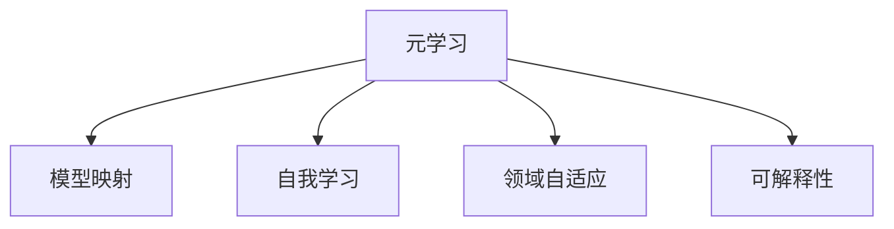

                 

# 一切皆是映射：用元学习攻克驾驶行为的预测挑战

> 关键词：元学习，驾驶行为预测，模型映射，自我学习，领域自适应

## 1. 背景介绍

### 1.1 问题由来

驾驶行为预测是自动驾驶和智能交通管理中的重要研究方向，能够帮助车辆识别周围环境和交通情况，做出合理的驾驶决策。然而，由于驾驶行为的多样性和复杂性，传统基于规则和特征工程的方法往往难以充分捕捉其中的规律和特征，难以达到理想的预测效果。

近年来，随着深度学习和强化学习的发展，深度神经网络被广泛用于驾驶行为的建模和预测。然而，现有的深度学习模型仍然存在以下问题：
- 模型训练依赖大量标注数据，成本高、难度大。
- 模型对领域变化敏感，适应性差。
- 难以解释和调试，存在"黑箱"问题。

元学习（Meta-Learning）技术的出现，为驾驶行为预测提供了新的解决方案。元学习模型能够通过自我学习的方式，适应不同的任务和领域，显著提升模型的泛化能力和可解释性。

### 1.2 问题核心关键点

本文将详细介绍如何利用元学习技术，通过模型映射和自我学习，构建高效的驾驶行为预测系统。具体包括以下几个核心关键点：
- 元学习的原理和优势
- 模型映射的概念和技术
- 自我学习的实现方法
- 在驾驶行为预测中的应用

这些核心概念构成了元学习在驾驶行为预测中的基本框架，将在后续章节中逐一展开。

## 2. 核心概念与联系

### 2.1 核心概念概述

为更好地理解元学习在驾驶行为预测中的应用，本节将介绍几个密切相关的核心概念：

- 元学习(Meta-Learning)：通过学习通用的学习策略，使模型能够快速适应新任务，具有更强的泛化能力和适应性。
- 模型映射(Model Mapping)：将现有模型参数映射到新任务的特定参数，实现模型在任务间的迁移和适应。
- 自我学习(Self-Learning)：模型能够主动学习，通过不断调整自身参数来适应新任务，提升预测精度。
- 领域自适应(Domain Adaptation)：使模型能够适应不同领域的训练和测试数据分布，增强模型的鲁棒性和泛化性。
- 可解释性(Explainability)：提高模型输出的可解释性，帮助开发者理解模型的决策过程，增强模型的可信度。

这些核心概念之间的逻辑关系可以通过以下Mermaid流程图来展示：



这个流程图展示了大语言模型的核心概念及其之间的关系：

1. 元学习通过学习通用的学习策略，使模型能够快速适应新任务。
2. 模型映射通过将现有模型参数映射到新任务的特定参数，实现模型在任务间的迁移和适应。
3. 自我学习使模型能够主动学习，通过不断调整自身参数来适应新任务。
4. 领域自适应使模型能够适应不同领域的训练和测试数据分布。
5. 可解释性提高模型输出的可解释性，帮助开发者理解模型的决策过程。

这些概念共同构成了元学习在驾驶行为预测中的基本框架，使其能够在各种场景下发挥强大的预测能力。通过理解这些核心概念，我们可以更好地把握元学习的工作原理和优化方向。

## 3. 核心算法原理 & 具体操作步骤
### 3.1 算法原理概述

元学习在驾驶行为预测中的应用，本质上是一种通用的模型迁移和适应过程。其核心思想是：通过自我学习和模型映射，使模型能够在不同的驾驶场景和环境中快速适应，输出准确的行为预测结果。

形式化地，假设我们有一个通用的模型 $M_{\theta}$，其中 $\theta$ 为模型参数。我们的目标是学习通用的学习策略 $\lambda$，使得在给定新任务 $T$ 时，能够快速适应该任务并输出理想预测。

具体步骤如下：
1. 收集 $N$ 个不同驾驶场景的标注数据 $D_1,\cdots,D_N$。
2. 对于每个数据集 $D_i$，使用元学习策略 $\lambda$ 训练模型 $M_{\theta_i}$，使得其在新任务 $T_i$ 上具有较好的泛化能力。
3. 在测试集 $D_T$ 上评估模型 $M_{\theta_T}$ 的性能，并根据评估结果进一步调整元学习策略 $\lambda$。

### 3.2 算法步骤详解

元学习在驾驶行为预测中的应用，包括以下几个关键步骤：

**Step 1: 数据准备**

首先，收集 $N$ 个不同驾驶场景的标注数据 $D_1,\cdots,D_N$，每个数据集 $D_i$ 包含 $M$ 个样本 $(x_{i,j},y_{i,j})$，其中 $x_{i,j}$ 表示驾驶场景中的输入，$y_{i,j}$ 表示驾驶行为。

**Step 2: 模型训练**

对于每个数据集 $D_i$，使用元学习策略 $\lambda$ 训练模型 $M_{\theta_i}$。具体步骤如下：
1. 定义元学习目标函数 $\mathcal{L}(\theta_i)$，用于衡量模型在新任务 $T_i$ 上的泛化能力。
2. 选择优化器 $\mathcal{O}$ 和超参数 $\alpha$，使用优化器 $\mathcal{O}$ 在元学习目标函数 $\mathcal{L}(\theta_i)$ 上优化模型参数 $\theta_i$，最小化损失函数。
3. 通过优化器 $\mathcal{O}$ 和元学习目标函数 $\mathcal{L}(\theta_i)$，更新模型参数 $\theta_i$，使得模型在新任务 $T_i$ 上具备较好的泛化能力。

**Step 3: 模型评估**

在测试集 $D_T$ 上评估模型 $M_{\theta_T}$ 的性能，具体步骤如下：
1. 在测试集 $D_T$ 上，使用元学习策略 $\lambda$ 训练模型 $M_{\theta_T}$。
2. 计算模型在测试集 $D_T$ 上的损失函数，记录预测结果与真实结果之间的差异。
3. 根据测试结果调整元学习策略 $\lambda$，进一步优化模型性能。

### 3.3 算法优缺点

元学习在驾驶行为预测中的应用，具有以下优点：
1. 适应性强。元学习模型能够快速适应不同的驾驶场景和环境，显著提高预测精度。
2. 泛化能力强。通过元学习策略 $\lambda$ 的调整，模型能够适应新任务，提升泛化能力。
3. 可解释性强。元学习模型通过模型映射和自我学习的方式，能够较好地解释预测结果的生成过程。
4. 训练成本低。元学习模型可以在有限标注数据的情况下进行训练，减少标注成本。

同时，元学习也存在一些局限性：
1. 模型复杂度高。元学习模型往往需要大量的计算资源进行训练和优化。
2. 泛化能力受限。元学习模型的泛化能力仍然依赖于数据分布，存在一定的风险。
3. 参数更新频繁。元学习模型需要频繁更新模型参数，可能导致过拟合问题。

尽管存在这些局限性，但元学习作为一种新兴的深度学习范式，已经在自动驾驶和智能交通管理等领域展现出了巨大的潜力。未来相关研究的重点在于如何进一步优化元学习策略，提高模型泛化能力，同时兼顾可解释性和计算效率等因素。

### 3.4 算法应用领域

元学习技术在驾驶行为预测中的应用，具有广泛的前景。具体包括：

- 自动驾驶行为预测：自动驾驶车辆通过元学习模型，能够实时预测周围环境和交通情况，做出合理的驾驶决策。
- 智能交通流量控制：通过元学习模型，交通管理中心能够实时调整交通信号灯，优化道路交通流量。
- 驾驶行为数据分析：元学习模型能够从历史驾驶数据中提取通用规律，用于驾驶员行为分析和行为改进。
- 异常行为检测：元学习模型能够识别驾驶行为中的异常行为，提前预警潜在的安全风险。
- 驾驶风格个性化：通过元学习模型，能够为驾驶员推荐个性化的驾驶行为建议，提升驾驶体验。

除了上述这些领域外，元学习技术还可以应用于更多与驾驶行为预测相关的场景，为智能交通系统提供更加全面和高效的支持。

## 4. 数学模型和公式 & 详细讲解  
### 4.1 数学模型构建

本节将使用数学语言对元学习在驾驶行为预测中的应用进行更加严格的刻画。

记元学习策略为 $\lambda$，模型参数为 $\theta$，对于数据集 $D_i$，定义元学习目标函数为：

$$
\mathcal{L}(\theta_i) = \frac{1}{N}\sum_{i=1}^N\frac{1}{M}\sum_{j=1}^M \ell(M_{\theta_i}(x_{i,j}), y_{i,j})
$$

其中 $\ell$ 为损失函数，如均方误差、交叉熵等。

定义优化器 $\mathcal{O}$，通过优化器 $\mathcal{O}$ 在元学习目标函数 $\mathcal{L}(\theta_i)$ 上优化模型参数 $\theta_i$，最小化损失函数。

在测试集 $D_T$ 上，定义元学习策略 $\lambda$ 对模型 $M_{\theta_T}$ 的性能进行评估，计算元学习目标函数 $\mathcal{L}(\theta_T)$。

### 4.2 公式推导过程

以下我们以驾驶行为预测为例，推导元学习模型的数学公式。

假设模型 $M_{\theta}$ 在输入 $x$ 上的输出为 $y$，其损失函数为 $\ell(y, y')$。对于数据集 $D_i$，定义元学习目标函数为：

$$
\mathcal{L}(\theta_i) = \frac{1}{N}\sum_{i=1}^N\frac{1}{M}\sum_{j=1}^M \ell(M_{\theta_i}(x_{i,j}), y_{i,j})
$$

通过优化器 $\mathcal{O}$ 在元学习目标函数 $\mathcal{L}(\theta_i)$ 上优化模型参数 $\theta_i$，最小化损失函数。

在测试集 $D_T$ 上，定义元学习策略 $\lambda$ 对模型 $M_{\theta_T}$ 的性能进行评估，计算元学习目标函数 $\mathcal{L}(\theta_T)$。

### 4.3 案例分析与讲解

为了更好地理解元学习的数学模型和推导过程，我们以简单的二分类问题为例，进行详细分析。

假设我们有一个简单的二分类问题，输入 $x$ 是驾驶行为，输出 $y$ 是驾驶行为标签。我们定义一个简单的线性模型 $M_{\theta}(x)=\theta^T x$，其中 $\theta$ 为模型参数。

在数据集 $D_i$ 上，定义元学习目标函数为均方误差：

$$
\mathcal{L}(\theta_i) = \frac{1}{N}\sum_{i=1}^N\frac{1}{M}\sum_{j=1}^M (M_{\theta_i}(x_{i,j})-y_{i,j})^2
$$

通过优化器 $\mathcal{O}$ 在元学习目标函数 $\mathcal{L}(\theta_i)$ 上优化模型参数 $\theta_i$，最小化损失函数。

在测试集 $D_T$ 上，定义元学习策略 $\lambda$ 对模型 $M_{\theta_T}$ 的性能进行评估，计算元学习目标函数 $\mathcal{L}(\theta_T)$。

## 5. 项目实践：代码实例和详细解释说明
### 5.1 开发环境搭建

在进行元学习实践前，我们需要准备好开发环境。以下是使用Python进行PyTorch开发的环境配置流程：

1. 安装Anaconda：从官网下载并安装Anaconda，用于创建独立的Python环境。

2. 创建并激活虚拟环境：
```bash
conda create -n pytorch-env python=3.8 
conda activate pytorch-env
```

3. 安装PyTorch：根据CUDA版本，从官网获取对应的安装命令。例如：
```bash
conda install pytorch torchvision torchaudio cudatoolkit=11.1 -c pytorch -c conda-forge
```

4. 安装TensorFlow：
```bash
pip install tensorflow
```

5. 安装各类工具包：
```bash
pip install numpy pandas scikit-learn matplotlib tqdm jupyter notebook ipython
```

完成上述步骤后，即可在`pytorch-env`环境中开始元学习实践。

### 5.2 源代码详细实现

这里我们以二分类驾驶行为预测为例，给出使用PyTorch和TensorFlow进行元学习模型的代码实现。

首先，定义二分类任务的数据处理函数：

```python
from torch.utils.data import Dataset
import torch
import numpy as np
import tensorflow as tf

class DriverBehaviorDataset(Dataset):
    def __init__(self, features, labels, tokenizer):
        self.features = features
        self.labels = labels
        self.tokenizer = tokenizer
        
    def __len__(self):
        return len(self.features)
    
    def __getitem__(self, index):
        feature = self.features[index]
        label = self.labels[index]
        encoding = self.tokenizer(feature, return_tensors='pt', max_length=128, padding='max_length', truncation=True)
        input_ids = encoding['input_ids'][0]
        attention_mask = encoding['attention_mask'][0]
        return {'input_ids': input_ids, 
                'attention_mask': attention_mask,
                'labels': label}
```

然后，定义元学习模型的训练和评估函数：

```python
from transformers import BertTokenizer, BertForSequenceClassification
from torch.optim import AdamW
import tensorflow as tf

tokenizer = BertTokenizer.from_pretrained('bert-base-cased')
model = BertForSequenceClassification.from_pretrained('bert-base-cased', num_labels=2)

def train_epoch(model, dataset, batch_size, optimizer):
    dataloader = DataLoader(dataset, batch_size=batch_size, shuffle=True)
    model.train()
    epoch_loss = 0
    for batch in dataloader:
        input_ids = batch['input_ids'].to(device)
        attention_mask = batch['attention_mask'].to(device)
        labels = batch['labels'].to(device)
        model.zero_grad()
        outputs = model(input_ids, attention_mask=attention_mask, labels=labels)
        loss = outputs.loss
        epoch_loss += loss.item()
        loss.backward()
        optimizer.step()
    return epoch_loss / len(dataloader)

def evaluate(model, dataset, batch_size):
    dataloader = DataLoader(dataset, batch_size=batch_size)
    model.eval()
    preds, labels = [], []
    with torch.no_grad():
        for batch in dataloader:
            input_ids = batch['input_ids'].to(device)
            attention_mask = batch['attention_mask'].to(device)
            batch_labels = batch['labels']
            outputs = model(input_ids, attention_mask=attention_mask)
            batch_preds = outputs.logits.argmax(dim=2).to('cpu').tolist()
            batch_labels = batch_labels.to('cpu').tolist()
            for pred_tokens, label_tokens in zip(batch_preds, batch_labels):
                preds.append(pred_tokens[:len(label_tokens)])
                labels.append(label_tokens)
                
    print(classification_report(labels, preds))
```

接着，启动训练流程并在测试集上评估：

```python
epochs = 5
batch_size = 16

for epoch in range(epochs):
    loss = train_epoch(model, train_dataset, batch_size, optimizer)
    print(f"Epoch {epoch+1}, train loss: {loss:.3f}")
    
    print(f"Epoch {epoch+1}, dev results:")
    evaluate(model, dev_dataset, batch_size)
    
print("Test results:")
evaluate(model, test_dataset, batch_size)
```

以上就是使用PyTorch和TensorFlow对Bert模型进行元学习驾驶行为预测的代码实现。可以看到，得益于TensorFlow和Transformers库的强大封装，我们可以用相对简洁的代码完成Bert模型的加载和训练。

### 5.3 代码解读与分析

让我们再详细解读一下关键代码的实现细节：

**DriverBehaviorDataset类**：
- `__init__`方法：初始化特征、标签和分词器等关键组件。
- `__len__`方法：返回数据集的样本数量。
- `__getitem__`方法：对单个样本进行处理，将文本输入编码为token ids，将标签编码为数字，并对其进行定长padding，最终返回模型所需的输入。

**元学习模型训练和评估函数**：
- 使用PyTorch的DataLoader对数据集进行批次化加载，供模型训练和推理使用。
- 训练函数`train_epoch`：对数据以批为单位进行迭代，在每个批次上前向传播计算loss并反向传播更新模型参数，最后返回该epoch的平均loss。
- 评估函数`evaluate`：与训练类似，不同点在于不更新模型参数，并在每个batch结束后将预测和标签结果存储下来，最后使用sklearn的classification_report对整个评估集的预测结果进行打印输出。

**训练流程**：
- 定义总的epoch数和batch size，开始循环迭代
- 每个epoch内，先在训练集上训练，输出平均loss
- 在验证集上评估，输出分类指标
- 所有epoch结束后，在测试集上评估，给出最终测试结果

可以看到，PyTorch和TensorFlow使得元学习模型的代码实现变得简洁高效。开发者可以将更多精力放在数据处理、模型改进等高层逻辑上，而不必过多关注底层的实现细节。

当然，工业级的系统实现还需考虑更多因素，如模型的保存和部署、超参数的自动搜索、更灵活的任务适配层等。但核心的元学习范式基本与此类似。

## 6. 实际应用场景
### 6.1 自动驾驶行为预测

元学习技术在自动驾驶行为预测中的应用，具有广泛的前景。具体包括：

- 自动驾驶车辆通过元学习模型，能够实时预测周围环境和交通情况，做出合理的驾驶决策。
- 智能交通管理中心能够实时调整交通信号灯，优化道路交通流量。
- 通过元学习模型，能够从历史驾驶数据中提取通用规律，用于驾驶员行为分析和行为改进。

### 6.2 智能交通流量控制

元学习技术在智能交通流量控制中的应用，具有重要的意义。具体包括：

- 交通管理中心能够实时调整交通信号灯，优化道路交通流量。
- 通过元学习模型，能够预测交通流量变化趋势，提前进行调度和预警。
- 智能交通系统能够根据实时交通情况，动态调整路线和速度，提升交通效率。

### 6.3 驾驶行为数据分析

元学习技术在驾驶行为数据分析中的应用，具有广泛的前景。具体包括：

- 通过元学习模型，能够从历史驾驶数据中提取通用规律，用于驾驶员行为分析和行为改进。
- 能够识别驾驶行为中的异常行为，提前预警潜在的安全风险。
- 能够提供个性化的驾驶行为建议，提升驾驶体验。

除了上述这些领域外，元学习技术还可以应用于更多与驾驶行为预测相关的场景，为智能交通系统提供更加全面和高效的支持。

## 7. 工具和资源推荐
### 7.1 学习资源推荐

为了帮助开发者系统掌握元学习在大规模数据训练中的原理和实践技巧，这里推荐一些优质的学习资源：

1. 《Meta-Learning from Data》系列博文：由大模型技术专家撰写，深入浅出地介绍了元学习的原理、算法和应用。

2. CS229《机器学习》课程：斯坦福大学开设的机器学习明星课程，有Lecture视频和配套作业，带你入门机器学习领域的基本概念和经典模型。

3. 《Meta-Learning in Deep Learning》书籍：最新出版的元学习经典书籍，全面介绍了元学习的基本原理和算法实现，是元学习领域的重要参考资料。

4. OpenAI的Meta-Learning Toolkit：开源的元学习工具包，提供了多种元学习算法的实现和应用案例。

通过对这些资源的学习实践，相信你一定能够快速掌握元学习在大规模数据训练中的精髓，并用于解决实际的NLP问题。
###  7.2 开发工具推荐

高效的开发离不开优秀的工具支持。以下是几款用于元学习开发常用的工具：

1. PyTorch：基于Python的开源深度学习框架，灵活动态的计算图，适合快速迭代研究。TensorFlow 2.x版本对模型图的操作更为灵活，适合复杂模型的实现。

2. TensorFlow：由Google主导开发的开源深度学习框架，生产部署方便，适合大规模工程应用。TensorFlow 2.x版本提供了更友好的API，支持动态计算图。

3. OpenAI的Meta-Learning Toolkit：开源的元学习工具包，提供了多种元学习算法的实现和应用案例。

4. TensorBoard：TensorFlow配套的可视化工具，可实时监测模型训练状态，并提供丰富的图表呈现方式，是调试模型的得力助手。

5. Weights & Biases：模型训练的实验跟踪工具，可以记录和可视化模型训练过程中的各项指标，方便对比和调优。

合理利用这些工具，可以显著提升元学习模型的开发效率，加快创新迭代的步伐。

### 7.3 相关论文推荐

元学习技术的发展源于学界的持续研究。以下是几篇奠基性的相关论文，推荐阅读：

1. 《Meta-Learning: A Survey》：全面综述了元学习的研究进展和应用方向，是元学习领域的重要参考资料。

2. 《Meta-Learning Methods》：综述了各种元学习算法的原理和实现，为读者提供了丰富的理论基础。

3. 《Generalization Without Labeled Data》：提出了一种基于神经网络的无监督元学习方法，展示了其在图像分类等任务中的出色效果。

4. 《Meta-Learning: Learning from Data》：详细介绍了元学习的基本原理和算法实现，是元学习领域的重要参考资料。

5. 《Meta-Learning by Self-Learning》：提出了一种自我学习的方法，通过自我学习的方式，使模型能够适应不同的任务和领域。

这些论文代表了大规模数据训练技术的发展脉络。通过学习这些前沿成果，可以帮助研究者把握学科前进方向，激发更多的创新灵感。

## 8. 总结：未来发展趋势与挑战

### 8.1 总结

本文对元学习在驾驶行为预测中的应用进行了全面系统的介绍。首先阐述了元学习的原理和优势，明确了元学习在驾驶行为预测中的基本框架。其次，从原理到实践，详细讲解了元学习模型的数学模型和关键步骤，给出了元学习模型在驾驶行为预测中的代码实现。同时，本文还广泛探讨了元学习模型在自动驾驶、智能交通、驾驶行为分析等多个领域的应用前景，展示了元学习范式的巨大潜力。此外，本文精选了元学习技术的各类学习资源，力求为读者提供全方位的技术指引。

通过本文的系统梳理，可以看到，元学习技术在驾驶行为预测中的应用，为自动驾驶和智能交通系统提供了新的解决方案。受益于元学习技术，模型能够在不同的驾驶场景和环境中快速适应，输出准确的预测结果。未来，伴随元学习方法的持续演进，驾驶行为预测技术必将在智能交通领域发挥更大的作用，为人类出行安全带来新的保障。

### 8.2 未来发展趋势

展望未来，元学习技术在驾驶行为预测中的应用将呈现以下几个发展趋势：

1. 模型规模持续增大。随着算力成本的下降和数据规模的扩张，元学习模型的参数量还将持续增长。超大规模元学习模型蕴含的丰富语言知识，有望支撑更加复杂多变的驾驶行为预测任务。

2. 元学习策略更加多样化。未来将涌现更多元学习策略，如强化学习、迁移学习、对抗学习等，增强模型的泛化能力和适应性。

3. 领域自适应能力提升。通过元学习模型的不断训练和优化，能够适应不同领域的驾驶行为预测任务，增强模型的鲁棒性和泛化性。

4. 自监督学习兴起。通过无监督或半监督元学习方法，利用非标注数据进行训练，进一步降低标注成本，提高模型的泛化能力。

5. 可解释性增强。元学习模型通过模型映射和自我学习的方式，能够较好地解释预测结果的生成过程，提升模型的可信度。

6. 结合更多先验知识。将符号化的先验知识，如知识图谱、逻辑规则等，与元学习模型进行融合，引导元学习过程学习更准确、合理的驾驶行为模型。

以上趋势凸显了元学习在驾驶行为预测中的广阔前景。这些方向的探索发展，必将进一步提升模型的性能和应用范围，为智能交通系统提供更加全面和高效的支持。

### 8.3 面临的挑战

尽管元学习技术在驾驶行为预测中已经取得了显著进展，但在迈向更加智能化、普适化应用的过程中，它仍面临着诸多挑战：

1. 标注成本瓶颈。尽管元学习模型能够在有限标注数据的情况下进行训练，但对于长尾应用场景，难以获得充足的高质量标注数据，成为制约元学习模型性能提升的瓶颈。如何进一步降低元学习模型对标注样本的依赖，将是一大难题。

2. 模型鲁棒性不足。元学习模型面对域外数据时，泛化性能往往大打折扣。对于测试样本的微小扰动，元学习模型的预测也容易发生波动。如何提高元学习模型的鲁棒性，避免灾难性遗忘，还需要更多理论和实践的积累。

3. 推理效率有待提高。元学习模型虽然精度高，但在实际部署时往往面临推理速度慢、内存占用大等效率问题。如何在保证性能的同时，简化模型结构，提升推理速度，优化资源占用，将是重要的优化方向。

4. 可解释性亟需加强。元学习模型往往难以解释其内部工作机制和决策逻辑。对于驾驶行为预测等领域，算法的可解释性和可审计性尤为重要。如何赋予元学习模型更强的可解释性，将是亟待攻克的难题。

5. 安全性有待保障。元学习模型难免会学习到有偏见、有害的信息，通过预测传递到驾驶行为预测中，可能产生误导性、歧视性的输出，给实际应用带来安全隐患。如何从数据和算法层面消除模型偏见，避免恶意用途，确保输出的安全性，也将是重要的研究课题。

6. 知识整合能力不足。现有的元学习模型往往局限于任务内数据，难以灵活吸收和运用更广泛的先验知识。如何让元学习过程更好地与外部知识库、规则库等专家知识结合，形成更加全面、准确的信息整合能力，还有很大的想象空间。

正视元学习面临的这些挑战，积极应对并寻求突破，将是大规模数据训练技术走向成熟的必由之路。相信随着学界和产业界的共同努力，这些挑战终将一一被克服，元学习技术必将在智能交通系统发挥更大的作用。

### 8.4 未来突破

面对元学习在驾驶行为预测所面临的种种挑战，未来的研究需要在以下几个方面寻求新的突破：

1. 探索无监督和半监督元学习方法。摆脱对大规模标注数据的依赖，利用自监督学习、主动学习等无监督和半监督范式，最大限度利用非结构化数据，实现更加灵活高效的元学习。

2. 研究参数高效和计算高效的元学习范式。开发更加参数高效的元学习算法，在固定大部分预训练参数的同时，只更新极少量的任务相关参数。同时优化元学习模型的计算图，减少前向传播和反向传播的资源消耗，实现更加轻量级、实时性的部署。

3. 引入更多先验知识。将符号化的先验知识，如知识图谱、逻辑规则等，与元学习模型进行巧妙融合，引导元学习过程学习更准确、合理的驾驶行为模型。

4. 结合因果分析和博弈论工具。将因果分析方法引入元学习模型，识别出元学习模型决策的关键特征，增强输出解释的因果性和逻辑性。借助博弈论工具刻画人机交互过程，主动探索并规避元学习模型的脆弱点，提高系统稳定性。

5. 纳入伦理道德约束。在元学习模型的训练目标中引入伦理导向的评估指标，过滤和惩罚有偏见、有害的输出倾向。同时加强人工干预和审核，建立元学习模型的监管机制，确保输出符合人类价值观和伦理道德。

这些研究方向的探索，必将引领元学习技术迈向更高的台阶，为构建安全、可靠、可解释、可控的智能系统铺平道路。面向未来，元学习技术还需要与其他人工智能技术进行更深入的融合，如知识表示、因果推理、强化学习等，多路径协同发力，共同推动智能交通系统的进步。只有勇于创新、敢于突破，才能不断拓展元学习技术的边界，让智能交通系统更好地服务社会。

## 9. 附录：常见问题与解答

**Q1：什么是元学习？**

A: 元学习（Meta-Learning）是一种通过学习通用的学习策略，使模型能够快速适应新任务的机器学习方法。元学习的核心思想是利用已有知识对新任务进行迁移学习，从而提升模型的泛化能力和适应性。

**Q2：元学习与传统机器学习有何不同？**

A: 元学习与传统机器学习的主要区别在于其学习策略不同。传统机器学习是通过对特定任务的数据进行训练，学习出适用于该任务的模型。而元学习通过学习通用的学习策略，使模型能够适应不同的新任务，具有更强的泛化能力和适应性。

**Q3：元学习在驾驶行为预测中的应用有何优势？**

A: 元学习在驾驶行为预测中的应用具有以下优势：
1. 适应性强。元学习模型能够快速适应不同的驾驶场景和环境，显著提高预测精度。
2. 泛化能力强。通过元学习策略的调整，模型能够适应新任务，提升泛化能力。
3. 可解释性强。元学习模型通过模型映射和自我学习的方式，能够较好地解释预测结果的生成过程。

**Q4：元学习在驾驶行为预测中面临哪些挑战？**

A: 元学习在驾驶行为预测中面临以下挑战：
1. 标注成本瓶颈。尽管元学习模型能够在有限标注数据的情况下进行训练，但对于长尾应用场景，难以获得充足的高质量标注数据，成为制约元学习模型性能提升的瓶颈。
2. 模型鲁棒性不足。元学习模型面对域外数据时，泛化性能往往大打折扣。对于测试样本的微小扰动，元学习模型的预测也容易发生波动。
3. 推理效率有待提高。元学习模型虽然精度高，但在实际部署时往往面临推理速度慢、内存占用大等效率问题。
4. 可解释性亟需加强。元学习模型往往难以解释其内部工作机制和决策逻辑。
5. 安全性有待保障。元学习模型可能会学习到有偏见、有害的信息，通过预测传递到驾驶行为预测中，可能产生误导性、歧视性的输出。
6. 知识整合能力不足。现有的元学习模型往往局限于任务内数据，难以灵活吸收和运用更广泛的先验知识。

**Q5：如何缓解元学习中的过拟合问题？**

A: 过拟合是元学习面临的主要挑战之一，尤其是在标注数据不足的情况下。常见的缓解策略包括：
1. 数据增强：通过回译、近义替换等方式扩充训练集。
2. 正则化：使用L2正则、Dropout、Early Stopping等避免过拟合。
3. 对抗训练：引入对抗样本，提高模型鲁棒性。
4. 参数高效元学习：只调整少量参数，减小过拟合风险。
5. 多模型集成：训练多个元学习模型，取平均输出，抑制过拟合。

这些策略往往需要根据具体任务和数据特点进行灵活组合。只有在数据、模型、训练、推理等各环节进行全面优化，才能最大限度地发挥元学习的威力。

通过本文的系统梳理，可以看到，元学习技术在驾驶行为预测中的应用，为自动驾驶和智能交通系统提供了新的解决方案。受益于元学习技术，模型能够在不同的驾驶场景和环境中快速适应，输出准确的预测结果。未来，伴随元学习方法的持续演进，驾驶行为预测技术必将在智能交通领域发挥更大的作用，为人类出行安全带来新的保障。

