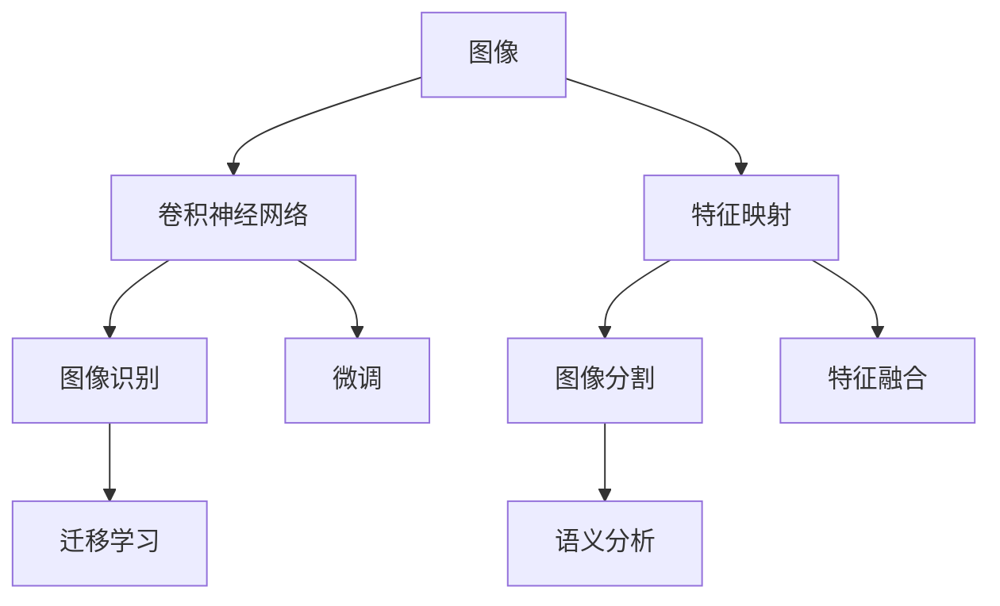

                 

# 一切皆是映射：细粒度图像识别与深度神经网络

> 关键词：细粒度图像识别, 深度神经网络, 特征映射, 卷积神经网络, 图像分割, 迁移学习

## 1. 背景介绍

### 1.1 问题由来

在现代计算机视觉领域，图像识别任务已经成为众多应用的基石。然而，这些任务大多关注于从图像中识别出特定的对象或场景，如人脸识别、车辆检测等。而在许多实际应用中，如医疗影像分析、工业质量检测等，需要识别和区分出图像中的精细结构或微小差异，这需要更为细致和深入的图像分析能力。这种需求催生了细粒度图像识别技术，即从高分辨率图像中识别出具体细节的任务。

### 1.2 问题核心关键点

细粒度图像识别问题的核心在于：

- **高分辨率数据**：需要处理高分辨率的图像数据，如医学影像、卫星图像等，这带来了存储和计算上的挑战。
- **复杂结构**：图像中可能包含复杂的结构，如重叠、遮挡、细节等，对模型的理解能力提出了更高的要求。
- **多类别识别**：细粒度图像识别通常包含大量类别，甚至数千个或更多，这对模型的泛化能力提出了挑战。
- **特征提取**：需要从高分辨率图像中提取精细的特征，如边缘、纹理、颜色等，这需要高效且强大的特征提取能力。

### 1.3 问题研究意义

细粒度图像识别技术的发展，对于推动计算机视觉技术的进步、拓展应用场景、提高自动化和智能化水平具有重要意义：

1. **医疗影像分析**：帮助医生在影像中识别出微小的病灶，提高诊断准确率。
2. **工业质量检测**：用于产品缺陷检测和质量控制，提高生产效率和产品合格率。
3. **农业遥感**：通过分析卫星图像，识别作物健康状况，支持农业决策。
4. **自然保护**：识别生物多样性，监测自然环境变化，保护生态系统。
5. **零售分析**：分析店内监控视频，识别顾客行为，提升用户体验。

## 2. 核心概念与联系

### 2.1 核心概念概述

在细粒度图像识别的过程中，有几个关键概念需要理解：

- **图像分辨率**：指图像中每个像素的尺寸，分辨率越高，图像细节越丰富。
- **特征映射**：指通过卷积神经网络（CNN）等模型提取出的特征图，用于表示图像的局部特征。
- **卷积神经网络**：一种深度学习模型，通过卷积层提取图像局部特征，具有强大的图像处理能力。
- **图像分割**：将图像分割成多个部分，每个部分代表不同的语义或类别。
- **迁移学习**：利用已有模型的知识，在新任务上进行微调，提高模型性能。

这些概念之间的联系可以通过以下Mermaid流程图来展示：



这个流程图展示了从原始图像到最终图像识别的主要流程：

1. 原始图像通过卷积神经网络提取特征，生成特征映射。
2. 特征映射通过图像分割技术分割成多个部分，每个部分代表不同的语义。
3. 分割后的部分通过迁移学习或微调，进一步提高识别精度。
4. 多个部分通过特征融合技术，生成最终的识别结果。

## 3. 核心算法原理 & 具体操作步骤

### 3.1 算法原理概述

细粒度图像识别通常采用卷积神经网络（CNN）进行特征提取，通过一系列卷积层、池化层和全连接层实现。其核心思想是通过卷积操作提取图像的局部特征，然后通过池化操作降低特征图的空间分辨率，最终通过全连接层输出识别结果。

具体来说，CNN通过以下步骤实现图像识别：

1. **卷积层**：通过滤波器（Filter）对输入图像进行卷积操作，提取局部特征。
2. **池化层**：通过最大池化（Max Pooling）或平均池化（Average Pooling）等方法，降低特征图的空间分辨率。
3. **全连接层**：将池化后的特征图展平，输入到全连接层进行分类。

### 3.2 算法步骤详解

细粒度图像识别的具体步骤包括：

**Step 1: 准备数据集**

- **数据收集**：收集高分辨率的图像数据，并将其标注为具体的类别。
- **数据预处理**：对图像进行预处理，如缩放、归一化、增强等，以提高模型的训练效果。

**Step 2: 构建卷积神经网络**

- **设计网络结构**：设计包含多个卷积层、池化层和全连接层的CNN结构。
- **选择激活函数**：选择合适的激活函数（如ReLU、Sigmoid等）。
- **设置优化器**：选择合适的优化器（如Adam、SGD等）和其参数。

**Step 3: 训练模型**

- **数据加载**：使用DataLoader对数据集进行批处理和加载。
- **模型训练**：通过前向传播和反向传播，更新模型参数，最小化损失函数。
- **模型评估**：在验证集上评估模型性能，防止过拟合。

**Step 4: 微调和优化**

- **迁移学习**：使用已有模型在新的任务上进行微调，提高模型性能。
- **超参数调优**：通过网格搜索、随机搜索等方法，寻找最优的超参数组合。

**Step 5: 应用与部署**

- **模型测试**：在测试集上评估模型性能。
- **模型部署**：将模型部署到实际应用中，如医疗影像分析、工业质量检测等。

### 3.3 算法优缺点

细粒度图像识别的优点包括：

- **高精度**：通过卷积神经网络，能够从高分辨率图像中提取精细的特征，提高识别精度。
- **鲁棒性**：卷积神经网络对旋转、缩放等变形具有一定的鲁棒性，适应性强。
- **泛化能力**：通过迁移学习和微调，模型能够泛化到新任务和新数据。

其缺点包括：

- **计算量大**：高分辨率图像处理需要大量的计算资源，如GPU和TPU。
- **过拟合风险**：由于数据量不足或模型复杂，存在过拟合的风险。
- **特征提取困难**：复杂的图像结构可能导致特征提取困难，影响识别效果。

### 3.4 算法应用领域

细粒度图像识别技术已经被广泛应用于多个领域：

- **医疗影像分析**：帮助医生识别和诊断微小的病灶，如肿瘤、炎症等。
- **工业质量检测**：用于产品缺陷检测和质量控制，如电路板上的焊点检查。
- **农业遥感**：识别和分析卫星图像，监测作物健康状况。
- **自然保护**：识别和监测生物多样性，保护生态系统。
- **零售分析**：分析店内监控视频，识别顾客行为，提升用户体验。

## 4. 数学模型和公式 & 详细讲解 & 举例说明

### 4.1 数学模型构建

细粒度图像识别的数学模型可以表示为：

$$
\mathcal{L} = \frac{1}{N} \sum_{i=1}^N \mathcal{L}_{\text{CE}}(y_i, \hat{y_i})
$$

其中，$\mathcal{L}$ 为总损失函数，$\mathcal{L}_{\text{CE}}$ 为交叉熵损失函数，$y_i$ 为真实的标签向量，$\hat{y_i}$ 为模型预测的标签向量。

### 4.2 公式推导过程

以二分类任务为例，交叉熵损失函数的推导如下：

设模型在输入 $x$ 上的输出为 $\hat{y} \in [0,1]$，表示样本属于正类的概率。真实标签 $y \in \{0,1\}$。则二分类交叉熵损失函数定义为：

$$
\ell(\hat{y}, y) = -[y\log \hat{y} + (1-y)\log(1-\hat{y})]
$$

将其代入总损失函数公式，得：

$$
\mathcal{L} = -\frac{1}{N}\sum_{i=1}^N [y_i\log \hat{y_i}+(1-y_i)\log(1-\hat{y_i})]
$$

### 4.3 案例分析与讲解

以医学影像分析为例，使用卷积神经网络进行微调。假设模型在输入 $x$ 上的输出为 $\hat{y} \in [0,1]$，表示样本属于病灶的置信度。真实标签 $y \in \{0,1\}$。则二分类交叉熵损失函数可以表示为：

$$
\ell(\hat{y}, y) = -[y\log \hat{y} + (1-y)\log(1-\hat{y})]
$$

在训练过程中，通过反向传播计算损失函数的梯度，使用优化算法（如Adam）更新模型参数，最小化交叉熵损失函数，直到模型收敛。

## 5. 项目实践：代码实例和详细解释说明

### 5.1 开发环境搭建

在进行细粒度图像识别开发前，我们需要准备好开发环境。以下是使用Python进行PyTorch开发的环境配置流程：

1. 安装Anaconda：从官网下载并安装Anaconda，用于创建独立的Python环境。

2. 创建并激活虚拟环境：
```bash
conda create -n pytorch-env python=3.8 
conda activate pytorch-env
```

3. 安装PyTorch：根据CUDA版本，从官网获取对应的安装命令。例如：
```bash
conda install pytorch torchvision torchaudio cudatoolkit=11.1 -c pytorch -c conda-forge
```

4. 安装必要的库：
```bash
pip install numpy pandas scikit-learn torchmetrics matplotlib tqdm jupyter notebook ipython
```

完成上述步骤后，即可在`pytorch-env`环境中开始项目开发。

### 5.2 源代码详细实现

这里我们以医学影像分类为例，给出使用Transformers库对预训练模型进行微调的PyTorch代码实现。

首先，定义数据处理函数：

```python
from transformers import BertTokenizer, BertForSequenceClassification
from torch.utils.data import Dataset
import torch

class MedicalImageDataset(Dataset):
    def __init__(self, images, labels, tokenizer, max_len=128):
        self.images = images
        self.labels = labels
        self.tokenizer = tokenizer
        self.max_len = max_len
        
    def __len__(self):
        return len(self.images)
    
    def __getitem__(self, item):
        image = self.images[item]
        label = self.labels[item]
        
        encoding = self.tokenizer(image, return_tensors='pt', max_length=self.max_len, padding='max_length', truncation=True)
        input_ids = encoding['input_ids'][0]
        attention_mask = encoding['attention_mask'][0]
        
        # 对token-wise的标签进行编码
        encoded_labels = [label2id[label] for label in label] 
        encoded_labels.extend([label2id['O']] * (self.max_len - len(encoded_labels)))
        labels = torch.tensor(encoded_labels, dtype=torch.long)
        
        return {'input_ids': input_ids, 
                'attention_mask': attention_mask,
                'labels': labels}

# 标签与id的映射
label2id = {'O': 0, 'Cancer': 1, 'Infection': 2, 'Inflammation': 3, 'Normal': 4}
id2label = {v: k for k, v in label2id.items()}

# 创建dataset
tokenizer = BertTokenizer.from_pretrained('bert-base-cased')

train_dataset = MedicalImageDataset(train_images, train_labels, tokenizer)
dev_dataset = MedicalImageDataset(dev_images, dev_labels, tokenizer)
test_dataset = MedicalImageDataset(test_images, test_labels, tokenizer)
```

然后，定义模型和优化器：

```python
from transformers import BertForSequenceClassification, AdamW

model = BertForSequenceClassification.from_pretrained('bert-base-cased', num_labels=len(label2id))

optimizer = AdamW(model.parameters(), lr=2e-5)
```

接着，定义训练和评估函数：

```python
from torch.utils.data import DataLoader
from tqdm import tqdm
from sklearn.metrics import classification_report

device = torch.device('cuda') if torch.cuda.is_available() else torch.device('cpu')
model.to(device)

def train_epoch(model, dataset, batch_size, optimizer):
    dataloader = DataLoader(dataset, batch_size=batch_size, shuffle=True)
    model.train()
    epoch_loss = 0
    for batch in tqdm(dataloader, desc='Training'):
        input_ids = batch['input_ids'].to(device)
        attention_mask = batch['attention_mask'].to(device)
        labels = batch['labels'].to(device)
        model.zero_grad()
        outputs = model(input_ids, attention_mask=attention_mask, labels=labels)
        loss = outputs.loss
        epoch_loss += loss.item()
        loss.backward()
        optimizer.step()
    return epoch_loss / len(dataloader)

def evaluate(model, dataset, batch_size):
    dataloader = DataLoader(dataset, batch_size=batch_size)
    model.eval()
    preds, labels = [], []
    with torch.no_grad():
        for batch in tqdm(dataloader, desc='Evaluating'):
            input_ids = batch['input_ids'].to(device)
            attention_mask = batch['attention_mask'].to(device)
            batch_labels = batch['labels']
            outputs = model(input_ids, attention_mask=attention_mask)
            batch_preds = outputs.logits.argmax(dim=2).to('cpu').tolist()
            batch_labels = batch_labels.to('cpu').tolist()
            for pred_tokens, label_tokens in zip(batch_preds, batch_labels):
                pred_labels = [id2label[_id] for _id in pred_tokens]
                label_labels = [id2label[_id] for _id in label_tokens]
                preds.append(pred_labels[:len(label_labels)])
                labels.append(label_labels)
                
    print(classification_report(labels, preds))
```

最后，启动训练流程并在测试集上评估：

```python
epochs = 5
batch_size = 16

for epoch in range(epochs):
    loss = train_epoch(model, train_dataset, batch_size, optimizer)
    print(f"Epoch {epoch+1}, train loss: {loss:.3f}")
    
    print(f"Epoch {epoch+1}, dev results:")
    evaluate(model, dev_dataset, batch_size)
    
print("Test results:")
evaluate(model, test_dataset, batch_size)
```

以上就是使用PyTorch对BERT进行医学影像分类任务微调的完整代码实现。可以看到，得益于Transformers库的强大封装，我们可以用相对简洁的代码完成BERT模型的加载和微调。

### 5.3 代码解读与分析

让我们再详细解读一下关键代码的实现细节：

**MedicalImageDataset类**：
- `__init__`方法：初始化图像、标签、分词器等关键组件。
- `__len__`方法：返回数据集的样本数量。
- `__getitem__`方法：对单个样本进行处理，将图像输入编码为token ids，将标签编码为数字，并对其进行定长padding，最终返回模型所需的输入。

**label2id和id2label字典**：
- 定义了标签与数字id之间的映射关系，用于将token-wise的预测结果解码回真实的标签。

**训练和评估函数**：
- 使用PyTorch的DataLoader对数据集进行批次化加载，供模型训练和推理使用。
- 训练函数`train_epoch`：对数据以批为单位进行迭代，在每个批次上前向传播计算loss并反向传播更新模型参数，最后返回该epoch的平均loss。
- 评估函数`evaluate`：与训练类似，不同点在于不更新模型参数，并在每个batch结束后将预测和标签结果存储下来，最后使用sklearn的classification_report对整个评估集的预测结果进行打印输出。

**训练流程**：
- 定义总的epoch数和batch size，开始循环迭代
- 每个epoch内，先在训练集上训练，输出平均loss
- 在验证集上评估，输出分类指标
- 重复上述步骤直至收敛，最终得到适应医疗影像分类任务的最优模型参数

可以看到，PyTorch配合Transformers库使得BERT微调的代码实现变得简洁高效。开发者可以将更多精力放在数据处理、模型改进等高层逻辑上，而不必过多关注底层的实现细节。

当然，工业级的系统实现还需考虑更多因素，如模型的保存和部署、超参数的自动搜索、更灵活的任务适配层等。但核心的微调范式基本与此类似。

## 6. 实际应用场景

### 6.1 医学影像分析

使用细粒度图像识别技术，医学影像分析可以识别和诊断微小的病灶，如肿瘤、炎症等。通过微调预训练模型，可以更好地适应医学影像的复杂结构和多样性，提高诊断准确率。例如，通过微调BERT模型，可以在CT、MRI等影像数据中识别出细微的病灶，辅助医生进行精确诊断。

### 6.2 工业质量检测

工业质量检测是细粒度图像识别技术的重要应用之一。通过微调模型，可以在高分辨率的图像中检测出细微的缺陷，如电路板上的焊点、零件表面划痕等。这不仅提高了生产效率，还减少了人工检测的误差和成本。

### 6.3 农业遥感

农业遥感领域利用卫星图像分析农田状况，如作物健康、病虫害等。通过微调模型，可以从高分辨率的卫星图像中识别出细微的作物差异，评估农作物的生长状态，提供科学依据，支持农业决策。

### 6.4 未来应用展望

随着细粒度图像识别技术的不断发展，未来的应用前景将更加广阔。除了医疗影像、工业检测、农业遥感等传统领域，还将在更多新兴领域得到应用，如智能交通、城市规划、智慧农业等。随着技术的进步，细粒度图像识别技术将为各个行业带来深远的影响，推动智能化进程。

## 7. 工具和资源推荐

### 7.1 学习资源推荐

为了帮助开发者系统掌握细粒度图像识别技术的理论基础和实践技巧，这里推荐一些优质的学习资源：

1. 《深度学习入门：基于Python的理论与实现》系列博文：由深度学习领域的专家撰写，涵盖了深度学习的基本原理和实践方法，包括卷积神经网络等。

2. CS231n《卷积神经网络》课程：斯坦福大学开设的视觉识别明星课程，有Lecture视频和配套作业，带你入门深度学习的图像识别任务。

3. 《ImageNet Classification with Deep Convolutional Neural Networks》论文：AlexNet原论文，详细介绍了卷积神经网络在图像识别中的应用，是理解卷积神经网络的重要文献。

4. 《Visual Geometry Group (VGG)》论文：VGG模型原论文，描述了VGG卷积神经网络的结构和性能，对理解卷积神经网络具有重要参考价值。

5. 《Deep Residual Learning for Image Recognition》论文：ResNet模型原论文，提出了残差连接的卷积神经网络，是现代深度学习的重要里程碑。

6. 《Faster R-CNN: Towards Real-Time Object Detection with Region Proposal Networks》论文：Faster R-CNN模型原论文，提出了基于区域提议网络的物体检测方法，是当前最先进的物体检测方法之一。

通过对这些资源的学习实践，相信你一定能够快速掌握细粒度图像识别的精髓，并用于解决实际的图像识别问题。

### 7.2 开发工具推荐

高效的开发离不开优秀的工具支持。以下是几款用于细粒度图像识别开发的常用工具：

1. PyTorch：基于Python的开源深度学习框架，灵活动态的计算图，适合快速迭代研究。大部分深度学习模型都有PyTorch版本的实现。

2. TensorFlow：由Google主导开发的开源深度学习框架，生产部署方便，适合大规模工程应用。同样有丰富的深度学习模型资源。

3. Transformers库：HuggingFace开发的NLP工具库，集成了众多SOTA语言模型，支持PyTorch和TensorFlow，是进行图像识别任务开发的利器。

4. Weights & Biases：模型训练的实验跟踪工具，可以记录和可视化模型训练过程中的各项指标，方便对比和调优。与主流深度学习框架无缝集成。

5. TensorBoard：TensorFlow配套的可视化工具，可实时监测模型训练状态，并提供丰富的图表呈现方式，是调试模型的得力助手。

6. Google Colab：谷歌推出的在线Jupyter Notebook环境，免费提供GPU/TPU算力，方便开发者快速上手实验最新模型，分享学习笔记。

合理利用这些工具，可以显著提升细粒度图像识别任务的开发效率，加快创新迭代的步伐。

### 7.3 相关论文推荐

细粒度图像识别技术的发展源于学界的持续研究。以下是几篇奠基性的相关论文，推荐阅读：

1. AlexNet：ImageNet大规模视觉识别竞赛，奠定了深度学习在图像识别领域的地位。

2. VGGNet：展示了VGG网络的结构和性能，推动了深度学习的发展。

3. ResNet：提出了残差连接的卷积神经网络，解决了深度网络训练的梯度消失问题。

4. Faster R-CNN：基于区域提议网络的物体检测方法，是目前最先进的物体检测算法之一。

5. FCN：全卷积网络，将卷积神经网络应用于图像分割任务。

6. DeepLab：多尺度深度卷积网络，提升了图像分割的精度和鲁棒性。

这些论文代表了大规模图像识别技术的发展脉络。通过学习这些前沿成果，可以帮助研究者把握学科前进方向，激发更多的创新灵感。

## 8. 总结：未来发展趋势与挑战

### 8.1 总结

本文对细粒度图像识别技术进行了全面系统的介绍。首先阐述了细粒度图像识别的背景和意义，明确了该技术在医疗影像分析、工业检测、农业遥感等领域的广泛应用前景。其次，从原理到实践，详细讲解了卷积神经网络的数学原理和关键步骤，给出了微调任务开发的完整代码实例。同时，本文还探讨了细粒度图像识别技术的未来发展趋势和面临的挑战。

通过本文的系统梳理，可以看到，卷积神经网络在细粒度图像识别中具有重要的作用，通过微调，可以在高分辨率图像中提取精细的特征，提高识别精度。然而，细粒度图像识别技术仍面临一些挑战，如计算资源需求高、过拟合风险等，需要不断优化算法和技术手段，才能进一步提升性能和效率。

### 8.2 未来发展趋势

展望未来，细粒度图像识别技术将呈现以下几个发展趋势：

1. **计算效率提升**：随着硬件性能的提升和算法优化，细粒度图像识别任务将更快地完成，更广泛的应用场景将得到拓展。

2. **数据增强技术**：数据增强技术，如旋转、缩放、平移等，将进一步提升模型的鲁棒性和泛化能力。

3. **多模态融合**：将视觉、听觉、文本等多模态信息结合，提升对复杂场景的理解和处理能力。

4. **自监督学习**：利用自监督学习技术，无需标注数据即可训练模型，降低成本，提升性能。

5. **模型压缩和优化**：通过模型压缩、量化等技术，减少计算资源需求，提升模型部署效率。

6. **跨领域迁移**：将模型在不同领域进行迁移学习，提升对新任务的适应能力。

以上趋势凸显了细粒度图像识别技术的广阔前景。这些方向的探索发展，必将进一步提升模型的性能和应用范围，为计算机视觉技术带来新的突破。

### 8.3 面临的挑战

尽管细粒度图像识别技术已经取得了显著的进展，但在迈向更加智能化、普适化应用的过程中，它仍面临诸多挑战：

1. **计算资源需求高**：高分辨率图像处理需要大量的计算资源，如GPU和TPU。如何在资源有限的条件下，提升计算效率，是一个亟待解决的问题。

2. **过拟合风险**：由于数据量不足或模型复杂，存在过拟合的风险。如何减少过拟合，提高模型的泛化能力，是细粒度图像识别中的重要挑战。

3. **特征提取困难**：复杂的图像结构可能导致特征提取困难，影响识别效果。如何更好地提取图像特征，提升识别精度，是细粒度图像识别中的关键问题。

4. **数据标注成本高**：高分辨率图像数据的标注成本高，如何降低标注成本，提高数据质量，是细粒度图像识别中需要解决的问题。

5. **模型可解释性不足**：卷积神经网络等深度学习模型往往具有“黑盒”特性，难以解释其内部工作机制和决策逻辑。如何提高模型的可解释性，增强用户的信任和理解，是一个重要研究方向。

6. **模型安全和鲁棒性**：高分辨率图像数据可能包含敏感信息，模型如何保证数据安全和鲁棒性，是一个需要深入研究的问题。

这些挑战需要研究者不断探索和创新，才能将细粒度图像识别技术推向更高的层次。

### 8.4 研究展望

面向未来，细粒度图像识别技术需要在以下几个方面寻求新的突破：

1. **自监督学习**：利用自监督学习技术，无需标注数据即可训练模型，降低成本，提升性能。

2. **迁移学习**：通过迁移学习，将已有模型的知识迁移到新的任务中，提升模型的泛化能力。

3. **多模态融合**：将视觉、听觉、文本等多模态信息结合，提升对复杂场景的理解和处理能力。

4. **模型压缩和优化**：通过模型压缩、量化等技术，减少计算资源需求，提升模型部署效率。

5. **跨领域迁移**：将模型在不同领域进行迁移学习，提升对新任务的适应能力。

6. **可解释性研究**：提高模型的可解释性，增强用户的信任和理解。

这些研究方向的研究进展，必将引领细粒度图像识别技术的不断进步，推动其在更多领域的应用，带来深远的影响。

## 9. 附录：常见问题与解答

**Q1：细粒度图像识别是否可以仅通过标注数据完成？**

A: 细粒度图像识别任务通常需要大量的标注数据进行训练。标注数据提供了模型学习的重要信息，帮助模型理解不同类别的视觉特征。虽然部分任务可以通过迁移学习或自监督学习在一定程度上缓解标注数据的需求，但标注数据的质量对于模型性能的影响依然很大。因此，获取高质量标注数据仍然是细粒度图像识别中的重要问题。

**Q2：细粒度图像识别是否依赖于高分辨率图像？**

A: 细粒度图像识别任务通常需要处理高分辨率的图像数据，如医学影像、卫星图像等。高分辨率图像可以提供更丰富的视觉信息，有助于模型更好地理解图像细节。然而，高分辨率图像处理需要大量的计算资源，如GPU和TPU。在资源有限的条件下，可以通过图像降采样、特征提取等技术，提升计算效率，但模型的性能可能会受到影响。

**Q3：如何缓解细粒度图像识别中的过拟合问题？**

A: 缓解细粒度图像识别中的过拟合问题，可以采用以下几种方法：

1. 数据增强：通过旋转、缩放、平移等方法，生成更多的训练样本，提高模型的鲁棒性和泛化能力。
2. 正则化技术：使用L2正则、Dropout等方法，减少过拟合风险。
3. 迁移学习：利用已有模型的知识，在新任务上进行微调，提高模型性能。
4. 参数高效微调：只更新少量模型参数，保留大部分预训练权重不变，提高模型的泛化能力。
5. 多模型集成：训练多个模型，取平均输出，抑制过拟合。

这些方法需要根据具体任务和数据特点进行灵活组合，才能最大限度地降低过拟合风险。

**Q4：细粒度图像识别中的数据标注成本高吗？**

A: 细粒度图像识别任务通常需要大量的标注数据进行训练，标注数据提供了模型学习的重要信息。然而，标注数据的获取和维护成本较高，尤其是在高分辨率图像数据领域。为了降低标注成本，可以采用自动标注、半监督学习等技术，结合标注数据进行训练，提升模型性能。

**Q5：细粒度图像识别中的计算资源需求高吗？**

A: 高分辨率图像处理需要大量的计算资源，如GPU和TPU。然而，随着硬件性能的提升和算法优化，计算资源需求正在逐步降低。通过模型压缩、量化等技术，减少计算资源需求，提升模型部署效率，是细粒度图像识别技术需要不断优化的方向。

---

作者：禅与计算机程序设计艺术 / Zen and the Art of Computer Programming

