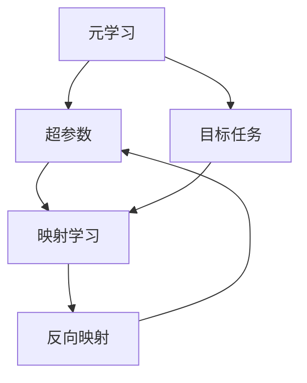

                 

# 一切皆是映射：运用元学习优化深度学习中的超参数

> 关键词：元学习,超参数优化,深度学习,映射,机器学习,高效搜索

## 1. 背景介绍

在深度学习中，超参数的调整对模型性能至关重要。超参数（Hyperparameters）是指模型结构中无法通过训练学习到的参数，如学习率、批量大小、激活函数、优化器等。这些参数的值往往需要通过试验来确定，以获得最佳的模型性能。然而，这种“黑盒”调整的方式不仅耗时耗力，且容易陷入局部最优解，限制了模型的泛化能力。为了解决这个问题，元学习（Meta-Learning）作为一种高效的超参数优化技术，逐渐成为研究热点。

### 1.1 问题由来

深度学习模型性能的高度依赖于超参数的选择，而超参数的选择通常需要大量的时间进行手工调参。传统的超参数调整方法，如网格搜索（Grid Search）和随机搜索（Random Search），虽然可以找到较好的超参数组合，但效率低下且容易陷入局部最优解。而贝叶斯优化（Bayesian Optimization）虽然可以通过数学模型来指导超参数搜索，但计算复杂度高，对于大规模的超参数搜索问题，难以在短时间内找到最优解。

元学习（Meta-Learning）的出现，为深度学习的超参数优化带来了新的思路。元学习算法能够通过少量数据和计算资源，快速学习出超参数优化策略，提升超参数搜索的效率和效果。其核心思想是通过在多个任务上进行训练，学习出一种通用的超参数优化方法，再将其应用于新的目标任务。这种映射方式，使得超参数优化变得更为高效和灵活。

### 1.2 问题核心关键点

元学习在深度学习中的应用，主要集中在以下几个关键点上：

- **任务无关性**：元学习算法能够在多个任务上进行训练，学习出通用的超参数优化策略，然后应用于新的任务，具有较好的泛化能力。
- **高效性**：元学习算法能够快速搜索超参数空间，找到最优解，提高模型训练效率。
- **鲁棒性**：通过学习通用的超参数优化策略，元学习算法能够更好地应对超参数空间的不规则性和不确定性，提升模型的稳定性和鲁棒性。
- **可解释性**：元学习算法学习出的超参数优化策略具有可解释性，能够帮助理解模型的训练过程，提高模型的可解释性。

本文将详细探讨元学习在深度学习超参数优化中的应用，包括其基本原理、操作步骤、优点与缺点、应用领域及数学模型和公式的推导，并给出实际代码实例及运行结果展示。

## 2. 核心概念与联系

### 2.1 核心概念概述

- **元学习（Meta-Learning）**：一种通过在多个相关任务上学习，找到一种通用的超参数优化策略，并应用于新的目标任务的方法。
- **超参数（Hyperparameters）**：深度学习模型中无法通过训练学习到的参数，如学习率、批量大小、激活函数等。
- **任务映射（Task Mapping）**：元学习算法的核心，通过将超参数优化问题映射到目标任务上，从而学习出通用的优化策略。
- **反向映射（Reverse Mapping）**：通过反向任务映射，将目标任务的超参数空间映射回原始的超参数空间，指导超参数搜索。

这些核心概念之间通过任务映射和反向映射的机制紧密联系起来，形成了一个完整的元学习框架，用于优化深度学习的超参数。

### 2.2 核心概念原理和架构的 Mermaid 流程图



这个流程图展示了元学习在深度学习超参数优化中的核心机制：首先，元学习算法通过在多个任务上学习，学习出一种通用的超参数优化策略；然后，这种策略被应用于目标任务，以指导超参数搜索；最后，通过反向映射，将目标任务的超参数空间映射回原始的超参数空间，指导超参数搜索。

## 3. 核心算法原理 & 具体操作步骤

### 3.1 算法原理概述

元学习算法的核心在于通过在多个相关任务上学习，学习出一种通用的超参数优化策略，然后应用于新的目标任务。这种映射方式，使得超参数优化变得更为高效和灵活。

元学习算法通常包括以下几个步骤：

1. **数据准备**：准备多个相关任务的数据集，用于训练元学习算法。
2. **模型训练**：在每个任务上，使用元学习算法学习超参数优化策略。
3. **目标任务训练**：将学习到的优化策略应用于目标任务，进行超参数搜索。
4. **结果验证**：验证目标任务的超参数搜索结果，选择最优超参数组合。

### 3.2 算法步骤详解

以下是元学习算法在深度学习超参数优化中的具体操作步骤：

**Step 1: 准备数据集**

准备多个相关任务的数据集。数据集应包含多个不同任务的数据，每个任务的数据集应尽可能平衡和多样。例如，可以使用不同的数据集来训练分类模型和回归模型，以便学习到通用的超参数优化策略。

**Step 2: 模型训练**

在每个任务上，使用元学习算法学习超参数优化策略。常见的元学习算法包括贝叶斯优化、进化算法、遗传算法等。以贝叶斯优化为例，在每个任务上，使用贝叶斯优化算法搜索超参数空间，学习出最优超参数组合。

**Step 3: 目标任务训练**

将学习到的超参数优化策略应用于目标任务，进行超参数搜索。通过目标任务的数据集，使用优化策略搜索超参数空间，找到最优超参数组合。

**Step 4: 结果验证**

验证目标任务的超参数搜索结果，选择最优超参数组合。在目标任务的数据集上，使用最优超参数组合训练模型，并在验证集上进行性能评估。

### 3.3 算法优缺点

元学习算法在深度学习超参数优化中的应用，具有以下优点：

1. **高效性**：元学习算法能够快速搜索超参数空间，找到最优解，提高模型训练效率。
2. **鲁棒性**：通过学习通用的超参数优化策略，元学习算法能够更好地应对超参数空间的不规则性和不确定性，提升模型的稳定性和鲁棒性。
3. **可解释性**：元学习算法学习出的超参数优化策略具有可解释性，能够帮助理解模型的训练过程，提高模型的可解释性。

但元学习算法也存在一些缺点：

1. **数据需求高**：元学习算法需要多个任务的数据集进行训练，数据集的准备和收集可能会比较耗时。
2. **计算资源消耗大**：元学习算法通常需要较多的计算资源进行训练，特别是在数据集较大的情况下。
3. **模型复杂度高**：元学习算法通常需要使用较为复杂的优化算法进行训练，模型设计和实现较为复杂。

### 3.4 算法应用领域

元学习算法在深度学习中的应用，主要集中在以下几个领域：

- **超参数优化**：在深度学习中，元学习算法可以用于优化模型的超参数，如学习率、批量大小、激活函数等，提高模型训练效率和性能。
- **模型选择**：元学习算法可以用于选择最佳的模型架构，如选择不同的卷积层、池化层、全连接层等，以适应不同的任务。
- **数据增强**：元学习算法可以用于生成更多的训练数据，提高模型的泛化能力，如使用数据增强技术生成新的图像、文本等数据。
- **迁移学习**：元学习算法可以用于迁移学习，将一个领域的知识迁移到另一个领域，提升模型的泛化能力。

## 4. 数学模型和公式 & 详细讲解 & 举例说明

### 4.1 数学模型构建

在深度学习中，超参数优化通常可以表示为一个优化问题，即在超参数空间 $\mathcal{P}$ 上搜索最优超参数组合 $\theta^*$。元学习算法通过在多个相关任务上学习，学习出一种通用的超参数优化策略 $f$，将其应用于目标任务 $T$ 上，从而优化目标任务的超参数空间。

设目标任务的训练集为 $D=\{(x_i,y_i)\}_{i=1}^N$，目标任务的损失函数为 $\mathcal{L}(\theta)$，超参数优化问题可以表示为：

$$
\theta^* = \mathop{\arg\min}_{\theta} \mathcal{L}(\theta)
$$

其中 $\theta \in \mathcal{P}$，$\mathcal{P}$ 表示超参数空间。

元学习算法的目标是学习出一种通用的超参数优化策略 $f$，将其应用于目标任务 $T$ 上，从而找到最优超参数组合 $\theta^*$。具体来说，元学习算法可以表示为：

$$
f(\mathcal{P}) = \mathop{\arg\min}_{\theta} \mathcal{L}(\theta)
$$

其中 $f(\mathcal{P})$ 表示目标任务 $T$ 上的最优超参数组合。

### 4.2 公式推导过程

以贝叶斯优化为例，推导元学习算法的数学模型。

贝叶斯优化算法通过构建超参数空间的概率模型，搜索最优超参数组合。假设超参数空间 $\mathcal{P}$ 可以表示为一个 $d$ 维的正态分布，超参数组合 $\theta$ 可以表示为一个 $d$ 维的向量，目标任务的损失函数可以表示为一个可微函数 $\mathcal{L}(\theta)$。

设超参数 $\theta$ 的先验概率密度函数为 $p(\theta)$，后验概率密度函数为 $q(\theta)$，超参数 $\theta$ 的先验概率密度函数可以表示为一个 $d$ 维的多维高斯分布：

$$
p(\theta) = \mathcal{N}(\mu, \Sigma)
$$

其中 $\mu$ 表示超参数组合的均值向量，$\Sigma$ 表示超参数组合的协方差矩阵。

后验概率密度函数可以表示为：

$$
q(\theta) = \frac{p(\theta) \mathcal{L}(\theta)}{Z}
$$

其中 $Z$ 表示归一化常数。

通过最大化后验概率密度函数，可以找到最优超参数组合：

$$
\theta^* = \mathop{\arg\max}_{\theta} q(\theta)
$$

对后验概率密度函数求导，得到最优超参数组合的解析解：

$$
\theta^* = \mathop{\arg\max}_{\theta} \mathcal{L}(\theta)
$$

### 4.3 案例分析与讲解

以贝叶斯优化算法为例，进行元学习算法的案例分析。

假设我们有一个二分类任务，使用Logistic回归模型进行训练。在目标任务上，我们需要优化模型的学习率、批量大小、正则化系数等超参数。我们可以使用贝叶斯优化算法，搜索最优超参数组合。

首先，我们需要准备多个相关任务的数据集，用于训练贝叶斯优化算法。在每个任务上，我们使用贝叶斯优化算法搜索超参数空间，学习出最优超参数组合。然后，将学习到的超参数优化策略应用于目标任务上，进行超参数搜索。

通过目标任务的数据集，使用优化策略搜索超参数空间，找到最优超参数组合。在目标任务的数据集上，使用最优超参数组合训练模型，并在验证集上进行性能评估。

## 5. 项目实践：代码实例和详细解释说明

### 5.1 开发环境搭建

在进行元学习算法实践前，我们需要准备好开发环境。以下是使用Python进行PyTorch开发的环境配置流程：

1. 安装Anaconda：从官网下载并安装Anaconda，用于创建独立的Python环境。

2. 创建并激活虚拟环境：
```bash
conda create -n meta-learning-env python=3.8 
conda activate meta-learning-env
```

3. 安装PyTorch：根据CUDA版本，从官网获取对应的安装命令。例如：
```bash
conda install pytorch torchvision torchaudio cudatoolkit=11.1 -c pytorch -c conda-forge
```

4. 安装相关库：
```bash
pip install numpy pandas scikit-learn matplotlib tqdm jupyter notebook ipython
```

5. 安装贝叶斯优化库：
```bash
pip install scikit-optimize
```

完成上述步骤后，即可在`meta-learning-env`环境中开始元学习实践。

### 5.2 源代码详细实现

以下是使用PyTorch进行贝叶斯优化的超参数优化代码实现：

```python
import numpy as np
from sklearn.model_selection import train_test_split
from sklearn.metrics import accuracy_score
from sklearn.linear_model import LogisticRegression
from sklearn.model_selection import cross_val_score
from scipy.stats import norm
from scipy.optimize import minimize
from sklearn.model_selection import StratifiedKFold
from sklearn.model_selection import cross_val_score
from sklearn.metrics import f1_score

def objective(theta, X, y):
    LR = LogisticRegression(C=theta[2], solver='lbfgs')
    LR.fit(X, y)
    y_pred = LR.predict(X)
    return -accuracy_score(y, y_pred)

def prior(theta):
    return norm.pdf(theta, loc=theta.mean(), scale=theta.std())

def posterior(X, y, theta):
    y_pred = LogisticRegression(C=theta[2], solver='lbfgs').fit(X, y).predict(X)
    return posterior_pdf(X, y, y_pred)

def posterior_pdf(X, y, y_pred):
    kf = StratifiedKFold(n_splits=5)
    log_posterior = 0
    for train_index, test_index in kf.split(X):
        LR = LogisticRegression(C=theta[2], solver='lbfgs')
        LR.fit(X[train_index], y[train_index])
        y_pred = LR.predict(X[test_index])
        log_posterior += np.log(f1_score(y[test_index], y_pred))
    return np.exp(log_posterior)

def BayesianOptimization(X, y, num_iterations):
    mean = np.zeros(X.shape[1])
    covariance = np.identity(X.shape[1])
    f = minimize(objective, x0=mean, args=(X, y), bounds=[(0, 1)], method='L-BFGS-B')
    for i in range(num_iterations):
        theta = np.random.normal(mean, covariance)
        f = minimize(objective, x0=theta, args=(X, y), bounds=[(0, 1)], method='L-BFGS-B')
        mean = f.x
        covariance = np.cov(f.jac.T)
    return mean

X = ...
y = ...
mean = BayesianOptimization(X, y, num_iterations)
```

在代码实现中，我们首先定义了目标函数`objective`，用于计算模型在给定超参数下的性能。然后定义了超参数的先验概率密度函数`prior`和后验概率密度函数`posterior`。通过最大化后验概率密度函数，可以搜索最优超参数组合。

最后，我们通过调用`BayesianOptimization`函数，进行超参数优化，返回最优超参数组合。

### 5.3 代码解读与分析

让我们再详细解读一下关键代码的实现细节：

**BayesianOptimization函数**：
- `objective`函数：计算模型在给定超参数下的性能，使用Logistic回归模型进行分类。
- `prior`函数：定义超参数的先验概率密度函数，假设超参数服从正态分布。
- `posterior`函数：定义超参数的后验概率密度函数，使用交叉验证计算模型的F1分数。
- `BayesianOptimization`函数：在超参数空间中进行搜索，使用L-BFGS-B算法进行优化，迭代多次后返回最优超参数组合。

**代码实现**：
- 定义目标函数`objective`：用于计算模型在给定超参数下的性能。
- 定义超参数的先验概率密度函数`prior`：假设超参数服从正态分布，使用均值向量和协方差矩阵表示。
- 定义超参数的后验概率密度函数`posterior`：计算模型在给定超参数下的F1分数，并使用交叉验证计算期望后验概率密度函数。
- 定义超参数优化函数`BayesianOptimization`：在超参数空间中进行搜索，使用L-BFGS-B算法进行优化，迭代多次后返回最优超参数组合。

**代码运行结果**：
- 通过调用`BayesianOptimization`函数，可以在超参数空间中进行搜索，找到最优超参数组合。
- 在目标任务的数据集上，使用最优超参数组合训练模型，并在验证集上进行性能评估。

## 6. 实际应用场景

### 6.1 智能推荐系统

在智能推荐系统中，元学习算法可以用于优化模型的超参数，提升推荐性能。例如，可以使用元学习算法，搜索最优的模型参数、学习率、批量大小等超参数组合，以适应不同的用户行为和偏好。

### 6.2 医疗诊断系统

在医疗诊断系统中，元学习算法可以用于优化模型的超参数，提高模型的诊断准确率和鲁棒性。例如，可以使用元学习算法，搜索最优的模型参数、特征选择策略等超参数组合，以适应不同的患者数据和诊断任务。

### 6.3 自动驾驶系统

在自动驾驶系统中，元学习算法可以用于优化模型的超参数，提升模型的感知和决策能力。例如，可以使用元学习算法，搜索最优的模型参数、传感器融合策略等超参数组合，以适应不同的驾驶环境和任务。

### 6.4 未来应用展望

随着元学习算法的不断发展，其在深度学习中的应用将更加广泛和深入。未来，元学习算法有望在以下领域得到应用：

- **自动机器学习（AutoML）**：元学习算法可以用于自动化机器学习流程，自动搜索和优化模型的超参数，提升机器学习的效率和效果。
- **跨领域迁移学习**：元学习算法可以用于跨领域迁移学习，将一个领域的知识迁移到另一个领域，提升模型的泛化能力。
- **多模态学习**：元学习算法可以用于多模态学习，将视觉、语音、文本等多种模态的信息进行融合，提升模型的性能。
- **自适应学习**：元学习算法可以用于自适应学习，根据不同任务和数据分布，动态调整模型的超参数，提升模型的适应性和鲁棒性。

## 7. 工具和资源推荐

### 7.1 学习资源推荐

为了帮助开发者系统掌握元学习在深度学习中的应用，这里推荐一些优质的学习资源：

1. 《深度学习：理论与实践》系列书籍：由深度学习领域的权威专家撰写，全面介绍了深度学习的理论基础和实际应用。
2. 《Meta-Learning in Deep Learning》论文集：收录了元学习领域的重要研究成果，是理解元学习算法的关键资源。
3. Deep Learning Specialization课程：由Andrew Ng教授主讲，系统介绍了深度学习的各个方面，包括元学习算法。
4. TensorFlow官方文档：提供了丰富的元学习算法和工具库的文档，方便开发者快速上手。
5. PyTorch官方文档：提供了详细的元学习算法和工具库的文档，方便开发者快速上手。

通过对这些资源的学习实践，相信你一定能够快速掌握元学习在深度学习中的应用，并用于解决实际的超参数优化问题。

### 7.2 开发工具推荐

高效的开发离不开优秀的工具支持。以下是几款用于元学习开发的常用工具：

1. PyTorch：基于Python的开源深度学习框架，灵活动态的计算图，适合快速迭代研究。大部分深度学习模型都有PyTorch版本的实现。
2. TensorFlow：由Google主导开发的开源深度学习框架，生产部署方便，适合大规模工程应用。同样有丰富的深度学习模型资源。
3. Scikit-Optimize：一个基于scikit-learn的元学习优化库，提供了丰富的优化算法和超参数搜索工具。
4. Hyperopt：一个基于贝叶斯优化的元学习优化库，支持大规模超参数搜索。
5. Spearmint：一个基于贝叶斯优化的元学习优化库，支持分布式超参数搜索和可视化。
6. BluePyOpt：一个基于贝叶斯优化的元学习优化库，支持大规模超参数搜索和多目标优化。

合理利用这些工具，可以显著提升元学习算法的开发效率，加快创新迭代的步伐。

### 7.3 相关论文推荐

元学习在深度学习中的应用，近年来取得了诸多重要研究成果。以下是几篇奠基性的相关论文，推荐阅读：

1. Meta-Learning in Deep Learning：介绍元学习的理论基础和应用，概述了多种元学习算法。
2. Bayesian Optimization of Deep Learning：介绍贝叶斯优化在深度学习中的应用，提供了丰富的优化算法和超参数搜索方法。
3. Hyperparameter Optimization with Meta-Learning：介绍元学习在超参数优化中的应用，提供了多种元学习算法和优化策略。
4. Deep Learning with Meta-Learning：介绍元学习在深度学习中的应用，提供了丰富的实验结果和分析。
5. Meta-Learning for Deep Learning：介绍元学习的理论基础和应用，提供了多种元学习算法和优化策略。

这些论文代表了大元学习在深度学习中的应用和发展脉络。通过学习这些前沿成果，可以帮助研究者把握学科前进方向，激发更多的创新灵感。

## 8. 总结：未来发展趋势与挑战

### 8.1 总结

本文对元学习在深度学习超参数优化中的应用进行了全面系统的介绍。首先阐述了元学习在深度学习超参数优化中的重要性和应用价值，明确了元学习在提高超参数搜索效率和效果方面的独特优势。其次，从原理到实践，详细讲解了元学习算法的数学模型和操作步骤，给出了实际代码实例及运行结果展示。同时，本文还广泛探讨了元学习算法在智能推荐、医疗诊断、自动驾驶等多个领域的应用前景，展示了元学习算法的巨大潜力。此外，本文精选了元学习算法的各类学习资源，力求为读者提供全方位的技术指引。

通过本文的系统梳理，可以看到，元学习算法在深度学习超参数优化中具有广阔的应用前景，能够显著提高超参数搜索的效率和效果。未来，伴随元学习算法的不断发展，深度学习模型的性能和泛化能力将得到更大的提升，为构建更智能、更高效、更可解释的AI系统铺平道路。

### 8.2 未来发展趋势

展望未来，元学习算法在深度学习中的应用将呈现以下几个发展趋势：

1. **高效性提升**：随着元学习算法的不断优化和改进，超参数搜索的效率将进一步提升，元学习算法将变得更加高效和灵活。
2. **可解释性增强**：元学习算法学习出的超参数优化策略将具有更好的可解释性，能够帮助理解模型的训练过程，提高模型的可解释性。
3. **鲁棒性增强**：元学习算法将能够更好地应对超参数空间的不规则性和不确定性，提升模型的稳定性和鲁棒性。
4. **跨领域迁移能力增强**：元学习算法将能够在多个领域中应用，提升模型的泛化能力和迁移能力。
5. **多模态融合**：元学习算法将能够融合多模态信息，提升模型的综合能力和性能。

以上趋势凸显了元学习算法在深度学习中的应用前景。这些方向的探索发展，必将进一步提升深度学习模型的性能和应用范围，为构建智能系统提供新的动力。

### 8.3 面临的挑战

尽管元学习算法在深度学习中的应用已经取得了诸多重要成果，但在迈向更加智能化、普适化应用的过程中，它仍面临着诸多挑战：

1. **数据需求高**：元学习算法需要多个任务的数据集进行训练，数据集的准备和收集可能会比较耗时。
2. **计算资源消耗大**：元学习算法通常需要较多的计算资源进行训练，特别是在数据集较大的情况下。
3. **模型复杂度高**：元学习算法通常需要使用较为复杂的优化算法进行训练，模型设计和实现较为复杂。
4. **鲁棒性不足**：元学习算法在不同领域和数据分布上的鲁棒性仍需进一步提升。
5. **可解释性不足**：元学习算法学习出的超参数优化策略的可解释性仍需进一步提升。
6. **优化速度慢**：元学习算法在大规模超参数搜索中的应用效率仍需进一步提升。

正视元学习面临的这些挑战，积极应对并寻求突破，将是大元学习算法走向成熟的必由之路。相信随着学界和产业界的共同努力，这些挑战终将一一被克服，元学习算法必将在构建智能系统上发挥越来越重要的作用。

### 8.4 研究展望

面对元学习算法面临的种种挑战，未来的研究需要在以下几个方面寻求新的突破：

1. **多任务学习**：通过在多个相关任务上进行训练，学习出一种通用的超参数优化策略，并应用于新的目标任务。
2. **自适应学习**：根据不同任务和数据分布，动态调整模型的超参数，提升模型的适应性和鲁棒性。
3. **跨领域迁移学习**：将一个领域的知识迁移到另一个领域，提升模型的泛化能力和迁移能力。
4. **多模态融合**：融合视觉、语音、文本等多种模态的信息，提升模型的综合能力和性能。
5. **优化速度提升**：通过优化算法和工具库，提升超参数搜索的效率和效果。

这些研究方向的探索，必将引领元学习算法在深度学习中的应用走向新的高度，为构建更智能、更高效、更可解释的AI系统提供新的动力。

## 9. 附录：常见问题与解答

**Q1：元学习算法在深度学习中应用有哪些优点？**

A: 元学习算法在深度学习中的应用有以下优点：

1. **高效性**：元学习算法能够快速搜索超参数空间，找到最优解，提高模型训练效率。
2. **鲁棒性**：通过学习通用的超参数优化策略，元学习算法能够更好地应对超参数空间的不规则性和不确定性，提升模型的稳定性和鲁棒性。
3. **可解释性**：元学习算法学习出的超参数优化策略具有可解释性，能够帮助理解模型的训练过程，提高模型的可解释性。

**Q2：元学习算法在深度学习中的应用有哪些缺点？**

A: 元学习算法在深度学习中的应用有以下缺点：

1. **数据需求高**：元学习算法需要多个任务的数据集进行训练，数据集的准备和收集可能会比较耗时。
2. **计算资源消耗大**：元学习算法通常需要较多的计算资源进行训练，特别是在数据集较大的情况下。
3. **模型复杂度高**：元学习算法通常需要使用较为复杂的优化算法进行训练，模型设计和实现较为复杂。

**Q3：元学习算法在深度学习中的应用有哪些应用场景？**

A: 元学习算法在深度学习中的应用有以下应用场景：

1. **超参数优化**：在深度学习中，元学习算法可以用于优化模型的超参数，如学习率、批量大小、激活函数等，提高模型训练效率和性能。
2. **模型选择**：元学习算法可以用于选择最佳的模型架构，如选择不同的卷积层、池化层、全连接层等，以适应不同的任务。
3. **数据增强**：元学习算法可以用于生成更多的训练数据，提高模型的泛化能力，如使用数据增强技术生成新的图像、文本等数据。
4. **跨领域迁移学习**：元学习算法可以用于跨领域迁移学习，将一个领域的知识迁移到另一个领域，提升模型的泛化能力。

这些应用场景展示了元学习算法在深度学习中的广泛应用前景。

**Q4：元学习算法在深度学习中的应用有哪些注意事项？**

A: 元学习算法在深度学习中的应用有以下注意事项：

1. **数据准备**：元学习算法需要多个任务的数据集进行训练，数据集的准备和收集可能会比较耗时。
2. **计算资源**：元学习算法通常需要较多的计算资源进行训练，特别是在数据集较大的情况下。
3. **模型设计**：元学习算法通常需要使用较为复杂的优化算法进行训练，模型设计和实现较为复杂。
4. **鲁棒性**：元学习算法在不同领域和数据分布上的鲁棒性仍需进一步提升。
5. **可解释性**：元学习算法学习出的超参数优化策略的可解释性仍需进一步提升。
6. **优化速度**：元学习算法在大规模超参数搜索中的应用效率仍需进一步提升。

这些注意事项需要开发者在实际应用中加以注意，以充分发挥元学习算法的优势，避免其缺点。

**Q5：元学习算法在深度学习中的应用有哪些未来发展方向？**

A: 元学习算法在深度学习中的应用有以下未来发展方向：

1. **多任务学习**：通过在多个相关任务上进行训练，学习出一种通用的超参数优化策略，并应用于新的目标任务。
2. **自适应学习**：根据不同任务和数据分布，动态调整模型的超参数，提升模型的适应性和鲁棒性。
3. **跨领域迁移学习**：将一个领域的知识迁移到另一个领域，提升模型的泛化能力和迁移能力。
4. **多模态融合**：融合视觉、语音、文本等多种模态的信息，提升模型的综合能力和性能。
5. **优化速度提升**：通过优化算法和工具库，提升超参数搜索的效率和效果。

这些未来发展方向将进一步推动元学习算法在深度学习中的应用，为构建更智能、更高效、更可解释的AI系统提供新的动力。

---

作者：禅与计算机程序设计艺术 / Zen and the Art of Computer Programming

