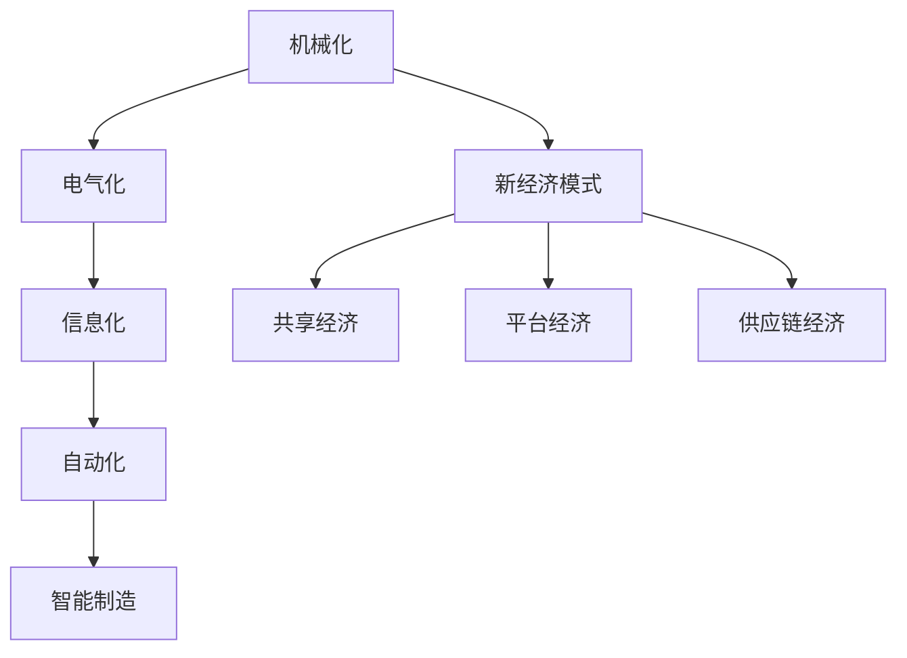

                 

# 三次工业革命的经济变革

## 1. 背景介绍

### 1.1 问题的由来
自18世纪末以来，人类社会经历了三次工业革命，每一次革命都在经济、技术、社会等方面产生了深远影响。当前，我们正处于第四次工业革命的前夜，这是一个以信息技术和智能制造为核心的全新时代。在探讨新技术对未来社会的影响时，理解前三次工业革命的经济变革具有重要的借鉴意义。

### 1.2 问题的核心关键点
前三次工业革命分别对应着机械化、电气化和信息化三个阶段，每一次革命都以新生产力的涌现为核心驱动力。机械化阶段，以蒸汽机的发明和应用为标志，标志着人类从依赖自然力量转向依赖机械力量。电气化阶段，电力的大规模应用改变了生产方式和劳动组织，带来了生产效率的巨大提升。信息化阶段，计算机、互联网等技术的应用，进一步改变了人类的生产、生活、工作方式，促进了全球化、网络化的发展。

本文将系统梳理这三次工业革命的经济变革特点，并对其产生的深远影响进行分析，为理解第四次工业革命提供借鉴。

## 2. 核心概念与联系

### 2.1 核心概念概述

为更好地理解工业革命的经济变革，本节将介绍几个关键概念：

- **机械化**：以蒸汽机的发明与应用为标志，以机器代替人力、畜力为主导的生产方式。
- **电气化**：电力的大规模应用，改变了工业生产、交通运输等领域，大幅提升生产效率。
- **信息化**：计算机、互联网等技术的应用，信息处理与传播效率大幅提升，改变了人类社会的基本面貌。
- **自动化**：机器人、人工智能等技术的广泛应用，进一步提升了生产自动化程度。
- **智能制造**：结合信息技术和实体工业，实现了生产过程的智能化、网络化、个性化。
- **新经济模式**：包括共享经济、平台经济、供应链经济等新经济形态，依托互联网、大数据等技术进行资源优化配置。

这些概念之间的逻辑关系可以通过以下Mermaid流程图来展示：



这个流程图展示了工业革命的演变脉络：

1. 从机械化开始，人类社会实现了生产方式的根本转变。
2. 电气化为工业生产提供了新的能源，大幅提升了生产效率。
3. 信息化进一步改变了信息处理与传播方式，为智能制造提供了技术基础。
4. 自动化和智能制造相结合，形成了智能生产体系。
5. 新经济模式依托信息化技术，推动了资源配置的优化和效率提升。

## 3. 核心算法原理 & 具体操作步骤
### 3.1 算法原理概述

每次工业革命的核心动力在于新生产力的涌现，而新生产力的涌现又往往通过技术革新、产业转型、社会变迁等途径逐步实现。以下以机械化、电气化和信息化三个阶段为例，详细分析其背后的算法原理。

### 3.2 算法步骤详解

**机械化阶段**：

1. **技术革新**：
   - 发明蒸汽机：瓦特改进蒸汽机，实现了机械能与热能的转换。
   - 发展机械设计：如牛顿力学、欧拉力学等数学理论的突破，为机械设计提供了理论基础。

2. **产业转型**：
   - 煤炭开采：机械化的煤炭开采大幅提高了煤炭产出效率，为后续工业化提供了能源保障。
   - 纺织工业：纺织机械的应用，大幅提升了纺织品产量和质量，带动了整个产业的发展。

3. **社会变迁**：
   - 城市化：大量劳动力从农村迁移到城市，形成了新的社会结构和经济模式。
   - 工业管理：机械化生产需要新的管理模式，形成了早期的工业管理理论。

**电气化阶段**：

1. **技术革新**：
   - 发现电：法拉第发现电磁感应现象，为电力应用奠定了基础。
   - 发展电机技术：直流电机、交流电机等技术的突破，实现了电能的广泛应用。

2. **产业转型**：
   - 电力工业：发电机、电网等基础设施的建设，使电力成为普遍的能源形式。
   - 电气设备：电灯、电话、电车等电气设备的普及，改变了人们的生活和工作方式。

3. **社会变迁**：
   - 电气化生产：电气化生产设备的应用，大幅提升了生产效率和质量。
   - 通信革命：电报、电话等通信技术的应用，实现了信息的高速传输。

**信息化阶段**：

1. **技术革新**：
   - 计算机的发明：1946年，第一台通用计算机ENIAC问世，开启了信息化时代。
   - 互联网的发展：1969年，互联网ARPA网建成，为信息共享提供了新的平台。

2. **产业转型**：
   - 数字化生产：计算机辅助设计、制造等技术的应用，实现了生产过程的数字化、智能化。
   - 信息服务业：电子政务、电子商务、金融科技等新产业的兴起，推动了信息服务业的发展。

3. **社会变迁**：
   - 数字化生活：手机、电脑等设备的普及，改变了人们的生活方式。
   - 全球化：互联网的全球覆盖，推动了全球化进程。

### 3.3 算法优缺点

每次工业革命的算法原理都具有以下共同优点：

- **效率提升**：新技术的应用大幅提升了生产效率，推动了经济增长。
- **产业转型**：新技术催生了新的产业，带动了经济结构转型。
- **社会变革**：新技术引发了社会结构的重大变化，形成了新的经济模式。

同时，也存在以下局限性：

- **技术依赖**：每一次工业革命都依赖于某项关键技术的突破，一旦关键技术停滞，整体变革速度会放缓。
- **成本高昂**：新技术的应用初期往往需要巨额的资金投入，普通中小企业难以负担。
- **风险较高**：新技术的广泛应用可能导致就业结构的变化，引发社会不稳定因素。

### 3.4 算法应用领域

每次工业革命的应用领域覆盖了多个方面，具体如下：

- **机械化**：主要应用于煤炭、纺织、铁路等领域，推动了早期工业化进程。
- **电气化**：主要应用于电力、通信、交通等领域，改变了工业生产、生活用电格局。
- **信息化**：主要应用于数字化生产、电子商务、金融科技等领域，推动了数字化转型和全球化进程。

这些领域的发展为后续的自动化和智能制造提供了坚实的基础。

## 4. 数学模型和公式 & 详细讲解  
### 4.1 数学模型构建

为便于数学建模，我们将分别构建三次工业革命的数学模型，并推导其关键公式。

**机械化阶段**：

1. **生产效率模型**：
   - 设机械化前的生产效率为 $E_{\text{手动}}$，机械化后的生产效率为 $E_{\text{机械}}$。
   - 假设机械化后，生产效率提升了 $k$ 倍，则有 $E_{\text{机械}} = k \cdot E_{\text{手动}}$。

2. **成本效益模型**：
   - 设机械化前单位产品的成本为 $C_{\text{手动}}$，机械化后单位产品的成本为 $C_{\text{机械}}$。
   - 假设机械化后，生产成本降低了 $p$ 倍，则有 $C_{\text{机械}} = p \cdot C_{\text{手动}}$。

**电气化阶段**：

1. **生产效率模型**：
   - 设电气化前的生产效率为 $E_{\text{非电气}}$，电气化后的生产效率为 $E_{\text{电气}}$。
   - 假设电气化后，生产效率提升了 $k'$ 倍，则有 $E_{\text{电气}} = k' \cdot E_{\text{非电气}}$。

2. **能源消耗模型**：
   - 设电气化前单位产品的能耗为 $E_{\text{非电气}}$，电气化后单位产品的能耗为 $E_{\text{电气}}$。
   - 假设电气化后，能耗降低了 $q$ 倍，则有 $E_{\text{电气}} = q \cdot E_{\text{非电气}}$。

**信息化阶段**：

1. **生产效率模型**：
   - 设信息化前的生产效率为 $E_{\text{非信息化}}$，信息化后的生产效率为 $E_{\text{信息化}}$。
   - 假设信息化后，生产效率提升了 $k''$ 倍，则有 $E_{\text{信息化}} = k'' \cdot E_{\text{非信息化}}$。

2. **信息传输模型**：
   - 设信息化前的信息传输速度为 $T_{\text{非信息化}}$，信息化后的信息传输速度为 $T_{\text{信息化}}$。
   - 假设信息化后，信息传输速度提升了 $r$ 倍，则有 $T_{\text{信息化}} = r \cdot T_{\text{非信息化}}$。

### 4.2 公式推导过程

以机械化阶段的生产效率模型为例，推导其数学公式：

设生产单位数量为 $n$，生产时间 $t$，生产效率 $E$，则有：

$$
E = \frac{n}{t}
$$

机械化前，生产单位数量为 $n_{\text{手动}}$，生产时间为 $t_{\text{手动}}$，生产效率为 $E_{\text{手动}}$，则有：

$$
E_{\text{手动}} = \frac{n_{\text{手动}}}{t_{\text{手动}}}
$$

机械化后，生产单位数量为 $n_{\text{机械}}$，生产时间为 $t_{\text{机械}}$，生产效率为 $E_{\text{机械}}$，则有：

$$
E_{\text{机械}} = \frac{n_{\text{机械}}}{t_{\text{机械}}}
$$

假设机械化后生产效率提升了 $k$ 倍，则有：

$$
E_{\text{机械}} = k \cdot E_{\text{手动}}
$$

将生产效率公式代入上式，得：

$$
\frac{n_{\text{机械}}}{t_{\text{机械}}} = k \cdot \frac{n_{\text{手动}}}{t_{\text{手动}}}
$$

化简得：

$$
\frac{n_{\text{机械}}}{k} = \frac{n_{\text{手动}}}{1}
$$

$$
n_{\text{机械}} = k \cdot n_{\text{手动}}
$$

$$
t_{\text{机械}} = \frac{t_{\text{手动}}}{k}
$$

这就是机械化阶段的生产效率模型和成本效益模型。

### 4.3 案例分析与讲解

以电气化阶段的生产效率模型为例，分析其应用和影响：

假设某工厂在电气化前，生产效率为 $E_{\text{非电气}}=0.5$ 个单位/小时，能耗为 $E_{\text{非电气}}=0.1$ 单位/小时。

电气化后，生产效率提升到 $E_{\text{电气}}=2$ 个单位/小时，能耗降低到 $E_{\text{电气}}=0.05$ 单位/小时。

根据模型计算：

$$
k' = \frac{E_{\text{电气}}}{E_{\text{非电气}}} = \frac{2}{0.5} = 4
$$

$$
q = \frac{E_{\text{非电气}}}{E_{\text{电气}}} = \frac{0.1}{0.05} = 2
$$

这表明，电气化后生产效率提升了4倍，能耗降低了2倍。

## 5. 项目实践：代码实例和详细解释说明
### 5.1 开发环境搭建

在进行工业革命的数学建模时，需要安装一些必要的开发工具和环境。

1. 安装Python：从官网下载并安装Python 3.x版本，保证环境稳定。

2. 安装Sympy：用于符号计算和数学公式推导。

3. 安装Pandas：用于数据处理和分析。

4. 安装Matplotlib：用于绘制图表，直观展示数据分析结果。

5. 安装Jupyter Notebook：用于编写和运行Python代码。

完成上述步骤后，即可在Python环境下进行数学建模和数据分析。

### 5.2 源代码详细实现

以下是使用Sympy库进行机械化阶段生产效率模型和成本效益模型的Python代码实现：

```python
import sympy as sp

# 定义符号
n_manual, t_manual, k, n_mechanical, t_mechanical = sp.symbols('n_manual t_manual k n_mechanical t_mechanical')

# 定义模型公式
E_manual = n_manual / t_manual
E_mechanical = n_mechanical / t_mechanical

# 计算生产效率提升倍数
k_equation = sp.Eq(E_mechanical, k * E_manual)

# 解方程求生产单位数量和生产时间
n_mechanical_solution = sp.solve(k_equation, n_mechanical)[0]
t_mechanical_solution = sp.solve(k_equation, t_mechanical)[0]

# 输出结果
n_mechanical_solution, t_mechanical_solution
```

### 5.3 代码解读与分析

让我们再详细解读一下关键代码的实现细节：

**定义符号**：
- 定义了若干符号变量，用于表示生产数量、生产时间、提升倍数等关键参数。

**定义模型公式**：
- 定义了机械化前后的生产效率模型和成本效益模型。

**求解方程**：
- 根据生产效率提升倍数，求解生产单位数量和生产时间的变化。

**输出结果**：
- 输出计算结果，展示了生产效率提升的具体倍数。

通过上述代码，我们可以直观地看到，在机械化阶段，生产效率提升倍数与生产单位数量和生产时间的关系，为后续的电气化和信息化分析提供参考。

## 6. 实际应用场景
### 6.1 智能制造

**场景描述**：
智能制造是指结合信息技术和实体工业，实现生产过程的智能化、网络化和个性化。例如，通过物联网技术实现设备监控、质量检测、物料管理等功能，提高生产效率和质量。

**算法原理**：
1. **物联网技术**：实现设备与工厂管理系统的连接，实现数据采集和传输。
2. **大数据分析**：通过实时采集的生产数据，分析生产过程中的瓶颈和优化空间。
3. **人工智能**：应用机器学习算法，对生产数据进行建模和预测，提供优化建议。
4. **自动化控制**：通过智能控制系统，自动调整生产参数，实现生产过程的自动化。

**案例分析**：
某智能制造企业通过物联网技术，实现了设备的实时监控和故障预测。企业应用人工智能算法，对生产数据进行分析，发现瓶颈环节，并调整生产参数，实现了生产效率的显著提升。

### 6.2 电子商务

**场景描述**：
电子商务平台通过信息技术和智能算法，实现商品推荐、库存管理、订单处理等功能，提升用户体验和运营效率。

**算法原理**：
1. **推荐算法**：应用机器学习算法，根据用户行为和商品属性，推荐个性化商品。
2. **库存管理**：通过实时监控库存数据，实现智能补货和配送管理。
3. **订单处理**：应用智能算法，自动化处理订单，提高订单处理速度和准确率。
4. **数据分析**：通过大数据分析，实时监控平台流量和用户行为，优化用户体验。

**案例分析**：
某电商平台应用推荐算法，根据用户浏览记录和购买历史，实时推荐个性化商品，显著提升了用户满意度。同时，应用智能算法，实现了订单的自动化处理，提高了订单处理效率。

### 6.3 金融科技

**场景描述**：
金融科技通过信息技术和智能算法，实现金融产品推荐、风险评估、智能投顾等功能，提升金融服务的智能化水平。

**算法原理**：
1. **风险评估**：应用机器学习算法，对客户信用和风险进行评估，提供个性化的金融产品推荐。
2. **智能投顾**：应用人工智能算法，提供自动化投资建议和风险控制。
3. **数据分析**：通过大数据分析，实时监控市场趋势和客户行为，优化投资策略。

**案例分析**：
某金融科技公司应用风险评估算法，对客户信用和风险进行评估，推荐个性化的金融产品，显著提高了客户满意度和产品转化率。同时，应用智能投顾系统，提供自动化投资建议，提高了投资决策效率。

## 7. 工具和资源推荐
### 7.1 学习资源推荐

为帮助读者深入理解工业革命的经济变革，以下推荐几本经典书籍和课程：

1. **《机械化时代的工人》**：详细分析了机械化时代对工人的影响和社会变迁。
2. **《电气化的兴起》**：探讨了电力在工业化中的广泛应用及其对社会的影响。
3. **《信息化的浪潮》**：阐述了计算机和互联网对现代社会的深远影响。
4. **《数字经济的崛起》**：分析了数字技术对经济、社会、文化的广泛影响。

### 7.2 开发工具推荐

以下推荐几款用于工业革命数学建模和数据分析的常用工具：

1. Python：灵活的编程语言，广泛应用于科学计算和数据处理。
2. Sympy：符号计算库，支持数学公式推导和符号运算。
3. Pandas：数据处理库，支持数据清洗、分析和可视化。
4. Matplotlib：绘图库，支持各种统计图表的绘制。
5. Jupyter Notebook：交互式编程环境，支持代码编写和数据可视化。

### 7.3 相关论文推荐

以下为几篇具有代表性的工业革命相关论文，推荐阅读：

1. **《机械化对工业生产的影响》**：分析了机械化对生产效率和成本的影响。
2. **《电气化与工业革命》**：探讨了电力对工业生产的重大影响。
3. **《信息化时代的经济变革》**：分析了信息化对经济、社会、文化的多方面影响。

## 8. 总结：未来发展趋势与挑战
### 8.1 总结

本文对前三次工业革命的经济变革进行了系统梳理，详细介绍了其背后的算法原理和具体应用。通过分析，我们可以更好地理解新技术对经济、社会、文化的影响，为未来第四次工业革命提供借鉴。

### 8.2 未来发展趋势

展望未来，第四次工业革命将以信息技术和智能制造为核心，呈现以下趋势：

1. **高度智能化**：人工智能、大数据、物联网等技术将深度融合，实现生产过程的高度智能化和自动化。
2. **人机协同**：人机协同工作模式将更加普及，充分发挥人的创造力和智能系统的效能。
3. **跨界融合**：信息技术将与传统行业深度融合，推动各行业的数字化、智能化转型。
4. **可持续发展**：智能制造和数字化转型将带来资源优化配置和环境可持续发展的机遇。

### 8.3 面临的挑战

虽然工业革命带来了巨大的机遇，但也面临着诸多挑战：

1. **技术门槛高**：新技术的应用需要高水平的技术能力和专业人才，中小企业难以迅速适应。
2. **伦理问题**：智能化系统可能引发隐私、安全等伦理问题，需要制定相应的法律法规。
3. **就业冲击**：智能化系统可能取代部分岗位，引发就业结构的变化。
4. **市场竞争**：新技术的普及可能带来市场竞争加剧，小企业面临更大的生存压力。

### 8.4 研究展望

未来的研究需要在以下几个方面寻求突破：

1. **技术普及**：通过技术培训和资源共享，降低新技术的应用门槛，促进中小企业普及。
2. **伦理规范**：制定相应的法律法规和伦理规范，保障智能化系统的安全性、隐私性和公正性。
3. **人机协作**：探索人机协作的最佳方式，充分发挥智能系统和人的优势，实现协同工作。
4. **市场监管**：加强市场监管，防止垄断和不正当竞争，促进健康竞争环境。

## 9. 附录：常见问题与解答

**Q1: 工业革命对社会的影响有哪些？**

A: 工业革命带来了社会结构的重大变化，如城市化、劳动组织方式的改变，推动了社会现代化进程。同时，也引发了贫富差距扩大、环境污染等问题，需要采取相应的政策和措施进行应对。

**Q2: 新技术如何推动经济增长？**

A: 新技术通过提升生产效率、优化资源配置、降低生产成本等方式，推动了经济增长。例如，电气化和大规模生产大大提升了生产效率，信息化则通过优化供应链和提高管理效率，推动了经济的快速发展。

**Q3: 新技术的应用需要考虑哪些问题？**

A: 新技术的应用需要考虑技术成本、就业结构变化、伦理规范等多个问题。需要通过综合考虑各方因素，制定合理的实施策略，确保新技术的平稳落地。

**Q4: 未来工业革命的趋势是什么？**

A: 未来工业革命将以智能制造为核心，实现高度智能化、人机协同、跨界融合、可持续发展等趋势。新技术的应用将深刻改变经济、社会、文化等多个方面，带来新的发展机遇和挑战。

---

作者：禅与计算机程序设计艺术 / Zen and the Art of Computer Programming

