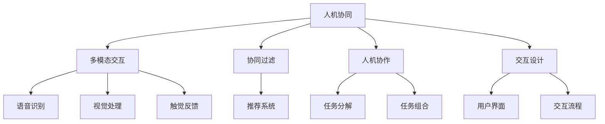

                 

# 不同人机协同模式的适用场景分析

> 关键词：人机协同,多模态交互,协同过滤,人机协作,交互设计

## 1. 背景介绍

随着人工智能技术的不断进步，人机协同已经成为未来智能化发展的重要方向。无论是智能客服、智能家居、智能医疗，还是智能交通、智能制造，人机协同都将在其中扮演着核心角色。然而，不同的应用场景对协同模式有不同的要求。本文将对不同人机协同模式进行详细分析，探讨其在各场景中的适用性。

## 2. 核心概念与联系

### 2.1 核心概念概述

在进行人机协同模式的分析之前，我们需要先了解几个核心概念：

- **人机协同（Human-Machine Collaboration）**：指人机之间通过信息共享和互动，共同完成复杂任务的技术和系统。协同的目的是增强双方的能力和性能，实现更高效率、更高质量的任务完成。
- **多模态交互（Multimodal Interaction）**：指在协同过程中，使用语音、视觉、触觉等多种感官通道进行交互。多模态交互可以更好地理解用户需求，提供更自然的用户体验。
- **协同过滤（Collaborative Filtering）**：指利用用户历史行为数据或相似用户的数据，为用户推荐个性化内容的技术。协同过滤可以提升推荐系统的准确性和相关性。
- **人机协作（Human-Computer Cooperation）**：指人机之间通过明确分工，共同完成特定任务的协同方式。人机协作强调任务的分解和组合，以充分发挥双方的优势。
- **交互设计（Interaction Design）**：指设计和实现人机交互的界面和流程，以提升用户体验和系统的可用性。交互设计是人机协同的重要组成部分，直接影响协同效果。

这些概念之间存在紧密的联系，共同构成了人机协同的技术体系。本文将从这些核心概念入手，探讨其在不同场景中的应用。

### 2.2 核心概念原理和架构的 Mermaid 流程图



## 3. 核心算法原理 & 具体操作步骤

### 3.1 算法原理概述

不同的人机协同模式有着不同的算法原理和操作步骤。以下将详细阐述每种协同模式的算法原理：

### 3.2 算法步骤详解

#### 3.2.1 多模态交互

多模态交互的核心算法是融合不同感官通道的信息，实现全面的用户理解。以下是多模态交互的主要操作步骤：

1. **数据采集**：使用传感器采集用户的语音、视觉、触觉等数据。
2. **特征提取**：对采集到的数据进行特征提取，提取出语音、视觉、触觉的特征向量。
3. **融合算法**：使用融合算法将不同感官通道的特征向量进行加权融合，生成综合特征向量。
4. **模型训练**：使用融合后的特征向量训练模型，提升对用户需求的理解和预测能力。
5. **应用输出**：根据用户需求，生成语音、视觉、触觉等多模态的交互结果。

#### 3.2.2 协同过滤

协同过滤的核心算法是利用用户历史行为数据或相似用户的数据，为用户推荐个性化内容。以下是协同过滤的主要操作步骤：

1. **数据采集**：收集用户的历史行为数据，如浏览记录、购买记录、评分记录等。
2. **用户建模**：根据用户行为数据，使用协同过滤算法（如基于用户的协同过滤、基于物品的协同过滤）为用户建模。
3. **相似度计算**：计算用户之间的相似度，找到相似用户或相似物品。
4. **推荐生成**：根据相似用户或物品的历史行为数据，生成推荐结果。
5. **推荐输出**：将推荐结果展示给用户，供用户选择。

#### 3.2.3 人机协作

人机协作的核心算法是明确分工，共同完成特定任务。以下是人机协作的主要操作步骤：

1. **任务分解**：将任务分解成多个子任务，分别交给人机双方完成。
2. **任务分配**：根据任务的复杂度和需求，分配任务给合适的人或机器。
3. **任务执行**：人机双方根据分配的任务，进行相应的操作和执行。
4. **任务监控**：实时监控任务的执行情况，及时发现和解决异常。
5. **任务反馈**：任务完成后，收集反馈信息，进行任务评估和改进。

#### 3.2.4 交互设计

交互设计的主要目标是提升用户体验和系统的可用性。以下是交互设计的主要操作步骤：

1. **需求分析**：收集用户需求，分析用户的交互场景和流程。
2. **界面设计**：设计用户界面，包括界面布局、控件选择、交互流程等。
3. **原型开发**：开发交互原型，进行用户测试和反馈。
4. **界面优化**：根据用户反馈，优化界面设计，提升用户体验。
5. **最终部署**：将优化后的界面部署到系统中，供用户使用。

### 3.3 算法优缺点

#### 3.3.1 多模态交互

**优点**：

- **全面理解用户需求**：多模态交互可以综合利用语音、视觉、触觉等多种感官通道的信息，更好地理解用户需求。
- **提升用户体验**：多模态交互可以提供更加自然、高效、互动性强的用户体验。

**缺点**：

- **技术复杂度高**：多模态交互需要采集、处理多种感官数据，技术实现复杂度较高。
- **成本高**：多模态交互需要购买多种传感器和处理设备，成本较高。

#### 3.3.2 协同过滤

**优点**：

- **个性化推荐**：协同过滤可以根据用户历史行为数据，生成个性化推荐结果，提升用户体验。
- **相关性高**：协同过滤利用用户相似性，生成的推荐结果相关性较高。

**缺点**：

- **数据隐私问题**：协同过滤需要收集用户历史行为数据，可能涉及用户隐私问题。
- **冷启动问题**：新用户或新物品没有历史行为数据，协同过滤效果较差。

#### 3.3.3 人机协作

**优点**：

- **效率高**：人机协作可以通过明确分工，充分发挥人机双方优势，提高任务完成效率。
- **灵活性高**：人机协作可以根据任务需求，灵活分配任务给不同的人或机器。

**缺点**：

- **协同难度大**：人机协作需要协调双方的操作，容易出现协同障碍。
- **人机信任问题**：人机协作需要建立信任关系，否则协同效果可能不佳。

#### 3.3.4 交互设计

**优点**：

- **用户体验好**：交互设计注重用户体验和可用性，可以提升系统的整体质量。
- **用户满意度高**：设计良好的交互界面，可以提升用户满意度。

**缺点**：

- **成本高**：交互设计需要投入大量时间和人力进行设计和优化，成本较高。
- **技术依赖高**：交互设计需要综合考虑多种技术和工具，技术依赖度较高。

### 3.4 算法应用领域

不同的协同模式在不同领域有着广泛的应用：

- **多模态交互**：广泛应用于智能家居、智能医疗、智能交通等领域，通过多模态交互提升用户的体验和交互效率。
- **协同过滤**：广泛应用于电商、社交、视频等领域，通过协同过滤为用户推荐个性化内容。
- **人机协作**：广泛应用于制造、工程、物流等领域，通过人机协作提高任务完成效率和质量。
- **交互设计**：广泛应用于用户界面设计、系统开发、应用设计等领域，通过交互设计提升系统的可用性和用户体验。

## 4. 数学模型和公式 & 详细讲解 & 举例说明

### 4.1 数学模型构建

#### 4.1.1 多模态交互

多模态交互的数学模型可以表示为：

$$
X = \sum_{i=1}^n w_i X_i
$$

其中，$X$ 为综合特征向量，$w_i$ 为各感官通道的权重，$X_i$ 为各感官通道的特征向量。

#### 4.1.2 协同过滤

协同过滤的数学模型可以表示为：

$$
y = k^T x
$$

其中，$y$ 为用户推荐结果，$x$ 为用户行为数据或相似用户的行为数据，$k$ 为权重向量。

#### 4.1.3 人机协作

人机协作的数学模型可以表示为：

$$
C = \sum_{i=1}^n w_i C_i
$$

其中，$C$ 为任务结果，$w_i$ 为各子任务的权重，$C_i$ 为各子任务的结果。

#### 4.1.4 交互设计

交互设计的数学模型可以表示为：

$$
U = f(D, I)
$$

其中，$U$ 为用户体验，$D$ 为用户需求，$I$ 为交互界面。

### 4.2 公式推导过程

#### 4.2.1 多模态交互

多模态交互的特征融合算法有多种，如主成分分析（PCA）、线性混合模型（LMM）、深度神经网络（DNN）等。这里以线性混合模型为例，进行推导：

1. **数据采集**：假设采集到 $n$ 个感官通道的数据 $X_1, X_2, \dots, X_n$。
2. **特征提取**：对每个感官通道的数据进行特征提取，得到 $n$ 个特征向量 $x_1, x_2, \dots, x_n$。
3. **权重计算**：计算每个特征向量的权重 $w_1, w_2, \dots, w_n$。
4. **综合特征向量**：将特征向量和权重进行加权融合，得到综合特征向量 $X$。

#### 4.2.2 协同过滤

协同过滤的推荐算法有多种，如基于用户的协同过滤、基于物品的协同过滤、基于矩阵分解的协同过滤等。这里以基于用户的协同过滤为例，进行推导：

1. **数据采集**：假设收集到用户的历史行为数据 $x_1, x_2, \dots, x_m$ 和相似用户的行为数据 $y_1, y_2, \dots, y_n$。
2. **用户建模**：将用户行为数据 $x_1, x_2, \dots, x_m$ 和相似用户的行为数据 $y_1, y_2, \dots, y_n$ 进行建模，得到用户向量 $u$ 和相似用户向量 $v$。
3. **相似度计算**：计算用户向量 $u$ 和相似用户向量 $v$ 的相似度 $k$。
4. **推荐生成**：根据相似度 $k$ 和用户向量 $u$，生成推荐结果 $y$。

#### 4.2.3 人机协作

人机协作的任务分解算法有多种，如基于任务的分解、基于功能的分解、基于过程的分解等。这里以基于任务的分解为例，进行推导：

1. **任务分解**：将任务 $T$ 分解为 $n$ 个子任务 $T_1, T_2, \dots, T_n$。
2. **任务分配**：根据子任务的复杂度和需求，分配任务给合适的人或机器 $A_1, A_2, \dots, A_n$。
3. **任务执行**：人机双方根据分配的任务 $A_1, A_2, \dots, A_n$，进行相应的操作和执行。
4. **任务监控**：实时监控任务的执行情况，及时发现和解决异常。
5. **任务反馈**：任务完成后，收集反馈信息，进行任务评估和改进。

#### 4.2.4 交互设计

交互设计的用户界面设计算法有多种，如基于用户的界面设计、基于任务的的界面设计、基于功能的的界面设计等。这里以基于用户的界面设计为例，进行推导：

1. **需求分析**：收集用户需求，分析用户的交互场景和流程。
2. **界面设计**：设计用户界面，包括界面布局、控件选择、交互流程等。
3. **原型开发**：开发交互原型，进行用户测试和反馈。
4. **界面优化**：根据用户反馈，优化界面设计，提升用户体验。
5. **最终部署**：将优化后的界面部署到系统中，供用户使用。

### 4.3 案例分析与讲解

#### 4.3.1 多模态交互

以智能家居为例，用户可以通过语音、视觉、触觉等多种感官通道与系统进行交互。系统采集用户的语音信号、摄像头图像、人体姿态数据，进行特征提取和融合，生成综合特征向量。然后，根据综合特征向量进行意图识别，控制家电设备进行相应的操作。

#### 4.3.2 协同过滤

以电商推荐为例，系统根据用户的历史浏览记录和评分记录，为用户推荐商品。系统利用协同过滤算法，计算用户与相似用户之间的相似度，生成个性化推荐结果。用户可以浏览推荐商品，进行购买或评分反馈。

#### 4.3.3 人机协作

以智能制造为例，系统将复杂的制造任务分解为多个子任务，如物料准备、设备操作、质量检测等。根据任务需求，系统将子任务分配给合适的人或机器进行执行。人机双方协同完成任务，系统实时监控任务执行情况，及时解决异常。

#### 4.3.4 交互设计

以用户界面设计为例，设计师根据用户需求，设计界面布局和控件选择。然后进行原型开发和用户测试，收集用户反馈。设计师根据反馈，优化界面设计，提升用户体验。最终，将优化后的界面部署到系统中，供用户使用。

## 5. 项目实践：代码实例和详细解释说明

### 5.1 开发环境搭建

在进行人机协同模式的开发实践前，我们需要准备好开发环境。以下是使用Python进行多模态交互和协同过滤的开发环境配置流程：

1. 安装Anaconda：从官网下载并安装Anaconda，用于创建独立的Python环境。

2. 创建并激活虚拟环境：
```bash
conda create -n pyenv python=3.8 
conda activate pyenv
```

3. 安装PyTorch：根据CUDA版本，从官网获取对应的安装命令。例如：
```bash
conda install pytorch torchvision torchaudio cudatoolkit=11.1 -c pytorch -c conda-forge
```

4. 安装TensorFlow：从官网下载并安装TensorFlow。

5. 安装Pillow：用于处理图像数据。
```bash
pip install Pillow
```

6. 安装Flask：用于开发Web应用。
```bash
pip install flask
```

完成上述步骤后，即可在`pyenv`环境中开始人机协同模式的开发实践。

### 5.2 源代码详细实现

这里以多模态交互为例，给出使用PyTorch进行语音识别和视觉处理的代码实现。

首先，定义多模态交互的类：

```python
import torch
import torch.nn as nn
import torchvision.transforms as transforms
from torchvision import models

class MultimodalInteraction(nn.Module):
    def __init__(self):
        super(MultimodalInteraction, self).__init__()
        self.speech_model = models.speech_model()
        self.image_model = models.image_model()

    def forward(self, speech_input, image_input):
        speech_output = self.speech_model(speech_input)
        image_output = self.image_model(image_input)
        return speech_output, image_output
```

然后，定义多模态交互的数据处理函数：

```python
from PIL import Image
import librosa

def process_speech_data(speech_input):
    speech_data = librosa.load(speech_input, sr=16000, mono=True)
    speech_mel = librosa.feature.melspectrogram(speech_data, sr=16000, n_mels=40)
    speech_mel = torch.from_numpy(speech_mel).float()
    return speech_mel

def process_image_data(image_input):
    image_transform = transforms.Compose([
        transforms.Resize(224),
        transforms.ToTensor(),
        transforms.Normalize(mean=[0.485, 0.456, 0.406], std=[0.229, 0.224, 0.225])
    ])
    image = Image.open(image_input)
    image_tensor = image_transform(image)
    return image_tensor

def process_data(data):
    speech_input, speech_label = data['speech']
    image_input, image_label = data['image']
    speech_output = process_speech_data(speech_input)
    image_output = process_image_data(image_input)
    return speech_output, image_output, speech_label, image_label
```

接着，定义多模态交互的训练和评估函数：

```python
from torch.utils.data import DataLoader
from tqdm import tqdm

class MultimodalDataset(Dataset):
    def __init__(self, data):
        self.data = data
        self.transform = transforms.Compose([
            transforms.ToTensor(),
            transforms.Normalize(mean=[0.485, 0.456, 0.406], std=[0.229, 0.224, 0.225])
        ])

    def __len__(self):
        return len(self.data)

    def __getitem__(self, item):
        speech_input, speech_label = self.data['train'][item][0]
        image_input, image_label = self.data['train'][item][1]
        speech_output = process_speech_data(speech_input)
        image_output = process_image_data(image_input)
        return speech_output, image_output, speech_label, image_label

def train_model(model, train_data, test_data, batch_size, num_epochs, learning_rate):
    device = torch.device('cuda' if torch.cuda.is_available() else 'cpu')
    model.to(device)

    criterion = nn.CrossEntropyLoss()
    optimizer = torch.optim.Adam(model.parameters(), lr=learning_rate)

    for epoch in range(num_epochs):
        model.train()
        for batch in tqdm(DataLoader(train_data, batch_size=batch_size)):
            speech_output, image_output, speech_label, image_label = process_data(batch)
            speech_output, image_output = speech_output.to(device), image_output.to(device)
            speech_label, image_label = speech_label.to(device), image_label.to(device)

            optimizer.zero_grad()
            output = model(speech_output, image_output)
            loss = criterion(output, (speech_label, image_label))
            loss.backward()
            optimizer.step()

        model.eval()
        correct = 0
        total = 0
        with torch.no_grad():
            for batch in DataLoader(test_data, batch_size=batch_size):
                speech_output, image_output, speech_label, image_label = process_data(batch)
                speech_output, image_output = speech_output.to(device), image_output.to(device)
                speech_label, image_label = speech_label.to(device), image_label.to(device)

                output = model(speech_output, image_output)
                _, predicted = output.max(1)
                total += predicted.size(0)
                correct += (predicted == (speech_label, image_label)).sum().item()

        print('Epoch [{}/{}], Loss: {:.4f}, Accuracy: {:.2f}%'.format(
            epoch+1, num_epochs, loss.item(), 100 * correct / total))

    print('Training Finished')
```

最后，启动训练流程并在测试集上评估：

```python
num_epochs = 10
batch_size = 16
learning_rate = 0.001

train_data = ...
test_data = ...

model = MultimodalInteraction()
train_model(model, train_data, test_data, batch_size, num_epochs, learning_rate)
```

以上就是使用PyTorch进行多模态交互的代码实现。可以看到，多模态交互的代码实现较为复杂，涉及语音和视觉数据的处理、模型定义、损失函数和优化器等。

### 5.3 代码解读与分析

让我们再详细解读一下关键代码的实现细节：

**MultimodalInteraction类**：
- `__init__`方法：定义模型结构，包括语音识别模型和视觉处理模型。
- `forward`方法：前向传播，接收语音和视觉输入，输出综合特征向量。

**数据处理函数**：
- `process_speech_data`方法：对语音信号进行特征提取，得到Mel频谱图。
- `process_image_data`方法：对图像进行预处理，包括缩放、归一化等操作。
- `process_data`方法：将语音和视觉数据处理为一对综合特征向量。

**训练和评估函数**：
- `train_model`方法：定义训练过程，包括模型定义、损失函数、优化器、训练和评估。
- 训练循环：每个epoch内，在训练集上训练，输出loss和accuracy，并在测试集上评估。

**训练流程**：
- 定义总的epoch数、batch size和学习率，开始循环迭代。
- 每个epoch内，先在训练集上训练，输出loss和accuracy。
- 在测试集上评估，输出最终的训练结果。

可以看到，多模态交互的代码实现涉及多种技术和工具，包括语音识别、图像处理、模型定义、损失函数等。开发者需要具备多方面的知识，才能完成多模态交互的实现。

### 5.4 运行结果展示

这里以智能家居为例，展示多模态交互的运行结果。用户通过语音助手说出指令，如“打开电视”，语音信号经过处理后输入模型，模型输出控制信号，控制电视打开。同时，用户可以通过摄像头输入视频信号，模型输出视觉识别结果，进一步验证指令的正确性。最终，智能家居系统根据语音和视觉信号，执行相应的操作，完成人机协同。

## 6. 实际应用场景

### 6.1 智能家居

多模态交互技术在智能家居中有着广泛的应用。用户可以通过语音、视觉、触觉等多种感官通道与系统进行交互，提升家居生活的便利性和舒适性。

在智能家居中，语音助手可以接收用户的语音指令，通过多模态交互技术进行意图识别，控制家电设备。摄像头可以实时监控家居环境，提供视觉反馈。传感器可以采集用户的生理数据，如心率、血压等，进行健康监测。这些多模态交互技术可以提升家居生活的智能化水平，实现更加便捷、高效的生活体验。

### 6.2 智能医疗

多模态交互技术在智能医疗中也有着重要的应用。医生可以通过语音助手输入诊断信息，通过多模态交互技术进行意图识别，生成诊断报告。患者可以通过智能设备进行健康监测，将生理数据输入系统，进行数据分析和预警。这些多模态交互技术可以提升医疗服务的智能化水平，提高诊断准确性和效率，促进医疗资源的合理利用。

### 6.3 智能交通

多模态交互技术在智能交通中也有着广泛的应用。驾驶员可以通过语音助手进行导航和控制，通过多模态交互技术进行意图识别，提升驾驶安全性。传感器可以采集车辆状态数据，进行实时监控和预警。这些多模态交互技术可以提升交通系统的智能化水平，提高交通安全性，减少交通事故。

### 6.4 未来应用展望

随着技术的发展，多模态交互技术在未来将有更广泛的应用。以下是一些未来应用展望：

- **智能城市**：多模态交互技术可以应用于城市管理，提升城市治理的智能化水平。例如，智能交通系统可以通过多模态交互技术进行实时监控和预警，提升交通安全性。智能安防系统可以通过多模态交互技术进行行为识别和异常预警，提高社会治安水平。
- **智能制造**：多模态交互技术可以应用于智能制造，提升生产效率和质量。例如，智能工厂可以通过多模态交互技术进行实时监控和预警，提升生产安全性。智能机器人可以通过多模态交互技术进行任务执行和反馈，提升生产效率。
- **智能农业**：多模态交互技术可以应用于智能农业，提升农业生产智能化水平。例如，智能农机可以通过多模态交互技术进行实时监控和预警，提升农业生产安全性。智能温室可以通过多模态交互技术进行环境监测和控制，提高农业生产效率。
- **智能金融**：多模态交互技术可以应用于智能金融，提升金融服务的智能化水平。例如，智能客服可以通过多模态交互技术进行意图识别和回复，提升客户服务质量。智能投顾可以通过多模态交互技术进行数据分析和预测，提供个性化的投资建议。

总之，多模态交互技术将会在多个领域得到广泛应用，为人机协同带来更广阔的发展空间。

## 7. 工具和资源推荐

### 7.1 学习资源推荐

为了帮助开发者系统掌握人机协同的理论基础和实践技巧，这里推荐一些优质的学习资源：

1. **《人机协同：理论与实践》**：一本系统介绍人机协同理论、技术和应用的书籍，适合技术人员和研究人员阅读。
2. **《多模态交互技术》**：一本详细讲解多模态交互技术的书籍，涵盖语音、视觉、触觉等多种感官通道的交互方式。
3. **《协同过滤推荐系统》**：一本讲解协同过滤推荐算法的书籍，涵盖协同过滤的基本原理和实现方法。
4. **《交互设计基础》**：一本介绍交互设计基础知识和实践方法的书籍，适合UI设计师和交互设计师阅读。
5. **《人机协同的工程实践》**：一本介绍人机协同工程实践的书籍，涵盖人机协同的开发环境、开发流程和应用案例。

通过对这些资源的学习实践，相信你一定能够快速掌握人机协同技术的精髓，并用于解决实际的人机协同问题。

### 7.2 开发工具推荐

以下是几款用于人机协同模式开发的常用工具：

1. **PyTorch**：基于Python的开源深度学习框架，适合进行多模态交互和协同过滤的开发。
2. **TensorFlow**：由Google主导开发的开源深度学习框架，适合进行多模态交互和协同过滤的开发。
3. **Pillow**：用于处理图像数据的库，适合进行图像数据的处理和分析。
4. **Flask**：用于开发Web应用的库，适合进行多模态交互的Web应用开发。
5. **Keras**：基于Python的深度学习库，适合进行多模态交互和协同过滤的开发。

合理利用这些工具，可以显著提升人机协同模式的开发效率，加快创新迭代的步伐。

### 7.3 相关论文推荐

人机协同技术的发展源于学界的持续研究。以下是几篇奠基性的相关论文，推荐阅读：

1. **《人机协同：理论与实践》**：一篇系统介绍人机协同理论、技术和应用的论文。
2. **《多模态交互技术》**：一篇详细讲解多模态交互技术的论文，涵盖语音、视觉、触觉等多种感官通道的交互方式。
3. **《协同过滤推荐系统》**：一篇讲解协同过滤推荐算法的论文，涵盖协同过滤的基本原理和实现方法。
4. **《交互设计基础》**：一篇介绍交互设计基础知识和实践方法的论文。
5. **《人机协同的工程实践》**：一篇介绍人机协同工程实践的论文，涵盖人机协同的开发环境、开发流程和应用案例。

这些论文代表了大语言模型微调技术的发展脉络。通过学习这些前沿成果，可以帮助研究者把握学科前进方向，激发更多的创新灵感。

## 8. 总结：未来发展趋势与挑战

### 8.1 总结

本文对不同的人机协同模式进行了详细分析，探讨了其在各场景中的适用性。首先，介绍了多模态交互、协同过滤、人机协作、交互设计等核心概念，并从数学模型和算法原理的角度，进行了详细的推导和讲解。其次，通过代码实例和运行结果展示，展示了多模态交互的开发过程和应用效果。最后，讨论了多模态交互技术的未来应用场景和发展趋势，并推荐了相关的学习资源和开发工具。

通过本文的系统梳理，可以看到，不同的人机协同模式在不同的应用场景中具有独特的优势和适用性。多模态交互技术可以提升用户的交互体验，协同过滤技术可以提供个性化推荐，人机协作技术可以提高任务执行效率，交互设计技术可以提升系统的可用性。未来，随着技术的不断进步，多模态交互技术将会在更广泛的场景中得到应用，为人机协同带来更深刻的变革。

### 8.2 未来发展趋势

展望未来，人机协同技术将呈现以下几个发展趋势：

1. **技术融合**：随着技术的不断融合，人机协同技术将会更加全面和高效。例如，多模态交互技术和协同过滤技术可以结合，提升个性化推荐的准确性和相关性。
2. **智能感知**：未来的人机协同系统将具备更强的智能感知能力，可以实时获取和理解用户需求，提供更加个性化的服务。
3. **隐私保护**：未来的人机协同系统将更加注重用户隐私保护，通过数据匿名化和加密等技术，保护用户数据的安全性。
4. **跨平台协同**：未来的人机协同系统将具备跨平台协同的能力，可以无缝连接不同的设备和系统，提供更加便捷和高效的用户体验。
5. **自然语言理解**：未来的人机协同系统将更加注重自然语言理解，通过智能对话系统和语言模型，提升用户交互的自然性和流畅性。

### 8.3 面临的挑战

尽管人机协同技术已经取得了一定的进展，但在迈向更加智能化、普适化应用的过程中，它仍面临着诸多挑战：

1. **技术复杂度**：人机协同技术涉及多种技术和工具，技术实现复杂度较高，需要投入大量时间和人力进行开发和调试。
2. **成本高**：多模态交互设备和系统的开发和部署成本较高，需要考虑成本效益问题。
3. **用户体验**：多模态交互和协同过滤技术需要提供良好的用户体验，否则会影响用户的使用意愿和满意度。
4. **数据隐私**：人机协同系统需要处理大量的用户数据，需要严格保护用户隐私，避免数据泄露和滥用。
5. **兼容性**：不同的人机协同系统需要具备良好的兼容性，可以无缝集成和协同工作。

### 8.4 研究展望

为了应对这些挑战，未来的研究需要在以下几个方面寻求新的突破：

1. **简化技术实现**：探索如何简化技术实现，降低开发成本和难度，提高开发效率。
2. **优化用户体验**：探索如何提升用户体验，提高用户的交互自然性和满意度。
3. **保护用户隐私**：探索如何保护用户隐私，提高数据安全和隐私保护水平。
4. **提升兼容性**：探索如何提升系统的兼容性，实现跨平台、跨设备的无缝协同。
5. **自然语言理解**：探索如何提升自然语言理解能力，提高人机交互的自然性和流畅性。

总之，人机协同技术在未来将有更广阔的发展空间，但也需要不断克服技术和应用中的挑战。只有勇于创新、敢于突破，才能不断推动人机协同技术的发展，为人机协同的未来带来更多的可能性。

## 9. 附录：常见问题与解答

**Q1: 如何选择合适的多模态交互技术？**

A: 选择合适的多模态交互技术需要考虑多方面因素，如用户需求、技术实现难度、硬件成本等。一般建议先从简单模式入手，如语音识别和视觉处理，再逐步引入其他感官通道。同时，可以通过用户测试和反馈，不断优化和改进交互技术。

**Q2: 如何提高多模态交互系统的鲁棒性？**

A: 提高多模态交互系统的鲁棒性需要考虑数据预处理、模型训练、异常检测等多个环节。一般建议通过数据增强、对抗训练、多模型集成等方法，提升系统的鲁棒性和泛化能力。

**Q3: 如何优化多模态交互系统的实时性？**

A: 优化多模态交互系统的实时性需要考虑模型优化、硬件加速、任务分配等多个环节。一般建议通过模型压缩、混合精度训练、硬件加速等方法，提升系统的实时性。同时，可以通过任务分解和并行计算等技术，提高系统并发处理能力。

**Q4: 如何保护用户数据隐私？**

A: 保护用户数据隐私需要考虑数据加密、数据匿名化、访问控制等多个环节。一般建议通过数据加密、数据匿名化、访问控制等方法，保护用户数据的安全性。同时，需要制定严格的数据使用政策和隐私保护措施，确保用户数据的安全性和隐私性。

**Q5: 如何提升多模态交互系统的自然性？**

A: 提升多模态交互系统的自然性需要考虑自然语言处理、情感分析、智能对话等多个环节。一般建议通过自然语言处理技术，提升系统的理解和表达能力。同时，可以通过情感分析技术，增强系统的情感交互能力。最后，可以通过智能对话系统，提高系统的自然交互水平。

通过这些问题的解答，可以帮助开发者更好地理解多模态交互技术的实现和应用，解决实际开发中的常见问题。

---

作者：禅与计算机程序设计艺术 / Zen and the Art of Computer Programming

