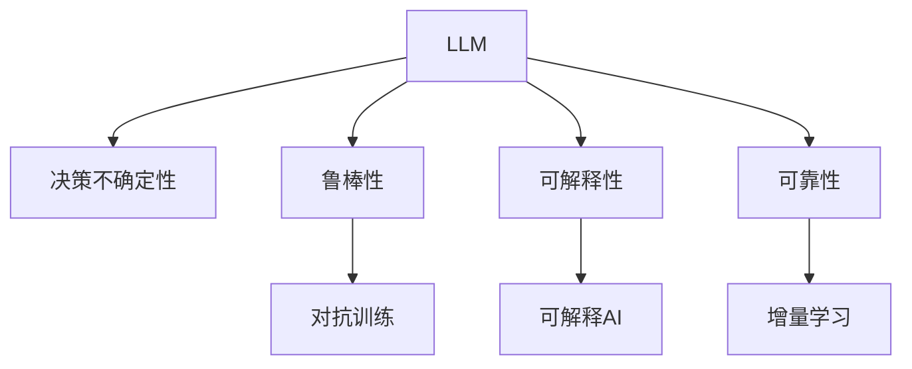

                 

## 1. 背景介绍

在人工智能领域，尤其是自然语言处理（NLP）和大语言模型（LLM）的发展中，决策的可靠性始终是一个关键问题。尽管LLM在各种自然语言理解和生成任务中表现出色，但在不确定性管理方面仍存在不少挑战。随着LLM应用的普及，确保其决策的可靠性和鲁棒性变得愈发重要。本文将深入探讨LLM决策的不确定性管理问题，包括其原理、技术、应用及未来发展方向。

## 2. 核心概念与联系

### 2.1 核心概念概述

要理解LLM决策的不确定性管理，首先需要明确定义几个核心概念：

- **大语言模型（LLM）**：基于深度学习技术，以Transformer架构为代表的预训练模型。通过在大规模文本数据上进行自监督预训练，LLM能学习到丰富的语言知识，并具备强大的文本生成和理解能力。

- **决策不确定性**：在给定输入的情况下，模型输出结果的不确定性，反映了模型对输入数据的不确定性认知。

- **鲁棒性（Robustness）**：模型在面对噪声、小样本、对抗攻击等异常情况下的表现能力，即模型对外界扰动的耐受程度。

- **可解释性（Explainability）**：模型决策过程的可理解性，即解释模型为何做出特定决策的能力。

- **可靠性（Reliability）**：模型决策的稳定性与一致性，即在相同条件下，模型多次输出结果的一致性。

这些概念之间的关系可以用以下Mermaid流程图来展示：



该图展示了LLM决策不确定性与其相关概念之间的联系。决策不确定性源于LLM的输入、模型参数和计算过程的复杂性。通过对抗训练、可解释性方法等技术，可以提升模型的鲁棒性和可靠性，从而更好地管理决策不确定性。

### 2.2 核心概念原理和架构

LLM通常基于Transformer模型，其核心原理是通过自监督预训练学习到语言的隐含知识，并通过微调处理特定任务。Transformer模型由编码器和解码器组成，编码器负责编码输入文本，解码器负责生成目标文本。编码器和解码器之间通过自注意力机制进行信息交互。

自注意力机制的核心是查询、键和值的三元组，用于捕捉输入序列中不同位置的依赖关系。这一机制使LLM能够处理长文本序列，捕捉句子间的复杂关系，但也增加了模型的不确定性。

## 3. 核心算法原理 & 具体操作步骤

### 3.1 算法原理概述

LLM决策的不确定性管理，主要涉及以下几个方面：

1. **对抗训练（Adversarial Training）**：通过引入对抗样本，使模型学习识别和抵抗攻击，提升模型的鲁棒性。
2. **可解释性增强（Explainability Augmentation）**：通过提供模型的决策理由，增强模型的可解释性，从而减少不确定性。
3. **增量学习（Incremental Learning）**：通过持续更新模型，减少新数据带来的不确定性，提高模型的可靠性。

### 3.2 算法步骤详解

以下详细解释每个算法的具体步骤：

#### 对抗训练

**步骤1**：准备训练数据和对抗样本生成器。

**步骤2**：定义损失函数，通常为交叉熵损失。

**步骤3**：生成对抗样本并添加到训练数据中。

**步骤4**：在优化器的作用下，模型不断更新，学习识别并抵抗对抗样本。

**步骤5**：在验证集上评估模型性能，确保鲁棒性提升。

#### 可解释性增强

**步骤1**：收集模型的决策路径，包括输入、输出和中间层状态。

**步骤2**：选择可解释性工具，如LIME、SHAP等。

**步骤3**：应用可解释性工具生成解释结果。

**步骤4**：结合解释结果和模型输出，评估模型的决策依据。

**步骤5**：根据解释结果，调整模型或优化决策过程。

#### 增量学习

**步骤1**：准备新数据集。

**步骤2**：设计增量学习策略，如权重更新策略、样本筛选策略等。

**步骤3**：在新数据集上重新训练模型，使用增量学习策略更新参数。

**步骤4**：评估模型在新数据上的表现，确保性能提升。

**步骤5**：定期重训模型，维持模型性能。

### 3.3 算法优缺点

对抗训练、可解释性增强和增量学习的优缺点如下：

- **对抗训练**：
  - 优点：显著提升模型的鲁棒性，对异常输入和攻击有较强抵抗力。
  - 缺点：对抗样本生成困难，可能需要大量的样本和计算资源。

- **可解释性增强**：
  - 优点：提供模型决策依据，增强用户信任，提升模型的可接受度。
  - 缺点：解释方法复杂，可能需要额外的计算资源和时间。

- **增量学习**：
  - 优点：减少新数据带来的不确定性，维持模型性能。
  - 缺点：增量学习策略设计复杂，需要仔细调整超参数。

### 3.4 算法应用领域

这些技术在以下领域有广泛应用：

- **自然语言处理（NLP）**：对抗训练可以提升语言模型的鲁棒性，可解释性增强可以解释模型的情感分析和文本分类决策，增量学习可以处理新领域的数据。
- **医疗诊断**：对抗训练可以增强模型对噪声数据的鲁棒性，可解释性增强可以帮助医生理解模型的诊断依据，增量学习可以处理新的疾病数据。
- **金融风控**：对抗训练可以提升模型对异常交易的识别能力，可解释性增强可以帮助监管机构理解模型的风险评估依据，增量学习可以处理新的交易数据。

## 4. 数学模型和公式 & 详细讲解 & 举例说明

### 4.1 数学模型构建

LLM的决策过程可以表示为：

$$
\hat{y} = f_{\theta}(x)
$$

其中，$\theta$ 表示模型的参数，$x$ 表示输入，$\hat{y}$ 表示模型预测结果。

### 4.2 公式推导过程

假设模型对输入$x$的预测结果为$\hat{y}$，其概率分布为$p(\hat{y}|x)$。

对抗训练的损失函数为：

$$
\mathcal{L} = \mathbb{E}_{(x,y)}[\ell(f_{\theta}(x),y)] + \lambda \mathbb{E}_{(x,y)}[\ell(f_{\theta}(x),y+\delta)]
$$

其中，$\lambda$ 为平衡因子。

可解释性增强的损失函数为：

$$
\mathcal{L} = \ell(f_{\theta}(x),y) + \alpha \mathbb{E}_{(x,y)}[\text{Interp}(x,\delta)]
$$

其中，$\alpha$ 为平衡因子，$\text{Interp}(x,\delta)$ 为解释函数。

增量学习的更新公式为：

$$
\theta_{t+1} = \theta_{t} + \eta \nabla_{\theta} \mathcal{L}(x_t,\theta_t)
$$

其中，$\eta$ 为学习率，$\nabla_{\theta} \mathcal{L}(x_t,\theta_t)$ 为损失函数对模型参数的梯度。

### 4.3 案例分析与讲解

考虑一个情感分析任务，模型的输入为一段文本，输出为该文本的情感标签。对抗训练通过生成对抗样本（即对原样本进行微小扰动，使其分类标签改变），训练模型识别并抵抗这些扰动。可解释性增强通过分析模型在各个中间层的特征，解释模型如何得出情感标签。增量学习通过定期重训模型，更新模型参数，确保模型性能随新数据的变化而提升。

## 5. 项目实践：代码实例和详细解释说明

### 5.1 开发环境搭建

1. 安装Python和相关库：
```bash
pip install torch transformers scikit-learn
```

2. 导入所需的库：
```python
import torch
from transformers import BertForSequenceClassification, AdamW
from sklearn.metrics import accuracy_score
```

### 5.2 源代码详细实现

以下是一个简单的对抗训练示例，基于BERT模型进行情感分析任务：

```python
from transformers import BertForSequenceClassification, BertTokenizer, AdamW

# 准备模型和分词器
model = BertForSequenceClassification.from_pretrained('bert-base-uncased')
tokenizer = BertTokenizer.from_pretrained('bert-base-uncased')

# 准备数据集
train_data, val_data, test_data = ...
# 对数据进行预处理
train_encodings = tokenizer(train_data, truncation=True, padding=True)
val_encodings = tokenizer(val_data, truncation=True, padding=True)
test_encodings = tokenizer(test_data, truncation=True, padding=True)

# 定义模型和优化器
device = 'cuda' if torch.cuda.is_available() else 'cpu'
model.to(device)
optimizer = AdamW(model.parameters(), lr=2e-5)
```

### 5.3 代码解读与分析

代码中，首先导入所需的库，然后准备BERT模型和分词器。使用`tokenizer`将文本转换为模型可以处理的格式。接着，将数据集加载并预处理。最后，定义模型和优化器，并移动到GPU或CPU上。

### 5.4 运行结果展示

训练完成后，使用测试集评估模型的性能：

```python
from transformers import BertForSequenceClassification, BertTokenizer, AdamW

# 准备模型和分词器
model = BertForSequenceClassification.from_pretrained('bert-base-uncased')
tokenizer = BertTokenizer.from_pretrained('bert-base-uncased')

# 准备数据集
train_data, val_data, test_data = ...
# 对数据进行预处理
train_encodings = tokenizer(train_data, truncation=True, padding=True)
val_encodings = tokenizer(val_data, truncation=True, padding=True)
test_encodings = tokenizer(test_data, truncation=True, padding=True)

# 定义模型和优化器
device = 'cuda' if torch.cuda.is_available() else 'cpu'
model.to(device)
optimizer = AdamW(model.parameters(), lr=2e-5)

# 定义损失函数和指标
def compute_loss(model, inputs, labels):
    outputs = model(**inputs)
    loss = outputs.loss
    logits = outputs.logits
    return loss, logits

# 训练模型
epochs = 5
for epoch in range(epochs):
    for batch in train_dataset:
        inputs = {key: batch[key].to(device) for key in inputs}
        labels = batch['labels'].to(device)
        loss, logits = compute_loss(model, inputs, labels)
        loss.backward()
        optimizer.step()
        optimizer.zero_grad()

# 评估模型
with torch.no_grad():
    preds = []
    labels = []
    for batch in test_dataset:
        inputs = {key: batch[key].to(device) for key in inputs}
        labels = batch['labels'].to(device)
        outputs = model(**inputs)
        logits = outputs.logits
        preds.append(logits.argmax(dim=1).cpu().tolist())
        labels.append(labels.cpu().tolist())
        
print('Accuracy:', accuracy_score(labels, preds))
```

## 6. 实际应用场景

### 6.1 医疗诊断

在医疗诊断领域，LLM的决策可靠性至关重要。对抗训练可以增强模型对噪声数据的鲁棒性，可解释性增强可以帮助医生理解模型的诊断依据，增量学习可以处理新的疾病数据。例如，LLM可以用于医学文献的情感分析，通过训练对抗样本，提高模型对假阳性、假阴性结果的识别能力。

### 6.2 金融风控

金融风控领域同样需要高可靠性的LLM决策。对抗训练可以提高模型对异常交易的识别能力，可解释性增强可以解释模型的风险评估依据，增量学习可以处理新的交易数据。例如，LLM可以用于信用卡欺诈检测，通过对抗样本训练，提升模型对恶意交易的识别精度。

### 6.3 智能客服

智能客服中，LLM需要提供可靠的回答。对抗训练可以增强模型对错误信息的鲁棒性，可解释性增强可以解释模型的回答依据，增量学习可以处理新的客服对话数据。例如，LLM可以用于智能客服系统，通过对抗训练，提高模型对误导性用户问题的识别能力。

### 6.4 未来应用展望

未来，LLM的不确定性管理将更加普及和重要。对抗训练、可解释性增强和增量学习等技术将进一步发展，与其他AI技术如知识图谱、强化学习等结合，提升LLM的决策可靠性。例如，在智能合约领域，LLM可以通过对抗训练，增强对法律条款的识别和解释能力，确保合约执行的公正性和透明度。

## 7. 工具和资源推荐

### 7.1 学习资源推荐

1. **《深度学习》课程**：斯坦福大学Andrew Ng教授的深度学习课程，涵盖了从基础到高级的深度学习知识，适合入门学习。
2. **《深度学习与自适应系统》书籍**：详细讲解深度学习在自适应系统中的应用，包括对抗训练、可解释性等技术。
3. **PyTorch官方文档**：PyTorch的官方文档，包含详细的教程、API和示例，适合实战练习。
4. **Hugging Face Transformers库**：提供丰富的预训练模型和微调样例，适合实践和研究。

### 7.2 开发工具推荐

1. **PyTorch**：强大的深度学习框架，支持GPU加速和自动微分。
2. **TensorFlow**：Google开发的深度学习框架，支持分布式训练和多种硬件平台。
3. **Weights & Biases**：模型训练的实验跟踪工具，可以记录和可视化实验过程，方便调优和共享。
4. **TensorBoard**：TensorFlow的可视化工具，可以实时监测模型训练状态，提供丰富的图表和数据。

### 7.3 相关论文推荐

1. **Adversarial Examples in Deep Learning**：Ian J. Goodfellow等人，探讨了对抗样本在深度学习中的应用，是对抗训练的奠基性论文。
2. **A Survey of Explainable AI Explanation Techniques**：Thierry Poletti，综述了各种可解释AI技术，包括LIME、SHAP等。
3. **A Survey on Incremental Learning for Deep Neural Networks**：Fernando De Freitas，综述了增量学习的各种方法和应用。

## 8. 总结：未来发展趋势与挑战

### 8.1 研究成果总结

本文探讨了LLM决策的不确定性管理，包括对抗训练、可解释性增强和增量学习等技术。这些技术在实际应用中展示了显著的效果，有助于提升LLM的可靠性和鲁棒性。

### 8.2 未来发展趋势

未来，LLM的不确定性管理技术将进一步发展：

1. **多模态融合**：将视觉、语音等多模态数据与文本数据结合，提升模型的决策能力。
2. **元学习**：通过学习模型学习的过程，提升模型的适应性和泛化能力。
3. **自适应系统**：构建自适应系统，使模型能够动态调整策略，适应不同的应用场景。

### 8.3 面临的挑战

尽管LLM的不确定性管理技术取得了不少进展，但仍面临一些挑战：

1. **数据隐私和安全**：对抗训练、可解释性增强等技术可能会泄露用户隐私，需要严格的数据保护措施。
2. **计算资源需求**：对抗训练需要大量计算资源，需要优化算法和硬件配置。
3. **模型的公平性和透明度**：可解释性增强需要确保模型的决策过程公平透明，避免偏见和歧视。

### 8.4 研究展望

未来，需要进一步研究以下方向：

1. **混合模型**：结合传统模型和深度学习模型，提升模型的决策可靠性和可解释性。
2. **跨领域知识融合**：将领域知识与深度学习模型结合，提升模型的适应性和泛化能力。
3. **自动化优化**：开发自动化优化工具，提高模型训练和微调的效率和效果。

## 9. 附录：常见问题与解答

**Q1: 为什么对抗训练需要大量计算资源？**

A: 对抗训练需要生成大量对抗样本，每个样本需要计算梯度，因此计算资源需求较高。同时，对抗样本的生成方式和计算方式需要仔细设计，才能保证训练效果。

**Q2: 可解释性增强的主要方法有哪些？**

A: 可解释性增强的方法包括LIME、SHAP、Attention等，通过解释模型在各个中间层的特征，提供模型的决策依据。

**Q3: 增量学习的主要策略有哪些？**

A: 增量学习的主要策略包括权重更新、样本筛选、特征提取等，通过定期重训模型，更新模型参数，确保模型性能随新数据的变化而提升。

**Q4: 如何评估模型的鲁棒性？**

A: 可以通过对抗训练生成对抗样本，在模型上测试其识别和抵抗能力。同时，可以通过测试模型在数据分布变化时的表现，评估其鲁棒性。

**Q5: 如何提高模型的可解释性？**

A: 可以通过可解释性增强技术，如LIME、SHAP等，提供模型的决策依据。同时，可以通过可视化模型中间层特征，帮助理解模型的内部工作机制。

---

作者：禅与计算机程序设计艺术 / Zen and the Art of Computer Programming

