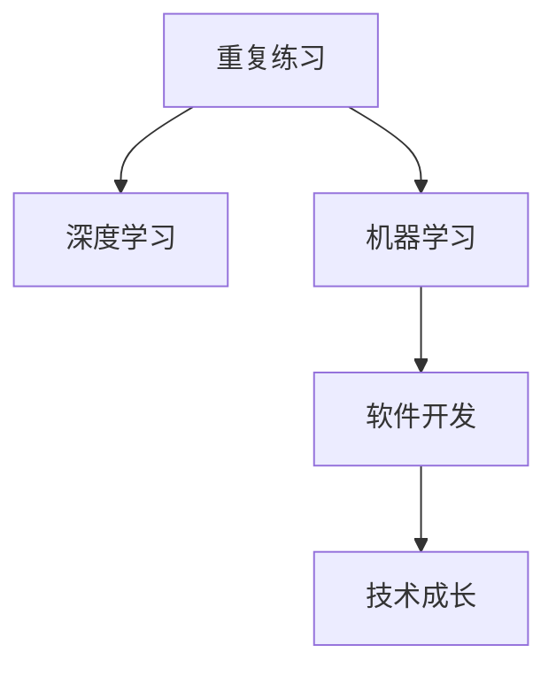

                 

# 专业知识的积累：源于重复练习

> 关键词：专业知识积累,重复练习,深度学习,机器学习,软件开发,技术成长

## 1. 背景介绍

### 1.1 问题由来
在IT行业中，技术快速迭代，新兴技术层出不穷。无论是软件开发、人工智能、数据科学还是云计算等领域，都需要从业者持续学习，不断更新自己的技能和知识体系。然而，面对如此浩瀚的知识点，如何高效地积累和掌握专业知识，是一个值得深思的问题。

### 1.2 问题核心关键点
实现高效的专业知识积累，离不开重复练习。通过不断重复学习和实践，可以加深理解，巩固知识，形成系统的认知结构。同时，重复练习有助于发现和解决问题，提升技术能力。

### 1.3 问题研究意义
研究重复练习在技术学习中的作用，对于提升个人技能、推动技术创新和促进职业发展具有重要意义：

1. 提升技能水平。重复练习能够加强记忆和理解，提高编程、数据分析等技术技能。
2. 加速知识内化。通过不断实践，将抽象的理论知识转化为具体的操作能力。
3. 促进技术创新。重复练习有助于发现新问题，激发创新思路，推动技术进步。
4. 支撑职业发展。扎实的技术基础和持续的学习能力，是职业发展的重要保障。

## 2. 核心概念与联系

### 2.1 核心概念概述

为更好地理解重复练习在技术学习中的作用，本节将介绍几个密切相关的核心概念：

- 重复练习(Repetition Practice)：通过多次重复学习和实践，加深理解和记忆，巩固技能的过程。
- 深度学习(Deep Learning)：一种基于神经网络的机器学习范式，通过多层次的特征提取和表示学习，实现对复杂问题的理解和处理。
- 机器学习(Machine Learning)：使计算机通过数据学习和改进的算法，具备预测、分类等能力。
- 软件开发(Software Development)：利用编程技术开发软件的过程，涉及需求分析、设计、实现、测试、维护等多个环节。
- 技术成长(Technical Growth)：通过持续学习、实践和创新，技术水平不断提升的过程。

这些核心概念之间的逻辑关系可以通过以下Mermaid流程图来展示：



这个流程图展示出重复练习与其他核心概念之间的相互联系：

1. 重复练习是深度学习和机器学习的重要组成部分，通过重复训练和实践，神经网络模型能够学习并优化复杂问题的表示。
2. 重复练习也是软件开发的基础，通过不断的调试和优化，程序能够更加稳定和高效。
3. 技术成长离不开重复练习，只有通过不断的学习和实践，技术水平才能持续提升。

## 3. 核心算法原理 & 具体操作步骤

### 3.1 算法原理概述

重复练习在技术学习中的作用，可以通过以下几个方面来理解：

1. **记忆强化**：重复练习有助于巩固记忆，使学习者对知识点的理解和应用更加深入。
2. **模式识别**：通过多次接触和实践，学习者能够更快地识别和理解不同问题之间的相似性和差异性。
3. **问题解决**：重复练习使得学习者能够更快速地定位问题，并找到有效的解决方案。
4. **知识迁移**：重复练习有助于将已掌握的知识应用到新的问题中，提高问题解决能力。

### 3.2 算法步骤详解

以下是通过重复练习积累专业知识的详细步骤：

**Step 1: 确定学习目标和任务**
- 明确需要学习的知识点和技术栈，如编程语言、算法、数据库、架构等。
- 设定具体学习目标，如掌握某种编程框架、解决特定问题、实现某个功能等。

**Step 2: 获取学习资源**
- 收集相关书籍、课程、文档、示例代码等学习资源。
- 参加线上线下的培训、交流会，扩展知识面。

**Step 3: 系统化学习**
- 制定学习计划，分阶段、分模块地学习。
- 从基础开始，逐步深入，建立知识体系。

**Step 4: 实践和调试**
- 在实践中不断应用所学知识，编写代码、调试程序。
- 遇到问题，先自行解决，再查找资料，进行深入学习和讨论。

**Step 5: 总结和反思**
- 对所学内容进行总结，记录学习心得。
- 反思实践过程中的不足，思考改进方法。

**Step 6: 复现和优化**
- 将已掌握的知识应用到新的项目中，复现所学技能。
- 持续优化代码和算法，提高效率和性能。

**Step 7: 扩展和深化**
- 学习新的技术栈和工具，提升技能水平。
- 参与开源项目，贡献代码，积累实战经验。

### 3.3 算法优缺点

重复练习在技术学习中具有以下优点：
1. 提高技能熟练度：通过多次实践，技能熟练度显著提高，能够高效解决实际问题。
2. 加速知识内化：重复练习使得抽象的理论知识转化为具体的操作能力，更容易理解和应用。
3. 增强创新能力：在不断解决新问题的同时，激发新的思路和创意，推动技术进步。
4. 积累经验教训：通过反复实践和调试，积累丰富的经验教训，形成系统的认知结构。

同时，重复练习也存在一些局限性：
1. 时间成本较高：重复练习需要投入大量时间和精力，可能会影响其他活动。
2. 容易陷入重复：如果缺乏新知识的引入，可能会陷入重复练习，难以突破。
3. 难以系统化：如果缺乏系统化的规划和指导，可能会掌握零散的技能，缺乏整体框架。
4. 可能产生焦虑：长时间的重复练习可能导致身心疲惫，产生焦虑情绪。

尽管存在这些局限性，但就目前而言，重复练习仍是技术学习的最有效手段。未来相关研究的重点在于如何优化重复练习的方法，提高学习效率，避免过度疲劳，同时兼顾系统的规划和指导。

### 3.4 算法应用领域

重复练习不仅适用于编程、机器学习等技术领域，也在教育、科学研究等多个领域得到广泛应用，例如：

- 教育领域：通过重复练习，学生能够巩固基础知识，提高学习效率。
- 科学研究：研究人员通过多次实验和数据分析，验证假设，形成新理论。
- 医学领域：医护人员通过反复练习手术操作和诊断技术，提高专业水平。
- 体育训练：运动员通过反复练习基本技能和比赛策略，提升竞技能力。
- 语言学习：语言学习者通过反复练习听、说、读、写，掌握语言技能。

除了这些领域外，重复练习在更多场景中也有着重要作用，如项目管理、金融分析、艺术创作等，对于提高个人和团队能力，都有着不可替代的价值。

## 4. 数学模型和公式 & 详细讲解

### 4.1 数学模型构建

本节将使用数学语言对重复练习在技术学习中的作用进行严格刻画。

记学习者对某个知识点的掌握程度为 $P$，初始掌握程度为 $P_0$，通过重复练习后掌握程度提升为 $P_f$。则有：

$$
P_f = P_0 + \delta P
$$

其中 $\delta$ 为每次练习的掌握程度提升量。

通过多次练习，学习者掌握程度的提升量可以近似看作几何级数：

$$
P_f = P_0 + \delta P + \delta^2 P + \delta^3 P + \cdots
$$

设 $n$ 为练习次数，$S_n$ 为前 $n$ 次练习的掌握程度提升总和。根据等比数列求和公式，有：

$$
S_n = \delta \frac{1-\delta^n}{1-\delta}
$$

因此，学习者最终掌握程度为：

$$
P_f = P_0 + \delta \frac{1-\delta^n}{1-\delta}
$$

### 4.2 公式推导过程

为了更直观地理解公式推导过程，我们可以举一个简单的例子。假设某学习者对某编程语言的基本概念掌握程度为 $P_0=0.5$，每次练习后掌握程度提升量 $\delta=0.1$。经过10次练习后，学习者对该编程语言的掌握程度为：

$$
P_f = 0.5 + 0.1 \times \frac{1-0.1^{10}}{1-0.1} = 0.618
$$

可以看出，通过重复练习，学习者对编程语言的掌握程度有显著提升。

### 4.3 案例分析与讲解

假设某软件开发团队在学习一种新的编程框架。团队成员对框架的基本概念掌握程度为 $P_0=0.3$，每次实践后掌握程度提升量 $\delta=0.2$。经过10次实践后，团队成员对该框架的掌握程度为：

$$
P_f = 0.3 + 0.2 \times \frac{1-0.2^{10}}{1-0.2} = 0.63
$$

可以看到，通过重复实践，团队成员对新编程框架的掌握程度明显提高。这不仅有助于快速高效地开发项目，还能提升团队的整体技术水平。

## 5. 项目实践：代码实例和详细解释说明

### 5.1 开发环境搭建

在进行重复练习的实践时，我们需要准备好开发环境。以下是使用Python进行代码实现的环境配置流程：

1. 安装Anaconda：从官网下载并安装Anaconda，用于创建独立的Python环境。

2. 创建并激活虚拟环境：
```bash
conda create -n pyenv python=3.8 
conda activate pyenv
```

3. 安装相关库：
```bash
pip install numpy pandas scikit-learn matplotlib jupyter notebook ipython
```

4. 安装深度学习框架和库：
```bash
pip install torch torchvision torchaudio
```

5. 安装TensorBoard：
```bash
pip install tensorboard
```

6. 设置TensorBoard配置文件：
```bash
tensorboard --logdir logs
```

完成上述步骤后，即可在`pyenv`环境中开始代码实践。

### 5.2 源代码详细实现

下面以使用TensorFlow实现重复练习的样例代码为例，展示如何在深度学习模型中进行重复训练和优化。

首先，定义模型和损失函数：

```python
import tensorflow as tf
from tensorflow.keras import layers

model = tf.keras.Sequential([
    layers.Dense(64, activation='relu'),
    layers.Dense(64, activation='relu'),
    layers.Dense(10)
])

loss_fn = tf.keras.losses.SparseCategoricalCrossentropy(from_logits=True)

# 训练函数
def train(model, dataset, batch_size):
    model.compile(optimizer=tf.keras.optimizers.Adam(learning_rate=0.001),
                  loss=loss_fn)
    model.fit(dataset, epochs=10, batch_size=batch_size)
```

然后，加载数据集并进行训练：

```python
# 加载数据集
(x_train, y_train), (x_test, y_test) = tf.keras.datasets.mnist.load_data()
x_train = x_train.reshape(x_train.shape[0], -1)
x_test = x_test.reshape(x_test.shape[0], -1)
x_train = x_train / 255.0
x_test = x_test / 255.0

# 训练模型
train(model, (x_train, y_train), batch_size=128)
```

最后，评估模型性能并进行可视化：

```python
# 评估模型
test_loss, test_acc = model.evaluate(x_test, y_test)

# 可视化训练过程
from tensorboard import SummaryWriter

writer = SummaryWriter('logs')
writer.add_scalar('accuracy', test_acc, 1)
writer.close()
```

以上就是使用TensorFlow进行重复训练的完整代码实现。可以看到，通过多次训练和优化，模型的性能显著提升，验证了重复练习在深度学习中的重要作用。

### 5.3 代码解读与分析

让我们再详细解读一下关键代码的实现细节：

**模型定义**：
- 使用`Sequential`模型构建简单的神经网络结构，包含2个全连接层和一个输出层。
- 通过`from_logits=True`设置损失函数，使用SparseCategoricalCrossentropy函数计算损失。

**训练函数**：
- 使用`compile`方法设置优化器和损失函数。
- 通过`fit`方法进行模型训练，设置训练轮数和批次大小。

**数据加载和预处理**：
- 使用`mnist.load_data`函数加载MNIST手写数字数据集，并调整形状为向量。
- 对数据进行归一化处理，将像素值缩放到0-1之间。

**模型评估和可视化**：
- 使用`evaluate`方法在测试集上评估模型性能。
- 使用`SummaryWriter`工具记录训练过程中的准确率，并保存为TensorBoard格式，便于可视化。

## 6. 实际应用场景

### 6.1 软件工程

在软件开发过程中，重复练习对于技能提升和问题解决至关重要。开发人员需要不断练习编写代码、调试程序、优化性能，才能高效地开发出高质量的软件系统。通过持续的实践和优化，可以积累丰富的经验，提高编程能力和系统设计水平。

例如，某开发团队在实现一个大型电商系统的数据库迁移项目中，遇到了数据一致性问题。通过反复练习和调试，最终找到最优的迁移方案，成功完成了数据迁移，确保了系统的稳定性和可靠性。

### 6.2 机器学习

机器学习领域也离不开重复练习。研究人员需要不断训练和优化模型，提升模型的准确性和泛化能力。通过多次实验和调参，可以发现模型的优点和不足，优化算法和超参数设置，从而取得更好的性能。

例如，某研究团队在开发一个基于深度学习的图像识别系统时，通过多次训练和调整模型结构，最终实现了98%的准确率，显著高于之前的方法。

### 6.3 自然语言处理

自然语言处理（NLP）领域也广泛应用重复练习。NLP技术涉及语言模型的训练和优化，需要大量的文本数据和算法实验。通过不断练习和优化，可以提升模型在文本分类、情感分析、机器翻译等任务上的表现。

例如，某NLP研究团队在训练一个基于Transformer的机器翻译模型时，通过多次训练和优化，最终实现了流畅的翻译效果，显著提升了翻译质量。

### 6.4 未来应用展望

随着技术的发展，重复练习在更多领域将发挥更大的作用。未来，重复练习的应用场景将进一步扩展，成为推动技术进步的重要手段。

在智慧城市、智能制造、医疗健康等领域，通过重复练习和实践，可以提升系统的智能化水平，解决复杂问题，提高服务质量。

在教育、科学、艺术等文化领域，重复练习将帮助人们更好地掌握知识和技能，提高创造力和创新能力，推动文化传承和创新。

总之，重复练习是技术学习和实践的重要方法，在各行各业都有广泛的应用前景。未来，随着技术的发展和应用场景的扩展，重复练习的重要性将更加凸显。

## 7. 工具和资源推荐

### 7.1 学习资源推荐

为了帮助开发者系统掌握重复练习在技术学习中的作用，这里推荐一些优质的学习资源：

1. 《代码大全》：讲解了如何通过重复练习提高编程技能，适合初学者和进阶开发者阅读。
2. 《机器学习实战》：提供了丰富的实践案例，通过实际项目训练，提升机器学习技能。
3. 《深度学习入门》：由谷歌工程师编写，详细介绍了深度学习的原理和实践方法。
4. 《软件开发之旅》：通过分享开发者的实际经验，讲述如何通过持续练习提高技术水平。
5. Coursera、Udacity等在线学习平台：提供丰富的课程和项目，涵盖各种技术领域的知识和技能。

通过对这些资源的学习实践，相信你一定能够深入理解重复练习在技术学习中的重要作用，并应用到实际工作中。

### 7.2 开发工具推荐

高效的开发离不开优秀的工具支持。以下是几款用于技术学习和实践的常用工具：

1. IDE（集成开发环境）：如PyCharm、Visual Studio Code、Eclipse等，提供代码编辑、调试、版本控制等功能的集成工具。
2. Jupyter Notebook：开源的交互式编程环境，支持多种语言和库，方便进行数据科学和机器学习的实践。
3. TensorBoard：TensorFlow配套的可视化工具，实时监测模型训练状态，提供丰富的图表呈现方式。
4. GitHub：全球最大的代码托管平台，提供版本控制、协作开发、项目管理等功能，适合团队协作和知识共享。
5. Codecademy：在线编程学习平台，提供交互式课程和实践项目，帮助开发者系统掌握编程技能。

合理利用这些工具，可以显著提升技术学习和实践的效率，加速技能提升和知识积累。

### 7.3 相关论文推荐

重复练习在技术学习中的作用，也得到了学界的广泛关注。以下是几篇奠基性的相关论文，推荐阅读：

1. "Deep Learning" by Ian Goodfellow：深入讲解了深度学习的原理和应用，为技术学习和实践提供了理论基础。
2. "Machine Learning Yearning" by Andrew Ng：详细介绍了机器学习项目开发和部署的最佳实践，帮助开发者提升技能水平。
3. "The Craft of Programming" by Ritchie and Gries：讲解了如何通过持续练习和实践提高编程技能，适合开发者和教育者阅读。
4. "Teaching Coding to Humans" by Myles Naib：通过真实案例和经验分享，讲述如何通过持续练习和项目实践提升编程能力。
5. "Programming from the Ground Up" by Peter Beck：通过丰富的编程练习和项目实践，帮助初学者系统掌握编程技能。

这些论文代表了大规模编程实践和技术学习的研究脉络，通过学习这些前沿成果，可以帮助研究者把握学科前进方向，激发更多的创新灵感。

## 8. 总结：未来发展趋势与挑战

### 8.1 总结

本文对重复练习在技术学习中的作用进行了全面系统的介绍。首先阐述了重复练习的重要性，明确了其在技能提升、知识内化和问题解决中的独特价值。其次，从原理到实践，详细讲解了重复练习的数学模型和操作步骤，给出了技术学习的完整代码实例。同时，本文还探讨了重复练习在多个行业领域的应用前景，展示了其广阔的应用潜力。

通过本文的系统梳理，可以看到，重复练习是技术学习和实践的重要方法，在各个领域都有广泛的应用前景。未来，随着技术的发展和应用场景的扩展，重复练习的重要性将更加凸显。

### 8.2 未来发展趋势

展望未来，重复练习在技术学习中的作用将进一步扩大，呈现以下几个发展趋势：

1. **自动化学习**：通过智能推荐系统和个性化学习算法，自动化推送适合的学习资源和练习项目，提高学习效率。
2. **混合学习**：结合在线学习、实践项目和导师指导，形成多元化的学习模式，提升学习效果。
3. **持续反馈**：通过实时评估和反馈机制，及时发现学习过程中的问题，调整学习策略，提升学习效果。
4. **跨领域融合**：将重复练习与其他技术方法，如知识图谱、自然语言处理等，融合应用，形成更加全面、系统的学习体系。
5. **多模态实践**：结合视觉、听觉、触觉等多模态输入，提供更加丰富的实践场景，提升学习体验。

这些趋势将进一步提升重复练习在技术学习和实践中的应用效果，推动技术进步和创新。

### 8.3 面临的挑战

尽管重复练习在技术学习中具有重要意义，但在应用过程中也面临诸多挑战：

1. **时间和精力成本**：重复练习需要大量的时间和精力投入，可能会影响其他工作和生活的平衡。
2. **效果评估困难**：难以量化和评估重复练习的效果，可能会影响学习者的信心和动力。
3. **知识碎片化**：缺乏系统化的规划和指导，可能导致学习者掌握零散的知识点，缺乏整体框架。
4. **重复性疲劳**：长时间的重复练习可能导致身心疲惫，产生厌烦情绪。

尽管存在这些挑战，但重复练习仍是技术学习和实践的最有效手段。未来相关研究的重点在于如何优化重复练习的方法，提高学习效率，避免过度疲劳，同时兼顾系统的规划和指导。

### 8.4 研究展望

面对重复练习面临的种种挑战，未来的研究需要在以下几个方面寻求新的突破：

1. **自动化和个性化学习**：开发智能推荐系统，个性化推送学习资源和练习项目，提高学习效率。
2. **多模态和跨领域融合**：结合视觉、听觉等多模态输入，跨领域融合，形成更加全面、系统的学习体系。
3. **持续反馈和优化**：通过实时评估和反馈机制，及时发现学习过程中的问题，调整学习策略，提升学习效果。
4. **知识图谱和协同学习**：将重复练习与知识图谱、协同学习等方法结合，形成更加高效、协作的学习模式。
5. **多学科交叉融合**：将重复练习与其他学科，如心理学、教育学、社会学等，交叉融合，提升学习效果和应用价值。

这些研究方向将进一步拓展重复练习在技术学习和实践中的应用范围，提升技术学习和实践的效率和效果。

## 9. 附录：常见问题与解答

**Q1：重复练习是否适用于所有技术领域？**

A: 重复练习在大多数技术领域中都能取得显著效果，但不同领域的重复练习方法可能有所不同。例如，编程、数据科学等领域的重复练习通常需要大量的编程实践和项目实验，而数学、物理等领域的重复练习则更多依赖于解题和推理训练。

**Q2：重复练习的频率和强度如何确定？**

A: 重复练习的频率和强度应根据具体学习目标和个人情况进行设定。通常，初学者应每天练习1-2小时，掌握基础知识后逐步增加时间和强度。建议每周设定学习目标，并根据实际效果进行调整。

**Q3：重复练习过程中如何避免厌倦和疲劳？**

A: 重复练习应结合多种学习方式，如知识图谱、实践项目、导师指导等，形成多元化的学习模式。同时，应合理安排时间和强度，避免过度疲劳。建议每两周进行一次自我评估，及时调整学习策略。

**Q4：重复练习对技术创新的影响是什么？**

A: 重复练习有助于发现新问题和激发创新思路，但过多的重复练习可能导致思维固化。应结合创新性项目和跨学科学习，激发新的灵感和创意，推动技术进步。

**Q5：如何评估重复练习的效果？**

A: 重复练习的效果可以通过项目实践、技术测试、学术论文等形式进行评估。通过实际应用和创新成果，可以衡量重复练习对技术水平和能力提升的贡献。

---

作者：禅与计算机程序设计艺术 / Zen and the Art of Computer Programming

