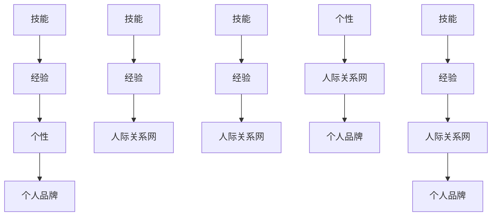

                 

# 个人品牌和人际关系网：将你与他人区分开来的诸多特征，例如技能、经验、个性等

## 1. 背景介绍

在现代社会中，个人品牌和人际关系网络在塑造职业形象、推动事业发展、拓展社交圈等方面起着至关重要的作用。一个良好的个人品牌能帮助你脱颖而出，赢得更多机会，而一个强大的人际关系网能为你提供资源、信息、支持等。本文将探讨如何构建和维护个人品牌，如何拓展和利用人际关系网，为你在职场和生活中取得成功提供策略和建议。

## 2. 核心概念与联系

### 2.1 核心概念概述

为了更好地理解个人品牌和人际关系网的构建与维护，我们首先介绍几个关键概念：

- **个人品牌**：个人品牌是指个人在社会和职业环境中所形成的独特形象和声誉。它包括你的专业技能、工作经历、教育背景、个性特质等多个方面，是你在职场和社交圈中的标识。
- **人际关系网**：人际关系网是指你与他人建立的网络关系。这些关系可以是职业上的合作者、同事、导师，也可以是社交圈中的朋友、家人。一个强大的人际关系网能为你的事业和个人成长提供坚实的基础。
- **技能**：技能是你所掌握的专业知识和技术能力。这些技能可以是编程、管理、营销、沟通等。
- **经验**：经验是你在工作和生活中积累的实践和教训。它能够帮助你更好地应对挑战，做出更明智的决策。
- **个性**：个性是指你的行为和思维习惯。积极、乐观、包容、自律等特质能帮助你建立良好的人际关系。

这些核心概念之间相互关联，共同构成了个人品牌和人际关系网的框架。技能和经验是你的基础，个性是你的核心，而品牌和网络则是这些基础在社交和职业环境中的体现。

### 2.2 核心概念原理和架构的 Mermaid 流程图

这个流程图展示了个人品牌和人际关系网构建的基本路径：
1. 从技能和经验出发，不断提升自身能力。
2. 在提升能力的同时，注重培养良好的个性特质。
3. 将技能、经验、个性融入个人品牌，形成独特的职业形象。
4. 通过提升个人品牌，拓展和维护人际关系网。

## 3. 核心算法原理 & 具体操作步骤

### 3.1 算法原理概述

个人品牌和人际关系网的构建，虽然看似复杂，但本质上可以通过一系列系统化的操作实现。这些操作包括技能提升、经验积累、个性塑造、品牌建设和网络拓展等。

#### 3.1.1 技能提升

技能提升是个人品牌和人际关系网构建的基础。技能提升的方法包括：
1. **自我学习**：利用在线课程、专业书籍、学术论文等资源，自学新知识。
2. **实践锻炼**：通过项目实践、实习、兼职等方式，将理论知识应用到实际中。
3. **反馈改进**：接受同事、导师、客户的反馈，不断改进自己的技能水平。

#### 3.1.2 经验积累

经验积累是提升个人品牌的必经之路。经验积累的方法包括：
1. **记录日志**：在工作和生活中，定期记录自己的成功和失败案例，总结经验教训。
2. **反思总结**：对每次经验进行深度反思，找出优缺点，制定改进措施。
3. **交流分享**：与他人分享自己的经验，相互学习，共同成长。

#### 3.1.3 个性塑造

个性塑造是构建良好人际关系网的关键。个性塑造的方法包括：
1. **自我认知**：通过心理学测试、性格分析等方式，了解自己的优点和不足。
2. **行为调整**：在了解自己的基础上，调整行为模式，增强与他人的契合度。
3. **情绪管理**：学会管理自己的情绪，保持积极乐观的心态。

#### 3.1.4 品牌建设

品牌建设是塑造个人独特形象的重要环节。品牌建设的方法包括：
1. **定位清晰**：明确自己的职业目标和定位，形成独特的品牌标签。
2. **内容传播**：通过博客、社交媒体、公开演讲等方式，传播自己的专业见解。
3. **一致性维护**：在不同场合保持品牌形象的一致性，增强他人对自己的信任。

#### 3.1.5 网络拓展

网络拓展是扩大人际关系网的重要手段。网络拓展的方法包括：
1. **主动接触**：主动参与行业活动、社交聚会等，结识新朋友。
2. **利益互惠**：通过提供帮助、分享资源等方式，增强与他人的合作关系。
3. **维护关系**：定期与朋友、同事、合作伙伴保持联系，维护良好的人际关系。

### 3.2 算法步骤详解

#### 3.2.1 技能提升

1. **选择学习资源**：根据职业目标，选择合适的学习资源。
2. **制定学习计划**：规划每天的学习时间和内容，确保系统的学习过程。
3. **实践应用**：将所学知识应用到实际项目中，验证学习效果。
4. **反思总结**：定期总结学习成果和不足之处，制定改进措施。

#### 3.2.2 经验积累

1. **记录日志**：利用工具记录每日工作和生活中的经验，包括任务完成情况、问题解决过程等。
2. **反思总结**：每周进行一次经验反思，找出成功经验和失败教训，总结优化建议。
3. **分享交流**：在团队会议、社交平台分享自己的经验，接受他人反馈。

#### 3.2.3 个性塑造

1. **自我测试**：使用性格分析工具，如MBTI、DISC等，了解自己的性格特点。
2. **行为训练**：根据测试结果，调整行为模式，改善与他人的互动方式。
3. **情绪管理**：学习情绪管理技巧，如冥想、深呼吸、正面思维等，保持积极乐观的心态。

#### 3.2.4 品牌建设

1. **定位目标**：明确自己的职业定位和品牌理念，制定品牌策略。
2. **内容创作**：定期在博客、社交媒体发布专业文章、技术分享，展示自己的专业能力。
3. **一致性维护**：在不同场合保持品牌形象的一致性，如统一着装、语言风格等。

#### 3.2.5 网络拓展

1. **参加活动**：积极参与行业活动、职业培训、社交聚会等，扩大人脉圈。
2. **提供帮助**：通过资源共享、技术支持等方式，帮助他人解决问题。
3. **维护关系**：定期与朋友、同事、合作伙伴保持联系，建立长久的人际关系。

### 3.3 算法优缺点

#### 3.3.1 优点

1. **系统性**：通过系统化的操作，确保技能、经验、个性、品牌、网络各方面均衡发展。
2. **科学性**：基于心理学、行为学等理论，提供科学的方法和策略。
3. **可操作性**：每一步操作都有具体的实施方法和工具，易于执行。

#### 3.3.2 缺点

1. **时间投入**：构建个人品牌和人际关系网需要大量的时间和精力。
2. **资源需求**：需要投入大量资源，如金钱、时间、人脉等。
3. **效果不易量化**：个人品牌和人际关系网的效果难以用具体指标衡量。

### 3.4 算法应用领域

个人品牌和人际关系网的构建方法，不仅适用于职业发展，也适用于生活各个方面。具体应用领域包括：

- **职场晋升**：通过提升个人品牌，拓展人际关系网，获得更多晋升机会。
- **职业转型**：通过积累新技能、拓展新关系网，顺利实现职业转型。
- **社交拓展**：通过塑造良好个性、建立良好品牌，扩大社交圈。
- **生活改善**：通过提升自我、拓展网络，提升生活质量和幸福感。

## 4. 数学模型和公式 & 详细讲解 & 举例说明

### 4.1 数学模型构建

个人品牌和人际关系网的构建，虽然不涉及复杂的数学模型，但可以通过数学方法进行定量和定性的分析。例如，我们可以用数学模型来分析人际网络的结构、强弱关系分布等。

#### 4.1.1 网络结构模型

人际网络可以表示为一个图，其中节点代表个人，边代表两人之间的关系。可以用以下数学模型来描述人际网络的结构：

$$ G = (V, E) $$

其中 $V$ 为节点集合，$E$ 为边集合。边的权重可以表示两人关系的紧密程度。

#### 4.1.2 强弱关系分布模型

强弱关系分布可以通过度分布、聚集系数等指标来描述。度分布表示每个节点的连接数量，聚集系数表示节点的连接紧密程度。

#### 4.1.3 网络分析工具

可以使用一些网络分析工具，如Gephi、NetMiner等，进行网络结构的可视化和分析。

### 4.2 公式推导过程

#### 4.2.1 网络结构模型推导

1. **节点和边的定义**：
   - 节点：表示个人，用 $v_i$ 表示，$i=1,2,\cdots,n$。
   - 边：表示两人之间的关系，用 $e_{ij}$ 表示，$(i,j)\in E$。

2. **网络结构表示**：
   - 图 $G$ 可以表示为：
     - $V=\{v_1,v_2,\cdots,v_n\}$
     - $E=\{e_{ij}\}$

#### 4.2.2 强弱关系分布模型推导

1. **度分布**：
   - 节点 $v_i$ 的度数为 $d_i$，表示与 $v_i$ 连接的边数。
   - 度分布 $P(k)$ 表示节点度数为 $k$ 的分布概率。

2. **聚集系数**：
   - 聚集系数 $C_i$ 表示节点 $v_i$ 的聚集程度。
   - 聚集系数可以通过以下公式计算：
     - $C_i = \frac{2|\Gamma(i)|}{d_i(d_i-1)}$
     - $\Gamma(i)$ 为与 $v_i$ 直接连接的节点集合。

### 4.3 案例分析与讲解

#### 4.3.1 网络结构模型案例

假设某公司的员工构成了一个人际网络，可以用以下公式表示：

$$ G = (V, E) $$

其中 $V=\{v_1,v_2,\cdots,v_n\}$ 表示员工集合，$E=\{e_{ij}\}$ 表示员工之间的关系。

#### 4.3.2 强弱关系分布模型案例

假设某公司的员工之间的强弱关系分布如下：

- 度分布：$P(k)=\frac{1}{n}$
- 聚集系数：$C_i=\frac{1}{2}(n-1)$

通过以上数学模型和公式，我们可以对人际网络的结构和强弱关系分布进行分析和优化。

## 5. 项目实践：代码实例和详细解释说明

### 5.1 开发环境搭建

在实践个人品牌和人际关系网的构建过程中，我们需要使用一些工具和平台，如GitHub、LinkedIn、Twitter等。以下是一些常用的开发环境搭建步骤：

1. **GitHub账号创建**：注册GitHub账号，上传个人项目和代码。
2. **LinkedIn账号创建**：注册LinkedIn账号，完善个人简历和经历，拓展职业网络。
3. **Twitter账号创建**：注册Twitter账号，发布专业文章，与行业专家交流。

### 5.2 源代码详细实现

#### 5.2.1 GitHub账号管理

1. **创建仓库**：在GitHub上创建一个新仓库，上传个人项目代码。
2. **提交代码**：定期提交代码更新，记录项目进展和改进。
3. **发布文章**：在GitHub上发布专业文章，展示技术能力。

#### 5.2.2 LinkedIn账号管理

1. **完善简历**：在LinkedIn上完善个人简历，包括教育背景、工作经历、技能证书等。
2. **发布动态**：定期发布专业动态，分享工作成果和行业见解。
3. **拓展人脉**：主动添加行业专家、同事、校友等人脉。

#### 5.2.3 Twitter账号管理

1. **关注专家**：关注行业专家、知名企业、学术机构等。
2. **发布文章**：定期发布专业文章，分享技术见解和行业趋势。
3. **互动交流**：积极参与话题讨论，与行业专家交流互动。

### 5.3 代码解读与分析

#### 5.3.1 GitHub代码管理

1. **版本控制**：使用Git版本控制工具，记录代码的更新历史。
2. **分支管理**：使用分支管理策略，如Git Flow，确保代码的稳定和可控。
3. **代码质量**：使用代码质量工具，如SonarQube，确保代码的可读性和可维护性。

#### 5.3.2 LinkedIn账号管理

1. **动态更新**：定期更新LinkedIn动态，分享工作成果和行业见解。
2. **人脉拓展**：通过LinkedIn的活动和群组，结识行业专家和潜在合作伙伴。
3. **互动交流**：与行业专家互动交流，提升自身影响力。

#### 5.3.3 Twitter账号管理

1. **发布文章**：定期发布专业文章，展示技术能力和行业见解。
2. **互动交流**：参与行业话题讨论，与行业专家互动交流。
3. **关注动态**：关注行业动态和专家文章，了解最新趋势。

### 5.4 运行结果展示

#### 5.4.1 GitHub项目展示

1. **代码质量**：通过GitHub的质量工具，确保代码的可读性和可维护性。
2. **项目管理**：使用GitHub的项目管理工具，记录项目进展和改进。
3. **社区互动**：通过GitHub的社区功能，与行业专家和社区成员互动交流。

#### 5.4.2 LinkedIn人脉展示

1. **人脉拓展**：通过LinkedIn的人脉管理工具，结识行业专家和潜在合作伙伴。
2. **动态展示**：通过LinkedIn的动态展示功能，分享工作成果和行业见解。
3. **互动交流**：与行业专家互动交流，提升自身影响力。

#### 5.4.3 Twitter文章展示

1. **文章发布**：通过Twitter的文章发布功能，展示技术能力和行业见解。
2. **话题讨论**：参与行业话题讨论，与行业专家互动交流。
3. **关注动态**：关注行业动态和专家文章，了解最新趋势。

## 6. 实际应用场景

### 6.1 职场晋升

在职场中，良好的个人品牌和人际关系网可以帮助你获得更多晋升机会。具体应用场景如下：

1. **项目展示**：通过GitHub展示项目代码和成果，获得项目领导和同事的认可。
2. **动态分享**：在LinkedIn上分享工作动态和成果，展示个人能力和价值。
3. **专家交流**：在Twitter上与行业专家互动交流，获取更多职业机会和建议。

### 6.2 职业转型

职业转型过程中，个人品牌和人际关系网的作用尤为关键。具体应用场景如下：

1. **项目展示**：通过GitHub展示转型项目代码和成果，展示新技能和能力。
2. **人脉拓展**：通过LinkedIn拓展新行业的人脉，结识行业专家和潜在合作伙伴。
3. **专家交流**：在Twitter上与新行业专家互动交流，获取更多职业机会和建议。

### 6.3 社交拓展

在社交中，良好的个人品牌和人际关系网可以扩大社交圈，提升生活质量和幸福感。具体应用场景如下：

1. **动态分享**：通过LinkedIn和Twitter分享生活动态和成果，展示个人魅力和价值。
2. **人脉拓展**：通过LinkedIn和Twitter拓展新社交圈，结识更多朋友和家人。
3. **互动交流**：与朋友和家人互动交流，提升社交关系和幸福感。

### 6.4 未来应用展望

未来，随着技术的不断进步，个人品牌和人际关系网的构建将更加智能化和自动化。以下是一些未来应用展望：

1. **智能推荐**：通过AI算法，推荐最适合你的学习和交流机会，提升个人成长效率。
2. **自动化管理**：通过AI工具，自动化管理你的个人品牌和人际关系网，节省时间和精力。
3. **跨领域协作**：通过AI平台，实现跨领域、跨行业的协作和资源共享，提升工作效率和质量。

## 7. 工具和资源推荐

### 7.1 学习资源推荐

1. **LinkedIn Learning**：提供职业发展和技能提升的在线课程，涵盖职业规划、职场沟通、数据分析等多个领域。
2. **Coursera**：提供世界顶尖大学的在线课程，涵盖计算机科学、数据科学、商业管理等多个专业领域。
3. **TED Talks**：通过TED Talks分享行业专家和学者的见解和经验，提升自身认知水平。

### 7.2 开发工具推荐

1. **GitHub**：提供版本控制、代码托管、社区互动等功能，是个人项目管理和代码分享的首选平台。
2. **LinkedIn**：提供职业发展、人脉管理、动态分享等功能，是拓展职业网络和展示个人成果的重要工具。
3. **Twitter**：提供文章发布、话题讨论、关注动态等功能，是展示技术能力和行业见解的平台。

### 7.3 相关论文推荐

1. **《网络科学：原理、算法与应用》**：由Katherine E. Habel、Catherine R. McPherson、Jean-François Moissis等学者共同编写，全面介绍了网络科学的理论和应用。
2. **《关系网：缔结关系、培养社群、扩展人脉》**：由Severin Borenstein、Bettina A. M.(编辑)编写，提供了拓展人脉的策略和建议。
3. **《自组织网络》**：由Stephen P. Lorimer、Mark R. Net、Yuriy B. Venkova等学者共同编写，介绍了网络结构的自组织行为和演化规律。

## 8. 总结：未来发展趋势与挑战

### 8.1 研究成果总结

个人品牌和人际关系网的构建，是职业发展和社交拓展的重要手段。通过系统化的操作，可以提升自身能力、拓展人脉网络、塑造独特形象。然而，这一过程也面临着资源投入、效果量化等方面的挑战。

### 8.2 未来发展趋势

1. **智能化管理**：未来，个人品牌和人际关系网的管理将更加智能化和自动化。
2. **跨领域协作**：随着AI技术的发展，跨领域、跨行业的协作将更加便捷和高效。
3. **全球化拓展**：通过全球化平台和工具，拓展更多国际人脉，提升全球竞争力。

### 8.3 面临的挑战

1. **时间投入**：构建个人品牌和人际关系网需要大量时间和精力，如何平衡工作和生活成为挑战。
2. **资源需求**：需要投入大量资源，如金钱、时间、人脉等，如何高效利用成为挑战。
3. **效果量化**：个人品牌和人际关系网的效果难以用具体指标衡量，如何评估其价值成为挑战。

### 8.4 研究展望

未来，如何在AI和数据分析的加持下，提升个人品牌和人际关系网的构建效率，将是重要的研究方向。同时，如何利用技术手段，优化资源利用，提升效果评估，也将是值得探索的方向。

## 9. 附录：常见问题与解答

### Q1: 如何打造一个强大的个人品牌？

A: 打造一个强大的个人品牌，需要从以下几个方面入手：
1. **明确目标**：明确自己的职业目标和定位，形成独特的品牌理念。
2. **展示成果**：通过博客、社交媒体、公开演讲等方式，展示自己的专业能力和成果。
3. **保持一致性**：在不同场合保持品牌形象的一致性，如统一着装、语言风格等。

### Q2: 如何在社交网络中拓展人脉？

A: 在社交网络中拓展人脉，需要主动接触、提供帮助、维护关系等。具体策略如下：
1. **主动接触**：积极参加行业活动、职业培训、社交聚会等，结识新朋友。
2. **提供帮助**：通过资源共享、技术支持等方式，帮助他人解决问题。
3. **维护关系**：定期与朋友、同事、合作伙伴保持联系，建立长久的人际关系。

### Q3: 如何在职场中提升个人品牌？

A: 在职场中提升个人品牌，需要从技能提升、经验积累、个性塑造等多个方面入手：
1. **技能提升**：通过自我学习、实践锻炼、反馈改进等方式，不断提升自身能力。
2. **经验积累**：通过记录日志、反思总结、分享交流等方式，积累工作经验。
3. **个性塑造**：通过自我测试、行为训练、情绪管理等方式，培养良好的个性特质。

### Q4: 如何通过GitHub展示个人项目？

A: 通过GitHub展示个人项目，需要从代码质量、项目管理、社区互动等多个方面入手：
1. **代码质量**：使用Git版本控制工具，确保代码的可读性和可维护性。
2. **项目管理**：使用GitHub的项目管理工具，记录项目进展和改进。
3. **社区互动**：通过GitHub的社区功能，与行业专家和社区成员互动交流。

### Q5: 如何通过LinkedIn展示个人品牌？

A: 通过LinkedIn展示个人品牌，需要从完善简历、发布动态、拓展人脉等多个方面入手：
1. **完善简历**：在LinkedIn上完善个人简历，包括教育背景、工作经历、技能证书等。
2. **发布动态**：定期发布专业动态，分享工作成果和行业见解。
3. **拓展人脉**：通过LinkedIn的活动和群组，结识行业专家和潜在合作伙伴。

### Q6: 如何通过Twitter展示个人品牌？

A: 通过Twitter展示个人品牌，需要从发布文章、互动交流、关注动态等多个方面入手：
1. **发布文章**：定期发布专业文章，展示技术能力和行业见解。
2. **互动交流**：参与行业话题讨论，与行业专家互动交流。
3. **关注动态**：关注行业动态和专家文章，了解最新趋势。

---

作者：禅与计算机程序设计艺术 / Zen and the Art of Computer Programming

