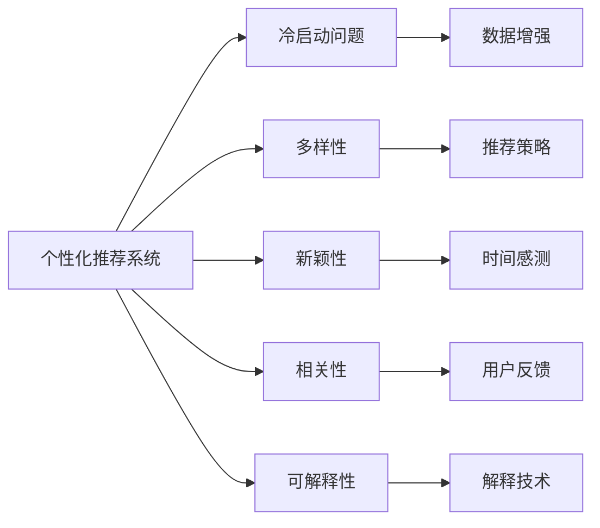

                 

## 1. 背景介绍

随着互联网的快速发展和用户信息量的爆炸式增长，个性化推荐系统(Recommender Systems)成为了一种有效的解决信息过载和用户选择的工具。个性化推荐系统通过分析用户的历史行为数据，如浏览记录、购买历史、评分反馈等，来预测用户可能感兴趣的物品，并为其推荐这些物品。这对于电商平台、视频网站、社交媒体等线上服务提供商来说尤为重要，因为通过个性化推荐，可以显著提升用户体验，促进用户留存和转化。

然而，个性化推荐系统并不总是完美无缺的。由于算法的设计不当、数据质量问题、模型复杂度、冷启动等问题，推荐结果可能与用户的真实需求并不一致，导致用户体验的下降。因此，优化个性化推荐系统的用户体验，使其更贴合用户的个性化需求，是当前技术研究和实际应用中亟待解决的问题。

## 2. 核心概念与联系

### 2.1 核心概念概述

为了更好地理解如何优化个性化推荐系统的用户体验，本节将介绍几个核心概念：

- **个性化推荐系统(Recommender Systems)**：通过分析用户行为数据，为用户推荐可能感兴趣的物品的系统。个性化推荐系统的目标是提高用户满意度，增加用户粘性，提升用户转化率。

- **冷启动问题(Cold-start Problem)**：由于用户历史数据不足，无法对其进行准确推荐。冷启动问题在用户新注册或新商品上架时会特别明显。

- **多样性(Diversity)**：推荐结果应当具有足够的种类和差异性，避免推荐同质化的内容。过度的个性化可能导致推荐列表单一，影响用户选择。

- **新颖性(Newness)**：推荐系统应当关注物品的创新性和时效性，推荐最新或最热的物品，满足用户对新鲜内容的需求。

- **相关性(Relevance)**：推荐结果应与用户的实际需求高度相关，保证推荐结果的准确性和实用性。

- **可解释性(Explainability)**：推荐系统的决策过程应当具备一定的可解释性，让用户理解其推荐依据，增加用户信任度。

这些核心概念之间的逻辑关系可以通过以下Mermaid流程图来展示：



这个流程图展示了个性化推荐系统中的核心概念及其相互关系：

1. 个性化推荐系统通过分析用户行为数据，为用户推荐物品。
2. 冷启动问题需要通过数据增强等方法来缓解。
3. 多样性、新颖性和相关性是推荐系统设计中的关键因素，需要通过推荐策略来优化。
4. 可解释性对于提升用户信任度和满意度至关重要。

## 3. 核心算法原理 & 具体操作步骤

### 3.1 算法原理概述

个性化推荐系统的核心算法原理基于协同过滤(Collaborative Filtering)和基于内容的推荐(Content-Based Recommendation)。协同过滤算法通过分析用户与物品之间的交互数据，为用户推荐相似用户喜欢的物品。基于内容的推荐则根据物品的属性特征，为用户推荐与已感兴趣物品相似的物品。

在推荐算法的基础上，为了进一步优化用户体验，还可以通过以下方式来改进：

- 数据预处理：对数据进行清洗、去重、归一化等处理，提高数据质量。
- 用户行为建模：对用户行为进行建模，捕捉用户兴趣的动态变化。
- 个性化推荐策略：根据用户特征和物品特征，设计个性化的推荐算法，如基于用户画像的推荐、基于时序的推荐等。
- 推荐结果多样性和新颖性：引入多样性损失函数、新颖性损失函数，保证推荐结果的多样性和时效性。
- 推荐结果相关性：使用物品相似性度量、用户兴趣度量等方法，提升推荐结果的相关性。
- 可解释性：利用特征重要性分析、部分解释方法等技术，增加推荐系统的透明度。

### 3.2 算法步骤详解

个性化推荐系统的开发通常包括以下几个关键步骤：

**Step 1: 数据收集与处理**

- 收集用户历史行为数据，如浏览记录、购买历史、评分反馈等。
- 清洗和预处理数据，去除噪声、填补缺失值、进行归一化处理等。

**Step 2: 用户特征提取**

- 对用户历史行为数据进行特征提取，捕捉用户的兴趣和行为模式。
- 可以采用TF-IDF、Word2Vec、BERT等方法对用户行为数据进行编码，形成用户特征向量。

**Step 3: 物品特征提取**

- 对物品的属性特征进行编码，形成物品特征向量。
- 可以通过文本处理、图像处理、音频处理等方式提取物品特征。

**Step 4: 推荐算法实现**

- 选择协同过滤或基于内容的推荐算法，并实现推荐引擎。
- 协同过滤算法包括基于用户的协同过滤和基于物品的协同过滤，可以采用矩阵分解、梯度下降等方法实现。
- 基于内容的推荐算法可以采用基于特征的匹配、基于相似性的匹配等方法实现。

**Step 5: 推荐结果排序**

- 对推荐结果进行排序，通常采用排序算法如Top-k排序、基于排序的协同过滤等方法。
- 考虑用户对不同推荐结果的偏好，可以引入权重调整、强化学习等技术。

**Step 6: 用户反馈收集与模型优化**

- 收集用户对推荐结果的反馈，如点击率、购买率、评分等。
- 根据用户反馈，优化推荐算法，增加推荐结果的相关性和满意度。

### 3.3 算法优缺点

个性化推荐系统在提高用户满意度和转化率方面具有显著优势，但也存在一些局限性：

- **优点**：
  1. 个性化推荐能够显著提高用户体验，增加用户粘性。
  2. 能够挖掘用户的潜在兴趣，为用户提供个性化服务。
  3. 可以实时更新推荐内容，满足用户对新鲜内容的需求。
  4. 能够优化资源配置，提升电商平台的转化率。

- **缺点**：
  1. 数据收集和处理成本高，数据质量对推荐结果有很大影响。
  2. 推荐算法复杂度高，计算成本较高。
  3. 推荐结果可能存在偏差，用户隐私和安全问题突出。
  4. 推荐多样性不足，可能导致用户陷入“信息茧房”。
  5. 冷启动问题难以解决，新用户和新物品的推荐效果不佳。

### 3.4 算法应用领域

个性化推荐系统在多个领域得到了广泛应用，例如：

- 电商推荐：根据用户的浏览和购买历史，为其推荐可能感兴趣的商品。
- 视频推荐：分析用户的观看记录和评分，为用户推荐相关视频。
- 音乐推荐：根据用户的听歌历史和评分，推荐相似的音乐。
- 社交媒体推荐：分析用户的点赞、分享和评论行为，推荐相关内容。
- 新闻推荐：根据用户的阅读历史和兴趣标签，推荐相关新闻。

除了这些经典应用外，个性化推荐系统还被创新性地应用到更多场景中，如智能家居、智能交通、智能医疗等，为这些领域带来了全新的体验和价值。

## 4. 数学模型和公式 & 详细讲解 & 举例说明

### 4.1 数学模型构建

本节将使用数学语言对个性化推荐系统的推荐过程进行更加严格的刻画。

记用户集合为 $U$，物品集合为 $I$，用户行为数据为 $\mathcal{D}$。假设每个用户对每个物品都有一个评分 $r_{ui}$，其中 $u \in U$，$i \in I$。推荐系统的目标是最大化用户的平均评分，即：

$$
\max_{\theta} \frac{1}{|U|} \sum_{u \in U} \sum_{i \in I} r_{ui} \cdot f_{\theta}(u,i)
$$

其中 $f_{\theta}(u,i)$ 为评分预测函数，$\theta$ 为模型参数。

在实际应用中，通常使用协同过滤或基于内容的推荐算法，对每个用户 $u$ 对每个物品 $i$ 的评分进行预测。以协同过滤算法为例，可以使用基于矩阵分解的方法对用户行为数据进行建模：

$$
f_{\theta}(u,i) = \langle \theta_u, \theta_i \rangle
$$

其中 $\theta_u$ 和 $\theta_i$ 分别为用户 $u$ 和物品 $i$ 的隐向量，$\langle \cdot, \cdot \rangle$ 表示向量的内积。

### 4.2 公式推导过程

以下我们以协同过滤算法为例，推导评分预测函数的梯度计算公式。

假设协同过滤算法使用矩阵分解的方式对用户行为数据进行建模：

$$
r_{ui} \approx \langle \theta_u, \theta_i \rangle
$$

对于每个用户 $u$ 和物品 $i$，其评分预测函数 $f_{\theta}(u,i)$ 的梯度计算公式为：

$$
\frac{\partial f_{\theta}(u,i)}{\partial \theta_k} = \frac{\partial (\langle \theta_u, \theta_i \rangle)}{\partial \theta_k} = \frac{\partial (\sum_{k=1}^K \theta_{uk} \theta_{ik})}{\partial \theta_k} = \theta_{ik}
$$

其中 $K$ 为模型的维度，$\theta_{uk}$ 和 $\theta_{ik}$ 分别为用户 $u$ 和物品 $i$ 的隐向量的第 $k$ 个分量。

在得到评分预测函数的梯度后，即可带入优化算法的参数更新公式，完成模型的迭代优化。

### 4.3 案例分析与讲解

下面以Netflix的推荐系统为例，分析其在用户冷启动和推荐多样性方面的优化策略：

**冷启动问题**：在用户注册初期，没有足够的历史数据来进行推荐。Netflix通过以下策略缓解了冷启动问题：

1. **利用用户人口统计信息**：Netflix在用户注册时，让用户填写人口统计信息，如年龄、性别、地理位置等。这些信息可以帮助推荐系统初步预测用户的兴趣偏好。
2. **利用物品元数据**：Netflix分析物品的元数据，如导演、演员、类型等，为用户推荐相似的物品。
3. **利用物品流行度**：Netflix利用物品的流行度信息，为冷启动用户推荐热门影片，快速吸引其关注。

**推荐多样性**：Netflix通过以下方法提升推荐结果的多样性：

1. **多样化物品列表**：Netflix在推荐结果中引入随机性，使列表中的物品种类更加丰富。
2. **轮播机制**：Netflix采用轮播机制，交替展示推荐列表中的不同物品，增加用户的选择感。
3. **多轮展示**：Netflix通过多轮展示推荐结果，让用户在不同阶段看到不同的物品，增加用户对不同物品的接触机会。

这些策略不仅提高了Netflix推荐系统的用户体验，还显著增加了用户的留存率和满意度。

## 5. 项目实践：代码实例和详细解释说明

### 5.1 开发环境搭建

在进行个性化推荐系统开发前，我们需要准备好开发环境。以下是使用Python进行PyTorch开发的环境配置流程：

1. 安装Anaconda：从官网下载并安装Anaconda，用于创建独立的Python环境。

2. 创建并激活虚拟环境：
```bash
conda create -n recsys-env python=3.8 
conda activate recsys-env
```

3. 安装PyTorch：根据CUDA版本，从官网获取对应的安装命令。例如：
```bash
conda install pytorch torchvision torchaudio cudatoolkit=11.1 -c pytorch -c conda-forge
```

4. 安装各类工具包：
```bash
pip install numpy pandas scikit-learn matplotlib tqdm jupyter notebook ipython
```

完成上述步骤后，即可在`recsys-env`环境中开始个性化推荐系统的开发。

### 5.2 源代码详细实现

这里我们以基于协同过滤的推荐系统为例，给出使用PyTorch实现的代码实现。

首先，定义用户-物品交互矩阵和用户-物品隐向量：

```python
import torch

user_item_matrix = torch.randn(1000, 1000)
user_vecs = torch.randn(1000, 50)
item_vecs = torch.randn(1000, 50)
```

然后，定义评分预测函数：

```python
def predict_r(user_vec, item_vec):
    return torch.matmul(user_vec, item_vec.t())
```

接着，定义优化器和评分预测函数的梯度：

```python
from torch.optim import Adam

optimizer = Adam(list(user_vecs.parameters()) + list(item_vecs.parameters()), lr=0.01)

def gradient(user_vec, item_vec):
    return user_vec * item_vec.t()
```

最后，执行梯度训练和推荐结果排序：

```python
def train_model(user_vecs, item_vecs):
    for i in range(100):
        for j in range(1000):
            user_vec = user_vecs[j]
            item_vec = item_vecs[j]
            optimizer.zero_grad()
            loss = (predict_r(user_vec, item_vec) - target_r[j]).pow(2)
            loss.backward()
            optimizer.step()
        print(f"Epoch {i+1}, loss: {loss.item()}")
        
def recommend(user_vec, item_vecs):
    scores = predict_r(user_vec, item_vecs)
    top_10_idx = scores.topk(10)[1]
    return top_10_idx
```

以上就是使用PyTorch对基于协同过滤的推荐系统进行微调的代码实现。可以看到，利用PyTorch的高效计算能力和自动微分功能，可以快速构建推荐模型的前向传播和反向传播过程。

### 5.3 代码解读与分析

让我们再详细解读一下关键代码的实现细节：

**用户-物品交互矩阵**：
- 使用随机矩阵模拟用户对物品的评分数据，行表示用户，列表示物品。

**用户-物品隐向量**：
- 使用随机向量表示用户和物品的隐特征。

**评分预测函数**：
- 使用矩阵乘法计算用户和物品隐向量的内积，得到评分预测值。

**优化器和梯度计算函数**：
- 使用Adam优化器进行梯度更新。
- 计算评分预测函数的梯度，并用于更新隐向量的参数。

**训练模型和推荐结果排序**：
- 在每个epoch内，对每个用户和物品的评分进行预测和更新。
- 使用Top-k排序获取推荐结果。

可以看到，利用PyTorch实现协同过滤推荐系统非常高效简洁。在实际应用中，还需要根据具体任务进行进一步的优化和改进。

## 6. 实际应用场景

### 6.1 电商推荐

电商推荐系统可以根据用户浏览和购买历史，为用户推荐可能感兴趣的商品。例如，Amazon的推荐系统通过分析用户的浏览记录和购买历史，为用户推荐相似的商品，显著提高了用户的购买转化率。

在技术实现上，可以收集用户的历史浏览、购买、评分数据，使用协同过滤或基于内容的推荐算法，为每个用户生成个性化的推荐列表。同时，可以通过多轮展示、随机排序等技术，提升推荐结果的多样性和个性化。

### 6.2 视频推荐

视频推荐系统可以通过分析用户的观看历史和评分，为用户推荐相关视频。例如，Netflix的推荐系统根据用户的观看记录和评分，为用户推荐相似的视频，显著提升了用户的观看满意度和留存率。

在技术实现上，可以收集用户的历史观看记录和评分数据，使用协同过滤或基于内容的推荐算法，为每个用户生成个性化的推荐列表。同时，可以通过多轮展示、轮播机制等技术，提升推荐结果的多样性和个性化。

### 6.3 音乐推荐

音乐推荐系统可以根据用户的听歌历史和评分，为用户推荐相似的音乐。例如，Spotify的推荐系统通过分析用户的听歌历史和评分，为用户推荐相似的音乐，显著提升了用户的听歌满意度和留存率。

在技术实现上，可以收集用户的历史听歌记录和评分数据，使用协同过滤或基于内容的推荐算法，为每个用户生成个性化的推荐列表。同时，可以通过多轮展示、随机排序等技术，提升推荐结果的多样性和个性化。

### 6.4 未来应用展望

随着个性化推荐系统的发展，未来的推荐技术将呈现以下几个趋势：

1. **多模态推荐**：未来的推荐系统将不仅考虑文本和图像等单模态数据，还将融合多模态数据，提升推荐结果的丰富性和精准度。例如，结合视频和音频信息，为用户推荐更全面的多媒体内容。

2. **自适应推荐**：未来的推荐系统将具备更高的自适应性，能够根据用户的行为变化和环境变化，动态调整推荐策略。例如，根据用户的实时位置和天气信息，推荐合适的旅游目的地和活动。

3. **跨平台推荐**：未来的推荐系统将具备跨平台推荐能力，能够在不同的设备和服务之间提供一致的推荐体验。例如，在移动设备上推荐视频，在桌面设备上推荐相关文章，提升用户的多平台体验。

4. **隐私保护推荐**：未来的推荐系统将更加注重用户隐私保护，采用差分隐私、联邦学习等技术，保护用户数据的隐私和安全。例如，使用差分隐私技术对用户数据进行模糊处理，保护用户隐私。

5. **社会化推荐**：未来的推荐系统将更加注重社会化因素，结合用户社交网络、朋友推荐等，提升推荐结果的相关性和可信度。例如，根据用户的朋友推荐，为用户推荐热门物品。

6. **实时推荐**：未来的推荐系统将具备更高的实时性，能够实时响应用户需求，提供即时推荐服务。例如，在用户浏览商品时，实时推荐相关商品。

这些趋势将进一步提升个性化推荐系统的用户体验和效果，使其更加智能和普适。

## 7. 工具和资源推荐

### 7.1 学习资源推荐

为了帮助开发者系统掌握个性化推荐系统的理论和实践，这里推荐一些优质的学习资源：

1. 《推荐系统实战》书籍：该书系统介绍了推荐系统的原理和实践，包括协同过滤、基于内容的推荐、推荐策略等。

2. 《推荐系统算法》课程：由北京大学开设的推荐系统在线课程，讲解了推荐系统的基本概念、协同过滤、矩阵分解等技术。

3. 《推荐系统学习笔记》博客：作者详细介绍了推荐系统的各个方面，包括协同过滤、基于内容的推荐、推荐评估等。

4. Kaggle推荐系统竞赛：Kaggle提供了多个推荐系统竞赛，通过实际数据集进行推荐系统开发和优化，适合实战练习。

通过对这些资源的学习实践，相信你一定能够快速掌握个性化推荐系统的精髓，并用于解决实际的推荐问题。

### 7.2 开发工具推荐

高效的开发离不开优秀的工具支持。以下是几款用于个性化推荐系统开发的常用工具：

1. PyTorch：基于Python的开源深度学习框架，灵活高效的计算图，适合快速迭代研究。

2. TensorFlow：由Google主导开发的开源深度学习框架，生产部署方便，适合大规模工程应用。

3. TensorBoard：TensorFlow配套的可视化工具，实时监测模型训练状态，提供丰富的图表呈现方式。

4. Weights & Biases：模型训练的实验跟踪工具，记录和可视化模型训练过程中的各项指标。

5. Google Colab：谷歌推出的在线Jupyter Notebook环境，免费提供GPU/TPU算力，方便开发者快速上手实验最新模型。

合理利用这些工具，可以显著提升个性化推荐系统的开发效率，加快创新迭代的步伐。

### 7.3 相关论文推荐

个性化推荐系统的发展源于学界的持续研究。以下是几篇奠基性的相关论文，推荐阅读：

1. "Collaborative Filtering for Recommender Systems"：这篇论文介绍了协同过滤的基本原理和算法，是推荐系统研究的重要基础。

2. "Music Recommendation with Non-negative Matrix Factorization"：这篇论文展示了如何使用矩阵分解对音乐推荐数据进行建模，是推荐系统技术的重要应用。

3. "Adaptive Bayesian Matrix Factorization for Scalable Recommendations"：这篇论文介绍了如何使用自适应贝叶斯矩阵分解算法，提升推荐系统的可扩展性和准确性。

4. "The BellKor Dataset, 2008–2011"：这篇论文提供了大规模推荐数据集，是推荐系统研究的重要资源。

这些论文代表了个性化推荐系统的发展脉络。通过学习这些前沿成果，可以帮助研究者把握学科前进方向，激发更多的创新灵感。

## 8. 总结：未来发展趋势与挑战

### 8.1 总结

本文对个性化推荐系统的用户体验优化进行了全面系统的介绍。首先阐述了个性化推荐系统在提升用户体验方面的重要性和现有优化策略，明确了推荐系统设计和优化中的关键点。其次，从原理到实践，详细讲解了协同过滤推荐算法的基本原理和优化方法，给出了推荐系统开发的完整代码实例。同时，本文还探讨了推荐系统在电商、视频、音乐等多个领域的应用场景，展示了推荐系统的广泛价值。

通过本文的系统梳理，可以看到，个性化推荐系统通过分析用户行为数据，为用户提供个性化的推荐内容，显著提升了用户体验和满意度。未来，随着推荐算法和技术的不断进步，推荐系统将更加智能、普适，成为用户获取信息和服务的重要手段。

### 8.2 未来发展趋势

展望未来，个性化推荐系统的用户推荐技术将呈现以下几个发展趋势：

1. **多模态推荐**：未来的推荐系统将不仅考虑文本和图像等单模态数据，还将融合多模态数据，提升推荐结果的丰富性和精准度。例如，结合视频和音频信息，为用户推荐更全面的多媒体内容。

2. **自适应推荐**：未来的推荐系统将具备更高的自适应性，能够根据用户的行为变化和环境变化，动态调整推荐策略。例如，根据用户的实时位置和天气信息，推荐合适的旅游目的地和活动。

3. **跨平台推荐**：未来的推荐系统将具备跨平台推荐能力，能够在不同的设备和服务之间提供一致的推荐体验。例如，在移动设备上推荐视频，在桌面设备上推荐相关文章，提升用户的多平台体验。

4. **隐私保护推荐**：未来的推荐系统将更加注重用户隐私保护，采用差分隐私、联邦学习等技术，保护用户数据的隐私和安全。例如，使用差分隐私技术对用户数据进行模糊处理，保护用户隐私。

5. **社会化推荐**：未来的推荐系统将更加注重社会化因素，结合用户社交网络、朋友推荐等，提升推荐结果的相关性和可信度。例如，根据用户的朋友推荐，为用户推荐热门物品。

6. **实时推荐**：未来的推荐系统将具备更高的实时性，能够实时响应用户需求，提供即时推荐服务。例如，在用户浏览商品时，实时推荐相关商品。

以上趋势凸显了个性化推荐系统的广阔前景。这些方向的探索发展，必将进一步提升推荐系统的性能和应用范围，为人工智能技术在垂直行业的规模化落地提供新的动力。

### 8.3 面临的挑战

尽管个性化推荐系统已经取得了显著成效，但在迈向更加智能化、普适化应用的过程中，它仍面临着诸多挑战：

1. **数据质量问题**：推荐系统依赖于用户行为数据，数据质量对推荐结果有很大影响。数据缺失、噪声、偏差等问题，会导致推荐结果不准确。

2. **冷启动问题**：新用户和新物品的推荐效果不佳，难以捕捉用户的初始兴趣。冷启动问题在推荐系统设计中始终是一大难题。

3. **计算成本高**：推荐算法复杂度高，计算成本较高。大规模数据和模型需要高性能计算资源，增加了系统建设和维护的成本。

4. **隐私和安全问题**：推荐系统需要收集和分析用户数据，存在隐私泄露和数据安全风险。如何保护用户隐私，是一个重要的问题。

5. **推荐多样性不足**：推荐算法往往注重准确性，忽视多样性。过度的个性化可能导致用户陷入“信息茧房”，影响用户体验。

6. **用户体验复杂度**：推荐系统的用户界面和交互设计复杂，如何提升用户体验，是一个重要的问题。

这些挑战需要推荐系统研究人员和工程师共同应对，不断优化推荐算法和系统设计，提升推荐系统的性能和用户体验。

### 8.4 研究展望

面对个性化推荐系统所面临的挑战，未来的研究需要在以下几个方面寻求新的突破：

1. **数据增强技术**：开发更加高效的数据增强方法，提升推荐系统的数据质量。例如，使用对抗样本、数据合成等技术，增加训练数据的丰富性。

2. **多任务学习**：利用多任务学习技术，提升推荐系统的泛化能力和适应性。例如，同时训练推荐算法和评分预测模型，提升推荐结果的准确性和多样性。

3. **实时推荐系统**：开发实时推荐系统，提升推荐系统的实时性和响应速度。例如，使用流式计算、实时数据库等技术，实现实时推荐服务。

4. **自适应推荐算法**：开发自适应推荐算法，提升推荐系统的自适应能力和个性化程度。例如，使用强化学习、贝叶斯网络等技术，动态调整推荐策略。

5. **隐私保护技术**：开发隐私保护技术，保护用户数据的隐私和安全。例如，使用差分隐私、联邦学习等技术，保护用户隐私。

6. **推荐系统可视化**：开发推荐系统的可视化工具，提升用户体验。例如，使用交互式可视化界面，展示推荐结果的来源和解释。

这些研究方向的探索，必将引领个性化推荐系统技术迈向更高的台阶，为构建智能、普适的推荐系统提供新的方向和思路。

## 9. 附录：常见问题与解答

**Q1：推荐算法中的矩阵分解方法有哪些？**

A: 推荐算法中的矩阵分解方法主要有以下几种：

1. **奇异值分解(SVD)**：将用户-物品矩阵分解为三个矩阵的乘积，每张矩阵代表用户、物品和评分之间的映射关系。

2. **隐式矩阵分解(IMF)**：在奇异值分解的基础上，使用矩阵投影的方式，减少矩阵的维度，提升计算效率。

3. **低秩矩阵分解(LR)**：在奇异值分解的基础上，使用随机梯度下降等方法，提升矩阵分解的准确性和计算效率。

4. **非负矩阵分解(NMF)**：在奇异值分解的基础上，限制矩阵分解的非负性，保证推荐结果的非负性。

5. **梯度下降法**：使用梯度下降法对用户-物品矩阵进行分解，得到用户和物品的隐特征。

这些方法在推荐系统中的应用效果各有优劣，需要根据具体场景选择合适的算法。

**Q2：如何缓解推荐系统中的冷启动问题？**

A: 冷启动问题在推荐系统中是一个重要的问题，可以通过以下方法缓解：

1. **利用用户人口统计信息**：收集用户的人口统计信息，如年龄、性别、地理位置等，用于预测用户的初始兴趣。

2. **利用物品元数据**：分析物品的元数据，如导演、演员、类型等，为用户推荐相似的物品。

3. **利用物品流行度**：根据物品的流行度信息，为冷启动用户推荐热门物品，快速吸引其关注。

4. **利用用户行为数据**：收集用户在其他平台上的行为数据，如社交媒体、游戏平台等，用于预测用户的兴趣。

5. **使用协同过滤**：利用相似用户的行为数据，为冷启动用户推荐相似用户喜欢的物品。

6. **使用基于内容的推荐**：根据物品的属性特征，为冷启动用户推荐相似的物品。

这些方法可以有效地缓解冷启动问题，提升推荐系统的用户体验和效果。

**Q3：推荐系统的多样性有哪些指标？**

A: 推荐系统的多样性可以通过以下指标来衡量：

1. **覆盖率(Coverage)**：推荐结果中不同物品的比例，衡量推荐结果的多样性。

2. **平均多样性(Average Diversity)**：每个推荐结果中不同物品的平均比例，衡量推荐结果的多样性。

3. **信息熵(Information Entropy)**：推荐结果中不同物品的信息熵，衡量推荐结果的随机性。

4. **互信息(Mutual Information)**：推荐结果中不同物品之间的互信息，衡量推荐结果的相关性。

这些指标可以帮助评估推荐系统的多样性，并指导推荐策略的设计和优化。

**Q4：推荐系统的可解释性有哪些方法？**

A: 推荐系统的可解释性可以通过以下方法来实现：

1. **特征重要性分析**：使用特征重要性分析方法，如LIME、SHAP等，解释推荐系统的决策过程。

2. **部分解释方法**：使用部分解释方法，如随机梯度下降、Adaboost等，解释推荐系统的决策过程。

3. **推荐结果可视化**：使用可视化工具，如推荐结果图谱、推荐路径图等，展示推荐系统的决策过程。

4. **用户反馈分析**：收集用户对推荐结果的反馈，分析推荐系统的优缺点，优化推荐策略。

这些方法可以帮助增加推荐系统的透明度，提升用户的信任度和满意度。

---

作者：禅与计算机程序设计艺术 / Zen and the Art of Computer Programming

