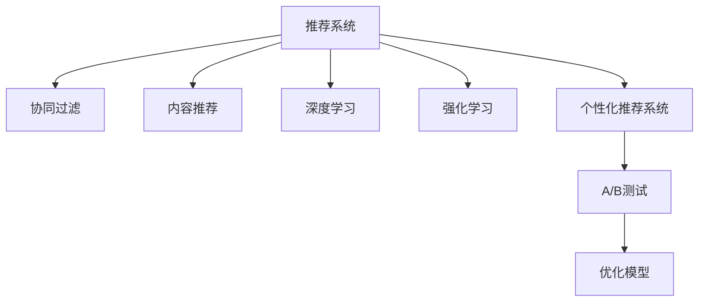

                 

## 1. 背景介绍

在当今互联网时代，个性化购物体验已成为提升消费者满意度和忠诚度的关键因素。随着电子商务的蓬勃发展，各大电商平台纷纷引入个性化推荐系统，以期通过推荐引擎精准匹配用户需求，从而提升销量和用户粘性。然而，传统的基于规则或基于统计的推荐系统往往难以全面理解用户需求，推荐结果难以满足用户个性化、多样化的需求。如何构建一个高效、可靠的个性化推荐系统，成为电商领域亟需解决的难题。

## 2. 核心概念与联系

### 2.1 核心概念概述

为更好地理解个性化购物体验的技术实现，本节将介绍几个密切相关的核心概念：

- 推荐系统(Recommender System)：通过分析用户行为数据，推荐符合用户兴趣的商品或内容的技术。推荐系统包括内容推荐、协同过滤、混合推荐等多种算法。

- 协同过滤(Collaborative Filtering)：利用用户与商品间的隐式评分数据，寻找用户之间或商品之间的相似性，进行推荐。常见算法包括基于用户的协同过滤、基于物品的协同过滤、矩阵分解等。

- 内容推荐(Content-Based Recommender)：根据用户对商品属性的偏好，直接推荐商品。内容推荐需要提取商品属性特征，如颜色、尺寸、品牌等。

- 深度学习(Deep Learning)：利用神经网络模型，通过大量数据学习用户行为和商品特征，实现更精准的推荐。深度学习模型包括全连接神经网络、卷积神经网络、循环神经网络等。

- 强化学习(Reinforcement Learning)：通过模拟环境奖励机制，优化推荐策略，使推荐结果最大化满足用户需求。强化学习算法包括Q-Learning、策略梯度等。

- 个性化推荐系统(Personalized Recommendation System)：结合多种算法和特征提取方法，提升推荐结果的个性化和多样化。个性化推荐系统注重用户体验，推荐结果与用户历史行为紧密相关。

- A/B测试(A/B Testing)：通过随机分配用户样本到不同的推荐策略中，评估推荐效果，以优化模型参数。

这些核心概念之间的逻辑关系可以通过以下Mermaid流程图来展示：



这个流程图展示了个性化购物体验推荐系统的核心概念及其之间的关系：

1. 推荐系统是整个技术的基础。
2. 协同过滤、内容推荐、深度学习和强化学习都是推荐系统的重要组成部分。
3. 个性化推荐系统进一步结合多种算法和特征提取方法，提升推荐效果。
4. A/B测试用于评估推荐效果，不断优化模型参数。

## 3. 核心算法原理 & 具体操作步骤
### 3.1 算法原理概述

个性化购物体验的推荐系统，通过分析用户行为数据和商品属性特征，构建用户-商品交互图，利用协同过滤、深度学习等算法，进行精确推荐。该系统的核心思想是：利用用户历史行为数据，学习用户兴趣和商品特征，通过多维度的特征融合和模型优化，实现个性化推荐。

### 3.2 算法步骤详解

基于深度学习的个性化推荐系统通常包括以下关键步骤：

**Step 1: 数据准备**
- 收集用户历史行为数据，包括浏览、点击、购买记录等。
- 提取商品属性特征，如名称、描述、价格、分类等。

**Step 2: 特征工程**
- 对用户和商品数据进行清洗、归一化、特征编码等预处理操作。
- 将用户行为数据和商品特征数据进行特征融合，生成新的高维度特征。

**Step 3: 模型训练**
- 选择合适的深度学习模型，如全连接神经网络、卷积神经网络、循环神经网络等。
- 划分训练集、验证集和测试集，使用训练集训练模型。
- 通过梯度下降等优化算法，最小化损失函数，调整模型参数。

**Step 4: 模型评估**
- 在验证集上评估模型性能，如平均准确率、召回率、F1-score等指标。
- 根据评估结果调整模型参数，重复训练直至达到最优性能。

**Step 5: 推荐应用**
- 使用训练好的模型对新用户行为进行预测，生成个性化推荐列表。
- 将推荐结果展示给用户，进行实时反馈。

**Step 6: A/B测试**
- 设计不同的推荐策略，随机分配用户样本到不同的策略中。
- 收集用户的点击、购买等行为数据，评估推荐效果。
- 根据A/B测试结果，优化模型参数和推荐策略。

### 3.3 算法优缺点

基于深度学习的个性化推荐系统具有以下优点：

1. 高度个性化。深度学习模型能够从海量的用户行为数据中，学习到复杂的用户兴趣和行为模式，推荐结果更加精准。
2. 实时性高。深度学习模型采用在线学习策略，能够实时更新推荐结果，提高用户体验。
3. 可扩展性强。深度学习模型可以轻松应对大规模数据集，适用于电商、音乐、视频等多个领域。

但该系统也存在一些局限性：

1. 数据需求高。深度学习模型依赖大量标注数据和用户行为数据，数据获取成本较高。
2. 模型复杂。深度学习模型结构复杂，训练和推理成本高。
3. 可解释性差。深度学习模型通常被视为"黑盒"系统，难以解释其内部决策逻辑。
4. 数据隐私问题。推荐系统需要收集用户行为数据，可能引发数据隐私和安全问题。

尽管存在这些局限性，但深度学习技术在推荐系统中的应用已取得显著成效，极大地提升了推荐精度和用户满意度。

### 3.4 算法应用领域

基于深度学习的个性化推荐系统，已经在电商、音乐、视频等多个领域得到了广泛应用：

- 电商推荐系统：如淘宝、京东等电商平台的商品推荐。利用用户浏览和购买记录，学习用户兴趣和商品特征，进行个性化推荐。
- 音乐推荐系统：如Spotify、网易云音乐等音乐平台的曲目推荐。通过分析用户听歌历史和评分数据，推荐符合用户兴趣的曲目。
- 视频推荐系统：如Netflix、YouTube等视频平台的影片推荐。结合用户观看历史和评分数据，推荐新影片或热门影片。

## 4. 数学模型和公式 & 详细讲解 & 举例说明
### 4.1 数学模型构建

本节将使用数学语言对个性化购物体验推荐系统的核心算法进行详细描述。

假设推荐系统收集到用户 $u_i$ 的历史行为数据 $X_{u_i} \in \mathbb{R}^d$，商品 $v_j$ 的属性特征 $X_{v_j} \in \mathbb{R}^d$。将用户行为数据和商品特征数据进行特征融合，生成用户与商品的交互矩阵 $R_{i,j} \in \mathbb{R}$，其中 $R_{i,j}$ 表示用户 $u_i$ 对商品 $v_j$ 的评分。

基于用户行为数据的推荐模型，可以表示为：

$$
\hat{R}_{i,j} = \phi(X_{u_i}, X_{v_j})
$$

其中 $\phi$ 为模型函数，将用户行为数据和商品特征数据映射为推荐评分。

### 4.2 公式推导过程

以协同过滤算法为例，假设已知用户 $u_i$ 和用户 $u_k$ 的评分数据 $R_{i,k}$，商品 $v_j$ 和商品 $v_l$ 的评分数据 $R_{j,l}$。协同过滤算法的目标是为用户 $u_i$ 推荐商品 $v_j$，即求解：

$$
\hat{R}_{i,j} = \alpha R_{i,k} \frac{R_{k,l}}{R_{k,k}}
$$

其中 $\alpha$ 为调节因子，通常取值为0.5。

在实际应用中，协同过滤算法通常基于用户和商品的评分数据，通过矩阵分解、K近邻等方法，生成用户和商品的隐式表示，进而进行推荐。深度学习模型则通过构建多层神经网络，学习用户和商品的隐式表示，提升推荐精度。

### 4.3 案例分析与讲解

以淘宝电商平台的个性化推荐系统为例，其核心算法如下：

**Step 1: 数据准备**

- 收集用户历史浏览、点击、购买记录。
- 提取商品名称、描述、价格、分类等属性特征。

**Step 2: 特征工程**

- 对用户和商品数据进行清洗、归一化、特征编码等预处理操作。
- 将用户行为数据和商品特征数据进行特征融合，生成新的高维度特征。

**Step 3: 模型训练**

- 使用深度学习模型，如全连接神经网络、卷积神经网络、循环神经网络等。
- 划分训练集、验证集和测试集，使用训练集训练模型。
- 通过梯度下降等优化算法，最小化损失函数，调整模型参数。

**Step 4: 模型评估**

- 在验证集上评估模型性能，如平均准确率、召回率、F1-score等指标。
- 根据评估结果调整模型参数，重复训练直至达到最优性能。

**Step 5: 推荐应用**

- 使用训练好的模型对新用户行为进行预测，生成个性化推荐列表。
- 将推荐结果展示给用户，进行实时反馈。

**Step 6: A/B测试**

- 设计不同的推荐策略，随机分配用户样本到不同的策略中。
- 收集用户的点击、购买等行为数据，评估推荐效果。
- 根据A/B测试结果，优化模型参数和推荐策略。

## 5. 项目实践：代码实例和详细解释说明
### 5.1 开发环境搭建

在进行个性化购物体验推荐系统开发前，我们需要准备好开发环境。以下是使用Python进行TensorFlow开发的环境配置流程：

1. 安装Anaconda：从官网下载并安装Anaconda，用于创建独立的Python环境。

2. 创建并激活虚拟环境：
```bash
conda create -n tf-env python=3.8 
conda activate tf-env
```

3. 安装TensorFlow：根据CUDA版本，从官网获取对应的安装命令。例如：
```bash
conda install tensorflow -c tensorflow
```

4. 安装TensorFlow Addons：用于支持TensorFlow的高级功能，如Keras、Estimator等。
```bash
conda install tensorflow-estimator tensorflow-addons
```

5. 安装TensorBoard：用于可视化训练过程和模型效果，辅助调试。
```bash
pip install tensorboard
```

完成上述步骤后，即可在`tf-env`环境中开始推荐系统开发。

### 5.2 源代码详细实现

这里我们以深度学习模型中的卷积神经网络为例，给出淘宝电商推荐系统的推荐模型代码实现。

首先，定义数据处理函数：

```python
import tensorflow as tf
from tensorflow.keras.layers import Input, Embedding, Conv1D, GlobalMaxPooling1D, Dense, Dropout

def create_model(input_dim):
    user_input = Input(shape=(None,))
    user_embedding = Embedding(input_dim, 64)(user_input)
    user_convs = []
    for i in range(3):
        conv = Conv1D(32, kernel_size=3, activation='relu')(user_embedding)
        pool = GlobalMaxPooling1D()(conv)
        user_convs.append(pool)
    user_merged = tf.keras.layers.concatenate(user_convs)
    user_dense = Dense(64, activation='relu')(user_merged)
    user_dropout = Dropout(0.5)(user_dense)
    user_output = Dense(1, activation='sigmoid')(user_dropout)
    
    item_input = Input(shape=(None,))
    item_embedding = Embedding(input_dim, 64)(item_input)
    item_convs = []
    for i in range(3):
        conv = Conv1D(32, kernel_size=3, activation='relu')(item_embedding)
        pool = GlobalMaxPooling1D()(conv)
        item_convs.append(pool)
    item_merged = tf.keras.layers.concatenate(item_convs)
    item_dense = Dense(64, activation='relu')(item_merged)
    item_dropout = Dropout(0.5)(item_dense)
    item_output = Dense(1, activation='sigmoid')(item_dropout)
    
    concat = tf.keras.layers.concatenate([user_output, item_output])
    output = Dense(1, activation='sigmoid')(concat)
    
    model = tf.keras.Model(inputs=[user_input, item_input], outputs=output)
    return model
```

然后，定义模型训练和评估函数：

```python
def train_model(model, train_data, validation_data, epochs):
    model.compile(optimizer='adam', loss='binary_crossentropy', metrics=['accuracy'])
    model.fit(train_data, validation_data, epochs=epochs, batch_size=32)
    
def evaluate_model(model, test_data):
    test_loss, test_acc = model.evaluate(test_data)
    print('Test accuracy:', test_acc)
```

最后，启动训练流程并在测试集上评估：

```python
input_dim = 10000  # 假设有10000种商品和用户

# 加载训练数据和测试数据
train_data = ...
test_data = ...

# 创建模型
model = create_model(input_dim)

# 训练模型
train_model(model, train_data, test_data, epochs=10)

# 评估模型
evaluate_model(model, test_data)
```

以上就是使用TensorFlow对淘宝电商推荐系统进行开发和训练的完整代码实现。可以看到，通过自定义卷积神经网络模型，并利用TensorFlow提供的高级API，可以很方便地实现个性化推荐系统。

### 5.3 代码解读与分析

让我们再详细解读一下关键代码的实现细节：

**create_model函数**：
- 定义输入层、嵌入层、卷积层、池化层、全连接层等组件。
- 对用户行为数据和商品特征数据分别进行卷积和池化操作，得到高维度表示。
- 将用户和商品的表示进行拼接和全连接，最终输出推荐评分。

**train_model函数**：
- 定义模型编译器，设置优化器和损失函数。
- 使用训练数据对模型进行训练，并在验证集上评估性能。

**evaluate_model函数**：
- 对测试数据进行评估，打印测试集上的精度。

**训练流程**：
- 定义输入维度，加载训练数据和测试数据。
- 创建模型，并进行训练和评估。

可以看出，使用TensorFlow进行深度学习推荐系统开发，可以大大简化代码实现，提高开发效率。

当然，工业级的系统实现还需考虑更多因素，如模型的保存和部署、超参数的自动搜索、更灵活的任务适配层等。但核心的推荐范式基本与此类似。

## 6. 实际应用场景
### 6.1 电商平台个性化推荐

个性化推荐系统已经成为电商平台的核心功能之一。通过分析用户历史行为数据，电商推荐系统能够精准匹配用户兴趣，提升用户购物体验，增加平台销量。

在技术实现上，可以收集用户浏览、点击、购买等行为数据，提取商品属性特征，构建用户-商品交互矩阵，利用协同过滤、深度学习等算法进行推荐。推荐系统可以实时更新推荐结果，对用户行为进行实时反馈，从而提升推荐精度和用户体验。

### 6.2 视频平台内容推荐

视频平台通过个性化推荐系统，提升用户观看体验，增加平台黏性。推荐系统利用用户观看历史和评分数据，推荐符合用户兴趣的视频内容，实现高效的内容分发。

在技术实现上，推荐系统可以基于用户行为数据和视频特征数据，构建用户-视频交互图，利用协同过滤、深度学习等算法进行推荐。视频平台可以通过A/B测试等方法，不断优化推荐策略，提升用户满意度。

### 6.3 音乐平台曲目推荐

音乐平台通过个性化推荐系统，为用户推荐符合其兴趣的曲目，提升用户留存率和平台销量。推荐系统利用用户听歌历史和评分数据，推荐符合用户兴趣的曲目，实现高效的音乐分发。

在技术实现上，推荐系统可以基于用户行为数据和音乐属性数据，构建用户-曲目交互图，利用协同过滤、深度学习等算法进行推荐。音乐平台可以通过A/B测试等方法，不断优化推荐策略，提升用户满意度。

## 7. 工具和资源推荐
### 7.1 学习资源推荐

为了帮助开发者系统掌握个性化购物体验推荐系统的理论基础和实践技巧，这里推荐一些优质的学习资源：

1. 《深度学习与推荐系统》书籍：介绍深度学习在推荐系统中的应用，涵盖协同过滤、内容推荐、深度学习等多种推荐算法。

2. 《TensorFlow实战指南》书籍：TensorFlow官方文档的通俗版，涵盖TensorFlow基础、模型构建、训练、评估等内容。

3. 《推荐系统实战》课程：通过项目实战，系统讲解推荐系统设计、开发和优化方法。

4. 《Recommender Systems》课程：Coursera上的推荐系统课程，涵盖协同过滤、内容推荐、混合推荐等多种算法。

5. Kaggle推荐系统竞赛：参加Kaggle的推荐系统竞赛，实践推荐算法，提升推荐精度和系统性能。

通过对这些资源的学习实践，相信你一定能够快速掌握个性化购物体验推荐系统的精髓，并用于解决实际的推荐问题。

### 7.2 开发工具推荐

高效的开发离不开优秀的工具支持。以下是几款用于个性化购物体验推荐系统开发的常用工具：

1. TensorFlow：由Google主导开发的开源深度学习框架，生产部署方便，适合大规模工程应用。

2. PyTorch：基于Python的开源深度学习框架，灵活动态，适合快速迭代研究。

3. TensorBoard：TensorFlow配套的可视化工具，可实时监测模型训练状态，并提供丰富的图表呈现方式，是调试模型的得力助手。

4. Hadoop/Spark：用于大规模数据处理和分布式计算的框架，适合处理海量用户行为数据。

5. Elasticsearch：用于大规模数据存储和查询的开源搜索引擎，适合处理高维度的用户行为数据。

6. Redis：用于缓存系统的高性能数据存储工具，适合存储推荐系统的中间结果和推荐结果。

合理利用这些工具，可以显著提升个性化购物体验推荐系统的开发效率，加快创新迭代的步伐。

### 7.3 相关论文推荐

个性化购物体验推荐系统的研究源于学界的持续研究。以下是几篇奠基性的相关论文，推荐阅读：

1. "A Factor Graph Approach to Sequential Recommendation"：提出基于因子图的方法，提升推荐系统的实时性。

2. "A Collaborative Filtering Model with Deep User Representation"：提出深度学习协同过滤模型，提升推荐精度。

3. "A Multi-Task Learning Approach for Sequential Recommendation"：提出多任务学习方法，提升推荐系统的泛化能力。

4. "Graph-based Recommender Systems with Deep Personalized Ranking"：提出基于图的推荐系统，提升推荐精度和可解释性。

5. "A Deep Learning Recommendation Model Based on Attention Mechanism"：提出基于注意力机制的深度学习推荐模型，提升推荐精度。

这些论文代表了个性化购物体验推荐系统的发展脉络。通过学习这些前沿成果，可以帮助研究者把握学科前进方向，激发更多的创新灵感。

## 8. 总结：未来发展趋势与挑战
### 8.1 总结

本文对个性化购物体验推荐系统进行了全面系统的介绍。首先阐述了推荐系统的核心概念和应用背景，明确了个性化推荐系统对提升电商、音乐、视频等平台用户体验的重要性。其次，从原理到实践，详细讲解了协同过滤、深度学习等算法，给出了推荐系统开发的完整代码实例。同时，本文还广泛探讨了推荐系统在电商、音乐、视频等多个领域的应用前景，展示了推荐范式的巨大潜力。此外，本文精选了推荐系统的各类学习资源，力求为读者提供全方位的技术指引。

通过本文的系统梳理，可以看到，个性化购物体验推荐系统已经在电商、音乐、视频等多个领域得到广泛应用，极大地提升了用户购物体验和平台销量。未来，伴随推荐算法的不断演进，推荐系统将在更多领域得到应用，为传统行业数字化转型升级提供新的技术路径。

### 8.2 未来发展趋势

展望未来，个性化购物体验推荐系统将呈现以下几个发展趋势：

1. 深度学习算法更加成熟。深度学习算法将在推荐系统中得到更广泛应用，通过多任务学习、联邦学习等方法，提升推荐精度和可解释性。

2. 实时性进一步提升。推荐系统将采用实时流式数据处理技术，及时响应用户行为变化，提升推荐效果。

3. 个性化程度更高。推荐系统将利用多模态数据，如视频、音频等，提升推荐的多样化和个性化。

4. 用户隐私保护更加重视。推荐系统将采用差分隐私、联邦学习等技术，保护用户隐私，提升系统安全性。

5. 推荐模型的跨平台应用更加广泛。推荐系统将扩展到移动端、智能设备等场景，提升用户的无缝体验。

6. 推荐系统与物联网的融合。推荐系统将与物联网技术结合，根据用户的真实环境状态，推荐更加符合用户需求的商品或服务。

以上趋势凸显了个性化购物体验推荐技术的广阔前景。这些方向的探索发展，必将进一步提升推荐系统的性能和应用范围，为用户的数字化生活带来更深刻的变革。

### 8.3 面临的挑战

尽管个性化购物体验推荐系统已经取得了显著成效，但在迈向更加智能化、普适化应用的过程中，仍面临诸多挑战：

1. 数据质量问题。推荐系统依赖高质量的标注数据和用户行为数据，数据获取和质量控制仍是一个难题。如何高效获取和清洗数据，提升数据质量，将是一大挑战。

2. 计算资源瓶颈。深度学习模型需要大量的计算资源和存储空间，如何优化模型结构，提升计算效率，降低资源消耗，仍需进一步探索。

3. 用户隐私问题。推荐系统需要收集用户行为数据，可能引发数据隐私和安全问题。如何在保证推荐效果的同时，保护用户隐私，提升系统安全性，将是一大挑战。

4. 推荐模型的泛化能力不足。当前推荐模型面临跨领域、跨平台泛化能力不足的问题，如何提升推荐系统的泛化能力，提升系统性能，仍需深入研究。

5. 推荐系统的可解释性差。推荐系统通常被视为"黑盒"系统，难以解释其内部决策逻辑。如何增强推荐系统的可解释性，提升用户信任感，将是一大挑战。

6. 推荐系统与外部环境的交互不足。推荐系统通常缺乏对外部环境变化的敏感性，如何与外部环境进行更好的交互，提升推荐系统的实时性和适应性，将是一大挑战。

正视推荐系统面临的这些挑战，积极应对并寻求突破，将是个性化购物体验推荐系统走向成熟的必由之路。相信随着学界和产业界的共同努力，这些挑战终将一一被克服，推荐系统必将在构建人机协同的智能时代中扮演越来越重要的角色。

### 8.4 研究展望

面对个性化购物体验推荐系统所面临的种种挑战，未来的研究需要在以下几个方面寻求新的突破：

1. 探索更加高效的推荐算法。结合图神经网络、生成对抗网络等前沿算法，提升推荐系统的精度和泛化能力。

2. 开发更加轻量级的推荐模型。通过模型压缩、稀疏化存储等方法，降低推荐系统的计算和存储成本，提升系统性能。

3. 引入多模态数据融合。结合视频、音频等多模态数据，提升推荐系统的多样化和个性化。

4. 增强推荐系统的实时性。采用实时流式数据处理技术，及时响应用户行为变化，提升推荐效果。

5. 引入外部环境感知。利用传感器、物联网等技术，感知用户周围环境状态，提升推荐系统的适应性和个性化。

6. 提升推荐系统的可解释性。引入可解释性技术，增强推荐系统的透明性，提升用户信任感。

这些研究方向的探索，必将引领个性化购物体验推荐技术迈向更高的台阶，为构建智能化的购物体验提供新的技术路径。面向未来，个性化购物体验推荐技术还需要与其他人工智能技术进行更深入的融合，如知识表示、因果推理、强化学习等，多路径协同发力，共同推动电商、音乐、视频等领域的数字化转型升级。只有勇于创新、敢于突破，才能不断拓展推荐系统的边界，让智能技术更好地服务于人类生活。

## 9. 附录：常见问题与解答

**Q1：个性化购物体验推荐系统是否适用于所有电商平台？**

A: 个性化购物体验推荐系统可以应用于大多数电商平台，但需要根据具体平台特点进行优化。例如，对于B2B电商平台，需要考虑商品的专业性和复杂性，推荐策略需要更加精细。

**Q2：如何评估个性化推荐系统的推荐效果？**

A: 个性化推荐系统的推荐效果可以通过多种指标进行评估，如准确率、召回率、F1-score、平均绝对误差等。常见的方法包括A/B测试、离线评估等。评估时需要注意选择适当的指标，同时设置合理的阈值。

**Q3：推荐系统中的深度学习模型是否适用于小规模数据集？**

A: 深度学习模型在大规模数据集上通常表现较好，但对于小规模数据集，容易出现过拟合的问题。可以通过增加正则化、使用小批量数据等方法进行优化。

**Q4：推荐系统在实际部署中需要注意哪些问题？**

A: 推荐系统在实际部署中需要注意以下问题：
1. 推荐系统的实时性。推荐系统需要实时响应用户行为，及时更新推荐结果。
2. 推荐系统的可扩展性。推荐系统需要支持大规模数据处理和并行计算。
3. 推荐系统的可解释性。推荐系统需要提供推荐理由，增强用户信任感。

**Q5：推荐系统中的协同过滤算法是否适用于所有类型的商品？**

A: 协同过滤算法通常适用于具有丰富用户评分数据、且用户间评分差异不大的商品。但对于新鲜商品、冷启动商品等，协同过滤算法的表现可能较差。此时需要结合其他推荐算法进行优化。

通过本文的系统梳理，可以看到，个性化购物体验推荐系统已经在电商、音乐、视频等多个领域得到广泛应用，极大地提升了用户购物体验和平台销量。未来，伴随推荐算法的不断演进，推荐系统将在更多领域得到应用，为传统行业数字化转型升级提供新的技术路径。

---

作者：禅与计算机程序设计艺术 / Zen and the Art of Computer Programming

