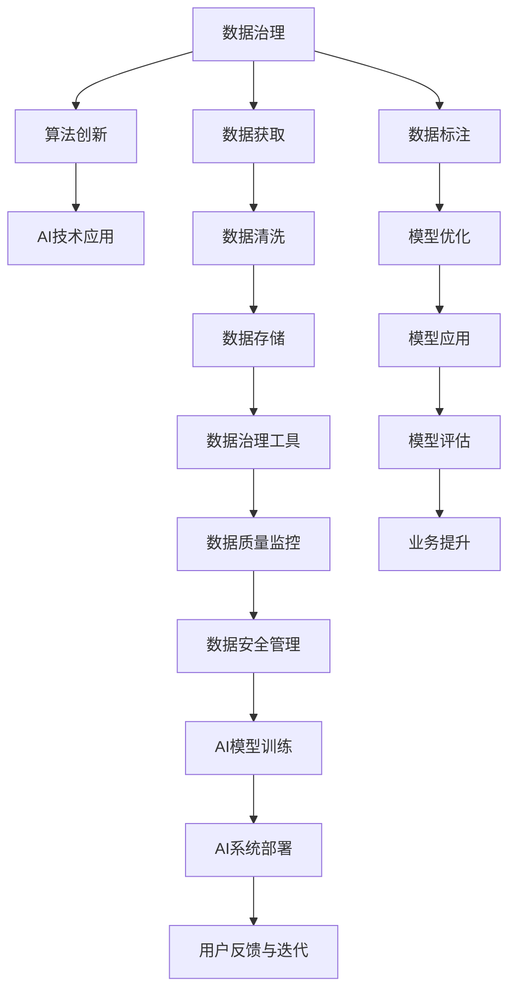

                 

# 中国AI技术的优势与数据的重要性

> 关键词：中国AI技术优势, 数据重要性, 人工智能发展, 数据治理, 算法创新

## 1. 背景介绍

近年来，人工智能(AI)技术在全球范围内迅速发展，成为推动科技和经济进步的重要力量。特别是在中国，AI技术在多个领域取得了显著进展，展现出了强大的技术优势和创新能力。与此同时，数据作为AI技术的基础，其重要性日益凸显。本文将从中国AI技术的优势与数据的重要性两个方面，深入探讨其背后的原理和应用，为读者提供一份全面的技术指南。

## 2. 核心概念与联系

### 2.1 核心概念概述

在探讨中国AI技术的优势与数据的重要性时，我们首先需要明确几个核心概念：

- **人工智能技术**：指利用计算机和算法模拟人类智能的各类技术，包括机器学习、深度学习、自然语言处理、计算机视觉等。
- **数据治理**：指通过规范化和标准化数据处理和管理，确保数据质量和可用性，提升数据利用效率和安全性。
- **算法创新**：指不断改进和开发新的算法模型和技术，以解决实际问题，提升AI系统的性能和效率。
- **中国AI技术优势**：指中国在AI技术研发、应用推广和产业布局上所展现出的独特优势，包括政策支持、研发投入、人才培养和市场应用等方面。
- **数据重要性**：指数据在AI技术中的基础地位，数据的质量、数量和多样化程度直接影响AI系统的训练效果和应用效果。

### 2.2 核心概念原理和架构的 Mermaid 流程图

以下是一个简单的 Mermaid 流程图，展示了数据治理、算法创新和AI技术应用之间的联系：



这个流程图展示了数据治理对算法创新的推动作用，以及算法创新如何通过AI技术应用转化为具体的业务价值。其中，数据治理包括数据获取、清洗、存储、治理工具、质量监控和安全管理等多个环节，为算法创新提供了基础保障。

## 3. 核心算法原理 & 具体操作步骤

### 3.1 算法原理概述

中国AI技术优势的核心在于其强大的算法创新能力和高效的数据治理机制。算法创新包括但不限于深度学习、强化学习、联邦学习等，而数据治理则涵盖数据的采集、清洗、标注、存储和管理等多个环节。

### 3.2 算法步骤详解

以下以深度学习为例，详细介绍其核心步骤：

1. **数据获取与预处理**：
   - 数据获取：从互联网、企业内部系统等渠道获取原始数据。
   - 数据预处理：进行数据清洗、去噪、归一化等处理，确保数据质量。

2. **模型设计与训练**：
   - 模型设计：根据具体应用场景选择合适的深度学习模型，如卷积神经网络(CNN)、循环神经网络(RNN)等。
   - 模型训练：使用训练集进行模型参数优化，通常采用随机梯度下降(SGD)等优化算法，以最小化损失函数。

3. **模型评估与优化**：
   - 模型评估：使用验证集对训练好的模型进行性能评估，如准确率、召回率等指标。
   - 模型优化：根据评估结果调整模型结构、超参数等，优化模型性能。

4. **模型部署与应用**：
   - 模型部署：将训练好的模型部署到实际应用环境中，如服务器、移动设备等。
   - 模型应用：在生产环境中使用模型进行预测、分类、生成等任务。

### 3.3 算法优缺点

**深度学习算法的优点**：
- 自适应性强：能够自动从数据中学习特征，无需人工干预。
- 泛化能力强：在大规模数据上训练后，能够在多个场景中泛化。
- 表现优异：在图像识别、语音识别、自然语言处理等领域表现出色。

**深度学习算法的缺点**：
- 数据需求高：需要大量标注数据进行训练，获取数据成本高。
- 计算资源消耗大：训练和推理需要高性能硬件支持。
- 黑箱模型：难以解释模型的决策过程，缺乏透明性。

### 3.4 算法应用领域

深度学习算法已经在多个领域得到了广泛应用，例如：

- **计算机视觉**：图像识别、物体检测、人脸识别等。
- **自然语言处理**：文本分类、情感分析、机器翻译等。
- **语音识别**：语音合成、语音识别、语音情感分析等。
- **医疗健康**：医学影像分析、疾病预测、基因分析等。
- **智能制造**：工业检测、质量控制、生产优化等。

## 4. 数学模型和公式 & 详细讲解 & 举例说明

### 4.1 数学模型构建

以卷积神经网络(CNN)为例，其数学模型可以表示为：

$$
\mathcal{L}(y, \hat{y}) = -\frac{1}{N}\sum_{i=1}^N \left[ y_i \log \hat{y}_i + (1-y_i) \log (1-\hat{y}_i) \right]
$$

其中，$y$ 为真实标签，$\hat{y}$ 为模型预测结果，$N$ 为样本数量。

### 4.2 公式推导过程

以上公式可以进一步推导为：

$$
\frac{\partial \mathcal{L}(y, \hat{y})}{\partial \theta} = \frac{1}{N}\sum_{i=1}^N \left[ y_i \frac{\partial \log \hat{y}_i}{\partial \theta} - (1-y_i) \frac{\partial \log (1-\hat{y}_i)}{\partial \theta} \right]
$$

其中，$\theta$ 为模型参数。

### 4.3 案例分析与讲解

以图像分类为例，假设训练集包含1000张图片，每张图片的大小为32x32。使用CNN进行训练，首先定义网络结构，如卷积层、池化层、全连接层等。然后使用随机梯度下降(SGD)优化算法进行训练，最小化损失函数。在训练过程中，每批次取100张图片进行前向传播和反向传播，调整模型参数，直至收敛。最后使用验证集对模型进行评估，选择表现最好的模型进行应用。

## 5. 项目实践：代码实例和详细解释说明

### 5.1 开发环境搭建

在进行AI项目实践前，需要搭建合适的开发环境。以下是一个简单的开发环境搭建流程：

1. 安装Python和相关依赖：
   ```bash
   pip install numpy scipy scikit-learn torch torchvision
   ```

2. 搭建深度学习框架：
   ```bash
   conda create -n pytorch-env python=3.8 
   conda activate pytorch-env
   conda install pytorch torchvision torchaudio cudatoolkit=11.1 -c pytorch -c conda-forge
   ```

3. 安装深度学习库：
   ```bash
   pip install tensorflow keras openai gym
   ```

4. 安装数据处理库：
   ```bash
   pip install pandas matplotlib scikit-image
   ```

### 5.2 源代码详细实现

以下是一个简单的卷积神经网络(CNN)实现：

```python
import torch
import torch.nn as nn
import torch.optim as optim

class CNN(nn.Module):
    def __init__(self):
        super(CNN, self).__init__()
        self.conv1 = nn.Conv2d(3, 32, kernel_size=3, padding=1)
        self.pool = nn.MaxPool2d(kernel_size=2, stride=2)
        self.fc1 = nn.Linear(32 * 8 * 8, 10)

    def forward(self, x):
        x = self.conv1(x)
        x = self.pool(x)
        x = x.view(-1, 32 * 8 * 8)
        x = self.fc1(x)
        return x

model = CNN()
criterion = nn.CrossEntropyLoss()
optimizer = optim.SGD(model.parameters(), lr=0.01)

# 训练数据和标签
train_data = ...
train_labels = ...

# 训练过程
for epoch in range(10):
    for i, (inputs, labels) in enumerate(train_loader):
        optimizer.zero_grad()
        outputs = model(inputs)
        loss = criterion(outputs, labels)
        loss.backward()
        optimizer.step()
```

### 5.3 代码解读与分析

- `nn.Conv2d` 用于定义卷积层，`nn.MaxPool2d` 用于定义池化层，`nn.Linear` 用于定义全连接层。
- `torch.optim.SGD` 用于定义随机梯度下降优化器。
- `nn.CrossEntropyLoss` 用于定义交叉熵损失函数。
- 训练过程中，`model.parameters()` 表示模型可训练参数，`model(inputs)` 表示模型前向传播，`loss.backward()` 表示反向传播，`optimizer.step()` 表示更新模型参数。

### 5.4 运行结果展示

训练过程中，可以使用以下代码输出训练集的损失和准确率：

```python
for epoch in range(10):
    running_loss = 0.0
    correct = 0
    total = 0
    for i, (inputs, labels) in enumerate(train_loader):
        outputs = model(inputs)
        loss = criterion(outputs, labels)
        optimizer.zero_grad()
        loss.backward()
        optimizer.step()
        running_loss += loss.item()
        _, predicted = torch.max(outputs.data, 1)
        total += labels.size(0)
        correct += (predicted == labels).sum().item()

    print(f"Epoch {epoch+1}, Loss: {running_loss/len(train_loader):.4f}, Accuracy: {100 * correct/total:.2f}%")
```

## 6. 实际应用场景

### 6.1 智能制造

在智能制造领域，AI技术可以应用于工业检测、质量控制、生产优化等方面。例如，通过图像识别技术对产品进行缺陷检测，提高生产效率和产品质量。利用深度学习模型对生产数据进行实时分析，优化生产流程，降低能耗和成本。

### 6.2 智慧城市

在智慧城市建设中，AI技术可以应用于交通管理、智能安防、城市治理等方面。例如，通过图像识别技术对交通违法行为进行监控和识别，提高交通管理效率。利用自然语言处理技术对城市运行数据进行分析和预测，优化城市资源配置。

### 6.3 医疗健康

在医疗健康领域，AI技术可以应用于医学影像分析、疾病预测、基因分析等方面。例如，利用深度学习模型对医学影像进行自动解读，辅助医生进行疾病诊断和治疗。通过基因分析技术，预测疾病风险，提供个性化健康管理方案。

### 6.4 未来应用展望

未来，随着AI技术的进一步发展和数据治理的不断完善，AI技术将在更多领域发挥重要作用。例如：

- **智能交通**：实现自动驾驶、智能导航、智能监控等应用。
- **智能家居**：实现语音识别、智能控制、个性化推荐等应用。
- **智能金融**：实现风险评估、客户分析、智能投顾等应用。
- **智能教育**：实现智能推荐、自适应学习、智能评估等应用。

## 7. 工具和资源推荐

### 7.1 学习资源推荐

为了帮助开发者掌握AI技术和数据治理的方法，以下是一些优质的学习资源：

- **《深度学习》（Deep Learning）**：Ian Goodfellow等著，全面介绍了深度学习的基本原理和应用。
- **《数据科学入门》（Data Science from Scratch）**：Joel Grus著，介绍了数据科学的基础知识和实践技能。
- **Coursera上的深度学习课程**：包括斯坦福大学、密歇根大学等名校的深度学习课程，系统讲解深度学习原理和实践。
- **Kaggle竞赛**：参加Kaggle数据科学竞赛，实践数据处理和模型训练技能。

### 7.2 开发工具推荐

为了提高AI项目开发效率，以下是一些常用的开发工具：

- **Jupyter Notebook**：支持多种编程语言和库的交互式编程环境，方便开发者快速迭代和调试代码。
- **PyCharm**：专业的Python IDE，提供代码自动补全、调试、版本控制等功能，适合大型项目的开发。
- **TensorFlow**：由Google开发的深度学习框架，支持分布式计算，适合大规模深度学习模型的训练。
- **PyTorch**：由Facebook开发的深度学习框架，支持动态图和静态图，易于开发和调试。
- **Keras**：高层次的深度学习API，支持TensorFlow、Theano、CNTK等多种后端，易于上手。

### 7.3 相关论文推荐

以下是一些关于AI技术和数据治理的重要论文，推荐阅读：

- **《ImageNet Classification with Deep Convolutional Neural Networks》**：Alex Krizhevsky等著，提出了卷积神经网络(CNN)，开创了深度学习图像识别的新纪元。
- **《Natural Language Processing (Comprehensive)》**：Stanford大学计算机科学系课程讲义，全面介绍了自然语言处理的基本概念和应用。
- **《FedLearn: A Federated Deep Learning Framework》**：Google提出的联邦学习框架，支持分布式训练和隐私保护。
- **《Knowledge Graph Embedding and Its Application》**：Han Xiao等著，介绍了知识图谱嵌入技术及其在推荐系统中的应用。

## 8. 总结：未来发展趋势与挑战

### 8.1 研究成果总结

中国AI技术在全球范围内展现出了强大的优势，特别是在数据治理和算法创新方面。通过规范化和标准化的数据处理机制，确保了数据的质量和可用性，为AI模型的训练提供了坚实基础。通过不断改进和开发新的算法模型，提升了AI系统的性能和效率，满足了不同领域的应用需求。

### 8.2 未来发展趋势

未来，AI技术将在更多领域得到应用和创新，呈现以下几个发展趋势：

- **跨领域融合**：AI技术将与物联网、区块链、5G等技术融合，形成更加智能化的应用场景。
- **自适应学习**：AI模型将具备自适应学习能力，能够根据环境变化进行动态调整和优化。
- **个性化服务**：AI系统将能够提供个性化推荐、个性化分析和个性化交互等服务，提升用户体验。
- **人机协同**：AI技术将与人类智能协同工作，形成更加智能化的决策支持系统。

### 8.3 面临的挑战

尽管AI技术取得了巨大进展，但在实际应用中仍面临诸多挑战：

- **数据隐私和安全**：如何保护用户隐私和数据安全，防止数据泄露和滥用。
- **算法公平性和透明性**：如何确保算法决策的公平性和透明性，避免歧视和偏见。
- **计算资源消耗**：如何优化计算资源使用，降低模型训练和推理的能耗和成本。
- **模型解释性**：如何提高模型的解释性，增强用户对模型的信任和接受度。

### 8.4 研究展望

未来，AI技术的发展需要在以下几个方面寻求新的突破：

- **多模态学习**：将视觉、听觉、语言等多种模态数据进行融合，提升AI系统的感知和理解能力。
- **联邦学习**：通过分布式训练和模型更新，实现数据隐私保护和模型优化。
- **自监督学习**：利用未标注数据进行自监督学习，提升模型的泛化能力和适应性。
- **对抗性学习**：研究对抗性样本生成和防御方法，提高AI系统的鲁棒性和安全性。

## 9. 附录：常见问题与解答

**Q1：如何选择合适的数据集进行AI训练？**

A: 选择合适的数据集进行AI训练，需要考虑以下几个方面：
- 数据集的规模和多样性：数据集越大，训练出的模型泛化能力越强。
- 数据集的代表性和可靠性：数据集应具有代表性，能够覆盖实际应用场景。
- 数据集的标注质量：标注数据应准确、一致，避免误导模型训练。

**Q2：数据治理中常见的挑战有哪些？**

A: 数据治理中常见的挑战包括：
- 数据获取：获取高质量的数据资源，需要耗费大量人力和财力。
- 数据清洗：数据清洗需要耗费大量时间和精力，避免数据噪声对模型训练的影响。
- 数据存储：数据存储需要保证数据的安全性和访问效率，避免数据丢失和泄露。
- 数据质量监控：建立数据质量监控机制，及时发现和纠正数据质量问题。

**Q3：AI技术在实际应用中面临哪些挑战？**

A: AI技术在实际应用中面临的挑战包括：
- 数据隐私和安全：保护用户隐私和数据安全，防止数据泄露和滥用。
- 算法公平性和透明性：确保算法决策的公平性和透明性，避免歧视和偏见。
- 计算资源消耗：优化计算资源使用，降低模型训练和推理的能耗和成本。
- 模型解释性：提高模型的解释性，增强用户对模型的信任和接受度。

**Q4：如何提高AI模型的泛化能力？**

A: 提高AI模型的泛化能力，可以从以下几个方面入手：
- 增加数据集规模：通过增加训练数据集的规模，提升模型的泛化能力。
- 数据增强：通过数据增强技术，如数据扩充、回译等，提升模型的泛化能力。
- 正则化技术：使用L2正则、Dropout等正则化技术，避免模型过拟合。
- 模型集成：通过模型集成技术，如Bagging、Boosting等，提升模型的泛化能力。

**Q5：AI技术在医疗健康领域的应用有哪些？**

A: AI技术在医疗健康领域的应用包括：
- 医学影像分析：利用深度学习模型对医学影像进行自动解读，辅助医生进行疾病诊断和治疗。
- 疾病预测：通过基因分析技术，预测疾病风险，提供个性化健康管理方案。
- 智能诊断：利用自然语言处理技术，对医疗记录进行分析和解读，辅助医生进行诊断。

通过以上分析，我们可以看到，中国AI技术在数据治理和算法创新方面展现出了强大的优势和潜力。未来，伴随着AI技术的不断发展和成熟，AI技术必将在更多领域得到广泛应用，为人类的生产生活方式带来深远影响。

