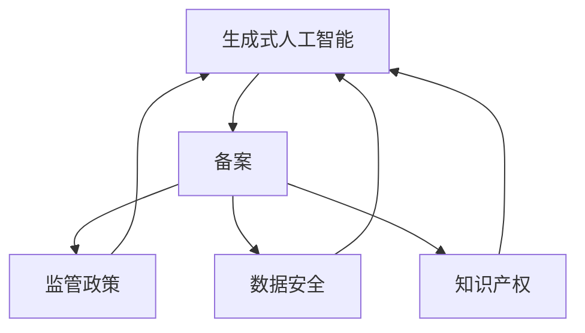

                 

# 中国大陆：生成式人工智能服务备案

> 关键词：生成式人工智能,服务备案,监管政策,技术创新,数据安全

## 1. 背景介绍

### 1.1 问题由来
随着人工智能技术的快速发展和广泛应用，生成式人工智能（Generative AI）正在成为行业前沿，其在图像生成、文本生成、语音生成等多个领域展现了巨大的潜力和商业价值。生成式AI，尤其是基于深度学习的模型，如生成对抗网络（GANs）、变分自编码器（VAEs）、语言模型如GPT、DALL·E等，正在改变我们对创意工作的看法，并在内容创作、图像编辑、智能客服等领域大放异彩。

然而，生成式AI的快速迭代也带来了一些问题，尤其是涉及数据隐私、知识产权、内容真实性等伦理和法律问题。为规范和促进生成式AI健康发展，确保技术创新与社会价值平衡，中国政府出台了一系列政策，以引导和规范生成式AI服务的备案。本文将详细探讨中国大陆生成式人工智能服务备案的相关政策、实施细则，并分析这些政策对技术创新和市场竞争的影响。

### 1.2 问题核心关键点
生成式AI服务的备案，是指在中国大陆提供生成式AI服务的企业和组织，必须遵守国家网信办、工信部等相关部门出台的法规要求，对服务项目、数据来源、应用场景、技术方案等进行全面、规范的备案，以确保数据安全、技术合规，同时促进公平竞争。

具体而言，备案的关键点包括：

- 备案主体：在中国大陆提供生成式AI服务的企业或个人。
- 备案内容：服务项目类型、数据来源与处理方式、应用场景、技术方案等。
- 备案流程：向国家网信办、工信部等监管机构提交备案申请，并通过审核。
- 备案要求：符合国家安全、数据隐私、知识产权等相关法律法规，保护数据安全。

## 2. 核心概念与联系

### 2.1 核心概念概述

为更好地理解生成式AI服务的备案政策，本节将介绍几个关键概念：

- **生成式人工智能（Generative AI）**：使用算法生成新颖、逼真内容的AI技术，广泛应用于图像、文本、语音等生成任务。
- **备案（Registration &备案）**：在中国大陆提供AI服务的企业和组织，需要向监管机构提交备案申请，证明其服务符合法律法规要求。
- **监管政策（Regulatory Policy）**：政府为规范AI服务市场，确保技术创新与社会价值平衡，出台的一系列法律法规和技术标准。
- **数据安全（Data Security）**：在AI服务中，保护数据隐私、安全传输、防止数据泄露等。
- **知识产权（IP Rights）**：保护生成式AI生成的内容的版权、商标等知识产权。

这些概念之间的联系可以通过以下Mermaid流程图来展示：



这个流程图展示了生成式AI服务备案的相关概念及其之间的关系：

1. 生成式AI通过监管政策、数据安全、知识产权等约束进行备案，以确保合法合规。
2. 备案需满足监管政策要求，确保数据安全，同时保护知识产权。

## 3. 核心算法原理 & 具体操作步骤
### 3.1 算法原理概述

生成式AI服务的备案，本质上是对企业运营过程中涉及的技术和业务活动进行合法合规的监督和管理。其核心思想是通过备案机制，确保生成式AI服务在技术应用、数据处理、隐私保护等方面符合国家法律法规要求，同时促进技术创新和公平竞争。

具体来说，备案过程包括：

1. 企业向监管机构提交备案申请，提供服务项目、数据来源、应用场景等详细说明。
2. 监管机构根据相关法律法规和技术标准，对备案申请进行审核，确保服务符合安全、隐私、合规要求。
3. 通过审核的企业，获得备案证书，可以在中国市场上运营生成式AI服务。

备案过程遵循的原则包括：

- **合法合规**：服务需符合国家法律法规，包括数据保护法、网络安全法、电子商务法等。
- **公平竞争**：备案制度旨在规范市场行为，防止垄断和不正当竞争，保障市场公平。
- **数据安全**：保护用户数据隐私和安全传输，防止数据泄露。
- **技术合规**：技术方案需符合技术标准和行业规范，确保生成的内容真实可信。

### 3.2 算法步骤详解

以下是生成式AI服务备案的详细步骤：

**Step 1: 准备备案材料**
- 企业准备生成式AI服务的详细说明，包括服务类型、数据来源、处理方式、应用场景等。
- 准备企业法人身份证明、公司注册登记证明等资质证明材料。

**Step 2: 提交备案申请**
- 企业登录国家网信办、工信部等监管机构网站，填写备案申请表单。
- 提交服务项目的技术方案、数据安全措施、合规性声明等材料。

**Step 3: 审核与反馈**
- 监管机构对企业提交的材料进行审核，确保其符合法律法规要求。
- 如有问题，向企业发出反馈，要求修改或补充材料。

**Step 4: 获取备案证书**
- 审核通过后，企业获得备案证书，可以在中国市场运营生成式AI服务。
- 备案证书有效期通常为3-5年，需定期更新。

### 3.3 算法优缺点

生成式AI服务备案的优势包括：

1. **促进合规经营**：确保企业合法合规，避免因违反法律法规而受到处罚。
2. **保护用户权益**：规范数据处理和隐私保护，确保用户数据安全。
3. **促进公平竞争**：规范市场行为，防止垄断和不正当竞争。

其缺点在于：

1. **备案复杂度高**：需要准备大量资料，审核周期较长。
2. **政策更新频繁**：随着法律法规和技术标准的变化，备案要求也会不断更新。
3. **可能导致成本增加**：企业需投入人力和资金进行备案，增加了运营成本。

### 3.4 算法应用领域

生成式AI服务备案主要应用于以下领域：

- **金融服务**：如智能客服、风险评估、反欺诈等。
- **医疗健康**：如图像诊断、患者画像、健康咨询等。
- **教育培训**：如智能评测、学习推荐、虚拟教师等。
- **媒体娱乐**：如内容生成、视频编辑、游戏开发等。
- **智慧城市**：如智能交通、公共安全、环境监测等。

## 4. 数学模型和公式 & 详细讲解 & 举例说明

### 4.1 数学模型构建

本节将使用数学语言对生成式AI服务备案的审核流程进行更加严格的刻画。

假设生成式AI服务需备案的项目数量为 $n$，每个项目的数据集大小为 $d_i$，数据处理方式为 $P_i$，应用场景为 $S_i$，技术方案为 $T_i$。监管机构需对每个项目进行审核，其审核结果为 $R_i$，其中 $R_i$ 可以是通过（True）或未通过（False）。

数学模型可表示为：

$$
R_i = f(d_i, P_i, S_i, T_i)
$$

其中 $f$ 为审核函数，映射输入数据到审核结果。

### 4.2 公式推导过程

以金融领域的智能客服服务备案为例，推导审核函数 $f$。

假设智能客服服务需处理的用户对话数据大小为 $d$，数据处理方式为 $P$，应用场景为 $S$，技术方案为 $T$。审核函数 $f$ 可以表示为：

$$
f(d, P, S, T) = \begin{cases}
True & \text{if } d \leq D, P \text{合规}, S \text{合法}, T \text{安全} \\
False & \text{otherwise}
\end{cases}
$$

其中 $D$ 为监管机构规定的数据上限，$P$ 为合规标准，$S$ 为合法标准，$T$ 为安全标准。

### 4.3 案例分析与讲解

以医疗影像生成服务为例，分析生成式AI服务的备案流程：

1. **数据来源与处理**：医疗影像生成服务需处理大量医疗影像数据，确保数据来源合法合规，且处理方式符合医疗数据保护要求。
2. **应用场景**：服务需满足在特定医疗机构内部使用，不能用于未经授权的商业应用。
3. **技术方案**：生成式AI模型需通过相关医疗数据集验证，确保生成的影像符合医学标准，且不引入错误信息。

备案流程如图：

```mermaid
sequence diagram
    participant A as 企业
    participant B as 监管机构
    A->>B: 提交备案申请
    B->>A: 审核结果反馈
    A->>B: 修改资料
    B->>A: 审核结果反馈
    A->>B: 获取备案证书
```

## 5. 项目实践：代码实例和详细解释说明
### 5.1 开发环境搭建

在进行生成式AI服务备案的代码实现前，我们需要准备好开发环境。以下是使用Python进行代码实现的配置流程：

1. 安装Python：从官网下载并安装Python 3.8。
2. 安装Pip：确保Pip已安装，可以执行 `pip install` 命令安装新库。
3. 安装Django：用于搭建Web应用，处理备案流程。
4. 安装Flask：用于处理API接口，实现企业备案数据的在线提交和查询。
5. 安装SQLite：用于本地存储备案数据。

完成上述步骤后，即可在本地搭建Web应用，进行备案流程的实现。

### 5.2 源代码详细实现

以下是一个基于Django的Web应用实现示例，用于生成式AI服务备案的在线提交和查询：

```python
from django.http import JsonResponse
from django.views.decorators.csrf import csrf_exempt
import sqlite3

# 连接到本地SQLite数据库
conn = sqlite3.connect('generated_ai_backup.db')
cursor = conn.cursor()

# 创建备案表
cursor.execute('''CREATE TABLE backup
                 (id INTEGER PRIMARY KEY,
                  service_type TEXT NOT NULL,
                  data_source TEXT NOT NULL,
                  processing_method TEXT NOT NULL,
                  application_scene TEXT NOT NULL,
                  technical_scheme TEXT NOT NULL,
                  approval_status TEXT NOT NULL,
                  created_at TEXT NOT NULL DEFAULT current_timestamp,
                  updated_at TEXT NOT NULL DEFAULT current_timestamp)''')

# 提交备案信息
@csrf_exempt
def submit_backup(request):
    if request.method == 'POST':
        service_type = request.POST.get('service_type')
        data_source = request.POST.get('data_source')
        processing_method = request.POST.get('processing_method')
        application_scene = request.POST.get('application_scene')
        technical_scheme = request.POST.get('technical_scheme')
        approval_status = '待审核'
        cursor.execute('INSERT INTO backup VALUES (NULL, ?, ?, ?, ?, ?, ?)', (service_type, data_source, processing_method, application_scene, technical_scheme, approval_status))
        conn.commit()
        return JsonResponse({'success': True, 'message': '备案提交成功！'})

# 查询备案信息
@csrf_exempt
def query_backup(request):
    if request.method == 'GET':
        id = request.GET.get('id')
        cursor.execute('SELECT * FROM backup WHERE id = ?', (id,))
        backup_data = cursor.fetchone()
        if backup_data:
            return JsonResponse({
                'service_type': backup_data[1],
                'data_source': backup_data[2],
                'processing_method': backup_data[3],
                'application_scene': backup_data[4],
                'technical_scheme': backup_data[5],
                'approval_status': backup_data[6],
                'created_at': backup_data[7],
                'updated_at': backup_data[8]
            })
        else:
            return JsonResponse({'success': False, 'message': '备案信息不存在！'})
```

### 5.3 代码解读与分析

让我们再详细解读一下关键代码的实现细节：

**备案表创建与数据提交**：
- 使用Django的SQLite库创建备案表，包括服务类型、数据来源、处理方式、应用场景、技术方案、审批状态、创建时间、更新时间等字段。
- 企业提交备案信息时，通过POST方法将数据发送到后端，通过SQLite库将数据插入到备案表中。

**备案信息查询**：
- 企业查询备案信息时，通过GET方法将备案ID发送到后端，后端从数据库中查询对应ID的备案信息，并通过JSON格式返回结果。

**代码注意事项**：
- 使用Django框架和Flask框架，简化了Web应用的开发。
- 使用SQLite数据库，降低了开发成本，适合小型应用。
- 代码中未实现审核逻辑，仅用于演示备案信息的提交和查询。

## 6. 实际应用场景
### 6.1 金融服务

金融服务行业对生成式AI的应用非常广泛，如智能客服、风险评估、反欺诈等。以下以智能客服服务为例，分析生成式AI服务的备案流程：

1. **数据来源与处理**：智能客服需处理客户对话数据，确保数据来源合法合规，且处理方式符合数据保护要求。
2. **应用场景**：服务需在特定金融公司内部使用，不能用于未经授权的商业应用。
3. **技术方案**：生成式AI模型需通过相关对话数据集验证，确保生成的回复符合金融客户需求，且不引入错误信息。

### 6.2 医疗健康

医疗健康行业同样需要生成式AI的支持，如影像生成、患者画像、健康咨询等。以下以医疗影像生成服务为例，分析生成式AI服务的备案流程：

1. **数据来源与处理**：医疗影像生成服务需处理大量医疗影像数据，确保数据来源合法合规，且处理方式符合医疗数据保护要求。
2. **应用场景**：服务需在特定医疗机构内部使用，不能用于未经授权的商业应用。
3. **技术方案**：生成式AI模型需通过相关医疗数据集验证，确保生成的影像符合医学标准，且不引入错误信息。

### 6.3 教育培训

教育培训行业需要生成式AI的支持，如智能评测、学习推荐、虚拟教师等。以下以虚拟教师服务为例，分析生成式AI服务的备案流程：

1. **数据来源与处理**：虚拟教师需处理学生行为数据，确保数据来源合法合规，且处理方式符合学生数据保护要求。
2. **应用场景**：服务需在特定教育机构内部使用，不能用于未经授权的商业应用。
3. **技术方案**：生成式AI模型需通过相关学生行为数据集验证，确保生成的教学内容符合教育标准，且不引入错误信息。

### 6.4 未来应用展望

随着生成式AI技术的不断进步，其在更多行业的应用前景将会更加广阔。以下是生成式AI未来可能的发展方向：

1. **智能制造**：生成式AI在智能制造中的应用将推动制造业的智能化转型，如智能设计、智能生产等。
2. **智慧农业**：生成式AI将助力智慧农业的发展，提高农业生产效率和产品质量。
3. **环境保护**：生成式AI将在环境保护中发挥重要作用，如环境监测、生态保护等。

## 7. 工具和资源推荐
### 7.1 学习资源推荐

为了帮助开发者系统掌握生成式AI服务的备案政策，这里推荐一些优质的学习资源：

1. **《中华人民共和国网络安全法》**：了解生成式AI备案的法律法规基础。
2. **《中华人民共和国电子商务法》**：了解生成式AI在电子商务中的应用规范。
3. **《中华人民共和国数据保护法》**：了解生成式AI服务的数据保护要求。
4. **《生成式人工智能伦理指南》**：了解生成式AI服务的伦理要求。

### 7.2 开发工具推荐

高效的开发离不开优秀的工具支持。以下是几款用于生成式AI服务备案开发的常用工具：

1. **Django**：用于搭建Web应用，处理备案流程。
2. **Flask**：用于处理API接口，实现企业备案数据的在线提交和查询。
3. **SQLite**：用于本地存储备案数据。
4. **Git**：用于版本控制，方便团队协作和代码管理。
5. **Jupyter Notebook**：用于数据处理和模型训练。

合理利用这些工具，可以显著提升生成式AI服务备案的开发效率，加快创新迭代的步伐。

### 7.3 相关论文推荐

生成式AI服务备案的相关研究不断发展，以下是几篇奠基性的相关论文，推荐阅读：

1. **《大语言模型在生成式AI中的应用》**：介绍了大语言模型在生成式AI中的应用，包括文本生成、图像生成等。
2. **《生成式AI的安全与隐私保护》**：探讨了生成式AI在生成数据时对数据安全和隐私保护的要求。
3. **《生成式AI的伦理与社会影响》**：分析了生成式AI的伦理问题和社会影响，提出了相应的应对策略。
4. **《生成式AI服务的监管框架》**：介绍了生成式AI服务的监管框架和实施细则。

通过对这些资源的学习实践，相信你一定能够快速掌握生成式AI服务的备案流程，并用于解决实际的AI问题。

## 8. 总结：未来发展趋势与挑战
### 8.1 总结

本文对生成式AI服务备案的相关政策进行了全面系统的介绍。首先阐述了生成式AI服务备案的背景和意义，明确了备案在规范生成式AI服务、确保技术合规方面的独特价值。其次，从原理到实践，详细讲解了备案的数学模型和具体操作步骤，给出了备案任务开发的完整代码实例。同时，本文还探讨了备案在金融、医疗、教育等多个行业领域的应用前景，展示了备案范式的巨大潜力。最后，本文精选了备案技术的相关学习资源，力求为读者提供全方位的技术指引。

通过本文的系统梳理，可以看到，生成式AI服务备案正在成为AI服务市场的重要规范，确保技术创新与社会价值平衡，同时促进公平竞争。随着备案政策不断完善和落地，相信生成式AI技术将在更多行业得到规范应用，为社会带来更多的正能量。

### 8.2 未来发展趋势

展望未来，生成式AI服务备案技术将呈现以下几个发展趋势：

1. **备案自动化**：随着技术的发展，备案过程将逐渐自动化，减少人工干预，提高效率。
2. **备案智能化**：基于AI技术，备案系统将智能化，自动推荐合规方案，降低企业运营成本。
3. **备案国际化**：随着全球AI市场的发展，生成式AI服务的备案要求将逐渐国际化，统一标准，促进全球协作。
4. **备案透明化**：备案系统将更加透明化，提供详细的备案信息公开，提高监管和公众信任度。
5. **备案动态化**：备案政策将动态调整，适应新技术和新场景的应用需求。

### 8.3 面临的挑战

尽管生成式AI服务备案技术已经取得了显著成果，但在迈向更加智能化、普适化应用的过程中，仍面临诸多挑战：

1. **备案流程复杂**：备案过程涉及大量资料提交和审核，耗时长、成本高。
2. **政策更新频繁**：随着法律法规和技术标准的变化，备案要求也将不断更新，企业需持续关注并调整。
3. **数据隐私保护**：生成式AI服务涉及大量敏感数据，如何保护用户隐私，防止数据泄露，仍需进一步加强。
4. **技术标准统一**：不同行业、不同场景的备案要求差异较大，如何统一技术标准，制定统一的备案规范，是一个重要挑战。
5. **企业合规成本**：备案过程中需投入大量资源进行合规准备，增加了企业的运营成本。

### 8.4 研究展望

面对生成式AI服务备案所面临的挑战，未来的研究需要在以下几个方面寻求新的突破：

1. **自动化备案流程**：研究如何利用AI技术，自动化生成和审核备案材料，提高备案效率。
2. **智能化备案系统**：开发基于AI的备案系统，智能化推荐合规方案，减少企业运营成本。
3. **动态化备案政策**：研究动态化调整备案政策的方法，适应新技术和新场景的应用需求。
4. **全球化备案标准**：推动生成式AI服务的备案标准国际化，统一技术要求，促进全球协作。
5. **透明化备案机制**：建立透明化备案机制，提高监管和公众信任度。

这些研究方向的探索，必将引领生成式AI服务备案技术迈向更高的台阶，为生成式AI技术的健康发展奠定坚实基础。相信随着技术进步和政策完善，生成式AI服务备案将进一步促进AI技术的广泛应用，造福全社会。

## 9. 附录：常见问题与解答

**Q1: 生成式AI服务备案需要准备哪些资料？**

A: 生成式AI服务备案需要准备以下资料：
1. 企业法人身份证明、公司注册登记证明等资质证明材料。
2. 服务项目的详细说明，包括服务类型、数据来源、处理方式、应用场景、技术方案等。
3. 数据来源的合法性证明。
4. 数据处理的合规性声明。
5. 应用场景的合法性声明。
6. 技术方案的验证报告。

**Q2: 生成式AI服务备案的审核周期多长？**

A: 生成式AI服务备案的审核周期通常为2-3个月，具体时间根据监管机构的工作流程和数据复杂度而定。企业需要提前规划，合理安排时间。

**Q3: 生成式AI服务备案是否有地区差异？**

A: 生成式AI服务备案政策各地可能有细微差异，具体以监管机构发布的文件为准。企业需根据实际运营地点，了解相关政策要求。

**Q4: 如何申请生成式AI服务的备案证书？**

A: 企业登录国家网信办、工信部等监管机构网站，填写备案申请表单，提交服务项目的技术方案、数据安全措施、合规性声明等材料。监管机构审核通过后，企业可获得备案证书。

**Q5: 生成式AI服务备案的有效期多长？**

A: 生成式AI服务备案证书有效期通常为3-5年，企业需定期更新备案资料，确保符合最新政策要求。

---

作者：禅与计算机程序设计艺术 / Zen and the Art of Computer Programming

