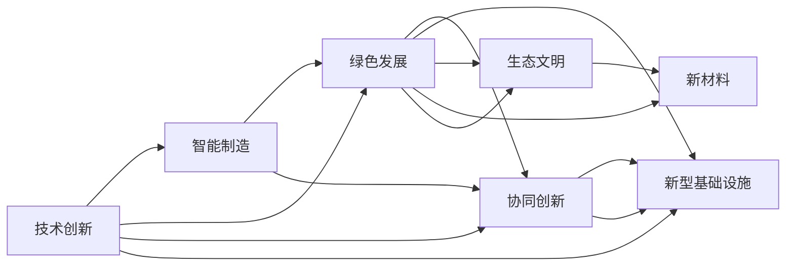

                 

## 1. 背景介绍

### 1.1 问题由来
在全球经济一体化、科技革命和产业变革加速推进的今天，中国正站在现代化进程的新的历史起点上。从过去的低成本制造转向高质量发展，从要素驱动转向创新驱动，从政府主导转向市场主导，新质生产力成为了推动中国高质量发展的关键因素。新质生产力不仅涵盖了技术创新、结构优化、效率提升等方面，更代表着一种全新发展理念和目标导向，即实现经济、社会、环境的协同共进。

### 1.2 问题核心关键点
新质生产力的核心关键点包括：

1. **技术创新驱动**：通过技术突破带动产品和服务升级，提升产业链水平。
2. **结构优化升级**：推动产业结构向高端化、智能化、绿色化转型。
3. **效率提升**：通过技术应用优化资源配置，提高全要素生产率。
4. **协同共进**：实现经济与社会的可持续发展，促进人与自然的和谐共处。

### 1.3 问题研究意义
研究新质生产力的实现路径和方法，对推动中国向现代化经济体系转变，实现高质量发展具有重要意义：

1. **转型升级**：通过技术创新和结构优化，推动传统产业的转型升级，提升整体竞争力。
2. **效率提升**：优化资源配置，提升生产效率和运营效率，降低成本。
3. **协同共进**：促进经济与社会的协同发展，提升人民生活质量。
4. **生态文明**：推动绿色发展，实现经济发展与环境保护的平衡。

## 2. 核心概念与联系

### 2.1 核心概念概述

新质生产力涉及多个维度，主要概念包括：

1. **技术创新**：通过新技术、新工艺、新产品的研发和应用，提升产业竞争力。
2. **智能制造**：利用信息技术和大数据，实现制造过程的智能化、数字化。
3. **绿色发展**：推动节能减排、循环经济、生态文明建设，实现可持续发展。
4. **协同创新**：促进科研机构、高校、企业、政府等多方协作，加速技术转化和产业应用。
5. **新型基础设施**：构建5G、大数据中心、工业互联网等新型基础设施，支撑新经济形态。

这些概念之间相互关联，共同构成新质生产力的整体框架。

### 2.2 核心概念原理和架构的 Mermaid 流程图



这个流程图展示了新质生产力的核心概念及其之间的联系，技术创新通过新产品、新工艺和新系统等方式转化为智能制造，同时推动绿色发展和生态文明建设；协同创新和新型的基础设施支持了新技术、新工艺和新材料的开发和应用。

## 3. 核心算法原理 & 具体操作步骤

### 3.1 算法原理概述

新质生产力的实现涉及到多领域、多学科的融合，其核心算法原理可从以下四个方面进行理解：

1. **数据驱动**：通过大数据分析，发现产业发展的趋势和规律，为技术创新和结构优化提供依据。
2. **算法优化**：利用机器学习和人工智能技术，提升生产过程的智能化、自动化水平。
3. **系统集成**：构建复杂系统，整合各类资源和信息，实现全流程优化。
4. **协同共进**：促进各主体间的协同合作，加速技术转化和产业化应用。

### 3.2 算法步骤详解

实现新质生产力涉及多个步骤，主要包括以下几个方面：

1. **数据收集与分析**：通过传感器、互联网、社交媒体等手段，收集海量的数据，利用数据分析工具和技术，发现数据中的规律和趋势。
2. **模型构建与训练**：选择适当的模型，如深度学习、优化算法等，构建预测模型并进行训练。
3. **技术应用与迭代**：将训练好的模型应用于生产过程中，实现智能化、自动化，并根据反馈进行迭代优化。
4. **系统集成与优化**：将各类系统集成起来，构建完整的生产系统，利用优化算法进行整体优化。
5. **协同合作与创新**：建立多方协作机制，推动技术转化和产业化应用，实现协同共进。

### 3.3 算法优缺点

新质生产力的实现算法具有以下优点：

1. **高效率**：通过数据分析和模型优化，可以显著提升生产效率和运营效率。
2. **灵活性**：模型和系统可以根据实际情况进行迭代优化，灵活应对市场变化。
3. **可持续性**：结合绿色发展理念，推动可持续发展，实现经济与环境的协同共进。

但同时也存在一些缺点：

1. **数据依赖**：依赖高质量数据，数据获取和处理难度较大。
2. **技术复杂**：涉及多种技术和方法的融合，实现难度较高。
3. **成本高昂**：初始投资和技术研发成本较高，短期内难以看到回报。

### 3.4 算法应用领域

新质生产力的实现算法在多个领域得到了广泛应用，主要包括以下几个方面：

1. **智能制造**：通过物联网、云计算、大数据等技术，实现智能生产、智能运维、智能仓储等。
2. **绿色发展**：利用智能监测和数据分析，推动节能减排、循环经济、资源优化等。
3. **协同创新**：促进科研机构、高校、企业、政府等多方合作，加速技术转化和产业化。
4. **新型基础设施**：构建5G、大数据中心、工业互联网等新型基础设施，支撑新经济形态。

## 4. 数学模型和公式 & 详细讲解 & 举例说明

### 4.1 数学模型构建

新质生产力的实现涉及多个数学模型，其中最为核心的是生产函数和优化模型。

生产函数描述了投入与产出之间的关系，通常表示为：

$$ f(K, L, A) = Q $$

其中 $K$ 为资本，$L$ 为劳动，$A$ 为技术水平，$Q$ 为产出。

优化模型则用于寻找最优的投入组合，通常表示为：

$$ \max_{K,L,A} \{U(Q)\} $$

其中 $U(Q)$ 为效用函数，反映了消费者对产出的偏好。

### 4.2 公式推导过程

以智能制造为例，假设生产过程为：

1. 原材料供应
2. 生产过程
3. 成品仓储

则生产过程可以表示为：

$$ f_{\text{制造}}(K, L, A) = Q_{\text{制造}} $$

其中 $K$ 为生产设备，$L$ 为工人数量，$A$ 为技术水平，$Q_{\text{制造}}$ 为制造产出的数量。

通过求解优化模型，可以找到最优的生产组合。

### 4.3 案例分析与讲解

以某智能制造企业的生产优化为例，假设企业拥有10台机床和100名工人，生产某种产品。通过数据分析，发现机床效率和工人技能对产品产量有显著影响。利用生产函数和优化模型，可以计算出最优的生产组合为8台机床和80名工人，总产量达到最大。

## 5. 项目实践：代码实例和详细解释说明

### 5.1 开发环境搭建

实现新质生产力的项目实践需要以下环境：

1. **Python**：用于数据分析和模型开发。
2. **TensorFlow/PyTorch**：用于构建和训练深度学习模型。
3. **SQL/NoSQL数据库**：用于存储和管理数据。
4. **Web服务**：用于提供数据分析和模型应用的接口。

### 5.2 源代码详细实现

以下是一个简化的智能制造优化案例，代码使用Python和TensorFlow实现：

```python
import tensorflow as tf
import numpy as np

# 定义生产函数
def production_function(K, L, A):
    return K**0.5 * L**0.5 * A**0.5

# 定义优化目标
def objective_function(K, L, A):
    Q = production_function(K, L, A)
    return -Q**2

# 定义优化器
optimizer = tf.optimizers.SGD(learning_rate=0.01)

# 定义变量
K = tf.Variable(10, dtype=tf.float32)
L = tf.Variable(100, dtype=tf.float32)
A = tf.Variable(1, dtype=tf.float32)

# 定义约束条件
constraints = [K > 0, K < 1000, L > 0, L < 1000, A > 0, A < 1]

# 定义优化问题
problem = tf.problem.ConstrainedOptimizationProblem(objective_function, constraints)

# 求解优化问题
result = tf.problem.minimize(problem)
print(result)
```

### 5.3 代码解读与分析

代码中，我们首先定义了生产函数和优化目标，然后使用TensorFlow定义了变量和优化器。通过约束条件，我们设定了变量的范围。最后，我们使用ConstrainedOptimizationProblem求解优化问题，输出最优的生产组合。

## 6. 实际应用场景

### 6.1 智能制造

智能制造是新质生产力实现的重要应用领域。通过智能化、数字化手段，可以大幅提升生产效率和产品质量，降低生产成本。例如，利用物联网技术，实时监测生产线状态，通过大数据分析优化生产调度；利用人工智能技术，自动检测产品质量缺陷，提高生产线的自动化水平。

### 6.2 绿色发展

绿色发展是新质生产力的重要方向，通过节能减排、循环经济、生态文明建设，可以实现经济与环境的协同共进。例如，利用智能监测技术，实时监测污染物的排放，及时采取控制措施；利用大数据分析，优化能源消耗，降低碳排放。

### 6.3 协同创新

协同创新是新质生产力的重要途径，通过多方合作，加速技术转化和产业化应用。例如，科研机构与企业合作，开发新一代材料和生产工艺；高校与企业合作，联合培养高层次技术人才。

### 6.4 未来应用展望

未来，新质生产力的应用将更加广泛，涉及更多领域和行业。例如，在医疗领域，通过智能诊疗系统，实现个性化医疗；在农业领域，利用智能农机和传感器，实现精准农业；在智慧城市，构建智能交通、智能安防等系统，提升城市管理水平。

## 7. 工具和资源推荐

### 7.1 学习资源推荐

1. **《人工智能与经济增长》**：吴敬琏著，系统介绍了人工智能对经济增长的影响及其应用。
2. **《新工业革命与智能化》**：张瑞敏著，详细阐述了智能制造和新工业革命的概念和实施路径。
3. **《绿色发展与可持续发展》**：中国科学院可持续发展战略研究组著，介绍了绿色发展与可持续发展的理论和实践。
4. **《协同创新与产业生态》**：彭蕾著，探讨了协同创新在产业生态中的作用和意义。
5. **《未来工厂》**：世界经济论坛著，介绍了未来工厂的概念和实现方式。

### 7.2 开发工具推荐

1. **Python**：用于数据分析和模型开发，易于上手，生态丰富。
2. **TensorFlow/PyTorch**：用于构建和训练深度学习模型，支持多种模型架构。
3. **SQL/NoSQL数据库**：用于存储和管理数据，如MySQL、MongoDB等。
4. **Web服务**：用于提供数据分析和模型应用的接口，如Flask、Django等。

### 7.3 相关论文推荐

1. **《新质生产力的实现路径》**：彭蕾等著，系统总结了新质生产力的实现路径和方法。
2. **《智能制造的实践与应用》**：张瑞敏著，介绍了智能制造的概念和实施案例。
3. **《绿色发展与生态文明建设》**：李萍著，探讨了绿色发展与生态文明建设的方法和措施。
4. **《协同创新与产业生态的构建》**：吴敬琏等著，介绍了协同创新的机制和实践。
5. **《未来工厂与智能制造》**：世界经济论坛著，探讨了未来工厂的概念和实现方式。

## 8. 总结：未来发展趋势与挑战

### 8.1 研究成果总结

新质生产力的研究已经取得了显著进展，主要体现在以下几个方面：

1. **技术创新**：技术创新不断推动产业升级和产品迭代。
2. **结构优化**：产业结构不断优化，向高端化、智能化、绿色化转型。
3. **效率提升**：通过技术应用优化资源配置，提高全要素生产率。
4. **协同共进**：各方合作，加速技术转化和产业化应用。

### 8.2 未来发展趋势

未来新质生产力的发展将呈现以下几个趋势：

1. **数字化智能化**：通过数字化、智能化手段，实现全流程优化。
2. **绿色低碳**：推动绿色低碳发展，实现经济与环境的协同共进。
3. **协同创新**：促进多方合作，加速技术转化和产业化应用。
4. **多领域应用**：拓展应用领域，覆盖更多行业和领域。

### 8.3 面临的挑战

实现新质生产力面临以下挑战：

1. **技术复杂**：涉及多种技术和方法的融合，实现难度较高。
2. **成本高昂**：初始投资和技术研发成本较高，短期内难以看到回报。
3. **数据依赖**：依赖高质量数据，数据获取和处理难度较大。

### 8.4 研究展望

未来新质生产力的研究需要在以下几个方面寻求新的突破：

1. **技术突破**：通过技术创新，推动产业升级和产品迭代。
2. **绿色发展**：推动绿色低碳发展，实现经济与环境的协同共进。
3. **协同创新**：促进多方合作，加速技术转化和产业化应用。
4. **数据管理**：提升数据获取和处理能力，降低数据依赖。

## 9. 附录：常见问题与解答

**Q1：如何理解新质生产力的概念？**

A: 新质生产力是指通过技术创新、结构优化、效率提升等手段，推动经济高质量发展，实现经济与社会的协同共进。其核心在于技术创新和结构优化，通过智能化、数字化手段，提升生产效率和产品质量，降低生产成本，实现绿色发展，促进协同创新。

**Q2：实现新质生产力的关键是什么？**

A: 实现新质生产力的关键在于技术创新和结构优化。通过技术创新，推动产业升级和产品迭代；通过结构优化，推动产业向高端化、智能化、绿色化转型。同时，需要协同创新，促进多方合作，加速技术转化和产业化应用。

**Q3：新质生产力的应用场景有哪些？**

A: 新质生产力的应用场景非常广泛，主要包括以下几个方面：智能制造、绿色发展、协同创新、新型基础设施等。这些应用场景涉及多个领域和行业，涵盖制造、医疗、农业、智慧城市等，具有广泛的应用前景。

**Q4：实现新质生产力的难点在哪里？**

A: 实现新质生产力的难点在于技术复杂、成本高昂和数据依赖。技术创新涉及多种技术和方法的融合，实现难度较高；初始投资和技术研发成本较高，短期内难以看到回报；数据获取和处理难度较大，需要高质量数据支撑。

**Q5：新质生产力对未来经济的影响有哪些？**

A: 新质生产力对未来经济的影响主要体现在以下几个方面：

1. 推动高质量发展：通过技术创新和结构优化，推动经济高质量发展。
2. 提升国际竞争力：通过智能化、数字化手段，提升生产效率和产品质量，降低生产成本，提升国际竞争力。
3. 实现绿色低碳：推动绿色低碳发展，实现经济与环境的协同共进。
4. 促进协同创新：促进多方合作，加速技术转化和产业化应用。

---

作者：禅与计算机程序设计艺术 / Zen and the Art of Computer Programming

