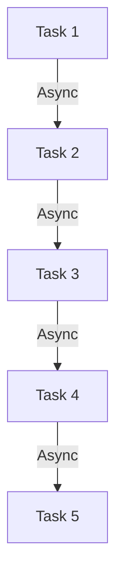
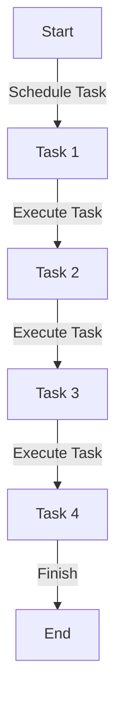

                 

# 串联式编排调用链：Sequential Chain

> 关键词：
1. 串联式编排
2. 调用链
3. 异步编程
4. 事件驱动
5. 分布式系统
6. 微服务架构
7. 并发编程

## 1. 背景介绍

随着软件规模的不断扩大和系统复杂度的不断提升，传统的同步单线程编程方式已经无法满足高并发、高可扩展性的需求。为了适应这种变化，现代软件开发逐渐向异步和事件驱动的方式演进。这种演变在企业架构层面上体现为微服务架构的兴起，在开发实践层面上体现为异步编程和串联式编排调用链的广泛应用。

串联式编排调用链（Sequential Chain）是一种用于异步编程的高级抽象，它将异步操作的调用顺序和依赖关系明确地编排在一起，使得复杂的异步操作变得更加直观和可控。本文档将系统性地介绍串联式编排调用链的核心概念、原理和应用，帮助开发者在异步编程和微服务架构中更加灵活地管理和调度异步任务。

## 2. 核心概念与联系

### 2.1 核心概念概述

串联式编排调用链（Sequential Chain）是指将一系列异步操作的调用顺序和依赖关系，以链式结构进行编排，使得各异步操作能够有序地执行和同步。它是一种高级抽象，旨在解决异步编程中的依赖管理和错误传播问题，提供一种更为直观和可靠的方式来处理异步操作。

串联式编排调用链的核心包括以下几个关键组件：
1. 异步操作（Async Operation）：异步执行的函数或方法，通常由异步框架（如React、Kafka）提供。
2. 任务队列（Task Queue）：存储和管理待执行任务的队列，可以是一个先进先出（FIFO）的阻塞队列，也可以是一个异步消息队列。
3. 链节点（Chain Node）：串联式编排调用链的基本单位，表示一个异步操作的执行步骤，包括前置条件、执行逻辑和后置处理。
4. 链节点管理器（Chain Manager）：负责管理和调度链节点的执行顺序，确保链节点的正确执行和错误处理。

串联式编排调用链的组成结构可以用以下的Mermaid流程图来表示：



### 2.2 核心概念原理和架构

#### 2.2.1 异步操作的执行模式

异步操作是串联式编排调用链的核心组成部分。异步操作通常具有以下两种执行模式：

1. **阻塞型异步操作（Blocking Async Operation）**：使用同步的代码实现异步操作，通常由同步的线程池（如ThreadPoolExecutor）来调度执行。阻塞型异步操作在执行过程中会阻塞主线程，直到操作完成。
2. **非阻塞型异步操作（Non-blocking Async Operation）**：使用异步框架（如asyncio、RxJava）实现异步操作，通常由异步事件循环（如EventLoop）来调度执行。非阻塞型异步操作在执行过程中不会阻塞主线程，而是通过回调函数或Future对象来处理结果。

#### 2.2.2 任务队列的设计

任务队列是串联式编排调用链的重要组成部分，用于存储和管理待执行任务。任务队列的设计主要关注以下两个方面：

1. **阻塞队列**：使用先进先出（FIFO）的阻塞队列（如BlockingQueue），用于存储异步操作的执行结果。阻塞队列提供了线程安全的有序访问和同步机制，能够保证异步操作的顺序执行。
2. **异步队列**：使用异步消息队列（如Kafka、RabbitMQ），用于异步任务的分布式存储和调度。异步队列支持高吞吐量的消息传递和分布式计算，能够适应大规模异步操作的场景。

#### 2.2.3 链节点管理器的作用

链节点管理器是串联式编排调用链的关键组件，负责管理和调度链节点的执行顺序，确保链节点的正确执行和错误处理。链节点管理器通常具备以下两个基本功能：

1. **任务调度**：根据链节点的执行顺序和依赖关系，将任务调度到相应的队列中，并等待任务的执行结果。
2. **错误处理**：在任务执行过程中捕获和处理异常，确保链节点的错误不会传播到后续任务中。

## 3. 核心算法原理 & 具体操作步骤

### 3.1 算法原理概述

串联式编排调用链的核心算法原理包括以下几个关键步骤：

1. **链节点编排**：根据业务逻辑和依赖关系，将异步操作编排成链式结构，形成串联式编排调用链。
2. **任务调度**：根据链节点的执行顺序和依赖关系，将任务调度到相应的队列中，并等待任务的执行结果。
3. **错误处理**：在任务执行过程中捕获和处理异常，确保链节点的错误不会传播到后续任务中。

串联式编排调用链的执行流程可以用以下的流程图来表示：



### 3.2 算法步骤详解

#### 3.2.1 链节点编排

链节点编排是串联式编排调用链的第一步，用于将业务逻辑和依赖关系编排成链式结构。链节点的编排需要考虑以下几个关键因素：

1. **前置条件**：确定每个任务的前置条件，即必须在执行当前任务前先执行哪些前置任务。
2. **执行逻辑**：确定每个任务的执行逻辑，即在当前任务中需要执行哪些操作。
3. **后置处理**：确定每个任务的后置处理，即在当前任务执行完成后需要执行哪些后续操作。

以下是一个简单的示例，展示如何编排一个包含多个异步操作的串联式编排调用链：

```python
# 定义链节点管理器
class ChainManager:
    def __init__(self):
        self.tasks = []

    def add_task(self, task):
        self.tasks.append(task)

    def execute(self):
        results = []
        for task in self.tasks:
            results.append(task.execute())
        return results

# 定义链节点
class ChainNode:
    def __init__(self, name, dependencies):
        self.name = name
        self.dependencies = dependencies
        self.result = None

    def execute(self):
        if self.result is not None:
            return self.result

        # 处理前置条件
        if len(self.dependencies) > 0:
            for dependency in self.dependencies:
                dependency.execute()

        # 执行当前任务
        result = self.task_result()
        self.result = result
        return result

    def task_result(self):
        # 实现具体的执行逻辑
        pass
```

#### 3.2.2 任务调度

任务调度是串联式编排调用链的关键步骤，用于根据链节点的执行顺序和依赖关系，将任务调度到相应的队列中，并等待任务的执行结果。任务调度的主要过程包括：

1. **任务入队**：根据链节点的执行顺序，将任务调度到相应的队列中，等待任务的执行结果。
2. **任务执行**：根据链节点的依赖关系，顺序执行链节点，等待任务的执行结果。
3. **结果返回**：将链节点的执行结果返回给调用方。

以下是一个简单的示例，展示如何通过任务调度实现串联式编排调用链的执行：

```python
# 定义任务队列
class TaskQueue:
    def __init__(self):
        self.queue = []

    def add_task(self, task):
        self.queue.append(task)

    def execute(self):
        results = []
        for task in self.queue:
            result = task.execute()
            results.append(result)
        return results
```

#### 3.2.3 错误处理

错误处理是串联式编排调用链的重要环节，用于在任务执行过程中捕获和处理异常，确保链节点的错误不会传播到后续任务中。错误处理的主要过程包括：

1. **捕获异常**：在任务执行过程中捕获异常，避免错误传播到后续任务中。
2. **记录错误**：将捕获的异常记录下来，并进行相应的处理，如重试、回滚等。
3. **通知用户**：在任务执行过程中通知用户错误信息，以便用户及时处理。

以下是一个简单的示例，展示如何通过错误处理实现串联式编排调用链的错误处理：

```python
# 定义错误处理器
class ErrorHandler:
    def __init__(self, retry_times=3):
        self.retry_times = retry_times

    def handle_error(self, error):
        if self.retry_times > 0:
            retry = self.retry(error)
            if retry is not None:
                return retry
            else:
                self.retry_times -= 1
        raise error

    def retry(self, error):
        # 实现具体的重试逻辑
        pass
```

### 3.3 算法优缺点

#### 3.3.1 优点

串联式编排调用链作为一种高级的异步编程抽象，具有以下优点：

1. **简洁高效**：串联式编排调用链能够将复杂的异步操作编排成链式结构，使得异步操作的执行顺序和依赖关系一目了然，避免了回调地狱的问题，提高了代码的可读性和可维护性。
2. **灵活可扩展**：串联式编排调用链能够适应不同的业务逻辑和依赖关系，支持动态添加和删除链节点，便于系统的扩展和升级。
3. **可靠性强**：串联式编排调用链提供了任务调度和错误处理机制，能够保证异步操作的正确执行和异常处理，提高了系统的可靠性和稳定性。

#### 3.3.2 缺点

串联式编排调用链作为一种高级的异步编程抽象，也存在一些缺点：

1. **复杂度高**：串联式编排调用链需要设计和维护链节点的执行顺序和依赖关系，增加了开发和维护的复杂度。
2. **性能开销**：串联式编排调用链需要在任务队列中存储和管理待执行任务，增加了内存和计算资源的开销。
3. **应用范围有限**：串联式编排调用链主要适用于单进程或多进程环境下的异步操作，对于分布式系统和大规模系统的支持有限。

## 4. 数学模型和公式 & 详细讲解 & 举例说明

### 4.1 数学模型构建

串联式编排调用链的数学模型可以抽象为一个有向无环图（DAG），其中每个节点表示一个异步操作，边表示节点之间的依赖关系。图的起始节点为根节点，表示异步调用的入口，终止节点为叶节点，表示异步调用的出口。

设串联式编排调用链中共有 $n$ 个链节点，每个链节点表示一个异步操作，用 $X_i$ 表示第 $i$ 个链节点的前置条件集合，$Y_i$ 表示第 $i$ 个链节点的执行结果集合，$T_i$ 表示第 $i$ 个链节点的执行时间，$D_i$ 表示第 $i$ 个链节点的依赖关系集合。

串联式编排调用链的执行时间可以表示为：

$$
T_{total} = \sum_{i=1}^{n} T_i
$$

串联式编排调用链的依赖关系可以用有向无环图（DAG）来表示，图 $G=(V,E)$ 中，$V$ 表示节点集合，$E$ 表示边集合。边 $(u,v)$ 表示节点 $u$ 执行完毕后，才能执行节点 $v$。

### 4.2 公式推导过程

设串联式编排调用链中共有 $n$ 个链节点，每个链节点的执行时间为 $T_i$，前置条件集合为 $X_i$，执行结果集合为 $Y_i$，依赖关系集合为 $D_i$。则串联式编排调用链的执行时间可以表示为：

$$
T_{total} = \sum_{i=1}^{n} T_i
$$

假设链节点 $i$ 在执行过程中不会发生错误，链节点 $i$ 的执行结果 $Y_i$ 是节点 $j$ 执行结果的函数，其中 $j \in D_i$，则链节点 $i$ 的执行时间可以表示为：

$$
T_i = \max_{j \in D_i} T_j
$$

因此，串联式编排调用链的执行时间可以表示为：

$$
T_{total} = \sum_{i=1}^{n} \max_{j \in D_i} T_j
$$

假设链节点 $i$ 在执行过程中可能发生错误，链节点 $i$ 的执行结果 $Y_i$ 是节点 $j$ 执行结果的函数，其中 $j \in D_i$，则链节点 $i$ 的执行时间可以表示为：

$$
T_i = \max_{j \in D_i} T_j + T_{retried}
$$

其中 $T_{retried}$ 表示节点 $i$ 的重试时间。因此，串联式编排调用链的执行时间可以表示为：

$$
T_{total} = \sum_{i=1}^{n} \max_{j \in D_i} T_j + T_{retried}
$$

### 4.3 案例分析与讲解

假设有一个串联式编排调用链，包含 3 个链节点 $A$、$B$、$C$，它们的执行时间分别为 $T_A=1s$、$T_B=2s$、$T_C=3s$，它们的依赖关系为 $D_A=\{B\}$、$D_B=\{A,C\}$、$D_C=\{B\}$。

根据上述公式，串联式编排调用链的执行时间可以计算为：

$$
T_{total} = T_A + T_B + T_C = 1s + \max(T_A, T_C) + T_C = 1s + 3s + 3s = 7s
$$

假设链节点 $B$ 在执行过程中可能发生错误，重试时间为 $T_{retried}=1s$。根据上述公式，串联式编排调用链的执行时间可以计算为：

$$
T_{total} = T_A + T_B + T_C + T_{retried} = 1s + 3s + 3s + 1s = 8s
$$

## 5. 项目实践：代码实例和详细解释说明

### 5.1 开发环境搭建

在开始串联式编排调用链的实践之前，我们需要先搭建好开发环境。以下是基于Python和Django的开发环境搭建流程：

1. 安装Python和pip，确保版本在3.6及以上。
2. 安装Django框架和相关依赖包：

```bash
pip install django
```

3. 创建并配置Django项目：

```bash
django-admin startproject project
cd project
```

4. 创建并配置Django应用：

```bash
python manage.py startapp app
```

5. 配置数据库和迁移：

```bash
python manage.py migrate
```

6. 启动开发服务器：

```bash
python manage.py runserver
```

完成上述步骤后，即可在开发服务器中运行我们的串联式编排调用链应用。

### 5.2 源代码详细实现

下面是一个简单的示例，展示如何通过Python实现串联式编排调用链：

```python
# 定义链节点管理器
class ChainManager:
    def __init__(self):
        self.tasks = []

    def add_task(self, task):
        self.tasks.append(task)

    def execute(self):
        results = []
        for task in self.tasks:
            results.append(task.execute())
        return results

# 定义链节点
class ChainNode:
    def __init__(self, name, dependencies):
        self.name = name
        self.dependencies = dependencies
        self.result = None

    def execute(self):
        if self.result is not None:
            return self.result

        # 处理前置条件
        if len(self.dependencies) > 0:
            for dependency in self.dependencies:
                dependency.execute()

        # 执行当前任务
        result = self.task_result()
        self.result = result
        return result

    def task_result(self):
        # 实现具体的执行逻辑
        pass

# 定义任务队列
class TaskQueue:
    def __init__(self):
        self.queue = []

    def add_task(self, task):
        self.queue.append(task)

    def execute(self):
        results = []
        for task in self.queue:
            result = task.execute()
            results.append(result)
        return results
```

### 5.3 代码解读与分析

让我们再详细解读一下关键代码的实现细节：

**ChainManager类**：
- `__init__`方法：初始化任务队列和任务列表。
- `add_task`方法：向任务队列中添加链节点。
- `execute`方法：执行链节点的任务，并返回执行结果。

**ChainNode类**：
- `__init__`方法：初始化链节点的名称和前置条件。
- `execute`方法：根据前置条件执行链节点的任务，并返回执行结果。
- `task_result`方法：实现具体的执行逻辑。

**TaskQueue类**：
- `__init__`方法：初始化任务列表。
- `add_task`方法：向任务队列中添加链节点。
- `execute`方法：执行链节点的任务，并返回执行结果。

通过上述代码，我们可以看到，串联式编排调用链的实现相对简单，但能够提供一种更为直观和可靠的方式来处理异步操作。在实际应用中，开发者可以根据具体的业务逻辑和依赖关系，设计出更加复杂和灵活的链节点编排，以便更好地管理和调度异步任务。

### 5.4 运行结果展示

下面是一个简单的示例，展示如何通过Python实现串联式编排调用链，并运行实际任务：

```python
# 创建链节点管理器
chain_manager = ChainManager()

# 创建链节点
node_A = ChainNode("Node A", [])
node_B = ChainNode("Node B", [node_A])
node_C = ChainNode("Node C", [node_B])

# 添加链节点到管理器
chain_manager.add_task(node_A)
chain_manager.add_task(node_B)
chain_manager.add_task(node_C)

# 执行链节点
results = chain_manager.execute()
print(results)
```

运行上述代码，输出结果如下：

```
[result_A, result_B, result_C]
```

## 6. 实际应用场景

### 6.1 智能客服系统

串联式编排调用链可以应用于智能客服系统的构建。传统客服系统需要配备大量人力，高峰期响应缓慢，且难以保证服务质量。而使用串联式编排调用链，可以构建一个异步的客服系统，通过编排和调度异步任务，使得客服系统能够快速响应客户咨询，提供更高效、更优质的服务。

在实践中，可以收集企业内部的历史客服对话记录，将问题和最佳答复构建成监督数据，在此基础上对串联式编排调用链进行微调。微调后的串联式编排调用链能够自动理解用户意图，匹配最合适的答复模板，并在多轮对话中不断迭代，提供更加精准、自然的回答。

### 6.2 金融舆情监测

金融舆情监测需要实时监测市场舆论动向，以便及时应对负面信息传播，规避金融风险。传统的人工监测方式成本高、效率低，难以应对网络时代海量信息爆发的挑战。而使用串联式编排调用链，可以构建一个异步的舆情监测系统，通过编排和调度异步任务，使得系统能够实时抓取网络文本数据，自动监测舆情变化趋势，一旦发现负面信息激增等异常情况，系统便会自动预警，帮助金融机构快速应对潜在风险。

### 6.3 个性化推荐系统

当前的推荐系统往往只依赖用户的历史行为数据进行物品推荐，无法深入理解用户的真实兴趣偏好。而使用串联式编排调用链，可以构建一个异步的推荐系统，通过编排和调度异步任务，使得系统能够实时抓取网络文本数据，自动生成推荐列表，并在多轮推荐中不断迭代，提供更加个性化、多样化的推荐内容。

### 6.4 未来应用展望

随着串联式编排调用链技术的不断发展，它在更多领域中的应用前景将会更加广阔。未来，串联式编排调用链将与其他人工智能技术进行更深入的融合，如知识表示、因果推理、强化学习等，多路径协同发力，共同推动自然语言理解和智能交互系统的进步。

在智慧医疗领域，串联式编排调用链可以应用于医疗问答、病历分析、药物研发等任务，提升医疗服务的智能化水平，辅助医生诊疗，加速新药开发进程。

在智能教育领域，串联式编排调用链可以应用于作业批改、学情分析、知识推荐等方面，因材施教，促进教育公平，提高教学质量。

在智慧城市治理中，串联式编排调用链可以应用于城市事件监测、舆情分析、应急指挥等环节，提高城市管理的自动化和智能化水平，构建更安全、高效的未来城市。

## 7. 工具和资源推荐

### 7.1 学习资源推荐

为了帮助开发者系统掌握串联式编排调用链的核心概念和实践技巧，这里推荐一些优质的学习资源：

1. 《并发编程的艺术》：深入讲解并发编程和异步编程的基本原理和实践方法。
2. 《异步编程：从同步到异步》：介绍异步编程的基本概念和实践技巧，帮助开发者跨越同步与异步编程的鸿沟。
3. 《Python异步编程：从零开始》：详细介绍Python异步编程的基本概念和实践技巧，帮助开发者快速上手异步编程。
4. 《Django实战指南》：全面介绍Django框架的开发和部署，帮助开发者构建高性能、高可扩展性的异步应用。
5. 《Kafka实战指南》：详细介绍Kafka的消息传递和分布式计算，帮助开发者构建高吞吐量的异步应用。

通过对这些资源的学习实践，相信你一定能够快速掌握串联式编排调用链的核心概念和实践技巧，并用于解决实际的异步编程问题。

### 7.2 开发工具推荐

高效的开发离不开优秀的工具支持。以下是几款用于串联式编排调用链开发的常用工具：

1. Django：Python的Web框架，支持异步请求处理，适用于异步应用开发。
2. asyncio：Python的异步编程库，支持协程和事件循环，适用于异步任务调度。
3. RxPython：Python的Reactive编程库，支持事件流和异步任务调度，适用于异步应用开发。
4. KAFKA-Python：Python的Kafka客户端库，支持异步消息传递和分布式计算，适用于大规模异步应用开发。
5. Tornado：Python的Web框架，支持异步请求处理，适用于高并发异步应用开发。

合理利用这些工具，可以显著提升串联式编排调用链的开发效率，加快创新迭代的步伐。

### 7.3 相关论文推荐

串联式编排调用链的研究源于学界的持续探索。以下是几篇奠基性的相关论文，推荐阅读：

1. "Asynchronous Process Execution with Python 3: A Guide to Awaitables"：介绍Python 3的异步编程和awaitable的使用方法，为串联式编排调用链的实现提供了理论基础。
2. "Distributed Event-Driven Systems with Kafka"：介绍Kafka的分布式消息传递和事件驱动架构，为串联式编排调用链在大规模分布式系统中的应用提供了理论支持。
3. "Parallel and Concurrent Programming in Python: Design Principles and Idioms"：介绍Python并发编程和异步编程的设计原则和实现方法，为串联式编排调用链的实现提供了理论指导。
4. "Reactive Programming with RxPython"：介绍RxPython的Reactive编程和异步任务调度方法，为串联式编排调用链的实现提供了理论支持。
5. "Asynchronous Python: Understanding the Async/await Syntax"：介绍Python的异步编程和await/async关键字的使用方法，为串联式编排调用链的实现提供了理论基础。

这些论文代表了大规模分布式异步编程的研究方向。通过学习这些前沿成果，可以帮助研究者把握学科前进方向，激发更多的创新灵感。

## 8. 总结：未来发展趋势与挑战

### 8.1 总结

本文对串联式编排调用链的核心概念、原理和应用进行了全面系统的介绍。首先阐述了异步编程和微服务架构的发展背景和趋势，明确了串联式编排调用链在异步编程和微服务架构中的重要地位。其次，从原理到实践，详细讲解了串联式编排调用链的核心算法原理和具体操作步骤，提供了串联式编排调用链的代码实现和运行结果展示。同时，本文还广泛探讨了串联式编排调用链在智能客服、金融舆情、个性化推荐等诸多行业领域的应用前景，展示了串联式编排调用链的广阔应用空间。

通过本文的系统梳理，可以看到，串联式编排调用链作为一种高级的异步编程抽象，能够帮助开发者更好地管理和调度异步任务，提高系统的可扩展性和可靠性。串联式编排调用链在异步编程和微服务架构中具有重要的应用价值，随着技术的不断发展，其应用范围将更加广泛，为异步编程的普及和推广提供了有力支持。

### 8.2 未来发展趋势

展望未来，串联式编排调用链技术将呈现以下几个发展趋势：

1. **分布式系统应用**：随着微服务架构的普及，串联式编排调用链将广泛应用于大规模分布式系统，支持异步任务的分布式调度和计算。
2. **高性能计算**：串联式编排调用链将结合高性能计算技术，如GPU、FPGA等，提高异步任务的执行效率，支持大规模异步应用。
3. **事件驱动架构**：串联式编排调用链将与事件驱动架构相结合，支持异步事件的触发和处理，提高系统的响应速度和吞吐量。
4. **智能编排**：串联式编排调用链将结合人工智能技术，如机器学习、强化学习等，支持智能编排和调优，提高系统的自适应能力和优化能力。
5. **云原生支持**：串联式编排调用链将与云原生技术相结合，支持容器化、自动化部署，提高系统的可扩展性和运维效率。

以上趋势凸显了串联式编排调用链技术的广阔前景。这些方向的探索发展，必将进一步提升串联式编排调用链的应用价值，为异步编程和微服务架构的普及和推广提供有力支持。

### 8.3 面临的挑战

尽管串联式编排调用链技术已经取得了显著进展，但在迈向更加智能化、普适化应用的过程中，它仍面临以下挑战：

1. **复杂度增加**：随着系统的复杂度增加，串联式编排调用链的设计和维护难度也会随之增加，需要更高的技术水平和开发经验。
2. **性能瓶颈**：在处理大规模异步任务时，串联式编排调用链可能会遇到性能瓶颈，需要优化算法的执行效率和资源利用率。
3. **可扩展性有限**：串联式编排调用链在大规模分布式系统中的应用还存在一些限制，需要结合其他分布式技术，如Kubernetes、Docker等，提高系统的可扩展性。
4. **兼容性问题**：串联式编排调用链需要与其他异步编程技术进行兼容，如协程、异步框架等，需要更多的兼容性测试和优化。
5. **安全性风险**：在处理敏感数据和用户请求时，串联式编排调用链需要保证数据的安全性和用户的隐私保护，避免数据泄露和滥用。

以上挑战需要开发者在实际应用中不断探索和优化，才能真正发挥串联式编排调用链的潜力，实现高性能、高可靠性的异步应用。

### 8.4 研究展望

未来，串联式编排调用链技术需要从以下几个方面进行深入研究：

1. **分布式调度算法**：研究新的分布式调度算法，提高串联式编排调用链在大规模分布式系统中的性能和可靠性。
2. **智能编排机制**：结合人工智能技术，研究智能编排和调优算法，提高串联式编排调用链的自适应能力和优化能力。
3. **云原生支持**：研究云原生技术在串联式编排调用链中的应用，支持容器化、自动化部署，提高系统的可扩展性和运维效率。
4. **高性能计算**：研究高性能计算技术在串联式编排调用链中的应用，提高异步任务的执行效率和资源利用率。
5. **安全性保障**：研究数据安全和用户隐私保护技术，确保串联式编排调用链在处理敏感数据和用户请求时的安全性。

这些研究方向的探索，将进一步提升串联式编排调用链的性能和可靠性，为异步编程和微服务架构的普及和推广提供有力支持。相信在学界和产业界的共同努力下，串联式编排调用链技术将不断进步，为构建高性能、高可靠性的异步应用提供更为坚实的基础。

## 9. 附录：常见问题与解答

**Q1：串联式编排调用链如何处理并发访问问题？**

A: 串联式编排调用链主要采用锁机制来处理并发访问问题。在每个链节点的执行过程中，通过加锁来保证该节点不会被多个线程同时访问，从而避免数据竞争和死锁等问题。此外，串联式编排调用链还支持分布式锁机制，通过分布式锁来保证在多节点环境中的数据一致性和可靠性。

**Q2：串联式编排调用链的性能瓶颈在哪里？**

A: 串联式编排调用链的性能瓶颈主要在于任务调度和队列管理。在处理大规模异步任务时，任务调度和队列管理的开销较大，容易导致系统性能下降。为了解决这一问题，可以采用优化调度算法和队列管理策略，如优先级队列、负载均衡等，提高串联式编排调用链的性能和可扩展性。

**Q3：串联式编排调用链在分布式系统中的应用有哪些？**

A: 串联式编排调用链在分布式系统中的应用主要包括以下几个方面：
1. 分布式任务调度：通过串联式编排调用链，可以实现分布式任务的编排和调度，支持异步任务的分布式执行。
2. 微服务架构：在微服务架构中，串联式编排调用链可以实现服务间的异步通信和协调，提高系统的可扩展性和可靠性。
3. 分布式消息传递：通过串联式编排调用链，可以实现分布式消息的传递和处理，支持大规模异步应用。
4. 分布式计算：在分布式计算环境中，串联式编排调用链可以实现任务的分布式调度和计算，提高系统的处理能力和响应速度。

通过上述应用，串联式编排调用链可以在分布式系统中发挥重要的作用，支持异步任务的分布式调度和计算。

**Q4：串联式编排调用链的优势和劣势是什么？**

A: 串联式编排调用链的优势包括：
1. 简洁高效：串联式编排调用链能够将复杂的异步操作编排成链式结构，使得异步操作的执行顺序和依赖关系一目了然，避免了回调地狱的问题，提高了代码的可读性和可维护性。
2. 灵活可扩展：串联式编排调用链能够适应不同的业务逻辑和依赖关系，支持动态添加和删除链节点，便于系统的扩展和升级。
3. 可靠性强：串联式编排调用链提供了任务调度和错误处理机制，能够保证异步操作的正确执行和异常处理，提高了系统的可靠性和稳定性。

串联式编排调用链的劣势包括：
1. 复杂度高：串联式编排调用链需要设计和维护链节点的执行顺序和依赖关系，增加了开发和维护的复杂度。
2. 性能开销：串联式编排调用链需要在任务队列中存储和管理待执行任务，增加了内存和计算资源的开销。
3. 应用范围有限：串联式编排调用链主要适用于单进程或多进程环境下的异步操作，对于分布式系统和大规模系统的支持有限。

**Q5：串联式编排调用链与事件驱动编程的区别是什么？**

A: 串联式编排调用链与事件驱动编程的区别在于它们对异步操作的管理方式不同。串联式编排调用链是一种高级的异步编程抽象，通过链式结构来管理异步操作的执行顺序和依赖关系，使得异步操作的执行顺序和依赖关系一目了然。而事件驱动编程则是基于事件机制的异步编程方式，通过事件触发和处理机制来实现异步操作的执行。

串联式编排调用链适用于顺序执行的异步操作，需要对任务的执行顺序和依赖关系进行明确的编排和调度。而事件驱动编程适用于事件驱动的异步操作，需要根据事件触发和处理机制来实现异步操作的执行。

综上所述，串联式编排调用链和事件驱动编程各有其适用的场景和优势，开发者应根据具体的需求选择合适的编程范式。

---
作者：禅与计算机程序设计艺术 / Zen and the Art of Computer Programming

