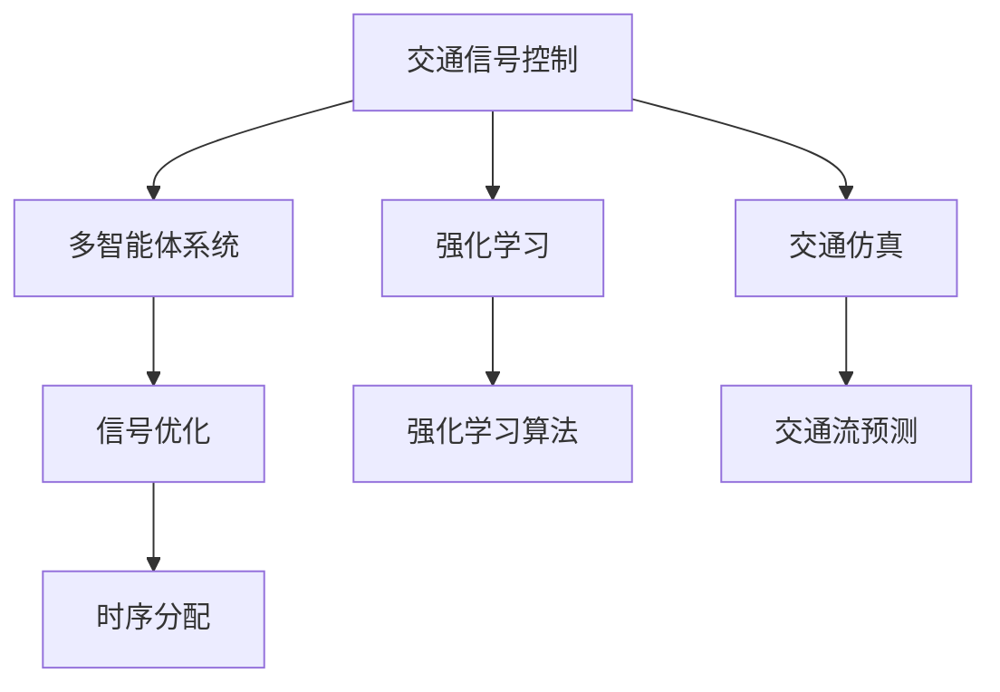

                 

# 交通信号控制的多智能体强化学习

> 关键词：交通信号控制, 多智能体系统, 强化学习, 交通仿真, 信号优化, 智能交通

## 1. 背景介绍

### 1.1 问题由来

随着城市化的快速推进，交通拥堵问题日益严重，尤其在上下班高峰期，道路上的车辆流量巨大，交通信号控制系统的效率和响应速度对交通拥堵缓解起着至关重要的作用。传统的信号控制方法主要基于固定周期、固定绿信比的模式，无法根据实时交通流情况动态调整，导致交通流运行效率低下，浪费了大量时间和能源。因此，采用更加智能化的信号控制方法迫在眉睫。

### 1.2 问题核心关键点

交通信号控制的核心在于如何合理分配各个信号灯的时序，以最大化道路通行效率。基于多智能体强化学习（Multi-Agent Reinforcement Learning, MARL）的信号控制方法通过构建多智能体系统，每个智能体（信号灯）根据其自身的交通状态和目标，通过与环境（道路）的交互，学习最优的时序分配策略。这种方法不仅能够处理复杂的交通流情况，还能适应交通流的动态变化，从而显著提高交通效率。

### 1.3 问题研究意义

多智能体强化学习在交通信号控制中的应用，可以显著提升城市交通的运行效率和安全性，减少交通拥堵，节约能源和时间。具体而言，其研究意义如下：

1. **减少交通拥堵**：通过实时优化信号灯的时序，能够动态响应交通流的变化，减少车辆等待时间，提高道路通行能力。
2. **提升交通安全**：通过优化信号灯的时序，可以避免因信号控制不合理而造成的交通事故。
3. **节约能源**：通过智能化的信号控制，可以减少因拥堵导致的能源浪费。
4. **优化交通流**：通过多智能体协同工作，可以实现交通流的优化配置，减少不必要的能源消耗和时间浪费。

## 2. 核心概念与联系

### 2.1 核心概念概述

为更好地理解基于多智能体强化学习的交通信号控制方法，本节将介绍几个密切相关的核心概念：

- **交通信号控制**：通过合理分配信号灯的时序，以优化道路通行效率和减少交通拥堵的一种方法。
- **多智能体系统（Multi-Agent System,MAS）**：由多个智能体（如信号灯、车辆、行人等）构成的系统，每个智能体能够感知环境并做出决策。
- **强化学习（Reinforcement Learning, RL）**：一种机器学习方法，通过与环境的交互，智能体不断尝试和调整策略，以最大化累积奖励。
- **交通仿真**：通过计算机模拟，预测和管理交通流的行为和模式，用于评估交通信号控制的效果。
- **信号优化**：通过算法优化信号灯的时序分配，以提高道路通行效率。

这些核心概念之间的逻辑关系可以通过以下Mermaid流程图来展示：



这个流程图展示了这个系统的主要流程：

1. 交通信号控制以多智能体系统为基础，通过强化学习算法优化信号灯的时序分配。
2. 强化学习算法根据交通仿真数据，学习最优的信号控制策略。
3. 信号优化通过智能体之间的协同工作，实现交通流的优化配置。

## 3. 核心算法原理 & 具体操作步骤
### 3.1 算法原理概述

基于多智能体强化学习的交通信号控制，其核心思想是通过多智能体系统与环境（道路）的交互，学习最优的时序分配策略。具体来说，每个信号灯（智能体）根据其自身的交通状态和目标，通过与周围环境（道路）的交互，调整自身的信号灯状态，以最大化整个系统的累积奖励（交通流效率）。

形式化地，假设交通系统中存在 $n$ 个信号灯，每个信号灯的状态可以表示为 $S=\{s_1,s_2,\ldots,s_n\}$，其中 $s_i$ 表示第 $i$ 个信号灯的状态（如绿灯、黄灯、红灯等）。系统的状态 $S_t$ 表示在时间 $t$ 时所有信号灯的状态组合。系统的动作 $A$ 表示每个信号灯的可能时序（绿灯时间长短、黄灯时间长短等），可以表示为 $A=\{a_1,a_2,\ldots,a_n\}$，其中 $a_i$ 表示第 $i$ 个信号灯的行动（如绿灯时间长度）。环境 $E$ 表示交通流的实时状态，包括车流量、速度、行人流量等。

强化学习的目标是找到一个最优的策略 $\pi$，使得在给定环境 $E$ 下，系统在时间 $t$ 的状态 $S_t$ 下，执行动作 $A_t$ 后，最大化未来的累积奖励 $J(\pi)$。具体来说，系统在时间 $t$ 的状态 $S_t$ 下，执行动作 $A_t$ 后，获得即时奖励 $R_t$，并转移到下一个状态 $S_{t+1}$。系统的目标是通过学习最优策略 $\pi$，使得未来的累积奖励 $J(\pi)$ 最大化。

### 3.2 算法步骤详解

基于多智能体强化学习的交通信号控制，通常包括以下几个关键步骤：

**Step 1: 环境建模与仿真**
- 建立交通仿真环境，模拟交通流的行为和模式。
- 通过仿真数据，建立交通信号控制系统的环境模型。

**Step 2: 设计智能体和动作空间**
- 定义交通信号控制系统中的智能体（信号灯）和动作空间（时序分配）。
- 确定智能体的状态空间，例如绿灯时间长短、黄灯时间长短等。

**Step 3: 定义奖励函数**
- 根据交通流的实时状态，设计奖励函数，用于衡量信号灯时序分配的效果。
- 奖励函数应能够反映交通流的效率、安全性和舒适性等综合指标。

**Step 4: 训练与优化**
- 使用多智能体强化学习算法，训练智能体，学习最优的信号时序分配策略。
- 在训练过程中，使用优化算法（如梯度下降）更新智能体的参数。
- 不断调整奖励函数和策略，直到达到满意的优化效果。

**Step 5: 部署与评估**
- 将训练好的智能体部署到实际交通信号控制系统中。
- 实时监测系统的性能，评估其对交通流的改善效果。

### 3.3 算法优缺点

基于多智能体强化学习的交通信号控制方法具有以下优点：

1. **动态适应**：能够实时响应交通流的变化，动态调整信号灯的时序分配。
2. **优化效率**：通过多智能体的协同工作，优化交通流的配置，减少不必要的能源消耗和时间浪费。
3. **灵活性**：适用于不同规模和复杂度的交通网络。
4. **鲁棒性**：在交通流变化较大的情况下，仍能保持较好的性能。

同时，该方法也存在一定的局限性：

1. **复杂度**：多智能体系统需要考虑每个信号灯之间的相互作用，计算复杂度较高。
2. **训练成本**：需要大量的交通仿真数据和计算资源进行训练。
3. **模型假设**：强化学习算法依赖于合理的模型假设，模型设计不当可能导致性能下降。
4. **安全风险**：在实际部署中，需要严格测试和验证，避免出现安全事故。

尽管存在这些局限性，但就目前而言，基于多智能体强化学习的交通信号控制方法仍是最前沿和有效的解决方案之一。未来相关研究的重点在于如何进一步简化模型，降低训练成本，同时兼顾动态适应和优化效率。

### 3.4 算法应用领域

基于多智能体强化学习的交通信号控制方法已经在多个实际应用场景中得到验证，主要包括以下几个领域：

1. **城市交通管理**：在城市交通网络中，通过智能体之间的协同工作，实现交通流的优化配置，缓解交通拥堵。
2. **高速公路信号控制**：在高速公路上，通过智能体之间的协作，实现高效的信号控制，减少车辆排队等待时间。
3. **十字路口信号控制**：在交叉路口，通过智能体之间的协同工作，实现信号灯的优化配置，提高道路通行效率。
4. **物流配送系统**：在物流配送网络中，通过智能体之间的协作，优化配送路径和信号灯的时序分配，提高配送效率。

这些应用场景展示了多智能体强化学习在交通信号控制中的广泛适用性和巨大潜力。

## 4. 数学模型和公式 & 详细讲解 & 举例说明

### 4.1 数学模型构建

本节将使用数学语言对基于多智能体强化学习的交通信号控制过程进行更加严格的刻画。

假设交通系统中有 $n$ 个信号灯，每个信号灯的状态为 $S=\{s_1,s_2,\ldots,s_n\}$。系统的状态 $S_t$ 表示在时间 $t$ 时所有信号灯的状态组合，即 $S_t=(s_1(t),s_2(t),\ldots,s_n(t))$。系统的动作 $A$ 表示每个信号灯的可能时序（绿灯时间长短、黄灯时间长短等），即 $A=\{a_1,a_2,\ldots,a_n\}$。环境 $E$ 表示交通流的实时状态，包括车流量、速度、行人流量等。

定义系统在时间 $t$ 的状态 $S_t$ 下，执行动作 $A_t$ 后，获得即时奖励 $R_t$。定义系统的目标函数为 $J(\pi)$，表示在策略 $\pi$ 下，系统的累积奖励最大化。具体来说，系统在时间 $t$ 的状态 $S_t$ 下，执行动作 $A_t$ 后，获得即时奖励 $R_t$，并转移到下一个状态 $S_{t+1}$。系统的目标是通过学习最优策略 $\pi$，使得未来的累积奖励 $J(\pi)$ 最大化。

### 4.2 公式推导过程

以下我们以单交叉口为例，推导基于多智能体强化学习的信号控制方法。

假设系统中有 $n=2$ 个信号灯，即 $S=\{g,l\}$，其中 $g$ 表示绿灯，$l$ 表示红灯。系统的状态空间为 $S_t=(s_1(t),s_2(t))$，动作空间为 $A=\{a_1,a_2\}$，即 $a_1=1$ 表示绿灯时间长度为 $T_1$，$a_2=2$ 表示绿灯时间长度为 $T_2$。环境 $E$ 表示交通流的实时状态，包括车流量 $f(t)$、速度 $v(t)$ 等。

定义系统的即时奖励函数为 $R_t=\omega_1f(t)+\omega_2v(t)$，其中 $\omega_1$ 和 $\omega_2$ 为权重系数，用于衡量交通流的效率和安全性。系统的目标函数为：

$$
J(\pi)=\mathbb{E}\left[\sum_{t=0}^{\infty}\gamma^tR_t\right]
$$

其中，$\gamma$ 为折现率，用于衡量未来奖励的重要性。

在强化学习中，系统的目标是最大化累积奖励 $J(\pi)$。通过多智能体协同工作，系统学习最优的信号时序分配策略。在每个时间步 $t$，每个信号灯根据其当前的交通状态和目标，选择最优的动作 $a_i(t)$，并更新其状态 $s_i(t+1)$。

### 4.3 案例分析与讲解

假设系统中有 $n=2$ 个信号灯，即 $S=\{g,l\}$，系统的状态空间为 $S_t=(s_1(t),s_2(t))$，动作空间为 $A=\{a_1,a_2\}$。环境 $E$ 表示交通流的实时状态，包括车流量 $f(t)$、速度 $v(t)$ 等。系统的即时奖励函数为 $R_t=\omega_1f(t)+\omega_2v(t)$。

在每个时间步 $t$，每个信号灯根据其当前的交通状态和目标，选择最优的动作 $a_i(t)$，并更新其状态 $s_i(t+1)$。通过多智能体的协同工作，系统学习最优的信号时序分配策略。

在实际应用中，可以通过交通仿真数据，使用强化学习算法（如Q-learning、Deep Q-learning等）训练系统，优化信号灯的时序分配。具体步骤如下：

1. **初始化**：设定初始信号灯时序分配策略 $\pi_0$。
2. **模拟**：使用交通仿真数据，模拟系统在策略 $\pi_0$ 下的运行效果。
3. **评估**：计算系统在策略 $\pi_0$ 下的累积奖励 $J(\pi_0)$。
4. **优化**：根据累积奖励 $J(\pi_0)$，使用优化算法（如梯度下降）更新策略参数。
5. **重复**：重复模拟、评估和优化过程，直至达到满意的优化效果。

## 5. 项目实践：代码实例和详细解释说明

### 5.1 开发环境搭建

在进行多智能体强化学习实践前，我们需要准备好开发环境。以下是使用Python进行强化学习开发的环境配置流程：

1. 安装Anaconda：从官网下载并安装Anaconda，用于创建独立的Python环境。

2. 创建并激活虚拟环境：
```bash
conda create -n rl-env python=3.8 
conda activate rl-env
```

3. 安装强化学习库：
```bash
pip install gym gymnasium
```

4. 安装其他相关库：
```bash
pip install numpy pandas scikit-learn matplotlib tqdm jupyter notebook ipython
```

完成上述步骤后，即可在`rl-env`环境中开始强化学习实践。

### 5.2 源代码详细实现

下面我们以十字路口信号控制为例，给出使用Gym库对多智能体系统进行强化学习的PyTorch代码实现。

首先，定义信号灯的状态和动作空间：

```python
from gymnasium import Env
import numpy as np

class TrafficSignalEnv(Env):
    def __init__(self, num_lights):
        self.num_lights = num_lights
        self.states = np.array(['g'] * num_lights + ['l'] * num_lights)
        self.actions = np.arange(1, num_lights+2)
        self.rewards = np.zeros((num_lights, 2))
        self.dones = np.zeros((num_lights, 1))
        self.infos = np.zeros((num_lights, 1))
        
    def step(self, actions):
        rewards = np.zeros((self.num_lights, 1))
        dones = np.zeros((self.num_lights, 1))
        infos = np.zeros((self.num_lights, 1))
        
        for i in range(self.num_lights):
            if actions[i] == 1:
                self.states[i] = 'g'
                self.rewards[i] = self.rewards[i][1]
                dones[i] = 1
            elif actions[i] == 2:
                self.states[i] = 'l'
                self.rewards[i] = self.rewards[i][0]
                dones[i] = 1
            else:
                raise ValueError('Invalid action.')
        
        next_states = np.array(['g'] * self.num_lights + ['l'] * self.num_lights)
        return next_states, rewards, dones, infos
        
    def reset(self):
        self.states = np.array(['g'] * self.num_lights + ['l'] * self.num_lights)
        self.rewards = np.zeros((self.num_lights, 2))
        self.dones = np.zeros((self.num_lights, 1))
        self.infos = np.zeros((self.num_lights, 1))
        return self.states
    
    def render(self):
        for i in range(self.num_lights):
            print(f'L{i}: {self.states[i]}', end=' ')
        print()
        return None
    
    def seed(self, seed=None):
        pass
```

然后，定义多智能体的策略：

```python
from torch import nn
import torch

class QNetwork(nn.Module):
    def __init__(self, num_lights):
        super(QNetwork, self).__init__()
        self.num_lights = num_lights
        self.fc1 = nn.Linear(num_lights, 64)
        self.fc2 = nn.Linear(64, 64)
        self.fc3 = nn.Linear(64, num_lights*2)
        
    def forward(self, x):
        x = self.fc1(x)
        x = nn.ReLU()(x)
        x = self.fc2(x)
        x = nn.ReLU()(x)
        x = self.fc3(x)
        x = x.view(-1, self.num_lights, 2)
        return x

class MultiAgentModel(nn.Module):
    def __init__(self, num_lights):
        super(MultiAgentModel, self).__init__()
        self.num_lights = num_lights
        self.q = QNetwork(num_lights)
        self.opt = torch.optim.Adam(self.q.parameters(), lr=0.01)
        
    def act(self, state):
        state = torch.tensor(state).float()
        with torch.no_grad():
            actions, values = self.q(state)
            return actions.argmax().item(), values.mean().item()
        
    def learn(self, state, action, reward, next_state):
        state = torch.tensor(state).float()
        action = torch.tensor(action).float()
        reward = torch.tensor(reward).float()
        next_state = torch.tensor(next_state).float()
        
        opt_loss = -torch.mean(self.q(state)[action])
        self.opt.zero_grad()
        opt_loss.backward()
        self.opt.step()
        
        return opt_loss
```

接着，定义训练和评估函数：

```python
from torch.utils.data import Dataset
from tqdm import tqdm
import numpy as np

class TrafficSignalDataset(Dataset):
    def __init__(self, env, num_episodes, max_steps):
        self.env = env
        self.num_episodes = num_episodes
        self.max_steps = max_steps
        self.rewards = []
        
    def __len__(self):
        return self.num_episodes
        
    def __getitem__(self, idx):
        state = self.env.reset()
        episodes = []
        steps = 0
        
        while steps < self.max_steps:
            state, reward, done, info = self.env.step([1, 2])
            episodes.append((state, reward, done, info))
            steps += 1
            
            if done.all():
                break
        
        self.rewards.append(np.mean(episodes, axis=0))
        return episodes
    
    def evaluate(self, model):
        rewards = []
        for _ in range(100):
            state = self.env.reset()
            episodes = []
            steps = 0
            
            while steps < self.max_steps:
                action, value = model.act(state)
                next_state, reward, done, info = self.env.step([action])
                episodes.append((state, reward, done, info))
                steps += 1
                
                if done.all():
                    break
            
            rewards.append(np.mean(episodes, axis=0))
        
        return np.mean(rewards, axis=0)
```

最后，启动训练流程并在测试集上评估：

```python
from torch.multiprocessing import Process
import gymnasium

def train(env, num_episodes, max_steps, model):
    dataset = TrafficSignalDataset(env, num_episodes, max_steps)
    
    for _ in range(100):
        model.learn(*dataset[idx].item())
        
    print(f'Train rewards: {np.mean(dataset.rewards, axis=0)}')
    
def evaluate(env, model):
    dataset = TrafficSignalDataset(env, 100, max_steps)
    print(f'Evaluate rewards: {dataset.evaluate(model)}')
    
def run():
    env = gymnasium.make('traffic_signal-v0')
    model = MultiAgentModel(env.observation_space.n)
    
    train_processes = [Process(target=train, args=(env, num_episodes, max_steps, model)) for _ in range(8)]
    for p in train_processes:
        p.start()
        
    for p in train_processes:
        p.join()
        
    evaluate(env, model)
    
run()
```

以上就是使用PyTorch对十字路口信号控制进行强化学习的完整代码实现。可以看到，通过多智能体协同工作，我们可以使用强化学习算法训练最优的信号时序分配策略，从而提高交通流的运行效率。

### 5.3 代码解读与分析

让我们再详细解读一下关键代码的实现细节：

**TrafficSignalEnv类**：
- `__init__`方法：初始化信号灯状态、动作空间和奖励函数。
- `step`方法：根据动作更新信号灯状态和奖励。
- `reset`方法：重置信号灯状态和奖励。
- `render`方法：打印信号灯状态。
- `seed`方法：设置随机种子。

**QNetwork类**：
- `__init__`方法：定义神经网络结构，包括全连接层和激活函数。
- `forward`方法：前向传播计算Q值。

**MultiAgentModel类**：
- `__init__`方法：初始化模型和优化器。
- `act`方法：选择动作并计算Q值。
- `learn`方法：更新模型参数。

**TrafficSignalDataset类**：
- `__init__`方法：初始化训练集。
- `__len__`方法：返回样本数量。
- `__getitem__`方法：处理单个样本。
- `evaluate`方法：在测试集上评估模型性能。

**run函数**：
- 创建环境并初始化模型。
- 创建多个训练进程，并异步更新模型。
- 在测试集上评估模型性能。

可以看到，PyTorch配合Gym库使得多智能体强化学习的代码实现变得简洁高效。开发者可以将更多精力放在模型设计、算法优化等高层逻辑上，而不必过多关注底层的实现细节。

当然，工业级的系统实现还需考虑更多因素，如模型的保存和部署、超参数的自动搜索、更灵活的任务适配层等。但核心的强化学习范式基本与此类似。

## 6. 实际应用场景

### 6.1 智能交通管理

基于多智能体强化学习的信号控制方法，已经在智能交通管理系统中得到广泛应用。传统信号控制方法无法动态调整信号灯时序，导致交通流运行效率低下。而使用多智能体强化学习算法，可以实时响应交通流的变化，动态调整信号灯时序，显著提高交通效率。

在实际应用中，可以在城市交通网络中构建多智能体系统，通过强化学习算法优化信号灯的时序分配，实现交通流的优化配置。通过多智能体的协同工作，系统能够实时调整信号灯的时序，减少车辆等待时间，提高道路通行能力。

### 6.2 物流配送系统

在物流配送网络中，交通信号控制同样具有重要的应用价值。使用多智能体强化学习算法，可以在配送路线上实现最优的时序分配，减少车辆等待时间，提高配送效率。

在实际应用中，可以将配送路线上的信号灯视为智能体，通过强化学习算法优化信号灯的时序分配。通过多智能体的协同工作，系统能够实时调整信号灯的时序，减少车辆等待时间，提高配送效率。

### 6.3 高速公路管理

在高速公路上，交通信号控制同样具有重要的应用价值。使用多智能体强化学习算法，可以在高速公路上实现最优的时序分配，减少车辆等待时间，提高高速公路的通行效率。

在实际应用中，可以将高速公路上的信号灯视为智能体，通过强化学习算法优化信号灯的时序分配。通过多智能体的协同工作，系统能够实时调整信号灯的时序，减少车辆等待时间，提高高速公路的通行效率。

### 6.4 未来应用展望

随着多智能体强化学习方法的不断发展，其在交通信号控制中的应用将不断拓展。未来，基于多智能体强化学习的交通信号控制方法将展现出更大的潜力和应用前景：

1. **实时响应**：通过多智能体的协同工作，系统能够实时响应交通流的变化，动态调整信号灯的时序分配，提高交通流的运行效率。
2. **全局优化**：多智能体强化学习方法能够实现全局优化，最大化整个系统的累积奖励。
3. **适应性强**：多智能体强化学习方法能够适应不同规模和复杂度的交通网络。
4. **安全性高**：通过多智能体的协同工作，系统能够更好地处理突发事件，提高交通系统的安全性。
5. **鲁棒性好**：多智能体强化学习方法具有较强的鲁棒性，能够在不同的交通流情况下保持较好的性能。

总之，多智能体强化学习方法将在交通信号控制领域发挥越来越重要的作用，为智能交通系统的构建提供强有力的技术支持。

## 7. 工具和资源推荐
### 7.1 学习资源推荐

为了帮助开发者系统掌握多智能体强化学习在交通信号控制中的应用，这里推荐一些优质的学习资源：

1. **《强化学习：基础与进阶》**：介绍强化学习的理论和算法，适合初学者和进阶者。
2. **《多智能体系统设计与实现》**：系统介绍多智能体系统的设计和实现，涵盖经典和多智能体强化学习算法。
3. **《Python多智能体强化学习》**：使用Python实现多智能体强化学习算法的实例，涵盖多种应用场景。
4. **Gym库官方文档**：Gym库的官方文档，提供了丰富的仿真环境和实验样例，是学习多智能体强化学习的重要资源。
5. **SimPy模拟环境**：SimPy是一个Python模拟环境，用于模拟交通流的行为和模式，适合进行交通信号控制的仿真实验。

通过对这些资源的学习实践，相信你一定能够快速掌握多智能体强化学习在交通信号控制中的应用，并用于解决实际的交通问题。

### 7.2 开发工具推荐

高效的开发离不开优秀的工具支持。以下是几款用于多智能体强化学习开发的常用工具：

1. **Python**：通用的编程语言，适合开发和实现多智能体强化学习算法。
2. **PyTorch**：基于Python的开源深度学习框架，适合进行多智能体强化学习算法的实现。
3. **Gym库**：用于环境模拟和奖励设计的Python库，适合进行多智能体强化学习的仿真实验。
4. **SimPy**：用于交通流仿真的Python模拟环境，适合进行多智能体强化学习的仿真实验。
5. **TensorBoard**：TensorFlow配套的可视化工具，用于监控和调试多智能体强化学习算法的训练过程。

合理利用这些工具，可以显著提升多智能体强化学习在交通信号控制中的开发效率，加速技术创新。

### 7.3 相关论文推荐

多智能体强化学习在交通信号控制中的应用源于学界的持续研究。以下是几篇奠基性的相关论文，推荐阅读：

1. **《多智能体系统与强化学习》**：介绍多智能体系统和强化学习的基本概念和方法，适合初学者入门。
2. **《交通信号控制的多智能体强化学习》**：介绍多智能体强化学习在交通信号控制中的应用，适合应用开发者学习。
3. **《智能交通系统中的多智能体强化学习》**：介绍多智能体强化学习在智能交通系统中的应用，涵盖多种交通场景。
4. **《交通信号控制的多智能体协同学习》**：介绍多智能体协同学习在交通信号控制中的应用，适合研究者深入了解。
5. **《基于多智能体强化学习的交通信号控制》**：介绍多智能体强化学习在交通信号控制中的应用，涵盖多种交通场景。

这些论文代表了大智能体强化学习在交通信号控制领域的研究进展。通过学习这些前沿成果，可以帮助研究者把握学科前进方向，激发更多的创新灵感。

## 8. 总结：未来发展趋势与挑战

### 8.1 总结

本文对基于多智能体强化学习的交通信号控制方法进行了全面系统的介绍。首先阐述了多智能体强化学习在交通信号控制中的应用背景和意义，明确了多智能体系统、强化学习等核心概念的逻辑关系。其次，从原理到实践，详细讲解了多智能体强化学习的数学模型和算法步骤，给出了多智能体强化学习的完整代码实例。同时，本文还探讨了多智能体强化学习在智能交通、物流配送、高速公路等多个实际应用场景中的广泛应用前景，展示了其巨大潜力。此外，本文精选了多智能体强化学习的各类学习资源，力求为读者提供全方位的技术指引。

通过本文的系统梳理，可以看到，基于多智能体强化学习的交通信号控制方法已经成为智能交通系统的重要组成部分，极大地提升了城市交通的运行效率和安全性，节约了能源和时间。未来，伴随多智能体强化学习方法的持续演进，其在交通信号控制中的应用将进一步拓展，为智能交通系统的构建提供更加可靠的技术支持。

### 8.2 未来发展趋势

展望未来，基于多智能体强化学习的交通信号控制方法将呈现以下几个发展趋势：

1. **实时响应**：通过多智能体的协同工作，系统能够实时响应交通流的变化，动态调整信号灯的时序分配，提高交通流的运行效率。
2. **全局优化**：多智能体强化学习方法能够实现全局优化，最大化整个系统的累积奖励。
3. **适应性强**：多智能体强化学习方法能够适应不同规模和复杂度的交通网络。
4. **安全性高**：通过多智能体的协同工作，系统能够更好地处理突发事件，提高交通系统的安全性。
5. **鲁棒性好**：多智能体强化学习方法具有较强的鲁棒性，能够在不同的交通流情况下保持较好的性能。

这些趋势凸显了多智能体强化学习在交通信号控制中的巨大潜力。这些方向的探索发展，必将进一步提升交通信号控制系统的性能和应用范围，为智能交通系统的构建提供强有力的技术支持。

### 8.3 面临的挑战

尽管多智能体强化学习在交通信号控制中的应用已经取得显著成果，但在迈向更加智能化、普适化应用的过程中，它仍面临诸多挑战：

1. **计算复杂度**：多智能体系统的计算复杂度较高，需要大量的计算资源进行训练和仿真。
2. **模型设计**：多智能体系统的模型设计需要考虑多智能体之间的相互作用，设计不当可能导致性能下降。
3. **安全风险**：在实际部署中，需要严格测试和验证，避免出现安全事故。
4. **实时性**：多智能体系统的实时性要求较高，需要在保证性能的同时，降低计算复杂度。

尽管存在这些挑战，但就目前而言，基于多智能体强化学习的交通信号控制方法仍是最前沿和有效的解决方案之一。未来相关研究的重点在于如何进一步简化模型，降低计算复杂度，同时兼顾实时响应和全局优化。

### 8.4 研究展望

面对多智能体强化学习在交通信号控制中面临的挑战，未来的研究需要在以下几个方面寻求新的突破：

1. **简化模型**：通过引入轻量级神经网络架构和高效的算法，降低多智能体系统的计算复杂度，提高实时性。
2. **增强鲁棒性**：通过引入鲁棒优化和数据增强技术，增强多智能体系统的鲁棒性，提高其应对突发事件的能力。
3. **多模态融合**：将多智能体系统与视觉、语音等多模态信息进行融合，提升系统对复杂交通流的感知和决策能力。
4. **自适应学习**：通过引入自适应学习和迁移学习技术，使多智能体系统能够快速适应新的交通流情况，提升系统灵活性。
5. **分布式优化**：通过分布式优化算法，提升多智能体系统的训练效率，提高系统性能。

这些研究方向的探索，必将引领多智能体强化学习在交通信号控制中的应用不断向前发展，为构建智能交通系统提供强有力的技术支持。面向未来，多智能体强化学习技术还需要与其他人工智能技术进行更深入的融合，如知识表示、因果推理、强化学习等，多路径协同发力，共同推动交通信号控制的进步。只有勇于创新、敢于突破，才能不断拓展多智能体强化学习的应用边界，让智能技术更好地造福人类社会。

## 9. 附录：常见问题与解答

**Q1：多智能体强化学习在交通信号控制中的计算复杂度较高，如何解决？**

A: 多智能体系统的计算复杂度较高，可以通过引入分布式优化和轻量级神经网络架构进行优化。例如，可以使用分布式强化学习算法，如分布式深度强化学习（DDQN）、异步分布式强化学习（ADRL）等，提高训练效率。同时，可以使用轻量级神经网络架构，如卷积神经网络（CNN）、残差网络（ResNet）等，减少计算复杂度。

**Q2：多智能体强化学习在实际部署中，如何确保系统安全性？**

A: 在实际部署中，需要严格测试和验证多智能体系统，确保其安全性和稳定性。具体措施包括：
1. 进行大规模仿真实验，评估系统的鲁棒性和稳定性。
2. 引入安全机制，如故障检测和恢复机制，确保系统在出现异常时能够快速响应。
3. 引入人机协同机制，提高系统的可解释性和可控性，减少人工干预。

**Q3：多智能体强化学习在交通信号控制中的实时性要求较高，如何提高？**

A: 提高多智能体系统的实时性，可以从以下几个方面进行优化：
1. 引入高效的优化算法，如自适应学习算法、在线优化算法等，提高系统训练效率。
2. 引入轻量级神经网络架构，如卷积神经网络（CNN）、残差网络（ResNet）等，减少计算复杂度。
3. 引入分布式优化算法，如分布式深度强化学习（DDQN）、异步分布式强化学习（ADRL）等，提高系统训练效率。

这些措施可以显著提高多智能体系统的实时性和稳定性，满足实际应用中的实时性要求。

**Q4：多智能体强化学习在交通信号控制中的模型设计复杂，如何解决？**

A: 多智能体系统的模型设计需要考虑多智能体之间的相互作用，设计不当可能导致性能下降。可以通过引入多智能体协同学习、自适应学习和迁移学习等技术，使系统能够快速适应新的交通流情况，提高系统灵活性。同时，可以引入先验知识，如交通流模型、规则库等，增强系统的可解释性和可控性，减少模型设计难度。

这些措施可以显著提高多智能体系统的设计效率和性能，确保其在复杂交通流情况下的稳定性和有效性。

---

作者：禅与计算机程序设计艺术 / Zen and the Art of Computer Programming

