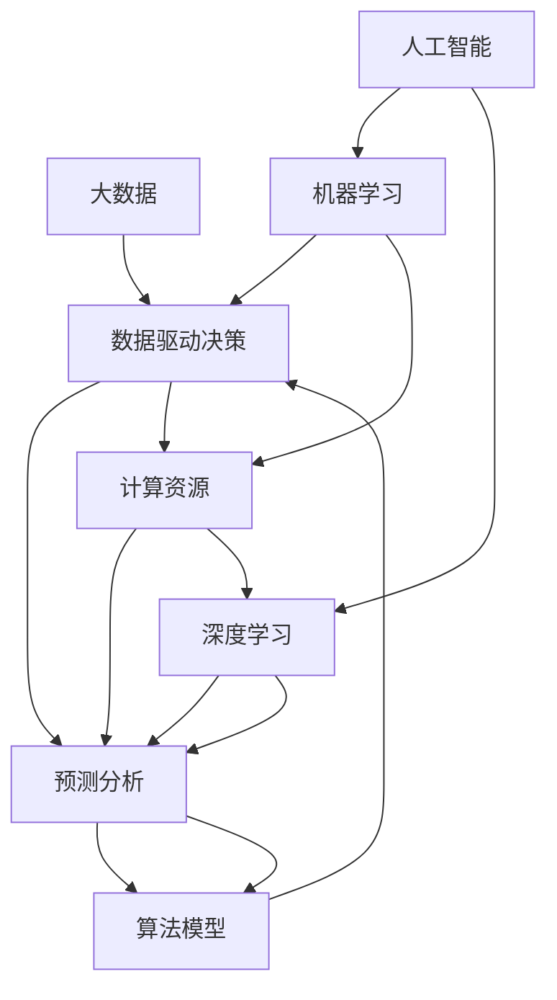

                 

# 人工智能与大数据的未来发展和应用

> 关键词：人工智能,大数据,未来发展,应用场景,深度学习,机器学习,深度学习框架,数据驱动决策,预测分析

## 1. 背景介绍

### 1.1 问题由来
在21世纪以来，科技的快速发展引领了人类社会的转型升级。其中，人工智能（AI）和大数据（Big Data）技术的兴起，极大地推动了信息时代的进程。人工智能通过模拟人类智能行为，拓展了传统计算能力，使机器具备了学习、推理、自主决策等高级功能。大数据则通过海量数据的汇聚与分析，为人工智能提供了数据支撑，推动了机器学习模型的精度提升和泛化能力的增强。

随着数据量的爆炸性增长和计算能力的飞速提升，人工智能和大数据技术在医疗、金融、交通、制造、教育等多个领域得到了广泛应用。其应用场景包括智能推荐、智能客服、智能风控、智能诊断、智慧城市等，极大地提升了各行业的效率和智能化水平。

然而，随着技术的不断发展，人工智能和大数据技术也面临一系列挑战，如模型可解释性、数据隐私保护、计算资源需求等。如何突破这些瓶颈，充分发挥人工智能和大数据技术的潜力，成为当前和未来的重要研究方向。

### 1.2 问题核心关键点
当前，人工智能和大数据技术的发展正处于关键转折点，面临着从局部应用向全局融合的挑战。主要的关键点包括：

- 技术深度融合：如何将人工智能与大数据技术有机结合，实现更加智能和高效的信息处理。
- 数据质量管理：如何确保数据的准确性和完整性，构建可信的数据基础。
- 计算资源优化：如何提高计算资源的利用效率，降低计算成本。
- 算法模型的可解释性：如何提高算法的透明性和可解释性，提升模型应用的可靠性。
- 伦理与安全：如何平衡技术发展和伦理安全的关系，避免技术滥用。

## 2. 核心概念与联系

### 2.1 核心概念概述

为更好地理解人工智能与大数据技术的未来发展，本节将介绍几个关键概念及其之间的联系：

- 人工智能（AI）：使用计算机算法和统计模型模拟人类智能行为的技术，涵盖了机器学习、深度学习、自然语言处理、计算机视觉等多个子领域。

- 大数据（Big Data）：指通过信息技术手段收集、存储、处理、分析的海量数据，通常具有体量大、速度快、类型多、价值密度低等特点。

- 机器学习（ML）：指通过数据训练模型，使计算机具备自主学习和预测能力的技术。

- 深度学习（DL）：一种特殊的机器学习方法，通过多层神经网络实现数据特征的层次化提取和复杂模式识别。

- 数据驱动决策（Data-Driven Decision Making）：利用数据分析结果指导决策过程，提升决策的科学性和准确性。

- 预测分析（Predictive Analytics）：通过对历史数据的学习和分析，预测未来趋势和行为的技术。

- 计算资源：包括CPU、GPU、TPU等硬件资源，以及云计算、分布式计算等软件资源。

- 算法模型：包括线性回归、决策树、支持向量机、神经网络等各类模型，用于解决特定问题。

这些核心概念之间相互依存，共同构成了人工智能与大数据技术的应用体系。通过理解这些概念，我们可以更好地把握未来发展的趋势和方向。

### 2.2 核心概念原理和架构的 Mermaid 流程图



## 3. 核心算法原理 & 具体操作步骤

### 3.1 算法原理概述

人工智能与大数据技术的结合，主要体现在数据驱动的模型训练和优化过程中。核心算法原理包括：

- 数据预处理：通过清洗、去重、特征提取等技术，将原始数据转化为模型可以接受的格式。

- 模型训练：使用机器学习或深度学习算法，从训练数据中学习模型参数，构建预测模型。

- 模型评估与优化：通过交叉验证、网格搜索等方法，评估模型性能并优化模型参数，提升模型泛化能力。

- 预测与决策：使用训练好的模型对新数据进行预测，并根据预测结果进行智能决策。

- 数据驱动的决策优化：通过历史数据分析，发现规律并优化决策过程，提升决策的精准性。

### 3.2 算法步骤详解

基于人工智能与大数据技术的核心算法原理，本节将详细介绍各个步骤的具体操作步骤：

**Step 1: 数据预处理**
- 数据收集：从不同数据源收集所需数据，确保数据的多样性和完备性。
- 数据清洗：处理缺失值、异常值、噪声等问题，提升数据质量。
- 特征工程：根据任务需求，提取和构建数据特征，提升模型效果。

**Step 2: 模型训练**
- 选择模型：根据任务特点，选择适合的机器学习或深度学习模型。
- 数据分割：将数据集划分为训练集、验证集和测试集，确保模型评估的可靠性。
- 模型训练：使用训练集对模型进行训练，最小化损失函数。
- 超参数调优：通过网格搜索或贝叶斯优化等方法，调整模型超参数，提升模型效果。

**Step 3: 模型评估与优化**
- 交叉验证：将数据集划分为若干份，轮流作为验证集，评估模型性能。
- 评估指标：选择准确率、召回率、F1值等指标，评估模型效果。
- 模型优化：使用正则化、dropout、早停等技术，提升模型泛化能力。

**Step 4: 预测与决策**
- 模型预测：使用训练好的模型对新数据进行预测，得到预测结果。
- 决策应用：根据预测结果，进行智能决策，如智能推荐、风险评估等。

**Step 5: 数据驱动的决策优化**
- 数据汇总与分析：收集历史数据并进行分析，发现规律和趋势。
- 模型迭代：根据分析结果，迭代优化模型参数，提升决策效果。
- 决策反馈：将决策结果反馈到模型训练中，进一步提升模型效果。

### 3.3 算法优缺点

人工智能与大数据技术的结合，具有以下优点：

- 高效性：通过大数据技术，可以快速处理海量数据，提升模型训练和预测的速度。
- 精度高：通过深度学习模型，能够从数据中提取复杂模式，提高模型的准确性和泛化能力。
- 应用广泛：可以应用于各种领域，如金融、医疗、交通、制造等，提升各行业的智能化水平。
- 可解释性强：通过特征工程和模型优化，能够提升模型的透明性和可解释性。

然而，也存在一些局限性：

- 数据隐私问题：处理大量数据时，涉及数据隐私和安全问题，需要严格的数据保护措施。
- 计算资源需求高：深度学习模型通常需要大量的计算资源，增加了技术成本。
- 模型可解释性：深度学习模型通常被视为"黑盒"模型，缺乏可解释性，难以理解模型的决策过程。
- 技术门槛高：需要掌握大量数据处理和模型训练的技术，增加了技术实现的难度。

### 3.4 算法应用领域

人工智能与大数据技术已经广泛应用于多个领域，以下是几个典型的应用场景：

**医疗健康**
- 智能诊断：使用深度学习模型，对医学影像进行自动诊断，提升诊断效率和准确性。
- 个性化医疗：通过大数据分析，发现患者历史诊疗数据和基因数据的相关性，制定个性化治疗方案。

**金融行业**
- 智能风控：使用机器学习模型，对客户的信用记录和行为数据进行分析，评估其信用风险。
- 智能投顾：通过大数据分析，生成投资策略，为客户提供智能投资建议。

**智能制造**
- 设备预测性维护：使用机器学习模型，分析设备运行数据，预测设备故障，进行预防性维护。
- 供应链优化：通过大数据分析，优化供应链管理和库存控制，提升效率和降低成本。

**智能交通**
- 智能导航：使用深度学习模型，分析交通数据和路况信息，生成最优路径。
- 自动驾驶：使用传感器和大数据分析，实现车辆的自动驾驶和智能调度。

## 4. 数学模型和公式 & 详细讲解 & 举例说明

### 4.1 数学模型构建

本节将使用数学语言对人工智能与大数据技术的核心算法原理进行更加严格的刻画。

假设有一个监督学习任务，已知数据集 $D = \{(x_i, y_i)\}_{i=1}^N$，其中 $x_i$ 为输入特征，$y_i$ 为标签。我们的目标是通过训练数据 $D$，得到一个模型 $f$，使得对于新数据 $x$，模型能够准确预测其标签 $y$。

定义模型 $f$ 为 $f: \mathcal{X} \rightarrow \mathcal{Y}$，其中 $\mathcal{X}$ 为输入空间，$\mathcal{Y}$ 为输出空间。假设模型 $f$ 的参数为 $\theta$，则模型的损失函数为：

$$
L(f; D) = \frac{1}{N} \sum_{i=1}^N \ell(f(x_i), y_i)
$$

其中 $\ell$ 为损失函数，用于衡量预测结果与真实标签之间的差异。常见的损失函数包括均方误差（MSE）、交叉熵（CE）、对数损失（Log Loss）等。

模型训练的目标是最小化损失函数，即：

$$
\theta^* = \mathop{\arg\min}_{\theta} L(f; D)
$$

在实际应用中，我们通常使用梯度下降等优化算法来近似求解上述最优化问题。设 $\eta$ 为学习率，则模型参数的更新公式为：

$$
\theta \leftarrow \theta - \eta \nabla_{\theta} L(f; D)
$$

其中 $\nabla_{\theta} L(f; D)$ 为损失函数对模型参数 $\theta$ 的梯度，可通过反向传播算法高效计算。

### 4.2 公式推导过程

以线性回归模型为例，进行公式推导：

假设模型 $f$ 为线性模型，即 $f(x) = \theta^T x + b$，其中 $\theta$ 为模型参数，$x$ 为输入特征，$b$ 为偏置项。损失函数为均方误差，即：

$$
L(f; D) = \frac{1}{N} \sum_{i=1}^N (y_i - f(x_i))^2
$$

对 $\theta$ 求导，得：

$$
\frac{\partial L(f; D)}{\partial \theta} = \frac{2}{N} \sum_{i=1}^N (y_i - \theta^T x_i - b) x_i
$$

根据梯度下降算法，更新模型参数 $\theta$：

$$
\theta \leftarrow \theta - \eta \frac{2}{N} \sum_{i=1}^N (y_i - \theta^T x_i - b) x_i
$$

简化得到：

$$
\theta \leftarrow \theta - \eta \frac{1}{N} \sum_{i=1}^N (y_i - \theta^T x_i) x_i
$$

这就是线性回归模型的更新公式。在实际应用中，我们通常使用随机梯度下降（SGD）或批量梯度下降（BGD）等优化算法，根据数据集 $D$ 的不同批次计算梯度，逐步更新模型参数。

### 4.3 案例分析与讲解

以房价预测为例，讲解线性回归模型的应用：

假设有一个包含若干历史房屋销售数据的表格，其中包含了房屋面积、房间数量、地理位置等信息。我们希望使用这些数据来预测新房屋的销售价格。

首先，将数据集划分为训练集和测试集，对训练集进行特征工程，提取影响房价的关键特征，如房屋面积、地理位置等。

然后，使用线性回归模型对训练集进行拟合，得到模型参数 $\theta$。对于每个新房屋，计算其特征向量 $x$，代入模型得到预测价格 $y$。

最后，在测试集上评估模型的预测效果，使用均方误差等指标评估模型性能。通过调整模型参数和优化算法，提升模型效果。

## 5. 项目实践：代码实例和详细解释说明

### 5.1 开发环境搭建

在进行人工智能与大数据技术的项目实践前，我们需要准备好开发环境。以下是使用Python进行Scikit-learn开发的Python环境配置流程：

1. 安装Anaconda：从官网下载并安装Anaconda，用于创建独立的Python环境。

2. 创建并激活虚拟环境：
```bash
conda create -n sklearn-env python=3.8 
conda activate sklearn-env
```

3. 安装Scikit-learn：
```bash
conda install scikit-learn
```

4. 安装各类工具包：
```bash
pip install numpy pandas matplotlib scikit-learn
```

完成上述步骤后，即可在`sklearn-env`环境中开始项目实践。

### 5.2 源代码详细实现

这里以房价预测为例，使用Scikit-learn库进行Python实现：

```python
from sklearn.datasets import load_boston
from sklearn.model_selection import train_test_split
from sklearn.linear_model import LinearRegression
from sklearn.metrics import mean_squared_error

# 加载波士顿房价数据
boston = load_boston()
X = boston.data
y = boston.target

# 数据分割
X_train, X_test, y_train, y_test = train_test_split(X, y, test_size=0.2, random_state=42)

# 模型训练
model = LinearRegression()
model.fit(X_train, y_train)

# 模型评估
y_pred = model.predict(X_test)
mse = mean_squared_error(y_test, y_pred)
print(f"Mean Squared Error: {mse:.2f}")
```

上述代码展示了从数据加载到模型训练、预测和评估的全过程。通过Scikit-learn库，可以快速实现线性回归模型的训练和评估。

### 5.3 代码解读与分析

以下是关键代码的实现细节：

**数据加载**
- 使用`load_boston`函数加载波士顿房价数据，包含房屋面积、地理位置等信息。

**数据分割**
- 使用`train_test_split`函数将数据集划分为训练集和测试集。

**模型训练**
- 使用`LinearRegression`类创建线性回归模型。
- 使用`fit`方法对训练集进行拟合。

**模型评估**
- 使用`predict`方法对测试集进行预测。
- 使用`mean_squared_error`函数计算均方误差。

通过Scikit-learn库，我们可以快速实现线性回归模型的训练和评估。Scikit-learn库的强大封装和易用性，使得Python开发者能够更加专注于算法优化和数据处理，而不必过多关注底层的实现细节。

当然，工业级的系统实现还需考虑更多因素，如模型的保存和部署、超参数的自动搜索、更灵活的任务适配层等。但核心的算法流程基本与此类似。

## 6. 实际应用场景

### 6.1 医疗健康

人工智能与大数据技术在医疗健康领域的应用，已经取得了一系列重要成果。以下是几个典型的应用场景：

**智能诊断**
- 影像诊断：使用深度学习模型，对医学影像进行自动分析，快速诊断疾病。
- 病理分析：通过大数据分析，发现病理学特征，辅助病理医生进行诊断。

**个性化医疗**
- 基因组学：通过大数据分析，发现患者基因数据与疾病的关系，制定个性化治疗方案。
- 药物研发：通过大数据分析，发现药物对不同基因型的疗效，指导药物研发。

**健康管理**
- 智能监测：使用传感器和大数据分析，监测患者的健康状况，提供个性化的健康建议。
- 疾病预警：通过大数据分析，预测患者可能出现的疾病，提前进行预防。

### 6.2 金融行业

人工智能与大数据技术在金融行业的应用，已经显著提升了金融机构的运营效率和风险控制能力。以下是几个典型的应用场景：

**智能风控**
- 信用评估：使用机器学习模型，对客户的信用记录和行为数据进行分析，评估其信用风险。
- 欺诈检测：通过大数据分析，发现异常交易行为，及时进行风险预警。

**智能投顾**
- 投资策略生成：通过大数据分析，生成投资策略，为客户提供智能投资建议。
- 资产管理：通过大数据分析，优化资产配置，提高投资回报率。

**金融分析**
- 市场预测：使用预测分析模型，预测股票市场走势，指导投资决策。
- 风险管理：通过大数据分析，发现潜在风险，制定风险应对策略。

### 6.3 智能制造

人工智能与大数据技术在智能制造领域的应用，已经显著提升了生产效率和质量控制能力。以下是几个典型的应用场景：

**设备预测性维护**
- 故障预测：使用机器学习模型，分析设备运行数据，预测设备故障，进行预防性维护。
- 维护优化：通过大数据分析，优化维护方案，降低维护成本。

**供应链优化**
- 需求预测：使用预测分析模型，预测产品需求，优化库存管理。
- 物流优化：通过大数据分析，优化物流路线，降低运输成本。

**质量控制**
- 缺陷检测：使用计算机视觉技术，对产品进行自动检测，提升产品质量。
- 工艺优化：通过大数据分析，优化生产工艺，提高生产效率。

### 6.4 未来应用展望

随着人工智能和大数据技术的不断发展，其应用领域将不断拓展，涵盖更多行业和领域。以下是几个未来可能的趋势：

**智慧城市**
- 交通管理：通过大数据分析，优化交通流量，减少交通拥堵。
- 城市安全：使用深度学习模型，对城市监控视频进行分析，提升城市安全水平。

**智能教育**
- 个性化教育：通过大数据分析，发现学生的学习习惯和偏好，提供个性化的教育方案。
- 智能评估：使用机器学习模型，评估学生的学习效果，指导教学改进。

**智能农业**
- 病虫害预测：使用深度学习模型，分析气候数据和土壤数据，预测病虫害发生。
- 生产优化：通过大数据分析，优化农业生产流程，提高生产效率。

**智能物流**
- 路径规划：使用预测分析模型，优化物流路径，降低运输成本。
- 货物跟踪：使用传感器和大数据分析，实时跟踪货物位置，提高物流效率。

## 7. 工具和资源推荐

### 7.1 学习资源推荐

为了帮助开发者系统掌握人工智能与大数据技术的理论基础和实践技巧，这里推荐一些优质的学习资源：

1. 《深度学习》（Ian Goodfellow, Yoshua Bengio, Aaron Courville 著）：深度学习领域的经典教材，系统讲解深度学习的基本概念和算法。

2. 《机器学习》（周志华 著）：机器学习领域的经典教材，涵盖监督学习、无监督学习、半监督学习等多个方面。

3. 《大数据技术与应用》（王宏志 著）：介绍大数据技术的基本概念和应用场景，涵盖数据采集、存储、分析等多个环节。

4. 《Python深度学习》（Francois Chollet 著）：通过Keras框架，快速实现深度学习模型的训练和部署。

5. 《Scikit-learn实战》（Olivier Grisel, Fabian Pedregosa, Gael Varoquaux 著）：通过Scikit-learn库，快速实现机器学习模型的训练和评估。

6. Kaggle平台：全球最大的数据科学竞赛平台，提供丰富的数据集和竞赛机会，是学习和实践大数据技术的绝佳平台。

通过对这些资源的学习实践，相信你一定能够快速掌握人工智能与大数据技术的精髓，并用于解决实际的行业问题。

### 7.2 开发工具推荐

高效的开发离不开优秀的工具支持。以下是几款用于人工智能与大数据技术开发的常用工具：

1. PyTorch：基于Python的开源深度学习框架，灵活动态的计算图，适合快速迭代研究。

2. TensorFlow：由Google主导开发的开源深度学习框架，生产部署方便，适合大规模工程应用。

3. Scikit-learn：基于Python的机器学习库，包含各种经典算法和工具，适合快速开发和部署。

4. Jupyter Notebook：交互式编程环境，支持Python等多种语言，便于调试和共享代码。

5. R语言：统计分析和机器学习的常用工具，适合数据处理和建模。

6. Apache Hadoop：开源分布式计算平台，适合大规模数据处理和分析。

合理利用这些工具，可以显著提升人工智能与大数据技术开发的速度和效率，加快创新迭代的步伐。

### 7.3 相关论文推荐

人工智能与大数据技术的发展源于学界的持续研究。以下是几篇奠基性的相关论文，推荐阅读：

1. "Deep Learning"（Ian Goodfellow, Yoshua Bengio, Aaron Courville 著）：深度学习领域的经典教材，系统讲解深度学习的基本概念和算法。

2. "Introduction to Machine Learning with Python"（Andreas C. Müller, Sarah Guido 著）：通过Python实现机器学习模型，讲解各种经典算法和应用。

3. "Big Data: Principles and Best Practices of Scalable Real-time Data Systems"（Joey Data, Jason C. Bura, Eric Marhold 著）：介绍大数据技术的基本概念和最佳实践，涵盖数据采集、存储、分析等多个环节。

4. "A Survey on Deep Learning for Smart City Applications"（Mohammad Reza Motahar, Behrooz Dehghani, Mohammad Bagherzadeh 著）：综述深度学习在智慧城市中的应用，涵盖交通管理、城市安全等多个场景。

5. "Machine Learning Yearning"（Andrew Ng 著）：讲解机器学习的基本概念和实践技巧，适合初学者和高级开发者。

6. "Practical Deep Learning for Coders"（Francois Chollet 著）：通过Keras框架，快速实现深度学习模型的训练和部署。

这些论文代表了大数据与人工智能技术的发展脉络。通过学习这些前沿成果，可以帮助研究者把握学科前进方向，激发更多的创新灵感。

## 8. 总结：未来发展趋势与挑战

### 8.1 研究成果总结

人工智能与大数据技术在过去十年中取得了显著进展，涵盖算法、应用和工具等多个方面。主要的研究成果包括：

- 深度学习模型的精度和泛化能力显著提升，应用于各种领域，提升了行业的智能化水平。
- 大数据技术的成熟应用，提升了数据处理和分析的效率，推动了各行业的创新发展。
- 数据驱动决策的普及，提升了决策的科学性和精准性。

### 8.2 未来发展趋势

展望未来，人工智能与大数据技术的结合将进一步深入，主要趋势包括：

- 技术深度融合：通过融合不同领域的知识和技术，提升人工智能和大数据技术的综合能力。
- 数据质量管理：通过数据清洗和标注，提高数据质量和可靠性，确保模型的准确性。
- 计算资源优化：通过分布式计算和优化算法，提高计算资源的利用效率，降低成本。
- 模型可解释性：通过特征工程和模型优化，提升模型的透明性和可解释性。
- 伦理与安全：通过数据隐私保护和算法透明，确保技术应用的伦理和安全性。

### 8.3 面临的挑战

尽管人工智能与大数据技术已经取得了瞩目成就，但在迈向更加智能化、普适化应用的过程中，仍面临一系列挑战：

- 技术深度融合：不同领域之间的技术和数据融合仍存在难度，需要进一步提升跨领域协同能力。
- 数据质量管理：数据质量和标注的提升仍需要大量的资源和时间，制约了模型的进一步提升。
- 计算资源优化：大规模深度学习模型的计算需求仍较高，需要进一步优化计算资源和算法。
- 模型可解释性：深度学习模型仍被视为"黑盒"模型，缺乏可解释性，需要进一步提升模型的透明性和可解释性。
- 伦理与安全：数据隐私和安全问题仍然存在，需要进一步加强数据保护和伦理规范。

### 8.4 研究展望

面向未来，人工智能与大数据技术的研究需要关注以下几个方向：

- 融合深度学习和强化学习：将强化学习引入深度学习模型，提升模型的自主决策能力。
- 引入更多先验知识：将符号化的先验知识，如知识图谱、逻辑规则等，与神经网络模型进行巧妙融合，提升模型的泛化能力和鲁棒性。
- 优化计算资源：通过分布式计算、模型压缩、量化加速等技术，优化计算资源和算法，提升模型的效率和实时性。
- 提升模型可解释性：通过可解释性技术，如可解释AI（XAI），提升模型的透明性和可解释性，确保模型应用的可靠性和安全性。

这些研究方向将推动人工智能与大数据技术的进一步发展，为构建安全、可靠、可解释、可控的智能系统铺平道路。面向未来，人工智能与大数据技术的研究需要不断突破技术瓶颈，推动技术的创新和应用。

## 9. 附录：常见问题与解答

**Q1：如何提高模型的泛化能力？**

A: 提高模型的泛化能力可以从以下几方面入手：
1. 数据增强：通过数据扩充和扩样，提高模型的泛化能力。
2. 正则化：通过L2正则化、Dropout等技术，减少模型的过拟合风险。
3. 模型集成：通过模型集成，提高模型的鲁棒性和泛化能力。
4. 参数优化：通过超参数调优，优化模型的参数设置，提高泛化能力。

**Q2：如何降低模型的计算资源需求？**

A: 降低模型的计算资源需求可以从以下几方面入手：
1. 模型裁剪：去除不必要的层和参数，减小模型尺寸，加快推理速度。
2. 量化加速：将浮点模型转为定点模型，压缩存储空间，提高计算效率。
3. 分布式计算：使用分布式计算框架，如TensorFlow、PyTorch等，并行计算，提高计算效率。
4. 数据压缩：通过数据压缩技术，如LZ77、LZ78等，减小数据存储和传输的资源需求。

**Q3：如何提升模型的可解释性？**

A: 提升模型的可解释性可以从以下几方面入手：
1. 特征可视化：通过可视化技术，展示模型的特征重要性，帮助理解模型的决策过程。
2. 可解释AI（XAI）：使用XAI技术，如SHAP、LIME等，提升模型的透明性和可解释性。
3. 符号化知识：将符号化的先验知识，如知识图谱、逻辑规则等，与神经网络模型进行巧妙融合，提升模型的透明性和可解释性。

**Q4：如何平衡技术发展和伦理安全？**

A: 平衡技术发展和伦理安全可以从以下几方面入手：
1. 数据隐私保护：通过数据脱敏、匿名化等技术，保护用户隐私。
2. 算法透明：通过算法透明和可解释，确保算法的公平性和安全性。
3. 伦理规范：制定伦理规范和法律法规，约束技术应用行为，避免技术滥用。
4. 人工干预：引入人工干预机制，确保技术的可控性和安全性。

这些方法可以帮助我们平衡技术发展和伦理安全，确保人工智能和大数据技术的应用安全可靠。

---

作者：禅与计算机程序设计艺术 / Zen and the Art of Computer Programming

