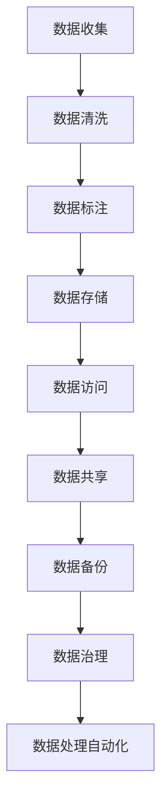

                 

# 人工智能创业数据管理的策略与措施探讨

## 1. 背景介绍

在人工智能(AI)技术迅猛发展的背景下，越来越多的企业将AI作为推动业务创新的重要手段。然而，AI系统的成功离不开高质量的数据支持，数据管理成为了AI创业中的关键一环。有效的数据管理不仅能提升AI模型的准确性和稳定性，还能降低项目开发和运营成本，加速市场扩张。因此，本文将从数据管理的多个方面，探讨AI创业企业应采取的策略和措施。

## 2. 核心概念与联系

### 2.1 核心概念概述

为更好地理解AI创业中数据管理的复杂性和挑战，本节将介绍几个核心概念及其相互联系：

- **数据质量**：指数据集中的噪声、重复、错误、缺失等对模型性能有负面影响的部分。高质量的数据集能显著提升AI模型的预测精度和泛化能力。

- **数据标注**：在数据集中附上准确标注，例如分类标签、实体关系等，以供模型训练使用。标注数据的质量直接影响模型的学习效果。

- **数据隐私保护**：指在数据收集和处理过程中，采取措施防止个人隐私泄露，遵守相关法律法规，保障用户权益。

- **数据存储和备份**：指数据在收集和清洗后，如何高效存储和管理，确保数据的安全性和可用性，以及数据备份策略以应对意外数据丢失或损坏。

- **数据治理**：包括数据质量控制、数据访问管理、数据生命周期管理等多个方面，通过制度和工具手段，确保数据的质量和合规性。

- **数据共享与合作**：在AI创业中，为了降低数据获取成本和提高模型性能，企业之间可能需要共享数据。如何建立信任机制，制定合理的数据共享策略，是数据管理的重要挑战。

- **数据处理自动化**：指通过技术手段，自动化地处理数据清洗、预处理、特征工程等环节，提高数据处理效率和准确性。

### 2.2 核心概念原理和架构的 Mermaid 流程图



该流程图展示了数据从收集到存储、标注、访问、共享、备份、治理和自动化的全流程。数据管理涉及多个环节，每个环节都有其特定的原则和方法。通过这张流程图，我们可以更直观地理解数据管理的复杂性和挑战。

## 3. 核心算法原理 & 具体操作步骤

### 3.1 算法原理概述

AI创业企业的数据管理可以基于以下原理和步骤：

1. **数据收集策略**：明确所需数据类型和来源，采用合适的技术手段进行数据采集。
2. **数据清洗与预处理**：清洗数据中的噪声、重复、错误和缺失值，并进行标准化和归一化等预处理工作。
3. **数据标注与训练**：对清洗后的数据进行标注，并使用标注数据对AI模型进行训练和微调。
4. **数据存储与管理**：选择合适的数据存储技术，确保数据的存储效率和安全性。
5. **数据访问与共享**：合理设置数据访问权限，确保数据的安全共享。
6. **数据备份与恢复**：定期备份数据，防止数据丢失，并建立快速恢复机制。
7. **数据治理与合规**：建立数据治理框架，确保数据的质量和合规性，遵守相关法律法规。
8. **数据处理自动化**：引入自动化工具，提高数据处理效率和准确性。

### 3.2 算法步骤详解

具体步骤如下：

**Step 1: 数据收集策略**
- 明确项目需求，确定所需数据类型（如结构化数据、非结构化数据、文本数据等）和数据来源（如公开数据集、企业自有数据、网络爬虫等）。
- 采用ETL工具（如Apache NiFi、Dataflow等）或自定义脚本进行数据收集。

**Step 2: 数据清洗与预处理**
- 对收集到的数据进行初步清洗，去除明显异常值、重复记录等。
- 进行数据标准化和归一化处理，使得不同来源的数据具有相同的格式和量纲。
- 使用数据清洗工具（如OpenRefine、Trifacta等）对数据进行更深入的清洗和预处理。

**Step 3: 数据标注与训练**
- 根据项目需求，确定数据标注的类型（如分类、回归、实体关系等）。
- 使用标注工具（如Labelbox、VaaS等）对数据进行标注，确保标注的准确性和一致性。
- 使用标注数据对AI模型进行训练，并进行微调以提升模型性能。

**Step 4: 数据存储与管理**
- 选择合适的数据存储技术（如关系型数据库、非关系型数据库、分布式文件系统等）。
- 设计数据存储架构，优化存储效率和可扩展性。
- 使用数据管理工具（如Snowflake、Redshift等）对数据进行高效管理和查询。

**Step 5: 数据访问与共享**
- 设计数据访问权限，确保数据的安全性。
- 采用加密技术和访问控制策略（如OAuth2、Kerberos等）保护数据隐私。
- 建立数据共享机制，与合作伙伴共享数据以提升模型性能。

**Step 6: 数据备份与恢复**
- 定期备份关键数据，确保数据的安全性和可用性。
- 建立快速恢复机制，防止数据丢失。

**Step 7: 数据治理与合规**
- 建立数据治理框架，确保数据的质量和合规性。
- 遵循GDPR、CCPA等法律法规，保护用户隐私和数据安全。

**Step 8: 数据处理自动化**
- 引入自动化工具（如Airflow、Kubeflow等），提高数据处理效率。
- 设计自动化流程，减少人工干预和错误。

### 3.3 算法优缺点

数据管理的优点：
1. 提高AI模型的性能：高质量的数据和有效的预处理能显著提升模型的准确性和泛化能力。
2. 降低成本：数据管理技术能够减少人工干预和错误，提高项目开发和运营效率。
3. 保障数据安全：合理的数据访问和备份策略能确保数据的安全性和可用性。
4. 提升合规性：通过数据治理和隐私保护措施，确保项目符合相关法律法规。

数据管理的缺点：
1. 复杂度高：数据管理涉及多个环节，每个环节都需要精心设计和维护。
2. 成本高：数据收集、存储、标注等过程需要大量人力和资金投入。
3. 技术门槛高：数据管理需要专业的技术支持，技术门槛较高。
4. 数据隐私风险：在数据收集和处理过程中，隐私保护存在挑战。

### 3.4 算法应用领域

数据管理技术广泛应用于AI创业企业的各个方面，如：

- **金融行业**：在金融风控、智能投顾、金融情报等领域，数据管理技术能提升模型的准确性和泛化能力。
- **医疗行业**：在医疗影像分析、电子病历管理、个性化治疗等领域，数据管理技术能确保数据的质量和隐私安全。
- **零售行业**：在客户行为分析、库存管理、推荐系统等领域，数据管理技术能优化决策流程，提升客户体验。
- **制造业**：在设备维护、质量控制、供应链管理等领域，数据管理技术能提高生产效率和产品质量。
- **智慧城市**：在城市交通管理、环境监测、公共安全等领域，数据管理技术能优化城市治理，提升居民生活质量。

## 4. 数学模型和公式 & 详细讲解 & 举例说明

### 4.1 数学模型构建

在大规模数据管理中，常用的数学模型包括线性回归、逻辑回归、支持向量机等。这里以线性回归模型为例，说明数据管理的基本流程。

**线性回归模型**：
$$
\hat{y} = \beta_0 + \beta_1 x_1 + \beta_2 x_2 + ... + \beta_n x_n
$$

其中，$\beta_0, \beta_1, ..., \beta_n$ 为模型参数，$x_1, x_2, ..., x_n$ 为自变量，$\hat{y}$ 为预测值。

### 4.2 公式推导过程

**数据收集**：
- 收集训练数据 $(x_i, y_i), i=1,...,N$，其中 $x_i = (x_{i1}, x_{i2}, ..., x_{in})$，$y_i$ 为标签。

**数据清洗与预处理**：
- 去除异常值和缺失值。
- 标准化和归一化处理。

**数据标注**：
- 确定标注类型，对数据进行标注。

**模型训练**：
- 使用标注数据对模型进行训练，得到最优参数 $\beta_0, \beta_1, ..., \beta_n$。

**模型评估**：
- 使用测试数据集对模型进行评估，计算均方误差 $MSE$。
- 计算 $R^2$ 等评价指标，评估模型性能。

### 4.3 案例分析与讲解

**案例：智能投顾平台的数据管理**

一家智能投顾平台需要收集用户行为数据（如交易记录、持仓情况等），对用户进行风险评估和投资建议。数据管理步骤如下：

1. **数据收集**：通过API接口、爬虫等方式收集用户数据。
2. **数据清洗与预处理**：清洗数据中的噪声和缺失值，标准化交易数据，归一化持仓情况等。
3. **数据标注**：标注用户交易行为类型（如买入、卖出、持有等），风险评估等级等。
4. **模型训练**：使用标注数据训练风险评估模型，优化模型参数。
5. **模型评估**：使用测试数据集评估模型性能，调整模型参数。
6. **数据存储与管理**：设计数据存储架构，优化存储效率和可扩展性。
7. **数据访问与共享**：设置数据访问权限，确保数据的安全性。
8. **数据备份与恢复**：定期备份关键数据，建立快速恢复机制。
9. **数据治理与合规**：遵循GDPR、CCPA等法律法规，保护用户隐私和数据安全。
10. **数据处理自动化**：引入自动化工具，提高数据处理效率。

## 5. 项目实践：代码实例和详细解释说明

### 5.1 开发环境搭建

在进行数据管理实践前，我们需要准备好开发环境。以下是使用Python进行Pandas和Scikit-learn开发的实验环境配置流程：

1. 安装Anaconda：从官网下载并安装Anaconda，用于创建独立的Python环境。

2. 创建并激活虚拟环境：
```bash
conda create -n data-management-env python=3.8 
conda activate data-management-env
```

3. 安装Pandas、Scikit-learn等库：
```bash
conda install pandas scikit-learn numpy matplotlib tqdm jupyter notebook ipython
```

完成上述步骤后，即可在`data-management-env`环境中开始数据管理实验。

### 5.2 源代码详细实现

这里我们以线性回归模型为例，给出使用Pandas和Scikit-learn进行数据管理的Python代码实现。

首先，定义数据处理函数：

```python
import pandas as pd
from sklearn.model_selection import train_test_split
from sklearn.linear_model import LinearRegression
from sklearn.metrics import mean_squared_error, r2_score

def data_cleaning(data):
    # 去除异常值和缺失值
    data = data.dropna()
    data = data[data[data['x1']!= 0] & (data['x2']!= 0) & (data['x3']!= 0)]
    # 标准化和归一化处理
    data['x1'] = (data['x1'] - data['x1'].mean()) / data['x1'].std()
    data['x2'] = (data['x2'] - data['x2'].mean()) / data['x2'].std()
    data['x3'] = (data['x3'] - data['x3'].mean()) / data['x3'].std()
    return data

def data标注(data):
    # 确定标注类型，对数据进行标注
    data['y'] = data['x1'] * 0.5 + data['x2'] * 0.3 + data['x3'] * 0.2 + 0.1 * pd.Series(np.random.normal(), index=data.index)
    return data

def train_and_evaluate(data, test_size=0.2):
    # 将数据分为训练集和测试集
    train_data, test_data = train_test_split(data, test_size=test_size, random_state=42)
    # 训练模型
    model = LinearRegression()
    model.fit(train_data[['x1', 'x2', 'x3']], train_data['y'])
    # 预测并评估模型性能
    train_pred = model.predict(train_data[['x1', 'x2', 'x3']])
    test_pred = model.predict(test_data[['x1', 'x2', 'x3']])
    train_mse = mean_squared_error(train_data['y'], train_pred)
    test_mse = mean_squared_error(test_data['y'], test_pred)
    train_r2 = r2_score(train_data['y'], train_pred)
    test_r2 = r2_score(test_data['y'], test_pred)
    return train_mse, test_mse, train_r2, test_r2

# 加载数据集
data = pd.read_csv('data.csv')

# 数据清洗与预处理
data = data_cleaning(data)

# 数据标注
data = data标注(data)

# 训练和评估模型
train_mse, test_mse, train_r2, test_r2 = train_and_evaluate(data)
print(f'训练集MSE: {train_mse:.2f}, 测试集MSE: {test_mse:.2f}, 训练集R2: {train_r2:.2f}, 测试集R2: {test_r2:.2f}')
```

以上代码展示了使用Pandas和Scikit-learn进行数据清洗、标注、训练和评估的完整流程。

### 5.3 代码解读与分析

让我们再详细解读一下关键代码的实现细节：

**data_cleaning函数**：
- 使用Pandas库的dropna和drop方法去除异常值和缺失值。
- 使用布尔索引筛选非零值的记录，确保数据的完整性。
- 使用Pandas库的标准化方法进行标准化处理。

**data标注函数**：
- 使用Pandas库的Series方法生成随机噪声。
- 将随机噪声与原始数据进行线性组合，生成标注值。

**train_and_evaluate函数**：
- 使用Scikit-learn库的train_test_split方法将数据集分为训练集和测试集。
- 使用LinearRegression模型训练和预测数据。
- 使用均方误差和R2评分等指标评估模型性能。

**整体代码流程**：
- 加载数据集。
- 对数据进行清洗与预处理，去除异常值和缺失值，进行标准化和归一化处理。
- 对数据进行标注。
- 训练和评估线性回归模型。
- 输出模型在训练集和测试集上的性能指标。

可以看出，通过Python的Pandas和Scikit-learn库，数据管理过程变得简洁高效。开发者可以将更多精力放在模型训练和优化上，而不必过多关注数据处理的细节。

## 6. 实际应用场景

### 6.1 智能投顾平台

智能投顾平台需要处理大量的用户行为数据，通过数据管理技术，能显著提升模型的准确性和泛化能力，从而提供更精准的投资建议。具体步骤包括：

1. **数据收集**：通过API接口、爬虫等方式收集用户数据。
2. **数据清洗与预处理**：清洗数据中的噪声和缺失值，标准化交易数据，归一化持仓情况等。
3. **数据标注**：标注用户交易行为类型（如买入、卖出、持有等），风险评估等级等。
4. **模型训练**：使用标注数据训练风险评估模型，优化模型参数。
5. **模型评估**：使用测试数据集评估模型性能，调整模型参数。
6. **数据存储与管理**：设计数据存储架构，优化存储效率和可扩展性。
7. **数据访问与共享**：设置数据访问权限，确保数据的安全性。
8. **数据备份与恢复**：定期备份关键数据，建立快速恢复机制。
9. **数据治理与合规**：遵循GDPR、CCPA等法律法规，保护用户隐私和数据安全。
10. **数据处理自动化**：引入自动化工具，提高数据处理效率。

通过这些步骤，智能投顾平台能高效管理用户数据，提升投资建议的准确性和可信度。

### 6.2 智慧医疗平台

智慧医疗平台需要处理大量的医疗数据，通过数据管理技术，能显著提升模型的诊断和治疗能力。具体步骤包括：

1. **数据收集**：通过医院信息系统、医疗影像设备等方式收集医疗数据。
2. **数据清洗与预处理**：清洗数据中的噪声和缺失值，标准化医疗影像数据，归一化患者信息等。
3. **数据标注**：标注医疗影像中的病变类型、患者诊断结果等。
4. **模型训练**：使用标注数据训练诊断模型，优化模型参数。
5. **模型评估**：使用测试数据集评估模型性能，调整模型参数。
6. **数据存储与管理**：设计数据存储架构，优化存储效率和可扩展性。
7. **数据访问与共享**：设置数据访问权限，确保数据的安全性。
8. **数据备份与恢复**：定期备份关键数据，建立快速恢复机制。
9. **数据治理与合规**：遵循HIPAA、GDPR等法律法规，保护患者隐私和数据安全。
10. **数据处理自动化**：引入自动化工具，提高数据处理效率。

通过这些步骤，智慧医疗平台能高效管理医疗数据，提升诊断和治疗的准确性和效率。

### 6.3 智慧城市平台

智慧城市平台需要处理大量的城市运行数据，通过数据管理技术，能显著提升城市治理能力。具体步骤包括：

1. **数据收集**：通过传感器、摄像头等方式收集城市数据。
2. **数据清洗与预处理**：清洗数据中的噪声和缺失值，标准化传感器数据，归一化交通流量等。
3. **数据标注**：标注城市中的交通流量、空气质量、温度等。
4. **模型训练**：使用标注数据训练预测模型，优化模型参数。
5. **模型评估**：使用测试数据集评估模型性能，调整模型参数。
6. **数据存储与管理**：设计数据存储架构，优化存储效率和可扩展性。
7. **数据访问与共享**：设置数据访问权限，确保数据的安全性。
8. **数据备份与恢复**：定期备份关键数据，建立快速恢复机制。
9. **数据治理与合规**：遵循GDPR、CCPA等法律法规，保护居民隐私和数据安全。
10. **数据处理自动化**：引入自动化工具，提高数据处理效率。

通过这些步骤，智慧城市平台能高效管理城市数据，提升城市治理的智能化水平。

## 7. 工具和资源推荐

### 7.1 学习资源推荐

为了帮助开发者系统掌握数据管理的理论基础和实践技巧，这里推荐一些优质的学习资源：

1. **《数据科学与机器学习入门》**：本书详细介绍了数据科学和机器学习的基本概念、技术和工具，适合初学者入门。
2. **Coursera《数据科学导论》课程**：由斯坦福大学教授讲授，涵盖了数据管理、数据处理、机器学习等多个方面的内容。
3. **Kaggle数据科学竞赛**：通过参与实际数据科学竞赛，实践数据管理、特征工程、模型训练等技能。
4. **Google Data Analytics Specialization**：由Google数据科学团队讲授，涵盖数据清洗、数据可视化、数据治理等多个方面的内容。

通过这些资源的学习实践，相信你一定能够快速掌握数据管理的精髓，并用于解决实际的AI问题。

### 7.2 开发工具推荐

高效的开发离不开优秀的工具支持。以下是几款用于数据管理开发的常用工具：

1. **Pandas**：数据处理和分析的Python库，提供丰富的数据结构和数据分析工具。
2. **Scikit-learn**：机器学习库，提供多种模型和评估指标，支持数据清洗和特征工程等操作。
3. **SQL**：关系型数据库语言，适合结构化数据的存储和管理。
4. **Hadoop**：分布式计算框架，适合大数据量的存储和处理。
5. **Spark**：分布式计算框架，支持大数据量的高效处理和分析。
6. **ETL工具**：如Apache NiFi、Talend等，自动化数据收集、清洗和转换。

合理利用这些工具，可以显著提升数据管理任务的开发效率，加快创新迭代的步伐。

### 7.3 相关论文推荐

数据管理技术的发展源于学界的持续研究。以下是几篇奠基性的相关论文，推荐阅读：

1. **《数据质量测量》**：详细介绍了数据质量的各个方面，包括数据完整性、准确性、一致性等。
2. **《数据隐私保护技术》**：综述了数据隐私保护的技术手段，如数据加密、访问控制等。
3. **《数据治理框架》**：提出了数据治理的多个方面，包括数据质量控制、数据访问管理、数据生命周期管理等。
4. **《数据处理自动化技术》**：介绍了自动化数据处理的方法和工具，如数据清洗、数据预处理、特征工程等。

这些论文代表了大数据管理技术的最新进展，通过学习这些前沿成果，可以帮助研究者把握学科前进方向，激发更多的创新灵感。

## 8. 总结：未来发展趋势与挑战

### 8.1 总结

本文对AI创业企业的数据管理进行了全面系统的介绍。首先，阐述了数据管理在AI创业中的重要性，明确了数据管理对AI模型性能和项目成功的关键作用。其次，从原理到实践，详细讲解了数据管理的数学模型和操作步骤，给出了数据管理任务开发的完整代码实例。同时，本文还广泛探讨了数据管理技术在多个行业领域的应用前景，展示了数据管理范式的巨大潜力。此外，本文精选了数据管理技术的各类学习资源，力求为读者提供全方位的技术指引。

通过本文的系统梳理，可以看到，数据管理技术在AI创业中的关键作用，以及其在提升模型性能、降低成本、保障数据安全等方面的重要性。未来，伴随数据管理技术的不断发展，基于数据驱动的AI系统必将在各行各业大放异彩，深刻影响人类的生产生活方式。

### 8.2 未来发展趋势

展望未来，数据管理技术将呈现以下几个发展趋势：

1. **数据治理的自动化**：随着AI技术的不断发展，数据治理将越来越复杂，引入自动化工具和流程，提高数据治理效率。
2. **数据共享与合作**：在AI创业中，数据共享和合作将变得越来越普遍，建立信任机制和合作框架，促进数据的高效利用。
3. **数据隐私保护**：随着数据泄露事件的频发，数据隐私保护将成为数据管理的重要方向，引入隐私计算、差分隐私等技术手段，保护用户隐私。
4. **数据融合与多模态管理**：数据管理将越来越注重不同类型数据的融合，如文本、图像、语音等多模态数据，提升数据治理能力。
5. **数据处理自动化**：引入自动化工具和流程，提高数据处理效率，降低人工干预和错误。
6. **数据治理与伦理**：引入数据治理的伦理导向，确保数据管理的公正性和透明性，建立数据治理的合规机制。

这些趋势凸显了数据管理技术的广阔前景。这些方向的探索发展，必将进一步提升AI系统的性能和应用范围，为人类认知智能的进化带来深远影响。

### 8.3 面临的挑战

尽管数据管理技术已经取得了瞩目成就，但在迈向更加智能化、普适化应用的过程中，它仍面临着诸多挑战：

1. **数据质量和标注成本**：高质量数据和标注数据的获取成本较高，尤其是在小规模应用场景中，可能难以获得充足的高质量标注数据。
2. **数据隐私和安全**：在数据收集和处理过程中，隐私保护存在挑战，数据泄露和滥用风险较大。
3. **数据管理和治理**：数据管理和治理涉及多个环节，每个环节都需要精心设计和维护，复杂度高。
4. **技术门槛和资源消耗**：数据管理需要专业的技术支持，技术门槛较高，且数据处理过程消耗大量计算资源。

正视数据管理面临的这些挑战，积极应对并寻求突破，将是大数据管理技术走向成熟的必由之路。相信随着学界和产业界的共同努力，这些挑战终将一一被克服，大数据管理技术必将在构建安全、可靠、可解释、可控的智能系统铺平道路。

### 8.4 研究展望

面对数据管理面临的挑战，未来的研究需要在以下几个方面寻求新的突破：

1. **无监督和半监督学习**：摆脱对大规模标注数据的依赖，利用自监督学习、主动学习等无监督和半监督范式，最大限度利用非结构化数据。
2. **数据隐私保护技术**：引入差分隐私、联邦学习等技术手段，保护用户隐私和数据安全。
3. **数据治理的自动化**：引入自动化工具和流程，提高数据治理效率，降低人工干预和错误。
4. **数据共享与合作**：建立信任机制和合作框架，促进数据的高效利用。
5. **数据融合与多模态管理**：提升数据治理能力，处理不同类型数据的融合。
6. **数据处理自动化**：引入自动化工具和流程，提高数据处理效率。
7. **数据治理与伦理**：引入数据治理的伦理导向，确保数据管理的公正性和透明性，建立数据治理的合规机制。

这些研究方向的探索，必将引领大数据管理技术迈向更高的台阶，为构建安全、可靠、可解释、可控的智能系统铺平道路。面向未来，大数据管理技术还需要与其他AI技术进行更深入的融合，如知识表示、因果推理、强化学习等，多路径协同发力，共同推动数据驱动的AI系统的发展。只有勇于创新、敢于突破，才能不断拓展数据管理的边界，让智能技术更好地造福人类社会。

## 9. 附录：常见问题与解答

**Q1：数据质量对AI模型有什么影响？**

A: 数据质量直接影响AI模型的预测精度和泛化能力。高质量的数据集能显著提升模型的准确性和稳定性。数据中的噪声、重复、错误、缺失等会对模型训练造成干扰，导致模型泛化能力差，性能下降。

**Q2：如何确保数据的安全性和隐私保护？**

A: 确保数据的安全性和隐私保护，需要采取多种技术手段。例如，对数据进行加密存储和传输，采用访问控制策略（如OAuth2、Kerberos等），定期备份数据，建立快速恢复机制。同时，遵循GDPR、CCPA等法律法规，保护用户隐私和数据安全。

**Q3：数据处理自动化有哪些优点？**

A: 数据处理自动化具有以下优点：
1. 提高数据处理效率。自动化工具和流程能减少人工干预和错误，提高数据处理速度。
2. 降低人工成本。自动化处理减少了人工干预，降低了项目开发和运营成本。
3. 提升数据质量。自动化工具能检测和修正数据中的异常值和错误，提升数据质量。
4. 增强数据一致性。自动化处理能保证数据的一致性和规范性，减少数据偏差。

这些优点使得数据处理自动化成为数据管理中的重要方向，有助于提升数据处理效率和质量。

**Q4：数据管理中应如何平衡数据共享和隐私保护？**

A: 数据管理中，数据共享和隐私保护是一个重要的平衡问题。以下是一些建议：
1. 建立数据共享机制。通过数据脱敏、差分隐私等技术手段，确保数据共享过程中的隐私保护。
2. 建立信任机制。建立合作伙伴之间的信任关系，确保数据共享的安全性和可靠性。
3. 遵循法律法规。遵循GDPR、CCPA等法律法规，保护用户隐私和数据安全。
4. 引入联邦学习。通过联邦学习等技术手段，在不共享原始数据的情况下，实现数据共享和模型训练。

通过这些措施，可以在数据共享和隐私保护之间取得平衡，确保数据管理的安全性和合规性。

**Q5：数据治理应包括哪些方面？**

A: 数据治理应包括以下方面：
1. 数据质量控制：确保数据的质量和准确性，检测和修正数据中的噪声和错误。
2. 数据访问管理：设定数据访问权限，确保数据的安全性和隐私保护。
3. 数据生命周期管理：管理数据的收集、存储、处理和销毁等生命周期阶段，确保数据的时效性和可用性。
4. 数据共享与合作：建立数据共享机制，确保数据的安全共享和高效利用。
5. 数据治理框架：建立数据治理框架，确保数据管理的公正性和透明性。

通过这些措施，可以全面提升数据管理的效果，确保数据的完整性、安全性和合规性。

---

作者：禅与计算机程序设计艺术 / Zen and the Art of Computer Programming

