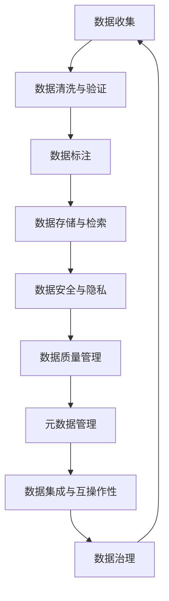

                 

# 人工智能创业数据管理的策略与方案解析

在人工智能(AI)驱动的创新浪潮中，数据管理已经成为创业企业成功的关键要素之一。对于依赖数据驱动的AI初创公司，其成功与否往往取决于如何高效、安全、可控地管理和利用数据资源。本文旨在深入探讨人工智能创业企业在数据管理过程中应采取的策略和方案，并结合实际案例加以解析。

## 1. 背景介绍

### 1.1 数据的重要性

数据是人工智能的核心资产。在AI领域，特别是深度学习模型中，数据的数量和质量直接影响模型的训练效果和泛化能力。创业企业往往面临数据资源有限的问题，因此如何高效管理和利用数据，显得尤为重要。

### 1.2 数据管理的挑战

1. **数据质量问题**：数据缺失、标注错误、噪声污染等。
2. **数据隐私和安全**：隐私保护法规（如GDPR）和数据泄露风险。
3. **数据孤岛**：不同系统间的数据不兼容和互通性差。
4. **数据管理复杂性**：数据存储、处理和分析的复杂度。
5. **数据孤岛**：不同系统间的数据不兼容和互通性差。
6. **数据治理**：数据治理机制和标准的缺乏。

## 2. 核心概念与联系

### 2.1 核心概念概述

- **数据治理**：制定数据管理策略和规则，确保数据质量和一致性。
- **数据标注**：对原始数据进行标注，形成用于训练模型的数据集。
- **数据存储与检索**：采用高效的数据存储和检索技术，确保数据的可用性和高效访问。
- **数据安全与隐私**：采取措施保护数据的机密性和完整性，确保用户隐私。
- **数据质量管理**：通过数据清洗和验证技术提升数据质量。
- **元数据管理**：维护数据的结构和属性信息，支持数据分析和决策。
- **数据集成与互操作性**：实现不同系统间的数据无缝集成和共享。

这些核心概念通过数据流和处理框架紧密联系在一起，形成了一个全面的数据管理生态系统。

### 2.2 核心概念原理和架构的 Mermaid 流程图



这个流程图展示了从数据收集到治理的完整流程，以及各个环节的核心功能。

## 3. 核心算法原理 & 具体操作步骤

### 3.1 算法原理概述

人工智能创业企业在数据管理中，需要结合数据治理、数据标注、数据存储与检索、数据安全与隐私、数据质量管理、元数据管理和数据集成与互操作性等多方面进行策略和方案的设计。以下将详细介绍每个核心领域的算法原理。

### 3.2 算法步骤详解

#### 3.2.1 数据治理

1. **制定数据管理策略**：确定数据采集、存储、处理和使用的规则和标准。
2. **实施数据质量管理**：定期检查和评估数据质量，修复数据错误。
3. **数据权限控制**：设定数据访问权限，确保数据的安全性。
4. **数据审计与合规**：定期审计数据管理流程，确保符合法律法规。

#### 3.2.2 数据标注

1. **选择标注工具和标准**：选择适合的项目标注工具，制定标注标准和规范。
2. **人工标注与半自动标注结合**：利用人工标注和半自动标注工具提高标注效率和准确性。
3. **标注质量控制**：设定标注质量检查流程，确保标注数据的一致性和准确性。

#### 3.2.3 数据存储与检索

1. **选择合适的数据存储技术**：如Hadoop、Spark等大数据处理平台。
2. **数据分片和分布式存储**：确保数据的高可用性和可扩展性。
3. **高效的数据检索技术**：如倒排索引、向量空间模型等。

#### 3.2.4 数据安全与隐私

1. **数据加密与脱敏**：对敏感数据进行加密和脱敏处理。
2. **访问控制与监控**：实施严格的访问控制和监控机制。
3. **隐私保护法规遵守**：确保数据处理符合GDPR等法律法规。

#### 3.2.5 数据质量管理

1. **数据清洗与去重**：去除重复和错误数据，提高数据质量。
2. **数据验证与异常检测**：使用统计方法和模型检测数据异常。
3. **数据聚合与归一化**：对数据进行聚合和归一化处理，提升数据一致性。

#### 3.2.6 元数据管理

1. **元数据定义与存储**：定义数据元数据，并存储在数据库或数据仓库中。
2. **元数据分析与可视化**：使用工具如Tableau、Power BI进行数据可视化和分析。
3. **元数据更新与维护**：定期更新元数据，确保其时效性。

#### 3.2.7 数据集成与互操作性

1. **数据标准化与转换**：对不同数据源进行标准化和转换，确保数据兼容。
2. **API与微服务架构**：使用API和微服务架构实现数据集成和共享。
3. **数据联邦与联合查询**：通过数据联邦技术实现跨系统数据查询。

### 3.3 算法优缺点

#### 3.3.1 数据治理

**优点**：
- 确保数据质量和一致性。
- 提高数据管理的标准化和规范性。
- 增强数据访问控制和隐私保护。

**缺点**：
- 需要投入大量人力和资源。
- 数据治理流程复杂，执行难度大。

#### 3.3.2 数据标注

**优点**：
- 提高数据标注的效率和准确性。
- 保证标注数据的一致性和可靠性。

**缺点**：
- 标注成本高，需要大量人工参与。
- 标注数据可能存在主观偏差。

#### 3.3.3 数据存储与检索

**优点**：
- 提供高效的数据存储和检索能力。
- 支持大规模数据处理和分析。

**缺点**：
- 存储和检索成本高，需要高性能硬件支持。
- 数据冗余和存储管理复杂。

#### 3.3.4 数据安全与隐私

**优点**：
- 保护数据的安全性和隐私性。
- 符合法律法规要求。

**缺点**：
- 技术复杂，实施难度大。
- 可能影响数据访问和使用效率。

#### 3.3.5 数据质量管理

**优点**：
- 提高数据质量和可用性。
- 减少数据错误和异常。

**缺点**：
- 数据清洗和验证过程复杂，耗时较长。
- 可能需要高技术要求的数据清洗工具。

#### 3.3.6 元数据管理

**优点**：
- 提供数据的结构和属性信息。
- 支持数据分析和决策支持。

**缺点**：
- 元数据管理和维护复杂。
- 需要高水平的数据管理和分析人员。

#### 3.3.7 数据集成与互操作性

**优点**：
- 实现不同系统间的数据无缝集成和共享。
- 提升数据的利用率和分析效率。

**缺点**：
- 数据集成复杂，技术难度大。
- 需要解决跨系统数据的一致性和互操作性问题。

### 3.4 算法应用领域

这些核心算法和策略广泛应用于各种AI创业企业的数据管理实践中，涉及智能推荐、图像识别、自然语言处理、医疗诊断等多个领域。以下将以医疗健康领域为例，展示数据管理策略和方案的实际应用。

## 4. 数学模型和公式 & 详细讲解 & 举例说明

### 4.1 数学模型构建

在数据管理中，常用的数学模型包括数据清洗与验证、数据标注、数据质量管理等。这些模型的构建和应用，可以确保数据的可靠性和可用性。

### 4.2 公式推导过程

以数据清洗与验证模型为例，数据清洗的数学模型如下：

$$
\text{Cleaned Data} = \text{Raw Data} \times \text{Data Cleaning Function}
$$

其中，Raw Data表示原始数据，Data Cleaning Function表示数据清洗函数。数据清洗函数可以包括去除重复数据、纠正错误数据、填补缺失数据等操作。

### 4.3 案例分析与讲解

假设某医疗健康创业公司需要处理大量病人数据，包括电子健康记录(EHR)、影像数据、基因数据等。首先需要定义数据清洗函数，去除重复和错误数据，然后使用数据标注模型为病人数据进行标注。最后，将清洗和标注后的数据存储在数据仓库中，并使用数据安全与隐私模型确保数据的机密性和完整性。

## 5. 项目实践：代码实例和详细解释说明

### 5.1 开发环境搭建

在项目实践前，需要搭建一个高效的数据管理系统。以下是一个基本的数据管理系统搭建流程：

1. **环境配置**：安装Python、Hadoop、Spark等大数据处理平台。
2. **数据存储**：搭建HDFS分布式文件系统，配置数据存储。
3. **数据处理**：使用Spark进行数据清洗、转换和聚合。
4. **数据检索**：部署Elasticsearch等搜索引擎，实现高效的数据检索。
5. **安全与隐私**：配置数据加密和访问控制机制。

### 5.2 源代码详细实现

以下是一个简单的数据清洗与标注的Python代码实现：

```python
import pandas as pd
from sklearn.preprocessing import LabelEncoder

# 数据清洗
def clean_data(df):
    # 去除重复数据
    df = df.drop_duplicates()
    # 纠正错误数据
    df = df.fillna(method='ffill')
    # 填补缺失数据
    df = df.dropna()
    return df

# 数据标注
def annotate_data(df):
    # 定义标注器
    label_encoder = LabelEncoder()
    # 标注数据
    df['label'] = label_encoder.fit_transform(df['label'])
    return df
```

### 5.3 代码解读与分析

上述代码实现了一个简单的数据清洗与标注流程，主要包括去除重复数据、纠正错误数据、填补缺失数据和定义标注器等步骤。

## 6. 实际应用场景

### 6.1 医疗健康领域

在医疗健康领域，数据管理显得尤为重要。一家AI创业公司可能需要处理海量的病人数据，包括电子健康记录、影像数据、基因数据等。数据治理、数据标注、数据存储与检索、数据安全与隐私、数据质量管理和元数据管理等策略和方案，可以有效提升医疗AI系统的准确性和可靠性。

### 6.2 金融领域

金融领域的数据管理同样重要。一家AI创业公司可能需要在交易数据、客户数据、市场数据等大规模数据上进行分析与建模。通过数据清洗、标注、存储与检索、安全与隐私、数据质量管理和元数据管理等策略，可以实现高效的数据管理和分析，提升金融AI系统的性能和安全性。

### 6.3 零售领域

零售领域的数据管理涉及销售数据、客户数据、库存数据等多个方面。一家AI创业公司可以通过数据治理、数据标注、数据存储与检索、数据安全与隐私、数据质量管理和元数据管理等策略，实现零售数据的有效管理和利用，提升营销和客户服务效果。

### 6.4 未来应用展望

未来，随着AI技术的不断发展和普及，数据管理将变得更加复杂和多样化。以下是未来数据管理的一些趋势和展望：

1. **自动化数据管理**：采用机器学习和大数据分析技术，自动化处理数据清洗、标注和分析等任务。
2. **数据平台集成**：实现不同数据平台之间的无缝集成和数据共享。
3. **数据实时处理**：使用流式数据处理技术，实现数据的实时处理和分析。
4. **跨领域数据融合**：将不同领域的数据进行融合，提升数据利用率和分析效果。
5. **数据隐私保护**：采用联邦学习等技术，保护数据的隐私和安全。
6. **数据治理标准化**：制定统一的数据治理标准和规范，提升数据管理的标准化和规范性。

## 7. 工具和资源推荐

### 7.1 学习资源推荐

- **《数据科学导论》**：介绍数据科学的基本概念和常用工具。
- **Kaggle**：提供大量数据集和竞赛平台，提升数据处理和分析技能。
- **Coursera**：提供大量数据管理、数据科学和AI相关的在线课程。

### 7.2 开发工具推荐

- **Hadoop**：大数据处理和存储平台，支持分布式数据处理。
- **Spark**：大数据处理和分析引擎，支持数据清洗、转换和聚合。
- **Elasticsearch**：全文搜索引擎，支持高效的数据检索和分析。
- **Flume**：实时数据采集系统，支持大规模数据的实时处理。

### 7.3 相关论文推荐

- **《大数据时代的挑战与应对》**：探讨大数据环境下数据管理的挑战与应对策略。
- **《人工智能与数据治理》**：讨论AI系统在数据治理中的应用和挑战。
- **《数据标注与人工标注技术的比较》**：比较不同数据标注技术的优缺点，选择适合的应用场景。

## 8. 总结：未来发展趋势与挑战

### 8.1 研究成果总结

本文系统地探讨了人工智能创业企业在数据管理过程中应采取的策略和方案，结合实际案例加以解析。通过深入分析数据治理、数据标注、数据存储与检索、数据安全与隐私、数据质量管理、元数据管理和数据集成与互操作性等多个核心领域的算法原理和操作步骤，为AI创业企业提供了一套全面的数据管理解决方案。

### 8.2 未来发展趋势

未来，随着AI技术的不断发展和普及，数据管理将变得更加复杂和多样化。以下是未来数据管理的一些趋势和展望：

1. **自动化数据管理**：采用机器学习和大数据分析技术，自动化处理数据清洗、标注和分析等任务。
2. **数据平台集成**：实现不同数据平台之间的无缝集成和数据共享。
3. **数据实时处理**：使用流式数据处理技术，实现数据的实时处理和分析。
4. **跨领域数据融合**：将不同领域的数据进行融合，提升数据利用率和分析效果。
5. **数据隐私保护**：采用联邦学习等技术，保护数据的隐私和安全。
6. **数据治理标准化**：制定统一的数据治理标准和规范，提升数据管理的标准化和规范性。

### 8.3 面临的挑战

尽管数据管理在AI创业企业中变得越来越重要，但仍面临以下挑战：

1. **数据质量问题**：数据缺失、标注错误、噪声污染等。
2. **数据隐私和安全**：隐私保护法规（如GDPR）和数据泄露风险。
3. **数据管理复杂性**：数据存储、处理和分析的复杂度。
4. **数据孤岛**：不同系统间的数据不兼容和互通性差。
5. **数据治理机制不完善**：缺乏统一的数据治理标准和规范。
6. **数据安全与隐私风险**：数据泄露和隐私侵害等问题。

### 8.4 研究展望

未来，需要在数据管理的多样性和安全性方面进行更多研究，确保数据管理的标准化和规范化。以下是一些研究展望：

1. **数据治理标准化**：制定统一的数据治理标准和规范，提升数据管理的标准化和规范性。
2. **数据隐私保护**：采用联邦学习等技术，保护数据的隐私和安全。
3. **数据自动化管理**：采用机器学习和大数据分析技术，自动化处理数据清洗、标注和分析等任务。
4. **数据平台集成**：实现不同数据平台之间的无缝集成和数据共享。
5. **数据实时处理**：使用流式数据处理技术，实现数据的实时处理和分析。
6. **跨领域数据融合**：将不同领域的数据进行融合，提升数据利用率和分析效果。

## 9. 附录：常见问题与解答

**Q1：数据治理的重要性是什么？**

A: 数据治理对AI系统的准确性和可靠性至关重要。通过数据治理，可以确保数据的质量、一致性和安全性，从而提升系统的性能和稳定性。

**Q2：如何处理数据清洗与验证中的数据质量问题？**

A: 数据清洗与验证是确保数据质量的关键步骤。可以采用多种方法处理数据质量问题，如去除重复数据、纠正错误数据、填补缺失数据等。

**Q3：数据标注的目的是什么？**

A: 数据标注是提高数据可用性的重要手段。通过标注数据，可以将原始数据转化为可用于训练模型的形式，提升模型的泛化能力和预测准确性。

**Q4：如何保护数据隐私和安全？**

A: 数据隐私和安全保护是数据管理的重要环节。可以采用数据加密、脱敏、访问控制和监控等技术手段，确保数据的安全性和隐私性。

**Q5：数据质量管理的意义是什么？**

A: 数据质量管理可以提高数据可用性和分析效果。通过数据清洗和验证，可以去除数据中的错误和异常，提升数据质量和分析结果的可靠性。

**Q6：元数据管理对数据管理的重要性是什么？**

A: 元数据管理提供数据的结构和属性信息，支持数据分析和决策支持。通过元数据管理，可以更好地理解和管理数据，提升数据利用率和分析效果。

**Q7：数据集成与互操作性技术的作用是什么？**

A: 数据集成与互操作性技术可以实现不同系统间的数据无缝集成和共享，提升数据的利用率和分析效果。通过数据集成，可以更全面、准确地理解数据，支持数据驱动的决策和分析。

---

作者：禅与计算机程序设计艺术 / Zen and the Art of Computer Programming

