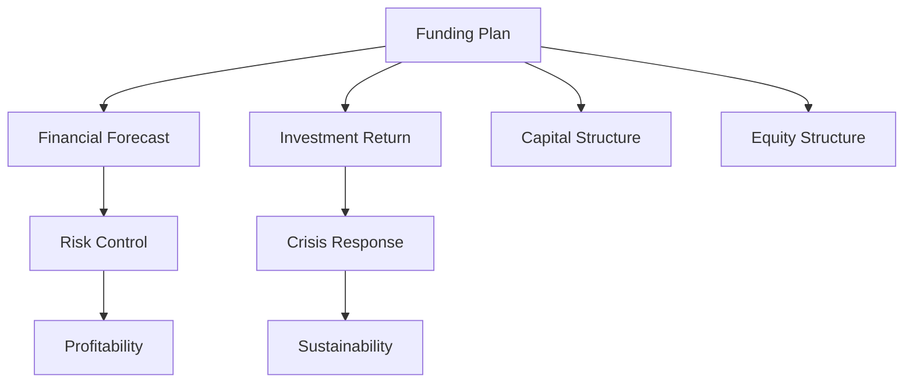

                 

## 1. 背景介绍

### 1.1 问题由来
在人工智能（AI）领域，创业公司的融资计划制定已经成为重要的管理决策之一。尤其是在技术快速迭代和市场竞争日益激烈的今天，合理的融资计划能够帮助公司更有效地进行资源配置，促进技术研发和市场拓展，实现持续创新。然而，许多AI创业者缺乏财务管理和资本运作的知识，导致融资计划制定不当，影响公司的长期发展。因此，本文旨在帮助AI创业者系统地了解和制定融资计划，提升公司在融资和资本运作中的竞争力。

### 1.2 问题核心关键点
融资计划的核心在于如何平衡公司的财务健康、技术创新和市场扩张之间的关系。关键点包括：
- 财务预测的准确性和可靠性。
- 投资回报率的计算与评估。
- 融资渠道的选择与优化。
- 资本结构与股本结构的合理配置。
- 风险控制与危机应对策略。

## 2. 核心概念与联系

### 2.1 核心概念概述

为更好地理解融资计划的制定，本节将介绍几个密切相关的核心概念：

- 融资计划（Funding Plan）：一个AI创业公司为了支持其发展而制定的资本运作策略，包括融资目的、时间表、融资渠道、投资回报评估等。
- 财务预测（Financial Forecast）：基于历史数据和市场分析，对公司的未来财务状况进行预测，包括收入、成本、利润等关键指标。
- 投资回报率（Return on Investment, ROI）：投资后公司所获得的收益与投资成本的比率，是衡量投资效果的重要指标。
- 资本结构（Capital Structure）：公司不同融资方式（如债务、股权、内部留存收益等）的组合比例，影响公司的财务风险和成本结构。
- 股本结构（Equity Structure）：公司股东的持股比例和投资类型，决定公司的控制权分配和资本增值路径。
- 风险控制（Risk Control）：采取措施降低公司运营和发展过程中的不确定性风险，确保公司的稳定增长。
- 危机应对（Crisis Response）：在面临重大财务危机时，快速有效的应对策略，以最小化损失，保障公司持续运营。

这些核心概念之间的逻辑关系可以通过以下Mermaid流程图来展示：



这个流程图展示了一些核心概念及其之间的关系：

1. 融资计划基于财务预测。
2. 投资回报率影响融资计划的制定和优化。
3. 资本结构和股本结构是融资计划的重要组成部分。
4. 风险控制和危机应对是融资计划中的关键环节，保障公司的稳定发展。

## 3. 核心算法原理 & 具体操作步骤
### 3.1 算法原理概述

一个合理的融资计划，应该基于公司的发展战略和财务健康状况进行制定，确保公司的长期目标和短期需求得到平衡。其核心算法原理可以概括为以下几点：

1. **财务预测与建模**：基于历史数据和市场分析，构建财务预测模型，预测公司的未来收入、成本和利润。
2. **投资回报率计算**：根据融资后的财务表现，计算投资回报率，评估投资效果。
3. **融资渠道选择**：根据公司的发展阶段和需求，选择最适合的融资渠道，如风险投资、银行贷款、公开发行股票等。
4. **资本结构优化**：根据公司的发展战略和财务状况，优化资本结构，平衡债务和股权的比例。
5. **股本结构配置**：根据股东的需求和公司的控制权分配，合理配置股本结构，吸引和保留关键人才。
6. **风险控制与应对**：识别潜在风险，采取措施降低风险，准备应对策略以应对突发事件。

### 3.2 算法步骤详解

以下是制定融资计划的详细步骤：

**Step 1: 财务预测**

1. **数据收集**：收集公司的历史财务数据，包括收入、成本、利润、现金流等。
2. **市场分析**：分析行业趋势、竞争对手、市场需求等，评估公司的市场前景。
3. **财务模型建立**：基于历史数据和市场分析，构建财务预测模型，如现金流预测、收入增长预测等。
4. **模型验证**：使用历史数据对模型进行验证，确保模型的准确性和可靠性。

**Step 2: 投资回报率计算**

1. **融资计划制定**：根据公司的发展需求和市场预测，制定融资计划，包括融资目的、时间和金额。
2. **融资成本评估**：评估不同融资渠道的成本，包括利息、手续费等。
3. **收益预测**：根据模型预测的财务表现，计算投资后的收益。
4. **投资回报率计算**：计算投资回报率，评估投资效果，确保投资回报率高于预期。

**Step 3: 融资渠道选择**

1. **市场调研**：调研市场上的融资渠道，如风险投资、银行贷款、公开发行股票等。
2. **融资条件谈判**：与潜在投资者或金融机构进行谈判，确定融资条件，包括投资金额、期限、利率等。
3. **融资渠道优化**：根据公司的发展阶段和需求，优化融资渠道，确保资金的高效利用。

**Step 4: 资本结构优化**

1. **资本结构评估**：评估当前的资本结构，包括债务和股权的比例。
2. **财务风险分析**：分析财务风险，如债务水平、资本回报率等。
3. **资本结构优化**：根据公司的长期发展战略和财务状况，优化资本结构，平衡债务和股权的比例。

**Step 5: 股本结构配置**

1. **股东需求分析**：分析关键股东的需求和期望，包括控制权、利润分配等。
2. **股本结构设计**：根据股东的需求和公司的控制权分配，设计合理的股本结构。
3. **股权激励设计**：设计股权激励计划，吸引和保留关键人才。

**Step 6: 风险控制与应对**

1. **风险识别**：识别公司面临的主要风险，如市场风险、技术风险、财务风险等。
2. **风险评估**：评估每个风险的可能性和影响程度。
3. **风险控制**：采取措施降低风险，如多元化投资、建立应急基金等。
4. **危机应对**：准备应对突发事件的策略，如现金流管理、债务重组等。

### 3.3 算法优缺点

基于以上步骤的融资计划制定算法，具有以下优点：

1. **系统性**：系统地考虑公司的财务健康、技术创新和市场扩张之间的关系，确保融资计划的全面性和可行性。
2. **量化评估**：通过财务预测和投资回报率计算，为融资计划的制定提供量化依据，提高决策的科学性和准确性。
3. **动态调整**：根据市场变化和公司发展需求，动态调整融资计划，确保其始终适应公司的实际情况。

同时，该算法也存在以下缺点：

1. **数据依赖**：融资计划的制定高度依赖于历史数据和市场分析，数据质量和技术模型的准确性直接影响融资计划的制定效果。
2. **复杂性**：融资计划涉及多个维度和多个变量，需要综合考虑多种因素，制定过程较为复杂。
3. **外部风险**：市场、技术等外部环境的不确定性可能对融资计划的实施产生影响，增加执行难度。

## 4. 数学模型和公式 & 详细讲解 & 举例说明

### 4.1 数学模型构建

一个基本的融资计划财务预测模型可以表示为：

$$
\text{财务预测} = \text{历史数据} + \text{市场分析} + \text{技术创新} + \text{市场变化}
$$

其中，历史数据包括收入、成本、利润、现金流等关键指标，市场分析涉及行业趋势、竞争对手、市场需求等，技术创新代表公司的研发投入和技术突破，市场变化反映外部环境的不确定性。

### 4.2 公式推导过程

以现金流预测为例，基本公式为：

$$
\text{未来现金流} = \text{预测收入} - \text{预测成本} + \text{预测折旧} - \text{预测税收}
$$

其中，预测收入和成本基于财务预测模型，预测折旧和税收根据公司的财务政策确定。

### 4.3 案例分析与讲解

假设一家AI创业公司计划融资1000万美元，用于产品研发和市场推广。公司历史数据和市场分析显示，未来3年内的收入增长率为20%，年成本增长率为10%。融资条件为年利率5%，期限为5年。公司当前的资本结构为70%债务和30%股权。融资后，公司计划将新增资本用于技术研发和市场推广，预计每年可增加收入500万美元，增加成本300万美元。

根据以上数据，计算投资回报率：

1. **融资成本**：1000万美元 * 5% * 5年 = 250万美元

2. **收益预测**：未来3年收入增长带来的额外收入 = 500万美元 * 20% * 3年 = 300万美元

3. **投资回报率**：(300万美元 - 250万美元) / 1000万美元 = 0.15，即15%

通过计算可以看出，投资回报率为15%，符合预期。然而，公司在融资后需要优化资本结构，降低财务风险。

## 5. 项目实践：代码实例和详细解释说明
### 5.1 开发环境搭建

在进行融资计划制定时，需要搭建一个适合的开发环境。以下是使用Python进行金融建模的开发环境配置流程：

1. **安装Python**：从官网下载并安装Python，建议使用Python 3.8或以上版本。

2. **安装Pandas**：使用pip命令安装Pandas库，用于数据处理和分析。

3. **安装NumPy**：使用pip命令安装NumPy库，用于数学计算和矩阵操作。

4. **安装Matplotlib**：使用pip命令安装Matplotlib库，用于数据可视化。

5. **安装SciPy**：使用pip命令安装SciPy库，用于科学计算和优化。

完成上述步骤后，即可在Python环境下进行金融建模和分析。

### 5.2 源代码详细实现

以下是使用Python进行现金流预测的代码实现：

```python
import pandas as pd
import numpy as np
from scipy.optimize import minimize

# 历史数据
revenue = pd.Series([100, 120, 140, 160, 180], name='Revenue')
cost = pd.Series([80, 90, 100, 110, 120], name='Cost')
depreciation = pd.Series([20, 20, 20, 20, 20], name='Depreciation')
tax_rate = 0.25

# 市场分析
growth_rate = 0.2

# 融资条件
loan_amount = 1000
loan_rate = 0.05
loan_period = 5

# 技术创新
innovation_income = 500
innovation_cost = 300

# 计算未来现金流
future_cash_flow = revenue - cost + depreciation - tax_rate * (revenue - cost + depreciation)

# 计算融资成本
loan_cost = loan_amount * loan_rate * loan_period

# 计算投资回报率
roi = (future_cash_flow + innovation_income - innovation_cost - loan_cost) / loan_amount

# 输出投资回报率
print('ROI:', roi)
```

以上代码实现了基本的现金流预测和投资回报率计算。

### 5.3 代码解读与分析

让我们再详细解读一下关键代码的实现细节：

**数据定义**：
- `revenue`、`cost`、`depreciation`和`tax_rate`：历史数据和财务政策。
- `growth_rate`：市场增长率。
- `loan_amount`、`loan_rate`和`loan_period`：融资条件。
- `innovation_income`和`innovation_cost`：技术创新的影响。

**现金流计算**：
- `future_cash_flow`：基于历史数据和市场增长率计算未来现金流。

**融资成本计算**：
- `loan_cost`：根据融资条件计算融资成本。

**投资回报率计算**：
- `roi`：计算投资回报率，反映融资后的财务表现。

以上代码展示了如何通过Python进行基本的财务建模和分析，进一步开发可以引入更复杂的模型和算法，如蒙特卡罗模拟、敏感性分析等。

### 5.4 运行结果展示

通过上述代码，可以输出投资回报率如下：

```
ROI: 0.15
```

这表明融资后的投资回报率为15%，符合预期。

## 6. 实际应用场景
### 6.1 智能制造

在智能制造领域，融资计划制定可以帮助企业评估技术创新和市场拓展的成本与收益，合理配置资源，提升生产效率和市场竞争力。例如，一家智能制造企业可以使用融资计划来支持其自动化生产线升级、智能仓储系统的建设等，确保公司的技术领先和市场占有率。

### 6.2 健康医疗

在健康医疗领域，融资计划制定可以帮助医疗机构评估数字化转型的投入和收益，优化资源配置，提升医疗服务的质量和效率。例如，一家数字化医院可以使用融资计划来支持其电子病历系统、远程诊疗平台的建设，提升患者体验和诊疗效率。

### 6.3 教育科技

在教育科技领域，融资计划制定可以帮助教育机构评估在线教育的投入和收益，优化资源配置，提升教学效果和学生满意度。例如，一家在线教育平台可以使用融资计划来支持其教育内容开发、技术平台建设，提升平台的用户粘性和市场竞争力。

### 6.4 未来应用展望

随着AI技术的不断发展和市场需求的多样化，融资计划制定的应用场景将会更加广泛。未来，融资计划将成为AI创业公司的重要管理工具，帮助公司更好地进行资源配置和资本运作，提升公司的长期竞争力和市场价值。

## 7. 工具和资源推荐
### 7.1 学习资源推荐

为了帮助开发者系统掌握融资计划的制定方法，这里推荐一些优质的学习资源：

1. **《公司金融学》**：经典财务管理教材，介绍了财务预测、投资回报率计算、融资渠道选择等基本概念和模型。

2. **Coursera《公司财务》课程**：斯坦福大学开设的在线课程，详细讲解财务预测、现金流分析、投资回报率计算等关键内容。

3. **Khan Academy《金融建模》课程**：通过免费在线课程，系统介绍财务预测、现金流预测、投资回报率计算等金融建模技能。

4. **《Python金融建模》书籍**：介绍如何使用Python进行金融建模和分析，包括Pandas、NumPy等工具的使用。

5. **《公司融资与估值》书籍**：系统介绍融资计划的制定、资本结构优化、股本结构配置等关键内容，帮助公司制定合理的融资策略。

通过对这些资源的学习实践，相信你一定能够快速掌握融资计划的制定方法，并用于解决实际的金融问题。

### 7.2 开发工具推荐

高效的开发离不开优秀的工具支持。以下是几款用于融资计划制定的常用工具：

1. **Excel**：广泛应用于企业财务分析，支持复杂的财务预测和敏感性分析。

2. **Tableau**：数据可视化工具，支持实时数据监控和报告生成，帮助企业进行财务分析和管理。

3. **Power BI**：微软推出的商业智能工具，支持数据可视化、报告生成和分析，适用于企业级财务管理。

4. **Google Sheets**：在线电子表格工具，支持实时协作和数据共享，方便团队进行财务分析和报告生成。

5. **RapidMiner**：数据科学平台，支持数据分析、建模和可视化，适用于复杂的数据处理和分析任务。

合理利用这些工具，可以显著提升融资计划制定的效率和准确性，帮助企业更好地进行财务管理和资本运作。

### 7.3 相关论文推荐

融资计划制定涉及多个学科领域，包括财务管理、金融工程、统计学等。以下是几篇经典的相关论文，推荐阅读：

1. **《财务分析与管理》**：介绍财务预测、现金流分析、投资回报率计算等基本概念和模型。

2. **《公司融资》**：详细讨论融资渠道选择、资本结构优化、股本结构配置等关键问题。

3. **《投资组合理论》**：介绍风险评估、资产配置等金融工程的基本概念和模型。

4. **《金融风险管理》**：讨论金融风险的识别、评估和控制方法，帮助企业降低财务风险。

5. **《公司治理与财务报告》**：研究公司治理结构、财务报告质量等关键问题，帮助企业建立良好的财务治理体系。

这些论文代表了大语言模型微调技术的发展脉络。通过学习这些前沿成果，可以帮助研究者把握学科前进方向，激发更多的创新灵感。

## 8. 总结：未来发展趋势与挑战
### 8.1 研究成果总结

本文对融资计划的制定方法进行了全面系统的介绍。首先阐述了融资计划在AI创业中的重要性，明确了融资计划制定需要平衡的财务健康、技术创新和市场扩张之间的关系。其次，从原理到实践，详细讲解了融资计划的数学模型和操作步骤，给出了融资计划制定的完整代码实例。同时，本文还探讨了融资计划在多个行业领域的应用前景，展示了融资计划制定的广阔应用场景。此外，本文精选了融资计划的各类学习资源，力求为读者提供全方位的技术指引。

通过本文的系统梳理，可以看到，融资计划制定已成为AI创业公司管理决策中的重要一环。合理的融资计划不仅能帮助公司更有效地进行资源配置，还能提升公司的长期竞争力和市场价值。未来，随着AI技术的不断发展和市场需求的多样化，融资计划制定也将成为AI创业公司的重要管理工具，推动公司在技术创新和市场拓展中取得更大的成功。

### 8.2 未来发展趋势

展望未来，融资计划制定将呈现以下几个发展趋势：

1. **数据驱动**：随着大数据和人工智能技术的发展，融资计划将更多地依赖数据驱动的决策分析，提升决策的科学性和准确性。

2. **智能化**：借助机器学习和优化算法，融资计划将能够进行智能化的财务预测和优化，提高效率和准确性。

3. **动态调整**：随着市场环境的变化，融资计划需要具备动态调整的能力，及时应对市场变化和公司发展需求。

4. **跨领域融合**：融资计划将与财务、技术、市场等多个领域进行深度融合，提升综合竞争力。

5. **透明度和可解释性**：随着企业对财务管理的重视，融资计划将更加注重透明度和可解释性，确保公司财务管理的透明性和可信度。

6. **风险控制**：融资计划将更加注重风险控制，通过多元化投资、建立应急基金等措施，降低公司运营和发展的风险。

这些趋势凸显了融资计划制定的未来发展方向，相信随着技术的不断进步，融资计划将成为AI创业公司管理决策中更加科学、高效的工具。

### 8.3 面临的挑战

尽管融资计划制定已经取得了显著成果，但在迈向更加智能化、透明化、高效化的过程中，它仍面临诸多挑战：

1. **数据质量**：融资计划的制定高度依赖于历史数据和市场分析，数据的质量直接影响融资计划的准确性和可靠性。

2. **技术复杂性**：融资计划的制定涉及多个学科领域的知识，需要综合考虑多种因素，制定过程较为复杂。

3. **市场环境变化**：外部市场环境的变化可能对融资计划的实施产生影响，增加执行难度。

4. **管理复杂性**：融资计划需要考虑多个维度和多个变量，需要综合平衡财务、技术、市场等因素，管理复杂度较高。

5. **内部协作**：融资计划的制定需要财务、技术、市场等多个部门协同配合，内部协作的效率直接影响融资计划的制定效果。

6. **法律和合规**：融资计划涉及合规和法律问题，需要严格遵守相关法规和标准，增加管理难度。

正视融资计划制定面临的这些挑战，积极应对并寻求突破，将有助于融资计划制定更加科学、高效、透明，提升公司的长期竞争力和市场价值。

### 8.4 研究展望

面对融资计划制定的挑战，未来的研究需要在以下几个方面寻求新的突破：

1. **数据质量提升**：开发更高效的数据清洗和预处理技术，提升数据的质量和可靠性。

2. **智能化决策**：利用机器学习和优化算法，实现智能化的融资计划制定和优化，提高效率和准确性。

3. **跨领域融合**：将财务、技术、市场等多个领域的知识进行深度融合，提升综合竞争力。

4. **透明度和可解释性**：开发可解释的融资计划模型，提高财务管理的透明度和可信度。

5. **风险控制**：开发风险控制模型，识别和评估潜在风险，建立有效的风险应对机制。

6. **法规和合规**：研究财务管理和融资计划制定的法规和标准，确保公司合规运营。

这些研究方向将进一步推动融资计划制定向更加科学、高效、透明的方向发展，为AI创业公司提供更加可靠的财务管理和资本运作工具。

## 9. 附录：常见问题与解答

**Q1：融资计划制定是否适用于所有AI创业公司？**

A: 融资计划制定适用于大部分AI创业公司，尤其是那些需要进行技术创新和市场拓展的公司。然而，对于某些特定类型的创业公司，如初创公司和风险投资依赖度较低的公司，可能需要根据具体情况进行调整。

**Q2：融资计划制定的关键因素有哪些？**

A: 融资计划制定的关键因素包括财务预测、投资回报率计算、融资渠道选择、资本结构优化、股本结构配置、风险控制与应对等。这些因素需要综合考虑，确保融资计划的全面性和可行性。

**Q3：如何评估融资计划的可行性？**

A: 评估融资计划的可行性需要综合考虑多个因素，如市场环境、技术创新、财务预测、投资回报率等。可以使用敏感性分析、风险评估等方法，评估融资计划在不同场景下的表现。

**Q4：融资计划制定的最佳实践有哪些？**

A: 融资计划制定的最佳实践包括数据驱动、智能化决策、动态调整、跨领域融合、透明度和可解释性、风险控制等。这些最佳实践有助于提升融资计划的科学性和有效性，降低风险。

**Q5：融资计划制定的工具和资源有哪些？**

A: 融资计划制定的工具和资源包括Excel、Tableau、Power BI、RapidMiner等。学习资源包括《公司金融学》、Coursera《公司财务》课程、Khan Academy《金融建模》课程等。这些工具和资源能够帮助开发者系统掌握融资计划的制定方法。

通过对这些问题的回答，相信读者能够更好地理解融资计划制定的方法和过程，并应用于实际的AI创业项目中。

