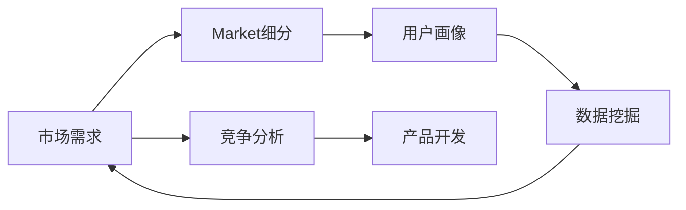

                 

# 人工智能创业：市场需求的识别方法

## 1. 背景介绍

在人工智能(AI)领域，尤其是人工智能创业领域，市场需求的识别是一个关键的环节。准确的识别市场需求，不仅能帮助企业找到合适的切入点，还能指导产品开发方向，避免盲目投入。本文将系统介绍市场需求识别的方法和步骤，帮助AI创业者精准把握市场需求，提升创业成功率。

## 2. 核心概念与联系

### 2.1 核心概念概述

在需求识别过程中，几个关键的概念包括：

- **市场需求**：指特定用户群对某产品或服务的需要，通常与产品的功能、性能、价格等属性相关。
- **市场细分**：将市场按照特定的标准划分成若干子市场，以便更有针对性地开发产品和服务。
- **用户画像**：对目标用户的特征、需求和行为的描述，有助于深入理解市场需求。
- **竞争分析**：分析市场上同类产品或服务的优劣势，以评估市场需求的可能性。
- **数据挖掘**：从海量数据中提取有价值的信息，用于需求分析。

这些概念通过下图的Mermaid流程图进行关联，展示其相互作用：



### 2.2 核心概念原理和架构

#### 2.2.1 市场需求

市场需求可以表示为：

$$ M = f(X) $$

其中 $X$ 代表用户需求、市场趋势、技术发展等多重因素，$f$ 表示这些因素映射到市场需求的过程。市场需求可以分为显性需求和潜在需求，显性需求通常通过直接调研和访谈获得，而潜在需求则需通过数据分析和预测技术挖掘。

#### 2.2.2 市场细分

市场细分的原理基于马斯洛需求层次理论，将用户需求从低层次到高层次依次分为：生理需求、安全需求、社交需求、尊重需求和自我实现需求。例如，对于智能家居市场，可以细分为以下子市场：

- 基础安全需求：智能门锁、监控摄像头
- 舒适需求：智能空调、恒温系统
- 社交需求：智能音箱、视频通话
- 自我实现需求：智能家居控制中心、语音助手

#### 2.2.3 用户画像

用户画像通常包括以下几个维度：

- **人口统计特征**：年龄、性别、收入等。
- **心理特征**：兴趣、价值观、消费习惯等。
- **行为特征**：使用场景、购买频率、品牌忠诚度等。

用户画像可以通过问卷调查、社交媒体分析、购买行为记录等方法获取。

#### 2.2.4 竞争分析

竞争分析包括：

- **产品分析**：分析竞争对手的产品特性、性能、功能等。
- **市场定位**：确定竞争对手的市场定位和市场份额。
- **用户反馈**：收集用户对竞争对手产品的反馈和评价。

竞争分析可以帮助企业理解市场上的竞争格局，制定合适的市场策略。

#### 2.2.5 数据挖掘

数据挖掘方法包括：

- **关联规则学习**：发现数据集中的规则和模式，如Apriori算法。
- **聚类分析**：将数据集中的对象划分为不同的类别，如K-Means算法。
- **分类和回归分析**：预测新数据的类别或数值，如决策树、支持向量机等。

数据挖掘通常采用机器学习模型，通过训练数据集来预测市场需求。

## 3. 核心算法原理 & 具体操作步骤

### 3.1 算法原理概述

市场需求识别可以分解为以下几步：

1. **市场调研**：收集市场数据和用户反馈，理解市场趋势。
2. **数据预处理**：清洗和整合数据，构建数据集。
3. **市场细分**：根据用户需求和行为特征，对市场进行细分。
4. **用户画像构建**：对不同细分市场的用户进行画像，形成详细描述。
5. **竞争分析**：分析竞争对手的产品和市场策略，找出市场空白和机会。
6. **需求预测**：利用数据挖掘算法预测市场需求，优化产品策略。

### 3.2 算法步骤详解

#### 3.2.1 市场调研

市场调研的方法包括：

- **问卷调查**：设计问卷，收集用户对产品或服务的看法和需求。
- **访谈和焦点小组**：与用户进行深入交流，获取详细的反馈和建议。
- **网络爬虫**：从网站和社交媒体上收集公开数据。

调研的数据可以包括：

- **用户反馈**：满意度、建议、痛点等。
- **市场趋势**：技术进步、政策变化、经济环境等。

#### 3.2.2 数据预处理

数据预处理包括：

- **数据清洗**：去除噪声和无关数据，确保数据质量。
- **数据整合**：将不同来源的数据进行整合，构建统一的数据集。
- **数据增强**：通过数据增强技术，提高数据的多样性和质量。

例如，可以使用数据扩增方法，将原始图像进行旋转、裁剪、缩放等处理，增加训练集的多样性。

#### 3.2.3 市场细分

市场细分的方法包括：

- **聚类分析**：使用K-Means等聚类算法，将用户分成不同的群体。
- **因子分析**：通过因子分析，找到影响用户需求的关键因素。
- **分类算法**：使用决策树、支持向量机等分类算法，对市场进行划分。

#### 3.2.4 用户画像构建

用户画像构建的方法包括：

- **问卷调查**：设计问卷，收集用户的基本信息和行为数据。
- **社交媒体分析**：分析用户在社交媒体上的行为和兴趣。
- **购买行为记录**：分析用户的购买记录和消费习惯。

例如，可以通过文本分析，从用户的评论和反馈中提取情感倾向和需求点。

#### 3.2.5 竞争分析

竞争分析的方法包括：

- **产品比较**：分析竞争对手的产品特性、价格、功能等。
- **市场定位**：确定竞争对手的市场定位和市场份额。
- **用户反馈**：收集用户对竞争对手产品的反馈和评价。

竞争分析可以通过SWOT分析、PEST分析等方法进行。

#### 3.2.6 需求预测

需求预测的方法包括：

- **时间序列分析**：预测市场需求的时间变化趋势。
- **回归分析**：预测市场需求与相关因素之间的关系。
- **机器学习模型**：使用决策树、随机森林、神经网络等机器学习模型进行需求预测。

例如，可以使用线性回归模型，预测不同特征对市场需求的影响。

### 3.3 算法优缺点

市场需求识别算法具有以下优点：

- **全面性**：通过多种数据来源和分析方法，可以全面了解市场需求。
- **准确性**：利用数据挖掘和机器学习技术，可以提高需求预测的准确性。
- **动态性**：可以实时监控市场需求变化，快速响应市场趋势。

但同时也存在以下缺点：

- **成本高**：市场调研和数据预处理需要大量的时间和资源投入。
- **复杂性**：数据挖掘和机器学习模型的实现和调试需要较高的技术水平。
- **数据偏差**：数据样本可能存在偏差，影响需求预测的准确性。

### 3.4 算法应用领域

市场需求识别算法广泛应用于以下几个领域：

- **智能家居**：分析用户对智能家居产品的需求，优化产品设计和功能。
- **智能医疗**：分析用户对智能医疗设备的需求，提高医疗服务质量。
- **智能交通**：分析用户对智能交通系统的需求，改善交通流量和效率。
- **智能制造**：分析用户对智能制造设备的需求，提高生产效率和质量。

## 4. 数学模型和公式 & 详细讲解 & 举例说明

### 4.1 数学模型构建

市场需求识别可以通过以下数学模型进行表示：

$$ M = f(X, \theta) $$

其中 $X$ 表示市场数据和用户反馈，$\theta$ 表示模型参数，如权重和偏置等。市场需求 $M$ 可以分解为多个特征 $x_i$ 的线性组合：

$$ M = \sum_{i=1}^{n} w_i x_i + b $$

其中 $w_i$ 为特征 $x_i$ 的权重，$b$ 为模型截距。

### 4.2 公式推导过程

市场需求预测的公式推导过程如下：

- **数据收集**：收集市场数据和用户反馈，构建数据集 $D = \{(x_i, y_i)\}_{i=1}^{m}$，其中 $x_i$ 为特征向量，$y_i$ 为市场需求量。
- **数据预处理**：对数据进行清洗和整合，得到处理后的数据集 $D' = \{(x'_i, y'_i)\}_{i=1}^{m}$。
- **特征工程**：通过特征选择和特征提取，得到特征集合 $\mathcal{X} = \{x_1, x_2, ..., x_n\}$。
- **模型训练**：使用机器学习算法 $f$ 训练模型参数 $\theta$，得到预测函数 $f(X, \theta)$。
- **预测**：对新数据 $X'$ 进行预测，得到市场需求量 $M'$。

例如，可以使用线性回归模型对市场需求进行预测，公式如下：

$$ y = \sum_{i=1}^{n} w_i x_i + b $$

其中 $w_i$ 和 $b$ 通过最小二乘法等优化算法求得。

### 4.3 案例分析与讲解

以智能家居市场为例，进行市场需求预测的案例分析：

1. **数据收集**：通过问卷调查和访谈，收集用户对智能家居产品的需求和反馈，构建数据集 $D$。
2. **数据预处理**：清洗数据，去除噪声和无关信息，整合用户反馈和市场趋势数据，得到处理后的数据集 $D'$。
3. **特征工程**：从数据集中提取关键特征，如用户年龄、收入、购买频率等，构建特征集合 $\mathcal{X}$。
4. **模型训练**：使用线性回归模型训练模型参数 $\theta$，得到预测函数 $f(X, \theta)$。
5. **预测**：对新数据 $X'$ 进行预测，得到市场需求量 $M'$。

例如，可以使用Python的Scikit-learn库进行线性回归模型的训练和预测，代码如下：

```python
from sklearn.linear_model import LinearRegression
import pandas as pd

# 数据预处理
data = pd.read_csv('data.csv')
data = data.dropna()

# 特征工程
X = data[['age', 'income', 'purchase_frequency']]
y = data['demand']

# 模型训练
model = LinearRegression()
model.fit(X, y)

# 预测
new_data = pd.DataFrame({'age': [30], 'income': [50000], 'purchase_frequency': [1]})
prediction = model.predict(new_data)
```

## 5. 项目实践：代码实例和详细解释说明

### 5.1 开发环境搭建

项目开发需要以下环境：

- **Python**：版本为3.7或以上，安装必要的依赖库。
- **Jupyter Notebook**：用于数据处理和模型训练。
- **Scikit-learn**：用于机器学习模型训练。
- **Pandas**：用于数据处理和分析。
- **NumPy**：用于数学运算和数组操作。

安装方法：

- **Python**：使用pip安装，如 `pip install python3`
- **Jupyter Notebook**：使用conda安装，如 `conda install jupyter notebook`
- **Scikit-learn**：使用pip安装，如 `pip install scikit-learn`
- **Pandas**：使用pip安装，如 `pip install pandas`
- **NumPy**：使用pip安装，如 `pip install numpy`

### 5.2 源代码详细实现

以下是一个市场需求预测的代码实例，包括数据预处理、特征工程和模型训练：

```python
import pandas as pd
import numpy as np
from sklearn.linear_model import LinearRegression
from sklearn.model_selection import train_test_split

# 数据预处理
data = pd.read_csv('data.csv')
data = data.dropna()

# 特征工程
X = data[['age', 'income', 'purchase_frequency']]
y = data['demand']

# 划分训练集和测试集
X_train, X_test, y_train, y_test = train_test_split(X, y, test_size=0.2, random_state=42)

# 模型训练
model = LinearRegression()
model.fit(X_train, y_train)

# 预测
new_data = pd.DataFrame({'age': [30], 'income': [50000], 'purchase_frequency': [1]})
prediction = model.predict(new_data)
print(prediction)
```

### 5.3 代码解读与分析

**代码解读**：

- **数据预处理**：读取数据文件，去除缺失值，构建特征集合和目标变量。
- **特征工程**：提取关键特征，如年龄、收入、购买频率等。
- **模型训练**：使用线性回归模型训练模型参数，得到预测函数。
- **预测**：对新数据进行预测，得到市场需求量。

**分析**：

- **数据预处理**：通过去除缺失值和异常值，提高数据质量。
- **特征工程**：提取与市场需求相关的关键特征，构建特征集合。
- **模型训练**：使用线性回归模型进行训练，得到预测函数。
- **预测**：对新数据进行预测，得到市场需求量。

## 6. 实际应用场景

### 6.1 智能家居

智能家居市场的市场需求识别可以通过以下步骤：

1. **市场调研**：收集用户对智能家居产品的需求和反馈，构建数据集 $D$。
2. **数据预处理**：清洗数据，去除噪声和无关信息，整合用户反馈和市场趋势数据，得到处理后的数据集 $D'$。
3. **特征工程**：从数据集中提取关键特征，如用户年龄、收入、购买频率等，构建特征集合 $\mathcal{X}$。
4. **模型训练**：使用机器学习算法 $f$ 训练模型参数 $\theta$，得到预测函数 $f(X, \theta)$。
5. **预测**：对新数据 $X'$ 进行预测，得到市场需求量 $M'$。

例如，可以通过问卷调查和访谈，收集用户对智能家居产品的需求和反馈，构建数据集 $D$。使用线性回归模型训练模型参数，得到预测函数 $f(X, \theta)$。对新数据 $X'$ 进行预测，得到市场需求量 $M'$。

### 6.2 智能医疗

智能医疗市场的市场需求识别可以通过以下步骤：

1. **市场调研**：收集医生和患者对智能医疗设备的需求和反馈，构建数据集 $D$。
2. **数据预处理**：清洗数据，去除噪声和无关信息，整合医生和患者的反馈和市场趋势数据，得到处理后的数据集 $D'$。
3. **特征工程**：从数据集中提取关键特征，如患者年龄、病情、治疗方式等，构建特征集合 $\mathcal{X}$。
4. **模型训练**：使用机器学习算法 $f$ 训练模型参数 $\theta$，得到预测函数 $f(X, \theta)$。
5. **预测**：对新数据 $X'$ 进行预测，得到市场需求量 $M'$。

例如，可以通过问卷调查和访谈，收集医生和患者对智能医疗设备的需求和反馈，构建数据集 $D$。使用线性回归模型训练模型参数，得到预测函数 $f(X, \theta)$。对新数据 $X'$ 进行预测，得到市场需求量 $M'$。

### 6.3 智能交通

智能交通市场的市场需求识别可以通过以下步骤：

1. **市场调研**：收集用户对智能交通系统的需求和反馈，构建数据集 $D$。
2. **数据预处理**：清洗数据，去除噪声和无关信息，整合用户反馈和市场趋势数据，得到处理后的数据集 $D'$。
3. **特征工程**：从数据集中提取关键特征，如用户出行频率、路线偏好、交通拥堵情况等，构建特征集合 $\mathcal{X}$。
4. **模型训练**：使用机器学习算法 $f$ 训练模型参数 $\theta$，得到预测函数 $f(X, \theta)$。
5. **预测**：对新数据 $X'$ 进行预测，得到市场需求量 $M'$。

例如，可以通过问卷调查和访谈，收集用户对智能交通系统的需求和反馈，构建数据集 $D$。使用线性回归模型训练模型参数，得到预测函数 $f(X, \theta)$。对新数据 $X'$ 进行预测，得到市场需求量 $M'$。

## 7. 工具和资源推荐

### 7.1 学习资源推荐

为了帮助开发者系统掌握市场需求识别的方法和步骤，以下是一些优质的学习资源：

1. **《Python数据科学手册》**：介绍Python在数据科学中的应用，包含市场调研、数据预处理、特征工程、模型训练等知识点。
2. **《机器学习实战》**：实战型的机器学习入门书籍，包含市场需求预测的实际案例和代码实现。
3. **Coursera《数据科学与机器学习》课程**：斯坦福大学开设的课程，涵盖数据预处理、特征工程、模型训练等知识点。
4. **Kaggle竞赛平台**：提供大量市场需求预测的竞赛项目，通过实战提升技能。
5. **Python社区和论坛**：如Stack Overflow、GitHub等，获取市场需求识别相关的开源项目和代码。

### 7.2 开发工具推荐

以下是一些用于市场需求识别开发的常用工具：

1. **Jupyter Notebook**：用于数据处理和模型训练，支持Python代码的交互式执行。
2. **Scikit-learn**：用于机器学习模型训练和评估，提供丰富的算法和工具。
3. **Pandas**：用于数据处理和分析，支持数据清洗、整合和可视化。
4. **NumPy**：用于数学运算和数组操作，支持高效的数值计算。
5. **TensorFlow**：用于深度学习模型训练和预测，支持大规模数据集处理。

### 7.3 相关论文推荐

市场需求识别相关论文包括：

1. **《市场需求识别与预测：基于机器学习的模型》**：介绍市场需求识别的基本原理和机器学习算法，包括回归分析、时间序列分析等。
2. **《智能家居市场需求预测：基于多模态数据的方法》**：介绍智能家居市场需求的识别和预测方法，结合多模态数据进行建模。
3. **《智能医疗市场需求识别：基于用户反馈和机器学习的方法》**：介绍智能医疗市场需求的识别方法，结合用户反馈和机器学习模型进行预测。
4. **《智能交通市场需求预测：基于用户行为和交通数据的方法》**：介绍智能交通市场需求的识别和预测方法，结合用户行为和交通数据进行建模。

## 8. 总结：未来发展趋势与挑战

### 8.1 研究成果总结

市场需求识别在AI创业中具有重要意义，通过系统化的分析方法和技术手段，可以更准确地理解市场需求，优化产品策略。主要研究内容包括：

- **市场调研**：收集用户需求和反馈，构建数据集。
- **数据预处理**：清洗和整合数据，构建数据集。
- **特征工程**：提取关键特征，构建特征集合。
- **模型训练**：使用机器学习算法训练模型，得到预测函数。
- **预测**：对新数据进行预测，得到市场需求量。

### 8.2 未来发展趋势

市场需求识别技术将呈现以下几个发展趋势：

1. **数据的多样化和自动化**：通过自动化数据采集和预处理，提高数据质量和效率。
2. **模型的复杂化和智能化**：使用深度学习和强化学习算法，提升市场需求预测的准确性和实时性。
3. **多模态数据融合**：结合文本、图像、音频等多模态数据，提高市场需求识别的全面性和准确性。
4. **实时监控和动态调整**：实时监控市场需求变化，动态调整产品策略，适应市场变化。

### 8.3 面临的挑战

市场需求识别技术在应用过程中面临以下挑战：

1. **数据质量问题**：市场数据存在噪声、缺失等问题，影响需求识别准确性。
2. **模型复杂性**：深度学习模型复杂度高，训练和调参难度大。
3. **技术门槛高**：需要具备较强的数据处理和机器学习背景，对技术要求较高。
4. **市场需求的多变性**：市场需求具有高度不确定性和动态变化性，难以准确预测。

### 8.4 研究展望

市场需求识别技术需要进一步优化和创新，主要研究方向包括：

1. **自动化数据采集和预处理**：通过自动化技术，提高数据质量和效率。
2. **深度学习和强化学习算法**：使用复杂模型提高市场需求预测的准确性和实时性。
3. **多模态数据融合**：结合多模态数据，提高市场需求识别的全面性和准确性。
4. **实时监控和动态调整**：实时监控市场需求变化，动态调整产品策略，适应市场变化。

## 9. 附录：常见问题与解答

**Q1：市场需求识别需要哪些关键步骤？**

A: 市场需求识别需要以下关键步骤：

1. **市场调研**：收集用户需求和反馈，构建数据集。
2. **数据预处理**：清洗和整合数据，构建数据集。
3. **特征工程**：提取关键特征，构建特征集合。
4. **模型训练**：使用机器学习算法训练模型，得到预测函数。
5. **预测**：对新数据进行预测，得到市场需求量。

**Q2：市场需求识别中常用的机器学习算法有哪些？**

A: 市场需求识别中常用的机器学习算法包括：

- **线性回归**：预测市场需求与相关因素之间的关系。
- **决策树**：通过树形结构进行分类和预测。
- **随机森林**：结合多棵决策树进行分类和预测，提高模型准确性。
- **支持向量机**：通过构造最优超平面进行分类和预测。
- **神经网络**：使用多层神经网络进行复杂关系建模和预测。

**Q3：市场需求预测中的数据质量问题如何解决？**

A: 市场需求预测中的数据质量问题可以通过以下方法解决：

- **数据清洗**：去除噪声和异常值，提高数据质量。
- **数据增强**：通过数据扩增方法，增加数据的多样性和质量。
- **特征选择**：选择与市场需求相关的关键特征，减少噪声干扰。
- **异常检测**：识别和处理异常数据，减少对模型的影响。

**Q4：市场需求预测中的模型复杂性如何解决？**

A: 市场需求预测中的模型复杂性可以通过以下方法解决：

- **简化模型**：使用线性回归等简单模型进行预测，降低复杂性。
- **自动化调参**：使用自动调参技术，优化模型参数，提高预测准确性。
- **模型融合**：结合多个模型进行预测，综合不同模型的优势。
- **分布式训练**：使用分布式计算资源，加速模型训练。

**Q5：市场需求预测中的技术门槛如何解决？**

A: 市场需求预测中的技术门槛可以通过以下方法解决：

- **在线学习**：通过在线学习方式，逐步提升技术水平。
- **社区支持**：加入技术社区，获取专家支持和交流经验。
- **持续学习**：通过不断学习和实践，积累经验，提高技术水平。
- **自动化工具**：使用自动化工具，降低技术门槛，提高效率。

通过系统掌握市场需求识别的方法和步骤，相信你能够更加准确地理解市场需求，提升AI创业的成功率。未来市场需求识别技术将继续发展，为AI创业带来更多的机遇和挑战。

---

作者：禅与计算机程序设计艺术 / Zen and the Art of Computer Programming

