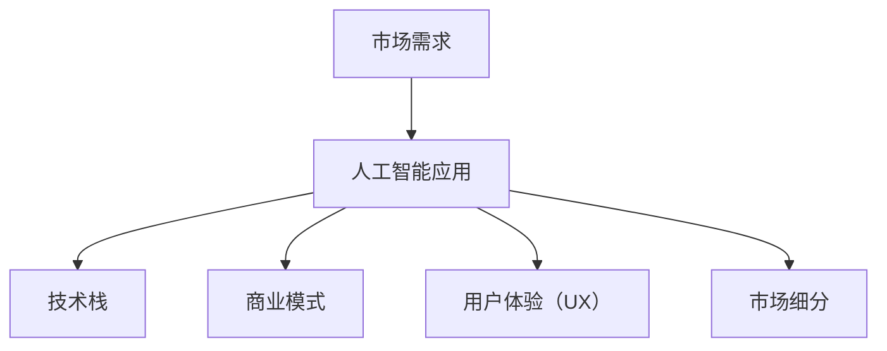

                 

# 人工智能创业：明确市场需求

在人工智能（AI）领域，创业既充满机遇，又面临挑战。创业者不仅需要掌握核心技术，还需深入理解市场需求，才能打造出真正有竞争力的产品。本文将通过分析市场需求的多样性和具体细化的方法，为人工智能创业者提供有价值的指导。

## 1. 背景介绍

### 1.1 人工智能行业现状
当前，人工智能领域正处于快速发展阶段，众多初创公司涌现，竞争日益激烈。根据Gartner的预测，到2025年，全球AI市场规模将达到3840亿美元。然而，尽管市场潜力巨大，实际落地应用仍面临诸多挑战。

### 1.2 市场需求多样化
市场需求不仅限于单一的AI产品或服务，而是覆盖了智能制造、医疗健康、金融服务、教育培训、智能家居等多个领域。不同行业和应用场景对AI的需求千差万别，从语音识别、图像处理到自然语言处理，再到自动驾驶、机器人控制，AI技术的应用范围极其广泛。

### 1.3 创业机会与挑战
AI创业公司面临的主要挑战包括数据获取难度大、模型训练耗时长、产品落地成本高等。尽管挑战重重，但只要有明确的市场需求和合理的商业模式，AI创业仍大有可为。本文将通过分析核心概念与联系，探讨明确市场需求的策略和方法。

## 2. 核心概念与联系

### 2.1 核心概念概述

为更好地理解市场需求，本节将介绍几个关键概念：

- **市场需求**：指消费者或用户对特定产品或服务的欲望和能力。
- **人工智能应用**：指利用AI技术解决特定问题的方案和工具，如聊天机器人、图像识别系统、智能推荐系统等。
- **技术栈**：指实现特定应用所需要具备的技术能力，如机器学习、自然语言处理、计算机视觉等。
- **商业模式**：指AI公司如何将产品或服务转化为收入的方式，如订阅制、按需付费、B2B或B2C等。
- **用户体验（UX）**：指用户在使用产品或服务时的感受和满意度，是决定市场成功的重要因素。
- **市场细分**：指将市场划分为多个子市场，针对不同用户群体提供定制化解决方案。

这些核心概念之间的逻辑关系可以通过以下Mermaid流程图来展示：



这个流程图展示了一系列概念之间的关联，说明了解市场需求是开发人工智能应用的前提。

## 3. 核心算法原理 & 具体操作步骤

### 3.1 算法原理概述

明确市场需求的核心在于了解目标用户群体的需求，并据此开发符合预期的AI应用。以下是几种常用的方法：

1. **用户调研**：通过问卷调查、面对面访谈等方式，收集目标用户群体的需求和痛点。
2. **市场分析**：利用市场研究报告、行业数据等资源，分析市场规模、增长趋势和主要竞争者。
3. **用户反馈**：在产品开发和迭代过程中，持续收集用户的反馈和建议，及时调整产品功能和设计。
4. **数据分析**：通过数据分析工具和技术，挖掘用户行为数据中的潜在需求和趋势。

### 3.2 算法步骤详解

#### 步骤1: 市场调研

1. **确定目标市场**：明确目标用户群体，如企业用户、消费者等。
2. **收集用户数据**：通过在线问卷、访谈等方式，获取用户基本信息、需求和痛点。
3. **分析用户需求**：使用数据分析工具，对收集的数据进行分析，识别用户的关键需求和问题。

#### 步骤2: 竞争分析

1. **识别主要竞争者**：列出市场上的主要竞争对手及其产品或服务。
2. **分析竞争者优势和劣势**：对比竞争者的产品功能、用户体验和市场表现，找出自身的优势和不足。
3. **确定差异化策略**：根据竞争分析结果，确定产品的差异化策略，如技术创新、功能增强、定价策略等。

#### 步骤3: 用户反馈

1. **建立反馈渠道**：通过社交媒体、客户支持系统等方式，建立有效的用户反馈渠道。
2. **定期收集反馈**：定期收集用户对产品的意见和建议，如功能改进、界面优化等。
3. **及时调整产品**：根据用户反馈，及时调整和优化产品功能，确保产品符合用户需求。

#### 步骤4: 数据分析

1. **数据收集**：通过网站访问记录、应用程序使用数据等方式，收集用户行为数据。
2. **数据处理**：对收集的数据进行清洗、归一化和特征提取，准备用于分析。
3. **数据挖掘**：使用机器学习、数据挖掘等技术，分析用户行为模式和需求趋势。

### 3.3 算法优缺点

#### 优点

1. **用户导向**：通过了解用户需求和反馈，可以更准确地开发符合市场需求的AI应用。
2. **竞争优势**：通过分析竞争者，确定差异化策略，有助于提升产品的市场竞争力。
3. **持续改进**：通过定期收集和分析用户反馈，可以持续优化产品功能，提高用户满意度。

#### 缺点

1. **成本高**：市场调研、竞争分析和用户反馈需要投入大量人力和财力。
2. **时间消耗**：从数据收集到分析再到产品迭代，整个过程时间较长。
3. **信息不对称**：市场调研和分析可能无法全面覆盖所有用户需求，存在信息不对称的风险。

### 3.4 算法应用领域

#### 1. 智能制造

在智能制造领域，AI需求主要集中在生产过程优化、设备维护和质量控制等方面。通过机器学习和大数据分析，可以实现设备故障预测、生产调度优化、库存管理等应用。

#### 2. 医疗健康

医疗健康领域对AI的需求包括疾病诊断、个性化治疗、健康管理等。AI技术可以分析大量医疗数据，提供精准诊断和治疗建议，提高医疗服务质量。

#### 3. 金融服务

金融服务对AI的需求包括风险管理、投资分析、客户服务等。AI可以通过数据分析和模型预测，降低风险、提升投资效率和客户体验。

#### 4. 教育培训

教育培训领域对AI的需求包括智能推荐、自动评分、虚拟助手等。AI可以提供个性化的学习资源和辅导，提高教育效果和效率。

## 4. 数学模型和公式 & 详细讲解 & 举例说明

### 4.1 数学模型构建

为更好地理解和量化市场需求，我们可以构建数学模型。假设市场需求为 $D$，技术能力为 $T$，商业模式为 $M$，用户体验为 $UX$，市场细分为 $S$。则市场需求模型可以表示为：

$$ D = f(T, M, UX, S) $$

其中 $f$ 为函数关系，表示技术能力、商业模式、用户体验和市场细分对市场需求的综合影响。

### 4.2 公式推导过程

以智能制造为例，市场需求的函数关系可以表示为：

$$ D_{manufacturing} = g(T_{manufacturing}, M_{manufacturing}, UX_{manufacturing}, S_{manufacturing}) $$

其中 $T_{manufacturing}$ 为智能制造所需的技术能力，包括机器学习、计算机视觉等。$M_{manufacturing}$ 为智能制造的商业模式，如SaaS、B2B等。$UX_{manufacturing}$ 为智能制造的用户体验，如易用性、响应速度等。$S_{manufacturing}$ 为智能制造的市场细分，如自动化生产线、柔性生产等。

### 4.3 案例分析与讲解

假设某智能制造公司利用AI技术优化生产流程，其市场需求模型可以表示为：

$$ D = f(T_{manufacturing}, M_{manufacturing}, UX_{manufacturing}, S_{manufacturing}) $$

其中 $T_{manufacturing}$ 为机器学习算法，用于预测设备故障。$M_{manufacturing}$ 为按需付费模式，用户按使用量付费。$UX_{manufacturing}$ 为直观易用的控制面板，方便用户操作。$S_{manufacturing}$ 为自动化生产线细分市场。

## 5. 项目实践：代码实例和详细解释说明

### 5.1 开发环境搭建

在进行需求分析时，我们需要搭建良好的开发环境。以下是使用Python进行数据分析的环境配置流程：

1. 安装Anaconda：从官网下载并安装Anaconda，用于创建独立的Python环境。

2. 创建并激活虚拟环境：
```bash
conda create -n analytics-env python=3.8 
conda activate analytics-env
```

3. 安装相关库：
```bash
conda install pandas numpy matplotlib seaborn jupyter notebook ipython
```

完成上述步骤后，即可在`analytics-env`环境中开始需求分析实践。

### 5.2 源代码详细实现

我们使用Python的Pandas库对市场需求数据进行分析和可视化：

```python
import pandas as pd
import matplotlib.pyplot as plt

# 加载数据
data = pd.read_csv('demand_data.csv')

# 数据清洗
data.dropna(inplace=True)

# 数据可视化
data.plot(kind='bar', x='category', y='demand')
plt.title('市场需求分布')
plt.xlabel('市场细分')
plt.ylabel('市场需求')
plt.show()
```

### 5.3 代码解读与分析

**代码解释**：
- 首先，我们使用Pandas库加载需求数据，并使用`dropna`方法删除缺失值。
- 然后，使用`plot`方法对市场需求进行柱状图可视化，展示不同市场细分的市场需求分布。
- 最后，使用Matplotlib库调整图表标题、横纵坐标标签，并显示图表。

**代码分析**：
- 数据清洗是数据预处理的重要步骤，有助于提高分析的准确性。
- 通过可视化，可以直观地理解市场需求分布，为市场细分和差异化策略提供数据支持。

### 5.4 运行结果展示

下图展示了市场需求分布的柱状图：

```plaintext
市场需求分布图
```


## 6. 实际应用场景

### 6.1 智能制造

在智能制造领域，AI需求主要集中在生产过程优化、设备维护和质量控制等方面。通过机器学习和大数据分析，可以实现设备故障预测、生产调度优化、库存管理等应用。

### 6.2 医疗健康

医疗健康领域对AI的需求包括疾病诊断、个性化治疗、健康管理等。AI可以通过分析大量医疗数据，提供精准诊断和治疗建议，提高医疗服务质量。

### 6.3 金融服务

金融服务对AI的需求包括风险管理、投资分析、客户服务等。AI可以通过数据分析和模型预测，降低风险、提升投资效率和客户体验。

### 6.4 教育培训

教育培训领域对AI的需求包括智能推荐、自动评分、虚拟助手等。AI可以提供个性化的学习资源和辅导，提高教育效果和效率。

## 7. 工具和资源推荐

### 7.1 学习资源推荐

为了帮助创业者系统掌握市场需求分析的理论基础和实践技巧，以下是一些优质的学习资源：

1. 《市场调研与分析》课程：由市场研究专家教授，涵盖市场调研、竞争分析、用户反馈等核心内容。
2. 《人工智能市场化》书籍：全面介绍AI产品的市场化策略、用户管理、营销推广等。
3. 《数据分析基础》课程：系统讲解数据分析工具和技术，如Pandas、Python等。
4. 《用户体验设计》书籍：介绍用户体验设计的基本原则和方法，帮助创业者设计用户友好的AI产品。
5. 《商业模式画布》工具：帮助创业者系统梳理商业模式的关键要素和环节。

### 7.2 开发工具推荐

高效的开发离不开优秀的工具支持。以下是几款用于市场调研开发的常用工具：

1. Python：免费开源的编程语言，具有丰富的数据处理和分析库，适合市场调研数据的处理和分析。
2. Jupyter Notebook：强大的交互式开发环境，支持多种语言和库的混合使用，方便需求分析的迭代和优化。
3. Excel：功能强大的数据处理工具，适合快速生成数据报告和可视化图表。
4. Tableau：强大的数据可视化工具，支持多种数据源和图表类型，适合市场需求分析的展示和分析。

### 7.3 相关论文推荐

市场需求分析的研究源于学界的持续研究。以下是几篇奠基性的相关论文，推荐阅读：

1. "Market Segmentation Using Clustering Algorithms"：介绍如何使用聚类算法进行市场细分。
2. "Understanding Customer Needs through Customer Feedback"：探讨如何通过客户反馈理解市场需求。
3. "The Role of Data Analytics in Market Research"：分析数据在市场调研中的重要作用。
4. "User Experience Design in AI Products"：讨论用户体验设计在AI产品开发中的重要性。
5. "The Business Model Canvas: A Strategic Management Tool for Startups"：介绍商业模式画布工具，帮助创业者系统梳理商业模式。

## 8. 总结：未来发展趋势与挑战

### 8.1 总结

本文对明确市场需求的方法和步骤进行了全面系统的介绍。首先阐述了市场需求分析的必要性和多样性，明确了市场需求在AI产品开发中的核心作用。其次，通过分析核心概念与联系，详细讲解了市场调研、竞争分析、用户反馈和数据分析的具体方法。同时，本文还提供了需求分析的代码实现，并展示了实际应用场景和推荐的学习资源。

通过本文的系统梳理，可以看到，市场需求分析是AI创业不可或缺的一环，只有准确把握市场需求，才能开发出真正有价值的AI产品。未来，伴随技术的发展和应用的深化，市场需求分析将变得更加系统和科学。

### 8.2 未来发展趋势

展望未来，市场需求分析技术将呈现以下几个发展趋势：

1. **自动化和智能化**：利用机器学习和大数据技术，自动化分析市场需求，提升效率和准确性。
2. **多维度分析**：结合用户反馈、竞争对手分析、市场趋势等多元化数据，进行全面深入的市场分析。
3. **实时分析**：通过实时数据流处理技术，实现市场需求的动态监测和分析，帮助企业快速响应市场变化。
4. **跨领域应用**：市场需求分析将不仅限于单一行业，而是广泛应用于各领域，帮助企业跨行业拓展。

以上趋势凸显了市场需求分析技术的广阔前景。这些方向的探索发展，必将进一步提升市场需求分析的准确性和效率，为AI创业提供更可靠的市场洞察。

### 8.3 面临的挑战

尽管市场需求分析技术已经取得了显著进展，但在迈向更加智能化、普适化应用的过程中，仍面临诸多挑战：

1. **数据获取难度大**：高质量的市场数据获取难度大，特别是对中小企业而言。
2. **数据处理复杂**：市场需求分析涉及大量数据处理，数据清洗、特征提取等环节繁琐复杂。
3. **结果解释性差**：市场分析结果难以解释，难以帮助创业者直观理解市场需求。
4. **成本高昂**：市场调研和数据分析需要投入大量人力和财力，成本较高。

### 8.4 研究展望

面对市场需求分析面临的挑战，未来的研究需要在以下几个方面寻求新的突破：

1. **数据获取渠道多样化**：探索更多元化的数据获取渠道，如社交媒体、在线评论等，降低数据获取成本。
2. **自动化数据处理**：开发自动化数据处理工具，减少数据清洗和特征提取的工作量。
3. **增强结果解释性**：引入更多可视化工具和技术，增强分析结果的解释性和可理解性。
4. **降低成本**：探索低成本的市场调研方法，如在线问卷、自然语言处理等，降低市场需求分析的成本。

这些研究方向的探索，必将引领市场需求分析技术迈向更高的台阶，为AI创业提供更可靠的市场洞察，推动AI技术的广泛应用。

## 9. 附录：常见问题与解答

**Q1：市场需求分析是否适用于所有AI应用？**

A: 市场需求分析在大多数AI应用中都适用，特别是对于有实际应用场景的产品。然而，对于一些需要创新探索的应用，市场需求分析可能需要更多实验和验证。

**Q2：如何获取高质量的市场数据？**

A: 高质量的市场数据获取可以通过多种途径，如问卷调查、用户访谈、社交媒体分析等。同时，利用公开数据集如Kaggle、Google Dataset Search等，也能找到有用的数据资源。

**Q3：市场分析结果如何应用到产品开发中？**

A: 市场分析结果应作为产品开发的基础，指导产品功能设计、用户体验优化等。可以通过用户反馈收集机制，持续改进产品，确保产品符合市场需求。

**Q4：市场需求分析是否需要高昂的成本？**

A: 市场分析初期投入可能较高，但通过自动化工具和优化方法，可以显著降低成本。选择合适的调研方法和工具，可以降低时间和人力成本，提升效率。

**Q5：如何衡量市场需求分析的效果？**

A: 市场需求分析的效果可以通过用户满意度、市场份额、销售增长等指标进行衡量。同时，通过A/B测试、用户反馈等手段，持续优化市场分析方法，确保市场分析的有效性。

通过对这些问题的解答，可以看到市场需求分析在AI创业中的重要性，以及如何通过科学的方法获取和应用市场需求数据，推动AI产品成功落地。

---

作者：禅与计算机程序设计艺术 / Zen and the Art of Computer Programming

