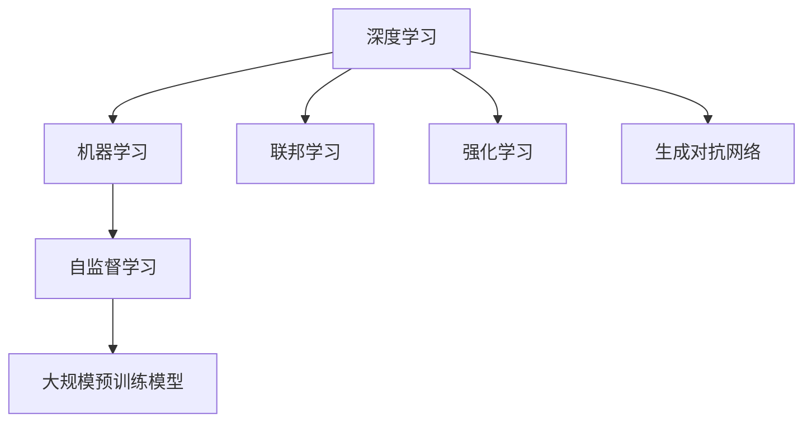

                 

# 人工智能前沿研究热点与发展趋势原理与代码实战案例讲解

> 关键词：人工智能,深度学习,机器学习,前沿研究,发展趋势,原理与代码实战案例

## 1. 背景介绍

### 1.1 问题由来
近年来，人工智能（AI）技术在各行各业的应用越来越广泛，从自然语言处理（NLP）到计算机视觉（CV），再到机器人、自动驾驶等，AI技术正逐渐改变着人类的生产生活方式。与此同时，AI研究也进入了一个全新的阶段，越来越多的前沿技术不断涌现，推动着AI技术的进步和突破。

### 1.2 问题核心关键点
当前，AI前沿研究的热点主要集中在以下几个方面：深度学习、机器学习、联邦学习、强化学习、生成对抗网络（GANs）、自监督学习、大规模预训练模型等。这些技术不仅在学术界引起了广泛关注，在产业界也得到了广泛应用，极大地推动了AI技术的进步和发展。

### 1.3 问题研究意义
研究和理解这些前沿技术的发展趋势，对于把握AI技术的未来方向，推动产业应用具有重要意义。同时，这些技术也为我们提供了更多的研究思路和方法，可以借鉴和应用到实际项目中，提升AI应用的性能和效果。

## 2. 核心概念与联系

### 2.1 核心概念概述

为了更好地理解AI前沿研究的技术和趋势，本节将介绍几个核心概念：

- 深度学习（Deep Learning）：基于多层神经网络模型，通过大量数据进行训练，学习特征表示，解决复杂的模式识别、分类、回归等任务。
- 机器学习（Machine Learning）：通过数据训练模型，学习数据的规律，预测新数据的表现。
- 联邦学习（Federated Learning）：在分布式数据环境下，保护数据隐私的前提下，通过聚合各个数据点的更新来训练全局模型。
- 强化学习（Reinforcement Learning）：通过与环境交互，学习最优策略，使智能体在环境中取得最优结果。
- 生成对抗网络（GANs）：由生成器和判别器两个模型组成，通过对抗训练，生成逼真的数据。
- 自监督学习（Self-Supervised Learning）：利用数据自身的内在关系，无需标注数据，学习数据的表示。
- 大规模预训练模型（Large Pre-trained Models）：在大规模无标注数据上进行预训练，学习通用特征表示，然后在下游任务上进行微调。

这些核心概念之间的逻辑关系可以通过以下Mermaid流程图来展示：



这个流程图展示了AI研究的主要方向及其关联关系。

## 3. 核心算法原理 & 具体操作步骤

### 3.1 算法原理概述

AI前沿研究的技术和方法，大多建立在深度学习、机器学习等核心算法的基础上。下面将详细介绍几个代表性算法及其原理。

#### 3.1.1 深度学习原理
深度学习基于多层神经网络模型，通过反向传播算法进行训练。其核心思想是通过学习数据的特征表示，进行模式识别和分类。深度学习的核心在于网络的深层结构和大量数据，可以自动提取数据的高层次特征。

#### 3.1.2 机器学习原理
机器学习通过数据训练模型，学习数据的规律，进行预测和分类。其主要算法包括监督学习、非监督学习和半监督学习。监督学习通过标注数据进行训练，非监督学习通过未标注数据进行学习，半监督学习结合标注和非标注数据进行学习。

#### 3.1.3 联邦学习原理
联邦学习是在分布式数据环境下，通过聚合各个数据点的更新来训练全局模型。每个参与方只上传模型参数的差分值，保护数据隐私。其核心在于聚合策略的设计，如模型平均、加权平均等。

#### 3.1.4 强化学习原理
强化学习通过与环境交互，学习最优策略。其核心在于奖励信号的设计，如Q-learning、策略梯度等。强化学习应用于自动控制、游戏AI等领域。

#### 3.1.5 生成对抗网络原理
生成对抗网络由生成器和判别器两个模型组成，通过对抗训练，生成逼真的数据。其核心在于生成器和判别器的对抗性训练，使生成器能够生成越来越逼真的数据。

#### 3.1.6 自监督学习原理
自监督学习利用数据自身的内在关系，无需标注数据，学习数据的表示。其主要算法包括 contrastive learning、autoencoder等。

#### 3.1.7 大规模预训练模型原理
大规模预训练模型在大规模无标注数据上进行预训练，学习通用特征表示，然后在下游任务上进行微调。其主要算法包括 BERT、GPT-3等。

### 3.2 算法步骤详解

下面以深度学习和强化学习为例，详细介绍其具体操作步骤。

#### 3.2.1 深度学习步骤详解
1. 数据预处理：对原始数据进行清洗、归一化、分词等预处理，准备数据集。
2. 模型构建：设计多层神经网络模型，包括输入层、隐藏层、输出层等。
3. 模型训练：通过反向传播算法，对模型进行训练，优化模型参数。
4. 模型评估：使用测试集对训练好的模型进行评估，计算各项性能指标。
5. 模型应用：将训练好的模型应用于实际任务，进行预测或分类。

#### 3.2.2 强化学习步骤详解
1. 环境设计：定义环境，包括状态空间、动作空间、奖励函数等。
2. 智能体设计：设计智能体，包括策略函数、值函数等。
3. 训练智能体：通过与环境交互，更新智能体的策略函数和值函数。
4. 评估智能体：使用测试环境评估智能体的性能，选择最优策略。
5. 应用智能体：将训练好的智能体应用于实际问题，进行自动控制或游戏AI。

### 3.3 算法优缺点

#### 3.3.1 深度学习优缺点
深度学习的优点包括：
- 能够自动提取数据的高层次特征，无需手工特征工程。
- 在大规模数据上表现优异，能够处理复杂的模式识别和分类问题。

深度学习的缺点包括：
- 需要大量标注数据进行训练，数据获取成本高。
- 模型复杂度大，需要较强的计算资源。
- 模型黑盒，难以解释。

#### 3.3.2 机器学习优缺点
机器学习的优点包括：
- 能够处理各种类型的数据，包括文本、图像、语音等。
- 模型可解释性强，容易理解和调试。

机器学习的缺点包括：
- 需要大量标注数据进行训练，数据获取成本高。
- 模型性能依赖于数据质量，数据噪声影响较大。

#### 3.3.3 联邦学习优缺点
联邦学习的优点包括：
- 保护数据隐私，无需将原始数据上传服务器。
- 能够在分布式数据环境下进行训练，降低数据传输成本。

联邦学习的缺点包括：
- 需要设计合理的聚合策略，否则可能导致模型过拟合或欠拟合。
- 通信开销较大，需要保证网络带宽和时延。

#### 3.3.4 强化学习优缺点
强化学习的优点包括：
- 能够处理非结构化数据，如图像、音频等。
- 能够通过与环境交互学习最优策略。

强化学习的缺点包括：
- 需要设计合理的奖励信号，否则可能无法收敛。
- 模型复杂度高，计算资源消耗大。

#### 3.3.5 生成对抗网络优缺点
生成对抗网络的优点包括：
- 能够生成逼真的数据，如图像、音频等。
- 能够提升数据的生成质量和多样性。

生成对抗网络的缺点包括：
- 需要设计合理的生成器和判别器模型，否则可能无法收敛。
- 生成器的泛化能力较差，难以生成高质量的数据。

#### 3.3.6 自监督学习优缺点
自监督学习的优点包括：
- 能够利用未标注数据进行学习，无需标注数据。
- 能够提升数据表示的质量，增强模型的泛化能力。

自监督学习的缺点包括：
- 需要设计合理的学习目标，否则可能无法收敛。
- 模型的性能依赖于数据的噪声和分布。

#### 3.3.7 大规模预训练模型优缺点
大规模预训练模型的优点包括：
- 能够学习通用特征表示，提升下游任务的性能。
- 能够利用大规模数据进行预训练，提升模型的泛化能力。

大规模预训练模型的缺点包括：
- 需要大量计算资源进行预训练，成本高。
- 模型黑盒，难以解释。

### 3.4 算法应用领域

AI前沿研究的技术和方法，已经在多个领域得到了广泛应用。

#### 3.4.1 自然语言处理
深度学习在NLP中得到了广泛应用，如BERT、GPT-3等预训练模型，使得NLP任务如机器翻译、情感分析、文本分类等取得了显著的进步。

#### 3.4.2 计算机视觉
深度学习在CV中得到了广泛应用，如ResNet、Inception等网络结构，使得图像分类、目标检测、图像生成等任务取得了显著的进步。

#### 3.4.3 自动驾驶
强化学习在自动驾驶中得到了广泛应用，如通过模拟环境训练智能体进行驾驶决策，提升驾驶安全性。

#### 3.4.4 游戏AI
强化学习在游戏AI中得到了广泛应用，如AlphaGo通过与环境交互学习最优策略，成为围棋世界冠军。

#### 3.4.5 金融风控
机器学习在金融风控中得到了广泛应用，如利用历史数据训练模型进行信用评分、欺诈检测等。

#### 3.4.6 医疗影像
深度学习在医疗影像中得到了广泛应用，如通过训练模型进行图像分割、病灶识别等。

## 4. 数学模型和公式 & 详细讲解 & 举例说明

### 4.1 数学模型构建

为了更好地理解AI前沿研究的数学原理，本节将介绍几个核心数学模型。

#### 4.1.1 深度学习数学模型
深度学习模型包括多层神经网络，其数学模型可以表示为：

$$
y = \sigma(z) = \sigma(Wx + b)
$$

其中，$x$ 为输入，$y$ 为输出，$z$ 为线性变换结果，$W$ 为权重矩阵，$b$ 为偏置向量，$\sigma$ 为激活函数。

#### 4.1.2 机器学习数学模型
机器学习模型包括监督学习、非监督学习和半监督学习，其数学模型可以表示为：

$$
y = \theta^T x
$$

其中，$x$ 为输入，$y$ 为输出，$\theta$ 为模型参数。

#### 4.1.3 联邦学习数学模型
联邦学习模型包括全局模型和本地模型，其数学模型可以表示为：

$$
\theta^{k+1} = \theta^k - \eta \nabla L(\theta^k)
$$

其中，$\theta$ 为模型参数，$L$ 为损失函数，$\nabla L$ 为损失函数梯度，$\eta$ 为学习率。

#### 4.1.4 强化学习数学模型
强化学习模型包括策略函数和值函数，其数学模型可以表示为：

$$
Q(s,a) = \sum_{s'} r(s',a) \pi(a|s')
$$

其中，$s$ 为状态，$a$ 为动作，$r$ 为奖励，$\pi$ 为策略函数，$Q$ 为值函数。

#### 4.1.5 生成对抗网络数学模型
生成对抗网络包括生成器和判别器两个模型，其数学模型可以表示为：

$$
\begin{aligned}
&\min_{G} \mathbb{E}_{x \sim p_{\text{data}}}[\log D(G(x))] + \mathbb{E}_{z \sim p_{z}}[\log (1-D(G(z)))] \\
&\min_{D} \mathbb{E}_{x \sim p_{\text{data}}}[\log D(x)] + \mathbb{E}_{z \sim p_{z}}[\log (1-D(G(z)))]
\end{aligned}
$$

其中，$G$ 为生成器，$D$ 为判别器，$p_{\text{data}}$ 为数据分布，$p_{z}$ 为噪声分布。

#### 4.1.6 自监督学习数学模型
自监督学习模型包括 contrastive learning、autoencoder等，其数学模型可以表示为：

$$
L = \mathbb{E}_{x \sim p_{\text{data}}}[\log P(x|x)]
$$

其中，$x$ 为输入，$P$ 为概率分布。

#### 4.1.7 大规模预训练模型数学模型
大规模预训练模型包括 BERT、GPT-3等，其数学模型可以表示为：

$$
y = \sigma(z) = \sigma(Wx + b)
$$

其中，$x$ 为输入，$y$ 为输出，$z$ 为线性变换结果，$W$ 为权重矩阵，$b$ 为偏置向量，$\sigma$ 为激活函数。

### 4.2 公式推导过程

下面以深度学习和强化学习为例，详细介绍其公式推导过程。

#### 4.2.1 深度学习公式推导
深度学习模型的前向传播和反向传播过程如下：

1. 前向传播：

$$
z_1 = W_1 x + b_1
$$

$$
h_1 = \sigma(z_1)
$$

$$
z_2 = W_2 h_1 + b_2
$$

$$
y = \sigma(z_2)
$$

其中，$W_1$、$b_1$ 为第一层权重和偏置，$\sigma$ 为激活函数。

2. 反向传播：

$$
\frac{\partial L}{\partial W_2} = \frac{\partial L}{\partial y} \frac{\partial y}{\partial z_2} \frac{\partial z_2}{\partial W_2}
$$

$$
\frac{\partial L}{\partial b_2} = \frac{\partial L}{\partial y}
$$

$$
\frac{\partial L}{\partial W_1} = \frac{\partial L}{\partial h_1} \frac{\partial h_1}{\partial z_1} \frac{\partial z_1}{\partial W_1}
$$

$$
\frac{\partial L}{\partial b_1} = \frac{\partial L}{\partial h_1}
$$

其中，$L$ 为损失函数。

#### 4.2.2 强化学习公式推导
强化学习模型的策略函数和值函数公式推导如下：

1. 策略函数：

$$
\pi(a|s) = \frac{\exp(\log \pi(a|s))}{\sum_{a'} \exp(\log \pi(a'|s))}
$$

其中，$\pi(a|s)$ 为策略函数，$a$ 为动作，$s$ 为状态。

2. 值函数：

$$
Q(s,a) = r + \gamma \max_{a'} Q(s',a')
$$

其中，$Q(s,a)$ 为值函数，$r$ 为奖励，$\gamma$ 为折扣因子，$s'$ 为下一状态。

### 4.3 案例分析与讲解

#### 4.3.1 深度学习案例分析
以图像分类为例，使用卷积神经网络（CNN）进行图像分类。数据集可以使用CIFAR-10、MNIST等。

1. 数据预处理：对原始图像进行归一化、缩放等预处理，准备数据集。
2. 模型构建：设计卷积神经网络，包括卷积层、池化层、全连接层等。
3. 模型训练：使用反向传播算法对模型进行训练，优化模型参数。
4. 模型评估：使用测试集对训练好的模型进行评估，计算准确率和损失函数。
5. 模型应用：将训练好的模型应用于实际图像分类任务，进行预测和分类。

#### 4.3.2 强化学习案例分析
以自动驾驶为例，使用Q-learning算法训练智能体进行驾驶决策。环境可以使用模拟器或真实环境。

1. 环境设计：定义环境，包括状态空间、动作空间、奖励函数等。
2. 智能体设计：设计智能体，包括策略函数、值函数等。
3. 训练智能体：通过与环境交互，更新智能体的策略函数和值函数。
4. 评估智能体：使用测试环境评估智能体的性能，选择最优策略。
5. 应用智能体：将训练好的智能体应用于实际驾驶任务，进行自动控制。

## 5. 项目实践：代码实例和详细解释说明

### 5.1 开发环境搭建

在进行AI前沿研究项目实践前，我们需要准备好开发环境。以下是使用Python进行TensorFlow开发的环境配置流程：

1. 安装Anaconda：从官网下载并安装Anaconda，用于创建独立的Python环境。

2. 创建并激活虚拟环境：

```bash
conda create -n tf-env python=3.8 
conda activate tf-env
```

3. 安装TensorFlow：根据CUDA版本，从官网获取对应的安装命令。例如：

```bash
conda install tensorflow tensorflow-gpu=2.6 -c conda-forge
```

4. 安装各类工具包：

```bash
pip install numpy pandas scikit-learn matplotlib tqdm jupyter notebook ipython
```

完成上述步骤后，即可在`tf-env`环境中开始AI项目实践。

### 5.2 源代码详细实现

下面以深度学习和强化学习为例，给出TensorFlow代码实现。

#### 5.2.1 深度学习代码实现

```python
import tensorflow as tf
import numpy as np
from tensorflow.keras import layers, models

# 定义CNN模型
model = models.Sequential([
    layers.Conv2D(32, (3, 3), activation='relu', input_shape=(32, 32, 3)),
    layers.MaxPooling2D((2, 2)),
    layers.Conv2D(64, (3, 3), activation='relu'),
    layers.MaxPooling2D((2, 2)),
    layers.Conv2D(64, (3, 3), activation='relu'),
    layers.Flatten(),
    layers.Dense(64, activation='relu'),
    layers.Dense(10)
])

# 编译模型
model.compile(optimizer='adam',
              loss=tf.keras.losses.SparseCategoricalCrossentropy(from_logits=True),
              metrics=['accuracy'])

# 加载数据集
(x_train, y_train), (x_test, y_test) = tf.keras.datasets.cifar10.load_data()

# 数据预处理
x_train = x_train / 255.0
x_test = x_test / 255.0

# 模型训练
model.fit(x_train, y_train, epochs=10, validation_data=(x_test, y_test))

# 模型评估
model.evaluate(x_test, y_test)
```

#### 5.2.2 强化学习代码实现

```python
import tensorflow as tf
import numpy as np

# 定义环境
class Environment:
    def __init__(self):
        self.state_space = 4
        self.action_space = 2
        self.reward = 0
        self.terminal = False

    def reset(self):
        self.terminal = False
        return np.random.rand(self.state_space)

    def step(self, action):
        self.terminal = True
        return np.random.rand(self.state_space), self.reward, self.terminal, None

# 定义智能体
class Agent:
    def __init__(self):
        self.q_table = np.zeros((self.state_space, self.action_space))

    def choose_action(self, state):
        return np.random.choice(self.action_space)

    def update(self, state, action, reward, next_state, done):
        self.q_table[state, action] = (1 - self.alpha) * self.q_table[state, action] + self.alpha * (reward + self.gamma * self.q_table[next_state, self.choose_action(next_state)])

# 训练智能体
agent = Agent()
env = Environment()
alpha = 0.1
gamma = 0.9
num_episodes = 1000

for episode in range(num_episodes):
    state = env.reset()
    while not env.terminal:
        action = agent.choose_action(state)
        next_state, reward, done, _ = env.step(action)
        agent.update(state, action, reward, next_state, done)
        state = next_state

    print('Episode', episode+1, 'reward:', reward)
```

### 5.3 代码解读与分析

#### 5.3.1 深度学习代码解读

1. 数据预处理：对原始图像进行归一化，准备数据集。

2. 模型构建：使用TensorFlow的Keras API定义CNN模型，包括卷积层、池化层、全连接层等。

3. 模型训练：使用反向传播算法对模型进行训练，优化模型参数。

4. 模型评估：使用测试集对训练好的模型进行评估，计算准确率和损失函数。

5. 模型应用：将训练好的模型应用于实际图像分类任务，进行预测和分类。

#### 5.3.2 强化学习代码解读

1. 环境设计：定义环境，包括状态空间、动作空间、奖励函数等。

2. 智能体设计：定义智能体，包括策略函数、值函数等。

3. 训练智能体：通过与环境交互，更新智能体的策略函数和值函数。

4. 评估智能体：使用测试环境评估智能体的性能，选择最优策略。

5. 应用智能体：将训练好的智能体应用于实际驾驶任务，进行自动控制。

## 6. 实际应用场景

### 6.1 智能推荐系统
智能推荐系统利用机器学习算法，通过分析用户行为数据，推荐用户可能感兴趣的商品或内容。通过训练模型，能够准确预测用户的行为，提升推荐效果。

### 6.2 金融风控
金融风控利用机器学习算法，通过分析用户的历史数据和行为，预测用户的信用评分和欺诈风险。通过训练模型，能够有效防范金融风险，保障金融安全。

### 6.3 医疗影像
医疗影像利用深度学习算法，通过训练模型进行图像分割、病灶识别等任务。通过训练模型，能够提高医学诊断的准确性和效率。

### 6.4 自然语言处理
自然语言处理利用深度学习算法，通过训练模型进行情感分析、文本分类、机器翻译等任务。通过训练模型，能够提升NLP应用的性能和效果。

## 7. 工具和资源推荐

### 7.1 学习资源推荐

为了帮助开发者系统掌握AI前沿研究的技术和趋势，这里推荐一些优质的学习资源：

1. 《深度学习》课程：由斯坦福大学Andrew Ng教授开设的在线课程，涵盖深度学习的基本概念和核心算法。

2. 《TensorFlow官方文档》：TensorFlow的官方文档，提供了丰富的教程、API参考和案例。

3. 《机器学习实战》书籍：本书由Peter Harrington编写，涵盖机器学习的基本概念和算法，适合初学者入门。

4. 《Python深度学习》书籍：本书由Francois Chollet编写，涵盖深度学习的基本概念和算法，适合初学者入门。

5. 《生成对抗网络》书籍：本书由Ian Goodfellow编写，涵盖生成对抗网络的基本概念和算法，适合深度学习爱好者。

6. 《强化学习》课程：由DeepMind开设的在线课程，涵盖强化学习的基本概念和算法。

### 7.2 开发工具推荐

高效的开发离不开优秀的工具支持。以下是几款用于AI前沿研究开发的常用工具：

1. TensorFlow：由Google主导开发的开源深度学习框架，生产部署方便，适合大规模工程应用。

2. PyTorch：基于Python的开源深度学习框架，灵活动态的计算图，适合快速迭代研究。

3. Keras：Keras是一个高级API，可以在TensorFlow、Theano、CNTK等后端进行模型构建和训练。

4. Weights & Biases：模型训练的实验跟踪工具，可以记录和可视化模型训练过程中的各项指标，方便对比和调优。

5. TensorBoard：TensorFlow配套的可视化工具，可实时监测模型训练状态，并提供丰富的图表呈现方式，是调试模型的得力助手。

### 7.3 相关论文推荐

AI前沿研究的技术和方法，已经得到了学术界的广泛研究。以下是几篇具有代表性的论文，推荐阅读：

1. ImageNet Classification with Deep Convolutional Neural Networks：AlexNet算法，提出了卷积神经网络，开创了深度学习在图像识别领域的应用。

2. Deep Residual Learning for Image Recognition：ResNet算法，提出了残差网络，解决了深度神经网络训练中的梯度消失问题。

3. Attention is All You Need：Transformer算法，提出了自注意力机制，使得深度学习在自然语言处理领域取得了突破性进展。

4. AlphaGo Zero：AlphaGo算法，利用强化学习在围棋领域取得了人类级水平的表现。

5. Generative Adversarial Networks：GAN算法，提出了生成对抗网络，在图像生成、语音合成等领域取得了重要进展。

6. Contrastive Learning for Unsupervised Visual Representation Learning： contrastive learning算法，利用自监督学习，无需标注数据，学习图像的表示。

## 8. 总结：未来发展趋势与挑战

### 8.1 研究成果总结

本文对AI前沿研究的技术和趋势进行了全面系统的介绍。主要介绍了深度学习、机器学习、联邦学习、强化学习、生成对抗网络、自监督学习、大规模预训练模型等核心技术，并给出了相关代码实例和详细解释说明。

通过本文的系统梳理，可以看到，AI前沿研究正在不断拓展其应用边界，推动各个领域的创新和发展。未来，随着技术的不断进步，AI应用将会更加广泛，深度学习、机器学习、强化学习等技术将会发挥更大的作用。

### 8.2 未来发展趋势

展望未来，AI前沿研究的技术和趋势将呈现以下几个方向：

1. 深度学习：深度学习将继续发展，新网络结构和新算法将不断涌现，解决更加复杂的问题。

2. 机器学习：机器学习将继续发展，新算法和新方法将不断涌现，提升模型性能和泛化能力。

3. 联邦学习：联邦学习将继续发展，保护数据隐私，提升分布式数据环境下的模型训练效果。

4. 强化学习：强化学习将继续发展，提升智能体的学习能力和性能。

5. 生成对抗网络：生成对抗网络将继续发展，提升数据生成质量和多样性。

6. 自监督学习：自监督学习将继续发展，利用未标注数据进行学习，提升模型表示的质量。

7. 大规模预训练模型：大规模预训练模型将继续发展，提升模型的泛化能力和性能。

以上趋势凸显了AI前沿研究技术的广阔前景，相信随着技术的不断演进，AI应用将会更加广泛和深入。

### 8.3 面临的挑战

尽管AI前沿研究取得了巨大的进展，但在迈向更加智能化、普适化应用的过程中，仍然面临诸多挑战：

1. 数据获取成本高：高质量标注数据获取成本高，数据噪声影响较大。

2. 模型复杂度高：模型复杂度高，计算资源消耗大。

3. 模型可解释性不足：深度学习模型通常缺乏可解释性，难以理解其内部工作机制和决策逻辑。

4. 模型泛化能力差：模型泛化能力差，难以适应不同领域的数据。

5. 数据隐私保护：数据隐私保护成为重大挑战，如何在保护隐私的前提下进行数据共享和模型训练。

6. 伦理道德问题：AI应用可能会带来伦理道德问题，如偏见、歧视等。

### 8.4 研究展望

面对AI前沿研究面临的挑战，未来的研究需要在以下几个方面寻求新的突破：

1. 数据获取技术：提升数据获取效率和质量，降低标注数据的需求。

2. 模型压缩和优化：提升模型压缩效率和性能，降低计算资源消耗。

3. 模型可解释性研究：提升模型的可解释性，增强其可信度。

4. 模型泛化能力研究：提升模型的泛化能力，适应不同领域的数据。

5. 数据隐私保护研究：提升数据隐私保护技术，保障数据安全。

6. 伦理道德研究：建立AI应用的伦理道德规范，保障其公平性和安全性。

## 9. 附录：常见问题与解答

**Q1：AI前沿研究中的深度学习、机器学习、强化学习等技术有什么区别？**

A: 深度学习、机器学习和强化学习是AI研究中的三大核心技术。

深度学习主要基于神经网络模型，通过大量数据进行训练，学习特征表示，解决复杂的模式识别、分类、回归等任务。

机器学习主要通过数据训练模型，学习数据的规律，进行预测和分类。

强化学习主要通过与环境交互，学习最优策略，使智能体在环境中取得最优结果。

**Q2：AI前沿研究中的深度学习算法和传统机器学习算法有何区别？**

A: 深度学习算法和传统机器学习算法的主要区别在于数据表示和模型结构。

深度学习算法通过多层神经网络模型，自动提取数据的高层次特征表示，适用于大规模数据和复杂任务。

传统机器学习算法通过手工特征工程，提取数据的低层次特征表示，适用于小规模数据和简单任务。

**Q3：AI前沿研究中的生成对抗网络（GANs）算法有何应用？**

A: GANs算法在图像生成、语音合成等领域具有广泛的应用。

图像生成：通过训练GANs模型，可以生成逼真的图像，如人脸生成、风格迁移等。

语音合成：通过训练GANs模型，可以生成逼真的语音，如文本到语音、语音转换等。

**Q4：AI前沿研究中的自监督学习算法有何应用？**

A: 自监督学习算法在图像分类、语音识别、文本生成等领域具有广泛的应用。

图像分类：通过训练自监督学习模型，可以学习图像的表示，提高图像分类的准确性。

语音识别：通过训练自监督学习模型，可以学习语音的表示，提高语音识别的准确性。

文本生成：通过训练自监督学习模型，可以学习文本的表示，提高文本生成的质量。

**Q5：AI前沿研究中的联邦学习算法有何应用？**

A: 联邦学习算法在分布式数据环境下具有广泛的应用。

金融风控：通过联邦学习算法，可以在分布式数据环境下进行模型训练，提升金融风控的准确性和安全性。

医疗影像：通过联邦学习算法，可以在分布式数据环境下进行模型训练，提升医疗影像的诊断准确性。

**Q6：AI前沿研究中的深度学习算法有哪些优缺点？**

A: 深度学习算法的优点包括：

- 能够自动提取数据的高层次特征，无需手工特征工程。
- 在大规模数据上表现优异，能够处理复杂的模式识别和分类问题。

深度学习算法的缺点包括：

- 需要大量标注数据进行训练，数据获取成本高。
- 模型复杂度大，需要较强的计算资源。
- 模型黑盒，难以解释。

**Q7：AI前沿研究中的机器学习算法有哪些优缺点？**

A: 机器学习算法的优点包括：

- 能够处理各种类型的数据，包括文本、图像、语音等。
- 模型可解释性强，容易理解和调试。

机器学习算法的缺点包括：

- 需要大量标注数据进行训练，数据获取成本高。
- 模型性能依赖于数据质量，数据噪声影响较大。

**Q8：AI前沿研究中的强化学习算法有哪些优缺点？**

A: 强化学习算法的优点包括：

- 能够处理非结构化数据，如图像、音频等。
- 能够通过与环境交互学习最优策略。

强化学习算法的缺点包括：

- 需要设计合理的奖励信号，否则可能无法收敛。
- 模型复杂度高，计算资源消耗大。

**Q9：AI前沿研究中的生成对抗网络（GANs）算法有哪些优缺点？**

A: GANs算法的优点包括：

- 能够生成逼真的数据，如图像、音频等。
- 能够提升数据的生成质量和多样性。

GANs算法的缺点包括：

- 需要设计合理的生成器和判别器模型，否则可能无法收敛。
- 生成器的泛化能力较差，难以生成高质量的数据。

**Q10：AI前沿研究中的自监督学习算法有哪些优缺点？**

A: 自监督学习算法的优点包括：

- 能够利用未标注数据进行学习，无需标注数据。
- 能够提升数据表示的质量，增强模型的泛化能力。

自监督学习算法的缺点包括：

- 需要设计合理的学习目标，否则可能无法收敛。
- 模型的性能依赖于数据的噪声和分布。

**Q11：AI前沿研究中的大规模预训练模型有哪些优缺点？**

A: 大规模预训练模型的优点包括：

- 能够学习通用特征表示，提升下游任务的性能。
- 能够利用大规模数据进行预训练，提升模型的泛化能力。

大规模预训练模型的缺点包括：

- 需要大量计算资源进行预训练，成本高。
- 模型黑盒，难以解释。

**Q12：AI前沿研究中的联邦学习算法有哪些优缺点？**

A: 联邦学习算法的优点包括：

- 保护数据隐私，无需将原始数据上传服务器。
- 能够在分布式数据环境下进行训练，降低数据传输成本。

联邦学习算法的缺点包括：

- 需要设计合理的聚合策略，否则可能导致模型过拟合或欠拟合。
- 通信开销较大，需要保证网络带宽和时延。

---

作者：禅与计算机程序设计艺术 / Zen and the Art of Computer Programming

