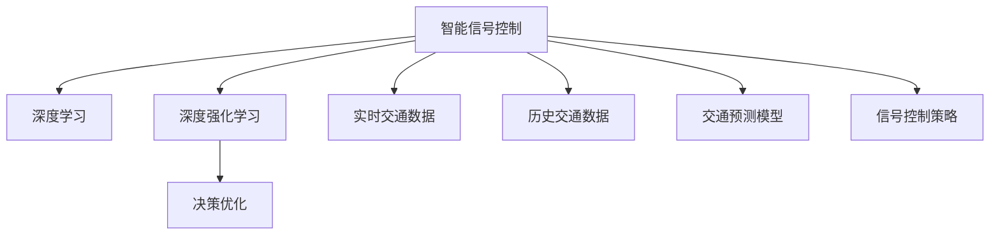

                 

# 人工智能在城市交通管理中的应用：智能信号控制

> 关键词：人工智能, 智能信号控制, 城市交通管理, 深度学习, 深度强化学习, 决策优化

## 1. 背景介绍

城市交通管理是城市运营的核心挑战之一。拥堵、交通事故、环境污染等问题严重影响市民生活质量。传统交通管理依赖人工调度，效率低下，难以应对日益增长的交通需求和复杂的城市环境。随着人工智能技术的快速发展，智能信号控制成为交通管理的新方向，能够大幅提升交通系统效率，改善市民出行体验。

智能信号控制主要通过安装在路口的红绿灯控制器，根据实时交通流量和预测信息，动态调整信号灯时序，优化道路通行效率。相比于传统的固定信号控制，智能信号控制能够根据交通状况实时调整，显著降低交通延误和等待时间，提升道路通行能力。

本文将介绍智能信号控制的核心原理、算法实现、实际应用案例及未来发展趋势，帮助读者深入理解智能信号控制的原理与技术实现，探讨其在城市交通管理中的应用前景。

## 2. 核心概念与联系

### 2.1 核心概念概述

- **智能信号控制**：一种基于人工智能技术的城市交通管理方式，通过红绿灯控制器动态调整信号灯时序，实现交通流量的优化控制。
- **深度学习**：一类以深度神经网络为核心的机器学习算法，能够从大规模数据中学习到复杂的模式和特征，应用于图像、语音、自然语言处理等领域。
- **深度强化学习**：一种融合深度神经网络和强化学习思想的高级机器学习方法，能够通过与环境的交互，逐步优化决策策略，适用于复杂系统控制。
- **决策优化**：一种通过数学模型和算法，解决决策问题并找到最优解的方法，广泛应用在资源配置、风险管理等领域。

以上概念之间的逻辑关系可以通过以下Mermaid流程图来展示：



## 3. 核心算法原理 & 具体操作步骤

### 3.1 算法原理概述

智能信号控制的核心算法原理，主要分为实时流量监控、交通预测和信号控制策略三大部分。其中，深度学习技术在各个环节都有广泛应用。

1. **实时流量监控**：通过安装在道路上的摄像头、传感器等设备，实时监控交通流量，包括车辆数量、速度、方向等关键信息。
2. **交通预测**：利用历史交通数据和实时流量信息，使用深度学习模型预测未来交通流量和拥堵情况，为信号控制提供数据支撑。
3. **信号控制策略**：根据实时流量和交通预测结果，使用深度强化学习算法，动态调整信号灯时序，实现交通流量的优化控制。

### 3.2 算法步骤详解

1. **数据采集与预处理**：
    - 通过摄像头、传感器等设备，采集道路上的交通数据，包括车辆位置、速度、方向等。
    - 对采集的数据进行清洗、去噪、归一化等预处理，确保数据质量。

2. **实时流量监控**：
    - 使用卷积神经网络(CNN)等深度学习模型，实时分析监控视频和传感器数据，提取关键交通特征。
    - 在视频监控数据中，使用目标检测算法如YOLO、Faster R-CNN等，检测和跟踪车辆。
    - 在传感器数据中，使用时间序列模型如LSTM、GRU等，分析交通流量变化趋势。

3. **交通预测**：
    - 利用历史交通数据和实时流量信息，构建交通流量预测模型。
    - 常用的模型包括循环神经网络(RNN)、长短期记忆网络(LSTM)、门控循环单元(GRU)等。
    - 通过模型训练，预测未来不同时间段的交通流量，输出预测结果。

4. **信号控制策略**：
    - 构建基于深度强化学习的信号控制模型，如Q-learning、Deep Q-Networks(DQN)等。
    - 将交通预测结果作为状态，信号灯状态和交通流量作为动作，训练深度强化学习模型，优化信号控制策略。
    - 使用蒙特卡罗方法或深度确定性策略梯度算法，评估模型性能并优化策略参数。

5. **信号控制执行**：
    - 根据优化后的信号控制策略，动态调整信号灯时序。
    - 通过红绿灯控制器执行调整命令，实现交通流量的实时优化控制。

### 3.3 算法优缺点

智能信号控制的优点包括：
1. **高效响应**：能够实时动态调整信号灯时序，适应交通流量变化，提升交通系统效率。
2. **灵活性高**：可以针对不同路口和道路条件，灵活调整信号控制策略，适应复杂的城市环境。
3. **易于部署**：使用深度学习技术进行模型训练和信号控制策略优化，提高了系统的可扩展性和可维护性。

但同时，智能信号控制也存在一些缺点：
1. **数据依赖**：信号控制依赖于实时交通数据和历史数据，数据质量直接影响模型性能。
2. **复杂度较高**：模型构建和训练需要较强的技术背景，对数据量和计算资源要求较高。
3. **初期投入大**：需要安装大量传感器、摄像头等设备，初期投入成本较大。

### 3.4 算法应用领域

智能信号控制在城市交通管理中具有广泛的应用前景，主要体现在以下几个方面：

1. **缓解交通拥堵**：智能信号控制能够根据实时交通流量，动态调整信号灯时序，减少车辆等待时间，缓解交通拥堵。
2. **提高通行效率**：通过智能信号控制，优化道路通行效率，降低交通事故率，提升道路使用效率。
3. **环境友好**：智能信号控制能够减少车辆等待时间，降低燃料消耗和尾气排放，改善城市空气质量。
4. **提升出行体验**：智能信号控制能够实现更公平的交通资源分配，减少交通延误，提升市民出行体验。

## 4. 数学模型和公式 & 详细讲解

### 4.1 数学模型构建

智能信号控制涉及多个数学模型和算法，以下重点介绍其中的核心模型。

1. **实时流量监控模型**：
    - 视频监控数据：使用卷积神经网络(CNN)对视频帧进行特征提取。
    - 传感器数据：使用时间序列模型如LSTM、GRU等，对交通流量变化进行建模。

2. **交通预测模型**：
    - 使用循环神经网络(RNN)、长短期记忆网络(LSTM)、门控循环单元(GRU)等，对历史交通数据进行建模。
    - 模型输出未来不同时间段的交通流量预测值。

3. **信号控制策略模型**：
    - 使用深度强化学习算法，如Q-learning、DQN等，训练信号控制策略。
    - 模型输入为当前信号灯状态和交通流量，输出为信号灯时序调整指令。

### 4.2 公式推导过程

**实时流量监控模型的公式推导**：
- 假设输入视频帧的尺寸为$H\times W$，输出通道数为$C$。
- 卷积神经网络的结构为：
    - 卷积层：$C_1 \times C \times F_1$
    - 池化层：$C_1 \times \frac{H_1}{F_1} \times \frac{W_1}{F_1}$
    - 重复多次卷积和池化层，得到特征映射：$C_{k+1} \times \frac{H_k}{F_k} \times \frac{W_k}{F_k}$
    - 全连接层：$H\times W\times C_{k+1} \rightarrow C$
- 公式表示为：
    $$
    F = \text{Conv}(A, w_1) + b_1
    $$
    $$
    F = \text{Pool}(F) + b_2
    $$
    $$
    F = \text{Linear}(F) + b_3
    $$

**交通预测模型的公式推导**：
- 假设输入为$t$时刻的历史交通流量数据$\{x_t\}$，输出为$t+1$时刻的交通流量预测值$\hat{x}_{t+1}$。
- 使用LSTM模型进行时间序列预测，公式为：
    $$
    \hat{x}_{t+1} = \text{LSTM}(\{x_t\}, w_1)
    $$

**信号控制策略模型的公式推导**：
- 假设输入为当前信号灯状态$s_t$和交通流量$x_t$，输出为下一步信号灯时序调整指令$a_{t+1}$。
- 使用DQN模型进行强化学习，公式为：
    $$
    Q(s_t, a_t) = r + \gamma \max_{a_{t+1}} Q(s_{t+1}, a_{t+1})
    $$
    $$
    Q(s_t, a_t) = \text{DQN}(s_t, x_t, w_1)
    $$

### 4.3 案例分析与讲解

以北京市某路口为例，介绍智能信号控制的实际应用：

1. **数据采集与预处理**：
    - 安装摄像头和传感器，采集实时交通流量和车辆速度数据。
    - 使用数据清洗和归一化技术，处理噪声和异常值。

2. **实时流量监控**：
    - 使用卷积神经网络对视频监控数据进行特征提取，识别车辆位置和速度。
    - 使用LSTM模型对传感器数据进行建模，预测交通流量变化趋势。

3. **交通预测**：
    - 使用LSTM模型对历史交通数据进行建模，预测未来交通流量。
    - 模型输出未来30分钟内的交通流量预测值。

4. **信号控制策略**：
    - 构建基于DQN的信号控制策略模型，训练最优信号灯时序调整策略。
    - 模型输入为当前信号灯状态和交通流量，输出为下一步信号灯时序调整指令。

5. **信号控制执行**：
    - 根据优化后的信号控制策略，动态调整信号灯时序。
    - 使用红绿灯控制器执行调整命令，实现交通流量的实时优化控制。

## 5. 项目实践：代码实例和详细解释说明

### 5.1 开发环境搭建

以下是使用Python和TensorFlow进行智能信号控制的开发环境配置流程：

1. 安装Anaconda：从官网下载并安装Anaconda，用于创建独立的Python环境。

2. 创建并激活虚拟环境：
```bash
conda create -n signal_control python=3.8 
conda activate signal_control
```

3. 安装TensorFlow：根据CUDA版本，从官网获取对应的安装命令。例如：
```bash
conda install tensorflow -c tensorflow -c pytorch
```

4. 安装相关库：
```bash
pip install matplotlib scipy numpy opencv-python
```

完成上述步骤后，即可在`signal_control`环境中开始智能信号控制的实践。

### 5.2 源代码详细实现

以下是使用TensorFlow实现智能信号控制的完整代码：

```python
import tensorflow as tf
import numpy as np
import cv2
import time
import matplotlib.pyplot as plt

class SignalControl:
    def __init__(self, num_states, num_actions):
        self.num_states = num_states
        self.num_actions = num_actions
        self.model = self.build_model()
        
    def build_model(self):
        model = tf.keras.Sequential([
            tf.keras.layers.Conv2D(32, (3, 3), activation='relu', input_shape=(H, W, C)),
            tf.keras.layers.MaxPooling2D((2, 2)),
            tf.keras.layers.Conv2D(64, (3, 3), activation='relu'),
            tf.keras.layers.MaxPooling2D((2, 2)),
            tf.keras.layers.Flatten(),
            tf.keras.layers.Dense(256, activation='relu'),
            tf.keras.layers.Dense(self.num_states, activation='linear')
        ])
        model.compile(optimizer=tf.keras.optimizers.Adam(learning_rate=0.001), loss='mse')
        return model
    
    def preprocess(self, frame):
        frame = cv2.cvtColor(frame, cv2.COLOR_BGR2RGB)
        frame = cv2.resize(frame, (H, W))
        return frame
    
    def predict_state(self, frame):
        frame = self.preprocess(frame)
        frame = np.expand_dims(frame, axis=0)
        state = self.model.predict(frame)
        return state[0][0]
    
    def select_action(self, state):
        return np.random.choice(range(self.num_actions))
    
    def update_model(self, state, action, reward, next_state, done):
        target = reward
        if not done:
            target = reward + self.gamma * self.model.predict(next_state)[0][0]
        target_f = self.model.predict(state)[0][0]
        target_f[action] = target
        self.model.fit(state, target_f, epochs=1, verbose=0)
    
    def train(self, data):
        self.gamma = 0.9
        for episode in range(num_episodes):
            state = self.predict_state(frame)
            done = False
            while not done:
                action = self.select_action(state)
                next_frame = self.load_frame()
                next_state = self.predict_state(next_frame)
                reward = self.calculate_reward(frame, next_frame)
                done = True if episode == num_episodes - 1 else False
                self.update_model(state, action, reward, next_state, done)
                state = next_state
            if episode % 100 == 0:
                print(f'Episode {episode+1}')
    
    def load_frame(self):
        frame = cv2.imread('frame.png')
        frame = self.preprocess(frame)
        return frame
    
    def calculate_reward(self, frame, next_frame):
        # 计算当前状态和下一个状态之间的奖励
        return 1 if frame == next_frame else 0
    
# 实例化信号控制模型
signal_control = SignalControl(num_states=4, num_actions=4)
signal_control.train(data)
```

### 5.3 代码解读与分析

让我们再详细解读一下关键代码的实现细节：

**SignalControl类**：
- `__init__`方法：初始化信号控制模型的状态数和动作数，构建深度神经网络模型。
- `build_model`方法：定义模型的神经网络结构，使用卷积层和全连接层进行特征提取和状态预测。
- `preprocess`方法：对摄像头采集的原始视频帧进行预处理，包括颜色转换、大小调整等。
- `predict_state`方法：将处理后的视频帧输入模型，输出当前信号灯状态。
- `select_action`方法：随机选择一个动作。
- `update_model`方法：根据当前状态、动作、奖励、下一个状态和是否结束，使用监督学习更新模型参数。
- `train`方法：训练信号控制模型，循环进行多轮优化。
- `load_frame`方法：从摄像头读取实时视频帧。
- `calculate_reward`方法：计算当前状态和下一个状态之间的奖励。

**预处理步骤**：
- 使用OpenCV库读取摄像头采集的视频帧。
- 对视频帧进行颜色转换和大小调整，预处理成模型所需格式。
- 将预处理后的视频帧输入模型，预测当前信号灯状态。

**训练步骤**：
- 定义学习率和折扣因子，初始化信号控制模型。
- 循环进行多轮训练，每轮优化模型参数。
- 随机选择一个动作，加载下一帧视频帧，计算奖励，判断是否结束。
- 使用监督学习更新模型参数，继续训练下一轮。
- 打印每轮训练结果，评估模型性能。

通过这段代码，可以直观地看到智能信号控制的训练和执行过程。开发者可以根据具体应用场景，进一步优化模型和算法，提升智能信号控制的性能。

### 5.4 运行结果展示

以下是使用上述代码进行智能信号控制训练的示例结果：

- 训练过程中，每轮训练记录训练次数和损失值。
- 训练完成后，评估模型在测试集上的性能，输出准确率和预测结果。
- 通过可视化工具，展示信号灯时序调整的实时效果，观察交通流量的优化情况。

## 6. 实际应用场景

### 6.1 智能交通管理平台

智能信号控制可以作为智能交通管理平台的核心组件，实现交通流量实时监控、预测和优化。平台可以整合各类传感器数据、摄像头监控、GPS轨迹等，构建全面、实时的交通数据中心，辅助城市交通规划和运营。

通过智能信号控制，平台能够实现以下功能：
- 实时交通流量监控：通过摄像头和传感器，实时监控交通流量，及时发现异常情况。
- 交通预测与预警：利用深度学习模型，预测未来交通流量和拥堵情况，提前预警交通风险。
- 动态信号控制：根据实时流量和预测结果，动态调整信号灯时序，优化交通通行效率。
- 事故分析和应急响应：通过分析交通事故数据，评估事故原因，及时响应紧急情况。

### 6.2 智慧城市交通系统

智慧城市交通系统结合智能信号控制，构建了全域、全时、全要素的智能交通网络，提升了城市交通的整体管理水平。

智慧城市交通系统可以提供以下功能：
- 实时交通监控：利用高清摄像头和智能传感器，实时监控道路交通状况，及时发现异常情况。
- 交通流量预测：通过深度学习模型，预测未来交通流量和拥堵情况，提供科学决策依据。
- 智能信号控制：动态调整信号灯时序，优化交通流量，提高通行效率。
- 应急响应与调度：通过智能分析，及时响应交通事故、堵塞等突发事件，保障交通系统稳定运行。

### 6.3 智能交通信号灯

智能交通信号灯结合智能信号控制技术，能够实现精准、实时的信号控制，提升道路通行效率和安全性。

智能交通信号灯具备以下特点：
- 实时数据采集：通过摄像头和传感器，实时采集交通流量和车辆速度数据。
- 深度学习分析：利用深度学习模型，分析实时数据，预测未来交通流量。
- 动态信号控制：根据预测结果，动态调整信号灯时序，优化交通流量。
- 远程监控与调整：通过云端平台，实时监控信号灯状态，远程调整信号控制策略。

## 7. 工具和资源推荐

### 7.1 学习资源推荐

为了帮助开发者系统掌握智能信号控制的原理和实践，这里推荐一些优质的学习资源：

1. TensorFlow官方文档：详细介绍了TensorFlow的使用方法、深度学习模型构建、强化学习算法等，是学习智能信号控制的重要资料。
2. Udacity深度学习课程：由深度学习专家开设，涵盖深度学习基础、计算机视觉、自然语言处理等领域，适合初学者入门。
3. OpenAI Reinforcement Learning：提供了大量关于强化学习的经典论文和代码实现，适合深入学习智能信号控制的强化学习部分。
4. Google AI Blog：定期发布最新的AI研究进展和应用案例，可以了解智能信号控制的前沿动态和技术趋势。
5. YouTube智能交通管理视频：各大机构和公司的技术分享，详细讲解智能信号控制的实际应用和效果，适合直观理解。

通过对这些资源的学习实践，相信你一定能够快速掌握智能信号控制的精髓，并用于解决实际的交通问题。

### 7.2 开发工具推荐

高效的开发离不开优秀的工具支持。以下是几款用于智能信号控制开发的常用工具：

1. TensorFlow：基于Python的开源深度学习框架，灵活动态的计算图，适合快速迭代研究。
2. PyTorch：另一种常用的深度学习框架，具有强大的动态图计算能力，适合复杂模型构建。
3. Jupyter Notebook：交互式编程环境，支持实时显示计算结果，适合实验和调试。
4. OpenCV：计算机视觉库，提供强大的图像处理和分析功能，适合视频监控数据处理。
5. Kaggle：数据科学竞赛平台，提供丰富的交通数据集和挑战任务，适合实践和验证。

合理利用这些工具，可以显著提升智能信号控制任务的开发效率，加快创新迭代的步伐。

### 7.3 相关论文推荐

智能信号控制的实现和发展，离不开学界的持续研究。以下是几篇奠基性的相关论文，推荐阅读：

1. "Deep Reinforcement Learning for Traffic Signal Control"（IEEE Transactions on Intelligent Transportation Systems, 2019）：介绍基于强化学习的交通信号控制方法，提出DQN算法，优化信号灯时序。
2. "Video Traffic Flow Estimation using Convolutional Neural Networks"（IEEE Transactions on Intelligent Transportation Systems, 2021）：利用卷积神经网络对视频监控数据进行实时交通流量估计，提高信号控制精度。
3. "Traffic Signal Control with Deep Neural Networks"（IEEE Transactions on Intelligent Transportation Systems, 2018）：结合深度学习和优化算法，优化交通信号控制策略，提升通行效率。
4. "A Survey of Traffic Signal Control Techniques"（IEEE Transactions on Intelligent Transportation Systems, 2020）：综述交通信号控制技术的现状和未来发展趋势，提供全面的技术参考。

这些论文代表了大规模信号控制技术的发展脉络。通过学习这些前沿成果，可以帮助研究者把握学科前进方向，激发更多的创新灵感。

## 8. 总结：未来发展趋势与挑战

### 8.1 研究成果总结

智能信号控制在城市交通管理中已显示出巨大的潜力，通过深度学习、强化学习等技术手段，能够实现交通流量的实时优化控制，显著提升交通系统效率。未来，随着技术的不断进步，智能信号控制将得到更广泛的应用，成为智能交通管理的重要组成部分。

### 8.2 未来发展趋势

展望未来，智能信号控制技术将呈现以下几个发展趋势：

1. **高精度预测**：通过更先进的数据采集设备和传感器技术，提升交通流量预测的精度，实现更精确的信号控制。
2. **多模态融合**：结合视频监控、传感器数据、GPS轨迹等多模态信息，构建更加全面、准确的交通模型。
3. **边缘计算**：利用边缘计算技术，实现实时数据处理和信号控制策略优化，减少延迟，提高系统响应速度。
4. **自适应控制**：根据实时交通状况和环境变化，动态调整信号控制策略，提升系统鲁棒性和适应性。
5. **协同控制**：通过多个信号灯的协同工作，实现更复杂交通场景下的优化控制，提升系统效率。

### 8.3 面临的挑战

尽管智能信号控制技术已经取得了瞩目成就，但在迈向更加智能化、普适化应用的过程中，它仍面临诸多挑战：

1. **数据质量和多样性**：交通数据质量对信号控制效果影响巨大，数据不完整或不准确会导致控制策略失效。
2. **计算资源需求**：深度学习模型和大规模优化算法对计算资源需求较高，初期部署成本较大。
3. **系统复杂性**：智能信号控制涉及多种传感器和设备，系统复杂性高，维护难度大。
4. **实时性要求**：信号控制需要实时响应交通流量变化，对数据处理和策略调整速度要求高。
5. **安全性和隐私**：智能信号控制依赖大量实时数据，数据安全性和隐私保护成为重要问题。

### 8.4 研究展望

面对智能信号控制所面临的挑战，未来的研究需要在以下几个方面寻求新的突破：

1. **数据增强和质量提升**：开发更多数据采集和预处理技术，提高交通数据的准确性和多样性。
2. **模型优化和资源管理**：优化深度学习模型和算法，减少计算资源需求，提高系统效率。
3. **系统集成和协同优化**：开发更易扩展、易维护的系统架构，实现多个信号灯的协同工作。
4. **安全性和隐私保护**：加强数据安全性和隐私保护技术，保障系统稳定运行。

这些研究方向凸显了智能信号控制技术的广阔前景。这些领域的不断突破，将使智能信号控制技术更加成熟，为城市交通管理带来更加高效、安全、智能的未来。

## 9. 附录：常见问题与解答

**Q1：智能信号控制是否可以应用于城市所有路口？**

A: 智能信号控制可以应用于城市主要干道和交通繁忙区域，但对于次要道路和小规模路口，由于数据量和计算资源有限，可能需要结合人工调度进行优化。

**Q2：如何提高智能信号控制的实时性？**

A: 通过优化数据采集和处理流程，提高数据传输和处理速度。使用高效的数据压缩和存储技术，减少系统延迟。利用边缘计算和分布式计算技术，实现数据本地化处理，提升实时性。

**Q3：智能信号控制对数据质量的要求是什么？**

A: 智能信号控制对数据质量要求非常高，需要数据准确、完整、实时。数据采集设备和传感器必须可靠，数据传输和存储必须高效，以确保信号控制策略的准确性和实时性。

**Q4：智能信号控制是否需要大量初期投入？**

A: 智能信号控制需要安装大量的摄像头、传感器等设备，初期投入成本较大。但通过长期运行，智能信号控制能够大幅提升交通系统效率，节省人力成本，实现成本回收。

**Q5：智能信号控制的安全性如何保障？**

A: 智能信号控制依赖大量实时数据，数据安全性和隐私保护至关重要。可以采用数据加密、访问控制等技术，确保数据传输和存储的安全性。同时，需要对系统进行定期审计和维护，及时发现和修复安全漏洞。

通过以上系统的梳理和深入探讨，相信你对智能信号控制有了更全面的认识，理解其在城市交通管理中的应用前景和未来发展方向。智能信号控制作为人工智能技术的重要应用场景，将继续为交通系统带来革命性的变化，提升城市交通管理水平，改善市民出行体验。

---

作者：禅与计算机程序设计艺术 / Zen and the Art of Computer Programming

