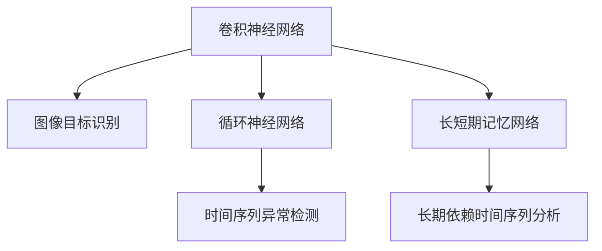

                 

## 1. 背景介绍

### 1.1 问题由来

天文学作为人类探索宇宙奥秘的重要领域，一直以来都是科学研究的前沿。传统的天文观测主要依赖于地面和空间望远镜，通过直接观测天体的光学、射电、X射线等辐射信号，捕捉和分析其物理特性。然而，随着技术的进步，人工智能在天文学中的应用逐渐成为可能，为天体的发现和研究提供了新的视角。

人工智能在天文学中的应用，主要包括：

- **目标识别**：利用机器学习算法，自动标记和识别观测数据中的天体。
- **异常检测**：通过异常检测模型，在大量观测数据中发现潜在的新天体。
- **模拟仿真**：利用深度学习模型，对天体演化进行模拟和预测。
- **数据处理**：使用自动化数据处理流程，提高观测数据的处理效率和精度。

本文将重点介绍人工智能在天文学中用于新天体发现的应用，包括机器学习模型的构建、异常检测的算法原理及步骤，以及实际应用场景和未来发展前景。

### 1.2 问题核心关键点

基于人工智能的新天体发现，关键点在于：

- **模型选择**：选择合适的机器学习模型，如卷积神经网络(CNN)、循环神经网络(RNN)、长短期记忆网络(LSTM)等，进行目标识别和异常检测。
- **数据集构建**：构建高质量的天文观测数据集，包含样本多样性，确保模型能够泛化到未知数据。
- **算法优化**：对算法进行优化，包括超参数调优、数据增强、正则化等，提升模型性能。
- **实时处理**：实现实时数据处理和分析，支持快速响应天体发现。

## 2. 核心概念与联系

### 2.1 核心概念概述

为了更好地理解基于人工智能的天体发现方法，首先需要了解一些核心概念：

- **卷积神经网络(CNN)**：一种前馈神经网络，常用于图像识别和处理。CNN通过卷积层和池化层提取图像特征，分类器层进行最终分类。
- **循环神经网络(RNN)**：一种递归神经网络，能够处理序列数据。RNN通过隐藏状态保存序列信息，适用于时间序列数据的分析和预测。
- **长短期记忆网络(LSTM)**：一种特殊类型的RNN，能够有效解决长期依赖问题，适用于处理时间序列数据。
- **异常检测(Anomaly Detection)**：在给定数据集中，识别出与大多数样本明显不同的异常点。
- **目标识别(Object Recognition)**：对图像或视频中的物体进行识别和分类。

这些概念之间的逻辑关系可以通过以下Mermaid流程图来展示：



这个流程图展示了各个核心概念之间的联系和应用场景。

## 3. 核心算法原理 & 具体操作步骤
### 3.1 算法原理概述

基于人工智能的天体发现方法，核心算法包括卷积神经网络（CNN）和循环神经网络（RNN）。

卷积神经网络主要应用于图像目标识别，通过多层卷积和池化操作，提取图像特征，并利用分类器进行最终分类。对于天文图像，通过训练卷积神经网络，可以对观测数据中的恒星、行星、星云等目标进行自动标记和识别。

循环神经网络则常用于处理时间序列数据，如天文观测数据中的光谱、位置变化等。通过训练循环神经网络，可以识别出异常点，从而发现新的天体。

### 3.2 算法步骤详解

#### 卷积神经网络步骤：

1. **数据预处理**：将天文图像进行预处理，包括调整大小、归一化、增强等操作，确保数据的一致性和多样性。
2. **模型构建**：构建卷积神经网络模型，包括卷积层、池化层、全连接层等，设置合适的超参数，如卷积核大小、池化大小、学习率等。
3. **模型训练**：使用标注好的天文图像数据集对模型进行训练，在训练过程中不断调整超参数，优化模型性能。
4. **模型测试**：使用测试集对训练好的模型进行测试，评估其识别准确率和召回率等指标。
5. **模型应用**：将训练好的模型应用于新的天文图像数据，进行目标识别和分类。

#### 循环神经网络步骤：

1. **数据预处理**：将天文时间序列数据进行预处理，包括去除噪声、归一化等操作，确保数据的一致性和平稳性。
2. **模型构建**：构建循环神经网络模型，包括隐藏层、循环层等，设置合适的超参数，如隐藏层大小、循环层大小、学习率等。
3. **模型训练**：使用标注好的天文时间序列数据对模型进行训练，在训练过程中不断调整超参数，优化模型性能。
4. **模型测试**：使用测试集对训练好的模型进行测试，评估其异常检测能力和准确率等指标。
5. **模型应用**：将训练好的模型应用于新的天文时间序列数据，进行异常检测和分析。

### 3.3 算法优缺点

基于人工智能的天体发现方法具有以下优点：

- **自动化处理**：能够自动标记和识别天文图像中的目标，大大提高了处理效率。
- **高精度识别**：通过训练深度学习模型，可以获得较高的目标识别精度。
- **泛化能力强**：在多样化的数据集上训练模型，能够泛化到新的观测数据中。

同时，该方法也存在以下局限性：

- **数据依赖**：模型的性能很大程度上取决于数据集的质量和多样性，数据集构建成本高。
- **过拟合风险**：在处理复杂的数据时，模型容易过拟合，需要采取正则化等方法。
- **实时处理难度**：天文观测数据量巨大，实时处理和分析具有挑战性。
- **计算资源需求**：深度学习模型训练和推理需要大量计算资源。

### 3.4 算法应用领域

基于人工智能的天体发现方法，广泛应用于以下几个领域：

- **宇宙观测**：用于处理和分析天文观测数据，识别和标记恒星、行星、星云等天体。
- **系外行星发现**：通过对行星运动轨迹的分析，发现新的系外行星。
- **恒星演化研究**：利用时间序列数据，研究恒星的演化过程和周期性变化。
- **空间天文研究**：用于处理和分析大型空间天文望远镜的观测数据。
- **太阳活动监测**：监测太阳黑子、太阳耀斑等活动，预测太阳活动变化。

## 4. 数学模型和公式 & 详细讲解  
### 4.1 数学模型构建

基于人工智能的天体发现，核心数学模型包括卷积神经网络和循环神经网络。

对于卷积神经网络，其数学模型可以表示为：

$$
\text{CNN} = \{ \text{Convolutional Layer}, \text{Pooling Layer}, \text{Classification Layer} \}
$$

其中，卷积层通过滤波器提取图像特征，池化层进行下采样，分类层利用全连接层进行最终分类。

对于循环神经网络，其数学模型可以表示为：

$$
\text{RNN} = \{ \text{Input Layer}, \text{Recurrent Layer}, \text{Output Layer} \}
$$

其中，输入层用于输入时间序列数据，循环层用于保存和更新隐藏状态，输出层用于输出预测结果。

### 4.2 公式推导过程

#### 卷积神经网络公式推导：

$$
\text{Convolutional Layer} = \text{Conv}( \text{Input}, \text{Filter}) = \text{Filter} \ast \text{Input}
$$

其中，$\text{Conv}$表示卷积操作，$\text{Filter}$表示滤波器，$\text{Input}$表示输入图像，$\text{Output}$表示输出特征图。

$$
\text{Pooling Layer} = \text{Pooling}(\text{Feature Map}) = \text{Max Pooling}(\text{Feature Map})
$$

其中，$\text{Pooling}$表示池化操作，$\text{Max Pooling}$表示最大池化。

$$
\text{Classification Layer} = \text{Softmax}( \text{Convolutional Layer}, \text{Pooling Layer})
$$

其中，$\text{Softmax}$表示softmax激活函数。

#### 循环神经网络公式推导：

$$
\text{Recurrent Layer} = \text{RNN}(\text{Input}, \text{Hidden State}) = \text{Recurrent Cell}(\text{Input}, \text{Hidden State})
$$

其中，$\text{RNN}$表示循环神经网络，$\text{Input}$表示输入数据，$\text{Hidden State}$表示隐藏状态。

$$
\text{Output Layer} = \text{Linear}( \text{Recurrent Layer}, \text{Target})
$$

其中，$\text{Linear}$表示线性变换，$\text{Target}$表示目标标签。

### 4.3 案例分析与讲解

以系外行星发现为例，利用循环神经网络进行异常检测：

1. **数据预处理**：将行星运动轨迹的时间序列数据进行预处理，去除噪声，归一化处理。
2. **模型构建**：构建循环神经网络模型，包括隐藏层、循环层等，设置合适的超参数，如隐藏层大小、循环层大小、学习率等。
3. **模型训练**：使用标注好的行星运动轨迹数据对模型进行训练，在训练过程中不断调整超参数，优化模型性能。
4. **模型测试**：使用测试集对训练好的模型进行测试，评估其异常检测能力和准确率等指标。
5. **模型应用**：将训练好的模型应用于新的行星运动轨迹数据，进行异常检测和分析，识别出潜在的系外行星。

## 5. 项目实践：代码实例和详细解释说明
### 5.1 开发环境搭建

在进行天文数据处理和模型训练时，需要搭建一个高效的开发环境。以下是使用Python和TensorFlow搭建开发环境的流程：

1. **安装Anaconda**：从官网下载并安装Anaconda，用于创建独立的Python环境。

2. **创建并激活虚拟环境**：
```bash
conda create -n tensorflow-env python=3.8 
conda activate tensorflow-env
```

3. **安装TensorFlow**：根据CUDA版本，从官网获取对应的安装命令。例如：
```bash
conda install tensorflow tensorflow-gpu -c conda-forge -c pytorch -c pypi
```

4. **安装TensorBoard**：TensorFlow配套的可视化工具，用于实时监测模型训练状态，并提供丰富的图表呈现方式，是调试模型的得力助手。
```bash
pip install tensorboard
```

5. **安装Keras**：TensorFlow的高层API，用于构建和训练深度学习模型。
```bash
pip install keras
```

完成上述步骤后，即可在`tensorflow-env`环境中开始天文数据处理和模型训练。

### 5.2 源代码详细实现

下面以卷积神经网络为例，给出天文图像目标识别的Python代码实现。

```python
import tensorflow as tf
from tensorflow.keras import layers, models

# 加载天文图像数据集
(x_train, y_train), (x_test, y_test) = tf.keras.datasets.cifar10.load_data()

# 数据预处理
x_train = x_train / 255.0
x_test = x_test / 255.0

# 构建卷积神经网络模型
model = models.Sequential([
    layers.Conv2D(32, (3, 3), activation='relu', input_shape=(32, 32, 3)),
    layers.MaxPooling2D((2, 2)),
    layers.Conv2D(64, (3, 3), activation='relu'),
    layers.MaxPooling2D((2, 2)),
    layers.Conv2D(64, (3, 3), activation='relu'),
    layers.Flatten(),
    layers.Dense(64, activation='relu'),
    layers.Dense(10, activation='softmax')
])

# 编译模型
model.compile(optimizer='adam', loss='sparse_categorical_crossentropy', metrics=['accuracy'])

# 训练模型
model.fit(x_train, y_train, epochs=10, validation_data=(x_test, y_test))

# 评估模型
model.evaluate(x_test, y_test)

# 应用模型
preds = model.predict(x_test)
```

以上代码展示了卷积神经网络的构建、编译、训练和评估过程。在实际应用中，根据具体需求，可以进一步调整模型结构和参数，提高目标识别的准确率。

### 5.3 代码解读与分析

下面是代码的详细解读：

1. **数据加载**：使用`tf.keras.datasets.cifar10.load_data()`加载天文图像数据集，包括训练集和测试集。
2. **数据预处理**：将图像数据进行归一化处理，确保数据的一致性。
3. **模型构建**：使用`tf.keras.Sequential`构建卷积神经网络模型，包括卷积层、池化层、全连接层等。
4. **模型编译**：使用`model.compile`编译模型，设置优化器、损失函数和评估指标。
5. **模型训练**：使用`model.fit`训练模型，设置训练轮数和验证集。
6. **模型评估**：使用`model.evaluate`评估模型性能，输出准确率和损失。
7. **模型应用**：使用`model.predict`对测试集进行预测，输出预测结果。

以上代码展示了使用TensorFlow实现卷积神经网络的过程。在实际应用中，需要根据具体任务调整模型结构和参数，确保模型的高效和精确。

## 6. 实际应用场景
### 6.1 宇宙观测

在宇宙观测中，卷积神经网络被广泛应用于目标识别和分类。通过训练卷积神经网络，可以对天文图像中的恒星、行星、星云等目标进行自动识别和标记。这对于大规模的宇宙观测数据处理具有重要意义。

### 6.2 系外行星发现

利用循环神经网络进行异常检测，可以用于系外行星的发现。通过对行星运动轨迹的时间序列数据进行分析和建模，可以识别出异常点，从而发现潜在的系外行星。这对于扩展人类对宇宙的认识具有重要价值。

### 6.3 恒星演化研究

循环神经网络被用于分析恒星的时间序列数据，研究恒星的演化过程和周期性变化。通过对恒星的光谱数据进行分析，可以预测恒星的寿命和演化轨迹，从而拓展对恒星演化的理解。

### 6.4 空间天文研究

循环神经网络被用于处理和分析大型空间天文望远镜的观测数据，进行更细致的天体分析。这对于深入研究宇宙结构和演化具有重要意义。

### 6.5 太阳活动监测

利用循环神经网络进行异常检测，可以监测太阳黑子、太阳耀斑等活动，预测太阳活动变化。这对于空间天气预警和太阳物理研究具有重要价值。

## 7. 工具和资源推荐
### 7.1 学习资源推荐

为了帮助开发者系统掌握人工智能在天文学中的应用，这里推荐一些优质的学习资源：

1. **TensorFlow官方文档**：提供了详细的TensorFlow教程和示例代码，适合初学者入门。
2. **深度学习与天文学**：由天文学和计算机科学领域的专家共同撰写，介绍了深度学习在天文数据处理中的应用。
3. **TensorFlow实战课程**：由Coursera提供的TensorFlow实战课程，涵盖了从基础到高级的深度学习应用。
4. **深度学习在天文学中的应用**：由ArXiv预印本，介绍了深度学习在天文数据处理中的应用实例。
5. **天文数据处理教程**：由AstroML提供的Python天文学数据处理教程，适合天文领域的研究人员使用。

通过对这些资源的学习实践，相信你一定能够快速掌握人工智能在天文学中的应用，并用于解决实际的天体发现问题。

### 7.2 开发工具推荐

高效的开发离不开优秀的工具支持。以下是几款用于天文数据处理和模型训练的常用工具：

1. **TensorFlow**：基于Python的开源深度学习框架，灵活易用，支持多种计算图，适合进行复杂的天文数据处理和模型训练。
2. **Keras**：TensorFlow的高层API，简化模型构建和训练过程，适合初学者使用。
3. **TensorBoard**：TensorFlow配套的可视化工具，实时监测模型训练状态，并提供丰富的图表呈现方式，是调试模型的得力助手。
4. **AstroML**：天文学和数据科学领域的Python库，提供了大量的天文数据集和模型实现，适合进行天文数据处理和分析。
5. **Open Exoplanet Catalogue**：包含数百万个已知的系外行星数据，适合进行系外行星发现和研究。

合理利用这些工具，可以显著提升天文数据处理和模型训练的效率，加速天体发现的进程。

### 7.3 相关论文推荐

人工智能在天文学中的应用，得益于学界的持续研究。以下是几篇奠基性的相关论文，推荐阅读：

1. **深度学习在天文数据处理中的应用**：介绍了深度学习在天文数据处理中的各种应用实例，适合入门学习。
2. **卷积神经网络在天文图像目标识别中的应用**：介绍了卷积神经网络在天文图像目标识别中的应用，适合深度学习初学者参考。
3. **循环神经网络在天文时间序列数据中的应用**：介绍了循环神经网络在天文时间序列数据中的应用，适合天文学和计算机科学领域的专家参考。
4. **基于深度学习的系外行星发现**：介绍了基于深度学习的系外行星发现方法，适合天文学领域的研究人员参考。
5. **深度学习在恒星演化研究中的应用**：介绍了深度学习在恒星演化研究中的应用，适合天文学和数据科学领域的专家参考。

这些论文代表了大规模人工智能在天文学中的应用发展脉络，通过学习这些前沿成果，可以帮助研究者把握学科前进方向，激发更多的创新灵感。

## 8. 总结：未来发展趋势与挑战
### 8.1 总结

本文对基于人工智能的天体发现方法进行了全面系统的介绍。首先阐述了人工智能在天文学中的应用背景和意义，明确了目标识别、异常检测、模拟仿真等关键任务。其次，从原理到实践，详细讲解了卷积神经网络和循环神经网络的核心算法，给出了天文图像目标识别和天文学时间序列数据处理的完整代码实例。同时，本文还广泛探讨了人工智能在天文学中应用于多个领域的具体场景和未来发展前景。

通过本文的系统梳理，可以看到，基于人工智能的天体发现方法正在成为天文学研究的重要范式，极大地拓展了天文学数据处理和分析的能力，为人类对宇宙的探索带来了新的视角和可能性。

### 8.2 未来发展趋势

展望未来，人工智能在天文学中的应用将呈现以下几个发展趋势：

1. **模型规模扩大**：随着计算能力的提升和数据量的增加，人工智能模型将逐渐向更大规模发展，处理更多更复杂的天文数据。
2. **数据处理自动化**：利用自动化数据处理流程，提高天文数据处理的效率和精度，减少人工干预。
3. **跨领域融合**：将人工智能与天文学领域的其他技术进行深度融合，如模拟仿真、数据可视化等，拓展人工智能的应用范围。
4. **多模态融合**：利用多模态数据（如光学、射电、X射线等）进行综合分析，提升天文观测的准确性和全面性。
5. **模型训练优化**：开发更加高效的模型训练方法，减少计算资源消耗，提高模型训练的效率。
6. **模型迁移学习**：将在其他领域训练好的模型进行迁移学习，应用于天文数据处理中，提升模型的泛化能力。

以上趋势凸显了人工智能在天文学中的应用潜力，为天文学数据的处理和分析带来了新的方向和可能。未来，伴随技术的不断进步，人工智能必将在天文学领域发挥更大的作用。

### 8.3 面临的挑战

尽管人工智能在天文学中的应用已经取得了初步成果，但在迈向更广泛应用的过程中，仍面临诸多挑战：

1. **数据依赖**：模型的性能很大程度上取决于数据集的质量和多样性，数据集构建成本高。
2. **计算资源需求**：深度学习模型训练和推理需要大量计算资源，对硬件设施要求高。
3. **模型泛化能力**：在处理复杂的数据时，模型容易过拟合，需要采取正则化等方法。
4. **实时处理难度**：天文观测数据量巨大，实时处理和分析具有挑战性。
5. **可解释性不足**：深度学习模型的决策过程难以解释，对于天文学中的重要决策过程，需要具备更高的可解释性和透明性。

这些挑战需要在技术上进一步突破，才能更好地实现人工智能在天文学中的广泛应用。

### 8.4 研究展望

面对人工智能在天文学中的应用面临的诸多挑战，未来的研究需要在以下几个方面寻求新的突破：

1. **多模态数据融合**：将多种天文数据进行综合分析，提高数据的准确性和全面性。
2. **自动化数据处理**：开发自动化的数据处理流程，提高数据处理的效率和精度。
3. **模型训练优化**：开发更加高效的模型训练方法，减少计算资源消耗，提高模型训练的效率。
4. **跨领域融合**：将人工智能与天文学领域的其他技术进行深度融合，拓展人工智能的应用范围。
5. **模型迁移学习**：将在其他领域训练好的模型进行迁移学习，应用于天文数据处理中，提升模型的泛化能力。
6. **模型解释性增强**：提高深度学习模型的可解释性，确保模型的决策过程透明，提高模型的可信度。

这些研究方向将推动人工智能在天文学中的广泛应用，为人类对宇宙的探索带来新的突破和进展。

## 9. 附录：常见问题与解答

**Q1：基于人工智能的天体发现方法是否适用于所有天文任务？**

A: 基于人工智能的天体发现方法在大部分天文任务中都能取得较好的效果，但对于一些特定领域的任务，如宇宙学、太阳物理学等，可能需要根据具体情况进行微调。此外，对于需要高度精确的科学实验，如引力波探测等，人工智能方法仍需结合传统的天文观测手段进行辅助。

**Q2：如何选择合适的机器学习模型进行天体识别和异常检测？**

A: 选择合适的机器学习模型需要根据具体任务的需求进行评估。对于图像目标识别，卷积神经网络通常是一个较好的选择；对于时间序列数据，循环神经网络或长短期记忆网络更加适合。同时，考虑模型的参数量、训练速度和泛化能力，选择合适的模型进行训练和部署。

**Q3：在训练深度学习模型时，如何避免过拟合？**

A: 避免过拟合的方法包括：
1. 数据增强：通过旋转、缩放、裁剪等方式扩充训练集，增加数据的多样性。
2. 正则化：使用L2正则化、Dropout等方法，防止模型过拟合。
3. 提前停止：根据验证集的性能，及时停止训练，避免过拟合。
4. 模型裁剪：去除不必要的层和参数，减小模型尺寸，提高模型的泛化能力。

这些方法可以结合使用，进一步提升模型的泛化能力和稳定性。

**Q4：在实时处理天文数据时，如何提高处理效率？**

A: 提高实时处理效率的方法包括：
1. 模型裁剪：去除不必要的层和参数，减小模型尺寸，提高推理速度。
2. 模型量化：将浮点模型转为定点模型，压缩存储空间，提高计算效率。
3. 分布式计算：利用多台机器进行并行计算，提高处理效率。
4. 数据预处理：通过数据预处理，减少计算量，提高处理速度。

合理利用这些方法，可以显著提高天文数据的实时处理效率，支持快速响应天体发现。

**Q5：如何提高深度学习模型的可解释性？**

A: 提高深度学习模型的可解释性可以通过以下方法：
1. 可视化技术：通过可视化神经网络的特征图和激活值，了解模型内部的决策过程。
2. 可解释性模型：使用可解释性模型，如决策树、线性回归等，提高模型的可解释性。
3. 知识融合：将符号化的先验知识，如知识图谱、逻辑规则等，与神经网络模型进行融合，引导微调过程学习更准确、合理的语言模型。
4. 自动化解释工具：利用自动化解释工具，如SHAP、LIME等，生成模型的解释报告，提高模型的透明性和可信度。

这些方法可以帮助提高深度学习模型的可解释性，确保模型的决策过程透明，提高模型的可信度。

---

作者：禅与计算机程序设计艺术 / Zen and the Art of Computer Programming

