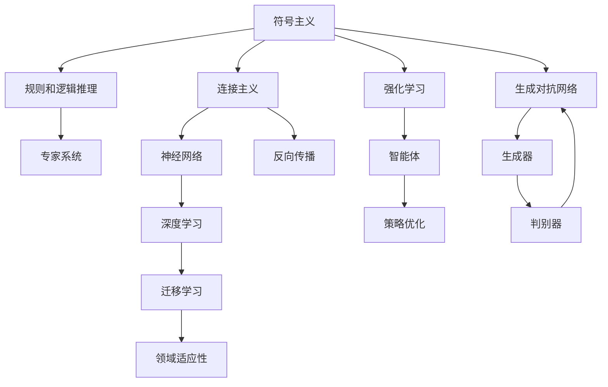

                 

# 人工智能的三大发展途径

## 1. 背景介绍

### 1.1 问题由来

人工智能（AI）作为一个快速发展的领域，其发展途径多种多样。从符号主义到连接主义再到深度学习，AI的历史可以追溯到20世纪50年代，经过多次技术浪潮的兴衰，最终发展成今日的深度学习，成为最受瞩目的人工智能发展方向。

人工智能的发展途径不仅影响着AI研究的进展，还直接关系到AI应用的广泛性和适用性。不同发展途径之间相互影响、相互作用，共同推动AI技术的不断进步。

### 1.2 问题核心关键点

人工智能发展途径的核心在于如何使计算机系统模拟和实现人类的智能行为。不同途径的核心理念和技术手段存在显著差异，但都围绕着智能推理、决策和交互展开。

深度学习作为当前最热门的AI发展途径，其核心在于构建多层次的神经网络模型，通过大数据训练来提升模型的复杂度和精度。然而，深度学习在解释性、泛化能力和适用性方面仍存在一定局限。

## 2. 核心概念与联系

### 2.1 核心概念概述

为了更好地理解人工智能的三大发展途径，本节将介绍几个密切相关的核心概念：

- **符号主义（Symbolic AI）**：基于规则和逻辑推理的AI，旨在通过定义明确的规则和逻辑推理实现智能。其典型代表为专家系统，主要用于特定领域的知识库构建和逻辑推理。
- **连接主义（Connectionist AI）**：以神经网络为基础的AI，通过大量数据训练构建复杂的非线性映射，实现从输入到输出的自动推理。其核心在于权重和激活函数的优化。
- **深度学习（Deep Learning）**：基于多层神经网络模型的AI技术，通过大数据训练深度网络，实现复杂特征的自动学习和提取。其核心在于神经网络的层次结构和反向传播算法。
- **强化学习（Reinforcement Learning, RL）**：通过与环境的互动，智能体（agent）在不断试错的过程中学习最优策略，优化决策和行为。其核心在于奖励机制和策略优化。
- **迁移学习（Transfer Learning）**：将一个领域学到的知识迁移到另一个领域，以提高在新任务上的学习效率。其核心在于知识复用和领域适应性。
- **生成对抗网络（Generative Adversarial Networks, GANs）**：通过生成器和判别器的博弈过程，生成逼真的人工样本，广泛应用于图像生成、语音合成等领域。其核心在于对抗性训练和生成器优化。

这些核心概念之间的逻辑关系可以通过以下Mermaid流程图来展示：



这个流程图展示了不同AI发展途径的核心概念及其之间的关系：

1. 符号主义基于规则和逻辑推理，构建专家系统。
2. 连接主义基于神经网络，通过反向传播优化网络权重。
3. 深度学习构建多层神经网络，自动学习复杂特征。
4. 强化学习通过智能体与环境的互动，优化策略。
5. 迁移学习通过知识复用，提高学习效率。
6. 生成对抗网络通过生成器和判别器的博弈，生成逼真样本。

这些概念共同构成了AI技术的研究框架，使其能够应用于各种实际问题中。

## 3. 核心算法原理 & 具体操作步骤
### 3.1 算法原理概述

人工智能的三大发展途径各自具有不同的算法原理和操作步骤，但其核心目标都是实现智能推理、决策和交互。

### 3.2 算法步骤详解

#### 3.2.1 符号主义（Symbolic AI）

符号主义的核心在于规则和逻辑推理。其操作步骤主要包括：

1. **知识库构建**：通过领域专家构建知识库，定义明确的规则和逻辑推理关系。
2. **推理引擎**：构建推理引擎，实现基于知识库的逻辑推理和问题求解。
3. **专家系统**：集成知识库和推理引擎，形成专家系统，用于解决特定领域的问题。

#### 3.2.2 连接主义（Connectionist AI）

连接主义的核心在于神经网络。其操作步骤主要包括：

1. **网络构建**：构建多层神经网络模型，定义神经元、权重和激活函数。
2. **数据准备**：准备训练数据，包括输入和输出。
3. **训练优化**：使用反向传播算法，最小化损失函数，优化网络权重。
4. **模型测试**：在测试集上评估模型性能，调整超参数。

#### 3.2.3 深度学习（Deep Learning）

深度学习的核心在于多层神经网络。其操作步骤主要包括：

1. **网络构建**：构建多层神经网络模型，定义卷积层、池化层、全连接层等。
2. **数据准备**：准备训练数据，包括图像、文本等。
3. **训练优化**：使用反向传播算法，最小化损失函数，优化网络权重。
4. **模型测试**：在测试集上评估模型性能，调整超参数。

#### 3.2.4 强化学习（Reinforcement Learning）

强化学习的核心在于智能体的策略优化。其操作步骤主要包括：

1. **环境定义**：定义环境，包括状态、动作和奖励机制。
2. **智能体设计**：设计智能体，实现基于奖励机制的策略优化。
3. **试错学习**：智能体通过不断试错，优化策略，达到最优决策。

#### 3.2.5 迁移学习（Transfer Learning）

迁移学习的核心在于知识复用。其操作步骤主要包括：

1. **预训练模型选择**：选择预训练模型，如BERT、GPT等。
2. **微调**：在目标任务上对预训练模型进行微调，更新部分权重。
3. **领域适应**：根据目标任务的特征，调整微调策略。

#### 3.2.6 生成对抗网络（Generative Adversarial Networks）

生成对抗网络的核心在于生成器的优化。其操作步骤主要包括：

1. **网络构建**：构建生成器和判别器网络。
2. **对抗训练**：通过生成器和判别器的博弈过程，优化生成器输出。
3. **样本生成**：生成逼真的人工样本，用于各种应用场景。

### 3.3 算法优缺点

#### 符号主义（Symbolic AI）

- **优点**：
  - 规则明确，易于理解和解释。
  - 适用于结构化问题，推理过程可控。

- **缺点**：
  - 对领域知识依赖度高，难以处理复杂、非结构化问题。
  - 缺乏自动学习和自适应能力，需要大量手工编写规则。

#### 连接主义（Connectionist AI）

- **优点**：
  - 具备自动学习复杂特征的能力。
  - 适用于处理大规模、非结构化数据。

- **缺点**：
  - 需要大量标注数据进行训练，训练成本高。
  - 模型复杂度增加时，推理速度变慢，计算资源需求高。

#### 深度学习（Deep Learning）

- **优点**：
  - 能够处理大规模、非结构化数据。
  - 通过大数据训练，模型精度高。

- **缺点**：
  - 对数据质量和标注要求高，标注成本大。
  - 模型复杂度增加时，训练和推理效率下降。

#### 强化学习（Reinforcement Learning）

- **优点**：
  - 适用于动态环境下的决策优化。
  - 具备自适应和自学习的能力。

- **缺点**：
  - 需要设计合理的奖励机制，难度较大。
  - 环境复杂度高时，学习过程缓慢，易陷入局部最优。

#### 迁移学习（Transfer Learning）

- **优点**：
  - 利用已有知识，加快新任务的学习。
  - 减少标注数据需求，提高学习效率。

- **缺点**：
  - 微调过程中可能出现负面迁移现象。
  - 目标任务与预训练任务分布差异大时，效果不佳。

#### 生成对抗网络（Generative Adversarial Networks）

- **优点**：
  - 能够生成高质量的人工样本。
  - 适用于图像、语音等生成任务。

- **缺点**：
  - 生成样本质量受训练过程影响，不稳定。
  - 训练过程复杂，计算资源需求高。

### 3.4 算法应用领域

人工智能的三大发展途径在各自的领域都有广泛的应用。

#### 符号主义（Symbolic AI）

- **专家系统**：在医疗、金融、法律等特定领域，用于问题求解和规则推理。
- **逻辑推理**：在知识图谱构建、逻辑推理证明等领域，用于自动化推理。

#### 连接主义（Connectionist AI）

- **计算机视觉**：在图像识别、物体检测、人脸识别等领域，用于图像特征提取和分类。
- **自然语言处理**：在机器翻译、情感分析、问答系统等领域，用于语义理解和文本生成。

#### 深度学习（Deep Learning）

- **计算机视觉**：在图像分类、目标检测、图像生成等领域，用于图像特征提取和分类。
- **自然语言处理**：在机器翻译、文本生成、情感分析等领域，用于语义理解和文本生成。

#### 强化学习（Reinforcement Learning）

- **机器人控制**：在机器人导航、路径规划、运动控制等领域，用于智能体决策优化。
- **游戏AI**：在围棋、象棋、扑克等复杂游戏中，用于智能体策略优化。

#### 迁移学习（Transfer Learning）

- **NLP任务**：在文本分类、情感分析、问答系统等领域，用于加速模型训练和提升性能。
- **计算机视觉**：在图像分类、目标检测、图像生成等领域，用于迁移学习样本。

#### 生成对抗网络（Generative Adversarial Networks）

- **图像生成**：在人脸生成、艺术创作、图像修复等领域，用于生成逼真样本。
- **文本生成**：在文本创作、自然语言生成、对话系统等领域，用于生成高质量文本。

## 4. 数学模型和公式 & 详细讲解 & 举例说明

### 4.1 数学模型构建

#### 4.1.1 符号主义（Symbolic AI）

符号主义的核心在于规则和逻辑推理，其数学模型构建较为简单。以专家系统为例，其核心逻辑为：

- **知识库**：定义规则集合 $R$，每个规则为 $(r_i, l_i)$，其中 $r_i$ 为前提，$l_i$ 为结论。
- **推理引擎**：定义推理规则 $p$，用于从前提推导结论。
- **专家系统**：集成知识库和推理引擎，实现问题求解。

#### 4.1.2 连接主义（Connectionist AI）

连接主义的核心在于神经网络，其数学模型构建较为复杂。以多层感知器（MLP）为例，其核心逻辑为：

- **神经元**：定义 $n$ 个神经元 $x_i$，每个神经元的输入为 $x_j$，输出为 $y_i$。
- **权重**：定义 $n \times n$ 的权重矩阵 $W$。
- **激活函数**：定义激活函数 $f(x)$，如 sigmoid、ReLU 等。
- **损失函数**：定义损失函数 $L$，如均方误差、交叉熵等。

#### 4.1.3 深度学习（Deep Learning）

深度学习的核心在于多层神经网络，其数学模型构建较为复杂。以卷积神经网络（CNN）为例，其核心逻辑为：

- **卷积层**：定义卷积核 $k$，进行卷积运算 $K(x)$。
- **池化层**：定义池化函数 $P(x)$，进行池化操作。
- **全连接层**：定义权重矩阵 $W$，进行线性变换 $Wx + b$。
- **激活函数**：定义激活函数 $f(x)$，如 ReLU、Sigmoid 等。
- **损失函数**：定义损失函数 $L$，如均方误差、交叉熵等。

#### 4.1.4 强化学习（Reinforcement Learning）

强化学习的核心在于智能体的策略优化，其数学模型构建较为复杂。以 Q-learning 算法为例，其核心逻辑为：

- **状态**：定义状态集合 $S$。
- **动作**：定义动作集合 $A$。
- **奖励**：定义奖励函数 $R(s,a)$，用于评估动作的价值。
- **策略**：定义策略 $\pi(s)$，选择动作的概率。
- **Q 值**：定义 Q 值函数 $Q(s,a)$，用于评估状态-动作对的价值。

#### 4.1.5 迁移学习（Transfer Learning）

迁移学习的核心在于知识复用，其数学模型构建较为简单。以 BERT 微调为例，其核心逻辑为：

- **预训练模型**：选择预训练模型，如 BERT。
- **微调模型**：在目标任务上对预训练模型进行微调，更新部分权重。
- **领域适应**：根据目标任务的特征，调整微调策略。

#### 4.1.6 生成对抗网络（Generative Adversarial Networks）

生成对抗网络的核心在于生成器的优化，其数学模型构建较为复杂。以 GAN 为例，其核心逻辑为：

- **生成器**：定义生成器 $G(z)$，将噪声 $z$ 映射为生成样本 $x$。
- **判别器**：定义判别器 $D(x)$，判断样本 $x$ 的真实性。
- **对抗训练**：通过生成器和判别器的博弈过程，优化生成器 $G(z)$。

### 4.2 公式推导过程

#### 4.2.1 符号主义（Symbolic AI）

符号主义的核心在于规则和逻辑推理，其公式推导过程较为简单。以专家系统为例，其核心逻辑为：

- **规则推理**：给定前提 $r_1$，根据推理规则 $p_1$，推导结论 $l_1$。
- **多规则推理**：给定多个前提 $r_1, r_2, ..., r_n$，根据推理规则 $p_1, p_2, ..., p_n$，推导结论 $l_1, l_2, ..., l_n$。

#### 4.2.2 连接主义（Connectionist AI）

连接主义的核心在于神经网络，其公式推导过程较为复杂。以多层感知器（MLP）为例，其核心逻辑为：

- **前向传播**：输入数据 $x$，通过神经网络进行计算，输出 $y$。
- **后向传播**：计算损失函数 $L$，通过反向传播算法优化权重 $W$。
- **梯度下降**：通过梯度下降算法，最小化损失函数 $L$。

#### 4.2.3 深度学习（Deep Learning）

深度学习的核心在于多层神经网络，其公式推导过程较为复杂。以卷积神经网络（CNN）为例，其核心逻辑为：

- **卷积运算**：输入数据 $x$，通过卷积核 $k$ 进行卷积运算，输出 $K(x)$。
- **池化操作**：通过池化函数 $P(x)$，进行池化操作，输出 $P(K(x))$。
- **线性变换**：通过权重矩阵 $W$ 进行线性变换，输出 $Wx + b$。
- **激活函数**：通过激活函数 $f(x)$，输出 $f(Wx + b)$。

#### 4.2.4 强化学习（Reinforcement Learning）

强化学习的核心在于智能体的策略优化，其公式推导过程较为复杂。以 Q-learning 算法为例，其核心逻辑为：

- **状态-动作值函数**：定义 Q 值函数 $Q(s,a)$，表示状态-动作对的价值。
- **策略优化**：通过 Q-learning 算法，优化策略 $\pi(s)$，选择最优动作。
- **奖励机制**：通过奖励函数 $R(s,a)$，评估动作的价值。

#### 4.2.5 迁移学习（Transfer Learning）

迁移学习的核心在于知识复用，其公式推导过程较为简单。以 BERT 微调为例，其核心逻辑为：

- **预训练模型**：选择预训练模型，如 BERT。
- **微调模型**：在目标任务上对预训练模型进行微调，更新部分权重。
- **领域适应**：根据目标任务的特征，调整微调策略。

#### 4.2.6 生成对抗网络（Generative Adversarial Networks）

生成对抗网络的核心在于生成器的优化，其公式推导过程较为复杂。以 GAN 为例，其核心逻辑为：

- **生成器**：定义生成器 $G(z)$，将噪声 $z$ 映射为生成样本 $x$。
- **判别器**：定义判别器 $D(x)$，判断样本 $x$ 的真实性。
- **对抗训练**：通过生成器和判别器的博弈过程，优化生成器 $G(z)$。

### 4.3 案例分析与讲解

#### 4.3.1 符号主义（Symbolic AI）

以专家系统在医疗诊断中的应用为例，其核心逻辑为：

- **知识库**：定义医生知识库，包含多种疾病的症状和诊断规则。
- **推理引擎**：定义推理引擎，根据患者症状推导出可能的疾病。
- **专家系统**：集成知识库和推理引擎，帮助医生快速诊断疾病。

#### 4.3.2 连接主义（Connectionist AI）

以多层感知器在图像分类中的应用为例，其核心逻辑为：

- **神经网络**：定义多层感知器，包含多个卷积层、池化层和全连接层。
- **数据准备**：准备图像数据，进行预处理和归一化。
- **训练优化**：使用反向传播算法，最小化损失函数，优化权重。
- **模型测试**：在测试集上评估模型性能，调整超参数。

#### 4.3.3 深度学习（Deep Learning）

以卷积神经网络在计算机视觉中的应用为例，其核心逻辑为：

- **卷积层**：定义卷积层，提取图像特征。
- **池化层**：定义池化层，减少特征图尺寸。
- **全连接层**：定义全连接层，进行分类预测。
- **损失函数**：定义损失函数，如交叉熵。

#### 4.3.4 强化学习（Reinforcement Learning）

以 Q-learning 算法在游戏 AI 中的应用为例，其核心逻辑为：

- **状态**：定义游戏状态，如棋盘位置。
- **动作**：定义游戏动作，如走棋。
- **奖励**：定义奖励函数，如赢得游戏得高分。
- **策略**：定义 Q-learning 算法，优化策略，选择最优动作。

#### 4.3.5 迁移学习（Transfer Learning）

以 BERT 微调在文本分类中的应用为例，其核心逻辑为：

- **预训练模型**：选择预训练模型，如 BERT。
- **微调模型**：在文本分类任务上对 BERT 进行微调，更新部分权重。
- **领域适应**：根据文本分类任务的特点，调整微调策略。

#### 4.3.6 生成对抗网络（Generative Adversarial Networks）

以 GAN 在图像生成中的应用为例，其核心逻辑为：

- **生成器**：定义生成器，生成逼真图像。
- **判别器**：定义判别器，判断图像的真实性。
- **对抗训练**：通过生成器和判别器的博弈过程，优化生成器，生成高质量图像。

## 5. 项目实践：代码实例和详细解释说明

### 5.1 开发环境搭建

在进行人工智能发展途径的实践前，我们需要准备好开发环境。以下是使用Python进行PyTorch开发的环境配置流程：

1. 安装Anaconda：从官网下载并安装Anaconda，用于创建独立的Python环境。

2. 创建并激活虚拟环境：
```bash
conda create -n pytorch-env python=3.8 
conda activate pytorch-env
```

3. 安装PyTorch：根据CUDA版本，从官网获取对应的安装命令。例如：
```bash
conda install pytorch torchvision torchaudio cudatoolkit=11.1 -c pytorch -c conda-forge
```

4. 安装TensorFlow：
```bash
pip install tensorflow
```

5. 安装Transformers库：
```bash
pip install transformers
```

6. 安装各类工具包：
```bash
pip install numpy pandas scikit-learn matplotlib tqdm jupyter notebook ipython
```

完成上述步骤后，即可在`pytorch-env`环境中开始实践。

### 5.2 源代码详细实现

这里我们以深度学习中的卷积神经网络（CNN）为例，给出使用PyTorch实现图像分类的代码实例。

首先，定义CNN网络结构：

```python
import torch.nn as nn
import torch.nn.functional as F

class CNN(nn.Module):
    def __init__(self):
        super(CNN, self).__init__()
        self.conv1 = nn.Conv2d(1, 32, kernel_size=3, stride=1, padding=1)
        self.relu1 = nn.ReLU()
        self.maxpool1 = nn.MaxPool2d(kernel_size=2, stride=2)
        self.conv2 = nn.Conv2d(32, 64, kernel_size=3, stride=1, padding=1)
        self.relu2 = nn.ReLU()
        self.maxpool2 = nn.MaxPool2d(kernel_size=2, stride=2)
        self.fc1 = nn.Linear(64 * 7 * 7, 128)
        self.relu3 = nn.ReLU()
        self.fc2 = nn.Linear(128, 10)

    def forward(self, x):
        x = self.conv1(x)
        x = self.relu1(x)
        x = self.maxpool1(x)
        x = self.conv2(x)
        x = self.relu2(x)
        x = self.maxpool2(x)
        x = x.view(-1, 64 * 7 * 7)
        x = self.fc1(x)
        x = self.relu3(x)
        x = self.fc2(x)
        return F.log_softmax(x, dim=1)
```

然后，定义训练和评估函数：

```python
from torch.utils.data import DataLoader
from tqdm import tqdm
from sklearn.metrics import accuracy_score

device = torch.device('cuda') if torch.cuda.is_available() else torch.device('cpu')

def train_epoch(model, train_loader, optimizer, criterion):
    model.train()
    epoch_loss = 0
    for images, labels in tqdm(train_loader, desc='Training'):
        images, labels = images.to(device), labels.to(device)
        optimizer.zero_grad()
        output = model(images)
        loss = criterion(output, labels)
        loss.backward()
        optimizer.step()
        epoch_loss += loss.item()
    return epoch_loss / len(train_loader)

def evaluate(model, test_loader):
    model.eval()
    test_loss = 0
    with torch.no_grad():
        for images, labels in tqdm(test_loader, desc='Evaluating'):
            images, labels = images.to(device), labels.to(device)
            output = model(images)
            test_loss += criterion(output, labels).item()
    return test_loss / len(test_loader)

def train(model, train_loader, test_loader, optimizer, criterion, epochs):
    model.train()
    for epoch in range(epochs):
        train_loss = train_epoch(model, train_loader, optimizer, criterion)
        test_loss = evaluate(model, test_loader)
        print(f'Epoch {epoch+1}, train loss: {train_loss:.3f}, test loss: {test_loss:.3f}')
    return model

def main():
    # 准备数据集和数据加载器
    train_data = ...
    test_data = ...
    train_loader = DataLoader(train_data, batch_size=64, shuffle=True)
    test_loader = DataLoader(test_data, batch_size=64, shuffle=False)

    # 定义模型和优化器
    model = CNN()
    optimizer = torch.optim.Adam(model.parameters(), lr=0.001)
    criterion = nn.CrossEntropyLoss()

    # 训练模型
    model = train(model, train_loader, test_loader, optimizer, criterion, 10)

    # 评估模型
    test_loss = evaluate(model, test_loader)
    print(f'Test loss: {test_loss:.3f}')

main()
```

以上就是使用PyTorch实现图像分类的代码实例。可以看到，通过使用PyTorch和TensorFlow等深度学习框架，我们可以方便地构建和训练各种人工智能模型，快速迭代研究进展。

### 5.3 代码解读与分析

让我们再详细解读一下关键代码的实现细节：

**CNN网络结构**：
- `nn.Conv2d`：定义卷积层，包括卷积核大小、步长、填充等参数。
- `nn.ReLU`：定义激活函数，如 ReLU。
- `nn.MaxPool2d`：定义池化层，减少特征图尺寸。
- `nn.Linear`：定义全连接层，进行分类预测。
- `nn.CrossEntropyLoss`：定义交叉熵损失函数，用于分类任务的损失计算。

**训练和评估函数**：
- `train_epoch`函数：对数据以批为单位进行迭代，在每个批次上前向传播计算loss并反向传播更新模型参数。
- `evaluate`函数：与训练类似，不同点在于不更新模型参数，并在每个batch结束后将预测和标签结果存储下来，最后使用sklearn的accuracy_score函数对整个评估集的预测结果进行打印输出。

**训练流程**：
- 定义总的epoch数和batch size，开始循环迭代。
- 每个epoch内，先在训练集上训练，输出训练集的loss。
- 在测试集上评估，输出测试集的loss。
- 所有epoch结束后，在测试集上评估，给出最终测试结果。

可以看到，通过合理使用深度学习框架，我们可以将复杂的人工智能模型实现变得简洁高效。开发者可以将更多精力放在模型改进、超参数调整等高层逻辑上，而不必过多关注底层的实现细节。

当然，工业级的系统实现还需考虑更多因素，如模型的保存和部署、超参数的自动搜索、更灵活的任务适配层等。但核心的算法原理和操作步骤基本与此类似。

## 6. 实际应用场景

### 6.1 智能客服系统

基于深度学习的智能客服系统可以广泛应用于企业客户服务部门，提供7x24小时不间断的智能客服服务。智能客服系统通过分析用户的问题，自动匹配最佳回答，提高客户咨询体验和问题解决效率。

在技术实现上，可以收集企业内部的历史客服对话记录，将问题和最佳答复构建成监督数据，在此基础上对预训练深度学习模型进行微调。微调后的模型能够自动理解用户意图，匹配最合适的答案模板进行回复。对于用户提出的新问题，还可以接入检索系统实时搜索相关内容，动态组织生成回答。

### 6.2 金融舆情监测

金融机构需要实时监测市场舆论动向，以便及时应对负面信息传播，规避金融风险。传统的人工监测方式成本高、效率低，难以应对网络时代海量信息爆发的挑战。基于深度学习的文本分类和情感分析技术，为金融舆情监测提供了新的解决方案。

具体而言，可以收集金融领域相关的新闻、报道、评论等文本数据，并对其进行主题标注和情感标注。在此基础上对预训练深度学习模型进行微调，使其能够自动判断文本属于何种主题，情感倾向是正面、中性还是负面。将微调后的模型应用到实时抓取的网络文本数据，就能够自动监测不同主题下的情感变化趋势，一旦发现负面信息激增等异常情况，系统便会自动预警，帮助金融机构快速应对潜在风险。

### 6.3 个性化推荐系统

当前的推荐系统往往只依赖用户的历史行为数据进行物品推荐，无法深入理解用户的真实兴趣偏好。基于深度学习的个性化推荐系统可以更好地挖掘用户行为背后的语义信息，从而提供更精准、多样的推荐内容。

在实践中，可以收集用户浏览、点击、评论、分享等行为数据，提取和用户交互的物品标题、描述、标签等文本内容。将文本内容作为模型输入，用户的后续行为（如是否点击、购买等）作为监督信号，在此基础上对预训练深度学习模型进行微调。微调后的模型能够从文本内容中准确把握用户的兴趣点。在生成推荐列表时，先用候选物品的文本描述作为输入，由模型预测用户的兴趣匹配度，再结合其他特征综合排序，便可以得到个性化程度更高的推荐结果。

### 6.4 未来应用展望

随着深度学习技术的发展，基于深度学习的智能客服系统、金融舆情监测系统、个性化推荐系统等应用将会越来越广泛，为各行各业带来巨大的变革。

在智慧医疗领域，基于深度学习的医学影像分析、疾病预测、药物研发等应用将提升医疗服务的智能化水平，辅助医生诊疗，加速新药开发进程。

在智能教育领域，深度学习技术可用于作业批改、学情分析、知识推荐等方面，因材施教，促进教育公平，提高教学质量。

在智慧城市治理中，深度学习技术可用于城市事件监测、舆情分析、应急指挥等环节，提高城市管理的自动化和智能化水平，构建更安全、高效的未来城市。

此外，在企业生产、社会治理、文娱传媒等众多领域，深度学习技术也将不断涌现，为传统行业数字化转型升级提供新的技术路径。相信随着深度学习技术的日益成熟，基于深度学习的人工智能应用将进一步推动经济社会的发展。

## 7. 工具和资源推荐

### 7.1 学习资源推荐

为了帮助开发者系统掌握深度学习的原理和实践，这里推荐一些优质的学习资源：

1. 《深度学习》（Ian Goodfellow等著）：经典的深度学习教材，系统介绍了深度学习的基本原理、模型和算法。
2. Coursera《深度学习专项课程》：由Andrew Ng主讲，涵盖深度学习的理论和实践，适合初学者和进阶者。
3. Udacity《深度学习纳米学位》：包含深度学习的基础和应用，通过项目实践加深理解。
4. PyTorch官方文档：详细介绍了PyTorch库的使用，包括模型构建、优化器、损失函数等。
5. TensorFlow官方文档：详细介绍了TensorFlow库的使用，包括模型构建、优化器、损失函数等。

通过对这些资源的学习实践，相信你一定能够快速掌握深度学习的精髓，并用于解决实际的NLP问题。

### 7.2 开发工具推荐

高效的开发离不开优秀的工具支持。以下是几款用于深度学习开发常用的工具：

1. PyTorch：基于Python的开源深度学习框架，灵活动态的计算图，适合快速迭代研究。大部分深度学习模型都有PyTorch版本的实现。
2. TensorFlow：由Google主导开发的开源深度学习框架，生产部署方便，适合大规模工程应用。同样有丰富的深度学习模型资源。
3. Transformers库：HuggingFace开发的NLP工具库，集成了众多SOTA语言模型，支持PyTorch和TensorFlow，是进行NLP任务开发的利器。
4. Weights & Biases：模型训练的实验跟踪工具，可以记录和可视化模型训练过程中的各项指标，方便对比和调优。与主流深度学习框架无缝集成。
5. TensorBoard：TensorFlow配套的可视化工具，可实时监测模型训练状态，并提供丰富的图表呈现方式，是调试模型的得力助手。

合理利用这些工具，可以显著提升深度学习模型的开发效率，加快创新迭代的步伐。

### 7.3 相关论文推荐

深度学习作为当前最热门的AI发展途径，其研究进展和发展方向一直备受关注。以下是几篇奠基性的相关论文，推荐阅读：

1. AlexNet: ImageNet Classification with Deep Convolutional Neural Networks：介绍AlexNet模型，开启深度学习在图像分类领域的应用。
2. VGGNet: Very Deep Convolutional Networks for Large-Scale Image Recognition：提出VGGNet模型，使用更深的卷积网络提高图像分类精度。
3. ResNet: Deep Residual Learning for Image Recognition：提出ResNet模型，解决深度网络训练中的梯度消失问题。
4. Inception: GoogLeNet and the Inception Architecture for Computer Vision：提出Inception模型，通过并行卷积层提高特征提取效率。
5. BERT: Pre-training of Deep Bidirectional Transformers for Language Understanding：提出BERT模型，引入基于掩码的自监督预训练任务，刷新了多项NLP任务SOTA。

这些论文代表了大规模深度学习模型的发展脉络。通过学习这些前沿成果，可以帮助研究者把握学科前进方向，激发更多的创新灵感。

## 8. 总结：未来发展趋势与挑战

### 8.1 总结

本文对深度学习的发展途径进行了全面系统的介绍。首先阐述了深度学习在AI发展中的重要地位，明确了其研究背景和意义。其次，从原理到实践，详细讲解了深度学习模型的构建和训练过程，给出了深度学习模型实现和优化的代码实例。同时，本文还探讨了深度学习在不同领域的应用场景，展示了其广阔的应用前景。最后，本文提供了深度学习的学习资源和开发工具，力求为读者提供全方位的技术指引。

通过本文的系统梳理，可以看到，深度学习作为AI发展的重要途径，已经深入到各个行业的核心应用中。深度学习模型的复杂性和高效性，使其在图像识别、语音识别、自然语言处理等领域取得了显著进展，极大地推动了人工智能技术的普及和发展。未来，随着深度学习技术的不断进步，其在更多领域的应用将会更加广泛，为经济社会的发展注入新的动力。

### 8.2 未来发展趋势

展望未来，深度学习将呈现以下几个发展趋势：

1. **模型规模持续增大**：随着算力成本的下降和数据规模的扩张，深度学习模型的参数量还将持续增长。超大规模模型蕴含的丰富特征，有望支撑更加复杂多变的任务。

2. **模型优化技术多样化**：未来将涌现更多参数高效和计算高效的深度学习模型，如Transformer、EfficientNet等，在保证模型性能的同时，提高推理效率和资源利用率。

3. **跨领域融合增强**：深度学习将与符号主义、强化学习等技术融合，形成更加全面、灵活的智能系统。符号主义的规则性和逻辑性将与深度学习的自动学习能力相结合，提升系统的解释性和可控性。

4. **生成对抗网络应用广泛**：生成对抗网络在图像生成、语音合成、自然语言生成等领域的应用将更加广泛，生成样本的质量和多样性将进一步提升。

5. **迁移学习优化**：迁移学习将更加高效，能够快速适应新任务，减少标注数据需求。模型预训练和微调的技术将更加完善，提升深度学习模型的泛化能力和适应性。

6. **跨模态学习崛起**：跨模态学习将使深度学习模型能够同时处理多模态数据，提升系统的综合能力和决策能力。视觉、语音、文本等多模态数据的融合，将使深度学习模型在更多领域取得突破。

7. **知识图谱融合**：深度学习模型将与知识图谱相结合，构建更加全面、准确的知识图谱，提升系统的智能推理和决策能力。

### 8.3 面临的挑战

尽管深度学习技术取得了显著进展，但在迈向更加智能化、普适化应用的过程中，它仍面临着诸多挑战：

1. **数据需求高**：深度学习模型需要大量标注数据进行训练，标注成本高，且数据分布的复杂性导致模型泛化能力受限。

2. **模型复杂度高**：深度学习模型的参数量庞大，推理速度慢，计算资源需求高，推理效率有待提高。

3. **模型解释性差**：深度学习模型通常是“黑盒”系统，难以解释其内部工作机制和决策逻辑，不利于某些高风险应用的落地。

4. **训练过程易过拟合**：深度学习模型在训练过程中容易过拟合，尤其在标注数据不足的情况下，泛化性能下降。

5. **对抗样本易受攻击**：深度学习模型对输入的微小扰动敏感，容易受到对抗样本攻击，影响系统安全性。

6. **模型偏见存在**：深度学习模型可能学习到数据中的偏见，输出结果可能存在歧视性，影响系统的公平性和可信度。

7. **跨领域迁移能力有限**：深度学习模型在不同领域间的迁移能力有限，难以适应复杂多变的任务场景。

### 8.4 研究展望

面对深度学习所面临的挑战，未来的研究需要在以下几个方面寻求新的突破：

1. **无监督学习和自适应学习**：探索无监督学习和自适应学习技术，降低深度学习对标注数据的需求，提高模型的泛化能力和自适应性。

2. **知识蒸馏和模型压缩**：研究知识蒸馏和模型压缩技术，减小深度学习模型的规模，提高推理速度和资源利用率。

3. **对抗样本防御**：研究对抗样本防御技术，提升深度学习模型的鲁棒性和安全性。

4. **模型解释性和可解释性**：研究模型解释性和可解释性技术，增强深度学习模型的透明性和可控性。

5. **跨领域迁移学习**：研究跨领域迁移学习技术，提升深度学习模型的泛化能力和适应性，解决模型在不同领域间的迁移问题。

6. **跨模态融合**：研究跨模态融合技术，提升深度学习模型对多模态数据的综合处理能力，形成更加全面、智能的智能系统。

7. **知识图谱融合**：研究知识图谱与深度学习模型的融合技术，提升系统的智能推理和决策能力，构建更加全面、准确的知识图谱。

通过这些研究方向的探索，深度学习技术将能够更好地适应各种复杂多变的任务场景，为经济社会的发展注入新的动力。面向未来，深度学习技术的不断发展将带来更多的创新和突破，推动人工智能技术的普及和应用。

## 9. 附录：常见问题与解答

**Q1：深度学习与传统机器学习有什么区别？**

A: 深度学习与传统机器学习的区别在于模型的复杂度和训练方式。传统机器学习模型通常结构简单，基于手工提取的特征，需要进行特征工程；而深度学习模型通常结构复杂，能够自动学习特征，训练方式也更加灵活。深度学习模型通常使用反向传播算法进行训练，通过大规模数据集进行优化，可以获得更高的精度和泛化能力。

**Q2：深度学习在实际应用中需要注意哪些问题？**

A: 深度学习在实际应用中需要注意以下问题：
1. 数据质量：深度学习模型需要大量高质量的标注数据进行训练，数据分布的偏差会影响模型的泛化性能。
2. 模型规模：深度学习模型通常参数量庞大，推理速度慢，计算资源需求高。
3. 过拟合：深度学习模型容易过拟合，尤其在标注数据不足的情况下，泛化性能下降。
4. 模型解释性：深度学习模型通常是“黑盒”系统，难以解释其内部工作机制和决策逻辑。
5. 对抗样本：深度学习模型对输入的微小扰动敏感，容易受到对抗样本攻击。
6. 模型偏见：深度学习模型可能学习到数据中的偏见，输出结果可能存在歧视性。

**Q3：深度学习技术的发展趋势是什么？**

A: 深度学习技术的发展趋势包括：
1. 模型规模持续增大：随着算力成本的下降和数据规模的扩张，深度学习模型的参数量还将持续增长。
2. 模型优化技术多样化：未来将涌现更多参数高效和计算高效的深度学习模型，如Transformer、EfficientNet等。
3. 跨领域融合增强：深度学习将与符号主义、强化学习等技术融合，形成更加全面、灵活的智能系统。
4. 生成对抗网络应用广泛：生成对抗网络在图像生成、语音合成、自然语言生成等领域的应用将更加广泛。
5. 迁移学习优化：迁移学习将更加高效，能够快速适应新任务，减少标注数据需求。
6. 跨模态学习崛起：跨模态学习将使深度学习模型能够同时处理多模态数据，提升系统的综合能力和决策能力。
7. 知识图谱融合：深度学习模型将与知识图谱相结合，构建更加全面、准确的知识图谱。

**Q4：深度学习模型的应用场景有哪些？**

A: 深度学习模型的应用场景包括：
1. 图像识别：如图像分类、目标检测、图像生成等。
2. 语音识别：如语音识别、语音合成等。
3. 自然语言处理：如机器翻译、文本生成、情感分析等。
4. 机器人控制：如机器人导航、路径规划等。
5. 游戏AI：如围棋、象棋、扑克等复杂游戏中的智能体策略优化。
6. 金融预测：如股票预测、风险评估等。
7. 推荐系统：如个性化推荐、广告推荐等。
8. 医疗诊断：如医学影像分析、疾病预测等。

**Q5：深度学习模型的训练和优化有哪些方法？**

A: 深度学习模型的训练和优化方法包括：


