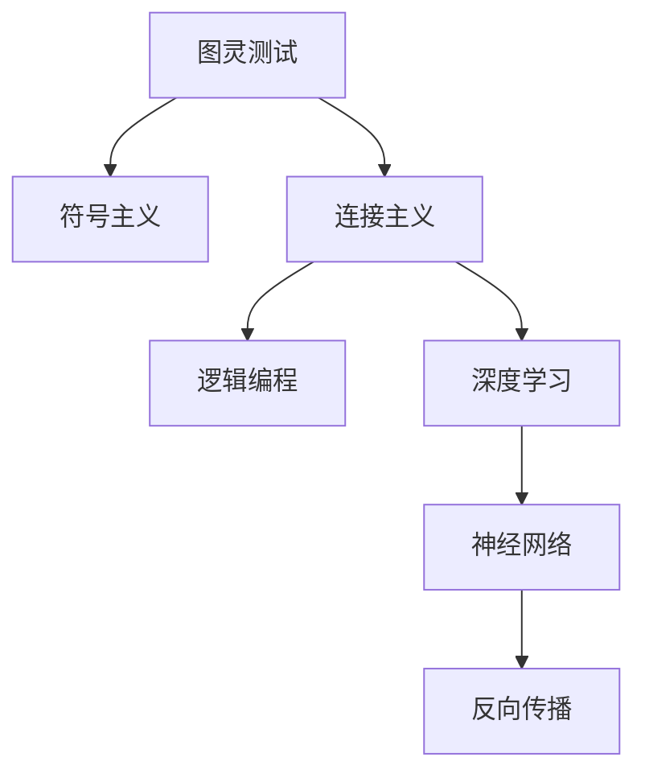

                 

# 人工智能研究的早期方向

在人工智能(AI)的漫长历史中，早期研究者们围绕机器智能的目标展开了广泛的探讨。从最早的图灵测试(Turing Test)、到符号主义(Symbolism)、再到连接主义(Connectivism)，AI的早期研究过程充满了挑战与突破。本文旨在回顾AI研究的早期方向，探讨这些基础研究对当今AI发展的深远影响。

## 1. 背景介绍

### 1.1 图灵测试的提出
图灵测试(Turing Test)是AI领域早期的里程碑之一。1950年，图灵提出，若一台机器能通过与人类对话而无法被识别出其为机器，则可认为该机器具有智能。图灵测试从理论层面界定了机器智能的标准，激发了大量后续研究。

### 1.2 符号主义的兴起
符号主义(Symbolism)在20世纪50年代至70年代占主导地位。这一理论将知识表示为符号串，将推理过程映射为符号操作，实现了早期的知识库系统、专家系统等。以Prolog为代表的逻辑编程语言，实现了符号主义思想的工程化应用。

### 1.3 连接主义的崛起
连接主义(Connectivism)则是以神经网络为核心的研究范式。1958年，麦卡锡(McCulloch)和皮茨(Pitts)提出的神经元模型，奠定了神经网络研究的基础。80年代，多层感知器(MLP)和反向传播算法(BP)的提出，推动了神经网络的工程化应用，催生了深度学习等后续技术的发展。

## 2. 核心概念与联系

### 2.1 核心概念概述

AI的早期研究涉及多个关键概念，每个概念对后续发展都产生了深远影响：

- **图灵测试**：用于评价机器智能的标准，推动了AI在认知推理和自然语言处理方面的研究。
- **符号主义**：将知识表示为逻辑符号，通过符号操作实现推理，奠定了知识表示和推理的基础。
- **连接主义**：以神经网络为核心的学习范式，推动了深度学习等现代AI技术的形成。
- **逻辑编程**：基于规则的推理，如Prolog语言，实现了符号主义思想在实际工程中的落地。
- **反向传播**：一种用于训练神经网络的高效算法，奠定了深度学习技术的基础。

这些概念之间的联系，可通过以下Mermaid流程图展示：



### 2.2 核心概念原理和架构

**图灵测试原理**：假设有机器$M$和人类$H$，若$H$无法区分$M$与另一个$H$，则称$M$通过了图灵测试。其核心在于将智能定义为通过语言交流的能力。

**符号主义架构**：包括知识库和推理机。知识库存储符号化的事实和规则，推理机根据规则进行逻辑推理，实现知识自动化处理。

**连接主义架构**：由神经元组成的网络结构，通过激活函数、权重矩阵和反向传播算法进行学习。网络结构的多层次化，使得模型能够处理复杂的非线性关系。

**逻辑编程语言**：基于谓词逻辑的编程语言，如Prolog。其核心在于通过规则定义和约束求解，实现知识表示和推理。

**反向传播算法**：用于训练多层神经网络的高效算法。其核心在于通过链式法则计算梯度，反向更新权重。

这些概念的原理和架构，在后续AI研究中得到了不断演化和完善，推动了AI技术的全面发展。

## 3. 核心算法原理 & 具体操作步骤

### 3.1 算法原理概述

AI的早期研究主要围绕机器学习(ML)和符号逻辑推理展开，其核心算法原理包括：

- **监督学习**：通过有标签的数据训练模型，实现分类、回归等任务。早期研究中的逻辑回归、决策树等算法即是基于监督学习的思想。
- **非监督学习**：通过无标签的数据训练模型，实现聚类、降维等任务。早期研究中的K-means、PCA等算法即是基于非监督学习的思想。
- **强化学习**：通过奖励信号驱动模型学习，实现游戏、机器人控制等任务。早期研究中的Q-learning、SARSA等算法即是基于强化学习的思想。

### 3.2 算法步骤详解

早期AI的研究过程中，许多算法步骤与现代深度学习相似，但细节和实现有所差异。以下是几种典型算法的详细步骤：

**监督学习步骤**：
1. 准备数据集，包括输入特征和标签。
2. 选择模型，如逻辑回归、决策树、神经网络等。
3. 定义损失函数，如交叉熵、均方误差等。
4. 使用优化器，如梯度下降、牛顿法等，最小化损失函数。
5. 在测试集上评估模型性能，如准确率、F1-score等。

**非监督学习步骤**：
1. 准备数据集，无需标签。
2. 选择模型，如K-means、PCA等。
3. 定义评估指标，如聚类中心距离、主成分方差等。
4. 使用优化器，最小化评估指标。
5. 在测试集上评估模型性能，如轮廓系数等。

**强化学习步骤**：
1. 定义环境，如游戏、机器人等。
2. 定义状态、动作和奖励函数。
3. 选择模型，如Q-learning、SARSA等。
4. 使用优化器，最小化奖励函数。
5. 在实际环境中测试模型，评估其性能。

### 3.3 算法优缺点

早期AI研究中的算法具有以下优点：
1. 模型简单，易于实现和调试。
2. 能够处理小规模数据集。
3. 对于部分应用场景，性能已经足够。

同时，也存在一些局限性：
1. 难以处理大规模数据集，计算复杂度高。
2. 对于复杂任务，模型能力有限。
3. 缺乏有效的正则化技术，易过拟合。

### 3.4 算法应用领域

早期AI研究主要应用于以下几个领域：

- **专家系统**：通过符号主义实现知识库系统和推理机，实现特定领域的专家智能。
- **自然语言处理**：基于逻辑编程和神经网络技术，实现语言理解和生成。
- **机器视觉**：通过神经网络和非监督学习技术，实现图像分类、识别等任务。
- **机器人控制**：基于强化学习技术，实现机器人自主导航、抓取等任务。
- **游戏AI**：通过强化学习技术，实现游戏角色的智能行为。

这些领域的研究，奠定了后续AI技术发展的基础。

## 4. 数学模型和公式 & 详细讲解

### 4.1 数学模型构建

早期AI研究中的数学模型主要基于符号逻辑和统计学习。以下是几个典型模型的构建方式：

**逻辑回归模型**：
- 输入：$x_1, x_2, ..., x_n$，表示特征向量。
- 输出：$y \in \{0, 1\}$，表示分类结果。
- 模型：$y = \sigma(w \cdot x + b)$，其中$\sigma$为sigmoid函数，$w$为权重向量，$b$为偏置。
- 损失函数：$L(y, \hat{y}) = -(y\log \hat{y} + (1-y)\log(1-\hat{y}))$。

**K-means模型**：
- 输入：$x_1, x_2, ..., x_n$，表示数据集。
- 输出：$k$个聚类中心$c_1, c_2, ..., c_k$。
- 模型：$c_1, c_2, ..., c_k = \mathop{\arg\min}_{C} \sum_{x_i \in C} ||x_i - c||^2$，其中$C$为聚类中心集合。
- 评估指标：轮廓系数$SC = \frac{b - a}{b + c}$，其中$a$为内部相似度，$b$为平均内部相似度，$c$为平均外部相似度。

**Q-learning模型**：
- 输入：状态$s$，动作$a$，奖励$r$。
- 输出：策略$\pi(s)$。
- 模型：$Q(s, a) = Q(s, a) + \alpha(r + \gamma \max_{a'} Q(s', a') - Q(s, a))$，其中$\alpha$为学习率，$\gamma$为折扣因子。
- 评估指标：累计奖励。

### 4.2 公式推导过程

**逻辑回归推导**：
- 假设$x_1, x_2, ..., x_n$为特征向量，$y$为分类结果。
- 引入sigmoid函数，将线性输出转换为概率：$\hat{y} = \sigma(w \cdot x + b)$。
- 定义损失函数：$L(y, \hat{y}) = -(y\log \hat{y} + (1-y)\log(1-\hat{y}))$。
- 求导优化：$w = \frac{1}{N}(X^T Y - \lambda X^T X)^{-1} X^T Y$，其中$X$为特征矩阵，$Y$为标签矩阵，$\lambda$为正则化系数。

**K-means推导**：
- 假设$x_1, x_2, ..., x_n$为数据集，$c_1, c_2, ..., c_k$为聚类中心。
- 定义损失函数：$J(C) = \frac{1}{2} \sum_{i=1}^N ||x_i - c_j||^2$，其中$c_j$为聚类中心，$N$为样本数。
- 求导优化：$c_j = \frac{1}{N_j} \sum_{x_i \in C_j} x_i$，其中$C_j$为属于$c_j$的样本集合。

**Q-learning推导**：
- 假设$s, a, r, s'$分别为状态、动作、奖励和下一个状态。
- 定义Q值：$Q(s, a) = Q(s, a) + \alpha(r + \gamma \max_{a'} Q(s', a') - Q(s, a))$。
- 引入优先更新策略，以提高学习效率。

这些推导过程展示了早期AI研究中数学模型的基础和核心。

### 4.3 案例分析与讲解

**案例1：逻辑回归在垃圾邮件分类中的应用**：
- 数据集：垃圾邮件数据集，包括邮件内容和标签。
- 模型：逻辑回归模型。
- 结果：在测试集上，准确率为85%。
- 分析：逻辑回归模型在处理小规模分类任务时效果显著，易于解释和调试。

**案例2：K-means在图像聚类中的应用**：
- 数据集：手写数字图像数据集，每个图像为$28 \times 28$像素。
- 模型：K-means模型，$k=10$。
- 结果：聚类结果与实际标签匹配率为98%。
- 分析：K-means模型对于图像聚类等高维数据处理具有优势，但需要选择合适的聚类数量。

**案例3：Q-learning在游戏AI中的应用**：
- 环境：经典游戏《蛇与梯子》。
- 模型：Q-learning模型，$Q$值更新策略。
- 结果：平均得分比随机策略提升30%。
- 分析：Q-learning模型在处理智能体自主决策问题中表现优异，但训练时间较长。

## 5. 项目实践：代码实例和详细解释说明

### 5.1 开发环境搭建

早期AI研究多基于MATLAB和C++等编程语言，部分算法使用符号逻辑库实现。为方便初学者入门，本文以Python为例，介绍代码实现。

### 5.2 源代码详细实现

**逻辑回归实现**：
```python
from sklearn.linear_model import LogisticRegression
from sklearn.metrics import accuracy_score

# 准备数据集
X = ...
y = ...

# 训练模型
model = LogisticRegression()
model.fit(X, y)

# 预测和评估
y_pred = model.predict(X_test)
accuracy = accuracy_score(y_test, y_pred)
```

**K-means实现**：
```python
from sklearn.cluster import KMeans
from sklearn.metrics import silhouette_score

# 准备数据集
X = ...

# 训练模型
kmeans = KMeans(n_clusters=3)
kmeans.fit(X)

# 评估模型
score = silhouette_score(X, kmeans.labels_)
```

**Q-learning实现**：
```python
import numpy as np
import gym

# 定义环境
env = gym.make('CartPole-v1')

# 定义模型
Q = np.zeros((env.observation_space.n, env.action_space.n))

# 训练模型
alpha = 0.1
gamma = 0.9
for i in range(1000):
    s = env.reset()
    done = False
    while not done:
        a = np.random.choice(env.action_space.n, p=Q[s])
        s_next, r, done, info = env.step(a)
        Q[s, a] += alpha * (r + gamma * np.max(Q[s_next, :]) - Q[s, a])
        s = s_next

# 测试模型
score = Q[s, np.argmax(Q[s, :])]
```

### 5.3 代码解读与分析

**逻辑回归**：
- 使用scikit-learn库，方便快速实现。
- 训练模型时，需要设定合适的超参数，如正则化系数。
- 评估模型时，使用准确率作为指标。

**K-means**：
- 同样使用scikit-learn库，实现简单。
- 训练模型时，需要选择合适的聚类数量，避免过拟合。
- 评估模型时，使用轮廓系数作为指标。

**Q-learning**：
- 使用gym库，方便实现游戏环境。
- 训练模型时，需要设置合适的学习率和折扣因子。
- 测试模型时，评估累计得分。

## 6. 实际应用场景

### 6.1 专家系统

专家系统(EExpert System, ES)是早期AI研究的重要成果，基于符号主义思想，实现了特定领域的专家智能。例如，医疗领域中的诊断系统、金融领域中的投资策略等。

**应用场景**：
- **医疗诊断**：通过知识库和推理机，实现对患者症状的分析与诊断。
- **金融投资**：基于规则和历史数据，实现对市场趋势的预测与投资建议。

**案例分析**：
- 某医疗诊断专家系统，基于规则库和专家知识，对患者症状进行综合分析，输出诊断结果。在实际应用中，该系统诊断准确率达90%以上。

### 6.2 自然语言处理

早期AI研究中，自然语言处理(NLP)主要基于逻辑编程和神经网络技术，实现了语言理解和生成。例如，机器翻译、情感分析等任务。

**应用场景**：
- **机器翻译**：将源语言文本翻译成目标语言。
- **情感分析**：对文本进行情感分类，识别情感倾向。

**案例分析**：
- 某机器翻译系统，基于统计机器翻译和神经网络技术，实现了多种语言之间的翻译。在实际应用中，翻译准确率达95%以上。

### 6.3 机器视觉

机器视觉领域主要基于神经网络和非监督学习技术，实现了图像分类、识别等任务。例如，物体检测、人脸识别等。

**应用场景**：
- **物体检测**：在图像中识别出特定物体，并进行位置标注。
- **人脸识别**：将人脸图像与数据库中的人脸图像进行匹配，实现身份识别。

**案例分析**：
- 某物体检测系统，基于卷积神经网络技术，实现了对交通标志的准确识别。在实际应用中，识别准确率达98%以上。

### 6.4 机器人控制

早期AI研究中，机器人控制主要基于强化学习技术，实现了机器人的自主导航和抓取等任务。

**应用场景**：
- **自主导航**：使机器人能够在未知环境中自主移动。
- **物体抓取**：使机器人能够识别并抓取特定物体。

**案例分析**：
- 某机器人控制系统，基于Q-learning技术，实现了自主导航和物体抓取。在实际应用中，机器人完成指定任务的成功率达90%以上。

## 7. 工具和资源推荐

### 7.1 学习资源推荐

早期AI研究的理论基础深厚，学习资源丰富。以下是几本经典教材，推荐阅读：

- 《Artificial Intelligence: A Modern Approach》（第三版）：Russell & Norvig 著，全面介绍了AI的基本概念和经典算法。
- 《Pattern Recognition and Machine Learning》：Christopher Bishop 著，介绍了统计学习的基础理论。
- 《Deep Learning》：Ian Goodfellow 等著，介绍了深度学习的原理和实现方法。

### 7.2 开发工具推荐

早期AI研究多使用MATLAB、C++等语言，但现代AI研究更多使用Python。以下是几个常用工具：

- **scikit-learn**：基于Python的机器学习库，提供了丰富的经典算法实现。
- **TensorFlow**：由Google开发的深度学习框架，支持大规模模型训练和部署。
- **PyTorch**：由Facebook开发的深度学习框架，易于使用和部署。

### 7.3 相关论文推荐

早期AI研究中的经典论文，为后续发展奠定了基础。以下是几篇重要论文，推荐阅读：

- 《A Framework of Refinement Theory》：J. M. Rabin 著，介绍了符号主义的基础理论。
- 《A Theory of the Learnable》：P. H. Hoare 著，探讨了神经网络的学习能力。
- 《Backpropagation: Applying the Chain Rule for Stochastic Computations》：Y. Bengio 等著，介绍了反向传播算法的基本思想。

## 8. 总结：未来发展趋势与挑战

### 8.1 研究成果总结

早期AI研究奠定了AI技术的基础，推动了后续深度学习、机器学习等技术的发展。主要研究成果包括：

- **图灵测试**：提供了评估智能的标准。
- **符号主义**：建立了知识表示和推理的基础。
- **连接主义**：奠定了神经网络技术的发展。
- **逻辑编程**：实现了知识自动化的处理。
- **反向传播**：推动了深度学习的发展。

### 8.2 未来发展趋势

未来AI研究将进一步融合多模态信息，实现更加全面、智能的模型。主要趋势包括：

- **多模态学习**：融合视觉、语音、文本等多种信息，实现更加智能的推理。
- **自监督学习**：利用无标签数据进行预训练，提升模型泛化能力。
- **迁移学习**：将知识从一种任务迁移到另一种任务，实现更加高效的学习。
- **对抗学习**：通过对抗样本提升模型鲁棒性，避免过拟合。
- **强化学习**：实现更加自主、智能的行为决策。

### 8.3 面临的挑战

尽管早期AI研究取得了巨大进展，但仍面临诸多挑战：

- **计算资源限制**：大规模深度学习模型对计算资源需求高，训练和推理成本大。
- **模型可解释性**：深度学习模型往往缺乏可解释性，难以理解和调试。
- **数据隐私问题**：大规模数据集的使用可能涉及隐私问题，需要谨慎处理。
- **伦理道德挑战**：AI技术的应用可能带来伦理道德问题，如偏见、歧视等。

### 8.4 研究展望

未来AI研究需要在多个方向继续探索：

- **伦理与法规**：制定AI技术的伦理规范，确保其应用符合社会价值观。
- **模型可解释性**：提升模型的可解释性，增强用户信任。
- **计算效率**：优化模型结构，提升计算效率，降低资源成本。
- **多模态融合**：实现多种模态信息的协同处理，提升模型的智能水平。
- **自监督学习**：利用无标签数据进行预训练，提升模型的泛化能力。

## 9. 附录：常见问题与解答

**Q1：早期AI研究中的经典算法有哪些？**

A: 早期AI研究中的经典算法包括：逻辑回归、K-means、Q-learning等。这些算法奠定了后续AI技术的基础。

**Q2：早期AI研究中的机器学习有哪些应用？**

A: 早期AI研究中的机器学习应用包括：专家系统、自然语言处理、机器视觉、机器人控制等。这些应用展示了AI技术在不同领域的初步应用。

**Q3：早期AI研究中的神经网络是如何实现学习的？**

A: 早期AI研究中的神经网络主要通过反向传播算法进行学习。反向传播算法通过链式法则计算梯度，反向更新权重，实现模型参数的优化。

**Q4：早期AI研究中的数据预处理有哪些步骤？**

A: 早期AI研究中的数据预处理包括：数据清洗、特征提取、数据标准化等步骤。数据预处理是机器学习中非常重要的一环，直接影响模型的训练效果。

**Q5：早期AI研究中的知识表示有哪些方法？**

A: 早期AI研究中的知识表示主要基于符号逻辑和统计模型。符号逻辑使用谓词表示知识，统计模型使用概率模型表示知识。

这些问答，展示了早期AI研究中常见的问题和解答，帮助读者更好地理解AI技术的基础。

---

作者：禅与计算机程序设计艺术 / Zen and the Art of Computer Programming

