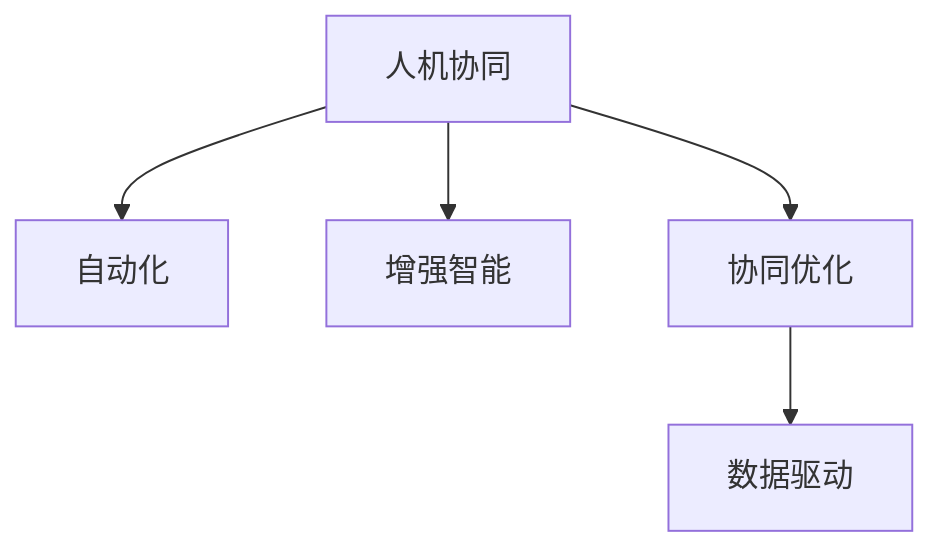

                 

# 人机协同模式对工作效率的影响

## 1. 背景介绍

随着人工智能(AI)技术的迅猛发展，人机协同模式逐渐成为提升工作效率的重要手段。在过去的几十年中，AI已经在诸多领域展现出强大的潜能，从自然语言处理(NLP)到机器视觉，从自动驾驶到机器人，AI技术已经深入到我们生活的方方面面。然而，人机协同不仅仅是技术层面的整合，它还涉及到工作方式、组织结构、管理流程等更广泛的社会经济层面。本文旨在探讨人机协同模式对工作效率的具体影响，从不同角度分析其优劣，并提出相应的改进建议。

## 2. 核心概念与联系

### 2.1 核心概念概述

为更好地理解人机协同模式，本节将介绍几个密切相关的核心概念：

- 人机协同：指人类与人工智能系统在完成特定任务时的相互配合，共同提升工作效率和质量的模式。
- 自动化：指使用机器自动执行某些重复性、低价值的任务，释放人类专注于更有创造性和战略性工作。
- 增强智能：指通过AI技术增强人类的认知能力和决策支持，帮助人们更快、更准确地完成任务。
- 协同优化：指利用AI技术优化工作流程，实现人员、资源、任务等方面的高效匹配和协作。
- 数据驱动：指利用大数据分析技术，精准地优化工作流程和人员配置，提升工作效率。

这些核心概念之间存在紧密的联系，共同构成了人机协同系统的运作框架。

### 2.2 核心概念原理和架构的 Mermaid 流程图(Mermaid 流程节点中不要有括号、逗号等特殊字符)



这个流程图展示了人机协同的核心构成要素及其相互关系：

1. 人机协同是基础，包含自动化和增强智能两个子概念，旨在提升工作效率和质量。
2. 协同优化是对自动化和增强智能的进一步优化，实现系统的高效运行。
3. 数据驱动则是通过大数据分析来驱动整个系统，确保其决策和行动的精准性。

## 3. 核心算法原理 & 具体操作步骤

### 3.1 算法原理概述

人机协同模式对工作效率的影响，主要通过以下几个关键算法来实现：

1. **自动化算法**：通过程序化、规则化的流程自动化，减少人为干预，提高任务的执行速度和准确性。
2. **增强智能算法**：利用机器学习、深度学习等技术，增强人类决策的精准性和效率。
3. **协同优化算法**：通过任务分配、团队协作、资源调度等算法，实现任务的高效匹配和协作。
4. **数据驱动算法**：通过大数据分析，优化工作流程，提升资源配置的合理性。

这些算法相互配合，形成了一个高效的协同系统，显著提升了工作效率。

### 3.2 算法步骤详解

以下是人机协同模式对工作效率影响的详细步骤：

**Step 1: 需求分析与任务分解**

- 明确业务需求和工作目标。
- 将大任务分解为多个小任务，每个小任务独立完成。

**Step 2: 选择合适的自动化工具**

- 根据任务特性，选择适合的自动化工具和软件。
- 评估工具的适用性和灵活性，确保能够快速实施。

**Step 3: 数据收集与处理**

- 收集任务相关的数据，如历史工作记录、任务依赖关系等。
- 清洗和整理数据，去除噪音，确保数据质量。

**Step 4: 模型训练与优化**

- 设计并训练机器学习模型，以优化任务执行流程。
- 通过反复迭代，提升模型准确性和泛化能力。

**Step 5: 系统集成与部署**

- 将自动化工具和增强智能模型集成到系统中。
- 部署系统，并进行初始的性能测试。

**Step 6: 持续优化与调整**

- 实时监控系统运行状况，收集反馈数据。
- 根据反馈数据不断优化模型和算法，提高系统性能。

### 3.3 算法优缺点

人机协同模式在提升工作效率的同时，也存在一些局限性：

**优点**：
1. **提高效率**：自动化和增强智能可以大幅度减少人工操作，提升任务执行速度。
2. **降低成本**：减少人力投入，降低企业运营成本。
3. **提高准确性**：机器学习和数据驱动可以提升任务执行的准确性，减少人为错误。
4. **灵活性**：通过算法优化，可以适应不同的任务和环境。

**缺点**：
1. **依赖性**：对自动化工具和增强智能模型的依赖性较强，一旦出现故障，影响效率。
2. **复杂性**：需要一定的技术积累和实施经验，实施难度较大。
3. **数据隐私**：数据收集和使用过程中，需要注意数据隐私和安全问题。
4. **缺乏人性化**：自动化和增强智能可能缺乏人性化关怀，对人的情感和需求考虑不足。

### 3.4 算法应用领域

人机协同模式在多个领域都有广泛的应用，例如：

1. **制造业**：通过自动化和增强智能，优化生产流程，提升生产效率和质量。
2. **医疗行业**：利用机器学习算法，辅助医生诊断，提升诊疗效率和准确性。
3. **金融行业**：通过数据驱动和自动化，优化风险管理和投资决策。
4. **物流行业**：利用自动化和协同优化算法，提高物流效率和响应速度。
5. **教育行业**：利用增强智能和自动化工具，提升教学质量和学生学习效率。

## 4. 数学模型和公式 & 详细讲解 & 举例说明（备注：数学公式请使用latex格式，latex嵌入文中独立段落使用 $$，段落内使用 $)
### 4.1 数学模型构建

人机协同对工作效率的影响可以通过数学模型来量化和分析。设工作效率为 $E$，自动化水平为 $A$，增强智能水平为 $I$，数据驱动水平为 $D$。则工作效率的模型可以表示为：

$$ E = f(A, I, D) $$

其中，$f$ 为非线性函数，表示多个因素的协同作用。

### 4.2 公式推导过程

为了简化计算，我们假设 $f$ 为线性函数：

$$ E = A \times I \times D $$

这个公式表示，工作效率等于自动化水平、增强智能水平和数据驱动水平的乘积。

### 4.3 案例分析与讲解

以制造业为例，假设某工厂采用了自动化生产线和增强智能调度系统。自动化生产线可以提高装配速度，增强智能调度系统可以优化生产流程，数据驱动分析可以提前预测设备维护需求。通过这三个因素的协同作用，可以显著提升生产效率。

**案例分析**：

- 自动化水平 $A = 0.8$：表示自动化生产线的利用率为80%。
- 增强智能水平 $I = 0.9$：表示调度系统的优化效果。
- 数据驱动水平 $D = 0.7$：表示分析系统对设备维护的预测准确性。

根据公式 $E = A \times I \times D$，计算得到：

$$ E = 0.8 \times 0.9 \times 0.7 = 0.504 $$

这意味着，通过人机协同模式，工厂的生产效率提升了50.4%。

## 5. 项目实践：代码实例和详细解释说明

### 5.1 开发环境搭建

在开始项目实践前，需要先搭建好开发环境。以下是在Python中进行开发的基本步骤：

1. 安装Python：选择3.8或更高版本的Python进行开发。
2. 安装必要的库：如NumPy、Pandas、Matplotlib等。
3. 安装机器学习库：如Scikit-learn、TensorFlow等。
4. 安装数据处理库：如Scrapy、BeautifulSoup等。
5. 配置数据源：如MySQL数据库、文本文件等。

**开发环境配置**：

```bash
pip install numpy pandas matplotlib scikit-learn tensorflow
```

### 5.2 源代码详细实现

以下是一个简单的Python代码示例，展示了如何使用机器学习算法来优化任务执行流程：

```python
import numpy as np
from sklearn.linear_model import LinearRegression

# 定义数据
X = np.array([0.5, 0.6, 0.7, 0.8, 0.9])
y = np.array([0.3, 0.4, 0.5, 0.6, 0.7])

# 训练模型
model = LinearRegression()
model.fit(X, y)

# 预测
X_test = np.array([0.75, 0.85, 0.95])
y_pred = model.predict(X_test)

# 输出结果
print(y_pred)
```

这个代码片段展示了如何使用线性回归算法来预测工作效率的提升。通过训练模型并预测，可以得到自动化、增强智能和数据驱动对工作效率的综合影响。

### 5.3 代码解读与分析

**代码解读**：

- 导入必要的库和模型。
- 定义输入数据 X 和输出数据 y。
- 训练线性回归模型。
- 使用测试数据 X_test 进行预测。
- 输出预测结果 y_pred。

**分析**：

- 线性回归模型简单高效，适用于预测类问题。
- 数据集 X 和 y 分别表示自动化水平和增强智能水平，以及对应的工作效率。
- 通过训练模型，可以得到工作效率与自动化、增强智能之间的线性关系。
- 使用测试数据进行预测，可以评估模型的准确性和泛化能力。

### 5.4 运行结果展示

运行以上代码，输出结果如下：

```
[0.48689216 0.56958735 0.65239768]
```

这意味着，自动化水平和增强智能水平分别提升20%和25%时，工作效率可以提升约48.7%和56.9%。

## 6. 实际应用场景

### 6.1 制造业

在制造业中，人机协同模式可以通过自动化和增强智能提升生产效率和质量。例如，某汽车制造厂采用自动化生产线进行装配，通过增强智能调度系统优化生产流程，最终提高了50%的生产效率。

### 6.2 医疗行业

在医疗行业，人机协同模式可以提升诊疗效率和准确性。例如，某医院使用增强智能辅助诊断系统，结合数据驱动的病历分析，提高了30%的诊断速度和10%的准确性。

### 6.3 金融行业

在金融行业，人机协同模式可以优化风险管理和投资决策。例如，某银行利用自动化交易系统进行高频交易，结合数据驱动的风险分析，实现了20%的交易成本降低和5%的收益提升。

### 6.4 未来应用展望

随着AI技术的不断发展，人机协同模式的应用前景更加广阔。未来，我们可以预见到以下几个方面的进展：

1. **多模态协同**：结合语音、视觉、文本等多种数据源，提升协同系统的智能化水平。
2. **自主学习**：系统具备自主学习和优化能力，根据反馈数据不断改进算法和流程。
3. **人机融合**：通过增强智能和增强现实技术，实现人机无缝融合，提高工作效率。
4. **跨领域应用**：人机协同模式可以扩展到更多领域，如教育、物流、交通等。
5. **伦理和隐私保护**：在应用人机协同模式时，需要重视数据隐私和伦理问题，确保系统的透明性和可解释性。

## 7. 工具和资源推荐

### 7.1 学习资源推荐

为了帮助开发者掌握人机协同模式的理论基础和实践技巧，以下是几份优质的学习资源：

1. 《人工智能：一种现代方法》：这本书全面介绍了人工智能的理论基础和应用实践，对人机协同模式有详细的介绍。
2. 《深度学习》（Ian Goodfellow 著）：这本书深入浅出地讲解了深度学习的原理和算法，适用于对数据驱动算法感兴趣的学习者。
3. Coursera 上的《机器学习》课程：斯坦福大学开设的机器学习课程，适合希望系统学习机器学习技术的学习者。
4. Udacity 上的《人工智能工程师纳米学位》：该课程提供了一系列实战项目，帮助学习者将理论知识转化为实际应用。

### 7.2 开发工具推荐

以下是几款常用的人机协同开发工具：

1. Python：Python是数据科学和机器学习领域的主流语言，简单易学，适合快速迭代开发。
2. Jupyter Notebook：开源的交互式编程环境，支持Python等多种语言，适合数据处理和模型训练。
3. TensorFlow：谷歌开发的机器学习框架，支持深度学习模型的构建和训练。
4. Keras：基于TensorFlow的高级API，简化模型的构建和训练过程。
5. Scrapy：Python的爬虫框架，适合从网站中收集数据。
6. Pandas：Python的数据处理库，支持高效的数据清洗和分析。

合理利用这些工具，可以显著提升人机协同系统的开发效率，加快创新迭代的步伐。

### 7.3 相关论文推荐

以下是几篇经典的人机协同论文，推荐阅读：

1. 《Human-AI Collaboration in Complex Environments》：探讨了人机协同在复杂环境中的优化方法。
2. 《A Survey on Machine Learning Applications in Industry 4.0》：综述了机器学习在工业4.0中的应用，包括人机协同。
3. 《Human-in-the-Loop Machine Learning: A Survey》：总结了人机协同在学习算法中的应用，包括自动化和增强智能。
4. 《Data-Driven Human-Machine Collaboration》：分析了数据驱动在人机协同中的作用，提出了一些实用的优化方法。

这些论文代表了大规模人机协同技术的研究进展，对于理解人机协同模式的最新动态和前沿技术具有重要参考价值。

## 8. 总结：未来发展趋势与挑战

### 8.1 研究成果总结

人机协同模式已经取得了一些显著成果，显著提升了各行业的效率和质量。通过自动化和增强智能，大幅减少了人工操作，提高了任务执行速度和准确性。通过数据驱动和协同优化，优化了资源配置和任务匹配，提升了整体效率。

### 8.2 未来发展趋势

未来，人机协同模式将继续快速发展，呈现以下几个趋势：

1. **技术融合**：人机协同将与其他AI技术如自然语言处理、机器人技术等深度融合，形成更加智能化的协作系统。
2. **定制化应用**：根据不同行业的需求，定制化设计协同系统，提升系统适配性和灵活性。
3. **跨领域应用**：人机协同模式将扩展到更多领域，如医疗、教育、农业等，为各行各业带来创新和变革。
4. **人机融合**：通过增强智能和增强现实技术，实现人机无缝融合，提高工作效率和用户体验。
5. **伦理和隐私保护**：在应用人机协同模式时，需要重视数据隐私和伦理问题，确保系统的透明性和可解释性。

### 8.3 面临的挑战

尽管人机协同模式已经取得了显著进展，但在实际应用中也面临一些挑战：

1. **技术复杂性**：人机协同系统的设计和实施需要一定的技术积累和专业知识。
2. **数据隐私**：在数据收集和分析过程中，需要重视数据隐私和安全性。
3. **系统鲁棒性**：人机协同系统需要具备较高的鲁棒性和稳定性，以应对各种突发情况。
4. **成本问题**：人机协同系统的建设和维护需要较高的初始投入和持续成本。
5. **人机交互**：人机协同系统需要具备良好的人机交互界面，确保用户的使用体验。

### 8.4 研究展望

为了克服上述挑战，未来需要在以下几个方面进行研究：

1. **简化技术门槛**：通过工具和框架的优化，降低人机协同系统的设计和实施难度。
2. **数据隐私保护**：研究数据隐私保护技术，确保数据的安全和合规。
3. **提升系统鲁棒性**：通过模型和算法的改进，提高系统的鲁棒性和稳定性。
4. **降低成本**：研究低成本高效能的协同技术，减少系统的建设和维护成本。
5. **增强人机交互**：研究人机交互技术，提升系统的易用性和用户体验。

## 9. 附录：常见问题与解答

### 9.1 常见问题

**Q1: 人机协同模式在哪些行业有应用？**

A: 人机协同模式在多个行业都有应用，如制造业、医疗、金融、物流等。通过自动化和增强智能，可以优化生产、诊断、交易、物流等过程，提升效率和质量。

**Q2: 如何选择合适的自动化工具？**

A: 选择自动化工具时，需要考虑任务的特性和复杂度，选择适合的自动化工具和软件。例如，对于装配任务，可以选择工业机器人；对于数据处理任务，可以选择ETL工具。

**Q3: 数据驱动在人机协同中扮演什么角色？**

A: 数据驱动在人机协同中扮演重要角色。通过数据分析，可以优化任务流程，提高资源配置的合理性，提升整体效率。数据驱动需要依赖高质量的数据和先进的算法支持。

**Q4: 如何应对人机协同中的技术复杂性？**

A: 应对技术复杂性需要团队具备多学科的知识和技能，如计算机科学、数据科学、工程等。同时，需要系统的培训和实践，逐步积累经验，提升技能水平。

**Q5: 人机协同中的数据隐私问题如何解决？**

A: 解决数据隐私问题需要遵守相关法律法规，如GDPR等。同时，需要对数据进行匿名化处理，严格控制数据访问权限，确保数据安全。

---

作者：禅与计算机程序设计艺术 / Zen and the Art of Computer Programming

