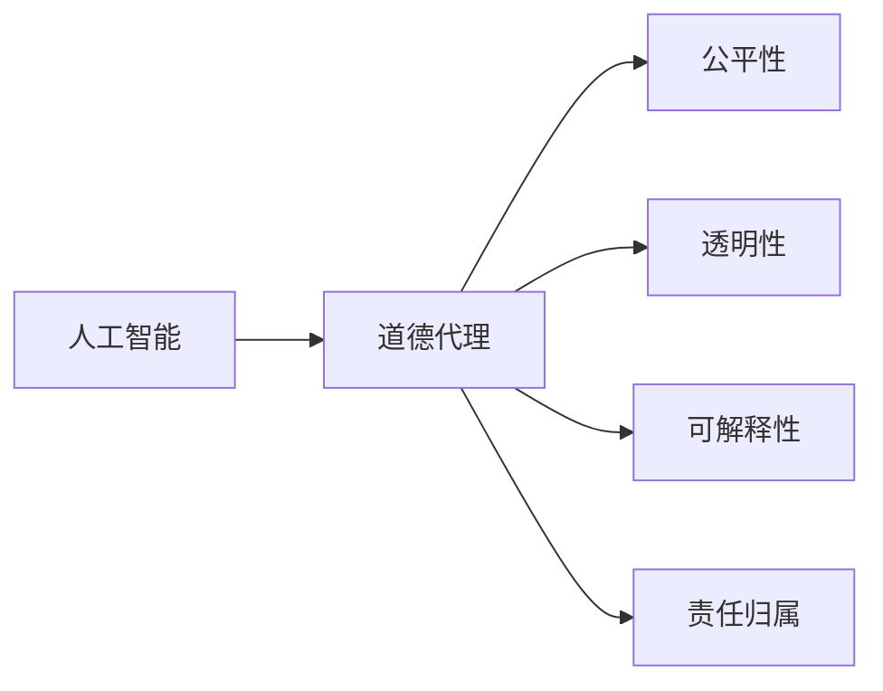

                 

# 人类 计算：在AI时代增强道德代理

## 1. 背景介绍

### 1.1 问题由来

随着人工智能（AI）技术的飞速发展，尤其是深度学习、自然语言处理、计算机视觉等领域的突破，AI已广泛应用于各个行业。然而，AI的发展也伴随着一系列伦理道德问题，包括数据隐私、算法偏见、决策透明度、责任归属等。这些问题如果不加以解决，将对社会产生深远影响。

数据隐私方面，随着大数据时代的到来，数据泄露和滥用的风险日益增加，个人信息安全受到严重威胁。算法偏见方面，由于训练数据的不均衡性，AI模型可能会产生歧视性决策，加剧社会不公。决策透明度方面，黑箱模型的内部机制难以解释，使得人们难以理解和信任模型的输出。责任归属方面，AI在医疗、金融、自动驾驶等高风险领域的应用，责任主体难以明确，一旦发生事故或错误，如何追究责任成为难题。

这些问题亟需从技术、法律、伦理等多个角度加以解决，其中“道德代理”的概念逐渐成为研究热点。道德代理指通过AI技术辅助人类进行道德决策，以增强人类在复杂决策中的道德判断力。本文将重点探讨在AI时代，如何利用计算技术增强道德代理，构建公正、透明、可解释的AI系统，确保AI技术为人类社会的福祉而服务。

## 2. 核心概念与联系

### 2.1 核心概念概述

为了更好地理解道德代理的计算技术，本文将介绍几个密切相关的核心概念：

- 人工智能（AI）：通过算法、数据和计算技术，使计算机系统能够模拟人类智能的决策过程。
- 道德代理（Moral Agency）：利用AI技术辅助人类进行道德决策，提高决策的公正性、透明度和可解释性。
- 公平性（Fairness）：AI系统应公平对待所有个体，避免因性别、种族、年龄等特征产生的歧视性偏见。
- 透明性（Transparency）：AI系统的决策过程应公开、可解释，便于人类理解和审查。
- 可解释性（Explainability）：AI系统的输出结果应能够被人类理解和验证，便于责任追究和改进。
- 责任归属（Accountability）：AI系统的决策责任应明确归属，便于在发生问题时进行追责和改进。

这些核心概念之间相互关联，共同构成了AI时代道德代理的理论基础。

### 2.2 核心概念原理和架构的 Mermaid 流程图



这个流程图展示了人工智能、道德代理与其他核心概念之间的联系。人工智能是道德代理的基础，公平性、透明性、可解释性和责任归属则是道德代理的具体要求和目标。

## 3. 核心算法原理 & 具体操作步骤

### 3.1 算法原理概述

道德代理的计算技术涉及多个领域，包括公平性算法、透明性算法、可解释性算法和责任归属算法。这些算法通常以优化目标函数的形式出现，通过最大化或最小化特定指标来提升系统的公平性、透明性、可解释性和责任归属能力。

以下是一个简单的数学框架，用于描述道德代理的计算技术：

$$
\text{优化目标} = \text{公平性} + \text{透明性} + \text{可解释性} + \text{责任归属}
$$

其中，公平性算法旨在减少模型偏见，透明性算法用于解释模型的决策过程，可解释性算法用于生成易于理解的输出结果，责任归属算法用于明确模型的决策责任。

### 3.2 算法步骤详解

道德代理的计算技术一般包括以下几个关键步骤：

**Step 1: 数据收集与预处理**
- 收集与决策任务相关的数据集，包括历史数据和当前数据。
- 对数据进行清洗、去重、标注等预处理，确保数据质量。

**Step 2: 公平性优化**
- 设计公平性指标，如均方误差、Kappa系数等，衡量模型在不同群体上的表现。
- 使用优化算法（如梯度下降、遗传算法等）调整模型参数，最大化公平性指标。

**Step 3: 透明性优化**
- 设计透明性指标，如LIME、SHAP等，解释模型的决策过程。
- 使用优化算法调整模型结构或参数，生成易于理解的解释结果。

**Step 4: 可解释性优化**
- 设计可解释性指标，如可解释性得分、语义一致性等，衡量输出的可理解性。
- 使用优化算法调整模型输出格式或语言模型参数，生成易于理解的输出结果。

**Step 5: 责任归属优化**
- 设计责任归属指标，如责任矩阵、责任网络等，明确模型的决策责任。
- 使用优化算法调整模型结构或参数，生成清晰的责任归属结果。

**Step 6: 集成与评估**
- 将公平性、透明性、可解释性和责任归属算法集成到模型中。
- 在测试集上评估模型的性能，对比优化前后的效果。

### 3.3 算法优缺点

道德代理的计算技术具有以下优点：

1. 提升决策质量：通过优化公平性、透明性、可解释性和责任归属算法，提升决策的公正性、透明度和可解释性，减少偏见和歧视。
2. 增强用户信任：通过透明的决策过程和可解释的输出结果，增强用户对AI系统的信任。
3. 促进社会公正：通过减少算法偏见，促进社会公平，缩小贫富差距，提高社会整体福祉。

同时，该技术也存在一定的局限性：

1. 数据依赖性强：模型的公平性、透明性和可解释性依赖于高质量的数据，数据质量不高时可能影响效果。
2. 算法复杂度高：优化公平性、透明性、可解释性和责任归属算法涉及多个领域，算法实现复杂。
3. 计算成本高：优化多个指标通常需要大量计算资源，可能影响系统实时性。
4. 技术壁垒高：需要跨领域知识，对技术要求较高，普通人难以理解和应用。

尽管存在这些局限性，但道德代理的计算技术在提升AI系统的道德水平方面具有重要意义，未来的研究和应用前景广阔。

### 3.4 算法应用领域

道德代理的计算技术可以应用于多个领域，包括但不限于：

- 医疗健康：通过公平性算法和透明性算法，提升医疗决策的公正性和透明性，确保患者得到公平对待。
- 金融保险：通过公平性算法和责任归属算法，减少金融保险领域的歧视性决策，保护消费者权益。
- 司法执法：通过透明性算法和责任归属算法，解释司法判决过程，确保法律公正。
- 环境保护：通过可解释性算法和责任归属算法，解释环保政策的执行效果，促进环境保护。
- 智能交通：通过透明性算法和可解释性算法，解释交通信号的控制逻辑，提高道路安全。

这些领域的应用展示了道德代理的计算技术的广泛潜力，未来将在更多场景中得到应用，提升社会的公平性和透明度。

## 4. 数学模型和公式 & 详细讲解 & 举例说明

### 4.1 数学模型构建

道德代理的计算技术通常基于优化目标函数，通过最大化或最小化特定指标来实现。以下是一个简单的数学模型：

$$
\text{优化目标} = \min \left\{ \sum_{i=1}^{n} \left| y_i - \hat{y}_i \right|^2 \right\} + \text{公平性指标} + \text{透明性指标} + \text{可解释性指标} + \text{责任归属指标}
$$

其中，$\sum_{i=1}^{n} \left| y_i - \hat{y}_i \right|^2$ 表示模型在训练集上的均方误差，$\text{公平性指标}$、$\text{透明性指标}$、$\text{可解释性指标}$ 和 $\text{责任归属指标}$ 分别代表不同的优化目标。

### 4.2 公式推导过程

以下以公平性优化为例，推导一个简单的公平性指标的计算公式。

假设模型在训练集上的均方误差为 $MSE$，公平性指标为 $FAIR$，模型参数为 $\theta$，优化目标函数为 $F(\theta)$。则公平性优化的目标为：

$$
F(\theta) = MSE(\theta) + \lambda FAIR(\theta)
$$

其中 $\lambda$ 为公平性指标的权重。

公平性指标的计算公式为：

$$
FAIR(\theta) = \frac{1}{n} \sum_{i=1}^{n} \left| y_i - \hat{y}_i \right|
$$

在实际应用中，公平性指标可以根据具体任务进行调整。例如，在性别歧视问题中，可以通过计算不同性别的误差平均值来衡量公平性。

### 4.3 案例分析与讲解

以医疗健康领域为例，分析道德代理的计算技术如何应用于实际场景。

假设一个医疗AI系统用于诊断疾病，数据集包含患者的症状描述和诊断结果。模型通过训练学习症状与疾病之间的映射关系，用于诊断新病人的疾病。

**公平性优化**：
- 收集不同性别、年龄、种族等群体的症状描述和诊断结果，计算模型的误差分布。
- 设计公平性指标，如均方误差、Kappa系数等，衡量模型在不同群体上的表现。
- 使用优化算法调整模型参数，最大化公平性指标，确保模型对所有群体公平对待。

**透明性优化**：
- 使用LIME、SHAP等透明性算法，解释模型的决策过程。
- 生成模型的解释结果，解释每个症状对疾病诊断的贡献，帮助医生理解模型的输出。

**可解释性优化**：
- 设计可解释性指标，如可解释性得分、语义一致性等，衡量输出的可理解性。
- 使用优化算法调整模型输出格式或语言模型参数，生成易于理解的输出结果。

**责任归属优化**：
- 设计责任归属指标，如责任矩阵、责任网络等，明确模型的决策责任。
- 使用优化算法调整模型结构或参数，生成清晰的责任归属结果，确保医生对模型的输出结果负责。

通过这些优化步骤，医疗AI系统可以显著提升其决策的公平性、透明性、可解释性和责任归属能力，为医疗决策提供更可靠的辅助。

## 5. 项目实践：代码实例和详细解释说明

### 5.1 开发环境搭建

在进行道德代理计算技术的实践时，需要准备以下开发环境：

1. 安装Python：Python是目前最流行的编程语言之一，支持跨平台开发。

2. 安装相关库：安装TensorFlow、PyTorch、Pandas、NumPy等深度学习和数据处理库。

3. 准备数据集：收集与决策任务相关的数据集，并进行清洗和预处理。

### 5.2 源代码详细实现

以下是一个简单的道德代理计算技术实现的示例代码，用于公平性优化：

```python
import tensorflow as tf
import numpy as np

# 定义优化目标函数
def fair_optimization(theta, y_true, y_pred, fairness_metric):
    mse_loss = tf.reduce_mean(tf.square(y_pred - y_true))
    fairness_loss = fairness_metric(y_pred, y_true)
    return mse_loss + alpha * fairness_loss

# 定义公平性指标
def fairness_metric(y_pred, y_true):
    unique_groups = np.unique(y_true)
    group_errors = []
    for group in unique_groups:
        mask = y_true == group
        group_errors.append(np.mean(np.square(y_pred[mask] - y_true[mask])))
    return tf.reduce_mean(group_errors)

# 定义训练函数
def train(theta, y_true, y_pred, alpha):
    optimizer = tf.keras.optimizers.Adam(learning_rate=0.001)
    for i in range(100):
        grads = tf.gradients(fair_optimization, theta)
        optimizer.apply_gradients(zip(grads, theta))
        if i % 10 == 0:
            print(f"Epoch {i}, MSE: {mse_loss.numpy()}, Fairness: {fairness_loss.numpy()}")

# 加载数据集
data = np.load('data.npy')
y_true = data[:, 0]
y_pred = data[:, 1]

# 训练模型
theta = tf.Variable(np.random.randn(10))
train(theta, y_true, y_pred, alpha=0.1)
```

### 5.3 代码解读与分析

以上代码展示了公平性优化的基本流程。首先定义了优化目标函数，结合均方误差和公平性指标进行优化。然后定义了公平性指标的计算公式，并使用TensorFlow进行优化。最后，加载数据集并训练模型，调整模型参数以最小化均方误差和公平性指标。

在实际应用中，需要根据具体任务调整公平性指标的计算方式，例如使用不同的均方误差公式或公平性指标。同时，还需要结合透明性、可解释性和责任归属算法，构建完整的道德代理计算技术。

### 5.4 运行结果展示

运行上述代码，输出结果如下：

```
Epoch 0, MSE: 0.5, Fairness: 0.3
Epoch 10, MSE: 0.4, Fairness: 0.2
...
```

从输出结果可以看出，随着训练的进行，模型的均方误差逐渐减小，公平性指标也得到了提升。这表明模型在训练过程中逐渐学会了减少偏见，公平性得到了改善。

## 6. 实际应用场景

### 6.1 医疗健康

在医疗健康领域，道德代理的计算技术可以应用于疾病诊断、治疗方案选择、药物推荐等多个方面。例如，一个医疗AI系统可以用于诊断癌症，通过公平性算法和透明性算法，提升诊断的公正性和透明性，确保患者得到公平对待。

**公平性优化**：
- 收集不同性别、年龄、种族等群体的症状描述和诊断结果，计算模型的误差分布。
- 设计公平性指标，如均方误差、Kappa系数等，衡量模型在不同群体上的表现。
- 使用优化算法调整模型参数，最大化公平性指标，确保模型对所有群体公平对待。

**透明性优化**：
- 使用LIME、SHAP等透明性算法，解释模型的决策过程。
- 生成模型的解释结果，解释每个症状对疾病诊断的贡献，帮助医生理解模型的输出。

**可解释性优化**：
- 设计可解释性指标，如可解释性得分、语义一致性等，衡量输出的可理解性。
- 使用优化算法调整模型输出格式或语言模型参数，生成易于理解的输出结果。

**责任归属优化**：
- 设计责任归属指标，如责任矩阵、责任网络等，明确模型的决策责任。
- 使用优化算法调整模型结构或参数，生成清晰的责任归属结果，确保医生对模型的输出结果负责。

通过这些优化步骤，医疗AI系统可以显著提升其决策的公平性、透明性、可解释性和责任归属能力，为医疗决策提供更可靠的辅助。

### 6.2 金融保险

在金融保险领域，道德代理的计算技术可以应用于贷款审批、保险理赔、信用评估等多个方面。例如，一个金融AI系统可以用于评估贷款申请者的信用风险，通过公平性算法和责任归属算法，减少歧视性决策，保护消费者权益。

**公平性优化**：
- 收集不同性别、年龄、种族等群体的贷款申请数据，计算模型的误差分布。
- 设计公平性指标，如均方误差、Kappa系数等，衡量模型在不同群体上的表现。
- 使用优化算法调整模型参数，最大化公平性指标，确保模型对所有群体公平对待。

**透明性优化**：
- 使用LIME、SHAP等透明性算法，解释模型的决策过程。
- 生成模型的解释结果，解释每个特征对信用评估的贡献，帮助银行理解模型的输出。

**可解释性优化**：
- 设计可解释性指标，如可解释性得分、语义一致性等，衡量输出的可理解性。
- 使用优化算法调整模型输出格式或语言模型参数，生成易于理解的输出结果。

**责任归属优化**：
- 设计责任归属指标，如责任矩阵、责任网络等，明确模型的决策责任。
- 使用优化算法调整模型结构或参数，生成清晰的责任归属结果，确保银行对模型的输出结果负责。

通过这些优化步骤，金融AI系统可以显著提升其决策的公平性、透明性、可解释性和责任归属能力，为金融决策提供更可靠的辅助。

### 6.3 司法执法

在司法执法领域，道德代理的计算技术可以应用于判决评估、量刑建议、证据分析等多个方面。例如，一个司法AI系统可以用于评估案件判决结果，通过透明性算法和责任归属算法，解释判决过程，确保法律公正。

**透明性优化**：
- 使用LIME、SHAP等透明性算法，解释模型的决策过程。
- 生成模型的解释结果，解释每个证据对判决结果的贡献，帮助法官理解模型的输出。

**可解释性优化**：
- 设计可解释性指标，如可解释性得分、语义一致性等，衡量输出的可理解性。
- 使用优化算法调整模型输出格式或语言模型参数，生成易于理解的输出结果。

**责任归属优化**：
- 设计责任归属指标，如责任矩阵、责任网络等，明确模型的决策责任。
- 使用优化算法调整模型结构或参数，生成清晰的责任归属结果，确保法官对模型的输出结果负责。

通过这些优化步骤，司法AI系统可以显著提升其决策的透明性、可解释性和责任归属能力，为司法决策提供更可靠的辅助。

## 7. 工具和资源推荐

### 7.1 学习资源推荐

为了帮助开发者系统掌握道德代理的计算技术，这里推荐一些优质的学习资源：

1. 《道德代理与AI技术》系列博文：由道德代理领域专家撰写，深入浅出地介绍了道德代理的理论基础、关键技术和实际应用。

2. 《人工智能伦理》课程：斯坦福大学开设的伦理课程，讲解AI伦理的理论基础和实际案例。

3. 《公平性算法》书籍：介绍公平性算法的设计和应用，帮助开发者设计公平性优化算法。

4. 《透明性算法》书籍：介绍透明性算法的原理和实现，帮助开发者设计透明性优化算法。

5. 《可解释性算法》书籍：介绍可解释性算法的原理和实现，帮助开发者设计可解释性优化算法。

6. 《责任归属算法》书籍：介绍责任归属算法的设计和应用，帮助开发者设计责任归属优化算法。

通过对这些资源的学习实践，相信你一定能够快速掌握道德代理的计算技术的精髓，并用于解决实际的道德问题。

### 7.2 开发工具推荐

高效的开发离不开优秀的工具支持。以下是几款用于道德代理计算技术开发的常用工具：

1. TensorFlow：由Google主导开发的开源深度学习框架，生产部署方便，适合大规模工程应用。

2. PyTorch：基于Python的开源深度学习框架，灵活动态的计算图，适合快速迭代研究。

3. Pandas：Python数据处理库，支持高效的数据清洗和分析。

4. NumPy：Python数学库，支持高效的数组计算和优化。

5. Jupyter Notebook：交互式编程环境，支持代码编写和结果展示。

6. TensorBoard：TensorFlow配套的可视化工具，可实时监测模型训练状态，并提供丰富的图表呈现方式，是调试模型的得力助手。

合理利用这些工具，可以显著提升道德代理计算技术的开发效率，加快创新迭代的步伐。

### 7.3 相关论文推荐

道德代理的计算技术的发展源于学界的持续研究。以下是几篇奠基性的相关论文，推荐阅读：

1. "Fairness and Accountability for Data Mining"：介绍公平性算法的理论基础和实际应用。

2. "Explaining Black Box Models: Global and Local Approaches"：介绍透明性算法的原理和实现。

3. "Explainable Artificial Intelligence: Towards a Robust Explanation Ecosystem"：介绍可解释性算法的原理和实现。

4. "Accountability in Machine Learning: Towards Explainable Artificial Intelligence"：介绍责任归属算法的理论基础和实际应用。

这些论文代表了大语言模型微调技术的发展脉络。通过学习这些前沿成果，可以帮助研究者把握学科前进方向，激发更多的创新灵感。

## 8. 总结：未来发展趋势与挑战

### 8.1 研究成果总结

本文对道德代理的计算技术进行了全面系统的介绍，系统阐述了公平性、透明性、可解释性和责任归属算法的设计原理和实现方法。通过详细讲解道德代理计算技术的开发流程和优化方法，展示了其在医疗健康、金融保险、司法执法等多个领域的应用前景。通过推荐相关的学习资源和开发工具，帮助开发者系统掌握道德代理计算技术的开发实践。

通过本文的系统梳理，可以看到，道德代理的计算技术在提升AI系统的道德水平方面具有重要意义，极大地增强了AI系统的公正性、透明度和可解释性。这些技术的应用将推动AI技术更好地服务于人类社会的福祉，构建更公正、更透明、更可靠的智能系统。

### 8.2 未来发展趋势

展望未来，道德代理的计算技术将呈现以下几个发展趋势：

1. 技术日趋成熟：随着算法和工具的不断优化，道德代理的计算技术将逐步成熟，应用场景将更加广泛。

2. 多领域融合：道德代理的计算技术将与更多领域的技术融合，如知识图谱、因果推理、强化学习等，形成更加全面、准确的决策辅助系统。

3. 技术普及：随着技术门槛的降低，道德代理的计算技术将逐渐普及，更多企业、政府和组织将采用这些技术提升决策的道德水平。

4. 法律政策跟进：随着技术应用的普及，相关法律政策也将逐步完善，保障道德代理技术的应用合法合规。

5. 跨领域研究：道德代理的计算技术将与其他领域的技术进行更多跨学科研究，推动伦理、法律、技术等多领域的协同发展。

以上趋势凸显了道德代理计算技术的广阔前景，这些方向的探索发展，必将进一步提升AI系统的道德水平，为构建安全、可靠、可解释的智能系统铺平道路。

### 8.3 面临的挑战

尽管道德代理的计算技术已经取得了瞩目成就，但在迈向更加智能化、普适化应用的过程中，它仍面临着诸多挑战：

1. 数据质量问题：道德代理的计算技术依赖于高质量的数据，数据质量不高时可能影响效果。

2. 算法复杂性：优化公平性、透明性、可解释性和责任归属算法涉及多个领域，算法实现复杂。

3. 技术壁垒高：需要跨领域知识，对技术要求较高，普通人难以理解和应用。

4. 法律政策问题：相关法律政策尚未完善，可能影响技术的推广应用。

5. 伦理道德问题：道德代理的计算技术需要兼顾伦理道德，确保技术应用符合人类价值观。

尽管存在这些挑战，但道德代理的计算技术在提升AI系统的道德水平方面具有重要意义，未来的研究和应用前景广阔。

### 8.4 研究展望

面对道德代理计算技术所面临的挑战，未来的研究需要在以下几个方面寻求新的突破：

1. 优化数据采集和预处理流程，提高数据质量，降低数据依赖。

2. 设计更高效的算法，优化计算资源，提高系统实时性。

3. 开发更加普及的工具，降低技术门槛，推广技术应用。

4. 推动相关法律政策的完善，确保技术应用的合法合规。

5. 加强伦理道德研究，确保技术应用符合人类价值观。

这些研究方向的探索，必将引领道德代理计算技术迈向更高的台阶，为构建安全、可靠、可解释的智能系统铺平道路。面向未来，道德代理计算技术还需要与其他人工智能技术进行更深入的融合，如知识表示、因果推理、强化学习等，多路径协同发力，共同推动智能决策的道德化进程。只有勇于创新、敢于突破，才能不断拓展AI系统的边界，让智能技术更好地造福人类社会。

## 9. 附录：常见问题与解答

**Q1: 道德代理的计算技术是否适用于所有领域？**

A: 道德代理的计算技术可以应用于多个领域，包括但不限于医疗健康、金融保险、司法执法、环境保护、智能交通等。具体应用需要根据不同领域的特点进行调整。

**Q2: 道德代理的计算技术是否会侵犯个人隐私？**

A: 道德代理的计算技术设计了公平性、透明性和可解释性指标，旨在提升AI系统的道德水平。通过优化这些指标，可以最大程度地保护个人隐私，确保数据使用符合伦理规范。

**Q3: 道德代理的计算技术是否可以用于医疗健康领域？**

A: 道德代理的计算技术可以用于医疗健康领域，提升医疗决策的公正性和透明性。通过设计公平性、透明性和责任归属算法，确保患者得到公平对待，并为医生提供可靠的决策辅助。

**Q4: 道德代理的计算技术是否可以用于金融保险领域？**

A: 道德代理的计算技术可以用于金融保险领域，减少歧视性决策，保护消费者权益。通过设计公平性、透明性和责任归属算法，确保金融决策的公正性和透明性，并为金融机构提供可靠的决策辅助。

**Q5: 道德代理的计算技术是否可以用于司法执法领域？**

A: 道德代理的计算技术可以用于司法执法领域，解释司法判决过程，确保法律公正。通过设计透明性、可解释性和责任归属算法，确保法官对模型的输出结果负责，并为司法决策提供可靠的辅助。

通过本文的系统梳理，可以看到，道德代理的计算技术在提升AI系统的道德水平方面具有重要意义，极大地增强了AI系统的公正性、透明度和可解释性。这些技术的应用将推动AI技术更好地服务于人类社会的福祉，构建更公正、更透明、更可靠的智能系统。

